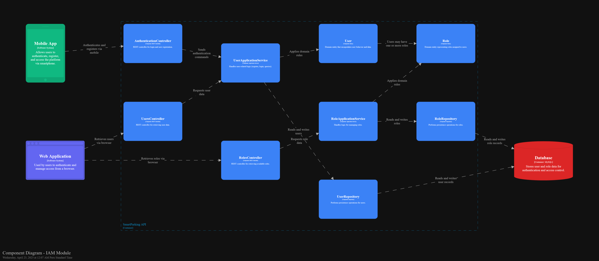
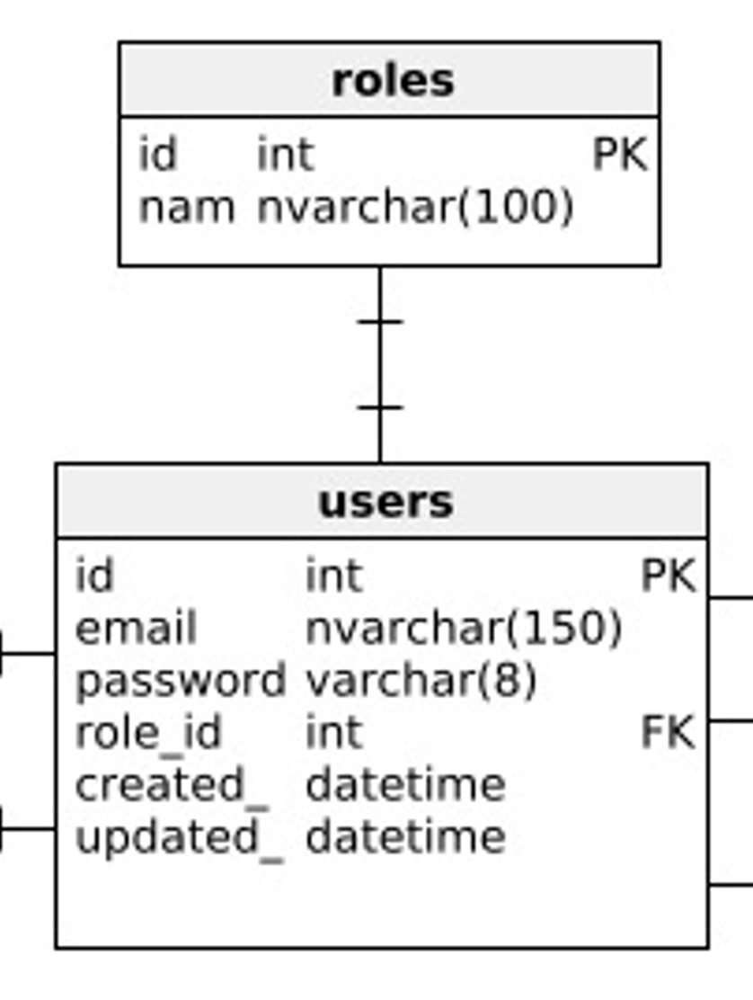
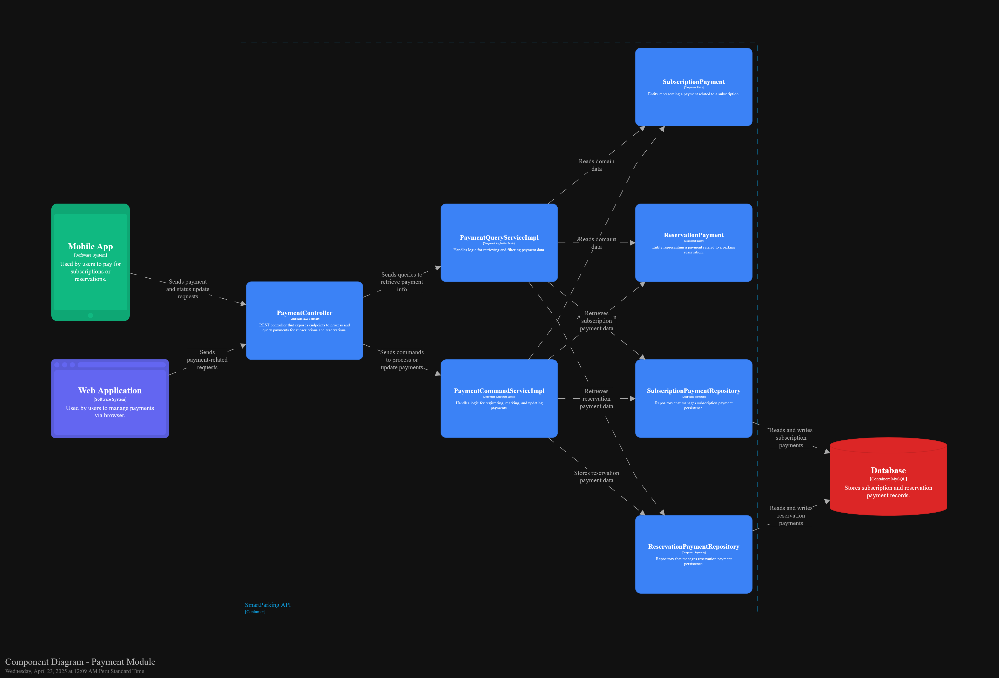
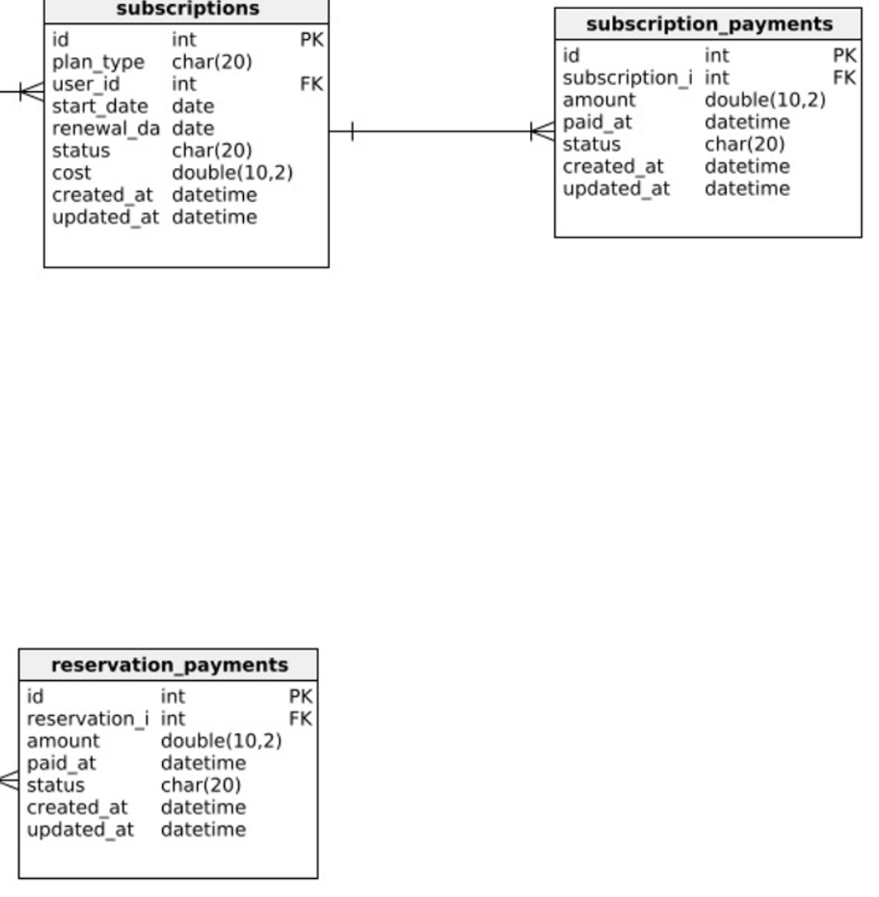

### 4.2. Tactical-Level Domain-Driven Design
#### 4.2.1. Bounded Context: Identity and Access Management
El **Bounded Context de IAM (Identity and Access Management)** está diseñado para manejar la autenticación, autorización y gestión de usuarios dentro de la aplicación. Este contexto gestiona tanto el registro como la autenticación de usuarios, así como la asignación y gestión de roles. En esta sección, se definen los componentes claves como las entidades User y Role, los controladores para la interacción con estos recursos y los servicios de aplicación y consulta que gestionan las operaciones relacionadas.
##### 4.2.1.1. Domain Layer
El **Domain Layer** es responsable de representar el núcleo del sistema de gestión de usuarios y roles. Contiene las entidades principales (como User) y su lógica de negocio, con las relaciones que gestionan la interacción con los roles y otras entidades dentro del sistema.

**Aggregate:** User

**Descripción:** Representa el agregado raíz "Usuario", que contiene los datos de la cuenta y su rol. Se mapea a la tabla users en la base de datos.

|**Atributo**|**Descripción**|**Tipo**|
| :- | :- | :- |
|email|Correo electrónico del usuario.|String|
|password|Contraseña del usuario.|String|
|roles|Conjunto de roles asociados al usuario.|Set<Role>|

**Métodos**

|**Método**|**Descripción**|
| :- | :- |
|addRole(Role role)|Añade un rol al usuario.|
|addRoles(List<Role> roles)|Añade un conjunto de roles al usuario.|
|getSerializedRoles()|Devuelve los roles del usuario como una lista de nombres serializados.|

**Entity: Role**

**Descripción:** Representa un rol dentro del sistema, asociado a un value object Roles y utilizado para definir permisos de usuario.

|**Atributo**|**Tipo**|**Descripción**|
| :- | :- | :- |
|id|Long|Identificador único del rol|
|name|Roles|Nombre del rol (value object)|

|**Método**|**Descripción**|
| :- | :- |
|getStringName()|Obtiene el nombre del rol como string|
|getDefaultRole()|Retorna el rol por defecto (ROLE\_ADMIN)|
|toRoleFromName(String name)|Crea un rol a partir de su nombre string|
|validateRoleSet(List<Role> roles)|Valida una lista de roles y asigna un rol por defecto si está vacía|

**Value Objects**

**Roles**

**Descripción:** Enumeración que representa los roles disponibles en el sistema.

|**Valor**|**Descripción**|
| :-: | :-: |
|ROLE_ADMIN|Administrador del sistema|
|ROLE_PARKING\_OWNER|Propietario de estacionamiento|
|ROLE_DRIVER|Conductor|

**Domain Services**

Los Domain Services en el bounded context IAM son interfaces que definen operaciones y reglas de negocio que no pertenecen naturalmente a una única entidad o aggregate, pero que son esenciales para mantener la lógica del dominio. Estas interfaces abstraen comportamientos relacionados con la gestión de usuarios y roles, como la autenticación, el registro, consultas y operaciones de inicialización de datos.

**RoleCommandService**

**Descripción:** Interfaz que define el contrato para los comandos relacionados con la gestión de roles dentro del dominio. Permite establecer las operaciones necesarias para crear o modificar roles sin acoplarse a una implementación específica.

|**Método**|**Descripción**|
| :-: | :-: |
|handle(SeedRolesCommand command)|Maneja la creación inicial de roles en el sistema|

**RoleQueryService**

**Descripción:** Interfaz que define las operaciones de consulta para obtener información sobre los roles registrados en el sistema. Aísla la lógica de consulta respecto de su implementación.

|**Método**|**Descripción**|
| :-: | :-: |
|handle(GetAllRolesQuery query)|Obtiene todos los roles registrados|
|handle(GetRoleByNameQuery query)|Busca un rol por su nombre|

**UserCommandService**

**Descripción:** Interfaz que establece el contrato para los comandos de gestión de usuarios dentro del dominio. Define las operaciones necesarias para registrar usuarios, autenticarlos y realizar cambios relacionados.

|**Método**|**Descripción**|
| :-: | :-: |
|handle(SignInCommand command)|Autentica a un usuario y devuelve su información junto con el token|
|handle(SignUpDriverCommand command)|Registra a un nuevo conductor|
|handle(SignUpParkingOwnerCommand command)|Registra a un nuevo propietario de estacionamiento|

**UserQueryService**

**Descripción:** Interfaz que define las operaciones de consulta relacionadas con los usuarios del sistema. Permite obtener información y verificar la existencia de usuarios de forma desacoplada.

|**Método**|**Descripción**|
| :-: | :-: |
|handle(GetAllUsersQuery query)|Obtiene todos los usuarios registrados|
|handle(GetUserByIdQuery query)|Busca un usuario por su ID|
|handle(GetUserByUsernameQuery query)|Busca un usuario por su nombre de usuario|
|handle(CheckUserByIdQuery query)|Verifica si existe un usuario con un ID específico|

##### 4.2.1.2. Interface Layer
El **Interface Layer** sirve como la capa de comunicación entre el mundo exterior (como los controladores HTTP) y la lógica del dominio. Este nivel contiene los controladores responsables de gestionar las solicitudes de los usuarios, como el inicio de sesión, registro y obtención de información de usuarios.

**Controlador AuthenticationController**

**Descripción**:
El controlador AuthenticationController se encarga de manejar las solicitudes relacionadas con la autenticación de los usuarios. A través de sus métodos, permite realizar el inicio de sesión y registro de usuarios, ya sea conductores o propietarios de estacionamientos.

|**Método**|**Descripción**|**HTTP**|**Respuesta**|
| :- | :- | :- | :- |
|signIn(SignInResource signInResource)|Maneja la solicitud de inicio de sesión.|POST /sign-in|Devuelve el recurso de usuario autenticado.|
|signUpDriver(SignUpDriverResource signUpDriverResource)|Maneja la solicitud de registro para conductores.|POST /sign-up/driver|Devuelve el recurso del usuario creado.|
|signUpParkingOwner(SignUpParkingOwnerResource signUpParkingOwnerResource)|Maneja la solicitud de registro para propietarios de estacionamientos.|POST /sign-up/parking-owner|Devuelve el recurso del usuario creado.|

**Controlador RolesController**

**Descripción**:
El controlador RolesController permite obtener la lista de todos los roles disponibles en el sistema.

|**Método**|**Descripción**|**HTTP**|**Respuesta**|
| :- | :- | :- | :- |
|getAllRoles()|Devuelve todos los roles.|GET /roles|Lista de recursos de roles.|

**Controlador UsersController**

**Descripción**:
El controlador UsersController gestiona las solicitudes para obtener información sobre los usuarios registrados en el sistema.

|**Método**|**Descripción**|**HTTP**|**Respuesta**|
| :- | :- | :- | :- |
|getAllUsers()|Devuelve todos los usuarios.|GET /users|Lista de recursos de usuarios.|
|getUserById(Long userId)|Devuelve un usuario por su ID.|GET /users/{userId}|Recurso de usuario por ID.|

##### 4.2.1.3. Application Layer
El **Application Layer** contiene la lógica necesaria para procesar las operaciones relacionadas con las entidades, como la creación de roles y usuarios, y la gestión de sus acciones. Esta capa maneja la lógica del negocio que no forma parte del dominio central, sino que orquesta las acciones entre diferentes componentes del sistema.

**Clase RoleCommandServiceImpl**

**Descripción**:
La clase RoleCommandServiceImpl se encarga de manejar los comandos relacionados con los roles. Proporciona lógica para crear roles si no existen previamente en el sistema.

|**Método**|**Descripción**|
| :- | :- |
|handle(SeedRolesCommand command)|Maneja el comando para crear roles si no existen.|

**Clase UserCommandServiceImpl**

**Descripción**:
La clase UserCommandServiceImpl maneja los comandos relacionados con las operaciones de los usuarios, como iniciar sesión y registrar nuevos usuarios.

|**Método**|**Descripción**|
| :- | :- |
|handle(SignInCommand command)|Maneja el comando para iniciar sesión de un usuario.|
|handle(SignUpDriverCommand command)|Maneja el comando para registrar un conductor.|
|handle(SignUpParkingOwnerCommand command)|Maneja el comando para registrar un propietario de estacionamiento.|

**Clase RoleQueryServiceImpl**

**Descripción**:
La clase RoleQueryServiceImpl maneja las consultas relacionadas con los roles.

|**Método**|**Descripción**|
| :- | :- |
|handle(GetAllRolesQuery query)|Devuelve todos los roles.|
|handle(GetRoleByNameQuery query)|Devuelve un rol por su nombre.|

**Clase UserQueryServiceImpl**

**Descripción**:
La clase UserQueryServiceImpl maneja las consultas relacionadas con los usuarios.

|**Método**|**Descripción**|
| :- | :- |
|handle(GetAllUsersQuery query)|Devuelve todos los usuarios.|
|handle(GetUserByIdQuery query)|Devuelve un usuario por su ID.|
|handle(GetUserByUsernameQuery query)|Devuelve un usuario por su correo electrónico.|
|handle(CheckUserByIdQuery query)|Verifica si un usuario existe por su ID.|

##### 4.2.1.4. Infrastructure Layer
La capa de infraestructura se encarga de la interacción con fuentes externas de datos, como bases de datos, APIs de terceros, o cualquier recurso que esté fuera del ámbito de la lógica de negocio del sistema. En este caso, los repositorios UserRepository y RoleRepository son responsables de la persistencia de los datos relacionados con los usuarios y roles, proporcionando métodos para validar la existencia de entidades y realizar búsquedas en la base de datos.

**Repositorio: UserRepository**

**Descripción**: Repositorio que maneja las operaciones de persistencia relacionadas con los usuarios en la base de datos.

|**Método**|**Descripción**|
| :- | :- |
|findByEmail(String email)|Busca un usuario en la base de datos utilizando su correo electrónico. Devuelve un Optional<User>.|
|existsByEmail(String email)|Verifica si un usuario con el correo electrónico especificado ya existe. Devuelve un boolean.|
|existsById(Long userId)|Verifica si un usuario con el ID especificado ya existe. Devuelve un boolean.|

**Repositorio: RoleRepository**

**Descripción**: Repositorio encargado de gestionar la persistencia de los roles del sistema.

|**Método**|**Descripción**|
| :- | :- |
|findByName(Roles name)|Busca un rol en la base de datos por su nombre. Devuelve un Optional<Role>.|
|existsByName(Roles name)|Verifica si un rol con el nombre especificado ya existe. Devuelve un boolean.|

##### 4.2.1.5. Bounded Context Software Architecture Component Level Diagrams

##### 4.2.1.6. Bounded Context Software Architecture Code Level Diagrams
El diagrama de código muestra la estructura de clases y sus relaciones dentro del contexto de IAM. 

###### 4.2.1.6.1. Bounded Context Domain Layer Class Diagrams
El diagrama de clases muestra cómo se relacionan las entidades User y Role, así como los objetos de valor asociados a ellas.

###### 4.2.1.6.2. Bounded Context Database Design Diagram
En el diagrama de base, se observa la tabla users y roles, así como la relación entre estas.

#### 4.2.2. Bounded Context: Profile Management
El Bounded Context de **Profile** es responsable de la gestión de perfiles de usuarios que interactúan con el sistema. En particular, maneja los perfiles de **Conductores (Drivers)** y **Propietarios de Estacionamientos (Parking Owners)**. Este contexto permite registrar nuevos perfiles y obtener información de los mismos mediante su userId. Las entidades principales son Driver y ParkingOwner, y su estructura está diseñada para asegurar la unicidad de identificadores clave como DNI, RUC y número de teléfono.

##### 4.2.2.1. Domain Layer
La capa de dominio encapsula las entidades centrales del sistema de perfiles y contiene la lógica de validación de atributos mediante objetos de valor. Las entidades principales son Driver y ParkingOwner, las cuales heredan de un agregado raíz auditable. Se usan objetos de valor como Phone, Dni y Ruc para encapsular lógica específica y validación.

**Aggregate:** Driver

**Descripción:** Representa el perfil de un conductor registrado.

|**Atributo**|**Descripción**|**Tipo**|
| :-: | :-: | :-: |
|fullName|Nombre completo del conductor|String|
|city|Ciudad de residencia|String|
|country|País de residencia|String|
|userId|ID del usuario (referencia a IAM)|Long|
|dni|Documento nacional de identidad|Dni|
|phone|Número de teléfono del usuario|Phone|

**Método**

|**Método**|**Descripción**|
| :-: | :-: |
|Driver(CreateDriverCommand command, Long userId)|Constructor que crea un perfil de conductor.|
|String getDni()|Devuelve el número de DNI del conductor.|
|String getPhone()|Devuelve el número telefónico del conductor.|

**Aggregate**: ParkingOwner

**Descripción:** Representa el perfil de un propietario de estacionamiento.

|**Atributo**|**Descripción**|**Tipo**|
| :-: | :-: | :-: |
|fullName|Nombre completo del propietario|String|
|city|Ciudad de operación|String|
|country|País de operación|String|
|companyName|Nombre de la empresa|String|
|userId|ID del usuario (referencia a IAM)|Long|
|ruc|Registro Único de Contribuyentes (empresa)|Ruc|
|phone|Número de teléfono|Phone|

**Método**

|**Clase**|**Método**|**Descripción**|
| :-: | :-: | :-: |
|ParkingOwner|ParkingOwner(CreateParkingOwnerCommand command, Long userId)|Constructor que crea un perfil de propietario.|
|ParkingOwner|String getPhone()|Devuelve el número telefónico del propietario.|
|ParkingOwner|String getRuc()|Devuelve el RUC de la empresa del propietario.|

**Value Objects**

**Dni**

**Descripción:**
Representa el Documento Nacional de Identidad (DNI) de un usuario. Asegura que el valor sea un número positivo de exactamente 8 dígitos.

**Atributos:**

|**Nombre**|**Tipo**|**Descripción**|
| :- | :- | :- |
|dni|String|Número de DNI con exactamente 8 dígitos|

**Métodos:**

|**Nombre**|**Descripción**|
| :- | :- |
|Dni(String dni)|Constructor que valida que el valor tenga exactamente 8 dígitos.|
|Dni()|Constructor por defecto que asigna "00000000".|

**Phone**

**Descripción:**
Representa un número de teléfono válido, de exactamente 9 dígitos.

**Atributos:**

|**Nombre**|**Tipo**|**Descripción**|
| :- | :- | :- |
|phone|String|Número telefónico con exactamente 9 dígitos|

**Métodos:**

|**Nombre**|**Descripción**|
| :- | :- |
|Phone(String phone)|Constructor que valida que el valor tenga exactamente 9 dígitos.|
|Phone()|Constructor por defecto que asigna "000000000".|

**Ruc**

**Descripción:**
Representa un Registro Único de Contribuyente (RUC), válido con exactamente 11 dígitos.

**Atributos:**

|**Nombre**|**Tipo**|**Descripción**|
| :- | :- | :- |
|ruc|String|Número de RUC con exactamente 11 dígitos|

**Métodos:**

|**Nombre**|**Descripción**|
| :- | :- |
|Ruc(String ruc)|Constructor que valida que el valor tenga exactamente 11 dígitos.|
|Ruc()|Constructor por defecto que asigna "00000000000".|

**Domain Services**

Los Domain Services en este contexto son interfaces que definen operaciones de negocio relacionadas con los aggregates Driver y ParkingOwner. Permiten separar las reglas de negocio que no pertenecen directamente a una entidad o value object.

**DriverCommandService**

**Descripción:**
Interfaz que define operaciones de negocio relacionadas con la creación de un Driver.

**Métodos:**

|**Nombre**|**Descripción**|
| :- | :- |
|Optional<Driver> handle(CreateDriverCommand command, Long userId)|Procesa el comando de creación de un conductor, asociándolo a un User existente mediante su userId.|

**DriverQueryService**

**Descripción:**
Interfaz que permite consultar información relacionada con un Driver.

**Métodos:**

|**Nombre**|**Descripción**|
| :- | :- |
|Optional<Driver> handle(GetDriverByUserIdAsyncQuery query)|Obtiene un Driver asociado a un User mediante su userId.|

**ParkingOwnerCommandService**

**Descripción:**
Interfaz que define operaciones de negocio relacionadas con la creación de un ParkingOwner.

**Métodos:**

|**Nombre**|**Descripción**|
| :- | :- |
|Optional<ParkingOwner> handle(CreateParkingOwnerCommand command, Long userId)|Procesa el comando de creación de un propietario de estacionamiento, asociándolo a un User existente mediante su userId.|

**ParkingOwnerQueryService**

**Descripción:**
Interfaz que permite consultar información relacionada con un ParkingOwner.

**Métodos:**

|**Nombre**|**Descripción**|
| :- | :- |
|Optional<ParkingOwner> handle(GetParkingOwnerByUserIdAsyncQuery query)|Obtiene un ParkingOwner asociado a un User mediante su userId.|

##### 4.2.2.2. Interface Layer
Esta capa actúa como punto de entrada para consultas externas relacionadas con los perfiles. A través de los controladores REST, los clientes pueden consultar el perfil de un conductor o un propietario de estacionamiento por su userId.

**Controlador: ProfilesController**

**Descripción:** Gestiona las consultas de perfiles de usuarios.

|**Método**|**Descripción**|**HTTP**|**Respuesta**|
| :-: | :-: | :-: | :-: |
|getDriverProfile(Long userId)|Devuelve el perfil de un conductor por su userId|GET /profiles/driver/{userId}|Recurso del conductor|
|getParkingOwnerProfile(Long userId)|Devuelve el perfil de un propietario por su userId|GET /profiles/parking-owner/{userId}|Recurso del propietario|

##### 4.2.2.3. Application Layer
Esta capa contiene la lógica de aplicación, incluyendo la validación de unicidad para campos clave y el manejo de comandos y consultas. Coordina la creación y recuperación de perfiles utilizando servicios específicos para cada tipo de usuario.

**Clase: DriverCommandServiceImpl**

**Descripción:** Gestiona los comandos para la creación de conductores.

|**Método**|**Descripción**|
| :-: | :-: |
|handle(CreateDriverCommand)|Crea un nuevo perfil de conductor, validando unicidad de dni, phone y userId.|

**Clase: ParkingOwnerCommandServiceImpl**

**Descripción:** Gestiona los comandos para la creación de propietarios de estacionamiento.

|**Método**|**Descripción**|
| :-: | :-: |
|handle(CreateParkingOwnerCommand)|Crea un nuevo perfil de propietario, validando ruc, phone, userId.|

**Clase: DriverQueryServiceImpl**

**Descripción:** Gestiona consultas sobre conductores.

|**Método**|**Descripción**|
| :-: | :-: |
|handle(GetDriverByUserIdQuery)|Recupera un conductor a partir de su userId.|

**Clase: ParkingOwnerQueryServiceImpl**

**Descripción:** Gestiona consultas sobre propietarios de estacionamiento.

|**Método**|**Descripción**|
| :-: | :-: |
|handle(GetParkingOwnerByUserIdQuery)|Recupera un propietario por su userId.|

##### 4.2.2.4. Infrastructure Layer
La capa de infraestructura proporciona la implementación de persistencia para los perfiles, permitiendo operaciones CRUD y búsquedas específicas. Los repositorios se basan en Spring Data JPA.

**Repositorio: DriverRepository**

**Descripción:** Administra la persistencia de la entidad Driver.

|**Método**|**Descripción**|
| :-: | :-: |
|findDriverByUserId(Long)|Recupera un conductor por su userId.|
|existsByDni_Dni(String)|Verifica si existe un conductor con un DNI dado.|
|existsByPhone_Phone(String)|Verifica si existe un conductor con un teléfono dado.|
|existsByUserId(Long)|Verifica si existe un conductor con un userId dado.|

**Repositorio: ParkingOwnerRepository**

**Descripción:** Administra la persistencia de la entidad ParkingOwner.

|**Método**|**Descripción**|
| :-: | :-: |
|findParkingOwnerByUserId(Long)|Recupera un propietario de estacionamiento por su userId.|
|existsByRuc_Ruc(String)|Verifica si existe un propietario con un RUC dado.|
|existsByPhone_Phone(String)|Verifica si existe un propietario con un teléfono dado.|
|existsByUserId(Long)|Verifica si existe un propietario con un userId dado.|

##### 4.2.2.5. Bounded Context Software Architecture Component Level Diagrams
Neque porro quisquam est qui dolorem ipsum quia dolor sit amet, consectetur, adipisci velit.

##### 4.2.2.6. Bounded Context Software Architecture Code Level Diagrams
Neque porro quisquam est qui dolorem ipsum quia dolor sit amet, consectetur, adipisci velit.

###### 4.2.2.6.1. Bounded Context Domain Layer Class Diagrams
Neque porro quisquam est qui dolorem ipsum quia dolor sit amet, consectetur, adipisci velit.

###### 4.2.2.6.2. Bounded Context Database Design Diagram
Neque porro quisquam est qui dolorem ipsum quia dolor sit amet, consectetur, adipisci velit.

#### 4.2.3. Bounded Context: Parking Management
El Bounded Context de **Parking Management** es responsable de la gestión de los estacionamientos registrados por los propietarios. Este contexto permite la creación de estacionamientos, el registro de spots (espacios disponibles), y la consulta de los mismos. Las entidades principales son **Parking** y **ParkingSpot**, donde un estacionamiento puede contener múltiples espacios. La lógica de agregación, validación y control de espacios está encapsulada en el agregado raíz Parking.

##### 4.2.3.1. Domain Layer
La capa de dominio encapsula las entidades y lógica central del sistema de gestión de estacionamientos. El agregado raíz es Parking, que contiene información sobre la ubicación, tarifa, imagen, y distribución de los espacios de estacionamiento. La entidad ParkingSpot representa un espacio individual. Se utilizan objetos de valor como SpotManager para encapsular lógica y referencias específicas.

**Aggregate:** Parking

**Descripción:** Representa un estacionamiento gestionado por un propietario.

|**Atributo**|**Descripción**|**Tipo**|
| :-: | :-: | :-: |
|name|Nombre del estacionamiento|String|
|description|Descripción del estacionamiento|String|
|address|Dirección física del estacionamiento|String|
|lat|Latitud de ubicación|Double|
|lng|Longitud de ubicación|Double|
|ratePerHour|Tarifa por hora|Float|
|rating|Calificación promedio|Float|
|totalSpots|Total de espacios de estacionamiento|Integer|
|availableSpots|Espacios actualmente disponibles|Integer|
|totalRows|Número total de filas de espacios|Integer|
|totalColumns|Número total de columnas de espacios|Integer|
|imageUrl|URL de imagen representativa|String|
|ownerId|Identificador del propietario|OwnerId|
|parkingSpotManager|Gestor interno de los espacios|SpotManager|

**Método:**

|**Método**|**Descripción**|
| :-: | :-: |
|Parking(CreateParkingCommand command)|Constructor que crea un estacionamiento a partir de un comando.|
|void addParkingSpot(AddParkingSpotCommand command)|Agrega un nuevo espacio de estacionamiento.|
|List<ParkingSpot> getParkingSpots()|Obtiene todos los espacios de estacionamiento.|
|ParkingSpot getParkingSpot(UUID parkingSpotId)|Devuelve un espacio específico por ID.|
|Long getOwnerId()|Devuelve el ID del propietario del estacionamiento.|

**Entity: ParkingSpot**

**Descripción:** Representa un espacio individual dentro de un estacionamiento.

|**Atributo**|**Descripción**|**Tipo**|
| :-: | :-: | :-: |
|id|Identificador único del espacio|UUID|
|available|Disponibilidad del espacio|Boolean|
|rowIndex|Fila en la matriz del estacionamiento|Integer|
|columnIndex|Columna en la matriz del estacionamiento|Integer|
|label|Etiqueta visible del espacio|String|

**Método**

|**Método**|**Retorno**|**Descripción**|
| :-: | :-: | :-: |
|ParkingSpot()|Constructor protegido|Constructor vacío requerido por JPA.|
|ParkingSpot(Parking parking, Integer row, Integer column, String label)|Constructor|Inicializa un nuevo ParkingSpot con datos de ubicación y disponibilidad.|
|Long getParkingId()|Long|Retorna el ID del estacionamiento asociado.|

##### 4.2.3.2. Interface Layer
Esta capa define los puntos de entrada externos para interactuar con los estacionamientos. A través de controladores REST, se exponen operaciones para registrar estacionamientos y recuperar información.

**Controlador: ParkingController**

**Descripción:** Gestiona las operaciones externas relacionadas con los estacionamientos.

|**Método**|**Descripción**|**HTTP**|**Respuesta**|
| :-: | :-: | :-: | :-: |
|createParking(CreateParkingCommand)|Crea un nuevo estacionamiento|POST /parkings|Recurso del estacionamiento creado|
|getParking(Long parkingId)|Recupera la información de un estacionamiento por su ID|GET /parkings/{parkingId}|Recurso de estacionamiento|
|getAllParkings()|Lista todos los estacionamientos disponibles|GET /parkings|Lista de estacionamientos|
|getParkingSpots(Long parkingId)|Lista los espacios de un estacionamiento específico|GET /parkings/{parkingId}/spots|Lista de espacios|

##### 4.2.3.3. Application Layer
La capa de aplicación contiene la lógica de negocio que orquesta la creación y consulta de estacionamientos y espacios. Coordina comandos y consultas entre la capa de interfaz y la de dominio.

**Clase: ParkingCommandServiceImpl**

**Descripción:** Maneja los comandos de creación de estacionamientos y agregación de espacios.

|**Método**|**Descripción**|
| :-: | :-: |
|handle(CreateParkingCommand)|Crea un nuevo estacionamiento usando los datos del comando|
|handle(AddParkingSpotCommand)|Agrega un nuevo espacio a un estacionamiento existente, validando su matriz|

**Clase: ParkingQueryServiceImpl**

**Descripción:** Maneja las consultas relacionadas con estacionamientos y espacios.

|**Método**|**Descripción**|
| :-: | :-: |
|handle(GetParkingByIdQuery)|Recupera un estacionamiento por su ID|
|handle(GetAllParkingsQuery)|Recupera todos los estacionamientos disponibles|
|handle(GetParkingSpotsQuery)|Recupera los espacios de un estacionamiento dado|

##### 4.2.3.4. Infrastructure Layer
La capa de infraestructura implementa los mecanismos de persistencia para los estacionamientos. Utiliza Spring Data JPA para operaciones CRUD.

**Repositorio: ParkingRepository**

**Descripción:** Administra la persistencia de la entidad Parking.

|**Método**|**Descripción**|
| :-: | :-: |
|findById(Long parkingId)|Recupera un estacionamiento por su ID.|
|findAllByOwnerId(Long ownerId)|Recupera todos los estacionamientos asociados a un propietario.|
|existsByNameAndOwnerId(String, Long)|Verifica si existe un estacionamiento con el mismo nombre para un propietario.|
|existsByAddressAndOwnerId(String, Long)|Verifica si existe un estacionamiento con la misma dirección para un propietario.|

##### 4.2.3.5. Bounded Context Software Architecture Component Level Diagrams

##### 4.2.3.6. Bounded Context Software Architecture Code Level Diagrams

###### 4.2.3.6.1. Bounded Context Domain Layer Class Diagrams

###### 4.2.3.6.2. Bounded Context Database Design Diagram

#### 4.2.4. Bounded Context: Reservation
El Bounded Context de Reservation gestiona el proceso de reserva de espacios de estacionamiento dentro de la plataforma. Permite a los conductores reservar espacios disponibles y registrar los pagos asociados. Este contexto está compuesto por el agregado Reservation, que incluye la lógica relacionada con el proceso de reserva, así como la entidad ReservationPayment, que representa el pago correspondiente.

##### 4.2.4.1. Domain Layer
El Domain Layer encapsula la lógica de negocio para la gestión de reservas. Incluye el agregado Reservation, el cual contiene la entidad ReservationPayment. El agregado gestiona el ciclo de vida de una reserva y su relación con el pago.

**Aggregate:** Reservation

**Descripción:**
Agregado raíz que representa una reserva de espacio de estacionamiento. Contiene la información principal de la reserva y una instancia de la entidad ReservationPayment.

|**Atributo**|**Descripción**|**Tipo**|
| :-: | :-: | :-: |
|driverId|Identificador del conductor que realiza la reserva.|Long|
|parkingId|Identificador del estacionamiento reservado.|Long|
|status|Estado actual de la reserva (ej. CREATED, PAID).|String|
|startAt|Fecha y hora en que inicia la reserva.|Instant|
|reservationPayment|Entidad que contiene la información del pago.|ReservationPayment|

**Métodos**

|**Método**|**Descripción**|
| :-: | :-: |
|markAsPaid(amount, method)|Marca la reserva como pagada y actualiza el estado de pago.|
|isPaid()|Verifica si la reserva ha sido pagada.|

**ReservationPayment**

**Descripción:**
Entidad que representa el pago realizado por una reserva. Está contenida dentro del agregado Reservation.

|**Atributo**|**Descripción**|**Tipo**|
| :-: | :-: | :-: |
|id|Identificador único del pago.|Long|
|reservationId|Identificador de la reserva asociada.|Integer|
|amount|Monto pagado por la reserva.|Double|
|paidAt|Fecha y hora en que se realizó el pago.|LocalDateTime|
|status|Estado del pago (ej. PAID, FAILED).|String (máx. 20)|

**Métodos**

|**Método**|**Descripción**|
| :-: | :-: |
|isPaid()|Verifica si el pago fue exitoso (status = "PAID").|
|markAsPaid()|Marca el pago como exitoso y registra la fecha de pago.|
|markAsFailed()|Marca el estado del pago como fallido.|

##### 4.2.4.2. Interface Layer
Este layer contiene el controlador ReservationsController, el cual expone los endpoints necesarios para interactuar con el agregado Reservation. Las acciones incluyen la creación de reservas, consulta de reservas existentes y registro de pagos.

**Controlador: ReservationsController**

**Descripción:**
Controlador REST que gestiona las operaciones del agregado Reservation.

|**Método**|**Descripción**|**HTTP**|**Respuesta**|
| :-: | :-: | :-: | :-: |
|createReservation(CreateReservationResource resource)|Crea una nueva reserva para un conductor|POST /reservations|Recurso de la reserva creada|
|getAllReservations()|Devuelve todas las reservas realizadas|GET /reservations|Lista de recursos de reserva|
|getReservationById(Long reservationId)|Devuelve una reserva específica por su ID|GET /reservations/{id}|Recurso de reserva|
|payForReservation(Long reservationId, CreateReservationPaymentResource resource)|Registra un pago para una reserva|POST /reservations/{id}/payment|Recurso actualizado de la reserva|

##### 4.2.4.3. Application Layer
Este layer contiene los servicios de aplicación responsables de ejecutar los comandos y consultas relacionadas con el agregado Reservation. Coordina la lógica del dominio para garantizar que las reglas de negocio se apliquen correctamente.

**ReservationCommandServiceImpl**

**Descripción:**
Servicio de aplicación encargado de manejar comandos que modifican el estado del agregado Reservation.

|**Método**|**Descripción**|
| :-: | :-: |
|handle(CreateReservationCommand command)|Crea una nueva reserva con los datos recibidos.|
|handle(PayReservationCommand command)|Registra el pago para una reserva existente.|

**ReservationQueryServiceImpl**

**Descripción:**
Servicio de aplicación que gestiona las consultas relacionadas con el agregado Reservation.

|**Método**|**Descripción**|
| :-: | :-: |
|handle(GetAllReservationsQuery query)|Devuelve todas las reservas registradas.|
|handle(GetReservationByIdQuery query)|Devuelve una reserva específica por su ID.|
|handle(CheckReservationExistsByIdQuery query)|Verifica si una reserva existe por su ID.|

##### 4.2.4.4. Infrastructure Layer
Esta capa proporciona acceso a la persistencia de datos del agregado Reservation. Define el repositorio que permite almacenar, consultar y verificar la existencia de reservas en el sistema.

**Repositorio: ReservationRepository**

**Descripción:**
Repositorio del agregado Reservation.

|**Método**|**Descripción**|
| :-: | :-: |
|findById(Long reservationId)|Busca una reserva por su ID. Devuelve un Optional<Reservation>.|
|existsById(Long reservationId)|Verifica si existe una reserva por su ID. Devuelve un boolean.|
|findAll()|Devuelve todas las reservas almacenadas.|

##### 4.2.4.5. Bounded Context Software Architecture Component Level Diagrams
Neque porro quisquam est qui dolorem ipsum quia dolor sit amet, consectetur, adipisci velit.

##### 4.2.4.6. Bounded Context Software Architecture Code Level Diagrams
Neque porro quisquam est qui dolorem ipsum quia dolor sit amet, consectetur, adipisci velit.

###### 4.2.4.6.1. Bounded Context Domain Layer Class Diagrams
Neque porro quisquam est qui dolorem ipsum quia dolor sit amet, consectetur, adipisci velit.

###### 4.2.4.6.2. Bounded Context Database Design Diagram
Neque porro quisquam est qui dolorem ipsum quia dolor sit amet, consectetur, adipisci velit.

#### 4.2.5. Bounded Context: Subscription 
El Bounded Context **Subscription** se encarga de gestionar el estado de suscripción de los usuarios. Define si un usuario posee un plan gratuito (FREE) o ha adquirido una suscripción de pago. También se registran los pagos asociados a la suscripción, permitiendo verificar el historial, estado de pagos y fechas clave como el inicio y la renovación.

##### 4.2.5.1. Domain Layer
Incluye el agregado Subscription que modela los datos y comportamientos clave del estado de suscripción del usuario, y la entidad SubscriptionPayment, que representa los pagos realizados por el usuario.

**Aggregate:** Subscription

**Descripción**: Representa una suscripción activa o inactiva de un usuario, incluyendo el tipo de plan, estado actual, fechas clave y costo asociado.

|**Atributo**|**Descripción**|**Tipo**|
| :-: | :-: | :-: |
|planType|Tipo de plan (por ejemplo: FREE, PREMIUM).|String|
|userId|Identificador del usuario.|Integer|
|startDate|Fecha de inicio de la suscripción.|LocalDate|
|renewalDate|Fecha de renovación de la suscripción.|LocalDate|
|status|Estado de la suscripción (ACTIVE, CANCELLED, etc).|String|
|cost|Costo del plan de suscripción.|Double|

**Métodos**

|**Método**|**Descripción**|
| :-: | :-: |
|renew(LocalDate)|Establece una nueva fecha de renovación.|
|cancel()|Cancela la suscripción.|
|isActive()|Retorna true si la suscripción está activa.|

**Entity:** SubscriptionPayment

**Descripción**: Representa un pago realizado o pendiente asociado a una suscripción.

|**Atributo**|**Descripción**|**Tipo**|
| :-: | :-: | :-: |
|id|Identificador único del pago.|Long|
|subscriptionId|ID de la suscripción asociada.|Integer|
|amount|Monto pagado.|Double|
|paidAt|Fecha y hora del pago.|LocalDateTime|
|status|Estado del pago (PAID, PENDING, FAILED).|String|

**Métodos**

|**Método**|**Descripción**|
| :-: | :-: |
|isPaid()|Retorna true si el pago está marcado como PAID.|
|isPending()|Retorna true si el pago está marcado como PENDING.|
|markAsPaid()|Marca el pago como PAID y actualiza la fecha de pago.|
|markAsFailed()|Marca el pago como FAILED.|
|markAsPending()|Marca el pago como PENDING.|

##### 4.2.5.2. Interface Layer
Esta capa expone los endpoints REST necesarios para gestionar las suscripciones del sistema. Se encarga de recibir solicitudes HTTP, validar datos y delegar la lógica al Application Layer.

**Controlador: SubscriptionController**

**Descripción**: Expone los endpoints necesarios para gestionar suscripciones y pagos relacionados.

|**Método**|**Descripción**|**HTTP**|**Respuesta**|
| :-: | :-: | :-: | :-: |
|createSubscription(CreateSubscriptionResource)|Crea una nueva suscripción para un usuario.|POST /subscriptions|Recurso de suscripción creada.|
|getSubscriptionByUserId(Integer userId)|Obtiene la suscripción de un usuario.|GET /subscriptions/user/{userId}|Recurso de suscripción.|
|renewSubscription(Integer userId)|Renueva la suscripción del usuario.|PATCH /subscriptions/{userId}/renew|Estado actualizado.|
|cancelSubscription(Integer userId)|Cancela la suscripción del usuario.|PATCH /subscriptions/{userId}/cancel|Estado actualizado.|

##### 4.2.5.3. Application Layer
Esta capa orquesta las operaciones de negocio entre la capa de interfaz y el dominio. Aquí se manejan los comandos y consultas para crear, cancelar, renovar y obtener suscripciones. Esta lógica aplica validaciones de flujo, no de reglas de dominio.

**Clase: SubscriptionCommandServiceImpl**

**Descripción**: Gestiona los comandos que afectan el estado de las suscripciones.

|**Método**|**Descripción**|
| :-: | :-: |
|handle(CreateSubscriptionCommand)|Crea una nueva suscripción.|
|handle(RenewSubscriptionCommand)|Renueva una suscripción existente.|
|handle(CancelSubscriptionCommand)|Cancela una suscripción activa.|

**Clase: SubscriptionQueryServiceImpl**

**Descripción**: Provee los métodos de consulta sobre suscripciones.

|**Método**|**Descripción**|
| :-: | :-: |
|handle(GetSubscriptionByUserIdQuery)|Retorna la suscripción de un usuario específico.|

##### 4.2.5.4. Infrastructure Layer
Esta capa proporciona la implementación de persistencia del agregado Subscription. Define el repositorio que interactúa con la base de datos usando JPA

**Repositorio: SubscriptionRepository**

**Descripción**: Define las operaciones CRUD sobre las suscripciones.

|**Método**|**Descripción**|
| :-: | :-: |
|findByUserId(Integer userId)|Retorna la suscripción del usuario.|

##### 4.2.5.5. Bounded Context Software Architecture Component Level Diagrams

##### 4.2.5.6. Bounded Context Software Architecture Code Level Diagrams

###### 4.2.5.6.1. Bounded Context Domain Layer Class Diagrams

###### 4.2.5.6.2. Bounded Context Database Design Diagram

#### 4.2.7. Bounded Context: Review
El Bounded Context de **Review** permite a los usuarios calificar un estacionamiento y visualizar las calificaciones existentes. Esta funcionalidad contribuye a la toma de decisiones por parte de otros usuarios al seleccionar un lugar para estacionarse, promoviendo la transparencia y confianza dentro de la aplicación. Los usuarios pueden dejar una puntuación del 1 al 5 acompañada de un comentario, y consultar todas las calificaciones asociadas a un estacionamiento específico.

##### 4.2.7.1. Domain Layer
El Domain Layer contiene el agregado principal Review, que representa una reseña realizada por un usuario hacia un estacionamiento, incluyendo su puntuación y comentario.

**Aggregate:** Review

**Descripción**: Representa el agregado raíz que encapsula una reseña realizada por un usuario sobre un estacionamiento. Incluye la calificación, el comentario y referencias al usuario y estacionamiento asociados.

|**Atributo**|**Descripción**|**Tipo**|
| :-: | :-: | :-: |
|userId|Identificador del usuario que hace la reseña.|Integer|
|parkingId|Identificador del estacionamiento reseñado.|Integer|
|rating|Calificación otorgada al estacionamiento (1 a 5).|int|
|comment|Comentario del usuario.|String|

**Métodos**

|**Método**|**Descripción**|
| :-: | :-: |
|updateRating(int)|Actualiza la calificación de la reseña.|
|updateComment(String)|Actualiza el comentario de la reseña.|

**Domain Services**

Los Domain Services en este contexto son interfaces que definen operaciones de negocio relacionadas con el aggregate Review. Permiten separar las reglas de negocio que no pertenecen directamente a una entidad o value object.

**ReviewCommandService**

**Descripción:**
Interfaz que define operaciones de negocio relacionadas con la creación y modificación de reseñas.

|**Nombre**|**Descripción**|
| :- | :- |
|Optional<Review> handle(CreateReviewCommand command)|Procesa el comando de creación de una reseña|
|Optional<Review> handle(UpdateReviewRatingCommand command)|Procesa el comando para actualizar la calificación de una reseña|
|Optional<Review> handle(UpdateReviewTextCommand command)|Procesa el comando para actualizar el comentario de una reseña|

**ReviewQueryService**

**Descripción:**
Interfaz que permite consultar información relacionada con reseñas.

|**Nombre**|**Descripción**|
| :- | :- |
|List<Review> handle(GetReviewsByParkingIdQuery query)|Obtiene todas las reseñas de un estacionamiento|
|List<Review> handle(GetReviewsByUserIdQuery query)|Obtiene todas las reseñas hechas por un usuario|

##### 4.2.7.2. Interface Layer
El Interface Layer expone las operaciones disponibles a través de una API HTTP. Permite a los conductores crear una reseña (review) y consultar el promedio de calificaciones de un estacionamiento.

**Controlador: ReviewController**

**Descripción**: Expone los endpoints para que los usuarios puedan crear una nueva reseña y consultar las reseñas de un estacionamiento específico.

|**Método**|**Descripción**|**HTTP**|**Respuesta**|
| :-: | :-: | :-: | :-: |
|createReview(CreateReviewResource resource)|Permite a un usuario dejar una reseña.|POST /api/v1/reviews|Recurso de reseña creada.|
|getReviewsByParkingId(Integer parkingId)|Obtiene todas las reseñas para un estacionamiento.|GET /api/v1/reviews/parking/{parkingId}|Lista de recursos de reseñas.|
|getReviewsByUserId(Integer userId)|Obtiene todas las reseñas de un usuario.|GET /api/v1/reviews/user/{userId}|Lista de recursos de reseñas.|
|editRating(Integer reviewId, UpdateReviewRatingResource resource)|Permite editar la calificación de una reseña.|PUT /api/v1/reviews/{reviewId}/rating|Recurso de reseña actualizada.|
|editText(Integer reviewId, UpdateReviewTextResource resource)|Permite editar el texto de una reseña.|PUT /api/v1/reviews/{reviewId}/text|Recurso de reseña actualizada.|

##### 4.2.7.3. Application Layer
La capa de aplicación coordina la ejecución de la lógica de negocio y delega las operaciones al dominio y a la infraestructura. Se divide en dos servicios: uno para comandos (crear y actualizar) y otro para consultas.

**Clase: ReviewCommandServiceImpl**

**Descripción**: Gestiona los comandos relacionados con la creación y actualización de reseñas.

|**Método**|**Descripción**|
| :-: | :-: |
|handle(CreateReviewCommand)|Maneja el comando para crear una nueva reseña.|
|handle(UpdateReviewRatingCommand)|Maneja la actualización de la calificación.|
|handle(UpdateReviewCommentCommand)|Maneja la actualización del comentario.|

**Clase: ReviewQueryServiceImpl**

**Descripción**: Gestiona las consultas para recuperar reseñas según el estacionamiento o el usuario.

|**Método**|**Descripción**|
| :-: | :-: |
|handle(GetReviewsByParkingIdQuery)|Devuelve todas las reseñas asociadas a un estacionamiento.|
|handle(GetReviewsByUserIdQuery)|Devuelve todas las reseñas realizadas por un usuario.|

##### 4.2.7.4. Infrastructure Layer
La capa de infraestructura proporciona acceso a la base de datos a través de un repositorio que interactúa con la entidad Review.

**Repositorio: ReviewRepository**

**Descripción**: Proporciona acceso a la base de datos para operaciones CRUD sobre las reseñas.

|**Método**|**Descripción**|
| :-: | :-: |
|findByParkingId(Integer parkingId)|Devuelve todas las reseñas asociadas a un estacionamiento.|
|findByUserId(Integer userId)|Devuelve todas las reseñas hechas por un usuario.|
|existsByUserIdAndParkingId(Integer userId, Integer parkingId)|Verifica si ya existe una reseña de ese usuario para ese estacionamiento.|

##### 4.2.7.5. Bounded Context Software Architecture Component Level Diagrams
Neque porro quisquam est qui dolorem ipsum quia dolor sit amet, consectetur, adipisci velit.

##### 4.2.7.6. Bounded Context Software Architecture Code Level Diagrams
Neque porro quisquam est qui dolorem ipsum quia dolor sit amet, consectetur, adipisci velit.

###### 4.2.7.6.1. Bounded Context Domain Layer Class Diagrams
Neque porro quisquam est qui dolorem ipsum quia dolor sit amet, consectetur, adipisci velit.

###### 4.2.7.6.2. Bounded Context Database Design Diagram
Neque porro quisquam est qui dolorem ipsum quia dolor sit amet, consectetur, adipisci velit.

#### 4.2.8. Bounded Context: Notification
El Bounded Context de **Notification** se encarga de gestionar las notificaciones enviadas a los usuarios dentro del sistema. Este contexto permite crear nuevas notificaciones asociadas a un usuario, identificar el tipo de notificación (por ejemplo, alerta, recordatorio, confirmación), y almacenar el mensaje correspondiente. La lógica de dominio está centrada en el agregado Notification, y se proporciona una API para crear y recuperar notificaciones asociadas a usuarios específicos.

##### 4.2.8.1. Domain Layer
El Domain Layer representa el núcleo del sistema de notificaciones. Define la entidad agregada Notification, que contiene los atributos necesarios para representar una notificación dirigida a un usuario, junto con sus reglas de validación y comportamiento.

**Aggregate:** Notification

**Descripción**: Representa el agregado raíz Notification, que encapsula una notificación enviada a un usuario. Incluye el tipo y mensaje de la notificación. Se mapea a la tabla notifications en la base de datos.

|**Atributo**|**Descripción**|**Tipo**|
| :-: | :-: | :-: |
|userId|Identificador del usuario al que se dirige la notificación.|Integer|
|type|Tipo de notificación (por ejemplo: ALERT, INFO, WARNING).|String|
|message|Contenido del mensaje de la notificación.|String|

**Métodos**

|**Metodo**|**Descripción**|
| :-: | :-: |
|public Notification()|Constructor por defecto requerido por JPA.|
|public Notification(CreateNotificationCommand command)|Crea una instancia de notificación a partir de un comando de creación, asignando userId, type y message.|
|public void updateMessage(String newMessage)|Permite modificar el contenido del mensaje de la notificación existente.|

##### 4.2.8.2. Interface Layer
El Interface Layer expone los endpoints HTTP necesarios para interactuar con el sistema de notificaciones. Permite crear nuevas notificaciones y consultar las notificaciones existentes de un usuario.

**Controlador: NotificationController**

**Descripción**: El controlador NotificationController maneja las operaciones relacionadas con las notificaciones de los usuarios, incluyendo la creación y consulta de estas.

|**Método**|**Descripción**|**HTTP**|**Respuesta**|
| :-: | :-: | :-: | :-: |
|createNotification(CreateNotificationResource resource)|Crea una nueva notificación para un usuario.|POST /notifications|Recurso de notificación creada.|
|getNotificationsByUserId(Integer userId)|Devuelve todas las notificaciones asociadas a un usuario.|GET /notifications/user/{userId}|Lista de recursos de notificación.|

##### 4.2.8.3. Application Layer
Esta capa contiene la lógica de orquestación de operaciones relacionadas con notificaciones, como crear nuevas entradas y consultar por usuario.

**Clase NotificationCommandServiceImpl**

**Descripción**: Maneja la lógica de los comandos relacionados con las notificaciones, como la creación de una nueva notificación.

|**Método**|**Descripción**|
| :-: | :-: |
|handle(CreateNotificationCommand command)|Crea una nueva notificación a partir del comando proporcionado.|

**Clase NotificationQueryServiceImpl**

**Descripción**: Maneja las consultas relacionadas con las notificaciones existentes.

|**Método**|**Descripción**|
| :-: | :-: |
|handle(GetNotificationsByUserIdQuery query)|Devuelve todas las notificaciones asociadas a un usuario específico.|

##### 4.2.8.4. Infrastructure Layer
La capa de infraestructura incluye los repositorios encargados de acceder a la base de datos para persistir y recuperar notificaciones.

**Repositorio: NotificationRepository**

**Descripción**: Repositorio encargado de gestionar la persistencia de las notificaciones en la base de datos.

|**Método**|**Descripción**|
| :-: | :-: |
|findByUserId(Integer userId)|Devuelve una lista de notificaciones asociadas a un usuario.|

##### 4.2.8.5. Bounded Context Software Architecture Component Level Diagrams
Neque porro quisquam est qui dolorem ipsum quia dolor sit amet, consectetur, adipisci velit.

##### 4.2.8.6. Bounded Context Software Architecture Code Level Diagrams
Neque porro quisquam est qui dolorem ipsum quia dolor sit amet, consectetur, adipisci velit.

###### 4.2.8.6.1. Bounded Context Domain Layer Class Diagrams
Neque porro quisquam est qui dolorem ipsum quia dolor sit amet, consectetur, adipisci velit.

###### 4.2.8.6.2. Bounded Context Database Design Diagram
Neque porro quisquam est qui dolorem ipsum quia dolor sit amet, consectetur, adipisci velit.

#### 4.9.1. Bounded Context: IoT Management
Neque porro quisquam est qui dolorem ipsum quia dolor sit amet, consectetur, adipisci velit.

##### 4.2.9.1. Domain Layer
Neque porro quisquam est qui dolorem ipsum quia dolor sit amet, consectetur, adipisci velit.

##### 4.2.9.2. Interface Layer
Neque porro quisquam est qui dolorem ipsum quia dolor sit amet, consectetur, adipisci velit.

##### 4.2.9.3. Application Layer
Neque porro quisquam est qui dolorem ipsum quia dolor sit amet, consectetur, adipisci velit.

##### 4.2.9.4. Infrastructure Layer
Neque porro quisquam est qui dolorem ipsum quia dolor sit amet, consectetur, adipisci velit.

##### 4.2.9.5. Bounded Context Software Architecture Component Level Diagrams
Neque porro quisquam est qui dolorem ipsum quia dolor sit amet, consectetur, adipisci velit.

##### 4.2.9.6. Bounded Context Software Architecture Code Level Diagrams
Neque porro quisquam est qui dolorem ipsum quia dolor sit amet, consectetur, adipisci velit.

###### 4.2.9.6.1. Bounded Context Domain Layer Class Diagrams
Neque porro quisquam est qui dolorem ipsum quia dolor sit amet, consectetur, adipisci velit.

###### 4.2.9.6.2. Bounded Context Database Design Diagram
Neque porro quisquam est qui dolorem ipsum quia dolor sit amet, consectetur, adipisci velit.

#### 4.10.1. Bounded Context: Payment
Neque porro quisquam est qui dolorem ipsum quia dolor sit amet, consectetur, adipisci velit.

##### 4.2.10.1. Domain Layer
Neque porro quisquam est qui dolorem ipsum quia dolor sit amet, consectetur, adipisci velit.

##### 4.2.10.2. Interface Layer
Neque porro quisquam est qui dolorem ipsum quia dolor sit amet, consectetur, adipisci velit.

##### 4.2.10.3. Application Layer
Neque porro quisquam est qui dolorem ipsum quia dolor sit amet, consectetur, adipisci velit.

##### 4.2.10.4. Infrastructure Layer
Neque porro quisquam est qui dolorem ipsum quia dolor sit amet, consectetur, adipisci velit.

##### 4.2.10.5. Bounded Context Software Architecture Component Level Diagrams

##### 4.2.10.6. Bounded Context Software Architecture Code Level Diagrams
En el diagrama de código presenta las clases y sus relaciones dentro del contexto de Payment. 

###### 4.2.10.6.1. Bounded Context Domain Layer Class Diagrams
El diagrama de clases muestra cómo se relacionan las entidades Payment y PaymentMethod, así como los objetos de valor asociados a ellas.

###### 4.2.10.6.2. Bounded Context Database Design Diagram
El diagrama de base muestra la tabla payments y payment_methods, así como la relación entre estas.

