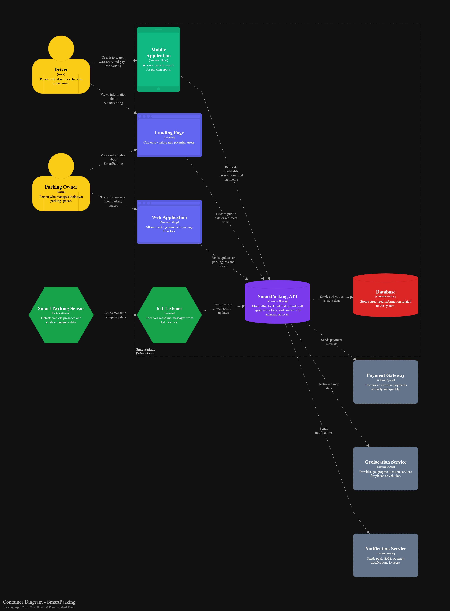

# Informe de Trabajo Final - TB1

    <strong>Universidad Peruana de Ciencias Aplicadas</strong>  
    </img>  
    <strong>Ingeniería de Software - 202510</strong> 
    <strong>Ciclo: 07</strong>  
    <strong>1ASI0572 - Desarrollo de Soluciones IOT - 2971</strong>  
    <strong>Profesor: Velasquez Nuñez, Angel Augusto</strong>  
    <strong>INFORME DE TRABAJO FINAL - TB1 </strong> 

    <strong>Startup: IoT Innovators </strong> 
    <strong>Producto:  SmartParking </strong>

### Relación de integrantes

|      Apellidos y Nombres       |   Código   |
|:------------------------------:|:----------:|
|  Arroyo Ormeño, André Alonso   | u202114714 |
| Castilla Pachas, César Antonio | u202218735 |
| Cortés Casas, Joaquin Marcelo  | u202114545 |
|   Diaz Silva, Fernando Josué   | u202112722 |
|     Godoy, Johan Príncipe      | u202014511 |
| Tafur Gonzales, Josty Gerardo  | u20201c069 |
| Zarate Caceres, Victor Ernesto | u202112907 |

**Marzo, 2025**

---

## Registro de Versiones del Informe

| **Versión** | **Fecha**  | **Autor**                                                                 | **Descripción de Modificación**                                                                                                                  |
|-------------|------------|---------------------------------------------------------------------------|--------------------------------------------------------------------------------------------------------------------------------------------------|
| 1.0         | 31/03/2025 | Cortés Casas, Joaquín Marcelo                                             | Creación del informe, incluyendo la adición de una carátula, una tabla de contenidos y todas las secciones correspondiente al primer entregable. |
| 1.1         | 01/04/2025 | Zarate Caceres, Victor Ernesto                                            | Adición del Startup Profile.                                                                                                                     |
| 1.2         | 02/04/2025 | Zarate Caceres, Victor Ernesto   Castilla Pachas, César Antonio       | Adición del Solution Profile y Competidores.                                                                                                     |
| 1.3         | 04/04/2025 | Arroyo Ormeño, André Alonso   Godoy, Johan Príncipe               | Adición del Solution Profile, User Personas, Empathy Mappings, User Task Matrix, User Journey Mapping y As-Is Scenario Mapping.                  |
| 1.4         | 05/04/2025 | Arroyo Ormeño, André Alonso                                               | Adición del To-Be Scenario Mapping.                                                                                                              |
| 1.5         | 08/04/2025 | Zarate Caceres, Victor Ernesto                                            | Adición de User Stories.                                                                                                                         |
| 1.6         | 14/04/2025 | Cortés Casas, Joaquín Marcelo   Castilla Pachas, César Antonio   Diaz Silva, Fernando Josué | Adición de registro de versiones del informe, student outcome, project report collaboration insights, Product Backlog y Event Storming.          |
| 1.7         | 16/04/2025 | Zarate Caceres, Victor Ernesto                                                                          | Adición del segmento objetivo.                                                                                                                   |
| 1.8         | 20/04/2025 | Cortés Casas, Joaquín Marcelo   Castilla Pachas, César Antonio | Adición de diagramas de Software Architecture.                                                                                                   |
| 1.9          | 21/04/2025 | ...                                                                       | ...                                                                                                                                              |

---

## Project Report Collaboration Insights
### URL del repositorio en la organización GitHub
[Enlace al repositorio del informe en GitHub](https://github.com/SolucionesIoT-Grupo-IoTInnovators/report/tree/feature-version-registration)

### Actividades de elaboración del informe
#### TB1:

**Descripción de las actividades realizadas:**
- **Arroyo Ormeño, André Alonso:** Lorem ipsum dolor sit amet, consectetur adipiscing elit. Suspendisse sit amet facilisis nisi. Fusce aliquet.
- **Castilla Pachas, César Antonio:** Lorem ipsum dolor sit amet, consectetur adipiscing elit. Suspendisse sit amet facilisis nisi. Fusce aliquet.
- **Cortés Casas, Joaquin Marcelo:** He contribuido con la creación de la estructura del reporte y la adición de los capítulos de Entrevistas y Diagramas de Arquitectura de Software.
- **Diaz Silva, Fernando Josué:** Lorem ipsum dolor sit amet, consectetur adipiscing elit. Suspendisse sit amet facilisis nisi. Fusce aliquet.
- **Godoy, Johan Príncipe:** Lorem ipsum dolor sit amet, consectetur adipiscing elit. Suspendisse sit amet facilisis nisi. Fusce aliquet.
- **Tafur Gonzales, Josty Gerardo:** Lorem ipsum dolor sit amet, consectetur adipiscing elit. Suspendisse sit amet facilisis nisi. Fusce aliquet.
- **Zarate Caceres, Victor Ernesto:** Lorem ipsum dolor sit amet, consectetur adipiscing elit. Suspendisse sit amet facilisis nisi. Fusce aliquet.

**Evidencia de colaboración y commits en GitHub para el repositorio del informe:**

---

## Contenido

**Tabla de contenidos**

- [Student Outcome](#student-outcome)

- [Capítulo I: Introducción](#capítulo-i-introducción)
    - [1.1. Startup Profile](#11-startup-profile)
        - [1.1.1. Descripción de la Startup](#111-descripción-de-la-startup)
        - [1.1.2. Perfiles de integrantes del equipo](#112-perfiles-de-integrantes-del-equipo)
    - [1.2. Solution Profile](#12-solution-profile)
        - [1.2.1. Antecedentes y problemática](#121-antecedentes-y-problemática)
        - [1.2.2. Lean UX Process](#122-lean-ux-process)
            - [1.2.2.1. Lean UX Problem Statements](#1221-lean-ux-problem-statements)
            - [1.2.2.2. Lean UX Assumptions](#1222-lean-ux-assumptions)
            - [1.2.2.3. Lean UX Hypothesis Statements](#1223-lean-ux-hypothesis-statements)
            - [1.2.2.4. Lean UX Canvas](#1224-lean-ux-canvas)
    - [1.3. Segmentos objetivo](#13-segmentos-objetivo)

- [Capítulo II: Requirements Elicitation & Analysis](#capítulo-ii-requirements-elicitation--analysis)
    - [2.1. Competidores](#21-competidores)
        - [2.1.1. Análisis competitivo](#211-análisis-competitivo)
        - [2.1.2. Estrategias y tácticas frente a competidores](#212-estrategias-y-tácticas-frente-a-competidores)
    - [2.2. Entrevistas](#22-entrevistas)
        - [2.2.1. Diseño de entrevistas](#221-diseño-de-entrevistas)
        - [2.2.2. Registro de entrevistas](#222-registro-de-entrevistas)
        - [2.2.3. Análisis de entrevistas](#223-análisis-de-entrevistas)
    - [2.3. Needfinding](#23-needfinding)
        - [2.3.1. User Personas](#231-user-personas)
        - [2.3.2. User Task Matrix](#232-user-task-matrix)
        - [2.3.3. User Journey Mapping](#233-user-journey-mapping)
        - [2.3.4. Empathy Mapping](#234-empathy-mapping)
        - [2.3.5. As-is Scenario Mapping](#235-as-is-scenario-mapping)
    - [2.4. Ubiquitous Language](#24-ubiquitous-language)

- [Capítulo III: Requirements Specification](#capítulo-iii-requirements-specification)
    - [3.1. To-Be Scenario Mapping](#31-to-be-scenario-mapping)
    - [3.2. User Stories](#32-user-stories)
    - [3.3. Impact Mapping](#33-impact-mapping)
    - [3.4. Product Backlog](#34-product-backlog)

- [Capítulo IV: Solution Software Design](#capítulo-iv-solution-software-design)
    - [4.1. Strategic-Level Domain-Driven Design](#41-strategic-level-domain-driven-design)
        - [4.1.1. EventStorming](#411-eventstorming)
            - [4.1.1.1. Candidate Context Discovery](#4111-candidate-context-discovery)
            - [4.1.1.2. Domain Message Flows Modeling](#4112-domain-message-flows-modeling)
            - [4.1.1.3. Bounded Context Canvases](#4113-bounded-context-canvases)
        - [4.1.2. Context Mapping](#412-context-mapping)
        - [4.1.3. Software Architecture](#413-software-architecture)
            - [4.1.3.1. System Quality Attributes](#4131-system-quality-attributes)
            - [4.1.3.2. Architectural Design Backlog](#4132-architectural-design-backlog)
            - [4.1.3.3. Software Architecture System Landscape Diagram](#4133-software-architecture-system-landscape-diagram)
            - [4.1.3.4. Software Architecture Context Level Diagrams](#4134-software-architecture-context-level-diagrams)
            - [4.1.3.5. Software Architecture Container Level Diagrams](#4135-software-architecture-container-level-diagrams)
            - [4.1.3.6. Software Architecture Deployment Diagrams](#4136-software-architecture-deployment-diagrams)
    - [4.2. Tactical-Level Domain-Driven Design](#42-tactical-level-domain-driven-design)
        - [4.2.1. Bounded Context: ](#421-bounded-context-)
            - [4.2.1.1. Domain Layer](#4211-domain-layer)
            - [4.2.1.2. Interface Layer](#4212-interface-layer)
            - [4.2.1.3. Application Layer](#4213-application-layer)
            - [4.2.1.4. Infrastructure Layer](#4214-infrastructure-layer)
            - [4.2.1.5. Bounded Context Software Architecture Component Level Diagrams](#4215-bounded-context-software-architecture-component-level-diagrams)
            - [4.2.1.6. Bounded Context Software Architecture Code Level Diagrams](#4216-bounded-context-software-architecture-code-level-diagrams)
                - [4.2.1.6.1. Bounded Context Domain Layer Class Diagrams](#42161-bounded-context-domain-layer-class-diagrams)
                - [4.2.1.6.2. Bounded Context Database Design Diagram](#42162-bounded-context-database-design-diagram)

## Student Outcome

El curso contribuye al cumplimiento del Student Outcome ABET:

**ABET – EAC - Student Outcome 5**

Criterio: La capacidad de funcionar efectivamente en un equipo cuyos miembros juntos proporcionan liderazgo, crean un entorno de colaboración e inclusivo, establecen objetivos, planifican tareas y cumplen objetivos.
En el siguiente cuadro se describe las acciones realizadas y enunciados de conclusiones por parte del grupo, que permiten sustentar el haber alcanzado el logro del ABET – EAC - Student Outcome 5.

  <table align="justify">
    <tr>
      <td width="25%">
        Criterio específico
      </td>
      <td>
        Acciones realizadas
      </td>
      <td>
        Conclusiones
      </td>
    </tr>
    <!--Primer Criterio-->
    <tr>
      <td>
        Trabaja en equipo para proporcionar liderazgo en forma conjunta
      </td>
      <!--Ingresar Accion Realizada por Entregable-->
      <td>
        <!--Andre Alonso-->
        Arroyo Ormeño, André Alonso:  
        TB1: 
         
        <!--Cesar-->
        Castilla Pachas, César Antonio  
        TB1: 
         
        <!--Joaquin-->
        Cortés Casas, Joaquin Marcelo  
        TB1: 
        Asumi la responsabilidad de coordinar al equipo en la asignación de las primeras tareas y resolución de dudas. De esta manera, fomenté el liderazgo promoviendo la participación y aporte de todos los miembros del grupo.
         
        <!--Fernando-->
        Diaz Silva, Fernando Josué  
        TB1: 
         
        <!--Johan-->
        Godoy, Johan Príncipe  
        TB1: 
         
        <!--Josty-->
        Tafur Gonzales, Josty Gerardo  
        TB1: 
        De manera grupal, pudimos organizarnos correctamente para poder realizar el trabajo, asignando tareas a cada uno de los integrantes del grupo. Se realizaron reuniones para coordinar las tareas a realizar y se utilizó Github para poder ver el avance de cada uno de los integrantes.
         
        <!--Victor-->
        Zarate Caceres, Victor Ernesto   
        TB1: 
        Se organizaron reuniones para coordinar las tareas a realizar, buscando que estas sean divididas justamente. Además el uso de Github nos permite estar al tanto del avance conjunto, para asi estar al tanto de los avances que se hacen como grupo y poder tomas decisiones que sen transparentes con la integridad del equipo.
         
      </td>
      <!--Ingresar Conclusion por Entregable-->
      <td>
        TB1: 
      </td>
    </tr>
    <!--Segundo Criterio-->
    <tr>
      <td>
        Crea un entorno colaborativo e inclusivo, establece metas, planifica tareas y cumple objetivos.
      </td>
      <!--Ingresar Accion Realizada por Entregable-->
      <td>
        <!--Andre Alonso-->
        Arroyo Ormeño, André Alonso:  
        TB1: 
         
        <!--Cesar-->
        Castilla Pachas, César Antonio  
        TB1: 
         
        <!--Joaquin-->
        Cortés Casas, Joaquin Marcelo  
        TB1: 
        Me he encargado de definir metas semanales para todos los integrantes del grupo, facilitando un ambiente colaborativo por medio de reuniones periódicas y revisión conjunta de avances realizados.
         
        <!--Fernando-->
        Diaz Silva, Fernando Josué  
        TB1: 
         
        <!--Johan-->
        Godoy, Johan Príncipe  
        TB1: 
         
        <!--Josty-->
        Tafur Gonzales, Josty Gerardo  
        Se coordinó en equipo las tareas que debia resolver cada uno de los miembros y la metodología que se seguiría para la correcta realización del reporte mediante Github.
        TB1: 
         
        <!--Victor-->
        Zarate Caceres, Victor Ernesto   
        TB1: 
        Se procuro que la toma de decisiones fuera de manera conjunta, considerando cada punto de vista, para asi tomar las decisiones más justas. Además, el uso de Github nos permitio mantener un entorno de trabajo conjunto y trasnparente.
         
      </td>
      <!--Ingresar Conclusion por Entregable-->
      <td>
        TB1: 
      </td>
    </tr>
  </table>

## Capítulo I: Introducción

### 1.1. Startup Profile
#### 1.1.1. Descripción de la Startup

    SmartParking nace como respuesta ante la falta de eficiencia en la gestión de estacionamientos en espacios públicos de alto tráfico. En muchas ciudades, los conductores pierden un tiempo considerable buscando espacios de estacionamiento disponibles, lo que genera congestión vehicular, aumenta la contaminación ambiental y reduce la satisfacción del usuario.
    Nuestra solución utiliza tecnología IoT para optimizar la administración de grandes estacionamientos, permitiendo la detección en tiempo real de espacios libres, la reserva de estacionamientos a través de una aplicación móvil y la integración con sistemas de pago automatizados. Con SmartParking, buscamos mejorar la movilidad urbana y hacer que el uso de los estacionamientos sea más eficiente y sostenible. 
    <ul>
      <li>
        <b>Misión:</b>
      </li>
      Revolucionar la gestión de estacionamientos a través de la tecnología IoT, proporcionando una solución inteligente que optimice el uso del espacio, reduzca el tiempo de búsqueda y mejore la experiencia del usuario.
      <li>
        <b>Visión:</b>
      </li>
      Ser la plataforma líder de estacionamientos inteligentes a nivel nacional, contribuyendo a la movilidad eficiente, promoviendo soluciones tecnológicas sostenibles.
    </ul>

#### 1.1.2. Perfiles de integrantes del equipo
Los integrantes que conforman la startup son:

| Integrante | Perfil                                                                                                                                                                                                                                                                                                                        | Foto                                                                                                                                       |
| :--------- |-------------------------------------------------------------------------------------------------------------------------------------------------------------------------------------------------------------------------------------------------------------------------------------------------------------------------------|--------------------------------------------------------------------------------------------------------------------------------------------|
| Arroyo Ormeño, André Alonso (202114714)   | Perfil                                                                                                                                                                                                                                                                                                                        |                                                                                                                             |
| Castilla Pachas, César Antonio (202218735)| Tengo 21 años y estudió la carrera de Ingeniería de Software en la Universidad Peruana de Ciencias Aplicadas. Me encanta crear páginas web y dar soluciones creativas, soy una persona responsable y puntual. Además, me encanta trabajar en equipo. Cada día me gusta aprender algo nuevo y poder ampliar mis conocimientos. |  |
| Cortés Casas, Joaquin Marcelo (202114545) | Soy Joaquín Marcelo Cortés Casas, estudiante de la carrera Ingeniería de Software en la UPC. Tengo experiencia previa liderando múltiples equipos de trabajo, buscando el compromiso y enfoque en la calidad del producto final. Cada día actualizo mis conocimientos de software probando distintas tecnologías innovadoras. |                                                                                          |
| Diaz Silva, Fernando Josué (202112722)    | Perfil                                                                                                                                                                                                                                                                                                                        |                                                                                                                          |
| Godoy, Johan Príncipe (202014511)         | Perfil                                                                                                                                                                                                                                                                                                                        |                                                                                                                             |
| Tafur Gonzales, Josty Gerardo (20201c069) | Soy Josty Tafur, estudiante de Ing. de software, cursando el décimo ciclo. Me apasiona aprender cosas nuevas y estoy siempre en busqueda de nuevos desafios que me ayuden a mejorar mis habilidades. Me considero una persona responsable, solidaria y con grabn capacidad de trabajar en equipo.                             |                                                                                               |
| Zarate Caceres, Victor Ernesto (202112907)| Soy Ernesto Zarate, estudiante de Ingeniería de Software. Me considero una persona responsable, capaz de aportar distintas ideas y de organizar el trabajo para el desarrollo de nuevos proyectos. Tengo el compromiso de trabajar eficientemente y realizar las entregas en el plazo indicado                                |                                                                                                |

### 1.2. Solution Profile
#### 1.2.1. Antecedentes y problemática

  <ul>
    <li>
      <b>What (Qué):</b> Desarrollar una solución IoT para la gestión inteligente de estacionamientos públicos, que permita:
      <ul>
        <li>Monitorear en tiempo real la disponibilidad de espacios.</li>
        <li>Reducir el tiempo de búsqueda de estacionamiento, disminuyendo la congestión vehicular</li>
        <li>Optimizar el cobro automatizado y la fiscalización mediante sensores y aplicaciones móviles.</li>
      </ul>
    </li>
    <li>
      <b>When (Cuándo): </b>La congestión por falta de estacionamiento es un problema persistente, pero se ha agravado en la última década debido al crecimiento vehicular. Un informe de la Asociación Automotriz del Perú (2023) señala que Lima un crecimiento de más de 100000 vehículos al año, lo que ocasiona cada vez más tráfico, que empeora durante las horas pico (7:00 - 9:00 AM y 5:00 - 8:00 PM).
    </li>
    <li>
      <b>Where (Dónde): </b>La problemática es crítica en ciudades con alta densidad vehicular, como Lima, Arequipa y Trujillo. Según un estudio de Lima Cómo Vamos (2022), el 60% del tráfico en distritos como Miraflores y San Isidro se debe a vehículos buscando estacionamiento.
    </li>
    <li>
      <b>Who (Quién): </b> La problemática afecta principalmente a conductores que buscan estacionamiento en zonas urbanas congestionadas. Según el Instituto Nacional de Estadística e Informática (INEI, 2022), el movimiento vehicular crecio en un 5,7%, lo que exacerba la demanda de espacios de estacionamiento. Además, las autoridades locales enfrentan desafíos en la fiscalización y gestión eficiente de estos espacios.
    </li>
    <li>
      <b>Why (Por qué): </b>La falta de gestión eficiente de estacionamientos genera:
      <ul>
        <li>Pérdidas económicas por tiempo improductivo en búsqueda de estacionamiento</li>
        <li>Contaminación ambiental debido a emisiones innecesarias.¿</li>
        <li>Estrés en conductores, reduciendo la calidad de vida urbana</li>
      </ul>
    </li>
    <li>
      <b>How (Cómo): </b>La solución propuesta integra:
      <ul>
        <li>Sensores IoT para detectar ocupación en tiempo real</li>
        <li>Plataforma centralizada para gestionar datos y procesar pagos digitales</li>
        <li>App móvil que guíe a los conductores a espacios disponibles</li>
        <li>Sistema de cobro automatizado para reducir evasión y mejorar ingresos municipales</li>
      </ul>
    </li>
    <li>
      <b>How Much (Cuánto):</b>
      <ul>
        <li>Impacto económico: Reducción del 30% en tiempo de búsqueda de estacionamiento</li>
        <li>Impacto ambiental: Disminución de emisiones de CO₂ en un 15% al reducir la congestión</li>
        <li>Retorno de inversión: Las municipalidades podrían aumentar ingresos mediante tarifas dinámicas y multas automatizadas.</li>
      </ul>
    </li>
  </ul>

#### 1.2.2. Lean UX Process
##### 1.2.2.1. Lean UX Problem Statements

 
  <b>Problem Statement 1</b>
  

    Hemos notado que los conductores en zonas urbanas de alto tráfico dedican una cantidad considerable de tiempo a buscar estacionamiento, lo que genera frustración, estrés y pérdida de productividad. La falta de información en tiempo real sobre la disponibilidad de espacios complica la experiencia del usuario, incrementando además la congestión vehicular y las emisiones contaminantes.
    Por lo tanto, se identificó la necesidad de proporcionar una herramienta que permita a los conductores localizar y reservar estacionamientos de manera rápida y eficiente. 
    
¿Cómo podemos ayudar a los conductores a encontrar y acceder a estacionamientos disponibles en tiempo real para optimizar su tiempo y reducir la congestión?

  

<b>Problem Statement 2</b>
  

    Se ha observado que los propietarios de estacionamientos enfrentan dificultades para gestionar de manera efectiva la ocupación de sus espacios. Los métodos manuales y sistemas obsoletos dificultan la obtención de datos en tiempo real, lo que afecta la capacidad de responder ante la variabilidad de la demanda y limita la optimización de los ingresos. Esto genera problemas en la asignación eficiente de los espacios disponibles y en la automatización de los cobros, reduciendo la rentabilidad de los estacionamientos.
    Por lo tanto, se identificó la necesidad de desarrollar un sistema centralizado que integre tecnología IoT para monitorear y gestionar de forma automatizada la ocupación y los pagos en los estacionamientos, facilitando la toma de decisiones basada en datos actualizados y maximizando la rentabilidad para los propietarios. 
    

    ¿Cómo podemos optimizar la gestión de estacionamientos para que los propietarios puedan maximizar la ocupación de sus espacios y aumentar sus ingresos de manera eficiente?
    

  

##### 1.2.2.2. Lean UX Assumptions

  <b>Business Assumptions</b>
  <ul>
    <li>
      <b>Necesidad del mercado:</b>
      

        Creemos que los conductores y propietarios de estacionamientos en ciudades de alta densidad requieren soluciones sencillas y eficientes. Los conductores necesitan encontrar y reservar estacionamientos de forma rápida y recibir información en tiempo real, mientras que los propietarios buscan optimizar la ocupación de sus espacios, gestionar pagos y obtener análisis detallados para maximizar sus ingresos.
      

    </li>
    <li>
      <b>Solución Integral:</b>
      

        Suponemos que el problema de la congestión vehicular y la baja eficiencia en la administración de estacionamientos se puede mitigar mediante una plataforma centralizada que integre sensores IoT para monitoreo en tiempo real, una app móvil para conductores y una aplicación web para propietarios, complementada con un sistema automatizado de pagos y notificaciones.
      

    </li>
    <li>
      <b>Clientes iniciales:</b>
      
Nuestros principales clientes serán dos segmentos:

      <ol type="1">
        <li>
          <b>Conductores:</b>
          Que demandan una experiencia fluida para buscar, reservar y pagar estacionamientos, recibiendo información actualizada y notificaciones sobre espacios libres o cambios en los precios.
        </li>
        <li>
          <b>Propietarios de estacionamientos:</b>
          Que necesitan optimizar la gestión de sus espacios a través de herramientas de análisis, reportes de ocupación en tiempo real y sistemas de cobro automatizados, para incrementar la rentabilidad de sus inversiones.
        </li>
      </ol>
    </li>
    <li>
      <b>Propuesta de valor:</b>
      

        El valor principal de SmartParking es ofrecer una solución integral que combine la detección en tiempo real de espacios disponibles y un sistema de reserva y pago automatizado, facilitando la experiencia de los conductores y permitiendo a los propietarios gestionar sus estacionamientos de forma eficiente. Los beneficios adicionales incluyen:
      

      <ul>
        <li>Reducción del tiempo de búsqueda para los conductores.</li>
        <li>Optimización en la ocupación y gestión de estacionamientos para los propietarios.</li>
        <li>Acceso a estadísticas y análisis detallados para la toma de decisiones.</li>
        <li>Integración con sistemas de navegación y plataformas de movilidad compartida.</li>
      </ul>
    </li>
    <li>
      <b>Estrategia de adquisición:</b>
      

        Adquiriremos clientes mediante alianzas estratégicas con operadores privados de estacionamientos y campañas de marketing digital dirigidas a conductores y propietarios. Se implementarán demostraciones piloto en zonas urbanas de alta demanda y se promoverán casos de éxito para generar confianza y adopción.
      

    </li>
    <li>
      <b>Modelo de Ingresos:</b>
      

        La monetización se basará en suscripciones mensuales o anuales para propietarios, la venta de dispositivos IoT para el monitoreo de espacios, y servicios premium para ambos segmentos. Estos servicios premium ofrecerán funcionalidades avanzadas, como integración con apps de navegación y plataformas de movilidad compartida, y reportes analíticos personalizados.
      

    </li>
    <li>
      <b>Competencia y Diferenciación:</b>
      

        Competimos contra aplicaciones parciales y métodos manuales de gestión de estacionamientos. Nuestra ventaja radica en ofrecer una solución centralizada, integral y respaldada por tecnología IoT, que proporciona datos precisos en tiempo real y herramientas de análisis que benefician tanto a conductores como a propietarios.
      

    </li>
    <li>
      <b>Principales Riesgos:</b>
      

        Los riesgos principales incluyen fallos en los sensores IoT, baja adopción de la plataforma por parte de conductores o propietarios, y problemas en la integración de sistemas de pago. Mitigaremos estos riesgos mediante pruebas piloto, mantenimiento continuo y una estrategia de comunicación que destaque el valor agregado y la eficiencia del sistema.
      

    </li>
    <li>
      <b>Indicadores de Éxito:</b>
      

        Consideraremos que hemos alcanzado el éxito cuando:
      

      <ul>
        <li>Los conductores experimenten una reducción del 30% en el tiempo de búsqueda de estacionamientos.</li>
        <li>Se observe un aumento significativo en la ocupación de los estacionamientos gestionados a través de la plataforma.</li>
        <li>Ambos segmentos muestren una alta tasa de adopción y satisfacción, evidenciada por el uso recurrente y la retroalimentación positiva.</li>
      </ul>
    </li>
  </ul>

<b>User Assumptions</b>
  <ul>
    <li>
      <b>¿Quién es el usuario?</b>
      

        - <b>Conductores:</b> Personas que transitan en ciudades de alta densidad y requieren una solución rápida y confiable para buscar, reservar y pagar estacionamientos. 
        - <b>Propietarios de estacionamientos:</b> Empresarios o administradores que necesitan herramientas para gestionar eficientemente sus espacios, analizar la demanda y maximizar la rentabilidad.
      

    </li>
    <li>
      <b>¿Dónde encaja nuestro producto?</b>
      

        - <b>En la vida diaria de los conductores:</b> La app móvil se integra en su rutina, facilitando la búsqueda y reserva de estacionamientos, reduciendo el estrés y optimizando su tiempo. 
        - <b>En el ámbito laboral de los propietarios:</b> La plataforma web ofrece herramientas de gestión y análisis que permiten controlar la ocupación y administrar los pagos, apoyando decisiones estratégicas para aumentar ingresos.
      

    </li>
    <li>
      <b>Problemas Identificados y Soluciones Propuestas:</b>
      

        - <b>Baja adopción por parte de los conductores:</b> Si los conductores no utilizan activamente la app, la efectividad del sistema se verá comprometida.  <i>Solución:</i> Campañas de promoción, diseño de una interfaz intuitiva y mejoras basadas en la retroalimentación del usuario. 
        - <b>Ineficiencia en la gestión de estacionamientos:</b> Los propietarios pueden enfrentar dificultades para optimizar la ocupación y gestionar pagos de forma manual, lo que afecta la rentabilidad. <i>Solución:</i> Automatización de la gestión, reportes en tiempo real y herramientas analíticas que faciliten la toma de decisiones.
      

    </li>
    <li>
      <b>¿Cuándo y cómo se usa nuestro producto?</b>
      

        - <b>Conductores:</b> Utilizan la app móvil para visualizar mapas interactivos, reservar espacios y efectuar pagos en tiempo real, recibiendo notificaciones sobre disponibilidad y precios. 
        - <b>Propietarios:</b> Acceden a la plataforma web para monitorear la ocupación de sus estacionamientos, gestionar tarifas y analizar estadísticas de uso que les permitan mejorar su operatividad.
      

    </li>
    <li>
      <b>Características Importantes:</b>
      

        - Geolocalización en tiempo real para identificar espacios disponibles. 
        - Integración con sensores IoT que aseguren datos precisos y actualizados. 
        - Sistema de reserva y pago automatizado para simplificar la experiencia del usuario. 
        - Interfaz intuitiva tanto en la app móvil como en la plataforma web.
      

    </li>
    <li>
      <b>Aspecto y Comportamiento del Producto:</b>
      

        - <b>Interfaz de usuario (UI):</b> Moderna, limpia y adaptada a dispositivos móviles y web, facilitando la navegación y la visualización de información clave. 
        - <b>Experiencia de usuario (UX):</b> Simple y eficiente, permitiendo acciones rápidas (reservar, pagar, analizar) en pocos pasos. 
        - Disponibilidad continua para responder en tiempo real a las necesidades de los conductores y propietarios.
      

    </li>
    <li>
      <b>Features Principales:</b>
      

        - Registro y autenticación para conductores y propietarios. 
        - Mapas interactivos con ubicación de estacionamientos. 
        - Integración de sensores IoT para monitoreo en tiempo real. 
        - Sistema de reserva y pago en línea para conductores y panel de gestión para propietarios. 
        - Notificaciones y actualizaciones en tiempo real.
      

    </li>
  </ul>

##### 1.2.2.3. Lean UX Hypothesis Statements
En relación con la propuesta descrita en la sección "Descripción de la Startup" de SmartParking, tenemos las siguientes hipótesis:

- **Hipótesis para Conductores:**  
  Creemos que, al brindar a los conductores información en tiempo real sobre la disponibilidad de estacionamientos (a través de geolocalización, notificaciones y datos precisos de sensores IoT), la aplicación les permitirá reducir significativamente el tiempo de búsqueda y reserva.  
  Sabremos que hemos tenido éxito cuando se registre una reducción del 30% en el tiempo de búsqueda de estacionamientos, medido a través de análisis de uso y feedback de los usuarios.

- **Hipótesis para Propietarios de Estacionamientos:**  
  Creemos que, al ofrecer a los propietarios una plataforma web con herramientas de gestión, análisis en tiempo real y reportes detallados sobre la ocupación y demanda de sus espacios, podrán optimizar la administración y maximizar sus ingresos.  
  Sabremos que hemos tenido éxito cuando se observe un aumento significativo en la ocupación de los estacionamientos (por ejemplo, un incremento del 20% en la tasa de ocupación) y una mejora en la rentabilidad, validado a través de estudios de caso y análisis financiero.

- **Hipótesis de Integración Tecnológica:**  
  Creemos que la integración de dispositivos IoT con la app móvil y la plataforma web permitirá una comunicación fluida y precisa entre los sensores, el sistema de reservas y el procesamiento de pagos.  
  Sabremos que hemos tenido éxito cuando se detecte una reducción en los errores de datos (por ejemplo, menos del 5% de discrepancias) y se mejore la fiabilidad de la información, comprobado mediante pruebas piloto y métricas de rendimiento.

- **Hipótesis de Viralidad y Crecimiento Orgánico:**  
  Creemos que la experiencia positiva de uso tanto en la app móvil como en la plataforma web incentivará a los usuarios a recomendar SmartParking a familiares y amigos, aumentando el alcance orgánico.
  Sabremos que hemos tenido éxito cuando al menos el 30% de los nuevos usuarios registrados mensualmente provengan de fuentes orgánicas, medido a través de análisis de crecimiento y fuentes de adquisición.

##### 1.2.2.4. Lean UX Canvas

  <table width="100%" border="1" cellpadding="10" cellspacing="0">
      <tr>
          <td width="33%" valign="top">
              <h4>Business Problem</h4>
              <ul>
                <li>Alta demanda de estacionamientos en zonas urbanas con congestión vehicular y falta de disponibilidad de espacios.</li>
                <li>Procesos manuales y poco eficientes en la gestión de estacionamientos por parte de propietarios, lo que genera baja ocupación y pérdida de ingresos.</li>
                <li>Los conductores pierden tiempo buscando estacionamiento, lo que incrementa el tráfico y el estrés urbano.</li>
              </ul>
          </td>
          <td rowspan="2" width="33%" valign="top">
              <h4>Solutions</h4>
              <ul>
                <li>Aplicación móvil para conductores con búsqueda, reserva y pago de estacionamiento.</li>
                <li>Plataforma web para propietarios con monitoreo de ocupación, estadísticas y gestión de ingresos.</li>
                <li>Integración de dispositivos IoT para monitoreo en tiempo real de espacios disponibles.</li>
                <li>Sistema de notificaciones sobre disponibilidad, precios y vencimiento de reservas.</li>
                <li>Visualización de espacios libres mediante geolocalización en tiempo real.</li>
              </ul>
          </td>
          <td width="33%" valign="top">
              <h4>Business Outcomes</h4>
              <ul>
                <li>Aumento en la ocupación de estacionamientos al optimizar el uso de los espacios disponibles.</li>
                <li>Reducción del tiempo de búsqueda de estacionamiento para conductores.</li>
                <li>
                Mayor eficiencia en la gestión de estacionamientos para los propietarios mediante herramientas de análisis y monitoreo en tiempo real.</li>
                <li>Monetización efectiva mediante suscripciones, comisiones por transacción y venta de dispositivos IoT.</li>
              </ul>
          </td>
      </tr>
      <tr>
          <td valign="top">
              <h4>Users</h4>
              <ul>
                <li>Conductores que buscan estacionamiento de forma rápida y eficiente.</li>
                <li>Propietarios de estacionamientos que desean maximizar la ocupación y optimizar la gestión de sus espacios.</li>
              </ul>
          </td>
          <td valign="top">
              <h4>User Outcomes & Benefits</h4>
              <ul>
                <li>Menor tiempo de búsqueda de estacionamiento para los conductores.</li>
                <li>Incremento en la ocupación de espacios para los propietarios.</li>
                <li>Interacción fluida y en tiempo real a través de la app móvil y la plataforma web.</li>
                <li>Proceso de pago automatizado y seguro.</li>
              </ul>
          </td>
      </tr>
      <tr>
          <td valign="top">
              <h4>Hypotheses</h4>
              <ul>
                <li>Creemos que ofrecer información en tiempo real sobre la disponibilidad de estacionamientos permitirá a los conductores reducir el tiempo de búsqueda en un 30%. Sabremos que hemos tenido éxito cuando veamos una reducción del tiempo promedio de búsqueda registrada en la app.</li>
                <li>Creemos que la implementación de un sistema de gestión centralizado aumentará la ocupación de estacionamientos en un 20%. Sabremos que tuvimos éxito cuando los propietarios reporten un aumento significativo en el uso de sus espacios.</li>
                <li>Creemos que ofrecer un sistema automatizado de pagos mejorará la experiencia del usuario, reduciendo los errores y tiempos de procesamiento. Sabremos que tuvimos éxito cuando el 90% de los pagos se realicen a través de la app.</li>
                <li>Creemos que una experiencia positiva de uso fomentará recomendaciones orgánicas, aumentando el número de usuarios. Sabremos que tuvimos éxito cuando al menos el 30% de los nuevos registros provengan de referencias.</li>
              </ul>
          </td>
          <td valign="top">
              <h4>What's the most important thing we need to learn first?</h4>
              <ul>
                <li>Identificar los principales puntos de dolor de los conductores al buscar estacionamiento en zonas congestionadas.</li>
                <li>Analizar los métodos actuales de gestión utilizados por los propietarios de estacionamientos.</li>
                <li>Conocer el comportamiento de los usuarios respecto al uso de aplicaciones similares en el mercado.</li>
                <li>Validar el interés de los propietarios en adoptar tecnología IoT para el monitoreo de espacios.</li>
              </ul>
          </td>
          <td valign="top">
              <h4>What's the least amount of work we need to do to learn the next most important thing?</h4>
              <ul>
                <li>Realizar encuestas a conductores sobre problemas comunes al buscar estacionamiento.</li>
                <li>Entrevistar a propietarios sobre su interés en digitalizar la gestión de sus espacios.</li>
                <li>Implementar un prototipo funcional con las características esenciales para evaluar su aceptación.</li>
                <li>Realizar pruebas piloto en zonas urbanas con alta demanda de estacionamiento para validar el impacto del sistema.</li>
              </ul>
          </td>
      </tr>
    </table>

### 1.3. Segmentos objetivo

  <ul>
    <li><b>Propietarios de estacionamientos:</b></li>
    Administradores o dueños de playas de estacionamiento privadas o públicas que desean optimizar la ocupación de sus espacios, automatizar procesos de cobro y monitoreo, y acceder a reportes de rendimiento en tiempo real. Están interesados en herramientas tecnológicas que mejoren su eficiencia operativa y aumenten su rentabilidad.
    <li><b>Conductores:</b></li>
    Conductores que circulan frecuentemente en zonas con alta densidad de tráfico y escasez de estacionamientos. Buscan soluciones prácticas que les permitan encontrar espacios disponibles rápidamente, reservarlos con anticipación y realizar pagos de manera digital para ahorrar tiempo, reducir el estrés y evitar dar vueltas innecesarias.
  </ul>

---

## Capítulo II: Requirements Elicitation & Analysis

### 2.1. Competidores
Nuestros competidores principales seran los siguientes:

<table border="1" cellspacing="0" cellpadding="8">
  <tr>
    <td><strong>iPark</strong> 
      link: <a href="https://ipark.pe/propuesta/">https://ipark.pe/</a>
    </td>
    <td>
      iPark es una plataforma digital orientada a la gestión de estacionamientos. Ofrece soluciones como pago con QR, cámaras ANPR, app móvil para conductores y un panel administrativo para los operadores. Su enfoque está en la automatización y maximización de ingresos.
    </td>
  </tr>
  <tr>
    <td><strong>ACCIST Perú</strong> 
      link: <a href="https://accistperu.com/">https://accistperu.com/</a>
    </td>
    <td>
      ACCIST es una empresa especializada en control de asistencia y acceso. Ofrece soluciones biométricas, molinetes y otros dispositivos de seguridad, que aunque no están centrados en estacionamientos, pueden competir indirectamente en espacios como edificios o universidades.
    </td>
  </tr>
  <tr>
    <td><strong>Smelpro</strong> 
      link: <a href="https://smelpro.com/">https://smelpro.com/</a>
    </td>
    <td>
      Smelpro desarrolla soluciones tecnológicas basadas en IoT e inteligencia artificial para monitoreo en tiempo real. Aunque no enfocado exclusivamente en estacionamientos, sus productos pueden adaptarse a este sector, compitiendo en innovación e integración tecnológica.
    </td>
  </tr>
</table>

#### 2.1.1. Análisis competitivo
<table border="1" cellspacing="0" cellpadding="6">
  <!-- Título -->
  <tr>
    <th colspan="6" align="left">Competitive Analysis Landscape</th>
  </tr>

  <!-- Propósito del análisis -->
  <tr>
    <td rowspan="2"><strong>¿Por qué llevar a cabo este análisis?</strong></td>
    <td colspan="5">Para entender el panorama competitivo actual, descubrir oportunidades de mercado y tomar decisiones informadas sobre producto, marketing y crecimiento.</td>
  </tr>
  <tr></tr>

  <!-- Cabecera de competidores -->
<tr>
  <td colspan="2"><strong>Competidores</strong></td>
  <td>
     
    <strong>SmartParking</strong> 
  </td>
  <td>
     
    <strong>iPark</strong> 
  </td>
  <td>
     
    <strong>ACCIST</strong> 
  </td>
  <td>
     
    <strong>Smelpro</strong> 
  </td>
</tr>

  <!-- Overview -->
  <tr>
    <td rowspan="1"><strong>Perfil</strong></td>
    <td>Overview</td>
    <td>SmartParking es una plataforma inteligente que conecta conductores con estacionamientos disponibles mediante una app móvil, y brinda a propietarios herramientas web para gestionar, analizar y monetizar sus espacios de forma eficiente.</td>
    <td>Sistema digital para gestión de estacionamientos en la nube con app móvil, QR y panel de administración.</td>
    <td>Empresa peruana con más de 20 años en soluciones de asistencia, control de acceso y seguridad electrónica.</td>
    <td>Empresa tecnológica enfocada en soluciones IoT, IA e Industria 4.0 para sectores como energía, agua, agricultura y logística.</td>
  </tr>

  <!-- Perfil de Marketing -->
  <tr>
    <td rowspan="3"><strong>Perfil de Marketing</strong></td>
    <td>Ventaja competitiva ¿Qué valor ofrece a los clientes?</td>
    <td>Acceso en tiempo real a disponibilidad, precios dinámicos y reserva desde app móvil; más analítica avanzada para propietarios.</td>
    <td>Optimiza ingresos y eficiencia en la operación de estacionamientos con sistemas inteligentes.</td>
    <td>Soluciones personalizadas en control de acceso, asistencia y seguridad para empresas de distintos tamaños.</td>
    <td>Soluciones integrales de monitoreo y control en tiempo real con conectividad inalámbrica y plataformas propias.</td>
  </tr>
  <tr>
    <td>Mercado objetivo</td>
    <td>Conductores urbanos que buscan estacionamiento optimizado y propietarios de estacionamientos en zonas de alta rotación.</td>
    <td>Empresas que administran estacionamientos públicos o privados.</td>
    <td>Instituciones, empresas privadas, entidades educativas y de salud que necesiten controlar accesos y personal.</td>
    <td>Industria, agricultura, transporte, energía y empresas que requieren automatización y sensores inteligentes.</td>
  </tr>
  <tr>
    <td>Estrategias de marketing</td>
    <td>Alianzas con comercios, integración con apps de navegación, descuentos promocionales y campañas digitales geolocalizadas.</td>
    <td>Modelo SaaS escalable, con soporte técnico incluido y enfoque en retorno de inversión.</td>
    <td>Relaciones comerciales directas, demostraciones personalizadas y atención postventa.</td>
    <td>Casos de éxito, enfoque consultivo, propuesta a medida y acompañamiento técnico completo.</td>
  </tr>

  <!-- Perfil de Producto -->
  <tr>
    <td rowspan="3"><strong>Perfil de Producto</strong></td>
    <td>Productos & Servicios</td>
    <td>App móvil para búsqueda y reserva; panel web de gestión; sensores IoT; reportes analíticos; alertas dinámicas.</td>
    <td>App móvil, pagos QR, cámaras ANPR, kioscos de pago, dashboard online.</td>
    <td>Controles biométricos, molinetes, cámaras, sistemas de asistencia, impresoras de fotochecks.</td>
    <td>Diseño electrónico, impresión 3D, software embebido, dashboards, sensores, redes LoRa/IoT.</td>
  </tr>
  <tr>
    <td>Precios & Costos</td>
    <td>Modelo SaaS mensual o anual para propietarios; venta de hardware IoT por unidad; planes freemium para conductores.</td>
    <td>Planes desde $150 a $650 mensuales según cantidad de transacciones.</td>
    <td>Precios varían según personalización, productos a medida.</td>
    <td>Costos según proyecto; soluciones completamente adaptadas.</td>
  </tr>
  <tr>
    <td>Canales de distribución (Web y/o Móvil)</td>
    <td>App móvil, portal web, atención en línea, redes sociales y soporte técnico remoto.</td>
    <td>App Android, panel web de gestión, soporte remoto.</td>
    <td>Sitio web, contacto comercial directo, atención personalizada.</td>
    <td>Sitio web, redes sociales, contacto directo, soporte técnico propio.</td>
  </tr>

  <!-- Análisis SWOT -->
  <tr>
    <td rowspan="5"><strong>Análisis SWOT</strong></td>
    <td colspan="5">Realice esto para su startup y sus competidores. Las fortalezas deberían apoyar las oportunidades y contribuir a lo que ustedes definen como su posible ventaja competitiva.</td>
  </tr>
  <tr>
    <td>Fortalezas</td>
    <td>Doble enfoque (usuario + propietario), funcionalidades completas, visión escalable.</td>
    <td>Modelo SaaS claro, app moderna, soporte técnico.</td>
    <td>Experiencia de 20+ años, soluciones variadas, soporte.</td>
    <td>Alta innovación, integración tecnológica completa.</td>
  </tr>
  <tr>
    <td>Debilidades</td>
    <td>Se requiere adopción tecnológica de propietarios, inversión inicial en hardware.</td>
    <td>Público objetivo limitado a estacionamientos.</td>
    <td>Dependencia de hardware específico.</td>
    <td>Soluciones técnicas requieren conocimiento especializado del cliente.</td>
  </tr>
  <tr>
    <td>Oportunidades</td>
    <td>Demanda creciente de soluciones sostenibles y reducción de congestión vehicular.</td>
    <td>Expansión a edificios corporativos y malls.</td>
    <td>Integrarse a plataformas de RRHH o ERP.</td>
    <td>Aplicaciones en smart cities y gestión pública.</td>
  </tr>
  <tr>
    <td>Amenazas</td>
    <td>Competidores con infraestructura ya instalada, resistencia al cambio en operadores tradicionales.</td>
    <td>Competencia con soluciones genéricas más baratas.</td>
    <td>Importaciones informales de equipos sin soporte.</td>
    <td>Avance rápido de nuevas tecnologías internacionales.</td>
  </tr>
</table>

#### 2.1.2. Estrategias y tácticas frente a competidores
Nuestras estrategias y tácticas para hacer frente a nuestros competidores serían las siguientes:
- Para enfrentar a los competidores adoptaremos estrategias enfocadas en la diferenciación tecnológica y la experiencia del usuario para competir con empresas ya posicionadas en el sector. Buscaremos aprovechar oportunidades relacionadas con la digitalización urbana, el auge de las soluciones sin contacto y el crecimiento de las smart cities. Para afrontar las fortalezas de competidores consolidados, ofreceremos una propuesta más flexible, integrada y enfocada tanto en conductores como en propietarios. Frente a las debilidades del mercado, se posicionará como una alternativa accesible, moderna y adaptable. A su vez, anticiparemos amenazas mediante alianzas estratégicas, escalabilidad tecnológica y atención personalizada.

### 2.2. Entrevistas
#### 2.2.1. Diseño de entrevistas
**Objetivo:**

Identificar con claridad las necesidades, frustraciones y comportamientos actuales de los usuarios en relación con la gestión y disponibilidad de espacios de parqueo en zonas urbanas. Esto permitirá validar las hipótesis planteadas en el enfoque Lean UX y orientar el desarrollo de la solución IoT SmartParking hacia una verdadera propuesta de valor.

**Perfil del entrevistado:**

Se establecen 2 perfiles distintos de usuarios a entrevistar, que corresponden a los segmentos objetivos clave definidos:

**A. Conductor urbano**

- Dentro de un rango de edad entre los 20 y 60 años.
- Uso frecuente del automóvil en zonas urbanas.
- Ha experimentado dificultad para encontrar estacionamiento.
- Tiene acceso y usa smartphones habitualmente.
- Dispuesto a utilizar aplicaciones móviles que le faciliten su día a día.

**B. Propietario de estacionamiento**
- Persona encargada de administrar uno o varios estacionamientos públicos o privados.
- Con interés en mejorar la eficiencia, visibilidad o rentabilidad de su espacio.
- Puede tener experiencia limitada en tecnología, pero apertura a soluciones digitales.
- Tiene contacto diario con la gestión operativa de espacios de parqueo.

**Preguntas guía de la entrevista**

Se presentan 2 bloques de preguntas diferenciadas, uno para cada perfil.

**A. Preguntas para Conductores**

Bloque 1: Contexto y hábitos
1. ¿Con qué frecuencia manejas en la ciudad durante la semana?
2. ¿En qué zonas sueles tener más dificultad para estacionar?
3. ¿Cuánto tiempo en promedio te toma encontrar un lugar libre para estacionar?
4. ¿Has dejado de ir a algún lugar por no encontrar parqueo?

Bloque 2: Problemas y frustraciones
5. ¿Qué es lo que más te molesta al buscar estacionamiento?
6. ¿Qué haces cuando no encuentras espacio fácilmente?
7. ¿Has recibido multas o sanciones por estacionar en lugares inadecuados?

Bloque 3: Soluciones actuales
8. ¿Usas alguna app o tecnología actualmente para ayudarte con el estacionamiento?
9. ¿Qué tan confiables te han parecido esas soluciones?

Bloque 4: Validación de propuesta
10. Si existiera una app que te muestre los espacios disponibles en tiempo real y te permita reservarlos, ¿la usarías? ¿Por qué?
11. ¿Estarías dispuesto a pagar por este tipo de servicio? ¿Cuánto considerarías razonable?
12. ¿Qué funciones te gustaría que tuviera una app como esta?

**B. Preguntas para Propietarios de Estacionamiento**

Bloque 1: Contexto del negocio
1. ¿Cuántos espacios de parqueo gestionas actualmente?
2. ¿Cómo llevas el control de los espacios disponibles y ocupados?
3. ¿Cuáles son tus horarios pico y cómo manejas esa demanda?

Bloque 2: Problemas y oportunidades
4. ¿Qué dificultades enfrentas con la gestión actual del estacionamiento?
5. ¿Qué tanto control tienes sobre los ingresos diarios?
6. ¿Has considerado implementar tecnología para optimizar tu operación?

Bloque 3: Validación de propuesta
7. ¿Te interesaría un sistema que automatice la detección de espacios libres?
8. ¿Qué información sería más útil para ti en una plataforma de gestión?
9. ¿Qué funcionalidades considerarías imprescindibles en una solución tecnológica?
10. ¿Qué beneficios esperas obtener con una herramienta como SmartParking?

**Justificación de las preguntas**

Las preguntas fueron diseñadas para:
- Obtener insights reales sobre comportamientos actuales (Bloque 1).
- Detectar puntos de dolor que validen la necesidad de una solución (Bloque 2).
- Entender el uso de alternativas existentes y su efectividad (Bloque 3).
- Validar la propuesta de valor de SmartParking y sus funcionalidades clave (Bloque 4).

Duración estimada de la entrevista

- Para conductores: 10 a 20 minutos
- Para propietarios: 15 a 30 minutos

Medio de aplicación
- Las entrevistas se aplicarán de manera presencial o virtual (videollamada), dependiendo de la disponibilidad del entrevistado, y serán registradas con consentimiento para posterior análisis.

#### 2.2.2. Registro de entrevistas
##### Segmento 1:

  <!--Entrevista 1-->
  <table>
    <tr>
      <td>Entrevista 1: </td>
      <td>
        Nombre:  
        Edad:  
        Distrito:  
      </td>
    </tr>
    <tr>
      <td colspan="2">
        Lorem ipsum dolor sit amet, consectetur adipiscing elit. Fusce et semper tortor. Pellentesque ac quam at dui tristique pharetra. Nunc rhoncus nisi lacus, eget dapibus metus tempor sit amet. Ut laoreet maximus ipsum, quis gravida felis pulvinar id. Nulla efficitur varius accumsan. Donec sed interdum nunc. 
      </td>
    </tr>
    <tr>
      <td colspan="2"></td>
    </tr>
    <tr>
      <td colspan="2">Tiempo en el video: 00:00</td>
    </tr>
  </table>
  <!--Entrevista 2-->
  <table>
    <tr>
      <td>Entrevista 2: </td>
      <td>
        Nombre:  
        Edad:  
        Distrito:  
      </td>
    </tr>
    <tr>
      <td colspan="2">
        Lorem ipsum dolor sit amet, consectetur adipiscing elit. Fusce et semper tortor. Pellentesque ac quam at dui tristique pharetra. Nunc rhoncus nisi lacus, eget dapibus metus tempor sit amet. Ut laoreet maximus ipsum, quis gravida felis pulvinar id. Nulla efficitur varius accumsan. Donec sed interdum nunc. 
      </td>
    </tr>
    <tr>
      <td colspan="2"></td>
    </tr>
    <tr>
      <td colspan="2">Tiempo en el video: 00:00</td>
    </tr>
  </table>
  <!--Entrevista 3-->
  <table>
    <tr>
      <td>Entrevista 3: </td>
      <td>
        Nombre:  
        Edad:  
        Distrito:  
      </td>
    </tr>
    <tr>
      <td colspan="2">
        Lorem ipsum dolor sit amet, consectetur adipiscing elit. Fusce et semper tortor. Pellentesque ac quam at dui tristique pharetra. Nunc rhoncus nisi lacus, eget dapibus metus tempor sit amet. Ut laoreet maximus ipsum, quis gravida felis pulvinar id. Nulla efficitur varius accumsan. Donec sed interdum nunc. 
      </td>
    </tr>
    <tr>
      <td colspan="2"></td>
    </tr>
    <tr>
      <td colspan="2">Tiempo en el video: 00:00</td>
    </tr>
  </table>

##### Segmento 2:

  <!--Entrevista 1-->
  <table>
    <tr>
      <td>Entrevista 1: </td>
      <td>
        Nombre:  
        Edad:  
        Distrito:  
      </td>
    </tr>
    <tr>
      <td colspan="2">
        Lorem ipsum dolor sit amet, consectetur adipiscing elit. Fusce et semper tortor. Pellentesque ac quam at dui tristique pharetra. Nunc rhoncus nisi lacus, eget dapibus metus tempor sit amet. Ut laoreet maximus ipsum, quis gravida felis pulvinar id. Nulla efficitur varius accumsan. Donec sed interdum nunc. 
      </td>
    </tr>
    <tr>
      <td colspan="2"></td>
    </tr>
    <tr>
      <td colspan="2">Tiempo en el video: 00:00</td>
    </tr>
  </table>
  <!--Entrevista 2-->
  <table>
    <tr>
      <td>Entrevista 2: </td>
      <td>
        Nombre:  
        Edad:  
        Distrito:  
      </td>
    </tr>
    <tr>
      <td colspan="2">
        Lorem ipsum dolor sit amet, consectetur adipiscing elit. Fusce et semper tortor. Pellentesque ac quam at dui tristique pharetra. Nunc rhoncus nisi lacus, eget dapibus metus tempor sit amet. Ut laoreet maximus ipsum, quis gravida felis pulvinar id. Nulla efficitur varius accumsan. Donec sed interdum nunc. 
      </td>
    </tr>
    <tr>
      <td colspan="2"></td>
    </tr>
    <tr>
      <td colspan="2">Tiempo en el video: 00:00</td>
    </tr>
  </table>
  <!--Entrevista 3-->
  <table>
    <tr>
      <td>Entrevista 3: </td>
      <td>
        Nombre:  
        Edad:  
        Distrito:  
      </td>
    </tr>
    <tr>
      <td colspan="2">
        Lorem ipsum dolor sit amet, consectetur adipiscing elit. Fusce et semper tortor. Pellentesque ac quam at dui tristique pharetra. Nunc rhoncus nisi lacus, eget dapibus metus tempor sit amet. Ut laoreet maximus ipsum, quis gravida felis pulvinar id. Nulla efficitur varius accumsan. Donec sed interdum nunc. 
      </td>
    </tr>
    <tr>
      <td colspan="2"></td>
    </tr>
    <tr>
      <td colspan="2">Tiempo en el video: 00:00</td>
    </tr>
  </table>

#### 2.2.3. Análisis de entrevistas
Neque porro quisquam est qui dolorem ipsum quia dolor sit amet, consectetur, adipisci velit.

### 2.3. Needfinding
En esta sección se presentarán los artefactos resultantes del proceso de análisis de la información recolectada de los segmentos objetivos. Aquí se incluyen secciones internas para User Personas, User Task Matrix, User Journey Maps, Empathy Mapping y As-Is Scenario Mapping.

#### 2.3.1. User Personas

  En esta sección se presentarán las fichas de User Persona, las cuales son representaciones ficticias de los usuarios basadas en los hallazgos obtenidos a partir de las entrevistas realizadas. Estas fichas se centran en los segmentos objetivos identificados, incluyendo productores agrícolas y distribuidores. La elaboración de estas User Personas se fundamenta en el análisis de las características comunes y necesidades detectadas en las entrevistas, así como en la observación de la competencia. Al comprender mejor a nuestros usuarios, podremos diseñar soluciones más efectivas y alineadas con sus expectativas y desafíos, lo que resulta fundamental para el desarrollo de nuestra aplicación. Cada ficha incluirá detalles sobre las características demográficas, motivaciones, frustraciones y necesidades específicas de cada arquetipo, asegurando que nuestras decisiones de diseño se basen en información relevante y real.  

**Segmento Propietario de Estacionamiento:**  

  Alejandro Torres es un empresario peruano que administra varios estacionamientos en Perú. Con formación en administración de empresas y un perfil racional, Alejandro está constantemente buscando formas de mejorar la rentabilidad de su negocio. Su objetivo es aumentar la ocupación de sus espacios, reducir los tiempos en que sus estacionamientos están vacíos y ofrecer una experiencia más cómoda y eficiente para sus clientes. Aunque está abierto a la tecnología, solo invierte en herramientas que demuestren un impacto claro en la eficiencia operativa o el incremento de ingresos. Se siente frustrado por la falta de visibilidad en tiempo real sobre el comportamiento de sus usuarios y por la carga que implica la gestión manual de pagos y reservas.  

**Segmento Conductor:**  

  Diego Ramírez utiliza su vehículo diariamente para cumplir con una agenda exigente de reuniones y visitas a clientes. Aunque es una persona organizada y con buena planificación, uno de sus mayores desafíos diarios es encontrar estacionamiento en zonas de alta demanda, lo que le genera estrés y pérdida de tiempo. Interesado en la tecnología, Diego busca soluciones digitales que le permitan reservar espacios con anticipación, recibir alertas sobre disponibilidad y comparar precios en tiempo real. Su motivación principal es optimizar su tiempo y evitar contratiempos que afecten su productividad laboral. Se frustra al no tener visibilidad de los espacios disponibles y cuando los costos son altos o inesperados.  

#### 2.3.2. User Task Matrix

En esta sección se presenta el **User Task Matrix**, que concentra las tareas que los **User Personas** realizan para cumplir sus objetivos. Se consideran dos segmentos: **propietarios de estacionamiento** y **conductores**. Las tareas identificadas representan actividades que los usuarios deben realizar independientemente de la existencia de una solución de software.

| **Task**                                 | **Propietario de Estacionamiento** |                 | **Conductor**  |                 |
|------------------------------------------|------------------------------------|-----------------|----------------|-----------------|
|                                          | **Frecuencia**                     | **Importancia** | **Frecuencia** | **Importancia** |
| Establecer horarios y tarifas            | High                               | High            | -              | -               |
| Gestionar la disponibilidad del espacio  | High                               | High            | -              | -               |
| Supervisar ocupación del estacionamiento | Medium                             | High            | -              | -               |
| Cobrar o verificar pagos                 | High                               | High            | -              | -               |
| Coordinar con clientes                   | Medium                             | Medium          | Medium         | Medium          |
| Buscar estacionamiento                   | -                                  | -               | High           | High            |
| Evaluar seguridad del lugar              | -                                  | -               | High           | High            |
| Comparar precios y distancias            | -                                  | -               | High           | Medium          |
| Reservar espacio de estacionamiento      | -                                  | -               | High           | High            |
| Verificar disponibilidad en tiempo real  | -                                  | -               | High           | High            |
| Gestionar historial de reservas/pagos    | Medium                             | Medium          | Medium         | Medium          |

### Explicación

Al analizar las tareas de los segmentos de **propietarios de estacionamiento** y **conductores**, se observan diferencias claras en los objetivos y responsabilidades, así como algunas coincidencias importantes.

#### Tareas con Mayor Frecuencia e Importancia

1. **Establecer horarios y tarifas** (propietarios): Es esencial para gestionar correctamente su espacio y maximizar ingresos. Tiene alta frecuencia, especialmente si los precios varían según el día o la demanda.

2. **Gestionar disponibilidad del espacio** (propietarios): Es una tarea clave que impacta directamente en la operación eficiente del estacionamiento.

3. **Buscar estacionamiento**, **reservar espacio** y **verificar disponibilidad en tiempo real** (conductores): Estas tareas son el núcleo de la experiencia del conductor, siendo realizadas de manera constante para resolver su necesidad inmediata.

4. **Evaluar seguridad del lugar** (conductores): La percepción de seguridad influye fuertemente en la elección del estacionamiento.

#### Principales Diferencias

- Los **propietarios** están enfocados en la **gestión operativa y financiera** del estacionamiento (tarifas, disponibilidad, pagos).
- Los **conductores** están enfocados en **localizar, evaluar y asegurar** su experiencia al aparcar.

#### Coincidencias

Ambos perfiles realizan la tarea de **coordinar con clientes** (por ejemplo, para resolver inconvenientes o dar indicaciones) y **gestionar historial** (sea de pagos o reservas), lo cual resalta una necesidad compartida de trazabilidad y buena comunicación.

Estas diferencias y coincidencias subrayan la necesidad de una solución que contemple tanto la eficiencia operativa para los propietarios como la conveniencia y seguridad para los conductores.

#### 2.3.3. User Journey Mapping

La sección de User Journey Maps muestra el recorrido completo de los usuarios de la app de parking, desde que conocen por primera vez la solución hasta el momento en que la dejan de utilizar. El mapeo evidencia las acciones, metas, emociones y problemas experimentados por los dos segmentos clave: propietarios de estacionamiento y conductores. Además, se identifican oportunidades de mejora que pueden guiar el desarrollo de nuevas funcionalidades o ajustes en la experiencia del usuario.

Para los **Propietarios de Estacionamiento**, el journey inicia cuando descubren la app como una forma de rentabilizar espacios disponibles. A lo largo del proceso, sus emociones evolucionan desde la curiosidad hasta la confianza, aunque pueden experimentar frustraciones relacionadas con la gestión de clientes o la flexibilidad del servicio. Las oportunidades incluyen mejoras en la personalización, asistencia en la fijación de precios y funciones de pausa del servicio.

**Segmento Propietario de Estacionamiento:**

El journey de los **Conductores** comienza al descubrir la app como una solución rápida y confiable para encontrar estacionamiento. A medida que la utilizan, pasan de la expectativa inicial al alivio de evitar pérdidas de tiempo, aunque también pueden encontrar frustraciones si la información está desactualizada o el proceso no es fluido. Las oportunidades detectadas incluyen mejoras en la verificación de parqueos, soporte activo, y opciones para personalizar la experiencia.

**Segmento Conductor:**

#### 2.3.4. Empathy Mapping
En esta sección se presentan los Empathy Maps para cada User Persona, que ayudan a entender sus experiencias y emociones. Se colocó al User Persona en el centro y se recolectaron observaciones del equipo sobre lo que necesita hacer, dice y siente. También se identificaron sus preocupaciones y cómo nuestra solución puede ayudar. A continuación, se incluyen las capturas de los Empathy Maps realizados.

**Segmento Propietario de Estacionamiento:**  
Alejandro Torres es propietario de varios estacionamientos en la ciudad y busca maximizar la rentabilidad de su negocio. Aunque tiene experiencia en gestión, enfrenta desafíos como baja ocupación en horarios específicos y la falta de datos sobre el comportamiento de los clientes. Le interesa implementar herramientas tecnológicas que le permitan automatizar reservas y pagos, así como obtener reportes detallados que le ayuden a tomar mejores decisiones. Su principal frustración es la dificultad de administrar los espacios de manera eficiente sin una plataforma digital que optimice la operación. Su objetivo es mejorar la ocupación de sus estacionamientos, aumentar sus ingresos y ofrecer una mejor experiencia a sus clientes.

**Segmento Conductor:**  
Diego Ramírez utiliza su vehículo diariamente para moverse por la ciudad y asistir a reuniones. Su apretada agenda hace que encontrar estacionamiento sea un problema frecuente, especialmente en zonas de alta demanda. Se frustra al perder tiempo buscando un espacio disponible, enfrentarse a tarifas imprevistas o no tener información en tiempo real sobre la disponibilidad. Como usuario de tecnología, busca soluciones que optimicen su tiempo y le brinden mayor comodidad, como aplicaciones móviles que le permitan reservar espacios con antelación y recibir notificaciones sobre estacionamientos cercanos y sus costos. Su objetivo principal es reducir el estrés de encontrar estacionamiento y asegurarse de que su vehículo esté seguro mientras realiza su trabajo.

**Proceso de Elaboración**  
1. **Preparación y Enfoque en el User Persona**  
   Cada mapa comenzó con la identificación del User Persona en el centro:
    - **Alejandro Torres**: Propietario de varios estacionamientos en Santiago, busca optimizar la ocupación de sus espacios y mejorar la rentabilidad de su negocio mediante herramientas digitales.
    - **Diego Ramírez**: Persona que usa su vehículo diariamente y enfrenta dificultades para encontrar estacionamiento de manera rápida y eficiente.

2. **Captura de Observaciones**:  
   Para cada User Persona, se recopilaron observaciones del equipo en las secciones del Empathy Map:

    - **¿Con quién estamos empatizando?**:
        - **Alejandro Torres**: Un empresario que administra estacionamientos y busca mejorar la eficiencia y rentabilidad de su negocio.
        - **Diego Ramírez**: Un conductor que necesita estacionar rápidamente en zonas de alta demanda y evitar pérdidas de tiempo en su rutina diaria.

    - **¿Qué necesitan hacer?**:
        - **Alejandro Torres**
            - Aumentar la ocupación de su estacionamiento y optimizar la gestión de espacios.
            - Obtener reportes y métricas sobre la demanda de estacionamientos.
            - Automatizar reservas y pagos para mejorar la experiencia del cliente.
        - **Diego Ramírez**
            - Encontrar estacionamiento de manera rápida y sin estrés.
            - Reservar espacios con antelación en zonas concurridas.
            - Recibir información en tiempo real sobre disponibilidad y precios.

    - **¿Qué están viendo?**:
        - **Alejandro Torres**
            - Estacionamientos vacíos en horarios específicos.
            - Competencia implementando nuevas tecnologías para atraer clientes.
            - Dificultades en la gestión manual de pagos y espacios.
        - **Diego Ramírez**
            - Falta de espacios disponibles en zonas comerciales.
            - Precios elevados y cambios inesperados en las tarifas.
            - Conductores compitiendo por los mismos espacios.

    - **¿Qué están escuchando?**:
        - **Alejandro Torres**
            - Sugerencias de su equipo sobre cómo mejorar la ocupación.
            - Comentarios de clientes que buscan mayor comodidad y eficiencia.
            - Información sobre tendencias en gestión de estacionamientos.
        - **Diego Ramírez**
            - Opiniones de otros conductores sobre la falta de estacionamientos.
            - Recomendaciones de apps y herramientas para facilitar el proceso.
            - Quejas sobre la seguridad en algunos estacionamientos.

    - **¿Qué están diciendo?**:
        - **Alejandro Torres**
            - "Necesito una mejor manera de gestionar mis estacionamientos."
            - "Es difícil predecir la demanda sin datos claros."
            - "Automatizar pagos y reservas me ahorraría muchos problemas."
        - **Diego Ramírez**
            - "Perder tiempo buscando estacionamiento es frustrante."
            - "Sería ideal poder reservar con anticipación."
            - "No quiero pagar más de la cuenta sin previo aviso."

    - **¿Qué están haciendo?**:
        - **Alejandro Torres**
            - Analizando la ocupación de su estacionamiento y ajustando tarifas.
            - Supervisando la operación y gestionando pagos manualmente.
            - Evaluando herramientas digitales para mejorar la eficiencia.
        - **Diego Ramírez**
            - "Perder tiempo buscando estacionamiento es frustrante."
            - "Sería ideal poder reservar con anticipación."
            - "No quiero pagar más de la cuenta sin previo aviso."

    - **¿Cómo se sienten y qué piensan?**:
        - **Alejandro Torres**
            - Siente presión por aumentar la rentabilidad de su negocio.
            - Está interesado en nuevas herramientas, pero solo si generan beneficios reales.
            - Quiere reducir la carga operativa y mejorar la experiencia de sus clientes.
        - **Diego Ramírez**
            - Se siente estresado cuando no encuentra estacionamiento a tiempo.
            - Siente frustración por la falta de información clara y actualizada.
            - Quiere soluciones tecnológicas que faciliten su día a día.

    - **Gains**:
        - **Alejandro Torres**
            - Incremento en la ocupación y rentabilidad de su estacionamiento.
            - Optimización del negocio con reportes y análisis de datos.
            - Automatización de procesos para mejorar la eficiencia operativa.
        - **Diego Ramírez**
            - Ahorro de tiempo y reducción del estrés diario.
            - Mayor seguridad y comodidad al estacionar.
            - Capacidad de planificar mejor su día sin preocuparse por el estacionamiento.

    - **Pains**:
        - **Alejandro Torres**
            - Baja ocupación en ciertos horarios y días.
            - Falta de datos para mejorar la toma de decisiones.
            - Complejidad en la gestión manual de pagos y reservas.
        - **Diego Ramírez**
            - Pérdida de tiempo buscando estacionamiento.
            - Falta de información en tiempo real sobre precios y disponibilidad.
            - Riesgo de multas o retrasos por no encontrar espacio a tiempo.

#### 2.3.5. As-is Scenario Mapping
**Segmento Propietario de Estacionamiento:**  

- **Positive points**:
    - **Cobra en efectivo o por app según el cliente:** Ofrece flexibilidad de pago, lo que facilita la experiencia del cliente.
    - **Verifica ingresos y ocupación del día:** Tiene una visión general del negocio, lo que le permite tomar decisiones con cierta base.
- **Negative points**:
    - **Revisa manualmente el estado del estacionamiento:** No cuenta con automatización para visualizar ocupación en tiempo real.
    - **Asigna espacios manualmente:** Esto genera errores, ineficiencia y pérdida de tiempo, especialmente en horas pico.
    - **Registra datos en Excel al final del día:** La falta de digitalización completa limita su capacidad para analizar tendencias en tiempo real.
- **Blank points**:
    - **Espero que hoy tengamos buena ocupación:** Es necesario entender cómo planifica la ocupación diaria y qué variables usa para proyectar la demanda.
    - **Espero que todos paguen sin problemas:** Habría que analizar qué porcentaje de clientes usa efectivo vs. apps, y si esto genera problemas operativos.
    - **Podría ganar más si tuviera más reservas anticipadas:** Es importante investigar si Alejandro está dispuesto a adoptar un sistema de reservas online y qué barreras percibe.

**Segmento Conductor:**  

- **Positive points**:
    - **Usa apps como Google Maps o Waze para planear su ruta:** Diego confía en la tecnología para planificar sus trayectos, lo que le permite evitar zonas con tráfico y llegar más rápido a sus destinos.
- **Negative points**:
    - **Sale con tiempo ajustado para reuniones:** Suele estar apurado, lo que le genera estrés adicional si no encuentra estacionamiento a tiempo.
    - **Recorre varias calles buscando espacio libre:** La falta de información sobre disponibilidad en tiempo real le obliga a dar vueltas innecesarias.
    - **Encuentra espacio con costo inesperado:** Se siente frustrado cuando estaciona y se entera del precio al final, sin poder comparar previamente.
    - **Camina desde el lugar donde estacionó:** Aunque esto es normal, a veces debe caminar más de lo deseado o se siente inseguro por el lugar.
- **Blank points**:
    - **¿Habrá estacionamiento disponible cuando llegue?:** Se requiere entender mejor cómo los conductores manejan la incertidumbre de disponibilidad al momento de planear su viaje.
    - **Ojalá no me multen o remolquen:** Hay que investigar si los usuarios verifican la legalidad del lugar donde estacionan o si simplemente arriesgan por falta de tiempo o información.

### 2.4. Ubiquitous Language
Neque porro quisquam est qui dolorem ipsum quia dolor sit amet, consectetur, adipisci velit.

---

## Capítulo III: Requirements Specification

### 3.1. To-Be Scenario Mapping
En esta sección se presentan los To-Be Scenario Mapping para cada segmento objetivo donde se reflejarán, a partir de los As-is Scenario Mapping, la experiencia de usuario ideal si se resuelven los puntos de dolor y necesidades. La herramienta empleada para su desarrollo ha sido Miro.

**Segmento Propietario de Estacionamiento:**  

**Cambios Claves**
- Eliminación del registro manual gracias a paneles automáticos y visualización en tiempo real.
- Disminuye la carga operativa y aumenta la eficiencia, lo que permite dedicar más tiempo a la estrategia.
- Acceso a datos analíticos facilita la toma de decisiones y mejora la rentabilidad.

**Segmento Conductor:**  

**Cambios Claves**
- La incertidumbre por la disponibilidad y precios desaparece gracias a la reserva previa y visibilidad en tiempo real.
- Se eliminan las vueltas innecesarias y el estrés por llegar tarde.
- Mejora la confianza y seguridad, tanto en el trayecto como en el uso del espacio reservado.

### 3.2. User Stories

  <table>
    <tr>
      <td width="10%">Epic / Story ID</td>
      <td width="10%">Título</td>
      <td width="30%">Descripción</td>
      <td width="40%">Criterios de Aceptación</td>
      <td width="10%">Relacionado con (Epic ID)</td>
    </tr>
    <!--Epica 01-->
    <tr>
      <td>EP01</td>
      <td>Disponibilidad en Tiempo Real</td>
      <td>Implementar los sensores IoT para que detecten en tiempo real la disponibilidad de espacios en el estacionamiento, de modo que los conductores puedan ver en la app información actualizada al instante.</td>
      <td>-</td>
      <td>-</td>
    </tr>
    <tr>
      <td>US01</td>
      <td>Visualización de espacios disponibles en el mapa</td>
      <td>Como conductor, quiero visualizar en un mapa los espacios de estacionamiento disponibles en tiempo real para poder elegir rápidamente dónde estacionar.</td>
      <td>
        Scenario: Mostrar espacios disponibles en el mapa 
        Given que el usuario ha iniciado sesión en la aplicación móvil 
        When accede a la pantalla de mapa 
        Then los espacios disponibles se deben mostrar en color verde 
        And los espacios ocupados deben mostrarse en color rojo
      </td>
      <td>EP01</td>
    </tr>
    <tr>
      <td>US02</td>
      <td>Actualización automática de disponibilidad</td>
      <td>Como propietario, quiero que los espacios disponibles se actualicen automáticamente para asegurar que la información esté siempre al día sin tener que actualizar manualmente.</td>
      <td>
        Scenario: Actualización automática del mapa 
        Given que el propietarios está visualizando el mapa de estacionamientos 
        When pasan 30 segundos 
        Then el sistema debe actualizar automáticamente la disponibilidad de los espacios sin recargar la vista
      </td>
      <td>EP01</td>
    </tr>
    <tr>
      <td>US03</td>
      <td>Notificación de disponibilidad cercana</td>
      <td>Como conductor, quiero recibir una notificación cuando un espacio cercano quede libre para poder decidir si tomarlo o no.</td>
      <td>
        Scenario: Notificación de espacio disponible cercano 
        Given que el usuario tiene activadas las notificaciones 
        And se encuentra a menos de 300 metros de un estacionamiento 
        When un espacio se libera 
        Then el sistema debe enviar una notificación indicando la disponibilidad y ubicación
      </td>
      <td>EP01</td>
    </tr>
    <tr>
      <td>US04</td>
      <td>Información en Tiempo Real de Disponibilidad de Espacios</td>
      <td>Como visitante de la Landing Page, quiero conocer cómo funciona el sistema de monitoreo antes de registrarme.</td>
      <td>
        Scenario: Mostrar visualización de disponibilidad en tiempo real 
        Given que el visitante accede a la landing page 
        When la sección de disponibilidad es visible 
        Then debe mostrarse un mapa interactivo con la cantidad de espacios disponibles en tiempo real  
        Scenario: Datos actualizados en tiempo real 
        Given que hay cambios en la ocupación de los estacionamientos 
        When el sistema detecta estos cambios 
        Then la visualización del mapa se actualiza automáticamente sin recargar la página
      </td>
      <td>EP01</td>
    </tr>
    <tr>
      <td>US05</td>
      <td>Visualizar detalles de un espacio disponible</td>
      <td>Como conductor, quiero ver los detalles de un espacio disponible (precio, tiempo máximo, tipo de espacio) al tocarlo en el mapa para tomar una decisión informada.</td>
      <td>
        Scenario: Ver detalles de un espacio 
        Given que el usuario visualiza un espacio disponible en el mapa 
        When toca un marcador de espacio 
        Then se debe mostrar un panel con información sobre el precio, duración máxima permitida y tipo de espacio
      </td>
      <td>EP01</td>
    </tr>
    <!--Épica 02-->
    <tr>
      <td>EP02</td>
      <td>Sistema de Reserva y Pago Automatizado</td>
      <td>Desarrollar un sistema integral que permita a los conductores reservar un espacio de estacionamiento y procesar el pago de forma automatizada, ofreciendo una experiencia fluida y sin fricciones.</td>
      <td>-</td>
      <td>-</td>
    </tr>
    <tr>
      <td>US06</td>
      <td>Reservar un espacio disponible desde la app</td>
      <td>Como conductor, quiero poder reservar un espacio disponible desde la app para asegurarme de que estará libre cuando llegue.</td>
      <td>
        Scenario: Reservar espacio desde la app 
        Given que el usuario visualiza un espacio disponible 
        When selecciona el espacio y presiona "Reservar" 
        Then el sistema debe bloquear el espacio durante un tiempo determinado 
        And debe mostrar un mensaje de confirmación con el tiempo límite para llegar
      </td>
      <td>EP02</td>
    </tr>
    <tr>
      <td>US07</td>
      <td>Cancelar una reserva activa</td>
      <td>Como conductor, quiero poder cancelar mi reserva desde la app si cambio de opinión, para liberar el espacio para otros usuarios.</td>
      <td>
        Scenario: Cancelación de reserva 
        Given que el usuario tiene una reserva activa 
        When presiona el botón "Cancelar reserva" 
        Then el espacio debe quedar liberado inmediatamente 
        And debe mostrarse una notificación de cancelación exitosa
      </td>
      <td>EP02</td>
    </tr>
    <tr>
      <td>US08</td>
      <td>Realizar pago desde la app</td>
      <td>Como conductor, quiero poder pagar el estacionamiento directamente desde la app para ahorrar tiempo y evitar el uso de efectivo.</td>
      <td>
        Scenario: Pago exitoso desde la app 
        Given que el usuario ha utilizado un espacio reservado 
        When accede a la opción de pago y confirma el monto 
        Then el sistema debe procesar el pago de forma segura 
        And debe mostrar un comprobante digital de la transacción
      </td>
      <td>EP02</td>
    </tr>
    <tr>
      <td>US09</td>
      <td>Registro de método de pago en el perfil</td>
      <td>Como conductor, quiero guardar mis datos de tarjeta en mi perfil para que el proceso de pago sea más rápido y cómodo en futuras ocasiones.</td>
      <td>
        Scenario: Registrar método de pago 
        Given que el usuario accede a su perfil 
        When introduce los datos de su tarjeta y guarda la información 
        Then el sistema debe validar y guardar el método de pago de forma segura 
        And debe estar disponible para próximos pagos
      </td>
      <td>EP02</td>
    </tr>
    <tr>
      <td>US10</td>
      <td>Ver historial de pagos realizados</td>
      <td>Como conductor, quiero consultar mi historial de pagos anteriores para tener un registro de mis transacciones y controlar mis gastos.</td>
      <td>
        Scenario: Visualizar historial de pagos 
        Given que el usuario está en la sección de "Mis pagos" 
        When selecciona una fecha o rango de fechas 
        Then debe mostrarse una lista de pagos realizados con detalles como fecha, monto y estacionamiento
      </td>
      <td>EP02</td>
    </tr>
    <!--Épica 03-->
    <tr>
      <td>EP03</td>
      <td>Panel de Gestión para Propietarios</td>
      <td>Crear una plataforma web para los propietarios de estacionamientos que permita la gestión en tiempo real para optimizar la administración y maximizar ingresos.</td>
      <td>-</td>
      <td>-</td>
    </tr>
    <tr>
      <td>US11</td>
      <td>Visualizar ocupación en tiempo real</td>
      <td>Como propietario, quiero ver en tiempo real el estado de ocupación de mi estacionamiento, para poder tomar decisiones sobre la capacidad y el flujo de vehículos.</td>
      <td>
        Scenario: Ver ocupación en tiempo real 
        Given que el propietario ha iniciado sesión en la plataforma web 
        When accede al panel principal 
        Then debe visualizar un gráfico con el porcentaje de ocupación actual 
        And una lista con los espacios ocupados y disponibles en tiempo real
      </td>
      <td>EP03</td>
    </tr>
    <tr>
      <td>US12</td>
      <td>Modificar tarifas de estacionamiento</td>
      <td>Como propietario, quiero poder modificar las tarifas de mis espacios de estacionamiento desde el panel web para ajustarlas según la demanda.</td>
      <td>
        Scenario: Modificar tarifa base por hora 
        Given que el propietario está en el panel de tarifas 
        When edita el valor en el campo “Tarifa por hora” 
        And hace clic en "Guardar cambios" 
        Then la tarifa actualizada debe reflejarse en la plataforma 
        And debe mostrarse un mensaje de confirmación
      </td>
      <td>EP03</td>
    </tr>
    <tr>
      <td>US13</td>
      <td>Descargar reportes de uso</td>
      <td>Como propietario, quiero poder descargar reportes de uso de mi estacionamiento para analizar la ocupación y los ingresos generados en un período determinado.</td>
      <td>
        Scenario: Descargar reporte mensual 
        Given que el propietario accede a la sección de reportes 
        When selecciona un rango de fechas 
        And hace clic en "Descargar reporte" 
        Then el sistema debe generar un archivo PDF o Excel con los datos de ocupación e ingresos
      </td>
      <td>EP03</td>
    </tr>
    <tr>
      <td>US14</td>
      <td>Comparativa con métodos tradicionales</td>
      <td>Como propietario potencial, quiero ver una comparativa clara entre usar SmartParking y métodos manuales, para entender los beneficios económicos y operativos de la plataforma.</td>
      <td>
        Scenario: Mostrar tabla comparativa 
        Given que el visitante accede a la landing page 
        When hace clic en “¿Por qué SmartParking?” 
        Then debe aparecer una tabla que compare: tiempo de gestión, precisión, ingresos estimados y herramientas disponibles  
        Scenario: Mostrar CTA al final de la tabla 
        Given que el visitante revisa la tabla 
        When llega al final 
        Then debe mostrarse un botón “Empezar gratis” 
      </td>
      <td>EP03</td>
    </tr>
    <tr>
      <td>US15</td>
      <td>Gestionar múltiples estacionamientos desde un solo panel</td>
      <td>Como propietario con múltiples estacionamientos, quiero gestionarlos desde un solo panel para tener control centralizado y comparar su desempeño.</td>
      <td>
        Scenario: Ver listado de estacionamientos registrados 
        Given que el propietario tiene más de un estacionamiento 
        When accede al panel de gestión 
        Then debe visualizar una lista con todos sus estacionamientos registrados  
        Scenario: Ver detalles por cada estacionamiento 
        Given que el propietario está en el panel 
        When selecciona un estacionamiento de la lista 
        Then debe ver un desglose con sus métricas de ocupación, ingresos y alertas
      </td>
      <td>EP03</td>
    </tr>
    <!--Épica 04-->
    <tr>
      <td>EP04</td>
      <td>Integración y Confiabilidad del Sistema IoT</td>
      <td>Garantizar una integración robusta y confiable de los dispositivos IoT en el estacionamiento, con un sistema de monitoreo que minimice errores y garantice la exactitud de los datos transmitidos.</td>
      <td>-</td>
      <td>-</td>
    </tr>
    <tr>
      <td>US16</td>
      <td>Registro de sensores en la plataforma</td>
      <td>Como administrador, quiero registrar sensores IoT en la plataforma para poder monitorear los espacios de estacionamiento.</td>
      <td>
        Scenario: Registro exitoso de un nuevo sensor 
        Given que el administrador está autenticado en la plataforma 
        When agrega un sensor proporcionando su ID y ubicación 
        Then el sistema confirma el registro y lo muestra en el panel de control
      </td>
      <td>EP04</td>
    </tr>
    <tr>
      <td>US17</td>
      <td>Seguridad y Confiabilidad del Sistema</td>
      <td>Como visitante de la Landing Page, quiero saber cómo la plataforma utiliza tecnología IoT para asegurar datos precisos, para confiar en la precisión y confiabilidad del sistema.</td>
      <td>
        Scenario: Mostrar sección sobre sensores IoT 
        Given que el visitante navega en la landing page 
        When llega a la sección “¿Cómo funciona?” 
        Then debe visualizar una explicación animada de cómo los sensores detectan ocupación y envían datos a la plataforma  
        Scenario: Garantía de precisión 
        Given que el visitante revisa la confiabilidad del sistema 
        When hace clic en “Leer más sobre confiabilidad” 
        Then debe mostrarse una ventana emergente o nueva página con datos técnicos y métricas de precisión (&#60 5% error) 
      </td>
      <td>EP04</td>
    </tr>
    <tr>
      <td>US18</td>
      <td>Alertas ante fallas en los sensores</td>
      <td>Como propietario, quiero ser notificado si un sensor deja de funcionar, para tomar acciones correctivas rápidamente.</td>
      <td>
        Scenario: Notificación por inactividad del sensor 
        Given que un sensor no envía datos por más de 60 segundos 
        When el sistema detecta esta inactividad 
        Then se envía una notificación al propietario indicando el sensor afectado
      </td>
      <td>EP04</td>
    </tr>
    <tr>
      <td>US19</td>
      <td>Actualización remota del firmware de sensores</td>
      <td>Como administrador, quiero poder actualizar el firmware de los sensores desde la plataforma, para mantener su correcto funcionamiento.</td>
      <td>
        Scenario: Actualización remota de firmware 
        Given que el administrador selecciona uno o más sensores 
        When hace clic en “Actualizar firmware” 
        Then el sistema despliega la actualización de manera remota y muestra un mensaje de éxito o error
      </td>
      <td>EP04</td>
    </tr>
    <tr>
      <td>US20</td>
      <td>Validación de consistencia entre sensores y estado del sistema</td>
      <td>Como propietario, quiero asegurar que los datos enviados por los sensores coincidan con los datos mostrados en la plataforma.</td>
      <td>
        Scenario: Verificación automática de consistencia 
        Given que el sistema recibe datos de los sensores 
        When detecta una discrepancia con los datos mostrados en la interfaz 
        Then genera una alerta y actualiza automáticamente el estado correcto
      </td>
      <td>EP04</td>
    </tr>
    <!--Epica 05-->
    <tr>
      <td>EP05</td>
      <td>Estrategia de Adopción y Crecimiento</td>
      <td>Diseñar e implementar funcionalidades que mejoren la experiencia del usuario y aseguren la adopción de la plataforma tanto por conductores como por propietarios, impulsando el crecimiento.</td>
      <td>-</td>
      <td>-</td>
    </tr>
    <tr>
      <td>US21</td>
      <td>Registro mediante enlace de invitación</td>
      <td>Como nuevo usuario, quiero poder registrarme a través de un enlace de invitación, para facilitar mi ingreso y vincularme al usuario que me refirió.</td>
      <td>
        Scenario: Registro desde enlace de invitación 
        Given que recibo un enlace de invitación generado por otro usuario 
        When accedo al enlace y completo el registro 
        Then el sistema registra al usuario como referido y lo vincula con quien lo invitó
      </td>
      <td>EP05</td>
    </tr>
    <tr>
      <td>US22</td>
      <td>Incentivo por recomendación exitosa</td>
      <td>Como usuario registrado, quiero recibir recompensas cuando mis referidos usen la app, para motivarme a compartirla.</td>
      <td>
        Scenario: Recompensa por recomendación exitosa 
        Given que invito a un nuevo usuario usando mi enlace personalizado 
        When ese usuario se registra y realiza su primera reserva 
        Then recibo una recompensa en mi cuenta (ej. crédito o cupón)
      </td>
      <td>EP05</td>
    </tr>
    <tr>
      <td>US23</td>
      <td>Registro Rápido desde Landing Page</td>
      <td>Como visitante interesado, quiero poder registrarme en la plataforma directamente desde la landing page, para empezar a usar los servicios sin buscar otra sección.</td>
      <td>
        Scenario: Mostrar formulario de registro visible 
        Given que el visitante accede a la landing page 
        When hace clic en “Empieza ahora” 
        Then debe desplegarse un formulario breve con campos de nombre, correo y tipo de usuario  
        Scenario: Confirmación tras registro exitoso 
        Given que el visitante llena el formulario correctamente 
        When presiona “Registrarse” 
        Then debe ver un mensaje de confirmación con un botón para ir a la app web o descargar la app móvil
      </td>
      <td>EP05</td>
    </tr>
    <tr>
      <td>US24</td>
      <td>Encuesta de satisfacción automática</td>
      <td>Como usuario activo, quiero recibir una encuesta después de un tiempo de uso, para compartir mi experiencia y sugerencias.</td>
      <td>
        Scenario: Enviar encuesta de satisfacción automática 
        Given que he usado la app durante más de 7 días 
        When abro la app en ese periodo 
        Then se me presenta una encuesta de satisfacción de forma automática
      </td>
      <td>EP05</td>
    </tr>
    <tr>
      <td>US25</td>
      <td>Panel de métricas de crecimiento orgánico (Admin)</td>
      <td>Como administrador, quiero ver métricas de adquisición orgánica, para evaluar el impacto de la estrategia de recomendación.</td>
      <td>
        Scenario: Visualizar panel de métricas de referidos 
        Given que soy un administrador de la plataforma 
        When accedo al panel de métricas 
        Then puedo ver datos como cantidad de referidos, usuarios activos y conversiones por invitación
      </td>
      <td>EP05</td>
    </tr>
    <tr>
      <td>TS01</td>
      <td>Integrar sensores IoT al backend</td>
      <td>Como desarrollador, quiero recibir y almacenar en tiempo real los datos de ocupación enviados por los sensores IoT, para mantener actualizada la disponibilidad de los espacios.</td>
      <td>
        Scenario: Recepción de datos desde sensores IoT 
        Given que un sensor envía un POST con su estado (ocupado o libre) 
        When el backend recibe la solicitud 
        Then el estado del espacio de estacionamiento se actualiza correctamente en la base de datos
      </td>
      <td>-</td>
    </tr>
    <tr>
      <td>TS02</td>
      <td>Autenticación con JWT en Web y App</td>
      <td>Como desarrollador, quiero implementar autenticación basada en tokens JWT, para asegurar el acceso a los recursos privados tanto en la aplicación web como móvil.</td>
      <td>
        Scenario: Inicio de sesión con JWT 
        Given que un usuario envía sus credenciales al endpoint de login 
        When las credenciales son válidas 
        Then se devuelve un JWT válido que puede ser usado para acceder a recursos protegidos
      </td>
      <td>-</td>
    </tr>
    <tr>
      <td>TS03</td>
      <td>Visualización en tiempo real en la aplicación web</td>
      <td>Como desarrollador, quiero mostrar en un panel web los espacios ocupados y libres en tiempo real, para que los propietarios puedan tomar decisiones rápidas.</td>
      <td>
        Scenario: Actualización en tiempo real del estado de espacios 
        Given que el estado de un espacio cambia (de libre a ocupado o viceversa) 
        When el cambio es detectado por el backend 
        Then la interfaz web actualiza automáticamente el estado visual de ese espacio sin recargar la página
      </td>
      <td>-</td>
    </tr>
    <tr>
      <td>TS04</td>
      <td>Implementar sistema de reservas en la App Móvil</td>
      <td>Como desarrollador, quiero permitir a los usuarios móviles reservar un espacio desde la app, para garantizar disponibilidad al llegar al lugar.</td>
      <td>
        Scenario: Reserva de espacio desde la app 
        Given que el usuario tiene sesión activa y un espacio está libre 
        When selecciona el espacio y confirma la reserva 
        Then el espacio se marca como reservado en el backend 
        And la reserva queda vinculada al usuario
      </td>
      <td>-</td>
    </tr>
    <tr>
      <td>TS05</td>
      <td>Implementar sistema de pagos en línea</td>
      <td>Como desarrollador, quiero integrar un proveedor de pagos en línea, para permitir a los usuarios pagar su estacionamiento de forma digital.</td>
      <td>
        Scenario: Pago exitoso de reserva 
        Given que el usuario ha reservado un espacio 
        When accede a la opción de pagar y completa el proceso con su tarjeta 
        Then el sistema confirma el pago y lo registra asociado a la reserva
      </td>
      <td>-</td>
    </tr>
  </table>

### 3.3. Impact Mapping
En esta sección, se plantearon metas de negocio utilizando los criterios SMART para elaborar el Impact Mapping en base a nuestras User Personas y User Stories.

- Segmento 1: Propietarios de estacionamientos:
  
- Segmento 2: Conductores
  

### 3.4. Product Backlog
| # Orden | User Story Id | Título                                                         | Descripción                                                                                                                                                                       | Story Points (1 / 2 / 3 / 5 / 8) |
|:-------:|:-------------:|----------------------------------------------------------------|-----------------------------------------------------------------------------------------------------------------------------------------------------------------------------------|----------------------------------|
|   01    |     US04      | Información en Tiempo Real de Disponibilidad de Espacios       | Como visitante de la Landing Page, quiero conocer cómo funciona el sistema de monitoreo antes de registrarme.                                                                     | 1                                |
|   02    |     US17      | Seguridad y Confiabilidad del Sistema                          | Como visitante de la Landing Page, quiero saber cómo la plataforma utiliza tecnología IoT para asegurar datos precisos, para confiar en la precisión y confiabilidad del sistema. | 1                                |
|   03    |     US23      | Registro Rápido desde Landing Page                             | Como visitante interesado, quiero poder registrarme en la plataforma directamente desde la landing page, para empezar a usar los servicios sin buscar otra sección.               | 1                                |
|   04    |     US14      | Comparativa con métodos tradicionales                          | Como propietario potencial, quiero ver una comparativa clara entre usar SmartParking y métodos manuales, para entender los beneficios económicos y operativos de la plataforma.   | 2                                |
|   05    |     TS01      | Integrar sensores IoT al backend                               | Como desarrollador, quiero recibir y almacenar en tiempo real los datos de ocupación enviados por los sensores IoT, para mantener actualizada la disponibilidad de los espacios.  | 5                                |
|   06    |     TS02      | Autenticación con JWT en Web y App                             | Como desarrollador, quiero implementar autenticación basada en tokens JWT, para asegurar el acceso a los recursos privados tanto en la aplicación web como móvil.                 | 5                                |
|   07    |     TS03      | Visualización en tiempo real en la aplicación web              | Como desarrollador, quiero mostrar en un panel web los espacios ocupados y libres en tiempo real, para que los propietarios puedan tomar decisiones rápidas.                      | 5                                |
|   08    |     US16      | Registro de sensores en la plataforma                          | Como administrador, quiero registrar sensores IoT en la plataforma para poder monitorear los espacios de estacionamiento.                                                         | 3                                |
|   09    |     US20      | Validación de consistencia entre sensores y estado del sistema | Como propietario, quiero asegurar que los datos enviados por los sensores coincidan con los datos mostrados en la plataforma.                                                     | 5                                |
|   10    |     US18      | Alertas ante fallas en los sensores                            | Como propietario, quiero ser notificado si un sensor deja de funcionar, para tomar acciones correctivas rápidamente.                                                              | 3                                |
|   11    |     US19      | Actualización remota del firmware de sensores                  | Como administrador, quiero poder actualizar el firmware de los sensores desde la plataforma, para mantener su correcto funcionamiento.                                            | 5                                |
|   12    |     US01      | Visualización de espacios disponibles en el mapa               | Como conductor, quiero visualizar en un mapa los espacios de estacionamiento disponibles en tiempo real para poder elegir rápidamente dónde estacionar.                           | 3                                |
|   13    |     US05      | Visualizar detalles de un espacio disponible                   | Como conductor, quiero ver los detalles de un espacio disponible (precio, tiempo máximo, tipo de espacio) al tocarlo en el mapa para tomar una decisión informada.                | 2                                |
|   14    |     US02      | Actualización automática de disponibilidad                     | Como propietario, quiero que los espacios disponibles se actualicen automáticamente para asegurar que la información esté siempre al día sin tener que actualizar manualmente.    | 5                                |
|   15    |     US03      | Notificación de disponibilidad cercana                         | Como conductor, quiero recibir una notificación cuando un espacio cercano quede libre para poder decidir si tomarlo o no.                                                         | 3                                |
|   16    |     TS04      | Implementar sistema de reservas en la App Móvil                | Como desarrollador, quiero permitir a los usuarios móviles reservar un espacio desde la app, para garantizar disponibilidad al llegar al lugar.                                   | 3                                |
|   17    |     US06      | Reservar un espacio disponible desde la app                    | Como conductor, quiero poder reservar un espacio disponible desde la app para asegurarme de que estará libre cuando llegue.                                                       | 5                                |
|   18    |     US07      | Cancelar una reserva activa                                    | Como conductor, quiero poder cancelar mi reserva desde la app si cambio de opinión, para liberar el espacio para otros usuarios.                                                  | 3                                |
|   19    |     TS05      | Implementar sistema de pagos en línea                          | Como desarrollador, quiero integrar un proveedor de pagos en línea, para permitir a los usuarios pagar su estacionamiento de forma digital.                                       | 8                                |
|   20    |     US08      | Realizar pago desde la app                                     | Como conductor, quiero poder pagar el estacionamiento directamente desde la app para ahorrar tiempo y evitar el uso de efectivo.                                                  | 5                                |
|   21    |     US09      | Registro de método de pago en el perfil                        | Como conductor, quiero guardar mis datos de tarjeta en mi perfil para que el proceso de pago sea más rápido y cómodo en futuras ocasiones.                                        | 3                                |
|   22    |     US10      | Ver historial de pagos realizados                              | Como conductor, quiero consultar mi historial de pagos anteriores para tener un registro de mis transacciones y controlar mis gastos.                                             | 3                                |
|   23    |     US11      | Visualizar ocupación en tiempo real                            | Como propietario, quiero ver en tiempo real el estado de ocupación de mi estacionamiento, para poder tomar decisiones sobre la capacidad y el flujo de vehículos.                 | 3                                |
|   24    |     US12      | Modificar tarifas de estacionamiento                           | Como propietario, quiero poder modificar las tarifas de mis espacios de estacionamiento desde el panel web para ajustarlas según la demanda.                                      | 2                                |
|   25    |     US13      | Descargar reportes de uso                                      | Como propietario, quiero poder descargar reportes de uso de mi estacionamiento para analizar la ocupación y los ingresos generados en un período determinado.                     | 5                                |
|   26    |     US15      | Gestionar múltiples estacionamientos desde un solo panel       | Como propietario con múltiples estacionamientos, quiero gestionarlos desde un solo panel para tener control centralizado y comparar su desempeño.                                 | 8                                |
|   27    |     US21      | Registro mediante enlace de invitación                         | Como nuevo usuario, quiero poder registrarme a través de un enlace de invitación, para facilitar mi ingreso y vincularme al usuario que me refirió.                               | 5                                |
|   28    |     US22      | Incentivo por recomendación exitosa                            | Como usuario registrado, quiero recibir recompensas cuando mis referidos usen la app, para motivarme a compartirla.                                                               | 3                                |
|   29    |     US24      | Encuesta de satisfacción automática                            | Como usuario activo, quiero recibir una encuesta después de un tiempo de uso, para compartir mi experiencia y sugerencias.                                                        | 3                                |
|   30    |     US25      | Panel de métricas de crecimiento orgánico (Admin)              | Como administrador, quiero ver métricas de adquisición orgánica, para evaluar el impacto de la estrategia de recomendación.                                                       | 5                                |
---

## Capítulo IV: Solution Software Design
### 4.1. Strategic-Level Domain-Driven Design
#### 4.1.1. EventStorming

Para diseñar de manera eficiente la solución SmartParking, utilizamos la técnica de EventStorming, que nos ayudó a entender a fondo cómo se comportan los usuarios, los sensores IoT y el sistema en general. Esta técnica consiste en mapear todos los eventos importantes que ocurren en el dominio (como reservas, pagos, detección de vehículos, etc.), con el fin de organizar bien la lógica del sistema desde el inicio.

Durante el proceso, trabajamos con distintos tipos de tarjetas de colores (eventos, comandos, decisiones, etc.) para visualizar cómo fluye la información y qué decisiones se toman en cada parte del sistema. Esta herramienta fue clave para alinear al equipo, detectar posibles errores o conflictos, y definir claramente los distintos módulos que tendrá la solución.

##### 4.1.1.1. Descubrimiento de Contextos Candidatos

A partir del EventStorming, identificamos los siguientes contextos principales (áreas funcionales del sistema):

- **Gestión de estacionamientos:** donde los propietarios pueden configurar tarifas, ver estadísticas, y monitorear espacios en tiempo real.
- **Reservas y pagos:** todo lo relacionado con el bloqueo de espacios, el cobro automatizado, y la validación de reservas.
- **Comunicación con sensores IoT:** conexión con los sensores físicos que detectan si un espacio está libre u ocupado.
- **Usuarios y notificaciones:** incluye el registro, inicio de sesión, envío de alertas y notificaciones tanto a conductores como a propietarios.

Cada uno de estos contextos tiene su propia lógica y responsabilidades, lo cual nos ayudará a separarlos correctamente cuando definamos los Bounded Contexts en las siguientes etapas.

---

##### 4.1.1.2. Modelado de flujos de mensajes del dominio

Aquí mapeamos cómo se comunican los distintos actores y partes del sistema entre sí. Por ejemplo:

- Cuando un sensor detecta que un vehículo ingresó, se genera el evento: `EspacioMarcadoComoOcupado`.
- Si un conductor reserva un espacio desde la app, se dispara el comando: `ReservarEspacio`, y luego el evento: `ReservaConfirmada`.
- Al realizar el pago, se genera el evento: `PagoRealizado`, y se activa la validación de reserva.
- Si el sensor detecta la salida del vehículo, se libera el espacio: `EspacioMarcadoComoDisponible`.

Este mapeo nos permitió visualizar claramente qué eventos afectan a cada contexto, y cómo se relacionan entre sí. También nos ayudó a detectar dónde hay riesgo de errores, como reservas duplicadas o sensores inactivos.

---

##### 4.1.1.3. Canvases de Bounded Contexts

Finalmente, agrupamos todos los eventos y reglas de negocio dentro de Bounded Contexts, que son como límites naturales que separan responsabilidades dentro del sistema. Quedaron así:

- **Contexto: Gestión de Estacionamientos**
    - Responsabilidad: configuración de precios, horarios y monitoreo.
    - Eventos clave: `TarifaModificada`, `EspacioActualizado`, `ReporteGenerado`.

- **Contexto: Reservas y Pagos**
    - Responsabilidad: manejar reservas, pagos, tiempos límite y cancelaciones.
    - Eventos clave: `ReservaConfirmada`, `PagoExitoso`, `ReservaVencida`.

- **Contexto: Sensado IoT**
    - Responsabilidad: leer datos de sensores, detectar ocupación o fallas.
    - Eventos clave: `VehiculoDetectado`, `SensorDesconectado`, `EspacioLiberado`.

- **Contexto: Usuarios y Notificaciones**
    - Responsabilidad: autenticación, registro, envío de notificaciones a usuarios.
    - Eventos clave: `UsuarioRegistrado`, `NotificacionEnviada`.

Con estos contextos bien definidos, será mucho más fácil construir una arquitectura limpia, escalable y mantenible.

#### 4.1.2. Context Mapping
Neque porro quisquam est qui dolorem ipsum quia dolor sit amet, consectetur, adipisci velit.

#### 4.1.3. Software Architecture
##### 4.1.3.1. Software Architecture System Landscape Diagram
Se presenta el diagrama de paisaje del sistema SmartParking, que ilustra la arquitectura general y los componentes principales del sistema.

##### 4.1.3.2. Software Architecture Context Level Diagrams
Se describe el diagrama de contexto del sistema SmartParking, que define los límites del sistema y cómo interactúa con los segmentos objetivo y servicios externos.

##### 4.1.3.3. Software Architecture Container Level Diagrams
Se presenta el diagrama de contenedores del sistema SmartParking, que detalla los principales componentes internos y sus interacciones entre sí y con sistemas externos.

##### 4.1.3.4. Software Architecture Deployment Diagrams
Se presenta el diagrama de despliegue del sistema SmartParking, que ilustra cómo se implementan los contenedores en la infraestructura física y virtual.

#### 4.2.2. Bounded Context: Profile Management
El Bounded Context de **Profile** es responsable de la gestión de perfiles de usuarios que interactúan con el sistema. En particular, maneja los perfiles de **Conductores (Drivers)** y **Propietarios de Estacionamientos (Parking Owners)**. Este contexto permite registrar nuevos perfiles y obtener información de los mismos mediante su userId. Las entidades principales son Driver y ParkingOwner, y su estructura está diseñada para asegurar la unicidad de identificadores clave como DNI, RUC y número de teléfono.

##### 4.2.2.1. Domain Layer
La capa de dominio encapsula las entidades centrales del sistema de perfiles y contiene la lógica de validación de atributos mediante objetos de valor. Las entidades principales son Driver y ParkingOwner, las cuales heredan de un agregado raíz auditable. Se usan objetos de valor como Phone, Dni y Ruc para encapsular lógica específica y validación.

**Aggregate:** Driver

**Descripción:** Representa el perfil de un conductor registrado.

|**Atributo**|**Descripción**|**Tipo**|
| :-: | :-: | :-: |
|fullName|Nombre completo del conductor|String|
|city|Ciudad de residencia|String|
|country|País de residencia|String|
|userId|ID del usuario (referencia a IAM)|Long|
|dni|Documento nacional de identidad|Dni|
|phone|Número de teléfono del usuario|Phone|

**Método**

|**Método**|**Descripción**|
| :-: | :-: |
|Driver(CreateDriverCommand command, Long userId)|Constructor que crea un perfil de conductor.|
|String getDni()|Devuelve el número de DNI del conductor.|
|String getPhone()|Devuelve el número telefónico del conductor.|

**Aggregate**: ParkingOwner

**Descripción:** Representa el perfil de un propietario de estacionamiento.

|**Atributo**|**Descripción**|**Tipo**|
| :-: | :-: | :-: |
|fullName|Nombre completo del propietario|String|
|city|Ciudad de operación|String|
|country|País de operación|String|
|companyName|Nombre de la empresa|String|
|userId|ID del usuario (referencia a IAM)|Long|
|ruc|Registro Único de Contribuyentes (empresa)|Ruc|
|phone|Número de teléfono|Phone|

**Método**

|**Clase**|**Método**|**Descripción**|
| :-: | :-: | :-: |
|ParkingOwner|ParkingOwner(CreateParkingOwnerCommand command, Long userId)|Constructor que crea un perfil de propietario.|
|ParkingOwner|String getPhone()|Devuelve el número telefónico del propietario.|
|ParkingOwner|String getRuc()|Devuelve el RUC de la empresa del propietario.|

**Value Objects**

**Dni**

**Descripción:**
Representa el Documento Nacional de Identidad (DNI) de un usuario. Asegura que el valor sea un número positivo de exactamente 8 dígitos.

**Atributos:**

|**Nombre**|**Tipo**|**Descripción**|
| :- | :- | :- |
|dni|String|Número de DNI con exactamente 8 dígitos|

**Métodos:**

|**Nombre**|**Descripción**|
| :- | :- |
|Dni(String dni)|Constructor que valida que el valor tenga exactamente 8 dígitos.|
|Dni()|Constructor por defecto que asigna "00000000".|

**Phone**

**Descripción:**
Representa un número de teléfono válido, de exactamente 9 dígitos.

**Atributos:**

|**Nombre**|**Tipo**|**Descripción**|
| :- | :- | :- |
|phone|String|Número telefónico con exactamente 9 dígitos|

**Métodos:**

|**Nombre**|**Descripción**|
| :- | :- |
|Phone(String phone)|Constructor que valida que el valor tenga exactamente 9 dígitos.|
|Phone()|Constructor por defecto que asigna "000000000".|

**Ruc**

**Descripción:**
Representa un Registro Único de Contribuyente (RUC), válido con exactamente 11 dígitos.

**Atributos:**

|**Nombre**|**Tipo**|**Descripción**|
| :- | :- | :- |
|ruc|String|Número de RUC con exactamente 11 dígitos|

**Métodos:**

|**Nombre**|**Descripción**|
| :- | :- |
|Ruc(String ruc)|Constructor que valida que el valor tenga exactamente 11 dígitos.|
|Ruc()|Constructor por defecto que asigna "00000000000".|

**Domain Services**

Los Domain Services en este contexto son interfaces que definen operaciones de negocio relacionadas con los aggregates Driver y ParkingOwner. Permiten separar las reglas de negocio que no pertenecen directamente a una entidad o value object.

**DriverCommandService**

**Descripción:**
Interfaz que define operaciones de negocio relacionadas con la creación de un Driver.

**Métodos:**

|**Nombre**|**Descripción**|
| :- | :- |
|Optional<Driver> handle(CreateDriverCommand command, Long userId)|Procesa el comando de creación de un conductor, asociándolo a un User existente mediante su userId.|

**DriverQueryService**

**Descripción:**
Interfaz que permite consultar información relacionada con un Driver.

**Métodos:**

|**Nombre**|**Descripción**|
| :- | :- |
|Optional<Driver> handle(GetDriverByUserIdAsyncQuery query)|Obtiene un Driver asociado a un User mediante su userId.|

**ParkingOwnerCommandService**

**Descripción:**
Interfaz que define operaciones de negocio relacionadas con la creación de un ParkingOwner.

**Métodos:**

|**Nombre**|**Descripción**|
| :- | :- |
|Optional<ParkingOwner> handle(CreateParkingOwnerCommand command, Long userId)|Procesa el comando de creación de un propietario de estacionamiento, asociándolo a un User existente mediante su userId.|

**ParkingOwnerQueryService**

**Descripción:**
Interfaz que permite consultar información relacionada con un ParkingOwner.

**Métodos:**

|**Nombre**|**Descripción**|
| :- | :- |
|Optional<ParkingOwner> handle(GetParkingOwnerByUserIdAsyncQuery query)|Obtiene un ParkingOwner asociado a un User mediante su userId.|

##### 4.2.2.2. Interface Layer
Esta capa actúa como punto de entrada para consultas externas relacionadas con los perfiles. A través de los controladores REST, los clientes pueden consultar el perfil de un conductor o un propietario de estacionamiento por su userId.

**Controlador: ProfilesController**

**Descripción:** Gestiona las consultas de perfiles de usuarios.

|**Método**|**Descripción**|**HTTP**|**Respuesta**|
| :-: | :-: | :-: | :-: |
|getDriverProfile(Long userId)|Devuelve el perfil de un conductor por su userId|GET /profiles/driver/{userId}|Recurso del conductor|
|getParkingOwnerProfile(Long userId)|Devuelve el perfil de un propietario por su userId|GET /profiles/parking-owner/{userId}|Recurso del propietario|

##### 4.2.2.3. Application Layer
Esta capa contiene la lógica de aplicación, incluyendo la validación de unicidad para campos clave y el manejo de comandos y consultas. Coordina la creación y recuperación de perfiles utilizando servicios específicos para cada tipo de usuario.

**Clase: DriverCommandServiceImpl**

**Descripción:** Gestiona los comandos para la creación de conductores.

|**Método**|**Descripción**|
| :-: | :-: |
|handle(CreateDriverCommand)|Crea un nuevo perfil de conductor, validando unicidad de dni, phone y userId.|

**Clase: ParkingOwnerCommandServiceImpl**

**Descripción:** Gestiona los comandos para la creación de propietarios de estacionamiento.

|**Método**|**Descripción**|
| :-: | :-: |
|handle(CreateParkingOwnerCommand)|Crea un nuevo perfil de propietario, validando ruc, phone, userId.|

**Clase: DriverQueryServiceImpl**

**Descripción:** Gestiona consultas sobre conductores.

|**Método**|**Descripción**|
| :-: | :-: |
|handle(GetDriverByUserIdQuery)|Recupera un conductor a partir de su userId.|

**Clase: ParkingOwnerQueryServiceImpl**

**Descripción:** Gestiona consultas sobre propietarios de estacionamiento.

|**Método**|**Descripción**|
| :-: | :-: |
|handle(GetParkingOwnerByUserIdQuery)|Recupera un propietario por su userId.|

##### 4.2.2.4. Infrastructure Layer
La capa de infraestructura proporciona la implementación de persistencia para los perfiles, permitiendo operaciones CRUD y búsquedas específicas. Los repositorios se basan en Spring Data JPA.

**Repositorio: DriverRepository**

**Descripción:** Administra la persistencia de la entidad Driver.

|**Método**|**Descripción**|
| :-: | :-: |
|findDriverByUserId(Long)|Recupera un conductor por su userId.|
|existsByDni_Dni(String)|Verifica si existe un conductor con un DNI dado.|
|existsByPhone_Phone(String)|Verifica si existe un conductor con un teléfono dado.|
|existsByUserId(Long)|Verifica si existe un conductor con un userId dado.|

**Repositorio: ParkingOwnerRepository**

**Descripción:** Administra la persistencia de la entidad ParkingOwner.

|**Método**|**Descripción**|
| :-: | :-: |
|findParkingOwnerByUserId(Long)|Recupera un propietario de estacionamiento por su userId.|
|existsByRuc_Ruc(String)|Verifica si existe un propietario con un RUC dado.|
|existsByPhone_Phone(String)|Verifica si existe un propietario con un teléfono dado.|
|existsByUserId(Long)|Verifica si existe un propietario con un userId dado.|

##### 4.2.2.5. Bounded Context Software Architecture Component Level Diagrams
El diagrama de arquitectura nivel componente muestra la interacción entre los diferentes componentes del contexto de Profile Management, incluyendo los controladores, servicios y repositorios.

##### 4.2.2.6. Bounded Context Software Architecture Code Level Diagrams

###### 4.2.2.6.1. Bounded Context Domain Layer Class Diagrams
El diagrama de clases muestra la relación entre las entidades Driver y ParkingOwner, así como los objetos de valor asociados a ellas.

###### 4.2.2.6.2. Bounded Context Database Design Diagram
El diagrama de base muestra las tablas drivers y parking\_owners, así como la relación entre estas.

#### 4.2.3. Bounded Context: Parking Management
El Bounded Context de **Parking Management** es responsable de la gestión de los estacionamientos registrados por los propietarios. Este contexto permite la creación de estacionamientos, el registro de spots (espacios disponibles), y la consulta de los mismos. Las entidades principales son **Parking** y **ParkingSpot**, donde un estacionamiento puede contener múltiples espacios. La lógica de agregación, validación y control de espacios está encapsulada en el agregado raíz Parking.

##### 4.2.3.1. Domain Layer
La capa de dominio encapsula las entidades y lógica central del sistema de gestión de estacionamientos. El agregado raíz es Parking, que contiene información sobre la ubicación, tarifa, imagen, y distribución de los espacios de estacionamiento. La entidad ParkingSpot representa un espacio individual. Se utilizan objetos de valor como SpotManager para encapsular lógica y referencias específicas.

**Aggregate:** Parking

**Descripción:** Representa un estacionamiento gestionado por un propietario.

|**Atributo**|**Descripción**|**Tipo**|
| :-: | :-: | :-: |
|name|Nombre del estacionamiento|String|
|description|Descripción del estacionamiento|String|
|address|Dirección física del estacionamiento|String|
|lat|Latitud de ubicación|Double|
|lng|Longitud de ubicación|Double|
|ratePerHour|Tarifa por hora|Float|
|rating|Calificación promedio|Float|
|totalSpots|Total de espacios de estacionamiento|Integer|
|availableSpots|Espacios actualmente disponibles|Integer|
|totalRows|Número total de filas de espacios|Integer|
|totalColumns|Número total de columnas de espacios|Integer|
|imageUrl|URL de imagen representativa|String|
|ownerId|Identificador del propietario|OwnerId|
|parkingSpotManager|Gestor interno de los espacios|SpotManager|

**Método:**

|**Método**|**Descripción**|
| :-: | :-: |
|Parking(CreateParkingCommand command)|Constructor que crea un estacionamiento a partir de un comando.|
|void addParkingSpot(AddParkingSpotCommand command)|Agrega un nuevo espacio de estacionamiento.|
|List<ParkingSpot> getParkingSpots()|Obtiene todos los espacios de estacionamiento.|
|ParkingSpot getParkingSpot(UUID parkingSpotId)|Devuelve un espacio específico por ID.|
|Long getOwnerId()|Devuelve el ID del propietario del estacionamiento.|

**Entity: ParkingSpot**

**Descripción:** Representa un espacio individual dentro de un estacionamiento.

|**Atributo**|**Descripción**|**Tipo**|
| :-: | :-: | :-: |
|id|Identificador único del espacio|UUID|
|available|Disponibilidad del espacio|Boolean|
|rowIndex|Fila en la matriz del estacionamiento|Integer|
|columnIndex|Columna en la matriz del estacionamiento|Integer|
|label|Etiqueta visible del espacio|String|

**Método**

|**Método**|**Retorno**|**Descripción**|
| :-: | :-: | :-: |
|ParkingSpot()|Constructor protegido|Constructor vacío requerido por JPA.|
|ParkingSpot(Parking parking, Integer row, Integer column, String label)|Constructor|Inicializa un nuevo ParkingSpot con datos de ubicación y disponibilidad.|
|Long getParkingId()|Long|Retorna el ID del estacionamiento asociado.|

**Value Objects**

**OwnerId**

**Descripción:**
Representa el identificador único de un propietario de estacionamiento. Asegura que el valor sea un número positivo.

**Atributos:**

|**Nombre**|**Tipo**|**Descripción**|
| :- | :- | :- |
|ownerId|Long|Identificador único del propietario, debe ser positivo|

**Métodos:**

|**Nombre**|**Descripción**|
| :- | :- |
|OwnerId(Long ownerId)|Constructor que valida que el valor sea un número positivo.|
|OwnerId()|Constructor por defecto que asigna 0L, utilizado para serialización.|

**SpotManager**

**Descripción:**
Representa el componente encargado de administrar la colección de espacios de estacionamiento (ParkingSpot) de un Parking. Permite agregar, eliminar y consultar espacios de estacionamiento.

**Atributos:**

|**Nombre**|**Tipo**|**Descripción**|
| :- | :- | :- |
|parkingSpots|List<ParkingSpot>|Lista de espacios de estacionamiento asociados al Parking|

**Métodos:**

|**Nombre**|**Descripción**|
| :- | :- |
|SpotManager()|Constructor por defecto que inicializa la lista de parkingSpots vacía.|
|addParkingSpot(Parking, Integer, Integer, String)|Agrega un nuevo espacio de estacionamiento a la lista.|
|removeParkingSpot(UUID)|Elimina un espacio de estacionamiento de la lista según su ID.|
|getParkingSpotById(UUID)|Obtiene un espacio de estacionamiento de la lista según su ID. Retorna null si no existe.|

**Domain Services**

**Descripción:**
Los Domain Services en este contexto son **interfaces** que definen operaciones de negocio relacionadas con los aggregates **Parking** y **ParkingSpot**. Permiten separar las reglas de negocio que no pertenecen directamente a una entidad o value object.

**ParkingCommandService**

**Descripción:**
Interfaz que define operaciones de negocio relacionadas con la creación de estacionamientos y la asignación de espacios de estacionamiento.

**Métodos:**

|**Nombre**|**Descripción**|
| :- | :- |
|Optional<Parking> handle(CreateParkingCommand command)|Procesa el comando para crear un nuevo estacionamiento.|
|Optional<ParkingSpot> handle(AddParkingSpotCommand command)|Procesa el comando para agregar un nuevo espacio de estacionamiento a un Parking existente.|

**ParkingQueryService**

**Descripción:**
Interfaz que permite consultar información relacionada con los estacionamientos y sus espacios de estacionamiento.

**Métodos:**

|**Nombre**|**Descripción**|
| :- | :- |
|Optional<Parking> handle(GetParkingByIdQuery query)|Obtiene un estacionamiento por su ID.|
|List<ParkingSpot> handle(GetParkingSpotsByParkingIdQuery query)|Obtiene todos los espacios de estacionamiento asociados a un estacionamiento.|
|Optional<ParkingSpot> handle(GetParkingSpotByIdQuery query)|Obtiene un espacio de estacionamiento específico por su ID.|

##### 4.2.3.2. Interface Layer
Esta capa define los puntos de entrada externos para interactuar con los estacionamientos. A través de controladores REST, se exponen operaciones para registrar estacionamientos y recuperar información.

**Controlador: ParkingController**

**Descripción:** Gestiona las operaciones externas relacionadas con los estacionamientos.

|**Método**|**Descripción**|**HTTP**|**Respuesta**|
| :-: | :-: | :-: | :-: |
|createParking(CreateParkingCommand)|Crea un nuevo estacionamiento|POST /parkings|Recurso del estacionamiento creado|
|getParking(Long parkingId)|Recupera la información de un estacionamiento por su ID|GET /parkings/{parkingId}|Recurso de estacionamiento|
|getAllParkings()|Lista todos los estacionamientos disponibles|GET /parkings|Lista de estacionamientos|
|getParkingSpots(Long parkingId)|Lista los espacios de un estacionamiento específico|GET /parkings/{parkingId}/spots|Lista de espacios|

##### 4.2.3.3. Application Layer
La capa de aplicación contiene la lógica de negocio que orquesta la creación y consulta de estacionamientos y espacios. Coordina comandos y consultas entre la capa de interfaz y la de dominio.

**Clase: ParkingCommandServiceImpl**

**Descripción:** Maneja los comandos de creación de estacionamientos y agregación de espacios.

|**Método**|**Descripción**|
| :-: | :-: |
|handle(CreateParkingCommand)|Crea un nuevo estacionamiento usando los datos del comando|
|handle(AddParkingSpotCommand)|Agrega un nuevo espacio a un estacionamiento existente, validando su matriz|

**Clase: ParkingQueryServiceImpl**

**Descripción:** Maneja las consultas relacionadas con estacionamientos y espacios.

|**Método**|**Descripción**|
| :-: | :-: |
|handle(GetParkingByIdQuery)|Recupera un estacionamiento por su ID|
|handle(GetAllParkingsQuery)|Recupera todos los estacionamientos disponibles|
|handle(GetParkingSpotsQuery)|Recupera los espacios de un estacionamiento dado|

##### 4.2.3.4. Infrastructure Layer
La capa de infraestructura implementa los mecanismos de persistencia para los estacionamientos. Utiliza Spring Data JPA para operaciones CRUD.

**Repositorio: ParkingRepository**

**Descripción:** Administra la persistencia de la entidad Parking.

|**Método**|**Descripción**|
| :-: | :-: |
|findById(Long parkingId)|Recupera un estacionamiento por su ID.|
|findAllByOwnerId(Long ownerId)|Recupera todos los estacionamientos asociados a un propietario.|
|existsByNameAndOwnerId(String, Long)|Verifica si existe un estacionamiento con el mismo nombre para un propietario.|
|existsByAddressAndOwnerId(String, Long)|Verifica si existe un estacionamiento con la misma dirección para un propietario.|

##### 4.2.3.5. Bounded Context Software Architecture Component Level Diagrams
El diagrama de arquitectura nivel componente muestra la estructura de clases y sus relaciones dentro del contexto de Parking Management.

##### 4.2.3.6. Bounded Context Software Architecture Code Level Diagrams

###### 4.2.3.6.1. Bounded Context Domain Layer Class Diagrams
En el diagrama de clases se observa la relación entre las entidades Parking y ParkingSpot, así como los objetos de valor asociados a ellas.

###### 4.2.3.6.2. Bounded Context Database Design Diagram
El diagrama de base muestra la tabla parkings y parking_spots, así como la relación entre estas.

#### 4.2.4. Bounded Context: Reservation
El Bounded Context de Reservation gestiona el proceso de reserva de espacios de estacionamiento dentro de la plataforma. Permite a los conductores reservar espacios disponibles y registrar los pagos asociados. Este contexto está compuesto por el agregado Reservation, que incluye la lógica relacionada con el proceso de reserva, así como la entidad ReservationPayment, que representa el pago correspondiente.

##### 4.2.4.1. Domain Layer
El Domain Layer encapsula la lógica de negocio para la gestión de reservas. Incluye el agregado Reservation, el cual contiene la entidad ReservationPayment. El agregado gestiona el ciclo de vida de una reserva y su relación con el pago.

**Aggregate:** Reservation

**Descripción:**
Agregado raíz que representa una reserva de espacio de estacionamiento. Contiene la información principal de la reserva y una instancia de la entidad ReservationPayment.

|**Atributo**|**Descripción**|**Tipo**|
| :-: | :-: | :-: |
|driverId|Identificador del conductor que realiza la reserva.|Long|
|parkingId|Identificador del estacionamiento reservado.|Long|
|status|Estado actual de la reserva (ej. CREATED, PAID).|String|
|startAt|Fecha y hora en que inicia la reserva.|Instant|
|reservationPayment|Entidad que contiene la información del pago.|ReservationPayment|

**Métodos**

|**Método**|**Descripción**|
| :-: | :-: |
|markAsPaid(amount, method)|Marca la reserva como pagada y actualiza el estado de pago.|
|isPaid()|Verifica si la reserva ha sido pagada.|

**ReservationPayment**

**Descripción:**
Entidad que representa el pago realizado por una reserva. Está contenida dentro del agregado Reservation.

|**Atributo**|**Descripción**|**Tipo**|
| :-: | :-: | :-: |
|id|Identificador único del pago.|Long|
|reservationId|Identificador de la reserva asociada.|Integer|
|amount|Monto pagado por la reserva.|Double|
|paidAt|Fecha y hora en que se realizó el pago.|LocalDateTime|
|status|Estado del pago (ej. PAID, FAILED).|String (máx. 20)|

**Métodos**

|**Método**|**Descripción**|
| :-: | :-: |
|isPaid()|Verifica si el pago fue exitoso (status = "PAID").|
|markAsPaid()|Marca el pago como exitoso y registra la fecha de pago.|
|markAsFailed()|Marca el estado del pago como fallido.|

##### 4.2.4.2. Interface Layer
Este layer contiene el controlador ReservationsController, el cual expone los endpoints necesarios para interactuar con el agregado Reservation. Las acciones incluyen la creación de reservas, consulta de reservas existentes y registro de pagos.

**Controlador: ReservationsController**

**Descripción:**
Controlador REST que gestiona las operaciones del agregado Reservation.

|**Método**|**Descripción**|**HTTP**|**Respuesta**|
| :-: | :-: | :-: | :-: |
|createReservation(CreateReservationResource resource)|Crea una nueva reserva para un conductor|POST /reservations|Recurso de la reserva creada|
|getAllReservations()|Devuelve todas las reservas realizadas|GET /reservations|Lista de recursos de reserva|
|getReservationById(Long reservationId)|Devuelve una reserva específica por su ID|GET /reservations/{id}|Recurso de reserva|
|payForReservation(Long reservationId, CreateReservationPaymentResource resource)|Registra un pago para una reserva|POST /reservations/{id}/payment|Recurso actualizado de la reserva|

##### 4.2.4.3. Application Layer
Este layer contiene los servicios de aplicación responsables de ejecutar los comandos y consultas relacionadas con el agregado Reservation. Coordina la lógica del dominio para garantizar que las reglas de negocio se apliquen correctamente.

**ReservationCommandServiceImpl**

**Descripción:**
Servicio de aplicación encargado de manejar comandos que modifican el estado del agregado Reservation.

|**Método**|**Descripción**|
| :-: | :-: |
|handle(CreateReservationCommand command)|Crea una nueva reserva con los datos recibidos.|
|handle(PayReservationCommand command)|Registra el pago para una reserva existente.|

**ReservationQueryServiceImpl**

**Descripción:**
Servicio de aplicación que gestiona las consultas relacionadas con el agregado Reservation.

|**Método**|**Descripción**|
| :-: | :-: |
|handle(GetAllReservationsQuery query)|Devuelve todas las reservas registradas.|
|handle(GetReservationByIdQuery query)|Devuelve una reserva específica por su ID.|
|handle(CheckReservationExistsByIdQuery query)|Verifica si una reserva existe por su ID.|

##### 4.2.4.4. Infrastructure Layer
Esta capa proporciona acceso a la persistencia de datos del agregado Reservation. Define el repositorio que permite almacenar, consultar y verificar la existencia de reservas en el sistema.

**Repositorio: ReservationRepository**

**Descripción:**
Repositorio del agregado Reservation.

|**Método**|**Descripción**|
| :-: | :-: |
|findById(Long reservationId)|Busca una reserva por su ID. Devuelve un Optional<Reservation>.|
|existsById(Long reservationId)|Verifica si existe una reserva por su ID. Devuelve un boolean.|
|findAll()|Devuelve todas las reservas almacenadas.|

##### 4.2.4.5. Bounded Context Software Architecture Component Level Diagrams

El diagrama de arquitectura nivel componente muestra la interacción entre los diferentes componentes del contexto de Reservation, incluyendo los controladores, servicios y repositorios.

##### 4.2.4.6. Bounded Context Software Architecture Code Level Diagrams

###### 4.2.4.6.1. Bounded Context Domain Layer Class Diagrams
El diagrama de clases muestra la relación entre las entidades Reservation y ReservationPayment, así como los objetos de valor asociados a ellas.

###### 4.2.4.6.2. Bounded Context Database Design Diagram
El diagrama de base muestra la tabla reservations y reservation_payments, así como la relación entre estas.

#### 4.2.5. Bounded Context: Subscription
El Bounded Context **Subscription** se encarga de gestionar el estado de suscripción de los usuarios. Define si un usuario posee un plan gratuito (FREE) o ha adquirido una suscripción de pago. También se registran los pagos asociados a la suscripción, permitiendo verificar el historial, estado de pagos y fechas clave como el inicio y la renovación.

##### 4.2.5.1. Domain Layer
Incluye el agregado Subscription que modela los datos y comportamientos clave del estado de suscripción del usuario, y la entidad SubscriptionPayment, que representa los pagos realizados por el usuario.

**Aggregate:** Subscription

**Descripción**: Representa una suscripción activa o inactiva de un usuario, incluyendo el tipo de plan, estado actual, fechas clave y costo asociado.

|**Atributo**|**Descripción**|**Tipo**|
| :-: | :-: | :-: |
|planType|Tipo de plan (por ejemplo: FREE, PREMIUM).|String|
|userId|Identificador del usuario.|Integer|
|startDate|Fecha de inicio de la suscripción.|LocalDate|
|renewalDate|Fecha de renovación de la suscripción.|LocalDate|
|status|Estado de la suscripción (ACTIVE, CANCELLED, etc).|String|
|cost|Costo del plan de suscripción.|Double|

**Métodos**

|**Método**|**Descripción**|
| :-: | :-: |
|renew(LocalDate)|Establece una nueva fecha de renovación.|
|cancel()|Cancela la suscripción.|
|isActive()|Retorna true si la suscripción está activa.|

**Entity:** SubscriptionPayment

**Descripción**: Representa un pago realizado o pendiente asociado a una suscripción.

|**Atributo**|**Descripción**|**Tipo**|
| :-: | :-: | :-: |
|id|Identificador único del pago.|Long|
|subscriptionId|ID de la suscripción asociada.|Integer|
|amount|Monto pagado.|Double|
|paidAt|Fecha y hora del pago.|LocalDateTime|
|status|Estado del pago (PAID, PENDING, FAILED).|String|

**Métodos**

|**Método**|**Descripción**|
| :-: | :-: |
|isPaid()|Retorna true si el pago está marcado como PAID.|
|isPending()|Retorna true si el pago está marcado como PENDING.|
|markAsPaid()|Marca el pago como PAID y actualiza la fecha de pago.|
|markAsFailed()|Marca el pago como FAILED.|
|markAsPending()|Marca el pago como PENDING.|

##### 4.2.5.2. Interface Layer
Esta capa expone los endpoints REST necesarios para gestionar las suscripciones del sistema. Se encarga de recibir solicitudes HTTP, validar datos y delegar la lógica al Application Layer.

**Controlador: SubscriptionController**

**Descripción**: Expone los endpoints necesarios para gestionar suscripciones y pagos relacionados.

|**Método**|**Descripción**|**HTTP**|**Respuesta**|
| :-: | :-: | :-: | :-: |
|createSubscription(CreateSubscriptionResource)|Crea una nueva suscripción para un usuario.|POST /subscriptions|Recurso de suscripción creada.|
|getSubscriptionByUserId(Integer userId)|Obtiene la suscripción de un usuario.|GET /subscriptions/user/{userId}|Recurso de suscripción.|
|renewSubscription(Integer userId)|Renueva la suscripción del usuario.|PATCH /subscriptions/{userId}/renew|Estado actualizado.|
|cancelSubscription(Integer userId)|Cancela la suscripción del usuario.|PATCH /subscriptions/{userId}/cancel|Estado actualizado.|

##### 4.2.5.3. Application Layer
Esta capa orquesta las operaciones de negocio entre la capa de interfaz y el dominio. Aquí se manejan los comandos y consultas para crear, cancelar, renovar y obtener suscripciones. Esta lógica aplica validaciones de flujo, no de reglas de dominio.

**Clase: SubscriptionCommandServiceImpl**

**Descripción**: Gestiona los comandos que afectan el estado de las suscripciones.

|**Método**|**Descripción**|
| :-: | :-: |
|handle(CreateSubscriptionCommand)|Crea una nueva suscripción.|
|handle(RenewSubscriptionCommand)|Renueva una suscripción existente.|
|handle(CancelSubscriptionCommand)|Cancela una suscripción activa.|

**Clase: SubscriptionQueryServiceImpl**

**Descripción**: Provee los métodos de consulta sobre suscripciones.

|**Método**|**Descripción**|
| :-: | :-: |
|handle(GetSubscriptionByUserIdQuery)|Retorna la suscripción de un usuario específico.|

##### 4.2.5.4. Infrastructure Layer
Esta capa proporciona la implementación de persistencia del agregado Subscription. Define el repositorio que interactúa con la base de datos usando JPA

**Repositorio: SubscriptionRepository**

**Descripción**: Define las operaciones CRUD sobre las suscripciones.

|**Método**|**Descripción**|
| :-: | :-: |
|findByUserId(Integer userId)|Retorna la suscripción del usuario.|

##### 4.2.5.5. Bounded Context Software Architecture Component Level Diagrams
El diagrama de arquitectura nivel componente muestra la estructura de clases y sus relaciones dentro del contexto de Subscription.

##### 4.2.5.6. Bounded Context Software Architecture Code Level Diagrams

###### 4.2.5.6.1. Bounded Context Domain Layer Class Diagrams
En el diagrama de clases se observa la relación entre las entidades Subscription y SubscriptionPayment, así como los objetos de valor asociados a ellas.

###### 4.2.5.6.2. Bounded Context Database Design Diagram
El diagrama de base muestra la tabla subscriptions y subscription_payments, así como la relación entre estas.

#### 4.2.6 Bounded Context: Review
##### 4.2.6.1. Domain Layer

La capa de dominio de Review encapsula la lógica de negocio para la creación y gestión de reseñas de parkings.

**Propósito:** Modelar el agregado raíz **Review** junto con sus entidades relacionadas **User** y **Parking**, asegurando las invariantes de dominio (por ejemplo, rating entre 1 y 5).

| **Aggregate**: `Review`                                                                            |
|----------------------------------------------------------------------------------------------------|
| **Descripción**: Representa la reseña que un **User** hace sobre un **Parking**.                   |

| **Atributo**    | **Tipo**          | **Descripción**                                                                 |
|-----------------|-------------------|---------------------------------------------------------------------------------|
| `id`            | `Long`            | Identificador único de la reseña.                                               |
| `user`          | `User`            | Usuario que crea la reseña.                                                     |
| `parking`       | `Parking`         | Parking al que pertenece la reseña.                                             |
| `rating`        | `Rating`          | Valor de la reseña (1–5).                                                       |
| `comment`       | `Comment`         | Texto del comentario (máx. 500 caracteres).                                     |
| `createdAt`     | `Date`            | Fecha de creación (inmutable).                                                  |
| `updatedAt`     | `Date`            | Fecha de última modificación.                                                   |

| **Método**                | **Descripción**                                                          |
|---------------------------|---------------------------------------------------------------------------|
| `Review(Long id, User user, Parking parking, int rating, String comment)` | Constructor que valida y crea una reseña.  |
| `updateRating(int rating)`    | Actualiza `rating` tras validar el rango 1–5.                        |
| `updateComment(String comment)` | Actualiza `comment` tras validar longitud.                         |
| `getRating()`             | Retorna el valor de la reseña.                                           |
| `getComment()`            | Retorna el comentario.                                                   |

---

| **Value Object**: `Rating`                                                                             |
|--------------------------------------------------------------------------------------------------------|
| **Descripción**: Encapsula y valida el valor de la reseña (debe estar entre 1 y 5).                    |

| **Atributo** | **Tipo** | **Descripción**               |
|--------------|----------|-------------------------------|
| `value`      | `int`    | Valor de la reseña (1–5).     |

| **Método**        | **Descripción**                                        |
|-------------------|--------------------------------------------------------|
| `Rating(int v)`   | Constructor que valida `1 ≤ v ≤ 5`.                   |
| `int value()`     | Retorna el valor encapsulado.                         |

---

| **Value Object**: `Comment`                                                                             |
|--------------------------------------------------------------------------------------------------------|
| **Descripción**: Texto de la reseña, validado para no estar vacío y no exceder 500 caracteres.         |

| **Atributo** | **Tipo**    | **Descripción**                               |
|--------------|-------------|-----------------------------------------------|
| `text`       | `String`    | Comentario de la reseña.                      |

| **Método**              | **Descripción**                                         |
|-------------------------|---------------------------------------------------------|
| `Comment(String txt)`   | Constructor que valida longitud y no-nulidad.           |
| `String text()`         | Retorna el texto encapsulado.                           |

---

| **Entity**: `User`                                                                                     |
|--------------------------------------------------------------------------------------------------------|
| **Descripción**: Representa al usuario que escribe la reseña.                                          |

| **Atributo**     | **Tipo**     | **Descripción**                                           |
|------------------|--------------|-----------------------------------------------------------|
| `id`             | `Long`       | Identificador único.                                      |
| `email`          | `String`     | Correo electrónico.                                       |
| `createdAt`      | `Date`       | Fecha de creación.                                        |
| `updatedAt`      | `Date`       | Fecha de última actualización.                            |

| **Método**       | **Descripción**                        |
|------------------|----------------------------------------|
| `getId()`        | Retorna el `id`.                       |
| `getEmail()`     | Retorna el `email`.                    |

---

| **Entity**: `Parking`                                                                                  |
|--------------------------------------------------------------------------------------------------------|
| **Descripción**: Representa el parking objeto de la reseña.                                            |

| **Atributo**       | **Tipo**    | **Descripción**                                         |
|--------------------|-------------|---------------------------------------------------------|
| `id`               | `Long`      | Identificador único.                                    |
| `name`             | `String`    | Nombre del parking.                                     |
| `address`          | `String`    | Dirección del parking.                                  |
| `ratePerHour`      | `Float`     | Tarifa por hora.                                        |
| `totalSpots`       | `int`       | Total de espacios.                                      |

| **Método**         | **Descripción**                        |
|--------------------|----------------------------------------|
| `getId()`          | Retorna el `id`.                       |
| `getName()`        | Retorna el `name`.                     |

---
##### 4.2.6.2. Interface Layer

Expone los endpoints HTTP para el manejo de reseñas.

| **Controlador**: `ReviewController`                                                                                   |
|------------------------------------------------------------------------------------------------------------------------|
| **Descripción**: Gestiona las operaciones CRUD de reseñas.                                                            |

| **Método**                              | **Ruta**                                       | **Descripción**                                        |
|-----------------------------------------|------------------------------------------------|--------------------------------------------------------|
| `createReview`                          | `POST /api/v1/parkings/{parkingId}/reviews`    | Crea una nueva reseña para el parking dado.           |
| `getReviewsByParking`                   | `GET /api/v1/parkings/{parkingId}/reviews`     | Lista todas las reseñas de un parking.                |
| `getReviewById`                         | `GET /api/v1/reviews/{reviewId}`               | Obtiene una reseña por su ID.                         |
| `updateReview`                          | `PUT /api/v1/reviews/{reviewId}`               | Actualiza rating y/o comentario de una reseña.        |
| `deleteReview`                          | `DELETE /api/v1/reviews/{reviewId}`            | Elimina una reseña por su ID.                         |

**Dependencias**:
- `ReviewCommandService`
- `ReviewQueryService`
- `CreateReviewCommandFromResourceAssembler`
- `ReviewResourceFromEntityAssembler`

---
##### 4.2.6.3. Application Layer

Orquesta comandos y consultas de reseñas.

| **Servicio**: `ReviewCommandServiceImpl`                                                                              |
|-----------------------------------------------------------------------------------------------------------------------|
| **Descripción**: Maneja la lógica de comandos (crear, actualizar, eliminar).                                          |

| **Método**                         | **Descripción**                                                                                         |
|------------------------------------|---------------------------------------------------------------------------------------------------------|
| `handle(CreateReviewCommand cmd)`  | Verifica existencia de `User` y `Parking`, crea y persiste un nuevo `Review`.                          |
| `handle(UpdateReviewCommand cmd)`  | Valida y actualiza campos permitidos de `Review`.                                                       |
| `handle(DeleteReviewCommand cmd)`  | Elimina la reseña y lanza excepción si no existe.                                                       |

**Dependencias**:
- `ReviewRepository`
- `UserQueryService`
- `ParkingQueryService`

---

| **Servicio**: `ReviewQueryServiceImpl`                                                                                |
|-----------------------------------------------------------------------------------------------------------------------|
| **Descripción**: Maneja la lógica de consultas (obtener reseñas).                                                    |

| **Método**                             | **Descripción**                                                                                   |
|----------------------------------------|---------------------------------------------------------------------------------------------------|
| `handle(GetReviewByIdQuery q)`         | Recupera un `Review` por su ID.                                                                   |
| `handle(GetReviewsByParkingQuery q)`   | Recupera todas las `Review` de un `Parking` dado.                                                 |
| `handle(GetAllReviewsQuery q)`         | Recupera todas las reseñas del sistema.                                                           |

**Dependencias**:
- `ReviewRepository`

---
##### 4.2.6.4. Infrastructure Layer

Persiste y recupera reseñas de la base de datos.

| **Repositorio**: `ReviewRepository`                                                                                    |
|------------------------------------------------------------------------------------------------------------------------|
| **Descripción**: Interfaz para persistencia de `Review` (extiende `JpaRepository<Review, Long>`).                     |

| **Método**                             | **Descripción**                                                       |
|----------------------------------------|-----------------------------------------------------------------------|
| `List<Review> findByParkingId(Long id)`| Obtiene todas las reseñas de un parking.                              |
| `Optional<Review> findById(Long id)`   | Busca reseña por ID.                                                  |
| `Review save(Review r)`                | Persiste o actualiza una reseña.                                      |
| `void deleteById(Long id)`             | Elimina reseña por ID.                                                |
| `boolean existsById(Long id)`          | Verifica existencia de reseña.                                        |

---
##### 4.2.6.6. Component Level Diagram (estructura)

El diagrama representa una arquitectura monolítica del bounded context de reseñas (“Review”). La aplicación está compuesta por un contenedor “Review Bounded Context” que expone endpoints REST. Las llamadas entran al ReviewController, que delega las operaciones de creación, actualización y eliminación de reseñas al ReviewCommandService, y las consultas de lectura al ReviewQueryService. Ambos servicios coordinan la validación de usuarios y parkings llamando a UserQueryService y ParkingQueryService, respectivamente, y utilizan el ReviewRepository para persistir o recuperar datos de la base de datos MySQL de reseñas.

---
##### 4.2.6.7. Bounded Context Software Architecture Code Level Diagrams
###### 4.2.6.7.1. Domain Layer Class Diagram
En el diagrama de clases del contexto Review, el agregado raíz es Review, que se compone de atributos como id (Long), rating (Rating), comment (Comment), createdAt y updatedAt (Date). Proporciona métodos como getRating(), getComment(), updateRating(int) y updateComment(String) para leer y modificar su estado validando invariantes de dominio (por ejemplo, rango de rating y longitud de comentario). El agregado Review está relacionado con las entidades User y Parking, cada una con sus propios campos esenciales (id, email, name, address, etc.) y métodos de acceso (getId(), getEmail(), getName(), getAddress()).

###### 4.2.6.7.2. Database Design Diagram

El diagrama de base de datos del bounded context **Review** muestra tres tablas principales:
- **reviews**: con campos `id` (clave primaria, BIGINT), `user_id` (BIGINT, clave foránea a `users.id`), `parking_id` (BIGINT, clave foránea a `parkings.id`), `rating` (INT), `comment` (VARCHAR(500)), `created_at` y `updated_at` (TIMESTAMP).
- **users**: con campos `id` (clave primaria, BIGINT), `email` (VARCHAR(255)), `created_at` y `updated_at` (TIMESTAMP).
- **parkings**: con campos `id` (clave primaria, BIGINT), `name` (VARCHAR(255)), `address` (VARCHAR(500)), `rate_per_hour` (DECIMAL), `total_spots` (INT).

Las relaciones refuerzan la integridad referencial: cada reseña (`reviews`) apunta a un usuario y a un parking, garantizando que solo puedan existir reseñas para usuarios y parkings válidos.

#### 4.2.7. Bounded Context: Notification
##### 4.2.7.1. Domain Layer
La capa de dominio de Notifications encapsula la lógica de negocio para la creación y gestión de notificaciones dirigidas a un usuario.

**Propósito:** Modelar el agregado raíz **Notification** junto con su relación a **User**, asegurando las invariantes del dominio (por ejemplo, tipo y mensaje no vacíos).

| **Aggregate**: `Notification`                                                                            |
|----------------------------------------------------------------------------------------------------------|
| **Descripción**: Representa una notificación asociada a un **User** en el sistema.                        |

| **Atributo**    | **Tipo**           | **Descripción**                                         |
|-----------------|--------------------|---------------------------------------------------------|
| `id`            | `Long`             | Identificador único de la notificación.                 |
| `user`          | `User`             | Usuario destinatario de la notificación.                |
| `type`          | `NotificationType` | Tipo de notificación (e.g. “INFO”, “WARN”, “ERROR”).    |
| `message`       | `NotificationMessage` | Texto de la notificación.                            |
| `createdAt`     | `Date`             | Fecha de creación (inmutable).                          |

| **Método**                                  | **Descripción**                                        |
|---------------------------------------------|--------------------------------------------------------|
| `Notification(Long id, User user, NotificationType type, NotificationMessage msg)` | Constructor que valida y crea la notificación. |
| `getType()`                                 | Retorna el tipo de la notificación.                    |
| `getMessage()`                              | Retorna el mensaje.                                    |

---

| **Value Object**: `NotificationType`                                                                         |
|--------------------------------------------------------------------------------------------------------------|
| **Descripción**: Encapsula y valida el tipo de notificación.                                                 |

| **Atributo** | **Tipo** | **Descripción**                         |
|--------------|----------|-----------------------------------------|
| `value`      | `String` | Cadena no vacía que identifica el tipo. |

| **Método**                  | **Descripción**                                 |
|-----------------------------|-------------------------------------------------|
| `NotificationType(String v)`| Constructor que valida no-nulidad y no-blank.   |
| `String value()`            | Retorna el tipo encapsulado.                    |

---

| **Value Object**: `NotificationMessage`                                                                      |
|--------------------------------------------------------------------------------------------------------------|
| **Descripción**: Encapsula y valida el texto de la notificación.                                             |

| **Atributo** | **Tipo** | **Descripción**                           |
|--------------|----------|-------------------------------------------|
| `text`       | `String` | Mensaje de la notificación (máx. 500).    |

| **Método**                      | **Descripción**                                |
|---------------------------------|------------------------------------------------|
| `NotificationMessage(String t)` | Constructor que valida longitud y no-nulidad. |
| `String text()`                 | Retorna el texto encapsulado.                  |

---

| **Entity**: `User`                                                                                      |
|---------------------------------------------------------------------------------------------------------|
| **Descripción**: Representa al destinatario de la notificación.                                         |

| **Atributo**     | **Tipo**   | **Descripción**                               |
|------------------|------------|-----------------------------------------------|
| `id`             | `Long`     | Identificador único.                          |
| `email`          | `String`   | Correo electrónico.                           |
| `createdAt`      | `Date`     | Fecha de creación.                            |
| `updatedAt`      | `Date`     | Fecha de actualización.                       |

| **Método**       | **Descripción**                        |
|------------------|----------------------------------------|
| `getId()`        | Retorna el `id`.                       |
| `getEmail()`     | Retorna el `email`.                    |

---
##### 4.2.7.2. Interface Layer
Expone los endpoints HTTP para la gestión de notificaciones.

| **Controlador**: `NotificationController`                                                                            |
|----------------------------------------------------------------------------------------------------------------------|
| **Descripción**: Gestiona las operaciones CRUD de notificaciones.                                                   |

| **Método**                      | **Ruta**                                       | **Descripción**                                   |
|---------------------------------|------------------------------------------------|---------------------------------------------------|
| `createNotification`            | `POST /api/v1/users/{userId}/notifications`    | Crea una nueva notificación para un usuario.     |
| `getNotificationsByUser`        | `GET /api/v1/users/{userId}/notifications`     | Lista todas las notificaciones de un usuario.    |
| `getNotificationById`           | `GET /api/v1/notifications/{notificationId}`   | Obtiene una notificación por su ID.              |
| `deleteNotification`            | `DELETE /api/v1/notifications/{notificationId}`| Elimina una notificación por su ID.              |

**Dependencias**:
- `NotificationCommandService`
- `NotificationQueryService`
- `CreateNotificationCommandFromResourceAssembler`
- `NotificationResourceFromEntityAssembler`

---
##### 4.2.7.3. Application Layer
Orquesta los comandos y consultas de notificaciones.

| **Servicio**: `NotificationCommandServiceImpl`                                                                  |
|------------------------------------------------------------------------------------------------------------------|
| **Descripción**: Maneja la lógica de comandos (crear, eliminar).                                                |

| **Método**                                | **Descripción**                                                              |
|-------------------------------------------|------------------------------------------------------------------------------|
| `handle(CreateNotificationCommand cmd)`   | Verifica existencia de `User`, crea y persiste una nueva `Notification`.     |
| `handle(DeleteNotificationCommand cmd)`   | Elimina la notificación y lanza excepción si no existe.                      |

**Dependencias**:
- `NotificationRepository`
- `UserQueryService`

---

| **Servicio**: `NotificationQueryServiceImpl`                                                                   |
|------------------------------------------------------------------------------------------------------------------|
| **Descripción**: Maneja la lógica de consultas (obtener notificaciones).                                        |

| **Método**                                      | **Descripción**                                             |
|-------------------------------------------------|-------------------------------------------------------------|
| `handle(GetNotificationsByUserQuery q)`         | Recupera todas las notificaciones de un usuario dado.       |
| `handle(GetNotificationByIdQuery q)`            | Recupera una notificación por su ID.                       |

**Dependencias**:
- `NotificationRepository`

---
##### 4.2.7.4. Infrastructure Layer
Interacción con la base de datos de notificaciones.

| **Repositorio**: `NotificationRepository`                                                                           |
|----------------------------------------------------------------------------------------------------------------------|
| **Descripción**: Interfaz para persistencia de `Notification` (extiende `JpaRepository<Notification, Long>`).        |

| **Método**                                      | **Descripción**                                                  |
|-------------------------------------------------|------------------------------------------------------------------|
| `List<Notification> findByUserId(Long id)`      | Obtiene todas las notificaciones de un usuario.                  |
| `Optional<Notification> findById(Long id)`      | Busca notificación por ID.                                       |
| `Notification save(Notification n)`              | Persiste o actualiza una notificación.                           |
| `void deleteById(Long id)`                      | Elimina notificación por ID.                                     |
| `boolean existsById(Long id)`                   | Verifica existencia de notificación.                             |

---
##### 4.2.7.5. Bounded Context Software Architecture Component Level Diagrams

El diagrama muestra la arquitectura monolítica del bounded context de notificaciones. Las peticiones REST llegan al NotificationController, que a su vez invoca al NotificationCommandService para crear o eliminar notificaciones y al NotificationQueryService para obtenerlas. Antes de crear una notificación, el NotificationCommandService valida la existencia del usuario consultando al UserQueryService. Tanto los comandos como las consultas utilizan el NotificationRepository para leer y escribir en la base de datos MySQL dedicada a notificaciones.

##### 4.2.7.6. Bounded Context Software Architecture Code Level Diagrams

###### 4.2.7.6.1. Bounded Context Domain Layer Class Diagrams
En el diagrama de clases del contexto Notifications, el agregado raíz es Notification, con atributos como id (Long), type (NotificationType), message (NotificationMessage) y createdAt (Date). Ofrece métodos como getType(), getMessage() y el constructor que valida la no-nullidad del mensaje y tipo. El agregado Notification se asocia con la entidad User, definida con campos como id, email y timestamps, y métodos getId()/getEmail().

###### 4.2.7.6.2. Bounded Context Database Design Diagram
El diagrama de base de datos del bounded context **Notifications** muestra dos tablas principales:
- **notifications**: con campos `id` (clave primaria, BIGINT), `user_id` (BIGINT, clave foránea a `users.id`), `type` (VARCHAR(50)), `message` (VARCHAR(500)), `created_at` (TIMESTAMP).
- **users**: con campos `id` (clave primaria, BIGINT), `email` (VARCHAR(255)), `created_at` y `updated_at` (TIMESTAMP).

La clave foránea `notifications.user_id` asegura que cada notificación esté asociada a un usuario existente, facilitando el seguimiento y filtrado de notificaciones por destinatario.  

#### 4.2.8. Bounded Context: IoT Management
##### 4.2.8.1. Domain Layer
La capa de dominio de Notifications encapsula la lógica para la gestión de los dispositivos IoT.

**Propósito:** Modelar el agregado raíz **IoTDevice** junto con su relación a **ParkingSpot**, asegurando uan relación de 1 a 1.

| **Aggregate**: `IoTDevice`                                                                        |
|---------------------------------------------------------------------------------------------------|
| **Descripción**: Representa una dispositivo instalado en un **ParkingSpot** de un estacionamiento |

| **Atributo**    | **Tipo**           | **Descripción**                                         |
|-----------------|--------------------|---------------------------------------------------------|
| `id`            | `Long`             | Identificador único del dispositivo                     |
| `parkingSpotId` | `UUID`             | Identificador del espacio de estacionamiento            |
| `serialNumber`  | `String`           | Número de serie del dispositivo IoT                     |
| `model`         | `String`           | Modelo del dispositvo IoT                               |
| `type`          | `String`           | Tipo del dispositivo (sensor)                           |
| `batery`        | `Integer`          | Nivel de batería del dispositivo                        |
| `lastCheckIn`   | `LocalDateTime`    | Último registro del espacio ocupado                     |

| **Método**                                  | **Descripción**                                        |
|---------------------------------------------|--------------------------------------------------------|
| `IoTDevice(Long id, String serialNumber, String status, Integer batery, LocalDateTime lastCheckIn)` | Constructor que valida el dispositivo.|
| `connect()`                                 | Conecta el dispotivo al sistema.                       |
| `disconnect()`                              | Desconecta el dispotivo al sistema.                    |
| `getStatus()`                               | Obtener estado de disponibilidad del espacio.          |

---

| **Value Object**: `Status`                              |
|---------------------------------------------------------|
| **Descripción**: Valida el estado des estacionamiento.  |

| **Atributo** | **Tipo** | **Descripción**                |
|--------------|----------|--------------------------------|
| `status`     | `String` | Estado actual del dispositivo. |

| **Método**                  | **Descripción**                                 |
|-----------------------------|-------------------------------------------------|
| `getStatus()`               | Obtener estado de disponibilidad del espacio.   |

---

| **Entity**: `ParkingSpot`                                  |
|------------------------------------------------------------|
| **Descripción**: Representa el espacio de estacionamiento. |

| **Atributo**     | **Tipo**   | **Descripción**                               |
|------------------|------------|-----------------------------------------------|
| `id`             | `UUID`     | Identificador único.                          |
| `parkingId`      | `Long`     | Identificador del estacionamiento             |
| `available`      | `Boolean`  | Disponibilidad del espacio                    |
| `rowIndex`       | `Integer`  | Ubicación en el eje y del estacionamiento     |
| `columnIndex`    | `Integer`  | Ubicación en el eje x del estacionamiento     |
| `label`          | `String`   | Etiqueta del espacio de estacionamiento       |

| **Método**                       | **Descripción**                        |
|----------------------------------|----------------------------------------|
| `ParkingSpot(parkingId: Long, rowIndex: Integer, columnIndex: Integer, label: String)`|
| `getId()`                        |: Retorna el valor de `id`              |
| `getParkingId()`                 |: Retorna el valor de `parkingId`       |
| `getLabel()`                     |: Retorna el valor de `label`           |
| `setAvailability(state: Boolean)`|: Define el valor de `available`        |

---
##### 4.2.8.2. Interface Layer
Expone los endpoints HTTP para gestionar la conexion de las entidades.

| **Controlador**: `IoTDeviceController`                                                                            |
|-------------------------------------------------------------------------------------------------------------------|
| **Descripción**: Gestiona las operaciones CRUD de los dispositivos IoT                                            |

| **Método**               | **Ruta**                                       | **Descripción**                                            |
|--------------------------|------------------------------------------------|------------------------------------------------------------|
| `getAllStatus`           | `GET /api/v1/users/status`                     | Obtiene el estado de todos los espacios de estacionamiento.|
| `getStatus`              | `GET /api/v1/users/{parkingSpotId}/status`     | Obtiene el estado del espacio de estacionamiento.          |
| `setAvailability`        | `POST /api/v1/users/{parkingSpotId}/available` | Define la disponibilidad del espacio de estacionamiento.   |

---
##### 4.2.8.3. Application Layer
| **Servicio**: `IoTDeviceQueryServiceImpl`                                        |
|-------------------------------------------------------------------------------------|
| **Descripción**: Maneja la lógica de estado.                                        |

| **Método**                             | **Descripción**                                             |
|----------------------------------------|-------------------------------------------------------------|
| `handle(GetAllStatus q)`               | Recupera todos los estados en el estacionamiento.           |
| `handle(GetStatusByIdQuery q)`         | Recupera el estado de un estacionamiento dadoio dado.       |
| `handle(SetAvailabiltyByIdQuery q)`    | Establece la disponibilidad de un estacionamiento dado.     |

---
##### 4.2.8.4. Infrastructure Layer
| **Repositorio**: `IoTDeviceRepository`                                                                           |
|----------------------------------------------------------------------------------------------------------------------|
| **Descripción**: Interfaz para persistencia de `IoT Device` (extiende `JpaRepository<Notification, Long>`).      |

| **Método**                      | **Descripción**                                                  |
|---------------------------------|------------------------------------------------------------------|
| `List<IoTDevice> allStatus()`   | Obtiene el estado de todos los espacios.                         |
| `String findById(Long id)`      | Busca el estado de un espacio de estacionamiento por ID.         |
| `void setAvailability()`        | Establecer la disponibilidad de un espacio                       |
##### 4.2.8.5. Bounded Context Software Architecture Component Level Diagrams

##### 4.2.8.6. Bounded Context Software Architecture Code Level Diagrams
###### 4.2.8.6.1. Bounded Context Domain Layer Class Diagrams

###### 4.2.8.6.2. Bounded Context Database Design Diagram

#### 4.2.9. Bounded Context: Payment
Gestiona los pagos relacionados con reservas y suscripciones dentro del sistema. Permite registrar, actualizar y consultar el estado de los pagos asociados a una reserva o suscripción.

##### 4.2.9.1. Domain Layer
La capa de dominio encapsula los conceptos clave y reglas de negocio del sistema de pagos. Aquí se encuentran los agregados SubscriptionPayment y ReservationPayment, los cuales representan los pagos realizados por suscripciones mensuales y por reservas individuales, respectivamente.

**Aggregates:** SubscriptionPayment

**Descripción:** Representa un pago realizado por una suscripción.

|**Atributo**|**Descripción**|**Tipo**|
| :- | :- | :- |
|subscriptionId|ID de la suscripción asociada.|Integer|
|amount|Monto pagado.|Double|
|paidAt|Fecha y hora del pago.|LocalDateTime|
|status|Estado del pago (PAID, PENDING, FAILED).|String|

**Método**

|**Método**|**Descripción**|
| :- | :- |
|isPaid()|Retorna true si el pago está marcado como PAID.|
|isPending()|Retorna true si el pago está marcado como PENDING.|
|markAsPaid()|Marca el pago como PAID y actualiza la fecha de pago.|
|markAsFailed()|Marca el pago como FAILED.|
|markAsPending()|Marca el pago como PENDING.|

**Aggregate:** ReservationPayment

**Descripción:** Representa un pago realizado por la reserva de un espacio.

|**Atributo**|**Descripción**|**Tipo**|
| :- | :- | :- |
|reservationId|Identificador de la reserva asociada.|Integer|
|amount|Monto pagado por la reserva.|Double|
|paidAt|Fecha y hora en que se realizó el pago.|LocalDateTime|
|status|Estado del pago (PAID, FAILED).|String (máx. 20)|

**Método**

|**Método**|**Descripción**|
| :- | :- |
|isPaid()|Verifica si el pago fue exitoso (status = "PAID").|
|markAsPaid()|Marca el pago como exitoso y registra la fecha de pago.|
|markAsFailed()|Marca el estado del pago como fallido.|

**Domain Services**

**SubscriptionPaymentCommandService**

**Descripción:**
Define las operaciones de negocio para procesar pagos de suscripción, como crear pagos y actualizar su estado.

|**Nombre**|**Descripción**|
| :- | :- |
|Optional<SubscriptionPayment> handle(CreateSubscriptionPaymentCommand command)|Procesa el comando de creación de un pago de suscripción.|
|Optional<SubscriptionPayment> handle(UpdateSubscriptionPaymentStatusCommand command)|Procesa el comando de actualización de estado de pago de suscripción.|

**ReservationPaymentCommandService**

**Descripción:**
Define las operaciones de negocio para procesar pagos de reserva, como crear pagos y actualizar su estado.

|**Nombre**|**Descripción**|
| :- | :- |
|Optional<ReservationPayment> handle(CreateReservationPaymentCommand command)|Procesa el comando de creación de un pago de reserva.|
|Optional<ReservationPayment> handle(UpdateReservationPaymentStatusCommand command)|Procesa el comando de actualización de estado de pago de reserva.|

**PaymentQueryService**

**Descripción:**
Define las operaciones de consulta para obtener información sobre los pagos, ya sea de suscripción o reserva.

|**Nombre**|**Descripción**|
| :- | :- |
|List<SubscriptionPayment> handle(GetAllSubscriptionPaymentsQuery query)|Devuelve la lista de pagos de suscripción.|
|List<ReservationPayment> handle(GetAllReservationPaymentsQuery query)|Devuelve la lista de pagos de reserva.|

##### 4.2.9.2. Interface Layer
Esta capa actúa como punto de entrada para operaciones relacionadas con los pagos de suscripción y reserva. A través del controlador REST PaymentController, se exponen endpoints públicos que permiten registrar nuevos pagos, consultar el historial de pagos existentes y actualizar el estado de un pago.

**Controlador:** PaymentController

**Descripción:**
Gestiona las operaciones expuestas vía API relacionadas con los pagos de suscripción y reserva.

|**Método**|**Descripción**|**HTTP**|**Respuesta**|
| :- | :- | :- | :- |
|createSubscriptionPayment(CreateSubscriptionPaymentResource resource)|Permite registrar un pago de suscripción.|POST /api/v1/payments/subscriptions|Recurso de pago creado.|
|getAllSubscriptionPayments()|Devuelve todos los pagos de suscripción registrados.|GET /api/v1/payments/subscriptions|Lista de recursos de pago.|
|updateSubscriptionPaymentStatus(Integer subscriptionPaymentId, UpdatePaymentStatusResource resource)|Actualiza el estado de un pago de suscripción.|PUT /api/v1/payments/subscriptions/{subscriptionPaymentId}/status|Recurso de pago actualizado.|
|createReservationPayment(CreateReservationPaymentResource resource)|Permite registrar un pago de reserva.|POST /api/v1/payments/reservations|Recurso de pago creado.|
|getAllReservationPayments()|Devuelve todos los pagos de reserva registrados.|GET /api/v1/payments/reservations|Lista de recursos de pago.|
|updateReservationPaymentStatus(Integer reservationPaymentId, UpdatePaymentStatusResource resource)|Actualiza el estado de un pago de reserva.|PUT /api/v1/payments/reservations/{reservationPaymentId}/status|Recurso de pago actualizado.|

##### 4.2.9.3. Application Layer
Esta capa contiene la lógica de aplicación relacionada con la creación, actualización y recuperación de pagos, tanto de suscripción como de reserva. Las clases de servicio SubscriptionPaymentCommandServiceImpl, ReservationPaymentCommandServiceImpl y PaymentQueryServiceImpl manejan los comandos y consultas enviados desde la capa de interfaz, coordinando la ejecución de operaciones a través del dominio y los repositorios.

**SubscriptionPaymentCommandServiceImpl**

**Descripción:**
Implementación del SubscriptionPaymentCommandService que maneja la creación y actualización de pagos de suscripción.

|**Método**|**Descripción**|
| :- | :- |
|handle(CreateSubscriptionPaymentCommand)|Maneja la creación de un pago de suscripción.|
|handle(UpdateSubscriptionPaymentStatusCommand)|Maneja la actualización de estado de un pago de suscripción.|

**ReservationPaymentCommandServiceImpl**

**Descripción:**
Implementación del ReservationPaymentCommandService que maneja la creación y actualización de pagos de reserva.

|**Método**|**Descripción**|
| :- | :- |
|handle(CreateReservationPaymentCommand)|Maneja la creación de un pago de reserva.|
|handle(UpdateReservationPaymentStatusCommand)|Maneja la actualización de estado de un pago de reserva.|

**PaymentQueryServiceImpl**

**Descripción:**
Implementación del PaymentQueryService que maneja las consultas de pagos, tanto de suscripción como de reserva.

|**Método**|**Descripción**|
| :- | :- |
|handle(GetAllSubscriptionPaymentsQuery)|Devuelve la lista de pagos de suscripción.|
|handle(GetAllReservationPaymentsQuery)|Devuelve la lista de pagos de reserva.|

##### 4.2.9.4. Infrastructure Layer
Esta capa proporciona las implementaciones de persistencia para los agregados SubscriptionPayment y ReservationPayment. A través de los repositorios SubscriptionPaymentRepository y ReservationPaymentRepository, se gestionan operaciones como guardar nuevos pagos, actualizar estados, buscar por ID o recuperar todos los registros.

**SubscriptionPaymentRepository**

**Descripción:**
Repositorio encargado de gestionar las operaciones de persistencia para el aggregate SubscriptionPayment.

|**Método**|**Descripción**|
| :- | :- |
|findById(Integer id)|Encuentra un pago de suscripción por su ID.|
|findAll()|Devuelve todos los pagos de suscripción registrados.|

**ReservationPaymentRepository**

**Descripción:**
Repositorio encargado de gestionar las operaciones de persistencia para el aggregate ReservationPayment.

|**Método**|**Descripción**|
| :- | :- |
|findById(Integer id)|Encuentra un pago de reserva por su ID.|
|findAll()|Devuelve todos los pagos de reserva registrados.|

##### 4.2.9.5. Bounded Context Software Architecture Component Level Diagrams
En el diagrama de arquitectura de nivel componente, se presenta las clases y sus relaciones dentro del contexto de Payment.

##### 4.2.9.6. Bounded Context Software Architecture Code Level Diagrams11

###### 4.2.9.6.1. Bounded Context Domain Layer Class Diagrams
El diagrama de clases muestra cómo se relacionan las entidades Payment y PaymentMethod, así como los objetos de valor asociados a ellas.

###### 4.2.9.6.2. Bounded Context Database Design Diagram
El diagrama de base muestra la tabla payments y payment_methods, así como la relación entre estas.

## Conclusiones
### Conclusiones y recomendaciones

  <ul>
    <li>Conclusiones</li>
    <ul>
      <li>Neque porro quisquam est qui dolorem ipsum quia dolor sit amet, consectetur, adipisci velit.</li>
    </ul>
    <li>Recomendaciones</li>
    <ul>
      <li>Neque porro quisquam est qui dolorem ipsum quia dolor sit amet, consectetur, adipisci velit.</li>
    </ul>
  </ul>

## Bibliografia

  <ul>
    <li>Asociación Automotriz del Perú. (2023). <em>INFORME DEL SECTOR AUTOMOTOR: Diciembre 2024.</em> Recuperado de: https://aap.org.pe/informes-estadisticos/diciembre-2024/Informe-Diciembre-2024.pdf [Consulta: 02 de abril de 2025]</li>
    <li>INEI. (2022). <em>Estadísticas de transporte urbano en el Perú. </em>Recuperado de: https://m.inei.gob.pe/prensa/noticias/movimiento-de-vehiculos-a-nivel-nacional-aumento-39-en-febrero-de-2024-15125/ [Consulta: 02 de abril de 2025]</li>
    <li>Lima Cómo Vamos. (2023). <em>Reporte de movilidad urbana 2023.</em> Recuperado de: https://www.limacomovamos.org/wp-content/uploads/2022/06/Reporte-%C2%BFCo%CC%81mo-nos-movemos__LCV-LE-2022_compressed.pdf [Consulta: 02 de abril de 2025]</li>
  </ul>

## Anexos
<table>
	<tr>
		<td>Sección</td>
    <td>Características del video</td>
  </tr>
	<tr>
		<td>Exposición</td>
		<td>
			Cantidad de videos: 1  
			Nomenclatura: upc-pre-202510-1asi0572-2971-Iot_Innovators-expo-tb1 
			Formato: .mp4 
			Duración: 
			Enlace:  
		</td>
	</tr>
	<tr>
		<td>Entrevistas</td>
		<td>
			Cantidad de videos: 1  
			Nomenclatura: upc-pre-202510-1asi0572-2971-Iot_Innovators-needfinding 
			Formato: .mp4 
			Duración:  
			Enlace:  
		</td>
	</tr>
</table>