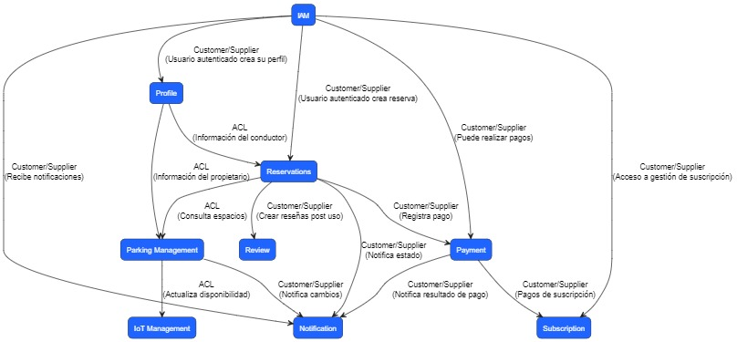
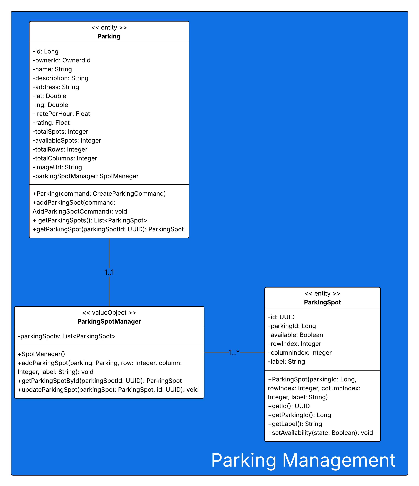
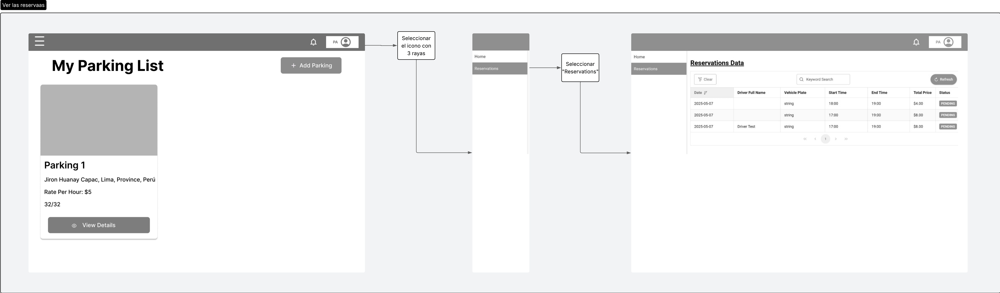
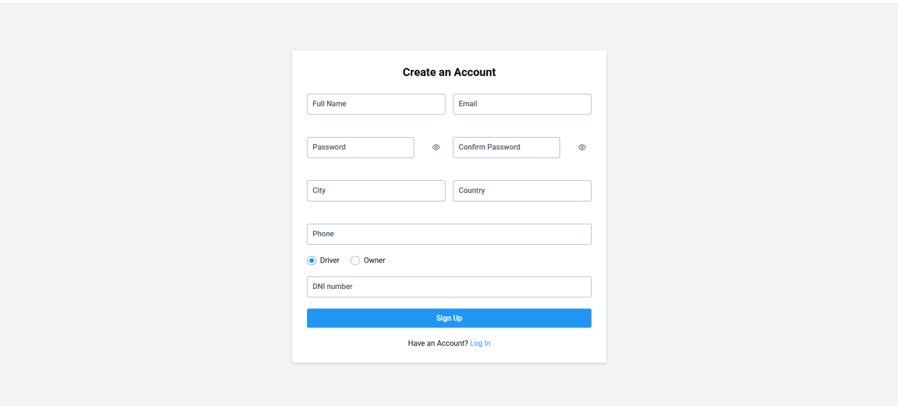
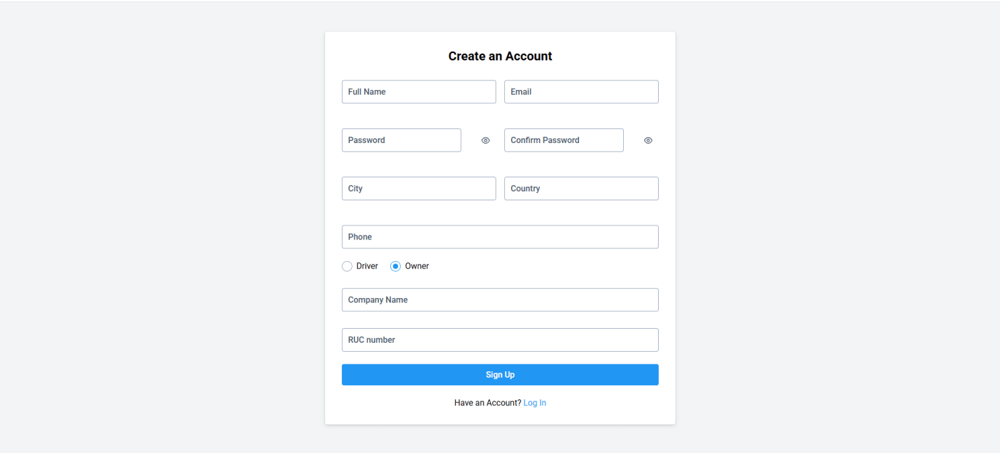

# Informe de Trabajo Final - TP

    <strong>Universidad Peruana de Ciencias Aplicadas</strong>  
    </img>  
    <strong>Ingeniería de Software - 202510</strong> 
    <strong>Ciclo: 07</strong>  
    <strong>1ASI0572 - Desarrollo de Soluciones IOT - 2971</strong>  
    <strong>Profesor: Velasquez Nuñez, Angel Augusto</strong>  
    <strong>INFORME DE TRABAJO FINAL - TP </strong> 

    <strong>Startup: IoT Innovators </strong> 
    <strong>Producto:  SmartParking </strong>

### Relación de integrantes
|      Apellidos y Nombres       |   Código   |
|:------------------------------:|:----------:|
|  Arroyo Ormeño, André Alonso   | u202114714 |
| Castilla Pachas, César Antonio | u202218735 |
| Cortés Casas, Joaquin Marcelo  | u202114545 |
|   Diaz Silva, Fernando Josué   | u202112722 |
|     Godoy, Johan Príncipe      | u202014511 |
| Tafur Gonzales, Josty Gerardo  | u20201c069 |
| Zarate Caceres, Victor Ernesto | u202112907 |

**Mayo, 2025**

---

# Registro de Versiones del Informe
| **Versión** | **Fecha**  | **Autor**                                                                                                                                                             | **Descripción de Modificación**                                                                                                                    |
|-------------|------------|-----------------------------------------------------------------------------------------------------------------------------------------------------------------------|----------------------------------------------------------------------------------------------------------------------------------------------------|
| 1.0.0       | 31/03/2025 | Cortés Casas, Joaquín Marcelo                                                                                                                                         | Creación del informe, incluyendo la adición de una carátula, una tabla de contenidos y todas las secciones correspondiente al primer entregable.   |
| 1.1.0       | 01/04/2025 | Zarate Caceres, Victor Ernesto                                                                                                                                        | Adición del Startup                                                                                                                                |
| 1.2.0       | 02/04/2025 | Zarate Caceres, Victor Ernesto   Castilla Pachas, César Antonio                                                                                                   | Adición del Solution Profile y Competidores.                                                                                                       |
| 1.3.0       | 04/04/2025 | Arroyo Ormeño, André Alonso   Godoy, Johan Príncipe                                                                                                           | Adición del Solution Profile, User Personas, Empathy Mappings, User Task Matrix, User Journey Mapping y As-Is Scenario Mapping.                    |
| 1.4.0       | 05/04/2025 | Arroyo Ormeño, André Alonso                                                                                                                                           | Adición del To-Be Scenario Mapping.                                                                                                                |
| 1.5.0       | 08/04/2025 | Zarate Caceres, Victor Ernesto                                                                                                                                        | Adición de User Stories.                                                                                                                           |
| 1.6.0       | 14/04/2025 | Cortés Casas, Joaquín Marcelo   Castilla Pachas, César Antonio   Diaz Silva, Fernando Josué                                                                   | Adición de registro de versiones del informe, student outcome, project report collaboration insights, Product Backlog y Event Storming.            |
| 1.7.0       | 16/04/2025 | Zarate Caceres, Victor Ernesto                                                                                                                                        | Adición del segmento objetivo.                                                                                                                     |
| 1.8.0       | 20/04/2025 | Cortés Casas, Joaquín Marcelo   Castilla Pachas, César Antonio                                                                                                    | Adición de diagramas de Software Architecture.                                                                                                     |
| 1.9.0       | 22/04/2025 | Arroyo Ormeño, André Alonso   Cortés Casas, Joaquín Marcelo   Castilla Pachas, César Antonio   Godoy, Johan Príncipe   Zarate Caceres, Victor Ernesto | Adición del Tactical-Level Domain-Driven Design para todos los bounded contexts.                                                                   |
| 1.10.0      | 23/04/2025 | Cortés Casas, Joaquín Marcelo   Castilla Pachas, César Antonio                                                                                                    | Adición de Bounded Context Canvases para todos los bounded contexts.                                                                               |
| 1.10.1      | 23/04/2025 | Zarate Caceres, Victor Ernesto                                                                                                                                        | Correción del menú y puntos faltantes en el documento                                                                                              |
| 1.10.2      | 28/04/2025 | Zarate Caceres, Victor Ernesto                                                                                                                                        | Correciones de enlaces y Student Outcome                                                                                                           |
| 2.0.0       | 28/04/2025 | Zarate Caceres, Victor Ernesto                                                                                                                                        | Añadir títulos para la entrega parcial (TP)                                                                                                        |
| 2.1.0       | 30/04/2025 | Principe Godoy, Johan                                                                                                                                                 | Añadir style guidelines for app web, mobile and iot                                                                                                |
| 2.2.0       | 30/04/2025 | Principe Godoy, Johan                                                                                                                                                 | Añadir Information Architecture including Organization Systems, Labeling Systems, SEO Tags and Meta Tags, Searching Systems and Navigation Systems |
| 2.2.1       | 30/04/2025 | Principe Godoy, Johan                                                                                                                                                 | Corrección de formato de tablas y Lean UX Problem Statements, Assumptions y Hypothesis Statements                                                  |
| 2.2.2       | 30/04/2025 | Principe Godoy, Johan                                                                                                                                                 | Corrección de los segmentos objetivos para que estén alineados con el Project Statement                                                            |
| 2.2.3       | 07/05/2025 | Zarate Cáceres, Victor Ernesto                                                                                                                                        | Corrección de User Stories and Product Backlog                                                                                                     |
| 2.2.4       | 10/05/2025 | Arroyo Ormeño, André Alonso   Zarate Cáceres, Victor Ernesto                                                                                                      | Correción de Tachnical Stories and Product Backlog                                                                                                 |
| 2.3.0       | 10/05/2025 | Tafur Gonzales, Josty Gerardo                                                                                                                                         | Añadir Entrevista de Segmento Propietarios                                                                                                         |                                                                                                                                    
| 2.3.1       | 11/05/2025 | Zarate Cáceres, Victor Ernesto                                                                                                                                        | Corrección de User Stories and Product Backlog                                                                                                     |
| 2.3.2       | 12/05/2025 | Castilla Pachas, César Antonio                                                                                                                                        | Añadir Applications Wireframes                                                                                                                     |
| 2.4.0       | 12/05/2025 | Tafur Gonzales, Josty Gerardo                                                                                                                                         | Añadir Applications User Flow Diagrams                                                                                                             |
| 2.5.0       | 12/05/2025 | Cortés Casas, Joaquín Marcelo                                                                                                                                         | Añadir Entrevistas faltantes                                                                                                                       |
| 2.6.0       | 12/05/2025 | Zarate Cáceres, Victor Ernesto                                                                                                                                        | Sprint Backlog 1                                                                                                                                   |
| 2.6.1       | 12/05/2025 | Cortés Casas, Joaquín Marcelo                                                                                                                                         | Correccion de Style Guidelines Section                                                                                                             |
| 2.7.0       | 12/05/2025 | Arroyo Ormeño, André Alonso   Cortés Casas, Joaquín Marcelo   Castilla Pachas, César Antonio   Godoy, Johan Príncipe   Zarate Caceres, Victor Ernesto | Añadir Evidencia de Ejecucion de Landing Page                                                                                                      |
| 2.8.0       | 12/05/2025 | Zarate Cáceres, Victor Ernesto                                                                                                                                        | Añadir Collaboration Insights                                                                                                                      |
| 2.9.0       | 12/05/2025 | Castilla Pachas, César Antonio                                                                                                                                        | Añadir Applications Wireflow Diagrams App Mobile y Application Wireflows Diagrams App                                                              |
| 2.9.1       | 12/05/2025 | Cortés Casas, Joaquín Marcelo                                                                                                                                         | Correccion de Ubiquitous Language                                                                                                                  |
| 2.9.2       | 12/05/2025 | Cortés Casas, Joaquín Marcelo   Zarate Cáceres, Victor Ernesto                                                                                                    | Correccion de Sprint 1                                                                                                                             |
| 2.9.3       | 13/05/2025 | Zarate Cáceres, Victor Ernesto                                                                                                                                        | Landing Page Deployment Configuration and Evidence                                                                                                 |
| 2.9.4       | 13/05/2025 | Zarate Cáceres, Victor Ernesto                                                                                                                                        | Añadir Execution Evidence of Web Application and update Development Evidence for Sprint Review                                                     |
| 2.10.0      | 13/05/2025 | Castilla Pachas, César Antonio                                                                                                                                        | Añadir Applications Mock-ups App Mobile                                                                                                            |
| 2.11.0      | 13/05/2025 | Castilla Pachas, César Antonio                                                                                                                                        | Añadir Applications Wireframes and Mock-ups Web App                                                                                                |
| 2.12.0      | 13/05/2025 | Castilla Pachas, César Antonio                                                                                                                                        | Añadir Application wireframess and mock-ups                                                                                                        |
---

# Project Report Collaboration Insights

**Enlace al repositorio del informe en GitHub:** https://github.com/SolucionesIoT-Grupo-IoTInnovators/report/blob/main/README.md

**Actividades de elaboración del informe**
#### TB1:
**Descripción de las actividades realizadas:**
- **Arroyo Ormeño, André Alonso:** Me encargue de realizar la creacion de los user persona, emphaty map, as is scenario mapping, to be scenario mapping y en la elaboracion de la documentacion de los domain, interface, application, infrastrcuture layer de los bounded context
- **Castilla Pachas, César Antonio:** He colaborado con la creacion de los competidores, product backlog, tambien en la creacion de los bounded context de profile y reservations, por ultimo ayude con la creacion de candidate context discovery.
- **Cortés Casas, Joaquin Marcelo:** He contribuido con la creación de la estructura del reporte y la adición de los capítulos de Entrevistas, Diagramas de Arquitectura de Software y de arquitectura de los bounded contexts.
- **Diaz Silva, Fernando Josué:** He colaborado con la creacion del event storming con cada uno de sus puntos en miro y luego pasado a este informe, ademas ayude con la creacion de Context Mapping.
- **Godoy, Johan Príncipe:** Para esta entrega, realicé la creación de los diagramas de clase y base de datos de los bounded contexts, así como la creación de los diagramas de arquitectura de software.
- **Tafur Gonzales, Josty Gerardo:** Lorem ipsum dolor sit amet, consectetur adipiscing elit. Suspendisse sit amet facilisis nisi. Fusce aliquet.
- **Zarate Caceres, Victor Ernesto:** He colaborado en identificar los antecedentes del problema a resolver y a diseñar las historias de Usuario que orientaran el desarrollo del presente proyecto.

**Evidencia de colaboración y commits en GitHub para el repositorio del informe:**

#### TP:
**Descripción de las actividades realizadas:**
- **Arroyo Ormeño, André Alonso:**
- **Castilla Pachas, César Antonio:**
- **Cortés Casas, Joaquin Marcelo:** He contribuido con la creación de los wireframes y mockups del landing page, ademas del prototipado de aplicación, sprint planning 1 y sprint backlog 1.
- **Diaz Silva, Fernando Josué:**
- **Godoy, Johan Príncipe:**
- **Tafur Gonzales, Josty Gerardo:**
- **Zarate Caceres, Victor Ernesto:** He colaborado en reescribir las User Stories para que se adapten mejor al alcance del curso, a definir el Software Configuration Management y a validar el funcionamiento inicial de nuestro producto.

**Evidencia de colaboración y commits en GitHub para el repositorio del informe:**

---

# Contenido
**Tabla de contenidos**

- [Student Outcome](#student-outcome)

- [Capítulo I: Introducción](#capítulo-i-introducción)
  - [1.1. Startup Profile](#11-startup-profile)
    - [1.1.1. Descripción de la Startup](#111-descripción-de-la-startup)
    - [1.1.2. Perfiles de integrantes del equipo](#112-perfiles-de-integrantes-del-equipo)
  - [1.2. Solution Profile](#12-solution-profile)
    - [1.2.1. Antecedentes y problemática](#121-antecedentes-y-problemática)
    - [1.2.2. Lean UX Process](#122-lean-ux-process)
      - [1.2.2.1. Lean UX Problem Statements](#1221-lean-ux-problem-statements)
      - [1.2.2.2. Lean UX Assumptions](#1222-lean-ux-assumptions)
      - [1.2.2.3. Lean UX Hypothesis Statements](#1223-lean-ux-hypothesis-statements)
      - [1.2.2.4. Lean UX Canvas](#1224-lean-ux-canvas)
  - [1.3. Segmentos objetivo](#13-segmentos-objetivo)
- [Capítulo II: Requirements Elicitation & Analysis](#capítulo-ii-requirements-elicitation--analysis)
  - [2.1. Competidores](#21-competidores)
    - [2.1.1. Análisis competitivo](#211-análisis-competitivo)
    - [2.1.2. Estrategias y tácticas frente a competidores](#212-estrategias-y-tácticas-frente-a-competidores)
  - [2.2. Entrevistas](#22-entrevistas)
    - [2.2.1. Diseño de entrevistas](#221-diseño-de-entrevistas)
    - [2.2.2. Registro de entrevistas](#222-registro-de-entrevistas)
    - [2.2.3. Análisis de entrevistas](#223-análisis-de-entrevistas)
  - [2.3. Needfinding](#23-needfinding)
    - [2.3.1. User Personas](#231-user-personas)
    - [2.3.2. User Task Matrix](#232-user-task-matrix)
    - [2.3.3. User Journey Mapping](#233-user-journey-mapping)
    - [2.3.4. Empathy Mapping](#234-empathy-mapping)
    - [2.3.5. As-is Scenario Mapping](#235-as-is-scenario-mapping)
  - [2.4. Ubiquitous Language](#24-ubiquitous-language)
- [Capítulo III: Requirements Specification](#capítulo-iii-requirements-specification)
  - [3.1. To-Be Scenario Mapping](#31-to-be-scenario-mapping)
  - [3.2. User Stories](#32-user-stories)
  - [3.3. Impact Mapping](#33-impact-mapping)
  - [3.4. Product Backlog](#34-product-backlog)
- [Capítulo IV: Solution Software Design](#capítulo-iv-solution-software-design)
  - [4.1. Strategic-Level Domain-Driven Design](#41-strategic-level-domain-driven-design)
    - [4.1.1. EventStorming](#411-eventstorming)
      - [4.1.1.1. Candidate Context Discovery](#4111-candidate-context-discovery)
      - [4.1.1.2. Domain Message Flows Modeling](#4112-domain-message-flows-modeling)
      - [4.1.1.3. Bounded Context Canvases](#4113-bounded-context-canvases)
    - [4.1.2. Context Mapping](#412-context-mapping)
    - [4.1.3. Software Architecture](#413-software-architecture)
      - [4.1.3.1. Software Architecture System Landscape Diagram](#4131-software-architecture-system-landscape-diagram)
      - [4.1.3.2. Software Architecture Context Level Diagrams](#4132-software-architecture-context-level-diagrams)
      - [4.1.3.3. Software Architecture Container Level Diagrams](#4133-software-architecture-container-level-diagrams)
      - [4.1.3.4. Software Architecture Deployment Diagrams](#4134-software-architecture-deployment-diagrams)
  - [4.2. Tactical-Level Domain-Driven Design](#42-tactical-level-domain-driven-design)
    - [4.2.1. Bounded Context: Identity and Access Management](#421-bounded-context-identity-and-access-management)
      - [4.2.1.1. Domain Layer](#4211-domain-layer)
      - [4.2.1.2. Interface Layer](#4212-interface-layer)
      - [4.2.1.3. Application Layer](#4213-application-layer)
      - [4.2.1.4. Infrastructure Layer](#4214-infrastructure-layer)
      - [4.2.1.5. Bounded Context Software Architecture Component Level Diagrams](#4215-bounded-context-software-architecture-component-level-diagrams)
      - [4.2.1.6. Bounded Context Software Architecture Code Level Diagrams](#4216-bounded-context-software-architecture-code-level-diagrams)
        - [4.2.1.6.1. Bounded Context Domain Layer Class Diagrams](#42161-bounded-context-domain-layer-class-diagrams)
        - [4.2.1.6.2. Bounded Context Database Design Diagram](#42162-bounded-context-database-design-diagram)
    - [4.2.2. Bounded Context: Profile Management](#422-bounded-context-profile-management)
      - [4.2.2.1. Domain Layer](#4221-domain-layer)
      - [4.2.2.2. Interface Layer](#4222-interface-layer)
      - [4.2.2.3. Application Layer](#4223-application-layer)
      - [4.2.2.4. Infrastructure Layer](#4224-infrastructure-layer)
      - [4.2.2.5. Bounded Context Software Architecture Component Level Diagrams](#4225-bounded-context-software-architecture-component-level-diagrams)
      - [4.2.2.6. Bounded Context Software Architecture Code Level Diagrams](#4226-bounded-context-software-architecture-code-level-diagrams)
        - [4.2.2.6.1. Bounded Context Domain Layer Class Diagrams](#42261-bounded-context-domain-layer-class-diagrams)
        - [4.2.2.6.2. Bounded Context Database Design Diagram](#42262-bounded-context-database-design-diagram)
    - [4.2.3. Bounded Context: Parking Management](#423-bounded-context-parking-management)
      - [4.2.3.1. Domain Layer](#4231-domain-layer)
      - [4.2.3.2. Interface Layer](#4232-interface-layer)
      - [4.2.3.3. Application Layer](#4233-application-layer)
      - [4.2.3.4. Infrastructure Layer](#4234-infrastructure-layer)
      - [4.2.3.5. Bounded Context Software Architecture Component Level Diagrams](#4235-bounded-context-software-architecture-component-level-diagrams)
      - [4.2.3.6. Bounded Context Software Architecture Code Level Diagrams](#4236-bounded-context-software-architecture-code-level-diagrams)
        - [4.2.3.6.1. Bounded Context Domain Layer Class Diagrams](#42361-bounded-context-domain-layer-class-diagrams)
        - [4.2.3.6.2. Bounded Context Database Design Diagram](#42362-bounded-context-database-design-diagram)
    - [4.2.4. Bounded Context: Reservation](#424-bounded-context-reservation)
      - [4.2.4.1. Domain Layer](#4241-domain-layer)
      - [4.2.4.2. Interface Layer](#4242-interface-layer)
      - [4.2.4.3. Application Layer](#4243-application-layer)
      - [4.2.4.4. Infrastructure Layer](#4244-infrastructure-layer)
      - [4.2.4.5. Bounded Context Software Architecture Component Level Diagrams](#4245-bounded-context-software-architecture-component-level-diagrams)
      - [4.2.4.6. Bounded Context Software Architecture Code Level Diagrams](#4246-bounded-context-software-architecture-code-level-diagrams)
        - [4.2.4.6.1. Bounded Context Domain Layer Class Diagrams](#42461-bounded-context-domain-layer-class-diagrams)
        - [4.2.4.6.2. Bounded Context Database Design Diagram](#42462-bounded-context-database-design-diagram)
    - [4.2.5. Bounded Context: Subscription](#425-bounded-context-subscription)
      - [4.2.5.1. Domain Layer](#4251-domain-layer)
      - [4.2.5.2. Interface Layer](#4252-interface-layer)
      - [4.2.5.3. Application Layer](#4253-application-layer)
      - [4.2.5.4. Infrastructure Layer](#4254-infrastructure-layer)
      - [4.2.5.5. Bounded Context Software Architecture Component Level Diagrams](#4255-bounded-context-software-architecture-component-level-diagrams)
      - [4.2.5.6. Bounded Context Software Architecture Code Level Diagrams](#4256-bounded-context-software-architecture-code-level-diagrams)
        - [4.2.5.6.1. Bounded Context Domain Layer Class Diagrams](#42561-bounded-context-domain-layer-class-diagrams)
        - [4.2.5.6.2. Bounded Context Database Design Diagram](#42562-bounded-context-database-design-diagram)
    - [4.2.6. Bounded Context: Review](#426-bounded-context-review)
      - [4.2.6.1. Domain Layer](#4261-domain-layer)
      - [4.2.6.2. Interface Layer](#4262-interface-layer)
      - [4.2.6.3. Application Layer](#4263-application-layer)
      - [4.2.6.4. Infrastructure Layer](#4264-infrastructure-layer)
      - [4.2.6.5. Component Level Diagram (estructura)](#4265-component-level-diagram-estructura)
      - [4.2.6.6. Bounded Context Software Architecture Code Level Diagrams](#4266-bounded-context-software-architecture-code-level-diagrams)
        - [4.2.6.6.1. Bounded Context Domain Layer Class Diagrams](#42661-bounded-context-domain-layer-class-diagrams)
        - [4.2.6.6.2. Bounded Context Database Design Diagram](#42662-bounded-context-database-design-diagram)
    - [4.2.7. Bounded Context: Notification](#427-bounded-context-notification)
      - [4.2.7.1. Domain Layer](#4271-domain-layer)
      - [4.2.7.2. Interface Layer](#4272-interface-layer)
      - [4.2.7.3. Application Layer](#4273-application-layer)
      - [4.2.7.4. Infrastructure Layer](#4274-infrastructure-layer)
      - [4.2.7.5. Bounded Context Software Architecture Component Level Diagrams](#4275-bounded-context-software-architecture-component-level-diagrams)
      - [4.2.7.6. Bounded Context Software Architecture Code Level Diagrams](#4276-bounded-context-software-architecture-code-level-diagrams)
        - [4.2.7.6.1. Bounded Context Domain Layer Class Diagrams](#42761-bounded-context-domain-layer-class-diagrams)
        - [4.2.7.6.2. Bounded Context Database Design Diagram](#42762-bounded-context-database-design-diagram)
    - [4.2.8. Bounded Context: IoT Management](#428-bounded-context-iot-management)
      - [4.2.8.1. Domain Layer](#4281-domain-layer)
      - [4.2.8.2. Interface Layer](#4282-interface-layer)
      - [4.2.8.3. Application Layer](#4283-application-layer)
      - [4.2.8.4. Infrastructure Layer](#4284-infrastructure-layer)
      - [4.2.8.5. Bounded Context Software Architecture Component Level Diagrams](#4285-bounded-context-software-architecture-component-level-diagrams)
      - [4.2.8.6. Bounded Context Software Architecture Code Level Diagrams](#4286-bounded-context-software-architecture-code-level-diagrams)
        - [4.2.8.6.1. Bounded Context Domain Layer Class Diagrams](#42861-bounded-context-domain-layer-class-diagrams)
        - [4.2.8.6.2. Bounded Context Database Design Diagram](#42862-bounded-context-database-design-diagram)
    - [4.2.9. Bounded Context: Payment](#429-bounded-context-payment)
      - [4.2.9.1. Domain Layer](#4291-domain-layer)
      - [4.2.9.2. Interface Layer](#4292-interface-layer)
      - [4.2.9.3. Application Layer](#4293-application-layer)
      - [4.2.9.4. Infrastructure Layer](#4294-infrastructure-layer)
      - [4.2.9.5. Bounded Context Software Architecture Component Level Diagrams](#4295-bounded-context-software-architecture-component-level-diagrams)
      - [4.2.9.6. Bounded Context Software Architecture Code Level Diagrams](#4296-bounded-context-software-architecture-code-level-diagrams)
        - [4.2.9.6.1. Bounded Context Domain Layer Class Diagrams](#42961-bounded-context-domain-layer-class-diagrams)
        - [4.2.9.6.2. Bounded Context Database Design Diagram](#42962-bounded-context-database-design-diagram)
- [Capítulo V: Solution UI/UX Design](#capítulo-v-solution-uiux-design)
  - [5.1. Style Guidelines](#51-style-guidelines)
    - [5.1.1. General Style Guidelines](#511-general-style-guidelines)
    - [5.1.2. Web, Mobile and IoT Style Guidelines](#512-web-mobile-and-iot-style-guidelines)
  - [5.2. Information Architecture](#52-information-architecture)
    - [5.2.1. Organization Systems](#521-organization-systems)
    - [5.2.2. Labeling Systems](#522-labeling-systems)
    - [5.2.3. SEO Tags and Meta Tags](#523-seo-tags-and-meta-tags)
    - [5.2.4. Searching Systems](#524-searching-systems)
    - [5.2.5. Navigation Systems](#525-navigation-systems)
  - [5.3. Landing Page UI Design](#53-landing-page-ui-design)
    - [5.3.1. Landing Page Wireframe](#531-landing-page-wireframe)
    - [5.3.2. Landing Page Mock-up](#532-landing-page-mock-up)
  - [5.4. Applications UX/UI Design](#54-applications-uxui-design)
    - [5.4.1. Applications Wireframes](#541-applications-wireframes)
    - [5.4.2. Applications Wireflow Diagrams](#542-applications-wireflow-diagrams)
    - [5.4.3. Applications Mock-ups](#543-applications-mock-ups)
    - [5.4.4. Applications User Flow Diagrams](#544-applications-user-flow-diagrams)
  - [5.5. Applications Prototyping](#55-applications-prototyping)
- [Capítulo VI: Product Implementation, Validation & Deployment](#capítulo-vi-product-implementation-validation-&-deployment)
  - [6.1. Software Configuration Management](#61-software-configuration-management)
    - [6.1.1. Software Development Environment Configuration](#611-software-development-environment-configuration)
    - [6.1.2. Source Code Management](#612-source-code-management)
    - [6.1.3. Source Code Style Guide & Conventions](#613-source-code-style-guide--conventions)
    - [6.1.4. Software Deployment Configuration](#614-software-deployment-configuration)
  - [6.2. Landing Page, Services & Applications Implementation](#62-landing-page-services--applications-implementation)
    - [6.2.1. Sprint 1](#621-sprint-1)
      - [6.2.1.1. Sprint Planning 1](#6211-sprint-planning-1)
      - [6.2.1.2. Aspect Leaders and Collaborators](#6212-aspect-leaders-and-collaborators)
      - [6.2.1.3. Sprint Backlog 1](#6213-sprint-backlog-1)
      - [6.2.1.4. Development Evidence for Sprint Review](#6214-development-evidence-for-sprint-review)
      - [6.2.1.5. Testing Suite Evidence for Sprint Review](#6215-testing-suite-evidence-for-sprint-review)
      - [6.2.1.6. Execution Evidence for Sprint Review](#6216-execution-evidence-for-sprint-review)
      - [6.2.1.7. Services Documentation Evidence for Sprint Review](#6217-services-documentation-evidence-for-sprint-review)
      - [6.2.1.8. Software Deployment Evidence for Sprint Review](#6218-software-deployment-evidence-for-sprint-review)
      - [6.2.1.9. Team Collaboration Insights during Sprint](#6219-team-collaboration-insights-during-sprint)
- [Conclusiones y recomendaciones](#conclusiones-y-recomendaciones)
- [Bibliografia](#bibliografia)
- [Anexos](#anexos)

---

# Student Outcome
El curso contribuye al cumplimiento del Student Outcome ABET:

**ABET – EAC - Student Outcome 5**
Criterio: La capacidad de funcionar efectivamente en un equipo cuyos miembros juntos proporcionan liderazgo, crean un entorno de colaboración e inclusivo, establecen objetivos, planifican tareas y cumplen objetivos.
En el siguiente cuadro se describe las acciones realizadas y enunciados de conclusiones por parte del grupo, que permiten sustentar el haber alcanzado el logro del ABET – EAC - Student Outcome 5.

  <table align="justify">
    <tr>
      <td width="25%">
        Criterio específico
      </td>
      <td>
        Acciones realizadas
      </td>
      <td>
        Conclusiones
      </td>
    </tr>
    <!--Primer Criterio-->
    <tr>
      <td>
        Trabaja en equipo para proporcionar liderazgo en forma conjunta
      </td>
      <!--Ingresar Accion Realizada por Entregable-->
      <td>
        <!--Andre Alonso-->
        Arroyo Ormeño, André Alonso:  
        TB1: 
        En el grupo pude aportar formatos a seguir para completar ciertas secciones aliviando asi sus dudas. Asimismo participe activamente en las llamadas en las cuales nos reuniamos para organizar y avanzar el trabajo.  
        TP: 
        En el grupo pude aportar en la corrección de errores para la elaboración de los diagramas C4, así como también colaboré en la asignación de tareas.
          
        <!--Cesar-->
        Castilla Pachas, César Antonio  
        TB1:  En grupo pudimos repartirnos correctamente las partes del trabajo, ademas de compartir nuestras ideas y apoyarnos en cada punto de esta entrega, donde pude mejorar mi trabajo en equipo para el desarrollo de este informe aportando ideass y sugerencias.  
        TP: 
        En esta entrega me involucré en las coordinaciones grupales para asegurar el cumplimiento de los entregables. Participé activamente en la validación del diseño de los wireflows y propuse mejoras basadas en los user stories. También ayudé a consolidar los insumos desarrollados por el grupo para integrar el documento final, promoviendo el orden y la claridad del contenido.
          
        <!--Joaquin-->
        Cortés Casas, Joaquin Marcelo  
        TB1: 
        Asumi la responsabilidad de coordinar al equipo en la asignación de las primeras tareas y resolución de dudas. De esta manera, fomenté el liderazgo promoviendo la participación y aporte de todos los miembros del grupo.  
        TP: 
        Impulsé el liderazgo colaborativo coordinando instancias de validación y asegurándome de que todas las voces fueran escuchadas. Mi enfoque estuvo centrado en fortalecer el trabajo colectivo y mantener la cohesión del grupo.
          
        <!--Fernando-->
        Diaz Silva, Fernando Josué  
        TB1: 
        Nuestro equipo logró ejercer un liderazgo compartido mediante la asignación equitativa de responsabilidades y la promoción activa del diálogo entre nosotros. Se evidenció una coordinación efectiva durante las reuniones, así como la iniciativa de varios integrantes para guiar y orientar al grupo, lo cual permitió un trabajo organizado, colaborativo y enfocado en resultados comunes.  
        TP: 
        Mantuve una actitud proactiva en las coordinaciones grupales, promoviendo el diálogo y la toma de decisiones compartidas. Apoyé a mis compañeros cuando surgían dudas y propicié un ambiente donde todos pudieran aportar al desarrollo conjunto.
          
        <!--Johan-->
        Godoy, Johan Príncipe  
        TB1: 
        En el grupo pude aportar formatos a seguir para completar ciertas secciones aliviando asi sus dudas. Asimismo participe activamente en las llamadas en las cuales nos reuniamos para organizar y avanzar el trabajo.  
        TP: 
        Ayudé a mantener un liderazgo compartido a través del apoyo constante a mis compañeros y la disposición para colaborar. Estuve presente en las decisiones importantes y promoví el equilibrio en la carga de trabajo grupal.
          
        <!--Josty-->
        Tafur Gonzales, Josty Gerardo  
        TB1: 
        De manera grupal, pudimos organizarnos correctamente para poder realizar el trabajo, asignando tareas a cada uno de los integrantes del grupo. Se realizaron reuniones para coordinar las tareas a realizar y se utilizó Github para poder ver el avance de cada uno de los integrantes.  
        TP: 
        Aporté al liderazgo grupal incentivando la responsabilidad de cada miembro, facilitando la organización y promoviendo la coordinación entre nosotros. Siempre estuve dispuesto a escuchar y guiar en caso de dificultades.
          
        <!--Victor-->
        Zarate Caceres, Victor Ernesto   
        TB1: 
        Se organizaron reuniones para coordinar las tareas a realizar, buscando que estas sean divididas justamente. Además el uso de Github nos permite estar al tanto del avance conjunto, para asi estar al tanto de los avances que se hacen como grupo y poder tomas decisiones que sen transparentes con la integridad del equipo.  
        TP: 
        Se realizo un trabajo conjunto para mantener un trabajo continuo y uniforme. El uso de Github nos permitio avanzar de forma conjunto y mantener nuestros avances al alcance de todo el grupo, permitiendo a todos aportar en todo momento.
      </td>
      <!--Ingresar Conclusion por Entregable-->
      <td>
        TB1: 
        Logramos una organización eficiente, distribuyendo tareas de manera equitativa y utilizando herramientas como GitHub para mantener un seguimiento transparente del avance. Aportamos ideas, resolvimos dudas en conjunto y mantuvimos una comunicación constante mediante reuniones de coordinación. Asumimos un liderazgo compartido, donde cada miembro contribuyó activamente. Esta experiencia reforzó nuestras habilidades colaborativas y demostró la importancia de la planificación y el trabajo en equipo para alcanzar objetivos comunes.  
        TP: 
        Logramos mantener un liderazgo compartido en el grupo, en el que todos los integrantes participaron activamente en la toma de decisiones, la organización de actividades y el apoyo entre pares. Esta dinámica fortaleció nuestras capacidades para liderar en conjunto y nos permitió avanzar de forma cohesionada hacia los objetivos del entregable.
          
      </td>
    </tr>
    <!--Segundo Criterio-->
    <tr>
      <td>
        Crea un entorno colaborativo e inclusivo, establece metas, planifica tareas y cumple objetivos.
      </td>
      <!--Ingresar Accion Realizada por Entregable-->
      <td>
        <!--Andre Alonso-->
        Arroyo Ormeño, André Alonso:  
        TB1: 
        Se coordino de manera conjunta las tareas a realizar para esta entrega, asi como a traves de los canales de comunicacion nos hemos pudido ayudar unos a otros a solventar dudas o realizar correciones sobre el trabajo realizado.  
        TP: 
        Para esta entrega parcial se creo un figma colaborativo para el desarrollo de los mockups y wireframe para la landing page, web app, mobile app. Asimismo a traves de canal de whatsapp nos ayudamos unos a otros para mejorar la elaboracion del trabajo.
          
        <!--Cesar-->
        Castilla Pachas, César Antonio  
        TB1: Para la entrega de este informe se coordino de manera grupal todos los pendientes de este proyecto trabajando de manera colaborativa, cumplinedo metas y objetivos para entregar un buen informe.  
        TP: 
        Aporté a la planificación del trabajo colaborativo definiendo fechas para revisar avances internos antes de cada entrega. Apoyé la integración de los diagramas en Figma y el orden de los flujos en base a los objetivos de cada user persona. Además, brindé ayuda a mis compañeros cuando tenían dificultades técnicas con Figma o estructuración del documento, promoviendo así un entorno de ayuda mutua.
          
        <!--Joaquin-->
        Cortés Casas, Joaquin Marcelo  
        TB1: 
        Me he encargado de definir metas semanales para todos los integrantes del grupo, facilitando un ambiente colaborativo por medio de reuniones periódicas y revisión conjunta de avances realizados.  
        TP: 
        Favorecí un entorno colaborativo al coordinar el cumplimiento de metas grupales y fomentar la planificación conjunta de tareas. Me aseguré de que todos los integrantes pudieran involucrarse activamente en el trabajo.
          
        <!--Fernando-->
        Diaz Silva, Fernando Josué  
        TB1: 
        Se logró establecer un entorno de trabajo inclusivo y respetuoso, con metas claras y planificación consensuada. A través del uso de herramientas colaborativas como GitHub y canales de comunicación constantes, el grupo demostró capacidad de organización, responsabilidad compartida y cumplimiento efectivo de los objetivos planteados en la entrega.  
        TP: 
        Establecí un ambiente de trabajo ordenado y respetuoso, impulsando la colaboración continua y el cumplimiento de las tareas acordadas. Promoví el trabajo en equipo de forma equitativa y comprometida.
          
        <!--Johan-->
        Godoy, Johan Príncipe  
        TB1: 
        Se coordino de manera conjunta las tareas a realizar para esta entrega, asi como a traves de los canales de comunicacion nos hemos pudido ayudar unos a otros a solventar dudas o realizar correciones sobre el trabajo realizado.  
        TP: 
        Aporté a un entorno de colaboración constante, facilitando la comunicación y apoyando a mis compañeros en todo momento. Fomenté el respeto mutuo y la planificación grupal para cumplir nuestras metas.
          
        <!--Josty-->
        Tafur Gonzales, Josty Gerardo  
        TB1: 
        Se coordinó en equipo las tareas que debia resolver cada uno de los miembros y la metodología que se seguiría para la correcta realización del reporte mediante Github.  
        TP: 
        Apoyé en mantener un entorno de trabajo positivo, en el que la inclusión y el cumplimiento de objetivos fueron prioritarios. Promoví la participación activa y equitativa de todos.
          
        <!--Victor-->
        Zarate Caceres, Victor Ernesto 
        TB1: 
        Se procuro que la toma de decisiones fuera de manera conjunta, considerando cada punto de vista, para asi tomar las decisiones más justas. Además, el uso de Github nos permitio mantener un entorno de trabajo conjunto y trasnparente. 
        TP: 
        Nos organizamos para realizar un trabajo conjunto y recurrente. De esta manera, podiamos estar al tanto de los nuevos cambios, para poder revisarlos, validarlos y aprobarlos cuando cumpliesen con los requisitos esperados.
      </td>
      <!--Ingresar Conclusion por Entregable-->
      <td>
        TB1: 
        Trabajamos de manera coordinada, distribuyendo tareas equitativamente y estableciendo metas semanales mediante reuniones periódicas. Utilizamos GitHub y mantuvimos una comunicación constante para resolver dudas, hacer correcciones y revisar avances de forma colaborativa. Fomentamos un ambiente inclusivo donde cada miembro contribuyó con sus ideas, logrando consensos en las decisiones y manteniendo transparencia en todo el proceso. Gracias a esta organización conjunta y al compromiso de todos, logramos cumplir el trabajo en el plazo establecido.
          
        TP: 
        Logramos mantener un entorno colaborativo e inclusivo, donde todos los integrantes participaron activamente en la planificación y cumplimiento de las metas establecidas. Se promovió el respeto, la escucha activa y la equidad en la participación, permitiendo un desarrollo armónico y efectivo del trabajo en equipo.
          
      </td>
    </tr>
  </table>

# Capítulo I: Introducción
## 1.1. Startup Profile
### 1.1.1. Descripción de la Startup

    IotInnovators es una startup peruana orientada a desarrollar soluciones innovadoras, enfocada en el uso de tecnología Internet of Things (IoT) para lograrlo. Su principal producto es SmartParking, que nace como respuesta ante la ineficiente gestión de estacionamientos en espacios públicos de alto tráfico. En muchas ciudades, los conductores pierden un tiempo considerable buscando espacios de estacionamiento disponibles, lo que genera congestión vehicular, aumenta la contaminación ambiental y reduce la satisfacción del usuario.
    Nuestra solución utiliza tecnología IoT para optimizar la administración de grandes estacionamientos, permitiendo la detección en tiempo real de espacios libres, la reserva de estacionamientos a través de una aplicación móvil y la integración con sistemas de pago automatizados.  
    Con SmartParking buscamos optimizar el uso de los estacionamientos, para que sean más eficientes y sostenibles, mejorando la movilidad urbana, y facilitando el día a día de conductores y propietarios de los estacionamientos.
    <ul>
      <li>
        <b>Misión:</b>
      </li>
      Revolucionar la gestión de estacionamientos a través de la tecnología IoT, proporcionando una solución inteligente que optimice el uso del espacio, reduzca el tiempo de búsqueda y mejore la experiencia del usuario.
      <li>
        <b>Visión:</b>
      </li>
      Ser la plataforma líder de estacionamientos inteligentes a nivel nacional, contribuyendo a la movilidad eficiente, promoviendo soluciones tecnológicas sostenibles.
    </ul>

### 1.1.2. Perfiles de integrantes del equipo
Los integrantes que conforman la startup son:

| Integrante                                 | Perfil                                                                                                                                                                                                                                                                                                                                                                                                                                                                                                                                                                  | Foto                                                                                                                                                                                     | 
|:-------------------------------------------|-------------------------------------------------------------------------------------------------------------------------------------------------------------------------------------------------------------------------------------------------------------------------------------------------------------------------------------------------------------------------------------------------------------------------------------------------------------------------------------------------------------------------------------------------------------------------|------------------------------------------------------------------------------------------------------------------------------------------------------------------------------------------|
| Arroyo Ormeño, André Alonso (202114714)    | Soy estudiante de la carrera de Ingeniería de Software en la UPC. Me considero una persona responsable, estudioso y disciplinado. Desde pequeño siempre he tenido ese interés por la tecnología y dicha curiosidad me ha llevado a elegir esta carrera. Espero en el futuro adquirir los conocimientos necesarios de esta carrera para poder vivir de lo que me gusta.                                                                                                                                                                                                  |  |
| Castilla Pachas, César Antonio (202218735) | Tengo 21 años y estudió la carrera de Ingeniería de Software en la Universidad Peruana de Ciencias Aplicadas. Me encanta crear páginas web y dar soluciones creativas, soy una persona responsable y puntual. Además, me encanta trabajar en equipo. Cada día me gusta aprender algo nuevo y poder ampliar mis conocimientos.                                                                                                                                                                                                                                           |                                                 |
| Cortés Casas, Joaquin Marcelo (202114545)  | Soy Joaquín Marcelo Cortés Casas, estudiante de la carrera Ingeniería de Software en la UPC. Tengo experiencia previa liderando múltiples equipos de trabajo, buscando el compromiso y enfoque en la calidad del producto final. Cada día actualizo mis conocimientos de software probando distintas tecnologías innovadoras.                                                                                                                                                                                                                                           |                                                                                                                     |
| Diaz Silva, Fernando Josué (202112722)     | Soy Fernando Diaz, tengo 21 años, me apasiona la tecnología, actualmente estudio la carrera de ingeniería de software en la Universidad Peruana de Ciencias Aplicadas(UPC). A lo largo de la carrera he desarrollado distintas habilidades, mi principal enfoque en esta carrera parte del software como tal y el ámbito empresarial, para lo cual planeo realizar un MBA. Soy una persona proactiva, responsable y disciplinada. Estoy preparado para desarrollar un buen trabajo junto a mi equipo y aplicar todo el conocimiento adquirido a lo largo de mi carrera. |                                                              |
| Godoy, Johan Príncipe (202014511)          | Soy Johan Príncipe, considero que seré un aporte importante al equipo debido a mis conocimientos en programación y mi capacidad para resolver problemas. Me apasiona el desarrollo de software y la creación de soluciones innovadoras. Estoy comprometido a contribuir al éxito del proyecto y a aprender de mis compañeros.                                                                                                                                                                                                                                           |                        |
| Tafur Gonzales, Josty Gerardo (20201c069)  | Soy Josty Tafur, estudiante de Ing. de software, cursando el décimo ciclo. Me apasiona aprender cosas nuevas y estoy siempre en busqueda de nuevos desafios que me ayuden a mejorar mis habilidades. Me considero una persona responsable, solidaria y con grabn capacidad de trabajar en equipo.                                                                                                                                                                                                                                                                       |                                                                                                                        |
| Zarate Caceres, Victor Ernesto (202112907) | Soy Ernesto Zarate, estudiante de Ingeniería de Software. Me considero una persona responsable, capaz de aportar distintas ideas y de organizar el trabajo para el desarrollo de nuevos proyectos. Tengo el compromiso de trabajar eficientemente y realizar las entregas en el plazo indicado                                                                                                                                                                                                                                                                          |                                                                                                                          |

## 1.2. Solution Profile
### 1.2.1. Antecedentes y problemática

  <ul>
    <li>
      <b>What (Qué):</b> Desarrollar una solución IoT para la gestión inteligente de estacionamientos públicos, que permita:
      <ul>
        <li>Monitorear en tiempo real la disponibilidad de espacios.</li>
        <li>Reducir el tiempo de búsqueda de estacionamiento, disminuyendo la congestión vehicular</li>
        <li>Optimizar el cobro automatizado y la fiscalización mediante sensores y aplicaciones móviles.</li>
      </ul>
    </li>
    <li>
      <b>When (Cuándo): </b>La congestión por falta de estacionamiento es un problema persistente, pero se ha agravado en la última década debido al crecimiento vehicular. Un informe de la Asociación Automotriz del Perú (2023) señala que Lima un crecimiento de más de 100000 vehículos al año, lo que ocasiona cada vez más tráfico, que empeora durante las horas pico (7:00 - 9:00 AM y 5:00 - 8:00 PM).
    </li>
    <li>
      <b>Where (Dónde): </b>La problemática es crítica en ciudades con alta densidad vehicular, como Lima, Arequipa y Trujillo. Según un estudio de Lima Cómo Vamos (2022), el 60% del tráfico en distritos como Miraflores y San Isidro se debe a vehículos buscando estacionamiento.
    </li>
    <li>
      <b>Who (Quién): </b> La problemática afecta principalmente a conductores que buscan estacionamiento en zonas urbanas congestionadas. Según el Instituto Nacional de Estadística e Informática (INEI, 2022), el movimiento vehicular crecio en un 5,7%, lo que exacerba la demanda de espacios de estacionamiento. Además, las autoridades locales enfrentan desafíos en la fiscalización y gestión eficiente de estos espacios.
    </li>
    <li>
      <b>Why (Por qué): </b>La falta de gestión eficiente de estacionamientos genera:
      <ul>
        <li>Pérdidas económicas por tiempo improductivo en búsqueda de estacionamiento</li>
        <li>Contaminación ambiental debido a emisiones innecesarias.¿</li>
        <li>Estrés en conductores, reduciendo la calidad de vida urbana</li>
      </ul>
    </li>
    <li>
      <b>How (Cómo): </b>La solución propuesta integra:
      <ul>
        <li>Sensores IoT para detectar ocupación en tiempo real</li>
        <li>Plataforma centralizada para gestionar datos y procesar pagos digitales</li>
        <li>App móvil que guíe a los conductores a espacios disponibles</li>
        <li>Sistema de cobro automatizado para reducir evasión y mejorar ingresos municipales</li>
      </ul>
    </li>
    <li>
      <b>How Much (Cuánto):</b>
      <ul>
        <li>Impacto económico: Reducción del 30% en tiempo de búsqueda de estacionamiento</li>
        <li>Impacto ambiental: Disminución de emisiones de CO₂ en un 15% al reducir la congestión</li>
        <li>Retorno de inversión: Las municipalidades podrían aumentar ingresos mediante tarifas dinámicas y multas automatizadas.</li>
      </ul>
    </li>
  </ul>

### 1.2.2. Lean UX Process
#### 1.2.2.1. Lean UX Problem Statements

**Domain**  
El dominio de este proyecto es la gestión inteligente de estacionamientos urbanos, facilitando la búsqueda, reserva y administración de espacios de parqueo mediante una aplicación móvil y web que conecta conductores con espacios disponibles en tiempo real.

**Customer Segments**
- **Conductores particulares:** Personas que necesitan encontrar estacionamiento de manera rápida, segura y sin complicaciones, especialmente en zonas urbanas congestionadas.
- **Propietarios de estacionamientos:** Dueños de espacios de parqueo públicos o privados que desean rentabilizar sus espacios al ofrecerlos dentro de la plataforma.

**Pain Points**
- **Pérdida de tiempo buscando parqueo:** Los conductores pierden minutos valiosos circulando hasta encontrar un espacio disponible, especialmente en horas pico o en zonas concurridas.
- **Falta de visibilidad de disponibilidad en tiempo real:** Muchos estacionamientos no cuentan con sistemas digitales que informen de su disponibilidad.
- **Inseguridad al estacionar en lugares desconocidos:** Los usuarios muchas veces deben dejar sus vehículos en lugares no confiables o inseguros por no tener alternativas claras.
- **Falta de control en la gestión de espacios para propietarios:** Los dueños de estacionamientos no tienen herramientas para gestionar reservas, horarios o tarifas de forma eficiente.

**Gap**  
Actualmente, existen pocas soluciones locales integradas que permitan a los conductores reservar parqueos de forma anticipada y a los propietarios gestionar eficientemente su disponibilidad. La mayoría de aplicaciones son genéricas, no se integran con el entorno urbano ni ofrecen información en tiempo real de manera clara y confiable.

**Visión/Estrategia**  
Brindar una solución digital que:
- Permita a los conductores encontrar y reservar estacionamientos disponibles en segundos.
- Ofrezca información actualizada sobre disponibilidad, seguridad y ubicación.
- Genere ingresos pasivos a propietarios al permitirles publicar y controlar sus espacios desde un panel de administración.
- Reduzca la congestión vehicular al disminuir el tiempo dedicado a buscar parqueo.

**Initial Segment**
- **Conductores urbanos jóvenes y adultos** (18–45 años) que usan smartphones y desean optimizar su tiempo.
- **Propietarios de parqueos en zonas de alta demanda** (comerciales o residenciales) interesados en monetizar su espacio disponible.

#### 1.2.2.2. Lean UX Assumptions
###### Business Assumptions

- **La solución IoT mejorará la eficiencia de los estacionamientos**: Se asume que al integrar sensores IoT para detectar la disponibilidad de espacios y realizar reservas automáticas, los tiempos de búsqueda de estacionamiento disminuirán significativamente, mejorando la eficiencia de los usuarios.
- **El mercado está dispuesto a adoptar nuevas tecnologías de estacionamiento**: Se asume que los conductores y propietarios de estacionamientos estarán dispuestos a adoptar soluciones tecnológicas avanzadas como el IoT para mejorar la experiencia de estacionamiento.
- **El costo de implementación será recuperable rápidamente**: Se asume que los costos de implementar sensores IoT y la infraestructura de la aplicación se recuperarán rápidamente gracias a la mejora en la eficiencia y la experiencia del usuario, lo que atraerá más clientes a los estacionamientos.
- **La solución aumentará la satisfacción del usuario**: Se asume que una experiencia de estacionamiento más rápida y eficiente resultará en una mayor satisfacción de los conductores y propietarios de estacionamientos, lo que fomentará la lealtad de los clientes.
- **El proyecto es escalable**: Se asume que la solución puede expandirse para cubrir tanto pequeños estacionamientos urbanos como grandes áreas comerciales y centros de estacionamiento a nivel nacional.

###### Business Outcome Assumptions

- **Aumento en las reservas de estacionamiento**: Se asume que al mejorar la disponibilidad y eficiencia de los espacios de estacionamiento, habrá un incremento en las reservas realizadas a través de la app.
- **Reducción de costos operativos para propietarios**: Se asume que la automatización de la gestión de estacionamientos reducirá la necesidad de personal adicional y otros costos operativos relacionados.
- **Mejora en la satisfacción del cliente**: Se asume que los conductores disfrutarán de una experiencia de estacionamiento más fluida y rápida, lo que aumentará la retención de usuarios y el uso recurrente de la aplicación.

###### User Assumptions

- **Los conductores preferirán un sistema de estacionamiento automatizado**: Se asume que los conductores estarán dispuestos a utilizar la tecnología IoT para encontrar espacios de estacionamiento más fácilmente y realizar reservas con rapidez.
- **Los propietarios de estacionamientos adoptarán el sistema de reservas IoT**: Se asume que los propietarios de estacionamientos verán los beneficios de integrar sensores IoT y la aplicación, facilitando la gestión de los espacios y la optimización de las tarifas.
- **Los usuarios no tendrán problemas con la interfaz de la app**: Se asume que la interfaz de usuario de la aplicación será intuitiva, lo que permitirá a los conductores y propietarios utilizar la app sin necesidad de una capacitación extensa.

###### User Outcome Assumptions

- **Aumento en la satisfacción del conductor**: Se asume que los conductores estarán más satisfechos con una experiencia de estacionamiento más rápida, con la posibilidad de reservar espacios con antelación y obtener actualizaciones en tiempo real.
- **Mejora en la gestión del estacionamiento para propietarios**: Se asume que los propietarios de estacionamientos estarán más satisfechos con la reducción en la complejidad de la gestión de espacios, y que se beneficiarán de un sistema más eficiente que maximice las ganancias por espacio ocupado.

###### Feature Assumptions

- **Detección de disponibilidad de espacios mediante IoT**: Sensores IoT en los espacios de estacionamiento detectarán si están ocupados o disponibles, proporcionando datos en tiempo real a la app para que los conductores puedan encontrar rápidamente espacios disponibles.
- **Sistema de reservas automáticas**: La aplicación permitirá a los conductores hacer reservas de estacionamiento en tiempo real o con antelación, basándose en la información proporcionada por los sensores IoT de los espacios disponibles.
- **Monitoreo en tiempo real de los espacios de estacionamiento**: El sistema notificará a los propietarios de estacionamientos sobre la ocupación de sus espacios y podrá ajustar dinámicamente las tarifas de acuerdo con la demanda.
- **Interfaz de administración centralizada para propietarios**: Un panel centralizado permitirá a los propietarios de estacionamientos monitorear en tiempo real la disponibilidad de sus espacios, gestionar tarifas y hacer ajustes rápidos.
- **Integración con sistemas de pago**: El sistema IoT se conectará con plataformas de pago para permitir que los conductores paguen por su espacio de estacionamiento directamente a través de la aplicación.

#### 1.2.2.3. Lean UX Hypothesis Statements

###### Hipótesis 1:
Creemos que los conductores adoptarán SmartParking si ofrecemos una plataforma fácil de usar para encontrar y reservar estacionamiento en tiempo real.

Sabremos que hemos tenido éxito cuando al menos el 70% de los conductores activos usen la plataforma para realizar al menos una reserva de estacionamiento semanal.

###### Hipótesis 2:
Creemos que los propietarios de estacionamiento verán valor en nuestra plataforma si les ayudamos a gestionar eficientemente sus espacios, reduciendo el tiempo vacío y mejorando la rentabilidad.

Sabremos que hemos tenido éxito cuando al menos el 60% de los propietarios de estacionamiento aumenten su tasa de ocupación en un 20% en los primeros tres meses.

###### Hipótesis 3:
Creemos que una interfaz intuitiva y un proceso de reserva rápido incrementarán la tasa de adopción de SmartParking entre conductores urbanos que enfrentan problemas para encontrar estacionamiento.

Sabremos que hemos tenido éxito cuando más del 80% de los conductores encuentren el proceso de reserva fácil de usar en las primeras dos semanas de uso.

###### Hipótesis 4:
Creemos que los propietarios estarán dispuestos a pagar por suscripciones premium si ofrecemos funcionalidades avanzadas como informes de ocupación y gestión de tarifas dinámicas.

Sabremos que hemos tenido éxito cuando al menos el 25% de los propietarios de estacionamiento pasen a una suscripción premium en los primeros seis meses.

###### Hipótesis 5:
Creemos que el soporte técnico y la educación sobre el uso de la plataforma mejorarán la experiencia de los usuarios y reducirán el tiempo de adopción.

Sabremos que hemos tenido éxito cuando la tasa de adopción inicial entre los nuevos usuarios alcance el 90% y la tasa de abandono sea menor al 15% en los primeros tres meses.

#### 1.2.2.4. Lean UX Canvas

  <table width="100%" border="1" cellpadding="10" cellspacing="0">
    <tr>
      <td width="33%" valign="top">
        <h4>Business Problem</h4>
        <ul>
          <li>Alta demanda de estacionamientos en zonas urbanas con congestión vehicular y falta de disponibilidad de espacios.</li>
          <li>Procesos manuales y poco eficientes en la gestión de estacionamientos por parte de propietarios, lo que genera baja ocupación y pérdida de ingresos.</li>
          <li>Los conductores pierden tiempo buscando estacionamiento, lo que incrementa el tráfico y el estrés urbano.</li>
        </ul>
      </td>
      <td rowspan="2" width="33%" valign="top">
        <h4>Solutions</h4>
        <ul>
          <li>Aplicación móvil para conductores con búsqueda, reserva y pago de estacionamiento.</li>
          <li>Plataforma web para propietarios con monitoreo de ocupación, estadísticas y gestión de ingresos.</li>
          <li>Integración de dispositivos IoT para monitoreo en tiempo real de espacios disponibles.</li>
          <li>Sistema de notificaciones sobre disponibilidad, precios y vencimiento de reservas.</li>
          <li>Visualización de espacios libres mediante geolocalización en tiempo real.</li>
        </ul>
      </td>
      <td width="33%" valign="top">
        <h4>Business Outcomes</h4>
        <ul>
          <li>Aumento en la ocupación de estacionamientos al optimizar el uso de los espacios disponibles.</li>
          <li>Reducción del tiempo de búsqueda de estacionamiento para conductores.</li>
          <li>
          Mayor eficiencia en la gestión de estacionamientos para los propietarios mediante herramientas de análisis y monitoreo en tiempo real.</li>
          <li>Monetización efectiva mediante suscripciones, comisiones por transacción y venta de dispositivos IoT.</li>
        </ul>
      </td>
    </tr>
    <tr>
      <td valign="top">
        <h4>Users</h4>
        <ul>
          <li>Conductores que buscan estacionamiento de forma rápida y eficiente.</li>
          <li>Propietarios de estacionamientos que desean maximizar la ocupación y optimizar la gestión de sus espacios.</li>
        </ul>
      </td>
      <td valign="top">
        <h4>User Outcomes & Benefits</h4>
        <ul>
          <li>Menor tiempo de búsqueda de estacionamiento para los conductores.</li>
          <li>Incremento en la ocupación de espacios para los propietarios.</li>
          <li>Interacción fluida y en tiempo real a través de la app móvil y la plataforma web.</li>
          <li>Proceso de pago automatizado y seguro.</li>
        </ul>
      </td>
    </tr>
    <tr>
      <td valign="top">
        <h4>Hypotheses</h4>
        <ul>
          <li>Creemos que ofrecer información en tiempo real sobre la disponibilidad de estacionamientos permitirá a los conductores reducir el tiempo de búsqueda en un 30%. Sabremos que hemos tenido éxito cuando veamos una reducción del tiempo promedio de búsqueda registrada en la app.</li>
          <li>Creemos que la implementación de un sistema de gestión centralizado aumentará la ocupación de estacionamientos en un 20%. Sabremos que tuvimos éxito cuando los propietarios reporten un aumento significativo en el uso de sus espacios.</li>
          <li>Creemos que ofrecer un sistema automatizado de pagos mejorará la experiencia del usuario, reduciendo los errores y tiempos de procesamiento. Sabremos que tuvimos éxito cuando el 90% de los pagos se realicen a través de la app.</li>
          <li>Creemos que una experiencia positiva de uso fomentará recomendaciones orgánicas, aumentando el número de usuarios. Sabremos que tuvimos éxito cuando al menos el 30% de los nuevos registros provengan de referencias.</li>
        </ul>
      </td>
      <td valign="top">
        <h4>What's the most important thing we need to learn first?</h4>
        <ul>
          <li>Identificar los principales puntos de dolor de los conductores al buscar estacionamiento en zonas congestionadas.</li>
          <li>Analizar los métodos actuales de gestión utilizados por los propietarios de estacionamientos.</li>
          <li>Conocer el comportamiento de los usuarios respecto al uso de aplicaciones similares en el mercado.</li>
          <li>Validar el interés de los propietarios en adoptar tecnología IoT para el monitoreo de espacios.</li>
        </ul>
      </td>
      <td valign="top">
        <h4>What's the least amount of work we need to do to learn the next most important thing?</h4>
        <ul>
          <li>Realizar encuestas a conductores sobre problemas comunes al buscar estacionamiento.</li>
          <li>Entrevistar a propietarios sobre su interés en digitalizar la gestión de sus espacios.</li>
          <li>Implementar un prototipo funcional con las características esenciales para evaluar su aceptación.</li>
          <li>Realizar pruebas piloto en zonas urbanas con alta demanda de estacionamiento para validar el impacto del sistema.</li>
        </ul>
      </td>
    </tr>
  </table>

## 1.3. Segmentos objetivo
| **Tipo de usuario**                  | **Geográfico**                                                                                                                                                                                   | **Psicográfico**                                                                                                                                                                                                                                                       | **Demográfico**                                                                                                                                                            |
|--------------------------------------|--------------------------------------------------------------------------------------------------------------------------------------------------------------------------------------------------|------------------------------------------------------------------------------------------------------------------------------------------------------------------------------------------------------------------------------------------------------------------------|----------------------------------------------------------------------------------------------------------------------------------------------------------------------------|
| **Propietarios de Estacionamientos** | Propietarios o administradores de estacionamientos ubicados en zonas urbanas o áreas de alta demanda de estacionamiento, tanto públicas como privadas.                                           | Motivados por la optimización de su espacio, la automatización de cobros y la mejora de la eficiencia operativa. Buscan una solución que les ayude a aumentar la rentabilidad de sus operaciones mediante el monitoreo en tiempo real y la automatización de procesos. | - **Edad:** Entre 30 y 55 años.   - **Educación:** Formación en administración de negocios, ingeniería industrial o áreas relacionadas con la gestión de instalaciones. |
| **Conductores**                      | Conductores urbanos que frecuentemente buscan estacionamiento en zonas con alta densidad de tráfico y poca disponibilidad de espacios, tanto en centros comerciales como en áreas residenciales. | Buscan soluciones que les ahorren tiempo, reduzcan el estrés y les ayuden a evitar la frustración de encontrar estacionamiento. Valoran la conveniencia de encontrar, reservar y pagar estacionamientos a través de una plataforma digital fácil de usar.              | - **Edad:** Entre 18 y 50 años.   - **Educación:** Variada, desde estudiantes universitarios hasta profesionales con formación técnica o superior.                      |

---

# Capítulo II: Requirements Elicitation & Analysis
## 2.1. Competidores
Nuestros competidores principales seran los siguientes:

<table border="1" cellspacing="0" cellpadding="8">
  <tr>
    <td><strong>iPark</strong> 
      link: <a href="https://ipark.pe/propuesta/">https://ipark.pe/</a>
    </td>
    <td>
      iPark es una plataforma digital orientada a la gestión de estacionamientos. Ofrece soluciones como pago con QR, cámaras ANPR, app móvil para conductores y un panel administrativo para los operadores. Su enfoque está en la automatización y maximización de ingresos.
    </td>
  </tr>
  <tr>
    <td><strong>ACCIST Perú</strong> 
      link: <a href="https://accistperu.com/">https://accistperu.com/</a>
    </td>
    <td>
      ACCIST es una empresa especializada en control de asistencia y acceso. Ofrece soluciones biométricas, molinetes y otros dispositivos de seguridad, que aunque no están centrados en estacionamientos, pueden competir indirectamente en espacios como edificios o universidades.
    </td>
  </tr>
  <tr>
    <td><strong>Smelpro</strong> 
      link: <a href="https://smelpro.com/">https://smelpro.com/</a>
    </td>
    <td>
      Smelpro desarrolla soluciones tecnológicas basadas en IoT e inteligencia artificial para monitoreo en tiempo real. Aunque no enfocado exclusivamente en estacionamientos, sus productos pueden adaptarse a este sector, compitiendo en innovación e integración tecnológica.
    </td>
  </tr>
</table>

### 2.1.1. Análisis competitivo

##### Competitive Analysis Landscape

###### Competidores 
| Competidor   | Descripción                                                                                                                                                                       |
|--------------|-----------------------------------------------------------------------------------------------------------------------------------------------------------------------------------|
| SmartParking |  |
| iPark        |                             |
| ACCIST       |                                      |
| Smelpro      |                                                                          |

###### ¿Por qué llevar a cabo este análisis?

| Objetivo                                                                                                                                                |
|---------------------------------------------------------------------------------------------------------------------------------------------------------|
| Para entender el panorama competitivo actual, descubrir oportunidades de mercado y tomar decisiones informadas sobre producto, marketing y crecimiento. |

---

##### Competidores: SmartParking, iPark, ACCIST, Smelpro

###### Perfil - Overview

| Empresa      | Overview                                                                                                                                                                                                                                   |
|--------------|--------------------------------------------------------------------------------------------------------------------------------------------------------------------------------------------------------------------------------------------|
| SmartParking | SmartParking es una plataforma inteligente que conecta conductores con estacionamientos disponibles mediante una app móvil, y brinda a propietarios herramientas web para gestionar, analizar y monetizar sus espacios de forma eficiente. |
| iPark        | Sistema digital para gestión de estacionamientos en la nube con app móvil, QR y panel de administración.                                                                                                                                   |
| ACCIST       | Empresa peruana con más de 20 años en soluciones de asistencia, control de acceso y seguridad electrónica.                                                                                                                                 |
| Smelpro      | Empresa tecnológica enfocada en soluciones IoT, IA e Industria 4.0 para sectores como energía, agua, agricultura y logística.                                                                                                              |

---

##### Perfil de Marketing

###### Ventaja competitiva

| Empresa      | Ventaja competitiva                                                                                                            |
|--------------|--------------------------------------------------------------------------------------------------------------------------------|
| SmartParking | Acceso en tiempo real a disponibilidad, precios dinámicos y reserva desde app móvil; más analítica avanzada para propietarios. |
| iPark        | Optimiza ingresos y eficiencia en la operación de estacionamientos con sistemas inteligentes.                                  |
| ACCIST       | Soluciones personalizadas en control de acceso, asistencia y seguridad para empresas de distintos tamaños.                     |
| Smelpro      | Soluciones integrales de monitoreo y control en tiempo real con conectividad inalámbrica y plataformas propias.                |

###### Mercado objetivo

| Empresa      | Mercado objetivo                                                                                                        |
|--------------|-------------------------------------------------------------------------------------------------------------------------|
| SmartParking | Conductores urbanos que buscan estacionamiento optimizado y propietarios de estacionamientos en zonas de alta rotación. |
| iPark        | Empresas que administran estacionamientos públicos o privados.                                                          |
| ACCIST       | Instituciones, empresas privadas, entidades educativas y de salud que necesiten controlar accesos y personal.           |
| Smelpro      | Industria, agricultura, transporte, energía y empresas que requieren automatización y sensores inteligentes.            |

###### Estrategias de marketing

| Empresa      | Estrategias de marketing                                                                                                  |
|--------------|---------------------------------------------------------------------------------------------------------------------------|
| SmartParking | Alianzas con comercios, integración con apps de navegación, descuentos promocionales y campañas digitales geolocalizadas. |
| iPark        | Modelo SaaS escalable, con soporte técnico incluido y enfoque en retorno de inversión.                                    |
| ACCIST       | Relaciones comerciales directas, demostraciones personalizadas y atención postventa.                                      |
| Smelpro      | Casos de éxito, enfoque consultivo, propuesta a medida y acompañamiento técnico completo.                                 |

---

##### Perfil de Producto

###### Productos & Servicios

| Empresa      | Productos & Servicios                                                                                          |
|--------------|----------------------------------------------------------------------------------------------------------------|
| SmartParking | App móvil para búsqueda y reserva; panel web de gestión; sensores IoT; reportes analíticos; alertas dinámicas. |
| iPark        | App móvil, pagos QR, cámaras ANPR, kioscos de pago, dashboard online.                                          |
| ACCIST       | Controles biométricos, molinetes, cámaras, sistemas de asistencia, impresoras de fotochecks.                   |
| Smelpro      | Diseño electrónico, impresión 3D, software embebido, dashboards, sensores, redes LoRa/IoT.                     |

###### Precios & Costos

| Empresa      | Precios & Costos                                                                                                   |
|--------------|--------------------------------------------------------------------------------------------------------------------|
| SmartParking | Modelo SaaS mensual o anual para propietarios; venta de hardware IoT por unidad; planes freemium para conductores. |
| iPark        | Planes desde $150 a $650 mensuales según cantidad de transacciones.                                                |
| ACCIST       | Precios varían según personalización, productos a medida.                                                          |
| Smelpro      | Costos según proyecto; soluciones completamente adaptadas.                                                         |

###### Canales de distribución

| Empresa      | Canales de distribución (Web y/o Móvil)                                            |
|--------------|------------------------------------------------------------------------------------|
| SmartParking | App móvil, portal web, atención en línea, redes sociales y soporte técnico remoto. |
| iPark        | App Android, panel web de gestión, soporte remoto.                                 |
| ACCIST       | Sitio web, contacto comercial directo, atención personalizada.                     |
| Smelpro      | Sitio web, redes sociales, contacto directo, soporte técnico propio.               |

---

##### Análisis SWOT

###### Fortalezas

| Empresa      | Fortalezas                                                                          |
|--------------|-------------------------------------------------------------------------------------|
| SmartParking | Doble enfoque (usuario + propietario), funcionalidades completas, visión escalable. |
| iPark        | Modelo SaaS claro, app moderna, soporte técnico.                                    |
| ACCIST       | Experiencia de 20+ años, soluciones variadas, soporte.                              |
| Smelpro      | Alta innovación, integración tecnológica completa.                                  |

###### Debilidades

| Empresa      | Debilidades                                                                      |
|--------------|----------------------------------------------------------------------------------|
| SmartParking | Se requiere adopción tecnológica de propietarios, inversión inicial en hardware. |
| iPark        | Público objetivo limitado a estacionamientos.                                    |
| ACCIST       | Dependencia de hardware específico.                                              |
| Smelpro      | Soluciones técnicas requieren conocimiento especializado del cliente.            |

###### Oportunidades

| Empresa      | Oportunidades                                                                    |
|--------------|----------------------------------------------------------------------------------|
| SmartParking | Demanda creciente de soluciones sostenibles y reducción de congestión vehicular. |
| iPark        | Expansión a edificios corporativos y malls.                                      |
| ACCIST       | Integrarse a plataformas de RRHH o ERP.                                          |
| Smelpro      | Aplicaciones en smart cities y gestión pública.                                  |

###### Amenazas

| Empresa      | Amenazas                                                                                          |
|--------------|---------------------------------------------------------------------------------------------------|
| SmartParking | Competidores con infraestructura ya instalada, resistencia al cambio en operadores tradicionales. |
| iPark        | Competencia con soluciones genéricas más baratas.                                                 |
| ACCIST       | Importaciones informales de equipos sin soporte.                                                  |
| Smelpro      | Avance rápido de nuevas tecnologías internacionales.                                              |

### 2.1.2. Estrategias y tácticas frente a competidores

  Para enfrentar a los competidores adoptaremos estrategias enfocadas en la diferenciación tecnológica y la experiencia del usuario para competir con empresas ya posicionadas en el sector. Buscaremos aprovechar oportunidades relacionadas con la digitalización urbana, el auge de las soluciones sin contacto y el crecimiento de las smart cities. Para afrontar las fortalezas de competidores consolidados, ofreceremos una propuesta más flexible, integrada y enfocada tanto en conductores como en propietarios. Frente a las debilidades del mercado, se posicionará como una alternativa accesible, moderna y adaptable. A su vez, anticiparemos amenazas mediante alianzas estratégicas, escalabilidad tecnológica y atención personalizada.

## 2.2. Entrevistas
### 2.2.1. Diseño de entrevistas
**Objetivo:**

Identificar con claridad las necesidades, frustraciones y comportamientos actuales de los usuarios en relación con la gestión y disponibilidad de espacios de parqueo en zonas urbanas. Esto permitirá validar las hipótesis planteadas en el enfoque Lean UX y orientar el desarrollo de la solución IoT SmartParking hacia una verdadera propuesta de valor.

**Perfil del entrevistado:**

Se establecen 2 perfiles distintos de usuarios a entrevistar, que corresponden a los segmentos objetivos clave definidos:

**A. Conductor urbano**

- Dentro de un rango de edad entre los 20 y 60 años.
- Uso frecuente del automóvil en zonas urbanas.
- Ha experimentado dificultad para encontrar estacionamiento.
- Tiene acceso y usa smartphones habitualmente.
- Dispuesto a utilizar aplicaciones móviles que le faciliten su día a día.

**B. Propietario de estacionamiento**
- Persona encargada de administrar uno o varios estacionamientos públicos o privados.
- Con interés en mejorar la eficiencia, visibilidad o rentabilidad de su espacio.
- Puede tener experiencia limitada en tecnología, pero apertura a soluciones digitales.
- Tiene contacto diario con la gestión operativa de espacios de parqueo.

**Preguntas guía de la entrevista**

Se presentan 2 bloques de preguntas diferenciadas, uno para cada perfil.

**A. Preguntas para Conductores**

Bloque 1: Contexto y hábitos
1. ¿Con qué frecuencia manejas en la ciudad durante la semana?
2. ¿En qué zonas sueles tener más dificultad para estacionar?
3. ¿Cuánto tiempo en promedio te toma encontrar un lugar libre para estacionar?
4. ¿Has dejado de ir a algún lugar por no encontrar parqueo?

Bloque 2: Problemas y frustraciones

5. ¿Qué es lo que más te molesta al buscar estacionamiento?
6. ¿Qué haces cuando no encuentras espacio fácilmente?
7. ¿Has recibido multas o sanciones por estacionar en lugares inadecuados?

Bloque 3: Soluciones actuales

8. ¿Usas alguna app o tecnología actualmente para ayudarte con el estacionamiento?
9. ¿Qué tan confiables te han parecido esas soluciones?

Bloque 4: Validación de propuesta

10. Si existiera una app que te muestre los espacios disponibles en tiempo real y te permita reservarlos, ¿la usarías? ¿Por qué?
11. ¿Estarías dispuesto a pagar por este tipo de servicio? ¿Cuánto considerarías razonable?
12. ¿Qué funciones te gustaría que tuviera una app como esta?

**B. Preguntas para Propietarios de Estacionamiento**

Bloque 1: Contexto del negocio
1. ¿Cuántos espacios de parqueo gestionas actualmente?
2. ¿Cómo llevas el control de los espacios disponibles y ocupados?
3. ¿Cuáles son tus horarios pico y cómo manejas esa demanda?

Bloque 2: Problemas y oportunidades

4. ¿Qué dificultades enfrentas con la gestión actual del estacionamiento?
5. ¿Qué tanto control tienes sobre los ingresos diarios?
6. ¿Has considerado implementar tecnología para optimizar tu operación?

Bloque 3: Validación de propuesta

7. ¿Te interesaría un sistema que automatice la detección de espacios libres?
8. ¿Qué información sería más útil para ti en una plataforma de gestión?
9. ¿Qué funcionalidades considerarías imprescindibles en una solución tecnológica?
10. ¿Qué beneficios esperas obtener con una herramienta como SmartParking?

**Justificación de las preguntas**

Las preguntas fueron diseñadas para:
- Obtener insights reales sobre comportamientos actuales (Bloque 1).
- Detectar puntos de dolor que validen la necesidad de una solución (Bloque 2).
- Entender el uso de alternativas existentes y su efectividad (Bloque 3).
- Validar la propuesta de valor de SmartParking y sus funcionalidades clave (Bloque 4).

Duración estimada de la entrevista

- Para conductores: 10 a 20 minutos
- Para propietarios: 15 a 30 minutos

Medio de aplicación
- Las entrevistas se aplicarán de manera presencial o virtual (videollamada), dependiendo de la disponibilidad del entrevistado, y serán registradas con consentimiento para posterior análisis.

### 2.2.2. Registro de entrevistas
##### **Segmento 1**
###### Entrevista 1

**Nombre:** Jhon Gutierrez Lopez
**Edad:** 42 años
**Distrito:** Los Olivos

> En esta entrevista, el dueño de dos locales de parking Jhon Gutierrez menciona que lleva el control de los espacios de sus parkings de manera manual, por medio de personas encargadas de esta labor. Asimismo, menciona que en las horas pico, suele tener ciertos problemas, ya que algunos autos se pueden ir sin antes pagar por el servicio brindado. Actualmente, Jhon maneja la gestión del almacenamiento de manera tradicional, realizando apuntes en cuadernos y manejando una "caja chica", pero menciona que le gustaría implementar tecnología que ha podido observar en otros estacionamientos de centros comerciales. Relata que debido a la manera en la que maneja sus ingresos, este sufrió una estafa por modalidad de "Yape falso". Por otra parte, menciona que le interesaría una aplicación que le ayude con la trazabilidad de su negocio y la toma de decisiones, tanto a nivel económico como de gestión. Menciona que algunas funcionalidades necesarias en la aplicación sería la implementación de reportes y que la solución ofrecida le parece interesante.

**Tiempo en el video:** 00:07

----------

###### Entrevista 2

**Nombre:** Lizet Antonia Pachas Torres
**Edad:** 42 años
**Distrito:** Surco

> Lizet Antonia, propietaria de una cochera privada en Surco, Lima, gestiona 36 espacios, atendiendo a clientes por hora y residentes. Administra su negocio manualmente, con registros escritos. Su mayor dificultad es el control del flujo de vehículos e ingresos por errores humanos. Ha considerado soluciones tecnológicas, pero no fueron adecuadas o fueron costosas. Le interesaría SmartParking si incluye detección automática de espacios libres, visualización en tiempo real, control financiero diario y reservas. Considera imprescindibles: ver espacios disponibles, registrar ingresos, recibir alertas de ocupación alta y permitir reservas a clientes frecuentes desde celular o laptop.

**Tiempo en el video:** 16:28

----------

###### Entrevista 3

**Nombre:** Armando Arturo Navarrete Caballero
**Edad:** 59 años
**Distrito:** San Isidro

> Armando administra tres cocheras privadas en entornos de oficina sin aplicar tecnología. Usa numeración de espacios sin conflictos ni alta rotación. No registra ingresos u ocupación diaria. Considera que la tecnología no es necesaria salvo para negocios de alta rotación, aunque ve útil contar con sensores para seguridad y monitoreo de ocupación. Cree que SmartParking sería útil si se enfoca en visualización de ocupación y control del propietario más que en reservas.

**Tiempo en el video:** 21:38

----------

##### **Segmento 2**
###### Entrevista 1

**Nombre:** Mauricio Oliveira Paucar
**Edad:** 24 años
**Distrito:** Surco

> Mauricio tiene más de 3 años conduciendo. Usa Windows y Android, prefiere Google Chrome. Conduce 3-4 veces por semana. Tiene dificultades para estacionar en zonas nuevas y el centro de Lima por precios altos. Busca centros comerciales con estacionamiento. Tarda en promedio 10 minutos en encontrar espacio. No usa apps de estacionamiento, solo Google Maps. Considera útil una app que muestre espacios en tiempo real y permita reservas. No pagaría suscripción mensual, pero sí por uso puntual.

**Desea funcionalidades como:**
- Buscar estacionamientos cercanos
- Disponibilidad en tiempo real
- Precios actualizados
- Respuesta rápida de la app

**Características:**
- Personalidad: Previsor y organizado
- Influencias: Falta de info actualizada y precios altos
- Canales: Google Maps, navegadores
- Dispositivos: Windows y Android

**Tiempo en el video:** 27:50

----------

###### Entrevista 2

**Nombre:** Rocío María Casas Lucich
**Edad:** 49 años
**Distrito:** San Isidro

> Conduce de lunes a viernes en zonas como San Isidro y Miraflores, donde es difícil estacionar entre las 9 a.m. y 6 p.m. Ha optado por usar taxi por falta de cocheras. Su molestia es dar vueltas sin éxito o usar cocheras lejanas. Le interesa una app tipo “Waze de cocheras” que indique disponibilidad en tiempo real. Pagará si el precio es razonable y la función de reserva está incluida, incluso con costo adicional.

**Tiempo en el video:** 34:51

----------

###### Entrevista 3

**Nombre:** Marcelo Scerpella
**Edad:** 30 años
**Distrito:** San Isidro

> Marcelo se dedica a ventas y maneja de lunes a sábado. Su dificultad es encontrar estacionamientos que no estén escondidos; tarda 15-30 minutos en hallar uno. Le interesa SmartParking si puede ver un mapa de estacionamientos cercanos y reservar. Considera que esto le permitiría ahorrar tiempo y entregar más pedidos por día.

**Tiempo en el video:** 41:21

### 2.2.3. Análisis de entrevistas

  <ul>
    <li>Segmento 1: 
    Perfil general del segmento 
Este segmento está compuesto por propietarios de uno o más estacionamientos en Lima Metropolitana, que actualmente gestionan sus negocios de forma manual o semi-digital. Sus edades oscilan entre los 42 y 59 años, y muestran distintos niveles de adopción tecnológica y necesidades operativas.

###  Características objetivas 

| Característica                                                   | Frecuencia estimada | Fuente de entrevistas                     |
|------------------------------------------------------------------|----------------------|--------------------------------------------|
| Administra más de un estacionamiento                             | 66.7%                | Jhon (2 locales), Armando (3 cocheras)     |
| Utiliza gestión manual (cuaderno, registro físico)               | 100%                 | Jhon, Lizet, Armando                       |
| No realiza seguimiento automático de ingresos o reservas         | 100%                 | Todos                                      |
| Ha tenido pérdidas o problemas por gestión ineficiente           | 66.7%                | Jhon (Yape falso), Lizet (errores humanos) |
| No utiliza actualmente sensores ni tecnologías IoT               | 100%                 | Todos                                      |
| Muestra interés por adoptar tecnología si es accesible y útil    | 66.7%                | Jhon, Lizet                                |
| Opera en zonas con horarios pico o alta rotación                 | 66.7%                | Jhon, Lizet                                |

###  Características subjetivas comunes

| Característica percibida                         | Evidencia                                                   |
|--------------------------------------------------|-------------------------------------------------------------|
| Deseo de trazabilidad y control sobre los ingresos | Jhon y Lizet desean reportes e historial automatizado       |
| Preocupación por errores humanos                 | Lizet menciona delegación y errores; Jhon tuvo fraude       |
| Aceptación tecnológica si hay beneficios claros  | Jhon y Lizet muestran apertura si se adapta a su realidad   |
| Priorizan funciones de monitoreo sobre reservas  | Armando prefiere control y seguridad sobre funciones de reserva |

</li>
    <li>Segmento 2: 
    Perfil general del segmento 
Este segmento está conformado por personas que conducen regularmente por la ciudad, ya sea para asistir a clases, trabajar o realizar entregas. Son personas activas, entre los 24 y 49 años, que valoran el tiempo, la comodidad y la previsión. En su mayoría, no utilizan apps especializadas en estacionamiento, pero manifiestan interés alto en adoptarlas si estas les ofrecen información clara, disponibilidad en tiempo real y la opción de reservar espacios.

### Características objetivas

| Característica                                                    | Frecuencia estimada | Evidencia en entrevistas                      |
|-------------------------------------------------------------------|----------------------|-----------------------------------------------|
| Conduce entre 3 a 6 días a la semana                              | 100%                 | Mauricio, Rocío, Marcelo                      |
| Tiene dificultades para encontrar estacionamiento                 | 100%                 | Todos                                         |
| Usa dispositivos con Android / Windows                            | 100%                 | Mauricio (confirmado), Marcelo (probable)     |
| No ha usado aplicaciones específicas para estacionamiento         | 100%                 | Todos                                         |
| Le toma más de 10 min conseguir cochera en zonas difíciles        | 100%                 | Mauricio (10 min), Marcelo (15–30 min)        |
| Está dispuesto a pagar por una app si resuelve el problema        | 100%                 | Mauricio, Rocío, Marcelo                      |
| Prefiere modalidad de pago por uso y no suscripción               | 66.7%                | Mauricio, Rocío                               |
| Ha dejado de usar el auto por problemas de estacionamiento        | 33.3%                | Rocío                                         |

###  Características subjetivas comunes

| Característica percibida                     | Evidencia                                                  |
|----------------------------------------------|------------------------------------------------------------|
| Planifican rutas o estacionamiento con anticipación | Mauricio evita ir sin haber buscado antes             |
| Se frustran ante la pérdida de tiempo        | Marcelo menciona que esto afecta directamente su trabajo   |
| Buscan control y seguridad al estacionar     | Rocío menciona que necesita reservar para evitar vueltas   |
| Abiertos a tecnología si es útil             | Todos muestran disposición clara a probar una app          |

</li>
    <li>Conclusiones:  
    El análisis de los dos segmentos clave, Propietarios de Estacionamientos y Conductores Urbanos, revela una oportunidad clara y validada para el desarrollo de una solución como SmartParking. 

Por un lado, los propietarios enfrentan limitaciones operativas derivadas de una gestión manual, falta de trazabilidad y exposición a errores o fraudes. Si bien no todos son nativos digitales, muestran interés en adoptar tecnología siempre que esta sea accesible, simple y les permita mejorar el control y la rentabilidad de sus espacios.

Por otro lado, los conductores expresan frustración constante por la dificultad de encontrar estacionamiento disponible, especialmente en zonas concurridas. Son usuarios con una alta disposición tecnológica y valoran sobre todo la eficiencia, la anticipación y la posibilidad de reservar espacios desde el móvil. Prefieren soluciones ágiles con pago por uso, sin compromisos recurrentes.

Ambos segmentos coinciden en valorar funcionalidades como:
- Visualización clara de disponibilidad en tiempo real.
- Información actualizada sobre ubicación y precios.
- Reservas anticipadas que brinden seguridad y ahorro de tiempo.
- Reportes o trazabilidad, en el caso de los propietarios.

Este análisis evidencia un alineamiento entre los dolores reales y las propuestas de valor de SmartParking, validando tanto la necesidad como la viabilidad de una plataforma que conecte eficazmente ambos perfiles de usuario.
</li>
  </ul>

## 2.3. Needfinding
En esta sección se presentarán los artefactos resultantes del proceso de análisis de la información recolectada de los segmentos objetivos. Aquí se incluyen secciones internas para User Personas, User Task Matrix, User Journey Maps, Empathy Mapping y As-Is Scenario Mapping.

### 2.3.1. User Personas

  En esta sección se presentarán las fichas de User Persona, las cuales son representaciones ficticias de los usuarios basadas en los hallazgos obtenidos a partir de las entrevistas realizadas. Estas fichas se centran en los segmentos objetivos identificados, incluyendo productores agrícolas y distribuidores. La elaboración de estas User Personas se fundamenta en el análisis de las características comunes y necesidades detectadas en las entrevistas, así como en la observación de la competencia. Al comprender mejor a nuestros usuarios, podremos diseñar soluciones más efectivas y alineadas con sus expectativas y desafíos, lo que resulta fundamental para el desarrollo de nuestra aplicación. Cada ficha incluirá detalles sobre las características demográficas, motivaciones, frustraciones y necesidades específicas de cada arquetipo, asegurando que nuestras decisiones de diseño se basen en información relevante y real.  

**Segmento Propietario de Estacionamiento:**  

  Alejandro Torres es un empresario peruano que administra varios estacionamientos en Perú. Con formación en administración de empresas y un perfil racional, Alejandro está constantemente buscando formas de mejorar la rentabilidad de su negocio. Su objetivo es aumentar la ocupación de sus espacios, reducir los tiempos en que sus estacionamientos están vacíos y ofrecer una experiencia más cómoda y eficiente para sus clientes. Aunque está abierto a la tecnología, solo invierte en herramientas que demuestren un impacto claro en la eficiencia operativa o el incremento de ingresos. Se siente frustrado por la falta de visibilidad en tiempo real sobre el comportamiento de sus usuarios y por la carga que implica la gestión manual de pagos y reservas.  

**Segmento Conductor:**  

  Diego Ramírez utiliza su vehículo diariamente para cumplir con una agenda exigente de reuniones y visitas a clientes. Aunque es una persona organizada y con buena planificación, uno de sus mayores desafíos diarios es encontrar estacionamiento en zonas de alta demanda, lo que le genera estrés y pérdida de tiempo. Interesado en la tecnología, Diego busca soluciones digitales que le permitan reservar espacios con anticipación, recibir alertas sobre disponibilidad y comparar precios en tiempo real. Su motivación principal es optimizar su tiempo y evitar contratiempos que afecten su productividad laboral. Se frustra al no tener visibilidad de los espacios disponibles y cuando los costos son altos o inesperados.  

### 2.3.2. User Task Matrix

En esta sección se presenta el **User Task Matrix**, que concentra las tareas que los **User Personas** realizan para cumplir sus objetivos. Se consideran dos segmentos: **propietarios de estacionamiento** y **conductores**. Las tareas identificadas representan actividades que los usuarios deben realizar independientemente de la existencia de una solución de software.

| **Task**                                 | **Propietario de Estacionamiento** |                 | **Conductor**  |                 |
|------------------------------------------|------------------------------------|-----------------|----------------|-----------------|
|                                          | **Frecuencia**                     | **Importancia** | **Frecuencia** | **Importancia** |
| Establecer horarios y tarifas            | High                               | High            | -              | -               |
| Gestionar la disponibilidad del espacio  | High                               | High            | -              | -               |
| Supervisar ocupación del estacionamiento | Medium                             | High            | -              | -               |
| Cobrar o verificar pagos                 | High                               | High            | -              | -               |
| Coordinar con clientes                   | Medium                             | Medium          | Medium         | Medium          |
| Buscar estacionamiento                   | -                                  | -               | High           | High            |
| Evaluar seguridad del lugar              | -                                  | -               | High           | High            |
| Comparar precios y distancias            | -                                  | -               | High           | Medium          |
| Reservar espacio de estacionamiento      | -                                  | -               | High           | High            |
| Verificar disponibilidad en tiempo real  | -                                  | -               | High           | High            |
| Gestionar historial de reservas/pagos    | Medium                             | Medium          | Medium         | Medium          |

###### Explicación

Al analizar las tareas de los segmentos de **propietarios de estacionamiento** y **conductores**, se observan diferencias claras en los objetivos y responsabilidades, así como algunas coincidencias importantes.

**Tareas con Mayor Frecuencia e Importancia**

1. **Establecer horarios y tarifas** (propietarios): Es esencial para gestionar correctamente su espacio y maximizar ingresos. Tiene alta frecuencia, especialmente si los precios varían según el día o la demanda.

2. **Gestionar disponibilidad del espacio** (propietarios): Es una tarea clave que impacta directamente en la operación eficiente del estacionamiento.

3. **Buscar estacionamiento**, **reservar espacio** y **verificar disponibilidad en tiempo real** (conductores): Estas tareas son el núcleo de la experiencia del conductor, siendo realizadas de manera constante para resolver su necesidad inmediata.

4. **Evaluar seguridad del lugar** (conductores): La percepción de seguridad influye fuertemente en la elección del estacionamiento.

**Principales Diferencias**

- Los **propietarios** están enfocados en la **gestión operativa y financiera** del estacionamiento (tarifas, disponibilidad, pagos).
- Los **conductores** están enfocados en **localizar, evaluar y asegurar** su experiencia al aparcar.

**Coincidencias**

Ambos perfiles realizan la tarea de **coordinar con clientes** (por ejemplo, para resolver inconvenientes o dar indicaciones) y **gestionar historial** (sea de pagos o reservas), lo cual resalta una necesidad compartida de trazabilidad y buena comunicación.

Estas diferencias y coincidencias subrayan la necesidad de una solución que contemple tanto la eficiencia operativa para los propietarios como la conveniencia y seguridad para los conductores.

### 2.3.3. User Journey Mapping

La sección de User Journey Maps muestra el recorrido completo de los usuarios de la app de parking, desde que conocen por primera vez la solución hasta el momento en que la dejan de utilizar. El mapeo evidencia las acciones, metas, emociones y problemas experimentados por los dos segmentos clave: propietarios de estacionamiento y conductores. Además, se identifican oportunidades de mejora que pueden guiar el desarrollo de nuevas funcionalidades o ajustes en la experiencia del usuario.

Para los **Propietarios de Estacionamiento**, el journey inicia cuando descubren la app como una forma de rentabilizar espacios disponibles. A lo largo del proceso, sus emociones evolucionan desde la curiosidad hasta la confianza, aunque pueden experimentar frustraciones relacionadas con la gestión de clientes o la flexibilidad del servicio. Las oportunidades incluyen mejoras en la personalización, asistencia en la fijación de precios y funciones de pausa del servicio.

**Segmento Propietario de Estacionamiento:**

El journey de los **Conductores** comienza al descubrir la app como una solución rápida y confiable para encontrar estacionamiento. A medida que la utilizan, pasan de la expectativa inicial al alivio de evitar pérdidas de tiempo, aunque también pueden encontrar frustraciones si la información está desactualizada o el proceso no es fluido. Las oportunidades detectadas incluyen mejoras en la verificación de parqueos, soporte activo, y opciones para personalizar la experiencia.

**Segmento Conductor:**

### 2.3.4. Empathy Mapping
En esta sección se presentan los Empathy Maps para cada User Persona, que ayudan a entender sus experiencias y emociones. Se colocó al User Persona en el centro y se recolectaron observaciones del equipo sobre lo que necesita hacer, dice y siente. También se identificaron sus preocupaciones y cómo nuestra solución puede ayudar. A continuación, se incluyen las capturas de los Empathy Maps realizados.

**Segmento Propietario de Estacionamiento:**  
Alejandro Torres es propietario de varios estacionamientos en la ciudad y busca maximizar la rentabilidad de su negocio. Aunque tiene experiencia en gestión, enfrenta desafíos como baja ocupación en horarios específicos y la falta de datos sobre el comportamiento de los clientes. Le interesa implementar herramientas tecnológicas que le permitan automatizar reservas y pagos, así como obtener reportes detallados que le ayuden a tomar mejores decisiones. Su principal frustración es la dificultad de administrar los espacios de manera eficiente sin una plataforma digital que optimice la operación. Su objetivo es mejorar la ocupación de sus estacionamientos, aumentar sus ingresos y ofrecer una mejor experiencia a sus clientes.

**Segmento Conductor:**  
Diego Ramírez utiliza su vehículo diariamente para moverse por la ciudad y asistir a reuniones. Su apretada agenda hace que encontrar estacionamiento sea un problema frecuente, especialmente en zonas de alta demanda. Se frustra al perder tiempo buscando un espacio disponible, enfrentarse a tarifas imprevistas o no tener información en tiempo real sobre la disponibilidad. Como usuario de tecnología, busca soluciones que optimicen su tiempo y le brinden mayor comodidad, como aplicaciones móviles que le permitan reservar espacios con antelación y recibir notificaciones sobre estacionamientos cercanos y sus costos. Su objetivo principal es reducir el estrés de encontrar estacionamiento y asegurarse de que su vehículo esté seguro mientras realiza su trabajo.

**Proceso de Elaboración**  
1. **Preparación y Enfoque en el User Persona**  
   Cada mapa comenzó con la identificación del User Persona en el centro:
    - **Alejandro Torres**: Propietario de varios estacionamientos en Santiago, busca optimizar la ocupación de sus espacios y mejorar la rentabilidad de su negocio mediante herramientas digitales.
    - **Diego Ramírez**: Persona que usa su vehículo diariamente y enfrenta dificultades para encontrar estacionamiento de manera rápida y eficiente.

2. **Captura de Observaciones**:  
   Para cada User Persona, se recopilaron observaciones del equipo en las secciones del Empathy Map:

    - **¿Con quién estamos empatizando?**:
        - **Alejandro Torres**: Un empresario que administra estacionamientos y busca mejorar la eficiencia y rentabilidad de su negocio.
        - **Diego Ramírez**: Un conductor que necesita estacionar rápidamente en zonas de alta demanda y evitar pérdidas de tiempo en su rutina diaria.

    - **¿Qué necesitan hacer?**:
        - **Alejandro Torres**
            - Aumentar la ocupación de su estacionamiento y optimizar la gestión de espacios.
            - Obtener reportes y métricas sobre la demanda de estacionamientos.
            - Automatizar reservas y pagos para mejorar la experiencia del cliente.
        - **Diego Ramírez**
            - Encontrar estacionamiento de manera rápida y sin estrés.
            - Reservar espacios con antelación en zonas concurridas.
            - Recibir información en tiempo real sobre disponibilidad y precios.

    - **¿Qué están viendo?**:
        - **Alejandro Torres**
            - Estacionamientos vacíos en horarios específicos.
            - Competencia implementando nuevas tecnologías para atraer clientes.
            - Dificultades en la gestión manual de pagos y espacios.
        - **Diego Ramírez**
            - Falta de espacios disponibles en zonas comerciales.
            - Precios elevados y cambios inesperados en las tarifas.
            - Conductores compitiendo por los mismos espacios.

    - **¿Qué están escuchando?**:
        - **Alejandro Torres**
            - Sugerencias de su equipo sobre cómo mejorar la ocupación.
            - Comentarios de clientes que buscan mayor comodidad y eficiencia.
            - Información sobre tendencias en gestión de estacionamientos.
        - **Diego Ramírez**
            - Opiniones de otros conductores sobre la falta de estacionamientos.
            - Recomendaciones de apps y herramientas para facilitar el proceso.
            - Quejas sobre la seguridad en algunos estacionamientos.

    - **¿Qué están diciendo?**:
        - **Alejandro Torres**
            - "Necesito una mejor manera de gestionar mis estacionamientos."
            - "Es difícil predecir la demanda sin datos claros."
            - "Automatizar pagos y reservas me ahorraría muchos problemas."
        - **Diego Ramírez**
            - "Perder tiempo buscando estacionamiento es frustrante."
            - "Sería ideal poder reservar con anticipación."
            - "No quiero pagar más de la cuenta sin previo aviso."

    - **¿Qué están haciendo?**:
        - **Alejandro Torres**
            - Analizando la ocupación de su estacionamiento y ajustando tarifas.
            - Supervisando la operación y gestionando pagos manualmente.
            - Evaluando herramientas digitales para mejorar la eficiencia.
        - **Diego Ramírez**
            - "Perder tiempo buscando estacionamiento es frustrante."
            - "Sería ideal poder reservar con anticipación."
            - "No quiero pagar más de la cuenta sin previo aviso."

    - **¿Cómo se sienten y qué piensan?**:
        - **Alejandro Torres**
            - Siente presión por aumentar la rentabilidad de su negocio.
            - Está interesado en nuevas herramientas, pero solo si generan beneficios reales.
            - Quiere reducir la carga operativa y mejorar la experiencia de sus clientes.
        - **Diego Ramírez**
            - Se siente estresado cuando no encuentra estacionamiento a tiempo.
            - Siente frustración por la falta de información clara y actualizada.
            - Quiere soluciones tecnológicas que faciliten su día a día.

    - **Gains**:
        - **Alejandro Torres**
            - Incremento en la ocupación y rentabilidad de su estacionamiento.
            - Optimización del negocio con reportes y análisis de datos.
            - Automatización de procesos para mejorar la eficiencia operativa.
        - **Diego Ramírez**
            - Ahorro de tiempo y reducción del estrés diario.
            - Mayor seguridad y comodidad al estacionar.
            - Capacidad de planificar mejor su día sin preocuparse por el estacionamiento.

    - **Pains**:
        - **Alejandro Torres**
            - Baja ocupación en ciertos horarios y días.
            - Falta de datos para mejorar la toma de decisiones.
            - Complejidad en la gestión manual de pagos y reservas.
        - **Diego Ramírez**
            - Pérdida de tiempo buscando estacionamiento.
            - Falta de información en tiempo real sobre precios y disponibilidad.
            - Riesgo de multas o retrasos por no encontrar espacio a tiempo.

### 2.3.5. As-is Scenario Mapping
**Segmento Propietario de Estacionamiento:**  

- **Positive points**:
    - **Cobra en efectivo o por app según el cliente:** Ofrece flexibilidad de pago, lo que facilita la experiencia del cliente.
    - **Verifica ingresos y ocupación del día:** Tiene una visión general del negocio, lo que le permite tomar decisiones con cierta base.
- **Negative points**:
    - **Revisa manualmente el estado del estacionamiento:** No cuenta con automatización para visualizar ocupación en tiempo real.
    - **Asigna espacios manualmente:** Esto genera errores, ineficiencia y pérdida de tiempo, especialmente en horas pico.
    - **Registra datos en Excel al final del día:** La falta de digitalización completa limita su capacidad para analizar tendencias en tiempo real.
- **Blank points**:
    - **Espero que hoy tengamos buena ocupación:** Es necesario entender cómo planifica la ocupación diaria y qué variables usa para proyectar la demanda.
    - **Espero que todos paguen sin problemas:** Habría que analizar qué porcentaje de clientes usa efectivo vs. apps, y si esto genera problemas operativos.
    - **Podría ganar más si tuviera más reservas anticipadas:** Es importante investigar si Alejandro está dispuesto a adoptar un sistema de reservas online y qué barreras percibe.

**Segmento Conductor:**  

- **Positive points**:
    - **Usa apps como Google Maps o Waze para planear su ruta:** Diego confía en la tecnología para planificar sus trayectos, lo que le permite evitar zonas con tráfico y llegar más rápido a sus destinos.
- **Negative points**:
    - **Sale con tiempo ajustado para reuniones:** Suele estar apurado, lo que le genera estrés adicional si no encuentra estacionamiento a tiempo.
    - **Recorre varias calles buscando espacio libre:** La falta de información sobre disponibilidad en tiempo real le obliga a dar vueltas innecesarias.
    - **Encuentra espacio con costo inesperado:** Se siente frustrado cuando estaciona y se entera del precio al final, sin poder comparar previamente.
    - **Camina desde el lugar donde estacionó:** Aunque esto es normal, a veces debe caminar más de lo deseado o se siente inseguro por el lugar.
- **Blank points**:
    - **¿Habrá estacionamiento disponible cuando llegue?:** Se requiere entender mejor cómo los conductores manejan la incertidumbre de disponibilidad al momento de planear su viaje.
    - **Ojalá no me multen o remolquen:** Hay que investigar si los usuarios verifican la legalidad del lugar donde estacionan o si simplemente arriesgan por falta de tiempo o información.

## 2.4. Ubiquitous Language
Se presenta una tabla que contiene los términos específicos del dominio del negocio:

| Término            | Definición                                                                                                                                 |
|--------------------|---------------------------------------------------------------------------------------------------------------------------------------------|
| ParkingOwner       | Persona natural o empresa que administra uno o más estacionamientos y los publica en la plataforma para obtener ingresos.                  |
| ParkingSpot        | Unidad física individual dentro de un estacionamiento donde un vehículo puede ser ubicado.                                                 |
| Reservation        | Acción mediante la cual un conductor asegura la disponibilidad de un espacio por un periodo específico.                                   |
| Driver             | Persona que utiliza la plataforma para buscar, reservar y utilizar espacios de estacionamiento.                                            |
| Availability       | Estado en tiempo real de un espacio de estacionamiento que indica si está libre u ocupado.                                                 |
| CheckIn            | Momento en el que el conductor accede físicamente al espacio reservado.                                                                    |
| CheckOut           | Momento en el que el conductor abandona el espacio de estacionamiento reservado.                                                           |
| OccupancyRate      | Porcentaje de tiempo en el que los espacios están siendo utilizados en un periodo determinado.                                             |
| BookingWindow      | Periodo de tiempo permitido para hacer una reserva con anticipación o inmediatez según las reglas del estacionamiento.                    |
| EntryBarrier       | Dispositivo físico (como una barrera automática) que controla el ingreso al estacionamiento.                                               |
| ExitBarrier        | Dispositivo que permite la salida del vehículo, generalmente activado por pago o validación de reserva.                                   |
| ViolationAlert     | Notificación emitida al detectar un uso no autorizado del espacio reservado o acciones sospechosas.                                       |
| DynamicPricing     | Estrategia de precios variables para las reservas en función de la demanda, horario o condiciones específicas.                            |
| PlatformFee        | Comisión cobrada por el uso de la plataforma SmartParking, deducida del ingreso del ParkingOwner.                                          |

---

# Capítulo III: Requirements Specification
## 3.1. To-Be Scenario Mapping
En esta sección se presentan los To-Be Scenario Mapping para cada segmento objetivo donde se reflejarán, a partir de los As-is Scenario Mapping, la experiencia de usuario ideal si se resuelven los puntos de dolor y necesidades. La herramienta empleada para su desarrollo ha sido Miro.

**Segmento Propietario de Estacionamiento:**  

**Cambios Claves**
- Eliminación del registro manual gracias a paneles automáticos y visualización en tiempo real.
- Disminuye la carga operativa y aumenta la eficiencia, lo que permite dedicar más tiempo a la estrategia.
- Acceso a datos analíticos facilita la toma de decisiones y mejora la rentabilidad.

**Segmento Conductor:**  

**Cambios Claves**
- La incertidumbre por la disponibilidad y precios desaparece gracias a la reserva previa y visibilidad en tiempo real.
- Se eliminan las vueltas innecesarias y el estrés por llegar tarde.
- Mejora la confianza y seguridad, tanto en el trayecto como en el uso del espacio reservado.

## 3.2. User Stories

  <table>
    <tr>
      <td width="10%">Epic / Story ID</td>
      <td width="10%">Título</td>
      <td width="30%">Descripción</td>
      <td width="40%">Criterios de Aceptación</td>
      <td width="10%">Relacionado con (Epic ID)</td>
    </tr>
    <!--Epica 01-->
    <tr>
      <td>EP01</td>
      <td>Disponibilidad en Tiempo Real</td>
      <td>Implementar los sensores IoT para que detecten en tiempo real la disponibilidad de espacios en el estacionamiento, de modo que los conductores puedan ver en la app información actualizada al instante.</td>
      <td>-</td>
      <td>-</td>
    </tr>
    <tr>
      <td>US01</td>
      <td>Visualización de espacios disponibles en el mapa</td>
      <td>Como conductor, quiero visualizar en un mapa los espacios de estacionamiento disponibles en tiempo real para poder elegir rápidamente dónde estacionar.</td>
      <td>
        Scenario: Mostrar espacios disponibles en el mapa 
        Given que el usuario ha iniciado sesión en la aplicación móvil 
        When accede a la pantalla de mapa 
        Then los espacios disponibles se deben mostrar en color azul 
        And los espacios ocupados deben mostrarse en color rojo
          
        Scenario: Mostrar espacios durante reserva 
        Given que el usuario ha seleccionado un espacio 
        When el usuario desea realizar una reserva 
        Then el espacio adquiere un color amarillo
      </td>
      <td>EP01</td>
    </tr>
    <tr>
      <td>US02</td>
      <td>Actualización automática de disponibilidad</td>
      <td>Como propietario, quiero que los espacios disponibles se actualicen automáticamente para asegurar que la información esté siempre al día sin tener que actualizar manualmente.</td>
      <td>
        Scenario: Actualización automática del mapa 
        Given que el propietario está visualizando el mapa de estacionamientos 
        When pasan 30 segundos 
        Then el sistema debe actualizar automáticamente la disponibilidad de los espacios sin recargar la vista
          
        Scenario: Reserva de otro usuario 
        Given que un usuario esta realizando una reserva 
        When otro usuario esta realizando la reserva 
        Then el sistema pone el espacio como ocupado 
        And evita que las reservas se superpongan.
      </td>
      <td>EP01</td>
    </tr>
    <tr>
      <td>US03</td>
      <td>Sección hero de landing page</td>
      <td>Como visitante quiero visualizar una sección hero en el landing page para tener una idea sobre lo que ofrece la aplicación</td>
      <td>
        Scenario: Visualización de la presentación de la aplicación 
        Given que el visitante está en el landing page 
        When se encuentra en la sección de Inicio 
        Then observa una presentación clara de la aplicación.
          
        Scenario: Acceso a la sección inicio del producto 
        Given que el visitante está en el landing page 
        And utiliza la barra de navegación 
        When selecciona el logo 
        Then accede a la sección hero del producto.
      </td>
      <td>EP01</td>
    </tr>
    <tr>
      <td>US04</td>
      <td>Barra de navegación en landing page</td>
      <td>Como visitante quiero una barra de navegación de landing page para tener accesos directos a la información de la aplicación </td>
      <td>
        Scenario: Acceso a la sección Nosotros 
        Given que el visitante está en el landing page 
        And utiliza la barra de navegación 
        When selecciona "Contacto" 
        Then accede a la sección de contacto del producto.
          
        Scenario: Acceso a la sección Propietarios 
        Given que el visitante está en el landing page 
        And utiliza la barra de navegación 
        When selecciona “Beneficios” 
        Then accede a la sección que muestra los beneficios del producto.
      </td>
      <td>EP01</td>
    </tr>
    <tr>
      <td>US05</td>
      <td>Visualizar detalles de un espacio disponible</td>
      <td>Como conductor, quiero ver los detalles de un espacio disponible (precio, tiempo máximo, tipo de espacio) al tocarlo en el mapa para tomar una decisión informada.</td>
      <td>
        Scenario: Ver detalles de un espacio 
        Given que el usuario visualiza un espacio disponible en el mapa 
        When toca un marcador de espacio 
        Then se debe mostrar un panel con información sobre el precio, duración máxima permitida y tipo de espacio
          
        Scenario: Panel con detalles desaparece al cerrar 
        Given que el panel de detalles del espacio está visible 
        When el usuario toca el botón de cerrar 
        Then el panel de información debe desaparecer de la vista
      </td>
      <td>EP01</td>
    </tr>
    <!--Épica 02-->
    <tr>
      <td>EP02</td>
      <td>Sistema de Reserva y Pago Automatizado</td>
      <td>Desarrollar un sistema integral que permita a los conductores reservar un espacio de estacionamiento y procesar el pago de forma automatizada, ofreciendo una experiencia fluida y sin fricciones.</td>
      <td>-</td>
      <td>-</td>
    </tr>
    <tr>
      <td>US06</td>
      <td>Reservar un espacio disponible desde la app</td>
      <td>Como conductor, quiero poder reservar un espacio disponible desde la app para asegurarme de que estará libre cuando llegue.</td>
      <td>
        Scenario: Reservar espacio desde la app 
        Given que el usuario visualiza un espacio disponible 
        When selecciona el espacio y presiona "Reservar" 
        Then el sistema debe bloquear el espacio durante un tiempo determinado 
        And debe mostrar un mensaje de confirmación con el tiempo límite para llegar
          
        Scenario: No reservar espacio ya bloqueado 
        Given que el espacio ya está reservado por otro usuario 
        When un usuario intenta reservarlo 
        Then el sistema rechaza la solicitud con un error de "espacio no disponible"
      </td>
      <td>EP02</td>
    </tr>
    <tr>
      <td>US07</td>
      <td>Cancelar una reserva activa</td>
      <td>Como conductor, quiero poder cancelar mi reserva desde la app si cambio de opinión, para liberar el espacio para otros usuarios.</td>
      <td>
        Scenario: Cancelación de reserva 
        Given que el usuario tiene una reserva activa 
        When presiona el botón "Cancelar reserva" 
        Then el espacio debe quedar liberado inmediatamente 
        And debe mostrarse una notificación de cancelación exitosa
          
        Scenario: No cancelar reserva expirada 
        Given que la reserva ha expirado automáticamente 
        When el usuario intenta cancelarla 
        Then el sistema indica que no existe reserva activa
      </td>
      <td>EP02</td>
    </tr>
    <tr>
      <td>US08</td>
      <td>Realizar pago desde la app</td>
      <td>Como conductor, quiero poder pagar el estacionamiento directamente desde la app para ahorrar tiempo y evitar el uso de efectivo.</td>
      <td>
        Scenario: Pago exitoso desde la app 
        Given que el usuario ha utilizado un espacio reservado 
        When accede a la opción de pago y confirma el monto 
        Then el sistema debe procesar el pago de forma segura 
        And debe mostrar un comprobante digital de la transacción
          
        Scenario: Fallo en el proceso de pago 
        Given que el usuario confirma un pago 
        When el proveedor de pagos rechaza la transacción 
        Then el sistema debe mostrar un mensaje de error e indicar que el pago no se ha realizado
      </td>
      <td>EP02</td>
    </tr>
    <tr>
      <td>US09</td>
      <td>Registro de método de pago en el perfil</td>
      <td>Como conductor, quiero guardar mis datos de tarjeta en mi perfil para que el proceso de pago sea más rápido y cómodo en futuras ocasiones.</td>
      <td>
        Scenario: Registrar método de pago 
        Given que el usuario accede a su perfil 
        When introduce los datos de su tarjeta y guarda la información 
        Then el sistema debe validar y guardar el método de pago de forma segura 
        And debe estar disponible para próximos pagos
          
        Scenario: Validación fallida del método de pago 
        Given que el usuario introduce datos de tarjeta inválidos 
        When intenta guardarlos 
        Then el sistema rechaza el registro y muestra una notificación de error
      </td>
      <td>EP02</td>
    </tr>
    <tr>
      <td>US10</td>
      <td>Ver historial de pagos realizados</td>
      <td>Como conductor, quiero consultar mi historial de pagos anteriores para tener un registro de mis transacciones y controlar mis gastos.</td>
      <td>
        Scenario: Visualizar historial de pagos 
        Given que el usuario está en la sección de "Mis pagos" 
        When selecciona una fecha o rango de fechas 
        Then debe mostrarse una lista de pagos realizados con detalles como fecha, monto y estacionamiento
          
        Scenario: Sin pagos registrados 
        Given que el usuario accede al historial de pagos 
        When no se han realizado transacciones 
        Then el sistema debe mostrar un mensaje indicando que no hay pagos registrados
      </td>
      <td>EP02</td>
    </tr>
    <!--Épica 03-->
    <tr>
      <td>EP03</td>
      <td>Panel de Gestión para Propietarios</td>
      <td>Crear una plataforma web para los propietarios de estacionamientos que permita la gestión en tiempo real para optimizar la administración y maximizar ingresos.</td>
      <td>-</td>
      <td>-</td>
    </tr>
    <tr>
      <td>US11</td>
      <td>Visualizar ocupación en tiempo real</td>
      <td>Como propietario, quiero ver en tiempo real el estado de ocupación de mi estacionamiento, para poder tomar decisiones sobre la capacidad y el flujo de vehículos.</td>
      <td>
        Scenario: Ver ocupación en tiempo real 
        Given que el propietario ha iniciado sesión en la plataforma web 
        When accede al panel principal 
        Then debe visualizar un gráfico con el porcentaje de ocupación actual 
        And una lista con los espacios ocupados y disponibles en tiempo real
          
        Scenario: Datos consistentes con sensores 
        Given que un sensor reporta un cambio de estado 
        When el panel consulta el servicio de estado 
        Then el porcentaje de ocupación refleja inmediatamente el cambio
      </td>
      <td>EP03</td>
    </tr>
    <tr>
      <td>US12</td>
      <td>Modificar tarifas de estacionamiento</td>
      <td>Como propietario, quiero poder modificar las tarifas de mis espacios de estacionamiento desde el panel web para ajustarlas según la demanda.</td>
      <td>
        Scenario: Modificar tarifa base por hora 
        Given que el propietario está en el panel de tarifas 
        When edita el valor en el campo “Tarifa por hora” 
        Then la tarifa actualizada debe reflejarse en la plataforma 
        And debe mostrarse un mensaje de confirmación
          
        Scenario: Evitar tarifas inválidas 
        Given que el propietario ingresa una tarifa negativa o no numérica 
        When intenta guardar los cambios 
        Then el sistema rechaza el valor ingresado y muestra una notificación de validación
      </td>
      <td>EP03</td>
    </tr>
    <tr>
      <td>US13</td>
      <td>Descargar reportes de uso</td>
      <td>Como propietario, quiero poder descargar reportes de uso de mi estacionamiento para analizar la ocupación y los ingresos generados en un período determinado.</td>
      <td>
        Scenario: Descargar reporte mensual 
        Given que el propietario accede a la sección de reportes 
        When selecciona un rango de fechas 
        Then el sistema debe generar un archivo PDF o Excel con los datos de ocupación e ingresos
          
        Scenario: Descargar reporte sin datos 
        Given que no hay datos disponibles para el rango de fechas seleccionado 
        When el propietario intenta generar el reporte 
        Then el sistema muestra una notificación indicando que no hay datos en ese período
      </td>
      <td>EP03</td>
    </tr>
    <tr>
      <td>US14</td>
      <td>Diseñar y distribuir espacios de estacionamiento</td>
      <td>Como propietario, quiero poder diseñar y organizar los espacios de estacionamiento desde la aplicación web, para optimizar su distribución y gestión.</td>
      <td>
        Scenario: Acceder al módulo de diseño 
        Given que el propietario inicia sesión en la plataforma 
        When accede a la sección "Crear estacionamiento" 
        Then se muestra una interfaz gráfica para añadir, mover y eliminar espacios de estacionamiento
          
        Scenario: Guardar distribución personalizada 
        Given que el propietario realiza cambios en el diseño 
        When selecciona "Guardar distribución" 
        Then el sistema guarda la nueva distribución y muestra un mensaje de confirmación
      </td>
      <td>EP03</td>
    </tr>
    <tr>
      <td>US15</td>
      <td>Gestionar múltiples estacionamientos desde un solo panel</td>
      <td>Como propietario con múltiples estacionamientos, quiero gestionarlos desde un solo panel para tener control centralizado y comparar su desempeño.</td>
      <td>
        Scenario: Ver listado de estacionamientos registrados 
        Given que el propietario tiene más de un estacionamiento 
        When accede al panel de gestión 
        Then debe visualizar una lista con todos sus estacionamientos registrados
          
        Scenario: Ver detalles por cada estacionamiento 
        Given que el propietario está en el panel 
        When selecciona un estacionamiento de la lista 
        Then debe ver un desglose con sus métricas de ocupación, ingresos y alertas
      </td>
      <td>EP03</td>
    </tr>
    <!--Épica 04-->
    <tr>
      <td>EP04</td>
      <td>Integración y Confiabilidad del Sistema IoT</td>
      <td>Garantizar una integración robusta y confiable de los dispositivos IoT en el estacionamiento, con un sistema de monitoreo que minimice errores y garantice la exactitud de los datos transmitidos.</td>
      <td>-</td>
      <td>-</td>
    </tr>
    <tr>
      <td>US16</td>
      <td>Registro de sensores en la plataforma</td>
      <td>Como administrador, quiero registrar sensores IoT en la plataforma para poder monitorear los espacios de estacionamiento.</td>
      <td>
        Scenario: Registro exitoso de un nuevo sensor 
        Given que el administrador está autenticado en la plataforma 
        When agrega un sensor proporcionando su ID y ubicación 
        Then el sistema confirma el registro y lo muestra en el panel de control
          
        Scenario: Rechazo de sensor duplicado 
        Given que un sensor con ese mismo ID ya está registrado 
        When intenta volver a registrarlo 
        Then el sistema rechaza la solicitud con un error de “ID duplicado”
      </td>
      <td>EP04</td>
    </tr>
    <tr>
      <td>US17</td>
      <td>Seguridad y Confiabilidad del Sistema</td>
      <td>Como visitante de la Landing Page, quiero saber cómo la plataforma utiliza tecnología IoT para asegurar datos precisos, para confiar en la precisión y confiabilidad del sistema.</td>
      <td>
        Scenario: Mostrar sección sobre sensores IoT 
        Given que el visitante navega en la landing page 
        When llega a la sección “¿Cómo funciona?” 
        Then debe visualizar una explicación animada de cómo los sensores detectan ocupación y envían datos a la plataforma
          
        Scenario: Garantía de precisión 
        Given que el visitante revisa la confiabilidad del sistema 
        When selecciona “Leer más sobre confiabilidad” 
        Then debe mostrarse una ventana emergente o nueva página con datos técnicos y métricas de precisión (&#60 5% error) 
      </td>
      <td>EP04</td>
    </tr>
    <tr>
      <td>US18</td>
      <td>Alertas ante fallas en los sensores</td>
      <td>Como propietario, quiero ser notificado si un sensor deja de funcionar, para tomar acciones correctivas rápidamente.</td>
      <td>
        Scenario: Notificación por inactividad del sensor 
        Given que un sensor no envía datos por más de 60 segundos 
        When el sistema detecta esta inactividad 
        Then se envía una notificación al propietario indicando el sensor afectado
          
        Scenario: Registro de inactividad del sensor 
        Given que un sensor no responde durante un período determinado 
        When se detecta una posible falla 
        Then el sistema registra un evento de error en el historial del sensor para seguimiento posterior
      </td>
      <td>EP04</td>
    </tr>
    <tr>
      <td>US19</td>
      <td>Actualización remota del firmware de sensores</td>
      <td>Como administrador, quiero poder actualizar el firmware de los sensores desde la plataforma, para mantener su correcto funcionamiento.</td>
      <td>
        Scenario: Actualización remota de firmware 
        Given que el administrador selecciona uno o más sensores 
        When selecciona “Actualizar firmware” 
        Then el sistema despliega la actualización de manera remota y muestra un mensaje de éxito o error
          
        Scenario: Validación de versión de firmware 
        Given que la actualización de firmware se ha completado 
        When el sistema consulta la versión del firmware del sensor 
        Then debe coincidir con la versión esperada en la última actualización
      </td>
      <td>EP04</td>
    </tr>
    <tr>
      <td>US20</td>
      <td>Validación de consistencia entre sensores y estado del sistema</td>
      <td>Como propietario, quiero asegurar que los datos enviados por los sensores coincidan con los datos mostrados en la plataforma.</td>
      <td>
        Scenario: Verificación automática de consistencia 
        Given que el sistema recibe datos de los sensores 
        When detecta una discrepancia con los datos mostrados en la interfaz 
        Then genera una alerta y actualiza automáticamente el estado correcto
          
        Scenario: Registro de inconsistencias detectadas 
        Given que se produce una inconsistencia entre el sensor y la plataforma 
        When se ejecuta la validación 
        Then el sistema guarda un registro detallado del incidente para su revisión
      </td>
      <td>EP04</td>
    </tr>
    <!--Épica 05-->
    <tr>
      <td>EP05</td>
      <td>Estrategia de Adopción y Crecimiento</td>
      <td>Diseñar e implementar funcionalidades que mejoren la experiencia del usuario y aseguren la adopción de la plataforma tanto por conductores como por propietarios, impulsando el crecimiento.</td>
      <td>-</td>
      <td>-</td>
    </tr>
    <tr>
      <td>US21</td>
      <td>Registro mediante enlace de invitación</td>
      <td>Como nuevo usuario, quiero poder registrarme a través de un enlace de invitación, para facilitar mi ingreso y vincularme al usuario que me refirió.</td>
      <td>
        Scenario: Registro desde enlace de invitación 
        Given que recibe un enlace de invitación válido 
        When completa el registro usando ese enlace 
        Then el sistema lo asocia con el usuario que envió la invitación
          
        Scenario: Enlace expirado 
        Given que el enlace de invitación ha expirado 
        When el usuario intenta registrarse con ese enlace 
        Then el sistema rechaza el registro indicando “enlace inválido o expirado”
      </td>
      <td>EP05</td>
    </tr>
    <tr>
      <td>US22</td>
      <td>Calificar estacionamientos utilizados</td>
      <td>Como conductor, quiero poder calificar los estacionamientos que he utilizado, para ayudar a otros usuarios a tomar decisiones informadas.</td>
      <td>
        Scenario: Mostrar opción de calificación después del uso 
        Given que el conductor ha completado el tiempo de estacionamiento 
        When accede al resumen de la reserva 
        Then se muestra la opción para calificar el estacionamiento con una puntuación y un comentario
          
        Scenario: Registrar calificación con éxito 
        Given que el conductor ingresa una puntuación y comentario 
        When presiona "Enviar calificación" 
        Then el sistema guarda la calificación y muestra un mensaje de confirmación
          
        Scenario: Ver calificaciones anteriores 
        Given que el conductor encuentra un estacionamiento 
        When accede a ver sus detalles 
        Then puede ver una calificación en general 
        And calificaciones de otros usuarios.
      </td>
      <td>EP05</td>
    </tr>
    <tr>
      <td>US23</td>
      <td>Registro Rápido desde Landing Page</td>
      <td>Como visitante interesado, quiero poder acceder a la plataforma directamente desde la landing page, para empezar a usar los servicios</td>
      <td>
        Scenario: Mostrar formulario de registro visible 
        Given que el visitante accede a la landing page 
        When selecciona “Empieza ahora” 
        Then debe redireccionar a la aplicación web
        And desplegar formulario de registro
          
        Scenario: Confirmación para usuario Propietario 
        Given que el visitante llena el formulario correctamente 
        When es usuario "Propietario" 
        Then debe ser redirigido a la app web 
        And empezar a usar SmartParking
          
        Scenario: Confirmación para usuario Chofer 
        Given que el visitante llena el formulario correctamente 
        When es usuario "Chofer" 
        Then debe ser redirigido a App Store o Google Play 
        And descargar la aplicación movil
      </td>
      <td>EP05</td>
    </tr>
    <tr>
      <td>US24</td>
      <td>Encuesta de satisfacción automática</td>
      <td>Como usuario activo, quiero recibir una encuesta después de un tiempo de uso, para compartir mi experiencia y sugerencias.</td>
      <td>
        Scenario: Enviar encuesta de satisfacción automática 
        Given que he usado la app durante más de 7 días 
        When abro la app en ese periodo 
        Then se me presenta una encuesta de satisfacción de forma automática
          
        Scenario: Encuesta no enviada si ya fue respondida 
        Given que el usuario ya ha completado la encuesta de satisfacción 
        When vuelve a abrir la app dentro del mismo periodo 
        Then el sistema no vuelve a mostrar la encuesta
      </td>
      <td>EP05</td>
    </tr>
    <tr>
      <td>US25</td>
      <td>Panel de métricas de crecimiento orgánico (Admin)</td>
      <td>Como administrador, quiero ver métricas de adquisición orgánica, para evaluar el impacto de la estrategia de recomendación.</td>
      <td>
        Scenario: Visualizar panel de métricas de referidos 
        Given que soy un administrador de la plataforma 
        When accedo al panel de métricas 
        Then puedo ver datos como cantidad de referidos, usuarios activos y conversiones por invitación
          
        Scenario: Actualización automática de métricas 
        Given que se generan nuevos registros a través de referidos 
        When el sistema recibe la información 
        Then el panel actualiza automáticamente los valores correspondientes sin intervención manual
      </td>
      <td>EP05</td>
    </tr>
    <!-- Technical Stories -->
    <tr>
      <td>TS01</td>
      <td>Integrar sensores IoT al backend</td>
      <td>Como desarrollador, quiero recibir y almacenar en tiempo real los datos de ocupación enviados por los sensores IoT, para mantener actualizada la disponibilidad de los espacios.</td>
      <td>
        Scenario: Recepción de datos desde sensores IoT 
        Given que un sensor envía un POST con su estado (ocupado o libre) 
        When el backend recibe la solicitud 
        Then el estado del espacio de estacionamiento se actualiza correctamente en la base de datos
          
        Scenario: Respuesta al sensor 
        Given que el backend procesa correctamente el estado 
        When termina la operación de persistencia 
        Then el endpoint devuelve HTTP 200 OK
      </td>
      <td>-</td>
    </tr>
    <tr>
      <td>TS02</td>
      <td>Autenticación con JWT en Web y App</td>
      <td>Como desarrollador, quiero implementar autenticación basada en tokens JWT, para asegurar el acceso a los recursos privados tanto en la aplicación web como móvil.</td>
      <td>
        Scenario: Inicio de sesión con JWT 
        Given que un usuario envía sus credenciales al endpoint de login 
        When las credenciales son válidas 
        Then se devuelve un JWT válido que puede ser usado para acceder a recursos protegidos
          
        Scenario: Rechazo de credenciales inválidas 
        Given que un usuario envía credenciales incorrectas 
        When el sistema valida las credenciales 
        Then el endpoint devuelve HTTP 401 Unauthorized
      </td>
      <td>-</td>
    </tr>
    <tr>
      <td>TS03</td>
      <td>Visualización en tiempo real en la aplicación web</td>
      <td>Como desarrollador, quiero mostrar en un panel web los espacios ocupados y libres en tiempo real, para que los propietarios puedan tomar decisiones rápidas.</td>
      <td>
        Scenario: Actualización en tiempo real del estado de espacios 
        Given que el estado de un espacio cambia (de libre a ocupado o viceversa) 
        When el cambio es detectado por el backend 
        Then la interfaz web actualiza automáticamente el estado visual de ese espacio sin recargar la página
          
        Scenario: Recuperación inicial de datos 
        Given que un propietario abre el panel por primera vez 
        When la página carga los datos iniciales 
        Then el sistema devuelve la lista completa de estados de espacios con HTTP 200 OK
      </td>
      <td>-</td>
    </tr>
    <tr>
      <td>TS04</td>
      <td>Implementar sistema de reservas en la App Móvil</td>
      <td>Como desarrollador, quiero permitir a los usuarios móviles reservar un espacio desde la app, para garantizar disponibilidad al llegar al lugar.</td>
      <td>
        Scenario: Reserva de espacio desde la app 
        Given que el usuario tiene sesión activa y un espacio está libre 
        When selecciona el espacio y confirma la reserva 
        Then el espacio se marca como reservado en el backend 
        And la reserva queda vinculada al usuario
          
        Scenario: Response de reserva 
        Given que la solicitud de reserva llega al backend 
        When la operación es exitosa 
        Then el endpoint devuelve HTTP 201 Created con el ID de reserva
      </td>
      <td>-</td>
    </tr>
    <tr>
      <td>TS05</td>
      <td>Implementar sistema de pagos en línea</td>
      <td>Como desarrollador, quiero integrar un proveedor de pagos en línea, para permitir a los usuarios pagar su estacionamiento de forma digital.</td>
      <td>
        Scenario: Pago exitoso de reserva 
        Given que el usuario ha reservado un espacio 
        When accede a la opción de pagar y completa el proceso con su tarjeta 
        Then el sistema confirma el pago y lo registra asociado a la reserva
          
        Scenario: Manejo de error de pago 
        Given que el proveedor de pago rechaza la transacción 
        When el backend recibe el error 
        Then el endpoint devuelve HTTP 402 Payment Required
      </td>
      <td>-</td>
    </tr>
    <!--Epica 06-->
    <tr>
      <td>EP06</td>
      <td>Backend API</td>
      <td>Como desarrollador quiero utilizar un backend API para que los usuarios puedan interactuar con la aplicación.</td>
      <td>-</td>
      <td>-</td>
    </tr>
    <tr>
      <td>TS06</td>
      <td>Crear Parking Owner a través de RESTful API</td>
      <td>Como desarrollador quiero registrar un Parking Owner a través de la API para que pueda autenticar usuarios propietarios de estacionamientos en la plataforma.</td>
      <td>
        Scenario: Crear Parking Owner con datos válidos 
        Given que el endpoint /api/v1/authentication/sign-up/parking-owner está disponible 
        When se envía una solicitud POST con los valores de email, password, fullName, city, country, phone, companyName y ruc correctamente formateados y únicos 
        Then se recibe una respuesta con estado 201 
        And se incluye un recurso con los valores de id, email y roles en el cuerpo de la respuesta.
          
        Scenario: Crear Parking Owner con email duplicado 
        Given que el endpoint /api/v1/authentication/sign-up/parking-owner está disponible 
        When se envía una solicitud POST con un email ya registrado 
        Then se recibe una respuesta con estado 400 
        And un mensaje de error indicando que el email ya está en uso.
          
        Scenario: Crear Parking Owner con teléfono inválido 
        Given que el endpoint /api/v1/authentication/sign-up/parking-owner está disponible 
        When se envía una solicitud POST con un phone que no tiene 9 dígitos 
        Then se recibe una respuesta con estado 400 
        And un mensaje de error indicando que el teléfono debe tener exactamente 9 dígitos.
          
        Scenario: Crear Parking Owner con RUC inválido 
        Given que el endpoint /api/v1/authentication/sign-up/parking-owner está disponible 
        When se envía una solicitud POST con un ruc que no tiene 11 dígitos 
        Then se recibe una respuesta con estado 400 
        And un mensaje de error indicando que el RUC debe tener exactamente 11 dígitos.
      </td>
      <td>EP06</td>
    </tr>
    <tr>
      <td>TS07</td>
      <td>Crear Driver a través de RESTful API</td>
      <td>Como desarrollador quiero registrar un Driver a través de la API para que pueda autenticar conductores en la plataforma.</td>
      <td>
        Scenario: Crear Driver con datos válidos 
        Given que el endpoint /api/v1/authentication/sign-up/driver está disponible 
        When se envía una solicitud POST con los valores de email, password, fullName, city, country, phone y dni correctamente formateados y únicos 
        Then se recibe una respuesta con estado 201 
        And se incluye un recurso con los valores de id, email y roles en el cuerpo de la respuesta.
          
        Scenario: Crear Driver con email duplicado 
        Given que el endpoint /api/v1/authentication/sign-up/driver está disponible 
        When se envía una solicitud POST con un email ya registrado 
        Then se recibe una respuesta con estado 400 
        And un mensaje de error indicando que el email ya está en uso.
          
        Scenario: Crear Driver con teléfono inválido 
        Given que el endpoint /api/v1/authentication/sign-up/driver está disponible 
        When se envía una solicitud POST con un phone que no tiene 9 dígitos 
        Then se recibe una respuesta con estado 400 
        And un mensaje de error indicando que el teléfono debe tener exactamente 9 dígitos.
          
        Scenario: Crear Driver con DNI inválido 
        Given que el endpoint /api/v1/authentication/sign-up/driver está disponible 
        When se envía una solicitud POST con un dni que no tiene 8 dígitos 
        Then se recibe una respuesta con estado 400 
        And un mensaje de error indicando que el DNI debe tener exactamente 8 dígitos.
      </td>
      <td>EP06</td>
    </tr>
    <tr>
      <td>TS08</td>
      <td>Sign In de usuario a través de RESTful API</td>
      <td>Como desarrollador quiero permitir a los usuarios autenticarse en la aplicación para que puedan acceder a funcionalidades protegidas mediante un token.</td>
      <td>
        Scenario: Autenticación exitosa 
        Given que el endpoint /api/v1/authentication/sign-in está disponible 
        When se envía una solicitud POST con email y password válidos 
        Then se recibe una respuesta con estado 201 
        And se incluye un recurso con los valores de id, email, token y roles en el cuerpo de la respuesta.  
        Scenario: Email no registrado 
        Given que el endpoint /api/v1/authentication/sign-in está disponible 
        When se envía una solicitud POST con un email que no existe en el sistema 
        Then se recibe una respuesta con estado 400 
        And un mensaje de error indicando que el email no existe.
          
        Scenario: Contraseña incorrecta 
        Given que el endpoint /api/v1/authentication/sign-in está disponible 
        When se envía una solicitud POST con un email válido y una password incorrecta 
        Then se recibe una respuesta con estado 400 
        And un mensaje de error indicando que la contraseña es incorrecta.
      </td>
      <td>EP06</td>
    </tr>
    <tr>
      <td>TS09</td>
      <td>Obtener perfil de Parking Owner por userId a través de RESTful API</td>
      <td>Como desarrollador quiero obtener la información de perfil de un Parking Owner mediante su userId para mostrar los datos completos en la aplicación.</td>
      <td>
        Scenario: Obtener perfil de Parking Owner con userId válido 
        Given que el endpoint /api/v1/profiles/parking-owner/{userId} está disponible 
        And que existe un usuario con el userId especificado 
        When se realiza una solicitud GET al endpoint con dicho userId 
        Then se recibe una respuesta con estado 200 
        And se incluye un recurso con los valores de userId, parkingOwnerId, fullName, city, country, phone, companyName y ruc en el cuerpo de la respuesta.
          
        Scenario: Obtener perfil de Parking Owner con userId inexistente 
        Given que el endpoint /api/v1/profiles/parking-owner/{userId} está disponible 
        And que no existe un usuario con el userId especificado 
        When se realiza una solicitud GET al endpoint con ese userId 
        Then se recibe una respuesta con estado 400 
        And un mensaje de error indicando que el userId no existe.
      </td>
      <td>EP06</td>
    </tr>
    <tr>
      <td>TS10</td>
      <td>Obtener perfil de Driver por userId a través de RESTful API</td>
      <td>Como desarrollador quiero obtener la información de perfil de un Driver mediante su userId para mostrar los datos completos en la aplicación.</td>
      <td>
        Scenario: Obtener perfil de Driver con userId válido 
        Given que el endpoint /api/v1/profiles/driver/{userId} está disponible 
        And que existe un usuario con el userId especificado 
        When se realiza una solicitud GET al endpoint con dicho userId 
        Then se recibe una respuesta con estado 200 
        And se incluye un recurso con los valores de userId, driverId, fullName, city, country, phone y dni en el cuerpo de la respuesta.
          
        Scenario: Obtener perfil de Driver con userId inexistente 
        Given que el endpoint /api/v1/profiles/driver/{userId} está disponible 
        And que no existe un usuario con el userId especificado 
        When se realiza una solicitud GET al endpoint con ese userId 
        Then se recibe una respuesta con estado 400 
        And un mensaje de error indicando que el userId no existe.
      </td>
      <td>EP06</td>
    </tr>
    <tr>
      <td>TS11</td>
      <td>Obtener todos los parkings registrados</td>
      <td>Como desarrollador quiero obtener la lista de todos los parkings registrados para poder mostrarlos en la aplicación a los usuarios.</td>
      <td>
        Scenario: Existen parkings registrados 
        Given que el endpoint /api/v1/parkings está disponible y hay parkings registrados en el sistema 
        When realizo una solicitud GET a /api/v1/parkings 
        Then recibo una respuesta con estado 200 
        And un arreglo de parkings, donde cada parking contiene los valores de parkingId, ownerId, name, address, latitude, longitude, openingTime, closingTime, totalSpots, availableSpots y pricePerHour.
          
        Scenario: No existen parkings registrados 
        Given que el endpoint /api/v1/parkings está disponible y no hay parkings registrados en el sistema 
        When realizo una solicitud GET a /api/v1/parkings 
        Then recibo una respuesta con estado 400 
        And un mensaje de error indicando que no existen parkings registrados.
      </td>
      <td>EP06</td>
   </tr>
    <tr>
      <td>TS12</td>
      <td>Crear un nuevo parking</td>
      <td>Como desarrollador quiero registrar un nuevo parking en el sistema para que un propietario pueda ofrecer espacios de estacionamiento.</td>
      <td>
        Scenario: Crear parking con ownerId válido 
        Given que el endpoint /api/v1/parkings está disponible y existe un ownerId válido 
        When envío una solicitud POST a /api/v1/parkings con los datos válidos en el cuerpo como ownerId, name, address, latitude, longitude, openingTime, closingTime, totalSpots y pricePerHour 
        Then recibo una respuesta con estado 201 
        And el recurso creado con los valores de parkingId, ownerId, name, address, latitude, longitude, openingTime, closingTime, totalSpots, availableSpots y pricePerHour.
          
        Scenario: Crear parking con ownerId inexistente 
        Given que el endpoint /api/v1/parkings está disponible y el ownerId no existe 
        When envío una solicitud POST a /api/v1/parkings con ese ownerId 
        Then recibo una respuesta con estado 400 
        And un mensaje de error indicando que no se encontró el propietario.
      </td>
      <td>EP06</td>
    </tr>
    <tr>
      <td>TS13</td>
      <td>Obtener todos los spots de un parking por su parkingId</td>
      <td>Como desarrollador quiero obtener todos los espacios (spots) de un parking usando su parkingId para que pueda mostrarlos en el layout del estacionamiento.</td>
      <td>
        Scenario: parkingId válido 
        Given que el endpoint /api/v1/parkings/{parkingId}/spots está disponible y el parkingId existe 
        When realizo una solicitud GET a /api/v1/parkings/{parkingId}/spots usando el parámetro parkingId 
        Then recibo una respuesta con estado 200 
        And una lista de spots donde cada spot contiene los valores de spotId, parkingId, spotNumber, isAvailable, isReserved y spotType.
          
        Scenario: parkingId inexistente 
        Given que el endpoint /api/v1/parkings/{parkingId}/spots está disponible y el parkingId no existe 
        When realizo una solicitud GET a /api/v1/parkings/{parkingId}/spots usando el parámetro parkingId 
        Then recibo una respuesta con estado 400 
        And un mensaje de error indicando que no se encontró el parking.
      </td>
      <td>EP06</td>
    </tr>
    <tr>
      <td>TS14</td>
      <td>Agregar un spot a un parking</td>
      <td>Como desarrollador quiero registrar un nuevo espacio (spot) en un parking para que se puedan administrar los espacios disponibles.</td>
      <td>
        Scenario: parkingId válido 
        Given que el endpoint /api/v1/parkings/{parkingId}/spots está disponible y el parkingId existe 
        When envío una solicitud POST a /api/v1/parkings/{parkingId}/spots usando el parámetro parkingId y con los datos del spot en el cuerpo como spotNumber, isAvailable, isReserved y spotType 
        Then recibo una respuesta con estado 201 
        And el recurso creado con los valores de spotId, parkingId, spotNumber, isAvailable, isReserved y spotType.
          
        Scenario: parkingId inexistente 
        Given que el endpoint /api/v1/parkings/{parkingId}/spots está disponible y el parkingId no existe 
        When envío una solicitud POST a /api/v1/parkings/{parkingId}/spots usando el parámetro parkingId 
        Then recibo una respuesta con estado 400 
        And un mensaje de error indicando que no se encontró el parking.
      </td>
      <td>EP06</td>
    </tr>
    <tr>
      <td>TS15</td>
      <td>Obtener parking por parkingId</td>
      <td>Como desarrollador quiero obtener los detalles de un parking usando su parkingId para que pueda mostrar su información detallada en la app.</td>
      <td>
        Scenario: parkingId válido 
        Given que el endpoint /api/v1/parkings/{parkingId} está disponible y el parkingId existe 
        When realizo una solicitud GET a /api/v1/parkings/{parkingId} usando el parámetro parkingId 
        Then recibo una respuesta con estado 200 
        And los datos del parking que contienen los valores de parkingId, ownerId, name, address, latitude, longitude, openingTime, closingTime, totalSpots, availableSpots y pricePerHour.
          
        Scenario: parkingId inexistente 
        Given que el endpoint /api/v1/parkings/{parkingId} está disponible y el parkingId no existe 
        When realizo una solicitud GET a /api/v1/parkings/{parkingId} usando el parámetro parkingId 
        Then recibo una respuesta con estado 400 
        And un mensaje de error indicando que no se encontró el parking.
      </td>
      <td>EP06</td>
    </tr>
    <tr>
      <td>TS16</td>
      <td>Obtener todos los parkings por ownerId</td>
      <td>Como desarrollador quiero obtener todos los parkings asociados a un ownerId para que los propietarios puedan gestionar sus parkings.</td>
      <td>
        Scenario: ownerId válido 
        Given que el endpoint /api/v1/parkings/owner/{ownerId} está disponible y el ownerId existe 
        When realizo una solicitud GET a /api/v1/parkings/owner/{ownerId} usando el parámetro ownerId 
        Then recibo una respuesta con estado 200 
        And una lista de parkings donde cada parking contiene los valores de parkingId, ownerId, name, address, latitude, longitude, openingTime, closingTime, totalSpots, availableSpots y pricePerHour.
          
        Scenario: ownerId inexistente 
        Given que el endpoint /api/v1/parkings/owner/{ownerId} está disponible y el ownerId no existe 
        When realizo una solicitud GET a /api/v1/parkings/owner/{ownerId} usando el parámetro ownerId 
        Then recibo una respuesta con estado 400 
        And un mensaje de error indicando que no se encontró el propietario.
      </td>
      <td>EP06</td>
    </tr>
    <tr>
      <td>TS17</td>
      <td>Crear Reserva a través de RESTful API</td>
      <td>Como desarrollador quiero registrar una reserva a través de la API para que un conductor pueda apartar un espacio de estacionamiento en una fecha y horario específico.</td>
      <td>
        Scenario: Crear reserva con datos válidos 
        Given que el endpoint /api/v1/reservations está disponible 
        When se envía una solicitud POST con los valores de driverId, vehiclePlate, parkingId, parkingSpotId, date, startTime y endTime correctamente formateados y los identificadores existen en el sistema 
        Then se recibe una respuesta con estado 201 
        And se incluye un recurso con los valores de id, driverId, vehiclePlate, parkingId, parkingSpotId, date, startTime, endTime, totalPrice y status en el cuerpo de la respuesta.
          
        Scenario: Crear reserva con driverId inexistente 
        Given que el endpoint /api/v1/reservations está disponible 
        When se envía una solicitud POST con un driverId que no existe en el sistema 
        Then se recibe una respuesta con estado 400 
        And se incluye un mensaje de error indicando que el driverId no se encontró.
          
        Scenario: Crear reserva con parkingId inexistente 
        Given que el endpoint /api/v1/reservations está disponible 
        When se envía una solicitud POST con un parkingId que no existe en el sistema 
        Then se recibe una respuesta con estado 400 
        And se incluye un mensaje de error indicando que el parkingId no se encontró.
          
        Scenario: Crear reserva con parkingSpotId inexistente 
        Given que el endpoint /api/v1/reservations está disponible 
        When se envía una solicitud POST con un parkingSpotId que no existe en el sistema 
        Then se recibe una respuesta con estado 400 
        And se incluye un mensaje de error indicando que el parkingSpotId no se encontró.
      </td>
      <td>EP06</td>
    </tr>
    <tr>
      <td>TS18</td>
      <td>Obtener Reservas por ParkingId</td>
      <td>Como desarrollador quiero obtener todas las reservas asociadas a un parkingId a través de la API para que los propietarios puedan consultar y gestionar las reservas de su estacionamiento.</td>
      <td>
        Scenario: Obtener reservas con parkingId válido 
        Given que el endpoint /api/v1/reservations/parking/{parkingId} está disponible 
        And el parkingId existe en el sistema 
        When se envía una solicitud GET con el parámetro parkingId válido 
        Then se recibe una respuesta con estado 200 
        And se incluye una lista de recursos, donde cada recurso contiene los valores de id, driverId, vehiclePlate, parkingId, parkingSpotId, date, startTime, endTime, totalPrice y status en el cuerpo de la respuesta.
          
        Scenario: Obtener reservas con parkingId inexistente 
        Given que el endpoint /api/v1/reservations/parking/{parkingId} está disponible 
        When se envía una solicitud GET con un parkingId que no existe en el sistema 
        Then se recibe una respuesta con estado 400 
        And se incluye un mensaje de error indicando que el parkingId no se encontró.
      </td>
      <td>EP06</td>
    </tr>
  </table>

## 3.3. Impact Mapping
En esta sección, se plantearon metas de negocio utilizando los criterios SMART para elaborar el Impact Mapping en base a nuestras User Personas y User Stories.

- Segmento 1: Propietarios de estacionamientos:
  
- Segmento 2: Conductores
  

## 3.4. Product Backlog
| # Orden | User Story Id | Título                                                        | Descripción                                                                                                                                                                      | Story Points (1 / 2 / 3 / 5 / 8) |
|:-------:|:-------------:|---------------------------------------------------------------|----------------------------------------------------------------------------------------------------------------------------------------------------------------------------------|----------------------------------|
|   01    |     US04      | Barra de navegación en landing page                           | Como visitante quiero una barra de navegación de landing page para tener accesos directos a la información de la aplicación                                                      | 1                                |
|   02    |     US23      | Registro Rápido desde Landing Page                            | Como visitante interesado, quiero poder acceder a la plataforma directamente desde la landing page, para empezar a usar los servicios sin buscar otra sección.                   | 1                                |
|   03    |     US03      | Sección hero de landing page                                  | Como visitante quiero visualizar una sección hero en el landing page para tener una idea sobre lo que ofrece la aplicación                                                       | 3                                |
|   04    |     TS06      | Crear Parking Owner vía API                                   | Como desarrollador, quiero registrar un Parking Owner vía RESTful API para autenticar propietarios en la plataforma.                                                             | 3                                |
|   05    |     TS07      | Crear Driver vía API                                          | Como desarrollador, quiero registrar un Driver vía RESTful API para autenticar conductores en la plataforma.                                                                     | 3                                |
|   16    |     TS02      | Autenticación con JWT en Web y App                            | Como desarrollador, quiero implementar autenticación basada en tokens JWT, para asegurar el acceso a los recursos privados tanto en la aplicación web como móvil.                | 5                                |
|   07    |     TS08      | Sign In de usuario vía API                                    | Como desarrollador, quiero permitir a los usuarios autenticarse para acceder a funcionalidades protegidas mediante token.                                                        | 3                                |
|   08    |     TS12      | Crear un nuevo parking                                        | Como desarrollador, quiero registrar un nuevo parking para que un propietario pueda ofrecer espacios.                                                                            | 3                                |
|   09    |     TS13      | Obtener spots por parkingId                                   | Como desarrollador, quiero obtener todos los espacios (spots) de un parking según su parkingId.                                                                                  | 2                                |
|   10    |     TS14      | Agregar un spot a un parking                                  | Como desarrollador, quiero registrar un nuevo espacio en un parking para administrar los disponibles.                                                                            | 2                                |
|   11    |     US14      | Diseñar y distribuir espacios de estacionamiento              | Como propietario, quiero poder diseñar y organizar los espacios de estacionamiento desde la aplicación web, para optimizar su distribución y gestión.                            | 3                                |
|   12    |     TS11      | Obtener todos los parkings registrados                        | Como desarrollador, quiero obtener todos los parkings registrados para mostrarlos en la app.                                                                                     | 2                                |
|   13    |     US15      | Gestionar múltiples estacionamientos desde un solo panel      | Como propietario con múltiples estacionamientos, quiero gestionarlos desde un solo panel para tener control centralizado y comparar su desempeño.                                | 8                                |
|   14    |     TS15      | Obtener parking por parkingId                                 | Como desarrollador, quiero obtener los detalles de un parking por su ID para mostrarlos en la app.                                                                               | 2                                |
|   15    |     TS16      | Obtener parkings por ownerId                                  | Como desarrollador, quiero obtener todos los parkings asociados a un ownerId para gestión del propietario.                                                                       | 2                                |
|   16    |     TS03      | Visualización en tiempo real en la aplicación web             | Como desarrollador, quiero mostrar en un panel web los espacios ocupados y libres en tiempo real, para que los propietarios puedan tomar decisiones rápidas.                     | 5                                |
|   17    |     US11      | Visualizar ocupación en tiempo real                           | Como propietario, quiero ver en tiempo real el estado de ocupación de mi estacionamiento, para poder tomar decisiones sobre la capacidad y el flujo de vehículos.                | 3                                |
|   18    |     US02      | Actualización automática de disponibilidad                    | Como propietario, quiero que los espacios disponibles se actualicen automáticamente para asegurar que la información esté siempre al día sin tener que actualizar manualmente.   | 5                                |
|   19    |     US01      | Visualización de espacios disponibles en el mapa              | Como conductor, quiero visualizar en un mapa los espacios de estacionamiento disponibles en tiempo real para poder elegir rápidamente dónde estacionar.                          | 3                                |
|   20    |     US05      | Visualizar detalles de un espacio disponible                  | Como conductor, quiero ver los detalles de un espacio disponible (precio, tiempo máximo, tipo de espacio) al tocarlo en el mapa para tomar una decisión informada.               | 2                                |
|   21    |     TS09      | Obtener perfil de Parking Owner por userId                    | Como desarrollador, quiero obtener los datos de perfil de un Parking Owner por su userId.                                                                                        | 2                                |
|   22    |     TS10      | Obtener perfil de Driver por userId                           | Como desarrollador, quiero obtener los datos de perfil de un Driver por su userId.                                                                                               | 2                                |
|   23    |     US13      | Descargar reportes de uso                                     | Como propietario, quiero poder descargar reportes de uso de mi estacionamiento para analizar la ocupación y los ingresos generados en un período determinado.                    | 5                                |
|   24    |     US12      | Modificar tarifas de estacionamiento                          | Como propietario, quiero poder modificar las tarifas de mis espacios de estacionamiento desde el panel web para ajustarlas según la demanda.                                     | 2                                |
|   25    |     TS04      | Implementar sistema de reservas en la App Móvil               | Como desarrollador, quiero permitir a los usuarios móviles reservar un espacio desde la app, para garantizar disponibilidad al llegar al lugar.                                  | 3                                |
|   26    |     TS17      | Crear reserva vía API                                         | Como desarrollador, quiero registrar una reserva vía RESTful API para que un conductor pueda apartar un espacio en fecha y hora específicas.                                     | 3                                |
|   27    |     TS18      | Obtener reservas por parkingId                                | Como desarrollador, quiero obtener todas las reservas de un parking por su ID para permitir la gestión al propietario.                                                           | 2                                | 
|   28    |     US06      | Reservar un espacio disponible desde la app                   | Como conductor, quiero poder reservar un espacio disponible desde la app para asegurarme de que estará libre cuando llegue.                                                      | 5                                |
|   29    |     US07      | Cancelar una reserva activa                                   | Como conductor, quiero poder cancelar mi reserva desde la app si cambio de opinión, para liberar el espacio para otros usuarios.                                                 | 3                                |
|   30    |     US16      | Registro de sensores en la plataforma                         | Como administrador, quiero registrar sensores IoT en la plataforma para poder monitorear los espacios de estacionamiento.                                                        | 3                                |
|   31    |     TS01      | Integrar sensores IoT al backend                              | Como desarrollador, quiero recibir y almacenar en tiempo real los datos de ocupación enviados por los sensores IoT, para mantener actualizada la disponibilidad de los espacios. | 5                                |
|   32    |     US17      | Seguridad y Confiabilidad del Sistema                         | Como visitante de la Landing Page, quiero saber cómo la plataforma utiliza tecnología IoT para asegurar datos precisos, para confiar en la precisión y confiabilidad del sistema.| 1                                |
|   33    |     US20      | Validación de consistencia entre sensores y estado del sistema| Como propietario, quiero asegurar que los datos enviados por los sensores coincidan con los datos mostrados en la plataforma.                                                    | 5                                |
|   34    |     US18      | Alertas ante fallas en los sensores                           | Como propietario, quiero ser notificado si un sensor deja de funcionar, para tomar acciones correctivas rápidamente.                                                             | 3                                |
|   35    |     US19      | Actualización remota del firmware de sensores                 | Como administrador, quiero poder actualizar el firmware de los sensores desde la plataforma, para mantener su correcto funcionamiento.                                           | 5                                |
|   36    |     US10      | Ver historial de pagos realizados                             | Como conductor, quiero consultar mi historial de pagos anteriores para tener un registro de mis transacciones y controlar mis gastos.                                            | 3                                |
|   37    |     US21      | Registro mediante enlace de invitación                        | Como nuevo usuario, quiero poder registrarme a través de un enlace de invitación, para facilitar mi ingreso y vincularme al usuario que me refirió.                              | 5                                |
|   38    |     US22      | Calificar estacionamientos utilizados exitosa                 | Como conductor, quiero poder calificar los estacionamientos que he utilizado, para ayudar a otros usuarios a tomar decisiones informadas.                                        | 3                                |
|   39    |     US24      | Encuesta de satisfacción automática                           | Como usuario activo, quiero recibir una encuesta después de un tiempo de uso, para compartir mi experiencia y sugerencias.                                                       | 3                                |
|   40    |     US25      | Panel de métricas de crecimiento orgánico (Admin)             | Como administrador, quiero ver métricas de adquisición orgánica, para evaluar el impacto de la estrategia de recomendación.                                                      | 5                                |
|   41    |     TS05      | Implementar sistema de pagos en línea                         | Como desarrollador, quiero integrar un proveedor de pagos en línea, para permitir a los usuarios pagar su estacionamiento de forma digital.                                      | 8                                |
|   42    |     US08      | Realizar pago desde la app                                    | Como conductor, quiero poder pagar el estacionamiento directamente desde la app para ahorrar tiempo y evitar el uso de efectivo.                                                 | 5                                |
|   43    |     US09      | Registro de método de pago en el perfil                       | Como conductor, quiero guardar mis datos de tarjeta en mi perfil para que el proceso de pago sea más rápido y cómodo en futuras ocasiones.                                       | 3                                |
---

# Capítulo IV: Solution Software Design
## 4.1. Strategic-Level Domain-Driven Design
### 4.1.1. EventStorming
- **Unstructured Exploration**
En esta etapa inicial, se identificaron libremente eventos clave del sistema sin estructura definida. Se exploraron acciones como la creación de cuentas, registro de estacionamientos, realización de reservas, actualización de sensores IoT y validaciones de pagos. Esta fase sirvió para reconocer los eventos más relevantes dentro del dominio.

- **Timelines**
Se organizaron los eventos en secuencias lógicas por subdominios: Registro y autenticación, Gestión de Estacionamientos, Reserva de Espacios, Pago de Reserva, Reseña y Suscripción. Cada línea temporal muestra caminos positivos y negativos, reflejando los flujos exitosos y sus posibles fallos.

- **Pain Points**
Se mapearon los caminos felices (Happy Path) y no felices (Unhappy Path) para detectar áreas problemáticas. Por ejemplo, el registro de estacionamientos fallido por información incompleta, espacios ocupados duplicados, o sensores con datos inconsistentes. Esta etapa permitió identificar riesgos funcionales y de validación.

- **Pivotal Points**
Se identificaron los puntos clave que cambian el flujo de la aplicación, como la validación de duplicados de nombre/dirección, el chequeo de disponibilidad de espacios, o la validación de coordenadas. Estos momentos decisivos afectan decisiones de negocio importantes.

- **Commands**
Se definieron los comandos como intenciones del usuario o del sistema: CreateParkingCommand, AddParkingSpotCommand, UpdateParkingDetailsCommand, ValidateParkingAvailabilityCommand. Cada uno con sus posibles resultados positivos o errores relacionados (validaciones fallidas, datos duplicados, rangos inválidos).

- **Policies**
Se establecieron políticas de negocio automáticas que responden a ciertos eventos. Ejemplos: política de validación de spots duplicados, asignación de rol por tipo de usuario, validación de espacio disponible antes de confirmar reserva o validación de monto pagado.

- **Read Models**
Se identificaron las proyecciones de datos utilizadas por la interfaz de usuario: página de detalles de estacionamiento, lista de espacios, perfil del conductor o propietario, historial de reservas. Cada read model responde a una política que define qué información mostrar y cómo.

- **External Systems**
Se reconocieron sistemas externos como:
- *Google Maps API* para geolocalización de estacionamientos.
- *Firebase Cloud Messaging* para envío de notificaciones push.
Estos sistemas interactúan con el sistema principal para expandir capacidades fuera del dominio core.

- **Aggregates**
Se modelaron los aggregates clave:
- ParkingOwner: crea y gestiona estacionamientos y sus espacios.
- Driver: consulta estacionamientos disponibles.
- Sistema: valida la disponibilidad general de espacios.
Cada aggregate encapsula consistencia y reglas de negocio en su propio contexto.

#### 4.1.1.1. Candidate Context Discovery
- **Bounded Context: IAM**

Este contexto gestiona el ciclo de vida de los usuarios, desde el registro, autenticación y autorización de acceso a la plataforma. Define los roles que tendrá cada usuario (como conductor o propietario).

**Posibles responsabilidades:**
- Validar credenciales de usuarios.
- Emitir tokens seguros de acceso (JWT).
- Registrar roles asociados al usuario.
- Controlar el acceso según las capacidades del perfil.

---

- **Bounded Context: Profile**

Este contexto permite a los usuarios completar o modificar su perfil según el rol (conductor o propietario), registrando datos personales, de contacto y validando requisitos mínimos.

**Posibles responsabilidades:**
- Crear perfiles de conductores y propietarios.
- Consultar información del perfil desde otros contextos (reservas, parkings).
- Validar información personal según el rol.
- Gestionar actualizaciones del perfil.

---

- **Bounded Context: Reservations**

Encargado de gestionar las reservas de espacios de estacionamiento. Permite crear, consultar y actualizar el estado de una reserva, asociándola a un conductor y un estacionamiento.

**Posibles responsabilidades:**
- Generar una nueva reserva.
- Asociar pagos a reservas.
- Consultar disponibilidad de espacios.
- Cambiar el estado de la reserva (creada, pagada, cancelada).

---

- **Bounded Context: Parking Management**

Responsable del registro, actualización y consulta de estacionamientos y sus espacios. Cada estacionamiento tiene un propietario y una estructura definida por filas y columnas.

**Posibles responsabilidades:**
- Crear nuevos estacionamientos.
- Administrar espacios (ParkingSpots).
- Establecer tarifas por hora.
- Asociar estacionamientos a propietarios.

---

- **Bounded Context: Subscription**

Este contexto define el modelo de suscripciones de los usuarios. Administra si un usuario tiene acceso a beneficios mediante un plan gratuito o de pago, y registra los pagos de suscripción.

**Posibles responsabilidades:**
- Crear y renovar suscripciones.
- Validar el estado (activo, cancelado).
- Asociar suscripciones a usuarios.
- Registrar pagos realizados.

---

- **Bounded Context: Review**

Permite a los usuarios calificar y comentar sobre los estacionamientos luego de usarlos. Las reseñas pueden ser consultadas por otros usuarios como referencia de calidad.

**Posibles responsabilidades:**
- Crear nuevas reseñas vinculadas a reservas.
- Validar rating (1–5) y longitud del comentario.
- Consultar reseñas por parking.
- Actualizar o eliminar reseñas.

---

- **Bounded Context: IoT Management**

Gestiona los dispositivos IoT instalados en cada espacio de estacionamiento, permitiendo reportar en tiempo real la disponibilidad de espacios.

**Posibles responsabilidades:**
- Registrar y asociar dispositivos IoT a espacios.
- Establecer estados de ocupación (libre/ocupado).
- Consultar disponibilidad desde reservas o frontends.
- Validar funcionamiento y batería del dispositivo.

---

- **Bounded Context: Payment**

Centraliza la gestión de pagos realizados por usuarios, tanto por reservas como por suscripciones. Registra montos, fechas y estado del pago.

**Posibles responsabilidades:**
- Crear pagos de reserva y suscripción.
- Validar el estado del pago (PAID, FAILED).
- Asociar pagos a sus contextos correspondientes.
- Consultar historial de pagos.

---

- **Bounded Context: Notification

Permite enviar notificaciones a los usuarios del sistema, relacionadas con el estado de pagos, reservas, suscripciones u otros eventos clave.

**Posibles responsabilidades:**
- Crear notificaciones personalizadas.
- Asociar mensajes a usuarios específicos.
- Notificar eventos como éxito/fallo en pago o reserva.
- Consultar historial de notificaciones por usuario.

#### 4.1.1.2. Modelado de flujos de mensajes del dominio

Aquí mapeamos cómo se comunican los distintos actores y partes del sistema entre sí. Por ejemplo:

- Cuando un sensor detecta que un vehículo ingresó, se genera el evento: `EspacioMarcadoComoOcupado`.
- Si un conductor reserva un espacio desde la app, se dispara el comando: `ReservarEspacio`, y luego el evento: `ReservaConfirmada`.
- Al realizar el pago, se genera el evento: `PagoRealizado`, y se activa la validación de reserva.
- Si el sensor detecta la salida del vehículo, se libera el espacio: `EspacioMarcadoComoDisponible`.

Este mapeo nos permitió visualizar claramente qué eventos afectan a cada contexto, y cómo se relacionan entre sí. También nos ayudó a detectar dónde hay riesgo de errores, como reservas duplicadas o sensores inactivos.

---

#### 4.1.1.3. Canvases de Bounded Contexts
1. IAM

2. Profile

3. Parking Management

4. Reservation

5. Payment

6. Review

7. Notification

8. IoT Management

9. Subscription

### 4.1.2. Context Mapping
**Descripción de Relaciones**

- *IAM → Profile / Reservations / Subscription / Notification / Payment*  
  El contexto de Identidad y Acceso permite que el usuario acceda a las funcionalidades del sistema.

- *Profile → Parking / Reservations*  
  El contexto de perfil provee información del usuario (rol, datos personales) que se reutiliza en la gestión de reservas o estacionamientos.

- *Reservations ↔ Parking*  
  Se comunica para consultar disponibilidad y reservar espacios.

- *Reservations ↔ Payment ↔ Subscription*  
  La reserva requiere validación de pagos; las suscripciones también dependen del sistema de pagos.

- *Payment → Notification*  
  Notifica al usuario el resultado de su pago.

- *IoT → Parking*  
  Proporciona la información en tiempo real de los espacios disponibles.

- *Reservations → Review*  
  Los conductores dejan una reseña tras utilizar un espacio reservado.

### 4.1.3. Software Architecture
#### 4.1.3.1. Software Architecture System Landscape Diagram
Se presenta el diagrama de paisaje del sistema SmartParking, que ilustra la arquitectura general y los componentes principales del sistema.

#### 4.1.3.2. Software Architecture Context Level Diagrams
Se describe el diagrama de contexto del sistema SmartParking, que define los límites del sistema y cómo interactúa con los segmentos objetivo y servicios externos.

#### 4.1.3.3. Software Architecture Container Level Diagrams
Se presenta el diagrama de contenedores del sistema SmartParking, que detalla los principales componentes internos y sus interacciones entre sí y con sistemas externos.

#### 4.1.3.4. Software Architecture Deployment Diagrams
Se presenta el diagrama de despliegue del sistema SmartParking, que ilustra cómo se implementan los contenedores en la infraestructura física y virtual.

## 4.2. Tactical-Level Domain-Driven Design
### 4.2.1. Bounded Context: Identity and Access Management
El **Bounded Context de IAM (Identity and Access Management)** está diseñado para manejar la autenticación, autorización y gestión de usuarios dentro de la aplicación. Este contexto gestiona tanto el registro como la autenticación de usuarios, así como la asignación y gestión de roles. En esta sección, se definen los componentes claves como las entidades User y Role, los controladores para la interacción con estos recursos y los servicios de aplicación y consulta que gestionan las operaciones relacionadas.
#### 4.2.1.1. Domain Layer
El **Domain Layer** es responsable de representar el núcleo del sistema de gestión de usuarios y roles. Contiene las entidades principales (como User) y su lógica de negocio, con las relaciones que gestionan la interacción con los roles y otras entidades dentro del sistema.

**Aggregate:** User

**Descripción:** Representa el agregado raíz "Usuario", que contiene los datos de la cuenta y su rol. Se mapea a la tabla users en la base de datos.

|**Atributo**|**Descripción**|**Tipo**|
| :- | :- | :- |
|email|Correo electrónico del usuario.|String|
|password|Contraseña del usuario.|String|
|roles|Conjunto de roles asociados al usuario.|Set<Role>|

**Métodos**

|**Método**|**Descripción**|
| :- | :- |
|addRole(Role role)|Añade un rol al usuario.|
|addRoles(List<Role> roles)|Añade un conjunto de roles al usuario.|
|getSerializedRoles()|Devuelve los roles del usuario como una lista de nombres serializados.|

**Entity: Role**

**Descripción:** Representa un rol dentro del sistema, asociado a un value object Roles y utilizado para definir permisos de usuario.

|**Atributo**|**Tipo**|**Descripción**|
| :- | :- | :- |
|id|Long|Identificador único del rol|
|name|Roles|Nombre del rol (value object)|

|**Método**|**Descripción**|
| :- | :- |
|getStringName()|Obtiene el nombre del rol como string|
|getDefaultRole()|Retorna el rol por defecto (ROLE\_ADMIN)|
|toRoleFromName(String name)|Crea un rol a partir de su nombre string|
|validateRoleSet(List<Role> roles)|Valida una lista de roles y asigna un rol por defecto si está vacía|

**Value Objects**

**Roles**

**Descripción:** Enumeración que representa los roles disponibles en el sistema.

|**Valor**|**Descripción**|
| :-: | :-: |
|ROLE_ADMIN|Administrador del sistema|
|ROLE_PARKING\_OWNER|Propietario de estacionamiento|
|ROLE_DRIVER|Conductor|

**Domain Services**

Los Domain Services en el bounded context IAM son interfaces que definen operaciones y reglas de negocio que no pertenecen naturalmente a una única entidad o aggregate, pero que son esenciales para mantener la lógica del dominio. Estas interfaces abstraen comportamientos relacionados con la gestión de usuarios y roles, como la autenticación, el registro, consultas y operaciones de inicialización de datos.

**RoleCommandService**

**Descripción:** Interfaz que define el contrato para los comandos relacionados con la gestión de roles dentro del dominio. Permite establecer las operaciones necesarias para crear o modificar roles sin acoplarse a una implementación específica.

|**Método**|**Descripción**|
| :-: | :-: |
|handle(SeedRolesCommand command)|Maneja la creación inicial de roles en el sistema|

**RoleQueryService**

**Descripción:** Interfaz que define las operaciones de consulta para obtener información sobre los roles registrados en el sistema. Aísla la lógica de consulta respecto de su implementación.

|**Método**|**Descripción**|
| :-: | :-: |
|handle(GetAllRolesQuery query)|Obtiene todos los roles registrados|
|handle(GetRoleByNameQuery query)|Busca un rol por su nombre|

**UserCommandService**

**Descripción:** Interfaz que establece el contrato para los comandos de gestión de usuarios dentro del dominio. Define las operaciones necesarias para registrar usuarios, autenticarlos y realizar cambios relacionados.

|**Método**|**Descripción**|
| :-: | :-: |
|handle(SignInCommand command)|Autentica a un usuario y devuelve su información junto con el token|
|handle(SignUpDriverCommand command)|Registra a un nuevo conductor|
|handle(SignUpParkingOwnerCommand command)|Registra a un nuevo propietario de estacionamiento|

**UserQueryService**

**Descripción:** Interfaz que define las operaciones de consulta relacionadas con los usuarios del sistema. Permite obtener información y verificar la existencia de usuarios de forma desacoplada.

|**Método**|**Descripción**|
| :-: | :-: |
|handle(GetAllUsersQuery query)|Obtiene todos los usuarios registrados|
|handle(GetUserByIdQuery query)|Busca un usuario por su ID|
|handle(GetUserByUsernameQuery query)|Busca un usuario por su nombre de usuario|
|handle(CheckUserByIdQuery query)|Verifica si existe un usuario con un ID específico|
#### 4.2.1.2. Interface Layer
El **Interface Layer** sirve como la capa de comunicación entre el mundo exterior (como los controladores HTTP) y la lógica del dominio. Este nivel contiene los controladores responsables de gestionar las solicitudes de los usuarios, como el inicio de sesión, registro y obtención de información de usuarios.

**Controlador AuthenticationController**

**Descripción**:
El controlador AuthenticationController se encarga de manejar las solicitudes relacionadas con la autenticación de los usuarios. A través de sus métodos, permite realizar el inicio de sesión y registro de usuarios, ya sea conductores o propietarios de estacionamientos.

|**Método**|**Descripción**|**HTTP**|**Respuesta**|
| :- | :- | :- | :- |
|signIn(SignInResource signInResource)|Maneja la solicitud de inicio de sesión.|POST /sign-in|Devuelve el recurso de usuario autenticado.|
|signUpDriver(SignUpDriverResource signUpDriverResource)|Maneja la solicitud de registro para conductores.|POST /sign-up/driver|Devuelve el recurso del usuario creado.|
|signUpParkingOwner(SignUpParkingOwnerResource signUpParkingOwnerResource)|Maneja la solicitud de registro para propietarios de estacionamientos.|POST /sign-up/parking-owner|Devuelve el recurso del usuario creado.|

**Controlador RolesController**

**Descripción**:
El controlador RolesController permite obtener la lista de todos los roles disponibles en el sistema.

|**Método**|**Descripción**|**HTTP**|**Respuesta**|
| :- | :- | :- | :- |
|getAllRoles()|Devuelve todos los roles.|GET /roles|Lista de recursos de roles.|

**Controlador UsersController**

**Descripción**:
El controlador UsersController gestiona las solicitudes para obtener información sobre los usuarios registrados en el sistema.

|**Método**|**Descripción**|**HTTP**|**Respuesta**|
| :- | :- | :- | :- |
|getAllUsers()|Devuelve todos los usuarios.|GET /users|Lista de recursos de usuarios.|
|getUserById(Long userId)|Devuelve un usuario por su ID.|GET /users/{userId}|Recurso de usuario por ID.|
#### 4.2.1.3. Application Layer
El **Application Layer** contiene la lógica necesaria para procesar las operaciones relacionadas con las entidades, como la creación de roles y usuarios, y la gestión de sus acciones. Esta capa maneja la lógica del negocio que no forma parte del dominio central, sino que orquesta las acciones entre diferentes componentes del sistema.

**Clase RoleCommandServiceImpl**

**Descripción**:
La clase RoleCommandServiceImpl se encarga de manejar los comandos relacionados con los roles. Proporciona lógica para crear roles si no existen previamente en el sistema.

|**Método**|**Descripción**|
| :- | :- |
|handle(SeedRolesCommand command)|Maneja el comando para crear roles si no existen.|

**Clase UserCommandServiceImpl**

**Descripción**:
La clase UserCommandServiceImpl maneja los comandos relacionados con las operaciones de los usuarios, como iniciar sesión y registrar nuevos usuarios.

|**Método**|**Descripción**|
| :- | :- |
|handle(SignInCommand command)|Maneja el comando para iniciar sesión de un usuario.|
|handle(SignUpDriverCommand command)|Maneja el comando para registrar un conductor.|
|handle(SignUpParkingOwnerCommand command)|Maneja el comando para registrar un propietario de estacionamiento.|

**Clase RoleQueryServiceImpl**

**Descripción**:
La clase RoleQueryServiceImpl maneja las consultas relacionadas con los roles.

|**Método**|**Descripción**|
| :- | :- |
|handle(GetAllRolesQuery query)|Devuelve todos los roles.|
|handle(GetRoleByNameQuery query)|Devuelve un rol por su nombre.|

**Clase UserQueryServiceImpl**

**Descripción**:
La clase UserQueryServiceImpl maneja las consultas relacionadas con los usuarios.

|**Método**|**Descripción**|
| :- | :- |
|handle(GetAllUsersQuery query)|Devuelve todos los usuarios.|
|handle(GetUserByIdQuery query)|Devuelve un usuario por su ID.|
|handle(GetUserByUsernameQuery query)|Devuelve un usuario por su correo electrónico.|
|handle(CheckUserByIdQuery query)|Verifica si un usuario existe por su ID.|
#### 4.2.1.4. Infrastructure Layer
La capa de infraestructura se encarga de la interacción con fuentes externas de datos, como bases de datos, APIs de terceros, o cualquier recurso que esté fuera del ámbito de la lógica de negocio del sistema. En este caso, los repositorios UserRepository y RoleRepository son responsables de la persistencia de los datos relacionados con los usuarios y roles, proporcionando métodos para validar la existencia de entidades y realizar búsquedas en la base de datos.

**Repositorio: UserRepository**

**Descripción**: Repositorio que maneja las operaciones de persistencia relacionadas con los usuarios en la base de datos.

|**Método**|**Descripción**|
| :- | :- |
|findByEmail(String email)|Busca un usuario en la base de datos utilizando su correo electrónico. Devuelve un Optional<User>.|
|existsByEmail(String email)|Verifica si un usuario con el correo electrónico especificado ya existe. Devuelve un boolean.|
|existsById(Long userId)|Verifica si un usuario con el ID especificado ya existe. Devuelve un boolean.|

**Repositorio: RoleRepository**

**Descripción**: Repositorio encargado de gestionar la persistencia de los roles del sistema.

|**Método**|**Descripción**|
| :- | :- |
|findByName(Roles name)|Busca un rol en la base de datos por su nombre. Devuelve un Optional<Role>.|
|existsByName(Roles name)|Verifica si un rol con el nombre especificado ya existe. Devuelve un boolean.|
#### 4.2.1.5. Bounded Context Software Architecture Component Level Diagrams
El diagrama de arquitectura nivel componente muestra la estructura de clases y sus relaciones dentro del contexto de IAM.

#### 4.2.1.6. Bounded Context Software Architecture Code Level Diagrams
##### 4.2.1.6.1. Bounded Context Domain Layer Class Diagrams
El diagrama de clases muestra cómo se relacionan las entidades User y Role, así como los objetos de valor asociados a ellas.

##### 4.2.1.6.2. Bounded Context Database Design Diagram
En el diagrama de base, se observa la tabla users y roles, así como la relación entre estas.

### 4.2.2. Bounded Context: Profile Management
El Bounded Context de **Profile** es responsable de la gestión de perfiles de usuarios que interactúan con el sistema. En particular, maneja los perfiles de **Conductores (Drivers)** y **Propietarios de Estacionamientos (Parking Owners)**. Este contexto permite registrar nuevos perfiles y obtener información de los mismos mediante su userId. Las entidades principales son Driver y ParkingOwner, y su estructura está diseñada para asegurar la unicidad de identificadores clave como DNI, RUC y número de teléfono.
#### 4.2.2.1. Domain Layer
La capa de dominio encapsula las entidades centrales del sistema de perfiles y contiene la lógica de validación de atributos mediante objetos de valor. Las entidades principales son Driver y ParkingOwner, las cuales heredan de un agregado raíz auditable. Se usan objetos de valor como Phone, Dni y Ruc para encapsular lógica específica y validación.

**Aggregate:** Driver

**Descripción:** Representa el perfil de un conductor registrado.

|**Atributo**|**Descripción**|**Tipo**|
| :-: | :-: | :-: |
|fullName|Nombre completo del conductor|String|
|city|Ciudad de residencia|String|
|country|País de residencia|String|
|userId|ID del usuario (referencia a IAM)|Long|
|dni|Documento nacional de identidad|Dni|
|phone|Número de teléfono del usuario|Phone|

**Método**

|**Método**|**Descripción**|
| :-: | :-: |
|Driver(CreateDriverCommand command, Long userId)|Constructor que crea un perfil de conductor.|
|String getDni()|Devuelve el número de DNI del conductor.|
|String getPhone()|Devuelve el número telefónico del conductor.|

**Aggregate**: ParkingOwner

**Descripción:** Representa el perfil de un propietario de estacionamiento.

|**Atributo**|**Descripción**|**Tipo**|
| :-: | :-: | :-: |
|fullName|Nombre completo del propietario|String|
|city|Ciudad de operación|String|
|country|País de operación|String|
|companyName|Nombre de la empresa|String|
|userId|ID del usuario (referencia a IAM)|Long|
|ruc|Registro Único de Contribuyentes (empresa)|Ruc|
|phone|Número de teléfono|Phone|

**Método**

|**Clase**|**Método**|**Descripción**|
| :-: | :-: | :-: |
|ParkingOwner|ParkingOwner(CreateParkingOwnerCommand command, Long userId)|Constructor que crea un perfil de propietario.|
|ParkingOwner|String getPhone()|Devuelve el número telefónico del propietario.|
|ParkingOwner|String getRuc()|Devuelve el RUC de la empresa del propietario.|

**Value Objects**

**Dni**

**Descripción:**
Representa el Documento Nacional de Identidad (DNI) de un usuario. Asegura que el valor sea un número positivo de exactamente 8 dígitos.

**Atributos:**

|**Nombre**|**Tipo**|**Descripción**|
| :- | :- | :- |
|dni|String|Número de DNI con exactamente 8 dígitos|

**Métodos:**

|**Nombre**|**Descripción**|
| :- | :- |
|Dni(String dni)|Constructor que valida que el valor tenga exactamente 8 dígitos.|
|Dni()|Constructor por defecto que asigna "00000000".|

**Phone**

**Descripción:**
Representa un número de teléfono válido, de exactamente 9 dígitos.

**Atributos:**

|**Nombre**|**Tipo**|**Descripción**|
| :- | :- | :- |
|phone|String|Número telefónico con exactamente 9 dígitos|

**Métodos:**

|**Nombre**|**Descripción**|
| :- | :- |
|Phone(String phone)|Constructor que valida que el valor tenga exactamente 9 dígitos.|
|Phone()|Constructor por defecto que asigna "000000000".|

**Ruc**

**Descripción:**
Representa un Registro Único de Contribuyente (RUC), válido con exactamente 11 dígitos.

**Atributos:**

|**Nombre**|**Tipo**|**Descripción**|
| :- | :- | :- |
|ruc|String|Número de RUC con exactamente 11 dígitos|

**Métodos:**

|**Nombre**|**Descripción**|
| :- | :- |
|Ruc(String ruc)|Constructor que valida que el valor tenga exactamente 11 dígitos.|
|Ruc()|Constructor por defecto que asigna "00000000000".|

**Domain Services**

Los Domain Services en este contexto son interfaces que definen operaciones de negocio relacionadas con los aggregates Driver y ParkingOwner. Permiten separar las reglas de negocio que no pertenecen directamente a una entidad o value object.

**DriverCommandService**

**Descripción:**
Interfaz que define operaciones de negocio relacionadas con la creación de un Driver.

**Métodos:**

|**Nombre**|**Descripción**|
| :- | :- |
|Optional<Driver> handle(CreateDriverCommand command, Long userId)|Procesa el comando de creación de un conductor, asociándolo a un User existente mediante su userId.|

**DriverQueryService**

**Descripción:**
Interfaz que permite consultar información relacionada con un Driver.

**Métodos:**

|**Nombre**|**Descripción**|
| :- | :- |
|Optional<Driver> handle(GetDriverByUserIdAsyncQuery query)|Obtiene un Driver asociado a un User mediante su userId.|

**ParkingOwnerCommandService**

**Descripción:**
Interfaz que define operaciones de negocio relacionadas con la creación de un ParkingOwner.

**Métodos:**

|**Nombre**|**Descripción**|
| :- | :- |
|Optional<ParkingOwner> handle(CreateParkingOwnerCommand command, Long userId)|Procesa el comando de creación de un propietario de estacionamiento, asociándolo a un User existente mediante su userId.|

**ParkingOwnerQueryService**

**Descripción:**
Interfaz que permite consultar información relacionada con un ParkingOwner.

**Métodos:**

|**Nombre**|**Descripción**|
| :- | :- |
|Optional<ParkingOwner> handle(GetParkingOwnerByUserIdAsyncQuery query)|Obtiene un ParkingOwner asociado a un User mediante su userId.|
#### 4.2.2.2. Interface Layer
Esta capa actúa como punto de entrada para consultas externas relacionadas con los perfiles. A través de los controladores REST, los clientes pueden consultar el perfil de un conductor o un propietario de estacionamiento por su userId.

**Controlador: ProfilesController**

**Descripción:** Gestiona las consultas de perfiles de usuarios.

|**Método**|**Descripción**|**HTTP**|**Respuesta**|
| :-: | :-: | :-: | :-: |
|getDriverProfile(Long userId)|Devuelve el perfil de un conductor por su userId|GET /profiles/driver/{userId}|Recurso del conductor|
|getParkingOwnerProfile(Long userId)|Devuelve el perfil de un propietario por su userId|GET /profiles/parking-owner/{userId}|Recurso del propietario|
#### 4.2.2.3. Application Layer
Esta capa contiene la lógica de aplicación, incluyendo la validación de unicidad para campos clave y el manejo de comandos y consultas. Coordina la creación y recuperación de perfiles utilizando servicios específicos para cada tipo de usuario.

**Clase: DriverCommandServiceImpl**

**Descripción:** Gestiona los comandos para la creación de conductores.

|**Método**|**Descripción**|
| :-: | :-: |
|handle(CreateDriverCommand)|Crea un nuevo perfil de conductor, validando unicidad de dni, phone y userId.|

**Clase: ParkingOwnerCommandServiceImpl**

**Descripción:** Gestiona los comandos para la creación de propietarios de estacionamiento.

|**Método**|**Descripción**|
| :-: | :-: |
|handle(CreateParkingOwnerCommand)|Crea un nuevo perfil de propietario, validando ruc, phone, userId.|

**Clase: DriverQueryServiceImpl**

**Descripción:** Gestiona consultas sobre conductores.

|**Método**|**Descripción**|
| :-: | :-: |
|handle(GetDriverByUserIdQuery)|Recupera un conductor a partir de su userId.|

**Clase: ParkingOwnerQueryServiceImpl**

**Descripción:** Gestiona consultas sobre propietarios de estacionamiento.

|**Método**|**Descripción**|
| :-: | :-: |
|handle(GetParkingOwnerByUserIdQuery)|Recupera un propietario por su userId.|
#### 4.2.2.4. Infrastructure Layer
La capa de infraestructura proporciona la implementación de persistencia para los perfiles, permitiendo operaciones CRUD y búsquedas específicas. Los repositorios se basan en Spring Data JPA.

**Repositorio: DriverRepository**

**Descripción:** Administra la persistencia de la entidad Driver.

|**Método**|**Descripción**|
| :-: | :-: |
|findDriverByUserId(Long)|Recupera un conductor por su userId.|
|existsByDni_Dni(String)|Verifica si existe un conductor con un DNI dado.|
|existsByPhone_Phone(String)|Verifica si existe un conductor con un teléfono dado.|
|existsByUserId(Long)|Verifica si existe un conductor con un userId dado.|

**Repositorio: ParkingOwnerRepository**

**Descripción:** Administra la persistencia de la entidad ParkingOwner.

|**Método**|**Descripción**|
| :-: | :-: |
|findParkingOwnerByUserId(Long)|Recupera un propietario de estacionamiento por su userId.|
|existsByRuc_Ruc(String)|Verifica si existe un propietario con un RUC dado.|
|existsByPhone_Phone(String)|Verifica si existe un propietario con un teléfono dado.|
|existsByUserId(Long)|Verifica si existe un propietario con un userId dado.|
#### 4.2.2.5. Bounded Context Software Architecture Component Level Diagrams
El diagrama de arquitectura nivel componente muestra la interacción entre los diferentes componentes del contexto de Profile Management, incluyendo los controladores, servicios y repositorios.

#### 4.2.2.6. Bounded Context Software Architecture Code Level Diagrams
##### 4.2.2.6.1. Bounded Context Domain Layer Class Diagrams
El diagrama de clases muestra la relación entre las entidades Driver y ParkingOwner, así como los objetos de valor asociados a ellas.

##### 4.2.2.6.2. Bounded Context Database Design Diagram
El diagrama de base muestra las tablas drivers y parking\_owners, así como la relación entre estas.

### 4.2.3. Bounded Context: Parking Management
El Bounded Context de **Parking Management** es responsable de la gestión de los estacionamientos registrados por los propietarios. Este contexto permite la creación de estacionamientos, el registro de spots (espacios disponibles), y la consulta de los mismos. Las entidades principales son **Parking** y **ParkingSpot**, donde un estacionamiento puede contener múltiples espacios. La lógica de agregación, validación y control de espacios está encapsulada en el agregado raíz Parking.

#### 4.2.3.1. Domain Layer
La capa de dominio encapsula las entidades y lógica central del sistema de gestión de estacionamientos. El agregado raíz es Parking, que contiene información sobre la ubicación, tarifa, imagen, y distribución de los espacios de estacionamiento. La entidad ParkingSpot representa un espacio individual. Se utilizan objetos de valor como SpotManager para encapsular lógica y referencias específicas.

**Aggregate:** Parking

**Descripción:** Representa un estacionamiento gestionado por un propietario.

|**Atributo**|**Descripción**|**Tipo**|
| :-: | :-: | :-: |
|name|Nombre del estacionamiento|String|
|description|Descripción del estacionamiento|String|
|address|Dirección física del estacionamiento|String|
|lat|Latitud de ubicación|Double|
|lng|Longitud de ubicación|Double|
|ratePerHour|Tarifa por hora|Float|
|rating|Calificación promedio|Float|
|totalSpots|Total de espacios de estacionamiento|Integer|
|availableSpots|Espacios actualmente disponibles|Integer|
|totalRows|Número total de filas de espacios|Integer|
|totalColumns|Número total de columnas de espacios|Integer|
|imageUrl|URL de imagen representativa|String|
|ownerId|Identificador del propietario|OwnerId|
|parkingSpotManager|Gestor interno de los espacios|SpotManager|

**Método:**

|**Método**|**Descripción**|
| :-: | :-: |
|Parking(CreateParkingCommand command)|Constructor que crea un estacionamiento a partir de un comando.|
|void addParkingSpot(AddParkingSpotCommand command)|Agrega un nuevo espacio de estacionamiento.|
|List<ParkingSpot> getParkingSpots()|Obtiene todos los espacios de estacionamiento.|
|ParkingSpot getParkingSpot(UUID parkingSpotId)|Devuelve un espacio específico por ID.|
|Long getOwnerId()|Devuelve el ID del propietario del estacionamiento.|

**Entity: ParkingSpot**

**Descripción:** Representa un espacio individual dentro de un estacionamiento.

|**Atributo**|**Descripción**|**Tipo**|
| :-: | :-: | :-: |
|id|Identificador único del espacio|UUID|
|available|Disponibilidad del espacio|Boolean|
|rowIndex|Fila en la matriz del estacionamiento|Integer|
|columnIndex|Columna en la matriz del estacionamiento|Integer|
|label|Etiqueta visible del espacio|String|

**Método**

|**Método**|**Retorno**|**Descripción**|
| :-: | :-: | :-: |
|ParkingSpot()|Constructor protegido|Constructor vacío requerido por JPA.|
|ParkingSpot(Parking parking, Integer row, Integer column, String label)|Constructor|Inicializa un nuevo ParkingSpot con datos de ubicación y disponibilidad.|
|Long getParkingId()|Long|Retorna el ID del estacionamiento asociado.|

**Value Objects**

**OwnerId**

**Descripción:**
Representa el identificador único de un propietario de estacionamiento. Asegura que el valor sea un número positivo.

**Atributos:**

|**Nombre**|**Tipo**|**Descripción**|
| :- | :- | :- |
|ownerId|Long|Identificador único del propietario, debe ser positivo|

**Métodos:**

|**Nombre**|**Descripción**|
| :- | :- |
|OwnerId(Long ownerId)|Constructor que valida que el valor sea un número positivo.|
|OwnerId()|Constructor por defecto que asigna 0L, utilizado para serialización.|

**SpotManager**

**Descripción:**
Representa el componente encargado de administrar la colección de espacios de estacionamiento (ParkingSpot) de un Parking. Permite agregar, eliminar y consultar espacios de estacionamiento.

**Atributos:**

|**Nombre**|**Tipo**|**Descripción**|
| :- | :- | :- |
|parkingSpots|List<ParkingSpot>|Lista de espacios de estacionamiento asociados al Parking|

**Métodos:**

|**Nombre**|**Descripción**|
| :- | :- |
|SpotManager()|Constructor por defecto que inicializa la lista de parkingSpots vacía.|
|addParkingSpot(Parking, Integer, Integer, String)|Agrega un nuevo espacio de estacionamiento a la lista.|
|removeParkingSpot(UUID)|Elimina un espacio de estacionamiento de la lista según su ID.|
|getParkingSpotById(UUID)|Obtiene un espacio de estacionamiento de la lista según su ID. Retorna null si no existe.|

**Domain Services**

**Descripción:**
Los Domain Services en este contexto son **interfaces** que definen operaciones de negocio relacionadas con los aggregates **Parking** y **ParkingSpot**. Permiten separar las reglas de negocio que no pertenecen directamente a una entidad o value object.

**ParkingCommandService**

**Descripción:**
Interfaz que define operaciones de negocio relacionadas con la creación de estacionamientos y la asignación de espacios de estacionamiento.

**Métodos:**

|**Nombre**|**Descripción**|
| :- | :- |
|Optional<Parking> handle(CreateParkingCommand command)|Procesa el comando para crear un nuevo estacionamiento.|
|Optional<ParkingSpot> handle(AddParkingSpotCommand command)|Procesa el comando para agregar un nuevo espacio de estacionamiento a un Parking existente.|

**ParkingQueryService**

**Descripción:**
Interfaz que permite consultar información relacionada con los estacionamientos y sus espacios de estacionamiento.

**Métodos:**

|**Nombre**|**Descripción**|
| :- | :- |
|Optional<Parking> handle(GetParkingByIdQuery query)|Obtiene un estacionamiento por su ID.|
|List<ParkingSpot> handle(GetParkingSpotsByParkingIdQuery query)|Obtiene todos los espacios de estacionamiento asociados a un estacionamiento.|
|Optional<ParkingSpot> handle(GetParkingSpotByIdQuery query)|Obtiene un espacio de estacionamiento específico por su ID.|

#### 4.2.3.2. Interface Layer
Esta capa define los puntos de entrada externos para interactuar con los estacionamientos. A través de controladores REST, se exponen operaciones para registrar estacionamientos y recuperar información.

**Controlador: ParkingController**

**Descripción:** Gestiona las operaciones externas relacionadas con los estacionamientos.

|**Método**|**Descripción**|**HTTP**|**Respuesta**|
| :-: | :-: | :-: | :-: |
|createParking(CreateParkingCommand)|Crea un nuevo estacionamiento|POST /parkings|Recurso del estacionamiento creado|
|getParking(Long parkingId)|Recupera la información de un estacionamiento por su ID|GET /parkings/{parkingId}|Recurso de estacionamiento|
|getAllParkings()|Lista todos los estacionamientos disponibles|GET /parkings|Lista de estacionamientos|
|getParkingSpots(Long parkingId)|Lista los espacios de un estacionamiento específico|GET /parkings/{parkingId}/spots|Lista de espacios|

#### 4.2.3.3. Application Layer
La capa de aplicación contiene la lógica de negocio que orquesta la creación y consulta de estacionamientos y espacios. Coordina comandos y consultas entre la capa de interfaz y la de dominio.

**Clase: ParkingCommandServiceImpl**

**Descripción:** Maneja los comandos de creación de estacionamientos y agregación de espacios.

|**Método**|**Descripción**|
| :-: | :-: |
|handle(CreateParkingCommand)|Crea un nuevo estacionamiento usando los datos del comando|
|handle(AddParkingSpotCommand)|Agrega un nuevo espacio a un estacionamiento existente, validando su matriz|

**Clase: ParkingQueryServiceImpl**

**Descripción:** Maneja las consultas relacionadas con estacionamientos y espacios.

|**Método**|**Descripción**|
| :-: | :-: |
|handle(GetParkingByIdQuery)|Recupera un estacionamiento por su ID|
|handle(GetAllParkingsQuery)|Recupera todos los estacionamientos disponibles|
|handle(GetParkingSpotsQuery)|Recupera los espacios de un estacionamiento dado|

#### 4.2.3.4. Infrastructure Layer
La capa de infraestructura implementa los mecanismos de persistencia para los estacionamientos. Utiliza Spring Data JPA para operaciones CRUD.

**Repositorio: ParkingRepository**

**Descripción:** Administra la persistencia de la entidad Parking.

|**Método**|**Descripción**|
| :-: | :-: |
|findById(Long parkingId)|Recupera un estacionamiento por su ID.|
|findAllByOwnerId(Long ownerId)|Recupera todos los estacionamientos asociados a un propietario.|
|existsByNameAndOwnerId(String, Long)|Verifica si existe un estacionamiento con el mismo nombre para un propietario.|
|existsByAddressAndOwnerId(String, Long)|Verifica si existe un estacionamiento con la misma dirección para un propietario.|

#### 4.2.3.5. Bounded Context Software Architecture Component Level Diagrams
El diagrama de arquitectura nivel componente muestra la estructura de clases y sus relaciones dentro del contexto de Parking Management.

#### 4.2.3.6. Bounded Context Software Architecture Code Level Diagrams

##### 4.2.3.6.1. Bounded Context Domain Layer Class Diagrams
En el diagrama de clases se observa la relación entre las entidades Parking y ParkingSpot, así como los objetos de valor asociados a ellas.

##### 4.2.3.6.2. Bounded Context Database Design Diagram
El diagrama de base muestra la tabla parkings y parking_spots, así como la relación entre estas.

### 4.2.4. Bounded Context: Reservation
El Bounded Context de Reservation gestiona el proceso de reserva de espacios de estacionamiento dentro de la plataforma. Permite a los conductores reservar espacios disponibles y registrar los pagos asociados. Este contexto está compuesto por el agregado Reservation, que incluye la lógica relacionada con el proceso de reserva, así como la entidad ReservationPayment, que representa el pago correspondiente.

#### 4.2.4.1. Domain Layer
El Domain Layer encapsula la lógica de negocio para la gestión de reservas. Incluye el agregado Reservation, el cual contiene la entidad ReservationPayment. El agregado gestiona el ciclo de vida de una reserva y su relación con el pago.

**Aggregate:** Reservation

**Descripción:**
Agregado raíz que representa una reserva de espacio de estacionamiento. Contiene la información principal de la reserva y una instancia de la entidad ReservationPayment.

|**Atributo**|**Descripción**|**Tipo**|
| :-: | :-: | :-: |
|driverId|Identificador del conductor que realiza la reserva.|Long|
|parkingId|Identificador del estacionamiento reservado.|Long|
|status|Estado actual de la reserva (ej. CREATED, PAID).|String|
|startAt|Fecha y hora en que inicia la reserva.|Instant|
|reservationPayment|Entidad que contiene la información del pago.|ReservationPayment|

**Métodos**

|**Método**|**Descripción**|
| :-: | :-: |
|markAsPaid(amount, method)|Marca la reserva como pagada y actualiza el estado de pago.|
|isPaid()|Verifica si la reserva ha sido pagada.|

**ReservationPayment**

**Descripción:**
Entidad que representa el pago realizado por una reserva. Está contenida dentro del agregado Reservation.

|**Atributo**|**Descripción**|**Tipo**|
| :-: | :-: | :-: |
|id|Identificador único del pago.|Long|
|reservationId|Identificador de la reserva asociada.|Integer|
|amount|Monto pagado por la reserva.|Double|
|paidAt|Fecha y hora en que se realizó el pago.|LocalDateTime|
|status|Estado del pago (ej. PAID, FAILED).|String (máx. 20)|

**Métodos**

|**Método**|**Descripción**|
| :-: | :-: |
|isPaid()|Verifica si el pago fue exitoso (status = "PAID").|
|markAsPaid()|Marca el pago como exitoso y registra la fecha de pago.|
|markAsFailed()|Marca el estado del pago como fallido.|

#### 4.2.4.2. Interface Layer
Este layer contiene el controlador ReservationsController, el cual expone los endpoints necesarios para interactuar con el agregado Reservation. Las acciones incluyen la creación de reservas, consulta de reservas existentes y registro de pagos.

**Controlador: ReservationsController**

**Descripción:**
Controlador REST que gestiona las operaciones del agregado Reservation.

|**Método**|**Descripción**|**HTTP**|**Respuesta**|
| :-: | :-: | :-: | :-: |
|createReservation(CreateReservationResource resource)|Crea una nueva reserva para un conductor|POST /reservations|Recurso de la reserva creada|
|getAllReservations()|Devuelve todas las reservas realizadas|GET /reservations|Lista de recursos de reserva|
|getReservationById(Long reservationId)|Devuelve una reserva específica por su ID|GET /reservations/{id}|Recurso de reserva|
|payForReservation(Long reservationId, CreateReservationPaymentResource resource)|Registra un pago para una reserva|POST /reservations/{id}/payment|Recurso actualizado de la reserva|

#### 4.2.4.3. Application Layer
Este layer contiene los servicios de aplicación responsables de ejecutar los comandos y consultas relacionadas con el agregado Reservation. Coordina la lógica del dominio para garantizar que las reglas de negocio se apliquen correctamente.

**ReservationCommandServiceImpl**

**Descripción:**
Servicio de aplicación encargado de manejar comandos que modifican el estado del agregado Reservation.

|**Método**|**Descripción**|
| :-: | :-: |
|handle(CreateReservationCommand command)|Crea una nueva reserva con los datos recibidos.|
|handle(PayReservationCommand command)|Registra el pago para una reserva existente.|

**ReservationQueryServiceImpl**

**Descripción:**
Servicio de aplicación que gestiona las consultas relacionadas con el agregado Reservation.

|**Método**|**Descripción**|
| :-: | :-: |
|handle(GetAllReservationsQuery query)|Devuelve todas las reservas registradas.|
|handle(GetReservationByIdQuery query)|Devuelve una reserva específica por su ID.|
|handle(CheckReservationExistsByIdQuery query)|Verifica si una reserva existe por su ID.|

#### 4.2.4.4. Infrastructure Layer
Esta capa proporciona acceso a la persistencia de datos del agregado Reservation. Define el repositorio que permite almacenar, consultar y verificar la existencia de reservas en el sistema.

**Repositorio: ReservationRepository**

**Descripción:**
Repositorio del agregado Reservation.

|**Método**|**Descripción**|
| :-: | :-: |
|findById(Long reservationId)|Busca una reserva por su ID. Devuelve un Optional<Reservation>.|
|existsById(Long reservationId)|Verifica si existe una reserva por su ID. Devuelve un boolean.|
|findAll()|Devuelve todas las reservas almacenadas.|

#### 4.2.4.5. Bounded Context Software Architecture Component Level Diagrams

El diagrama de arquitectura nivel componente muestra la interacción entre los diferentes componentes del contexto de Reservation, incluyendo los controladores, servicios y repositorios.

#### 4.2.4.6. Bounded Context Software Architecture Code Level Diagrams

##### 4.2.4.6.1. Bounded Context Domain Layer Class Diagrams
El diagrama de clases muestra la relación entre las entidades Reservation y ReservationPayment, así como los objetos de valor asociados a ellas.

##### 4.2.4.6.2. Bounded Context Database Design Diagram
El diagrama de base muestra la tabla reservations y reservation_payments, así como la relación entre estas.

### 4.2.5. Bounded Context: Subscription
El Bounded Context **Subscription** se encarga de gestionar el estado de suscripción de los usuarios. Define si un usuario posee un plan gratuito (FREE) o ha adquirido una suscripción de pago. También se registran los pagos asociados a la suscripción, permitiendo verificar el historial, estado de pagos y fechas clave como el inicio y la renovación.

#### 4.2.5.1. Domain Layer
Incluye el agregado Subscription que modela los datos y comportamientos clave del estado de suscripción del usuario, y la entidad SubscriptionPayment, que representa los pagos realizados por el usuario.

**Aggregate:** Subscription

**Descripción**: Representa una suscripción activa o inactiva de un usuario, incluyendo el tipo de plan, estado actual, fechas clave y costo asociado.

|**Atributo**|**Descripción**|**Tipo**|
| :-: | :-: | :-: |
|planType|Tipo de plan (por ejemplo: FREE, PREMIUM).|String|
|userId|Identificador del usuario.|Integer|
|startDate|Fecha de inicio de la suscripción.|LocalDate|
|renewalDate|Fecha de renovación de la suscripción.|LocalDate|
|status|Estado de la suscripción (ACTIVE, CANCELLED, etc).|String|
|cost|Costo del plan de suscripción.|Double|

**Métodos**

|**Método**|**Descripción**|
| :-: | :-: |
|renew(LocalDate)|Establece una nueva fecha de renovación.|
|cancel()|Cancela la suscripción.|
|isActive()|Retorna true si la suscripción está activa.|

**Entity:** SubscriptionPayment

**Descripción**: Representa un pago realizado o pendiente asociado a una suscripción.

|**Atributo**|**Descripción**|**Tipo**|
| :-: | :-: | :-: |
|id|Identificador único del pago.|Long|
|subscriptionId|ID de la suscripción asociada.|Integer|
|amount|Monto pagado.|Double|
|paidAt|Fecha y hora del pago.|LocalDateTime|
|status|Estado del pago (PAID, PENDING, FAILED).|String|

**Métodos**

|**Método**|**Descripción**|
| :-: | :-: |
|isPaid()|Retorna true si el pago está marcado como PAID.|
|isPending()|Retorna true si el pago está marcado como PENDING.|
|markAsPaid()|Marca el pago como PAID y actualiza la fecha de pago.|
|markAsFailed()|Marca el pago como FAILED.|
|markAsPending()|Marca el pago como PENDING.|

#### 4.2.5.2. Interface Layer
Esta capa expone los endpoints REST necesarios para gestionar las suscripciones del sistema. Se encarga de recibir solicitudes HTTP, validar datos y delegar la lógica al Application Layer.

**Controlador: SubscriptionController**

**Descripción**: Expone los endpoints necesarios para gestionar suscripciones y pagos relacionados.

|**Método**|**Descripción**|**HTTP**|**Respuesta**|
| :-: | :-: | :-: | :-: |
|createSubscription(CreateSubscriptionResource)|Crea una nueva suscripción para un usuario.|POST /subscriptions|Recurso de suscripción creada.|
|getSubscriptionByUserId(Integer userId)|Obtiene la suscripción de un usuario.|GET /subscriptions/user/{userId}|Recurso de suscripción.|
|renewSubscription(Integer userId)|Renueva la suscripción del usuario.|PATCH /subscriptions/{userId}/renew|Estado actualizado.|
|cancelSubscription(Integer userId)|Cancela la suscripción del usuario.|PATCH /subscriptions/{userId}/cancel|Estado actualizado.|

#### 4.2.5.3. Application Layer
Esta capa orquesta las operaciones de negocio entre la capa de interfaz y el dominio. Aquí se manejan los comandos y consultas para crear, cancelar, renovar y obtener suscripciones. Esta lógica aplica validaciones de flujo, no de reglas de dominio.

**Clase: SubscriptionCommandServiceImpl**

**Descripción**: Gestiona los comandos que afectan el estado de las suscripciones.

|**Método**|**Descripción**|
| :-: | :-: |
|handle(CreateSubscriptionCommand)|Crea una nueva suscripción.|
|handle(RenewSubscriptionCommand)|Renueva una suscripción existente.|
|handle(CancelSubscriptionCommand)|Cancela una suscripción activa.|

**Clase: SubscriptionQueryServiceImpl**

**Descripción**: Provee los métodos de consulta sobre suscripciones.

|**Método**|**Descripción**|
| :-: | :-: |
|handle(GetSubscriptionByUserIdQuery)|Retorna la suscripción de un usuario específico.|

#### 4.2.5.4. Infrastructure Layer
Esta capa proporciona la implementación de persistencia del agregado Subscription. Define el repositorio que interactúa con la base de datos usando JPA

**Repositorio: SubscriptionRepository**

**Descripción**: Define las operaciones CRUD sobre las suscripciones.

|**Método**|**Descripción**|
| :-: | :-: |
|findByUserId(Integer userId)|Retorna la suscripción del usuario.|

#### 4.2.5.5. Bounded Context Software Architecture Component Level Diagrams
El diagrama de arquitectura nivel componente muestra la estructura de clases y sus relaciones dentro del contexto de Subscription.

#### 4.2.5.6. Bounded Context Software Architecture Code Level Diagrams

##### 4.2.5.6.1. Bounded Context Domain Layer Class Diagrams
En el diagrama de clases se observa la relación entre las entidades Subscription y SubscriptionPayment, así como los objetos de valor asociados a ellas.

##### 4.2.5.6.2. Bounded Context Database Design Diagram
El diagrama de base muestra la tabla subscriptions y subscription_payments, así como la relación entre estas.

### 4.2.6 Bounded Context: Review
#### 4.2.6.1. Domain Layer

La capa de dominio de Review encapsula la lógica de negocio para la creación y gestión de reseñas de parkings.

**Propósito:** Modelar el agregado raíz **Review** junto con sus entidades relacionadas **User** y **Parking**, asegurando las invariantes de dominio (por ejemplo, rating entre 1 y 5).

| **Aggregate**: `Review`                                                                            |
|----------------------------------------------------------------------------------------------------|
| **Descripción**: Representa la reseña que un **User** hace sobre un **Parking**.                   |

| **Atributo**    | **Tipo**          | **Descripción**                                                                 |
|-----------------|-------------------|---------------------------------------------------------------------------------|
| `id`            | `Long`            | Identificador único de la reseña.                                               |
| `user`          | `User`            | Usuario que crea la reseña.                                                     |
| `parking`       | `Parking`         | Parking al que pertenece la reseña.                                             |
| `rating`        | `Rating`          | Valor de la reseña (1–5).                                                       |
| `comment`       | `Comment`         | Texto del comentario (máx. 500 caracteres).                                     |
| `createdAt`     | `Date`            | Fecha de creación (inmutable).                                                  |
| `updatedAt`     | `Date`            | Fecha de última modificación.                                                   |

| **Método**                | **Descripción**                                                          |
|---------------------------|---------------------------------------------------------------------------|
| `Review(Long id, User user, Parking parking, int rating, String comment)` | Constructor que valida y crea una reseña.  |
| `updateRating(int rating)`    | Actualiza `rating` tras validar el rango 1–5.                        |
| `updateComment(String comment)` | Actualiza `comment` tras validar longitud.                         |
| `getRating()`             | Retorna el valor de la reseña.                                           |
| `getComment()`            | Retorna el comentario.                                                   |

---

| **Value Object**: `Rating`                                                                             |
|--------------------------------------------------------------------------------------------------------|
| **Descripción**: Encapsula y valida el valor de la reseña (debe estar entre 1 y 5).                    |

| **Atributo** | **Tipo** | **Descripción**               |
|--------------|----------|-------------------------------|
| `value`      | `int`    | Valor de la reseña (1–5).     |

| **Método**        | **Descripción**                                        |
|-------------------|--------------------------------------------------------|
| `Rating(int v)`   | Constructor que valida `1 ≤ v ≤ 5`.                   |
| `int value()`     | Retorna el valor encapsulado.                         |

---

| **Value Object**: `Comment`                                                                             |
|--------------------------------------------------------------------------------------------------------|
| **Descripción**: Texto de la reseña, validado para no estar vacío y no exceder 500 caracteres.         |

| **Atributo** | **Tipo**    | **Descripción**                               |
|--------------|-------------|-----------------------------------------------|
| `text`       | `String`    | Comentario de la reseña.                      |

| **Método**              | **Descripción**                                         |
|-------------------------|---------------------------------------------------------|
| `Comment(String txt)`   | Constructor que valida longitud y no-nulidad.           |
| `String text()`         | Retorna el texto encapsulado.                           |

---

| **Entity**: `User`                                                                                     |
|--------------------------------------------------------------------------------------------------------|
| **Descripción**: Representa al usuario que escribe la reseña.                                          |

| **Atributo**     | **Tipo**     | **Descripción**                                           |
|------------------|--------------|-----------------------------------------------------------|
| `id`             | `Long`       | Identificador único.                                      |
| `email`          | `String`     | Correo electrónico.                                       |
| `createdAt`      | `Date`       | Fecha de creación.                                        |
| `updatedAt`      | `Date`       | Fecha de última actualización.                            |

| **Método**       | **Descripción**                        |
|------------------|----------------------------------------|
| `getId()`        | Retorna el `id`.                       |
| `getEmail()`     | Retorna el `email`.                    |

---

| **Entity**: `Parking`                                                                                  |
|--------------------------------------------------------------------------------------------------------|
| **Descripción**: Representa el parking objeto de la reseña.                                            |

| **Atributo**       | **Tipo**    | **Descripción**                                         |
|--------------------|-------------|---------------------------------------------------------|
| `id`               | `Long`      | Identificador único.                                    |
| `name`             | `String`    | Nombre del parking.                                     |
| `address`          | `String`    | Dirección del parking.                                  |
| `ratePerHour`      | `Float`     | Tarifa por hora.                                        |
| `totalSpots`       | `int`       | Total de espacios.                                      |

| **Método**         | **Descripción**                        |
|--------------------|----------------------------------------|
| `getId()`          | Retorna el `id`.                       |
| `getName()`        | Retorna el `name`.                     |

---
#### 4.2.6.2. Interface Layer

Expone los endpoints HTTP para el manejo de reseñas.

| **Controlador**: `ReviewController`                                                                                   |
|------------------------------------------------------------------------------------------------------------------------|
| **Descripción**: Gestiona las operaciones CRUD de reseñas.                                                            |

| **Método**                              | **Ruta**                                       | **Descripción**                                        |
|-----------------------------------------|------------------------------------------------|--------------------------------------------------------|
| `createReview`                          | `POST /api/v1/parkings/{parkingId}/reviews`    | Crea una nueva reseña para el parking dado.           |
| `getReviewsByParking`                   | `GET /api/v1/parkings/{parkingId}/reviews`     | Lista todas las reseñas de un parking.                |
| `getReviewById`                         | `GET /api/v1/reviews/{reviewId}`               | Obtiene una reseña por su ID.                         |
| `updateReview`                          | `PUT /api/v1/reviews/{reviewId}`               | Actualiza rating y/o comentario de una reseña.        |
| `deleteReview`                          | `DELETE /api/v1/reviews/{reviewId}`            | Elimina una reseña por su ID.                         |

**Dependencias**:
- `ReviewCommandService`
- `ReviewQueryService`
- `CreateReviewCommandFromResourceAssembler`
- `ReviewResourceFromEntityAssembler`

---
#### 4.2.6.3. Application Layer

Orquesta comandos y consultas de reseñas.

| **Servicio**: `ReviewCommandServiceImpl`                                                                              |
|-----------------------------------------------------------------------------------------------------------------------|
| **Descripción**: Maneja la lógica de comandos (crear, actualizar, eliminar).                                          |

| **Método**                         | **Descripción**                                                                                         |
|------------------------------------|---------------------------------------------------------------------------------------------------------|
| `handle(CreateReviewCommand cmd)`  | Verifica existencia de `User` y `Parking`, crea y persiste un nuevo `Review`.                          |
| `handle(UpdateReviewCommand cmd)`  | Valida y actualiza campos permitidos de `Review`.                                                       |
| `handle(DeleteReviewCommand cmd)`  | Elimina la reseña y lanza excepción si no existe.                                                       |

**Dependencias**:
- `ReviewRepository`
- `UserQueryService`
- `ParkingQueryService`

---

| **Servicio**: `ReviewQueryServiceImpl`                                                                                |
|-----------------------------------------------------------------------------------------------------------------------|
| **Descripción**: Maneja la lógica de consultas (obtener reseñas).                                                    |

| **Método**                             | **Descripción**                                                                                   |
|----------------------------------------|---------------------------------------------------------------------------------------------------|
| `handle(GetReviewByIdQuery q)`         | Recupera un `Review` por su ID.                                                                   |
| `handle(GetReviewsByParkingQuery q)`   | Recupera todas las `Review` de un `Parking` dado.                                                 |
| `handle(GetAllReviewsQuery q)`         | Recupera todas las reseñas del sistema.                                                           |

**Dependencias**:
- `ReviewRepository`

---
#### 4.2.6.4. Infrastructure Layer

Persiste y recupera reseñas de la base de datos.

| **Repositorio**: `ReviewRepository`                                                                                    |
|------------------------------------------------------------------------------------------------------------------------|
| **Descripción**: Interfaz para persistencia de `Review` (extiende `JpaRepository<Review, Long>`).                     |

| **Método**                             | **Descripción**                                                       |
|----------------------------------------|-----------------------------------------------------------------------|
| `List<Review> findByParkingId(Long id)`| Obtiene todas las reseñas de un parking.                              |
| `Optional<Review> findById(Long id)`   | Busca reseña por ID.                                                  |
| `Review save(Review r)`                | Persiste o actualiza una reseña.                                      |
| `void deleteById(Long id)`             | Elimina reseña por ID.                                                |
| `boolean existsById(Long id)`          | Verifica existencia de reseña.                                        |

---
#### 4.2.6.5. Component Level Diagram (estructura)

El diagrama representa una arquitectura monolítica del bounded context de reseñas (“Review”). La aplicación está compuesta por un contenedor “Review Bounded Context” que expone endpoints REST. Las llamadas entran al ReviewController, que delega las operaciones de creación, actualización y eliminación de reseñas al ReviewCommandService, y las consultas de lectura al ReviewQueryService. Ambos servicios coordinan la validación de usuarios y parkings llamando a UserQueryService y ParkingQueryService, respectivamente, y utilizan el ReviewRepository para persistir o recuperar datos de la base de datos MySQL de reseñas.

---
#### 4.2.6.6. Bounded Context Software Architecture Code Level Diagrams
##### 4.2.6.6.1. Domain Layer Class Diagram
En el diagrama de clases del contexto Review, el agregado raíz es Review, que se compone de atributos como id (Long), rating (Rating), comment (Comment), createdAt y updatedAt (Date). Proporciona métodos como getRating(), getComment(), updateRating(int) y updateComment(String) para leer y modificar su estado validando invariantes de dominio (por ejemplo, rango de rating y longitud de comentario). El agregado Review está relacionado con las entidades User y Parking, cada una con sus propios campos esenciales (id, email, name, address, etc.) y métodos de acceso (getId(), getEmail(), getName(), getAddress()).

##### 4.2.6.6.2. Database Design Diagram

El diagrama de base de datos del bounded context **Review** muestra tres tablas principales:
- **reviews**: con campos `id` (clave primaria, BIGINT), `user_id` (BIGINT, clave foránea a `users.id`), `parking_id` (BIGINT, clave foránea a `parkings.id`), `rating` (INT), `comment` (VARCHAR(500)), `created_at` y `updated_at` (TIMESTAMP).
- **users**: con campos `id` (clave primaria, BIGINT), `email` (VARCHAR(255)), `created_at` y `updated_at` (TIMESTAMP).
- **parkings**: con campos `id` (clave primaria, BIGINT), `name` (VARCHAR(255)), `address` (VARCHAR(500)), `rate_per_hour` (DECIMAL), `total_spots` (INT).

Las relaciones refuerzan la integridad referencial: cada reseña (`reviews`) apunta a un usuario y a un parking, garantizando que solo puedan existir reseñas para usuarios y parkings válidos.

### 4.2.7. Bounded Context: Notification
#### 4.2.7.1. Domain Layer
La capa de dominio de Notifications encapsula la lógica de negocio para la creación y gestión de notificaciones dirigidas a un usuario.

**Propósito:** Modelar el agregado raíz **Notification** junto con su relación a **User**, asegurando las invariantes del dominio (por ejemplo, tipo y mensaje no vacíos).

| **Aggregate**: `Notification`                                                                            |
|----------------------------------------------------------------------------------------------------------|
| **Descripción**: Representa una notificación asociada a un **User** en el sistema.                        |

| **Atributo**    | **Tipo**           | **Descripción**                                         |
|-----------------|--------------------|---------------------------------------------------------|
| `id`            | `Long`             | Identificador único de la notificación.                 |
| `user`          | `User`             | Usuario destinatario de la notificación.                |
| `type`          | `NotificationType` | Tipo de notificación (e.g. “INFO”, “WARN”, “ERROR”).    |
| `message`       | `NotificationMessage` | Texto de la notificación.                            |
| `createdAt`     | `Date`             | Fecha de creación (inmutable).                          |

| **Método**                                  | **Descripción**                                        |
|---------------------------------------------|--------------------------------------------------------|
| `Notification(Long id, User user, NotificationType type, NotificationMessage msg)` | Constructor que valida y crea la notificación. |
| `getType()`                                 | Retorna el tipo de la notificación.                    |
| `getMessage()`                              | Retorna el mensaje.                                    |

---

| **Value Object**: `NotificationType`                                                                         |
|--------------------------------------------------------------------------------------------------------------|
| **Descripción**: Encapsula y valida el tipo de notificación.                                                 |

| **Atributo** | **Tipo** | **Descripción**                         |
|--------------|----------|-----------------------------------------|
| `value`      | `String` | Cadena no vacía que identifica el tipo. |

| **Método**                  | **Descripción**                                 |
|-----------------------------|-------------------------------------------------|
| `NotificationType(String v)`| Constructor que valida no-nulidad y no-blank.   |
| `String value()`            | Retorna el tipo encapsulado.                    |

---

| **Value Object**: `NotificationMessage`                                                                      |
|--------------------------------------------------------------------------------------------------------------|
| **Descripción**: Encapsula y valida el texto de la notificación.                                             |

| **Atributo** | **Tipo** | **Descripción**                           |
|--------------|----------|-------------------------------------------|
| `text`       | `String` | Mensaje de la notificación (máx. 500).    |

| **Método**                      | **Descripción**                                |
|---------------------------------|------------------------------------------------|
| `NotificationMessage(String t)` | Constructor que valida longitud y no-nulidad. |
| `String text()`                 | Retorna el texto encapsulado.                  |

---

| **Entity**: `User`                                                                                      |
|---------------------------------------------------------------------------------------------------------|
| **Descripción**: Representa al destinatario de la notificación.                                         |

| **Atributo**     | **Tipo**   | **Descripción**                               |
|------------------|------------|-----------------------------------------------|
| `id`             | `Long`     | Identificador único.                          |
| `email`          | `String`   | Correo electrónico.                           |
| `createdAt`      | `Date`     | Fecha de creación.                            |
| `updatedAt`      | `Date`     | Fecha de actualización.                       |

| **Método**       | **Descripción**                        |
|------------------|----------------------------------------|
| `getId()`        | Retorna el `id`.                       |
| `getEmail()`     | Retorna el `email`.                    |

---
#### 4.2.7.2. Interface Layer
Expone los endpoints HTTP para la gestión de notificaciones.

| **Controlador**: `NotificationController`                                                                            |
|----------------------------------------------------------------------------------------------------------------------|
| **Descripción**: Gestiona las operaciones CRUD de notificaciones.                                                   |

| **Método**                      | **Ruta**                                       | **Descripción**                                   |
|---------------------------------|------------------------------------------------|---------------------------------------------------|
| `createNotification`            | `POST /api/v1/users/{userId}/notifications`    | Crea una nueva notificación para un usuario.     |
| `getNotificationsByUser`        | `GET /api/v1/users/{userId}/notifications`     | Lista todas las notificaciones de un usuario.    |
| `getNotificationById`           | `GET /api/v1/notifications/{notificationId}`   | Obtiene una notificación por su ID.              |
| `deleteNotification`            | `DELETE /api/v1/notifications/{notificationId}`| Elimina una notificación por su ID.              |

**Dependencias**:
- `NotificationCommandService`
- `NotificationQueryService`
- `CreateNotificationCommandFromResourceAssembler`
- `NotificationResourceFromEntityAssembler`

---
#### 4.2.7.3. Application Layer
Orquesta los comandos y consultas de notificaciones.

| **Servicio**: `NotificationCommandServiceImpl`                                                                  |
|------------------------------------------------------------------------------------------------------------------|
| **Descripción**: Maneja la lógica de comandos (crear, eliminar).                                                |

| **Método**                                | **Descripción**                                                              |
|-------------------------------------------|------------------------------------------------------------------------------|
| `handle(CreateNotificationCommand cmd)`   | Verifica existencia de `User`, crea y persiste una nueva `Notification`.     |
| `handle(DeleteNotificationCommand cmd)`   | Elimina la notificación y lanza excepción si no existe.                      |

**Dependencias**:
- `NotificationRepository`
- `UserQueryService`

---

| **Servicio**: `NotificationQueryServiceImpl`                                                                   |
|------------------------------------------------------------------------------------------------------------------|
| **Descripción**: Maneja la lógica de consultas (obtener notificaciones).                                        |

| **Método**                                      | **Descripción**                                             |
|-------------------------------------------------|-------------------------------------------------------------|
| `handle(GetNotificationsByUserQuery q)`         | Recupera todas las notificaciones de un usuario dado.       |
| `handle(GetNotificationByIdQuery q)`            | Recupera una notificación por su ID.                       |

**Dependencias**:
- `NotificationRepository`

---
#### 4.2.7.4. Infrastructure Layer
Interacción con la base de datos de notificaciones.

| **Repositorio**: `NotificationRepository`                                                                           |
|----------------------------------------------------------------------------------------------------------------------|
| **Descripción**: Interfaz para persistencia de `Notification` (extiende `JpaRepository<Notification, Long>`).        |

| **Método**                                      | **Descripción**                                                  |
|-------------------------------------------------|------------------------------------------------------------------|
| `List<Notification> findByUserId(Long id)`      | Obtiene todas las notificaciones de un usuario.                  |
| `Optional<Notification> findById(Long id)`      | Busca notificación por ID.                                       |
| `Notification save(Notification n)`              | Persiste o actualiza una notificación.                           |
| `void deleteById(Long id)`                      | Elimina notificación por ID.                                     |
| `boolean existsById(Long id)`                   | Verifica existencia de notificación.                             |

---
#### 4.2.7.5. Bounded Context Software Architecture Component Level Diagrams

El diagrama muestra la arquitectura monolítica del bounded context de notificaciones. Las peticiones REST llegan al NotificationController, que a su vez invoca al NotificationCommandService para crear o eliminar notificaciones y al NotificationQueryService para obtenerlas. Antes de crear una notificación, el NotificationCommandService valida la existencia del usuario consultando al UserQueryService. Tanto los comandos como las consultas utilizan el NotificationRepository para leer y escribir en la base de datos MySQL dedicada a notificaciones.

#### 4.2.7.6. Bounded Context Software Architecture Code Level Diagrams
##### 4.2.7.6.1. Bounded Context Domain Layer Class Diagrams
En el diagrama de clases del contexto Notifications, el agregado raíz es Notification, con atributos como id (Long), type (NotificationType), message (NotificationMessage) y createdAt (Date). Ofrece métodos como getType(), getMessage() y el constructor que valida la no-nullidad del mensaje y tipo. El agregado Notification se asocia con la entidad User, definida con campos como id, email y timestamps, y métodos getId()/getEmail().

##### 4.2.7.6.2. Bounded Context Database Design Diagram
El diagrama de base de datos del bounded context **Notifications** muestra dos tablas principales:
- **notifications**: con campos `id` (clave primaria, BIGINT), `user_id` (BIGINT, clave foránea a `users.id`), `type` (VARCHAR(50)), `message` (VARCHAR(500)), `created_at` (TIMESTAMP).
- **users**: con campos `id` (clave primaria, BIGINT), `email` (VARCHAR(255)), `created_at` y `updated_at` (TIMESTAMP).

La clave foránea `notifications.user_id` asegura que cada notificación esté asociada a un usuario existente, facilitando el seguimiento y filtrado de notificaciones por destinatario.  

### 4.2.8. Bounded Context: IoT Management
#### 4.2.8.1. Domain Layer
La capa de dominio de Notifications encapsula la lógica para la gestión de los dispositivos IoT.

**Propósito:** Modelar el agregado raíz **IoTDevice** junto con su relación a **ParkingSpot**, asegurando uan relación de 1 a 1.

| **Aggregate**: `IoTDevice`                                                                        |
|---------------------------------------------------------------------------------------------------|
| **Descripción**: Representa una dispositivo instalado en un **ParkingSpot** de un estacionamiento |

| **Atributo**    | **Tipo**           | **Descripción**                                         |
|-----------------|--------------------|---------------------------------------------------------|
| `id`            | `Long`             | Identificador único del dispositivo                     |
| `parkingSpotId` | `UUID`             | Identificador del espacio de estacionamiento            |
| `serialNumber`  | `String`           | Número de serie del dispositivo IoT                     |
| `model`         | `String`           | Modelo del dispositvo IoT                               |
| `type`          | `String`           | Tipo del dispositivo (sensor)                           |
| `batery`        | `Integer`          | Nivel de batería del dispositivo                        |
| `lastCheckIn`   | `LocalDateTime`    | Último registro del espacio ocupado                     |

| **Método**                                  | **Descripción**                                        |
|---------------------------------------------|--------------------------------------------------------|
| `IoTDevice(Long id, String serialNumber, String status, Integer batery, LocalDateTime lastCheckIn)` | Constructor que valida el dispositivo.|
| `connect()`                                 | Conecta el dispotivo al sistema.                       |
| `disconnect()`                              | Desconecta el dispotivo al sistema.                    |
| `getStatus()`                               | Obtener estado de disponibilidad del espacio.          |

---

| **Value Object**: `Status`                              |
|---------------------------------------------------------|
| **Descripción**: Valida el estado des estacionamiento.  |

| **Atributo** | **Tipo** | **Descripción**                |
|--------------|----------|--------------------------------|
| `status`     | `String` | Estado actual del dispositivo. |

| **Método**                  | **Descripción**                                 |
|-----------------------------|-------------------------------------------------|
| `getStatus()`               | Obtener estado de disponibilidad del espacio.   |

---

| **Entity**: `ParkingSpot`                                  |
|------------------------------------------------------------|
| **Descripción**: Representa el espacio de estacionamiento. |

| **Atributo**     | **Tipo**   | **Descripción**                               |
|------------------|------------|-----------------------------------------------|
| `id`             | `UUID`     | Identificador único.                          |
| `parkingId`      | `Long`     | Identificador del estacionamiento             |
| `available`      | `Boolean`  | Disponibilidad del espacio                    |
| `rowIndex`       | `Integer`  | Ubicación en el eje y del estacionamiento     |
| `columnIndex`    | `Integer`  | Ubicación en el eje x del estacionamiento     |
| `label`          | `String`   | Etiqueta del espacio de estacionamiento       |

| **Método**                       | **Descripción**                        |
|----------------------------------|----------------------------------------|
| `ParkingSpot(parkingId: Long, rowIndex: Integer, columnIndex: Integer, label: String)`|
| `getId()`                        |: Retorna el valor de `id`              |
| `getParkingId()`                 |: Retorna el valor de `parkingId`       |
| `getLabel()`                     |: Retorna el valor de `label`           |
| `setAvailability(state: Boolean)`|: Define el valor de `available`        |

---
#### 4.2.8.2. Interface Layer
Expone los endpoints HTTP para gestionar la conexion de las entidades.

| **Controlador**: `IoTDeviceController`                                                                            |
|-------------------------------------------------------------------------------------------------------------------|
| **Descripción**: Gestiona las operaciones CRUD de los dispositivos IoT                                            |

| **Método**               | **Ruta**                                       | **Descripción**                                            |
|--------------------------|------------------------------------------------|------------------------------------------------------------|
| `getAllStatus`           | `GET /api/v1/users/status`                     | Obtiene el estado de todos los espacios de estacionamiento.|
| `getStatus`              | `GET /api/v1/users/{parkingSpotId}/status`     | Obtiene el estado del espacio de estacionamiento.          |
| `setAvailability`        | `POST /api/v1/users/{parkingSpotId}/available` | Define la disponibilidad del espacio de estacionamiento.   |

---
#### 4.2.8.3. Application Layer
| **Servicio**: `IoTDeviceQueryServiceImpl`                                        |
|-------------------------------------------------------------------------------------|
| **Descripción**: Maneja la lógica de estado.                                        |

| **Método**                             | **Descripción**                                             |
|----------------------------------------|-------------------------------------------------------------|
| `handle(GetAllStatus q)`               | Recupera todos los estados en el estacionamiento.           |
| `handle(GetStatusByIdQuery q)`         | Recupera el estado de un estacionamiento dadoio dado.       |
| `handle(SetAvailabiltyByIdQuery q)`    | Establece la disponibilidad de un estacionamiento dado.     |

---
#### 4.2.8.4. Infrastructure Layer
| **Repositorio**: `IoTDeviceRepository`                                                                           |
|----------------------------------------------------------------------------------------------------------------------|
| **Descripción**: Interfaz para persistencia de `IoT Device` (extiende `JpaRepository<Notification, Long>`).      |

| **Método**                      | **Descripción**                                                  |
|---------------------------------|------------------------------------------------------------------|
| `List<IoTDevice> allStatus()`   | Obtiene el estado de todos los espacios.                         |
| `String findById(Long id)`      | Busca el estado de un espacio de estacionamiento por ID.         |
| `void setAvailability()`        | Establecer la disponibilidad de un espacio                       |
#### 4.2.8.5. Bounded Context Software Architecture Component Level Diagrams

#### 4.2.8.6. Bounded Context Software Architecture Code Level Diagrams
##### 4.2.8.6.1. Bounded Context Domain Layer Class Diagrams

##### 4.2.8.6.2. Bounded Context Database Design Diagram

### 4.2.9. Bounded Context: Payment
Gestiona los pagos relacionados con reservas y suscripciones dentro del sistema. Permite registrar, actualizar y consultar el estado de los pagos asociados a una reserva o suscripción.

#### 4.2.9.1. Domain Layer
La capa de dominio encapsula los conceptos clave y reglas de negocio del sistema de pagos. Aquí se encuentran los agregados SubscriptionPayment y ReservationPayment, los cuales representan los pagos realizados por suscripciones mensuales y por reservas individuales, respectivamente.

**Aggregates:** SubscriptionPayment

**Descripción:** Representa un pago realizado por una suscripción.

|**Atributo**|**Descripción**|**Tipo**|
| :- | :- | :- |
|subscriptionId|ID de la suscripción asociada.|Integer|
|amount|Monto pagado.|Double|
|paidAt|Fecha y hora del pago.|LocalDateTime|
|status|Estado del pago (PAID, PENDING, FAILED).|String|

**Método**

|**Método**|**Descripción**|
| :- | :- |
|isPaid()|Retorna true si el pago está marcado como PAID.|
|isPending()|Retorna true si el pago está marcado como PENDING.|
|markAsPaid()|Marca el pago como PAID y actualiza la fecha de pago.|
|markAsFailed()|Marca el pago como FAILED.|
|markAsPending()|Marca el pago como PENDING.|

**Aggregate:** ReservationPayment

**Descripción:** Representa un pago realizado por la reserva de un espacio.

|**Atributo**|**Descripción**|**Tipo**|
| :- | :- | :- |
|reservationId|Identificador de la reserva asociada.|Integer|
|amount|Monto pagado por la reserva.|Double|
|paidAt|Fecha y hora en que se realizó el pago.|LocalDateTime|
|status|Estado del pago (PAID, FAILED).|String (máx. 20)|

**Método**

|**Método**|**Descripción**|
| :- | :- |
|isPaid()|Verifica si el pago fue exitoso (status = "PAID").|
|markAsPaid()|Marca el pago como exitoso y registra la fecha de pago.|
|markAsFailed()|Marca el estado del pago como fallido.|

**Domain Services**

**SubscriptionPaymentCommandService**

**Descripción:**
Define las operaciones de negocio para procesar pagos de suscripción, como crear pagos y actualizar su estado.

|**Nombre**|**Descripción**|
| :- | :- |
|Optional<SubscriptionPayment> handle(CreateSubscriptionPaymentCommand command)|Procesa el comando de creación de un pago de suscripción.|
|Optional<SubscriptionPayment> handle(UpdateSubscriptionPaymentStatusCommand command)|Procesa el comando de actualización de estado de pago de suscripción.|

**ReservationPaymentCommandService**

**Descripción:**
Define las operaciones de negocio para procesar pagos de reserva, como crear pagos y actualizar su estado.

|**Nombre**|**Descripción**|
| :- | :- |
|Optional<ReservationPayment> handle(CreateReservationPaymentCommand command)|Procesa el comando de creación de un pago de reserva.|
|Optional<ReservationPayment> handle(UpdateReservationPaymentStatusCommand command)|Procesa el comando de actualización de estado de pago de reserva.|

**PaymentQueryService**

**Descripción:**
Define las operaciones de consulta para obtener información sobre los pagos, ya sea de suscripción o reserva.

|**Nombre**|**Descripción**|
| :- | :- |
|List<SubscriptionPayment> handle(GetAllSubscriptionPaymentsQuery query)|Devuelve la lista de pagos de suscripción.|
|List<ReservationPayment> handle(GetAllReservationPaymentsQuery query)|Devuelve la lista de pagos de reserva.|
#### 4.2.9.2. Interface Layer
Esta capa actúa como punto de entrada para operaciones relacionadas con los pagos de suscripción y reserva. A través del controlador REST PaymentController, se exponen endpoints públicos que permiten registrar nuevos pagos, consultar el historial de pagos existentes y actualizar el estado de un pago.

**Controlador:** PaymentController

**Descripción:**
Gestiona las operaciones expuestas vía API relacionadas con los pagos de suscripción y reserva.

|**Método**|**Descripción**|**HTTP**|**Respuesta**|
| :- | :- | :- | :- |
|createSubscriptionPayment(CreateSubscriptionPaymentResource resource)|Permite registrar un pago de suscripción.|POST /api/v1/payments/subscriptions|Recurso de pago creado.|
|getAllSubscriptionPayments()|Devuelve todos los pagos de suscripción registrados.|GET /api/v1/payments/subscriptions|Lista de recursos de pago.|
|updateSubscriptionPaymentStatus(Integer subscriptionPaymentId, UpdatePaymentStatusResource resource)|Actualiza el estado de un pago de suscripción.|PUT /api/v1/payments/subscriptions/{subscriptionPaymentId}/status|Recurso de pago actualizado.|
|createReservationPayment(CreateReservationPaymentResource resource)|Permite registrar un pago de reserva.|POST /api/v1/payments/reservations|Recurso de pago creado.|
|getAllReservationPayments()|Devuelve todos los pagos de reserva registrados.|GET /api/v1/payments/reservations|Lista de recursos de pago.|
|updateReservationPaymentStatus(Integer reservationPaymentId, UpdatePaymentStatusResource resource)|Actualiza el estado de un pago de reserva.|PUT /api/v1/payments/reservations/{reservationPaymentId}/status|Recurso de pago actualizado.|
#### 4.2.9.3. Application Layer
Esta capa contiene la lógica de aplicación relacionada con la creación, actualización y recuperación de pagos, tanto de suscripción como de reserva. Las clases de servicio SubscriptionPaymentCommandServiceImpl, ReservationPaymentCommandServiceImpl y PaymentQueryServiceImpl manejan los comandos y consultas enviados desde la capa de interfaz, coordinando la ejecución de operaciones a través del dominio y los repositorios.

**SubscriptionPaymentCommandServiceImpl**

**Descripción:**
Implementación del SubscriptionPaymentCommandService que maneja la creación y actualización de pagos de suscripción.

|**Método**|**Descripción**|
| :- | :- |
|handle(CreateSubscriptionPaymentCommand)|Maneja la creación de un pago de suscripción.|
|handle(UpdateSubscriptionPaymentStatusCommand)|Maneja la actualización de estado de un pago de suscripción.|

**ReservationPaymentCommandServiceImpl**

**Descripción:**
Implementación del ReservationPaymentCommandService que maneja la creación y actualización de pagos de reserva.

|**Método**|**Descripción**|
| :- | :- |
|handle(CreateReservationPaymentCommand)|Maneja la creación de un pago de reserva.|
|handle(UpdateReservationPaymentStatusCommand)|Maneja la actualización de estado de un pago de reserva.|

**PaymentQueryServiceImpl**

**Descripción:**
Implementación del PaymentQueryService que maneja las consultas de pagos, tanto de suscripción como de reserva.

|**Método**|**Descripción**|
| :- | :- |
|handle(GetAllSubscriptionPaymentsQuery)|Devuelve la lista de pagos de suscripción.|
|handle(GetAllReservationPaymentsQuery)|Devuelve la lista de pagos de reserva.|
#### 4.2.9.4. Infrastructure Layer
Esta capa proporciona las implementaciones de persistencia para los agregados SubscriptionPayment y ReservationPayment. A través de los repositorios SubscriptionPaymentRepository y ReservationPaymentRepository, se gestionan operaciones como guardar nuevos pagos, actualizar estados, buscar por ID o recuperar todos los registros.

**SubscriptionPaymentRepository**

**Descripción:**
Repositorio encargado de gestionar las operaciones de persistencia para el aggregate SubscriptionPayment.

|**Método**|**Descripción**|
| :- | :- |
|findById(Integer id)|Encuentra un pago de suscripción por su ID.|
|findAll()|Devuelve todos los pagos de suscripción registrados.|

**ReservationPaymentRepository**

**Descripción:**
Repositorio encargado de gestionar las operaciones de persistencia para el aggregate ReservationPayment.

|**Método**|**Descripción**|
| :- | :- |
|findById(Integer id)|Encuentra un pago de reserva por su ID.|
|findAll()|Devuelve todos los pagos de reserva registrados.|
#### 4.2.9.5. Bounded Context Software Architecture Component Level Diagrams
En el diagrama de arquitectura de nivel componente, se presenta las clases y sus relaciones dentro del contexto de Payment.

#### 4.2.9.6. Bounded Context Software Architecture Code Level Diagrams11
##### 4.2.9.6.1. Bounded Context Domain Layer Class Diagrams
El diagrama de clases muestra cómo se relacionan las entidades Payment y PaymentMethod, así como los objetos de valor asociados a ellas.

##### 4.2.9.6.2. Bounded Context Database Design Diagram
El diagrama de base muestra la tabla payments y payment_methods, así como la relación entre estas.

# Capítulo V: Solution UI/UX Design
## 5.1. Style Guidelines
En SmartParking, buscamos una experiencia visual moderna, clara y coherente en todos los dispositivos. Estas pautas garantizan una identidad unificada en la plataforma web, móvil e incluso en su interacción con el sistema IoT. Nos apoyamos en principios de diseño centrados en la simplicidad, accesibilidad y consistencia visual.
### 5.1.1. General Style Guidelines

**Branding**
El branding de SmartParking se enfoca en transmitir confianza, accesibilidad y sostenibilidad. Se utiliza una paleta de colores basada en tonos azules y verdes, reflejando tecnología, profesionalismo, movilidad y respeto ambiental. Esto crea una atmósfera moderna, confiable y en sintonía con el propósito del producto.

**Tipography**
La tipografía empleada en SmartParking está basada en fuentes de tipo Sans Serif, por su legibilidad, disponibilidad multiplataforma y estilo limpio.

Tamaños y Estilos:
- H1: 28px, Sans Serif, color primario (usando el azul más oscuro de la paleta)
- H2: 24px, Sans Serif, color primario
- H3: 20px, Sans Serif, color primario
- Párrafo (p): 16px, Sans Serif, color gris oscuro para asegurar buena legibilidad

**Colors**
La paleta de colores de SmartParking integra tonos de azul y verde. Esta combinación representa confiabilidad y sostenibilidad / eficiencia:

| Color Name         | Hex Code | Uso Principal                                            |
| ------------------ | -------- | -------------------------------------------------------- |
| Azul Claro         | #60A5FA  | Fondo de la interfaz, áreas secundarias                  |
| Azul Primario      | #2563EB  | Elementos destacados, botones principales                |
| Azul Medio         | #1D4ED8  | Botones, enlaces, elementos destacados                   |
| Azul Oscuro        | #1E40AF  | Encabezados, textos primarios                            |
| Azul Muy Oscuro    | #1E3A8A  | Fondos principales, barra de navegación                  |
| Verde Pastel Claro | #7FFEC7  | Fondos de tarjetas o elementos secundarios suaves        |
| Verde Claro        | #33FFA6  | Elementos de énfasis con buena visibilidad               |
| Verde Fluorescente | #00FF90  | Botones destacados o íconos de confirmación              |
| Verde Medio        | #00CC77  | Elementos complementarios, etiquetas o chips             |
| Verde Oscuro       | #007F48  | Indicadores de seguridad, acciones críticas o estados ON |

**Spacing**
El espaciado sigue una escala de 8px para mantener un ritmo visual ordenado:
- Margen y Padding: 8px, 16px, 32px
- Separación entre bloques mayores: 64px
- Este sistema ayuda a mantener interfaces limpias, balanceadas y fáciles de navegar.

**Iconos**
Los iconos en SmartParking son simples y fácilmente reconocibles, adecuados para acciones frecuentes como guardar, reservar, etc. Los iconos están basados en los estándares de Material Design, garantizando consistencia visual.
- Guardar: Icono estándar de guardar en color Azul Medio.
- Reservar: Icono de calendario o reserva en Azul Oscuro.
- Email: Icono de sobre en color Azul Medio.

**Tone of Voice**
El tono de comunicación de SmartParking es casual-formal, respetuoso y sereno. Se busca mantener una relación de confianza con el usuario, transmitiendo orden, claridad y profesionalismo sin dejar de ser cercano.

### 5.1.2. Web, Mobile and IoT Style Guidelines
**Web Style Guidelines**
SmartParking debe proporcionar una experiencia fluida en todos los dispositivos de escritorio, adaptándose a diferentes tamaños de pantalla:

**Diseño Responsivo:** Se prioriza un diseño flexible que se ajuste a pantallas de diferentes tamaños, siguiendo el esquema de escaneo visual en F para facilitar la lectura.

**Navegación:** Se emplea un navbar en la parte superior con enlaces claros a las secciones principales (Inicio, Reservas, Ayuda, etc.). En pantallas más pequeñas, la navegación será accesible mediante un botón hamburguesa para una mejor organización.

**Accesibilidad:** Las interacciones deben ser intuitivas, con iconos claros y bien espaciados. Los botones tienen un contraste alto para mejorar la visibilidad.

**Mobile Style Guidelines**

En la versión móvil de SmartParking, el enfoque está en la facilidad de uso, manteniendo la coherencia visual con la web pero adaptando la interfaz a pantallas más pequeñas:

**Botones y Elementos Interactivos:** Se emplean botones grandes y espacios generosos para facilitar la interacción con pantallas táctiles.

**Disposición de Elementos:** Los elementos en la pantalla deben estar dispuestos de manera que el usuario pueda navegar sin esfuerzo, priorizando las funciones más usadas como la reserva de espacios.

**Adaptación del Contenido:** El contenido se adapta de manera eficiente, asegurando que la información más relevante esté siempre a la vista.

**IoT Style Guidelines**

El emulador de Wokwi se utiliza para simular la interacción con dispositivos IoT como sensores de movimiento. Esto permite a la app mostrar información sobre la disponibilidad de espacios de estacionamiento en tiempo real.

**Simulación de Sensores:** La app debe mostrar una representación visual clara del estado de los sensores, indicando si un espacio de estacionamiento está ocupado o disponible.

**Interacción con el Usuario:** Las interacciones con los sensores deben ser sencillas, permitiendo a los usuarios ver rápidamente el estado actual de los espacios

## 5.2. Information Architecture
### 5.2.1. Organization Systems
SmartParking emplea distintos sistemas de organización para asegurar que tanto conductores como propietarios de estacionamientos encuentren y utilicen las funciones principales de manera rápida e intuitiva.

**Jerárquico:**
En la aplicación web y móvil, los elementos están organizados con una clara jerarquía visual basada en tamaños de fuente (h1 a h3) y contrastes de color de la paleta azul personalizada. Este enfoque facilita a los usuarios identificar lo más importante en cada pantalla, como botones de reservar, guardar o ver disponibilidad.

**Secuencial:**
Los flujos como el registro de un nuevo estacionamiento (para propietarios) o el proceso de reserva (para conductores) siguen una lógica paso a paso que guía al usuario desde el inicio hasta la confirmación, optimizando la experiencia.

**Matricial:**
En módulos de búsqueda avanzada o filtros de estacionamientos, se usa una organización matricial para que los usuarios puedan navegar por tipo (cubierto/descubierto), precios, distancia o puntuación, adaptándose a sus preferencias.

### 5.2.2. Labeling Systems
Usamos un sistema de etiquetas simples, claras y reconocibles para evitar ambigüedad. Se usan términos directos como:

- Inicio, Reservar, Mis Reservas, Estacionamientos, Perfil, Soporte, Cerrar Sesión
- Iconos universales acompañan a las etiquetas (guardar, email, check, alerta) para mejorar el reconocimiento visual.
- Las acciones clave están representadas por verbos de una sola palabra y botones destacados.

### 5.2.3. SEO Tags and Meta Tags

<!-- Landing Page -->
**Title:** SmartParking - Encuentra tu estacionamiento al instante  
**Meta Description:** SmartParking te permite reservar estacionamientos disponibles cerca de ti en segundos. Rápido, seguro y eficiente.  
**Meta Keywords:** estacionamiento, parking, app de parqueo, reserva de parqueo, SmartParking  
**Meta Author:** SmartParking Team

<!-- Web App -->
**Title:** SmartParking App  
**Meta Description:** Accede a tu cuenta SmartParking, administra reservas o registra tu estacionamiento fácilmente.

### 5.2.4. Searching Systems
- **¿Qué se puede buscar?**
Conductores pueden buscar estacionamientos por dirección, cercanía o precio. Propietarios pueden buscar sus espacios registrados, reservas activas o historial.

- **¿Qué filtros hay?**
Tipo de estacionamiento, cobertura, horario, precios, distancia, valoración.

- **¿Cómo se muestran los resultados?**
En tarjetas con iconos, colores y botones rápidos (reservar, ver detalles), ordenadas por relevancia o cercanía.

### 5.2.5. Navigation Systems
- **Navegación Jerárquica:**
Desde la página principal, se accede a las secciones más importantes mediante una barra de navegación (web) o un menú inferior (móvil).

- **Navegación Global:**
El menú principal está siempre disponible para cambiar entre funcionalidades como "Reservar", "Mis reservas", "Mi perfil" o "Estacionamientos registrados".

- **Navegación Local:**
Dentro de cada módulo, como “Detalles del estacionamiento” o “Mi cuenta”, se incluyen submenús para acciones específicas: editar, eliminar, ver historial, etc.

## 5.3. Landing Page UI Design
### 5.3.1. Landing Page Wireframe

### 5.3.2. Landing Page Mock-up

## 5.4. Applications UX/UI Design
### 5.4.1. Applications Wireframes
Prototipos de las pantallas principales de la aplicación, incluyendo la página de inicio, la lista de estacionamientos y la página de reservas.

Aplicacion Movil - Conductores:

**SignIn**
Para iniciar sesión, el usuario ingresa su correo y contraseña. Si no tiene cuenta, puede registrarse.

**SignUp**
El usuario ingresa su nombre, correo, contraseña, elige su rol y acepta los términos de uso.

**Home**
Pantalla principal con un mapa que muestra estacionamientos cercanos donde el usuario puede buscar por su dirección actual.

**Crear reserva**

Pantalla donde el usuario puede crear su reservas de estacionamiento.

**Pagar reserva**

Pantalla donde el usuario puede pagar su reserva de estacionamiento.

**Mis reservas**

Pantalla donde el usuario puede ver sus reservas activas

**Detalle de reserva**
Pantalla donde el usuario puede ver los detalles de su reserva.

**Perfil**
Pantalla donde el usuario puede ver y editar su perfil.

**Suscripciones**
Pantalla donde el usuario puede ver sus suscripciones activas.

**Reseñas**
Pantalla donde el usuario puede ver y dejar reseñas de los estacionamientos.

**Aplicacion Web - Propietarios:**

**SignIn**

Pantalla de inicio de sesión donde el propietario ingresa su correo y contraseña.

**SignUp**

Pantalla de registro donde el propietario ingresa su nombre, correo, contraseña, ciudad, pais y telefono.

**Agregar estacionamiento**

Pantalla donde el propietario puede agregar un nuevo espacio de estacionamiento. Debe ingresar información como ubicación, capacidad y precio.

**Lista de estacionamientos**

Pantalla donde el propietario puede ver todos sus estacionamientos registrados.

**Reservas activas**

Pantalla donde el propietario puede ver todas las reservas activas en sus estacionamientos.

**Reseñas**

Pantalla donde el propietario puede ver las reseñas de los usuarios sobre su estacionamiento.

### 5.4.2. Applications Wireflow Diagrams

Mobile App Wireflow Diagrams

**Reservar un espacio disponible**

User Goal: Como conductor, quiero poder reservar un espacio disponible desde la app para asegurarme de que estará libre cuando llegue.

User Personas: Conductor

Descripción: Desde el detalle del estacionamiento, el usuario presiona “Reserve now” y accede a la pantalla de reserva. Aquí puede seleccionar la fecha, hora de inicio, hora de fin y espacio específico en un mapa interno del local. Al seleccionar un espacio disponible y confirmar, pasa a la pantalla de pago. Una vez realizado el pago, se muestra una pantalla de confirmación exitosa y se registra la reserva en la sección “Reservations”.

**Cancelar una reserva activa**

User Goal: Como conductor, quiero poder cancelar mi reserva desde la app si cambio de opinión, para liberar el espacio para otros usuarios.

User Personas: Conductor

Descripción: Desde la pestaña de “Reservations”, el usuario puede ver sus reservas activas. Al presionar el botón “Cancel”, el sistema solicita confirmación del usuario. Si acepta, la aplicación muestra un mensaje de cancelación exitosa y la reserva se mueve al listado de reservas pasadas.

**Agregar reseña a un estacionamiento**

User Goal: Como conductor, quiero poder calificar los estacionamientos que he utilizado, para ayudar a otros usuarios a tomar decisiones informadas.

User Personas: Conductor

Descripción: Desde el mapa, el usuario accede al detalle de un estacionamiento y puede seleccionar la opción “View reviews”. Desde esa pantalla, al presionar “Make a review”, se despliega un formulario emergente con un sistema de puntuación con estrellas y un campo para comentarios. Tras enviar la reseña, esta aparece listada entre las opiniones de otros usuarios.

**App Web Wireflow Diagrams**

**Agregar un nuevo estacionamiento**

User Goal: Como desarrollador quiero registrar un nuevo parking en el sistema para que un propietario pueda ofrecer espacios de estacionamiento.

Descripción: Desde la pantalla principal, el propietario selecciona “Add parking” y accede a un formulario donde ingresa la información del estacionamiento. Al completar todos los campos obligatorios y presionar “Yes, save”, el sistema valida la información y muestra un mensaje de éxito. El nuevo estacionamiento aparece en la lista de estacionamientos registrados.

**Ver reservas activas**

User Goal: Como desarrollador quiero obtener todas las reservas asociadas a un parkingId a través de la API para que los propietarios puedan consultar y gestionar las reservas de su estacionamiento.

Descripción: El usuario, desde el panel web, accede a la lista de sus estacionamientos registrados. Al hacer clic en el ícono de menú, se despliega el panel lateral. Desde allí, selecciona la opción "Reservations". Esta acción lo redirige a la pantalla de gestión de reservas, donde puede visualizar una tabla con información detallada como fecha, nombre del conductor, placa del vehículo, hora de inicio, hora de fin, precio total y estado de la reserva. También dispone de un buscador por palabra clave y un botón para refrescar los datos.

### 5.4.3. Applications Mock-ups

Para la aplicación de SmartParking, se han diseñado pantallas que reflejan la experiencia del usuario al interactuar con la plataforma. A continuación, se presentan los mock-ups de las principales pantallas de la aplicación.

**App Mobile - Conductor**

**Sign In**

Pantalla de inicio de sesión donde el usuario ingresa su correo y contraseña. Si no tiene cuenta, puede registrarse.

**Sign Up**

Pantalla de registro donde el usuario ingresa su nombre, correo, contraseña y acepta los términos de uso.

**Home**

Pantalla principal donde el usuario puede ver un mapa con estacionamientos cercanos. Puede buscar por dirección o ver los estacionamientos disponibles.

**Crear reserva**

Pantalla donde el usuario puede crear una reserva de estacionamiento. Selecciona la fecha, hora de inicio, hora de fin.

**Pagar reserva**

Pantalla donde el usuario puede pagar su reserva de estacionamiento. Llena los detalles de pago y confirma la transacción.

**Mis reservas**

Pantalla donde el usuario puede ver sus reservas activas. Puede cancelar o ver los detalles de cada reserva.

**Detalle de reserva**

Pantalla donde el usuario puede ver los detalles de su reserva. Incluye información sobre el estacionamiento, fecha, hora y ubicación.

**Perfil**

Pantalla donde el usuario puede ver y editar su perfil. Puede cambiar su contraseña y ver su información personal.

**Suscripciones**

Pantalla donde el usuario puede ver sus suscripciones activas. Puede cancelar o renovar su suscripción.

**Reseñas**

Pantalla donde el usuario puede ver y dejar reseñas de los estacionamientos. Puede calificar y dejar comentarios.

**App Web - Propietario**

**Sign In**

Pantalla de inicio de sesión donde el propietario ingresa su correo y contraseña.

**Sign Up**

Pantalla de registro donde el propietario ingresa su nombre, correo, contraseña, ciudad, pais y telefono.

**Agregar estacionamiento**

Pantalla principal donde el propietario de puede agregar su estacionamiento, como el nombre, el lugar y los espacios disponibles.

**Lista de estacionamientos**

Pantalla principal donde el propietario puede ver sus estacionamientos.

**Reservaciones**

Pantalla donde el propietario puede ver las reservas activas para un espacio de su estacionamiento, donde puede ver informacion como nombre del conductor, placa del vehiculo, duracion y precio.

**Reseñas**

Pantalla donde el propietario puede ver las reseñas de su estacionamiento.

### 5.4.4. Applications User Flow Diagrams
##### Mobile App User Flow Diagrams
**Visualización de espacios disponibles en el mapa**
User goal: Como conductor, quiero visualizar en un mapa los espacios de estacionamiento disponibles en tiempo real para poder elegir rápidamente dónde estacionar.
Descripción: El usuario visualiza el mapa al ingresar la aplicación, al seleccionar alguno de los puntos, se abre una pestaña mue muestra los detalles del local de parking, en esta, selecciona Reserve Now para visualizar los espacios disponibles.

**Visualizar detalles de un espacio disponible**
User goal: Como conductor, quiero ver los detalles de un espacio disponible (precio, rating, sitios disponibles) al tocarlo en el mapa para tomar una decisión informada.
Descripción: El usuario visualiza el mapa al ingresar la aplicación, al seleccionar alguno de los puntos, se abre una pestaña mue muestra los detalles del local de parking con los detalles necesarios.

**Reservar un espacio disponible desde la app**
User Goal: Como conductor, quiero poder reservar un espacio disponible desde la app para asegurarme de que estará libre cuando llegue.
Descripción: El usuario accede a la app, selecciona un parking y presiona en el botón Reserve Now, para luego seleccionar todas las opciones requeridas para reservar el espacio. Por ultimo, se dirige hacia la vista Pay, de esta manera, pagando el espacio y el sistema le mostrará un modal de confirmación.

**Cancelar una reserva activa**
User goal: Como conductor, quiero poder cancelar mi reserva desde la app si cambio de opinión, para liberar el espacio para otros usuarios.	
Descripción: El usuario, desde la vista principal de la app, ingresa por medio del menú inferior a la pestaña de Reservations, en la cua podrá visualizar sus reservaciones actuales. En esta selecciona Cancel sobre la reserva que desea cancelar. Le aparecerá un modal de advertencia y luego un modal de confirmación de la acción realizada.

**Realizar pago desde la app**
User goal: Como conductor, quiero poder pagar el estacionamiento directamente desde la app para ahorrar tiempo y evitar el uso de efectivo.	
Descripción: El usuario, selecciona un parking desde la vista principal de la aplicación. Luego en la pestaña de detalles, selecciona Reserve Now. Configura los datos para reservar el parking. Luego, se le redirige a la pestaña Payment, en la cual el usuario ingresará los datos de su tarjeta para realizar el pago. Una vez realizado el pago, se le notificará por medio de un modal de confirmación.

**Ver historial de pagos realizados**
User goal: Como conductor, quiero consultar mi historial de pagos anteriores para tener un registro de mis transacciones y controlar mis gastos.
Descripción: El usuario ingresa a la pestaña de Reservations desde el menú inferior, desde ahi, puede visualizar sus reservaciones pasadas y ver el detalle de pago de las mismas.

**Calificar estacionamientos utilizados**
User goal: Como conductor, quiero poder calificar los estacionamientos que he utilizado, para ayudar a otros usuarios a tomar decisiones informadas.	
Descripción: El usuario selecciona un parking que haya visitado desde el mapa, luego selecciona en la opción View Reviews. Esta opción le abrirá una ventana en la que podrá visualizar los comentarios de otras personas y realizar uno propio en base a su experiencia, seleccionando la opción Make a Review, el cual le abrirá un modal en el que podrá colocar una calificiación en estrellas y un comentario.

**Application Web User Flow Diagrams**

**Creacion de estacionamiento**

User goal: Como desarrollador quiero registrar un nuevo parking en el sistema para que un propietario pueda ofrecer espacios de estacionamiento.

Descripción: El usuario, desde el panel web de administración, accede a la opción para crear un nuevo estacionamiento. En el primer paso del formulario, completa los datos generales como nombre, descripción, tarifa por hora e imagen del local. Luego, al seleccionar Continue, se le redirige a una vista donde define la ubicación exacta en el mapa. Posteriormente, pasa al tercer paso donde diseña visualmente el layout del estacionamiento arrastrando espacios de parqueo y pasillos. Al hacer clic en Continue, se muestra un modal de confirmación para validar el diseño. Finalmente, al seleccionar Yes, save, se guarda el diseño y se muestra la vista de gestión del estacionamiento, donde puede visualizar y monitorear los espacios disponibles, ocupados o reservados.

**Visualizar reservas activas**

User goal: Como desarrollador quiero obtener todas las reservas asociadas a un parkingId a través de la API para que los propietarios puedan consultar y gestionar las reservas de su estacionamiento.

Descripción: El usuario, desde el panel web de administración, accede a la opción para visualizar las reservas activas. En esta vista, se muestra una tabla con todas las reservas activas asociadas al parkingId seleccionado. Cada fila de la tabla incluye información relevante como el nombre del conductor, la placa del vehículo, la duración de la reserva y el precio total.

## 5.5. Applications Prototyping

Se ha elaborado un único video que consolida el prototipado de ambas interfaces (web y móvil) de SmartParking. 
El video presenta una simulación navegable de los flujos de usuario más importantes, priorizando las funcionalidades del core business identificadas durante el análisis.

---

# Capítulo VI: Product Implementation, Validation & Deployment
## 6.1. Software Configuration Management
### 6.1.1. Software Development Environment Configuration
**Project Management:**
* Discord: Utilizamos Discord como plataforma de aopoyo durante el trabajo conjunto entre los miembros del equipo de desarrollo. Discord proporcionó canales de comunicación en tiempo real para discusiones, reuniones y actualizaciones del proyecto. 
* WhatsApp: Se utilizó WhatsApp como una herramienta de comunicación para mantener el contacto constante entre los miembros del equipo.
* GitFlow: Utilizamos GitFlow para mejorar la eficiencia y organización del equipo. GitFlow proporciona una estructura clara para manejar ramas, facilita la colaboración en equipo, mejora el control de versiones, y asegura la calidad del código. 
* Trello: Trello nos sirvio para identificar los aspectos que deben ser antendidos, considerando cuales ya se hicieron, cuales se pueden mejorar y cuales de haran en un próximo entregable.

**Requirements Management:**
* Miro: En Miro, creamos mapas mentales y diagramas que ayudaron a visualizar y organizar los requisitos del proyecto, incluyendo características, funcionalidades y objetivos clave.
* Lucidchart: Además, utilizamos Lucidchart como herramienta para realizar diagramas y documentación. 

**Product UX/UI Design:**  
* Figma: Empleamos Figma para el diseño de la interfaz de usuario (UI) y la experiencia de usuario (UX) de SmartParking. Figma permitió la creación de prototipos, wireframes y diseños visuales que guiarán el desarrollo del producto final.  
* UXPressia: Utilizamos UXPressia como herramienta especializada en la creación de mapas de experiencia de usuario, perfiles de clientes y otros elementos relacionados. UXPressia nos permitió visualizar y comprender la experiencia del usuario en profundidad, ayudando a mejorar la usabilidad y el diseño de la aplicación. 

**Software Development:** 
* IDE (Entorno de Desarrollo Integrado): Utilizamos distintas IDE que se adecuaban al apartado del proyecto que se trabajaba. Estos fueron:
  * Visual Studio Code: Documentación del proyecto y realización del informe.
  * WebStorm: IDE principal debido a su capacidad para facilitar el desarrollo web moderno y eficiente. Se utilizo al desarrollar la Landing Page y la aplicación web.
  * IntelliJ: Creación de los web services (Backend)
  * Android Studio: Creación de la aplicación móvil.
* HTML5: HyperText Markup Language, o por sus siglas HTML, es un lenguaje de etiquetado para páginas web. Será empleado en el desarrollo del proyecto para la presentación del contenido en la aplicación.
* CSS: Cascading Style Sheets es un lenguaje que maneja el diseño y presentación de las páginas web, el cual va de la mano con HTML.
* JavaScript: Es un lenguaje de programación interpretado, dialecto del estándar ECMAScript. Se define como orientado a objetos, basado en prototipos, imperativo, débilmente tipado y dinámico. Se utilizará para elaborar la interfaz de usuario dentro de la aplicación
* Vue.js: Framework basado en JavaScript para la creación de aplicaciones web.
* Java: Lenguaje de programación de propósito general, orientado a objetos. Se caracteriza por ser multiplataforma, seguro y robusto, lo que lo convierte en una opción popular para desarrollar aplicaciones web, móviles, empresariales y mucho más. 
* Flutter Dart: Desarrollo de la aplicación móvil multiplataforma. Flutter permite crear una aplicación nativa con un solo código base, lo que mejora la eficiencia en el desarrollo y el mantenimiento.

**Software Documentation:** 
* GitHub: Empleamos GitHub como plataforma principal para la documentación del código y la colaboración en el desarrollo. Utilizamos el README.md para documentar el proceso de desarrollo. 
* Structurizr: La plataforma Structurizr se empleó para la creación de los diagramas C4 de nuestro proyecto, para la elaboración de los diagramas se necesita emplear una sintaxis similar a un lenguaje de programación.

### 6.1.2. Source Code Management
El manejo y la organización de las diferentes modificaciones se llevaron a cabo mediante una organización del startup en Github.

**Organization:** https://github.com/SolucionesIoT-Grupo-IoTInnovators

**Landing Page Repository:** https://github.com/SolucionesIoT-Grupo-IoTInnovators/smartparking-landingpage

**Frontend Web Application :** https://github.com/SolucionesIoT-Grupo-IoTInnovators/smartparking-frontend

En cada repositorio, se tenían 2 ramas principales:
- **main:** En esta rama almacenaremos las versiones oficiales de nuestro repositorio que ya deben pasar a producción.
- **develop:** Esta rama se utilizará como rama de integración para las “feature” branches. 

**Ramas auxiliares:**
- **feature:** Estas son las características funcionales que piden los usuarios tanto en landing page y web application.
- **fix:** Estas ramas tendran la finalidad de dar la oprtunidad de ocrregir errores en el código, sin afectar el desarrollo de otros apartados.
- **hotfix:** La utilizaremos cuando nuestra última versión en la rama “master” necesite corregir un error o bug crítico que no puede esperar a un siguiente lanzamiento para solucionarse.

Convención de nombres: `[rama]/[nombre-descriptivo]`

**Commit Conventions:**
El formato de nuestros commits sigue la estructura de los “Conventional Commits” en su versión 1.0.0. Por ello seguimos el siguiente formato:
`< type >[optional scope]: < description >`

Donde:**
- **type:** Especifica el tipo de cambio realizado, únicamente puede ser feat, fix, docs, etc.
- **scope:** Es el alcance que tiene nuestro commit.
- **description:** Es un breve resumen de los cambios de código.

**Semantic Versioning:**
El equipo aplicará Versionado Semántico para las versiones de lanzamiento del software. Este sistema de versionado sigue el formato `vX.X.X`:

- **X.**: Para cambios mayores que incluyen modificaciones significativas que no son compatibles con versiones anteriores.
- **.X**: Para nuevas funcionalidades que no rompen la compatibilidad con versiones anteriores.
- **.X**: Para correcciones de errores y pequeñas mejoras.

**Conventional Commits:**
Esta convención asegura que cada mensaje de commit refleje de forma precisa el tipo de cambio realizado en el código. Los tipos de commit son los siguientes:

- **feat**: Para la adición de una nueva funcionalidad.
- **fix**: Para corrección de errores.
- **docs**: Para cambios en la documentación.
- **style**: Para cambios que no afectan la lógica del código, como ajustes de formato.
- **refactor**: Para reestructuración del código que no añade nuevas funcionalidades ni corrige errores.
- **chore**: Para tareas rutinarias que no sean específicas de una feature o un error como por ejemplo añadir contenido al fichero .gitignore o instalar una dependencia.
- **test:** Si añadimos o arreglamos tests.
- **build:** cuando el cambio afecta al compilado del proyecto.
- **ci:** el cambio afecta a ficheros de configuración y scripts relacionados con la integración continua.
- **perf:** usado para mejoras de rendimiento.
- **revert:** si el commit revierte un commit anterior. Debería indicarse el hash del commit que se revierte.

### 6.1.3. Source Code Style Guide & Conventions
**General:**
Para todos los lenguajes, se seguirán las siguientes convenciones de nomenclatura:
- **Convención en inglés**: Todos los nombres de variables, funciones, métodos, clases y archivos se nombrarán en inglés.
- **Convención de nombres**:
  - **CamelCase**: Para nombres de variables, funciones y métodos.  
  - **PascalCase**: Para nombres de clases y componentes.  
  - **snake_case**: Para nombres de archivos.  

**HTML:** [https://www.w3schools.com/html/html5_syntax.asp](https://www.w3schools.com/html/html5_syntax.asp)
**Convenciones de HTML:**
- Declarar el tipo de documento en la primera línea.
- Usar nombres de etiquetas en minúsculas.
- Usar nombres de atributos en minúsculas.
- Cerrar todas las etiquetas correctamente.
- Usar comillas en los valores de los atributos.
- No dejar espacios alrededor del signo igual en los atributos.
- Especificar los atributos `alt`, `width` y `height` en las imágenes.
- No omitir las etiquetas `<html>`, `<head>`, `<body>` y `<title>`.
- Usar el atributo `lang` para declarar el idioma del documento.
- Incluir la metaetiqueta para definir la codificación del documento.
- Usar títulos precisos y significativos en la etiqueta `<title>`.
- Evitar líneas de código excesivamente largas.
- Usar sintaxis clara y sencilla para enlaces y scripts externos.

**CSS:** [https://google.github.io/styleguide/htmlcssguide.html](https://google.github.io/styleguide/htmlcssguide.html)
**Convenciones de CSS**
- Usar el protocolo HTTPS para archivos externos.
- Utilizar minúsculas en todo el código (propiedades, atributos, valores, etc.).
- Los nombres de clases deben ser breves, descriptivos y reflejar su propósito.
- Separar palabras en nombres de clases e IDs con guiones.
- Usar propiedades abreviadas cuando sea posible.
- Preferir notación hexadecimal de 3 caracteres cuando aplique.
- Ordenar las propiedades CSS alfabéticamente dentro de cada regla.
- Incluir punto y coma al final de cada declaración.
- Agregar un espacio después de los dos puntos en cada propiedad.
- Agregar un espacio antes de la llave de apertura del bloque de declaraciones.
- Usar comillas simples para atributos y valores de propiedades que las requieran.
- Agrupar reglas relacionadas y separarlas con una línea en blanco para mayor legibilidad.

**Java:** [https://google.github.io/styleguide/javaguide.html](https://google.github.io/styleguide/javaguide.html)
**Convenciones de Java:**
- Los nombres de clases y tipos deben ser sustantivos en mayúscula inicial.
- Los nombres de los métodos deben ser minúsculas.
- El nombre de las variables debe ser en minúsculas y usar camel case.
- Para las sentencias if,else,for,do y while se deben usar “ { } “.
- Los nombres de variables que son Constantes deben ir en mayúsculas

**JavaScript:** [https://google.github.io/styleguide/jsguide.html](https://google.github.io/styleguide/jsguide.html)
**Convenciones de JavaScript:**
- Usar camelCase para variables y funciones.
- Usar PascalCase para clases y constructores.
- Usar MAYÚSCULAS_CON_GUIONES_BAJOS para constantes.
- Usar let y const para declarar variables (evitar var).
- Declarar las variables al inicio de su ámbito.
- Incluir punto y coma al final de cada instrucción.
- Usar // para comentarios de una línea y /* */ para bloques de comentarios.
- Escribir comentarios descriptivos en componentes, servicios y secciones complejas.
- Aplicar principios de programación reactiva y patrones de diseño adecuados.

**Vue.js:**[https://vuejs.org/style-guide/](https://vuejs.org/style-guide/)
**Convenciones de Vue.js:**
- Nombres de componentes: Se debe usar PascalCase para los nombres de componentes, por ejemplo, UserProfile.
- Nombres de archivos: Los archivos de componentes deben nombrarse usando PascalCase y tener la extensión .vue, por ejemplo, UserProfile.vue.
- Nombres de props: Se debe usar camelCase para declarar las props en JavaScript y kebab-case al usarlas en las plantillas.
- Prefijos en componentes: Los componentes que se utilizan una sola vez deben tener el prefijo The, por ejemplo, TheHeader. Los componentes base reutilizables deben tener el prefijo Base, como BaseButton.
- Uso de v-for: Siempre se debe proporcionar una clave única (key) al usar v-for para mantener el estado interno del componente.
- Evitar v-if con v-for: No se debe usar v-if en el mismo elemento que v-for. En su lugar, se debe usar una estructura template para separar las condiciones.
- Funciones de data: La propiedad data en los componentes debe ser una función que retorne un objeto, para evitar compartir el estado entre instancias.

**Flutter (Dart):**[https://dart.dev/effective-dart/style](https://dart.dev/effective-dart/style)
**Convenciones de Flutter:**
- Nombres de clases y tipos: Se debe usar UpperCamelCase para los nombres de clases, tipos, enums y typedefs, por ejemplo, UserProfile.
- Nombres de variables y funciones: Se debe usar lowerCamelCase para los nombres de variables, funciones y parámetros, por ejemplo, userProfile.
- Nombres de constantes: Se debe usar lowerCamelCase para las constantes, por ejemplo, defaultTimeout.
- Nombres de archivos: Los nombres de archivos deben estar en minúsculas y usar guiones bajos para separar las palabras, por ejemplo, user_profile.dart.
- Comentarios de documentación: Se debe usar /// para comentarios de documentación y // para comentarios de una sola línea.
- Uso de const y final: Se debe usar const para valores inmutables en tiempo de compilación y final para valores inmutables en tiempo de ejecución.
- Funciones cortas: Se recomienda usar la sintaxis de flecha (=>) para funciones de una sola expresión.
- Evitar funciones y widgets grandes: Se debe dividir funciones y widgets grandes en partes más pequeñas y reutilizables para mejorar la legibilidad y el mantenimiento del código.

### 6.1.4. Software Deployment Configuration
- **Landing Page**
  - Abrir "Remote Desktop", ingresar la dirección IP y el puerto de la máquina virtual de Microsoft Azure
  - Subir los archivos compilados al servidor web
  - Actualizar el archivo de configuración

- **Web Application**
  - **Clonar Repositorio:** Creamos un nuevo proyecto en [Vercel](https://vercel.com/)
  - **Configuración:** Importamos el repositorio y vinculamos a la rama `master`
  - **Configurar variables:** Configuramos las variables de entorno pertinentes
  - **Despliegue Automático:** Validar el despliegue automático desde GitHub, de modo que cada cambio se refleje automáticamente. Adicionalmente, se configurara una rama `develop` para pruebas y validaciones previas al despliegue en producción.

## 6.2. Landing Page, Services & Applications Implementation
### 6.2.1. Sprint 1
#### 6.2.1.1. Sprint Planning 1
En el siguiente sprint planning se definen las tareas y objetivos del primer sprint, con un énfasis en implementar las funcionalidades básicas de la Landing Page institucional y las vistas iniciales de la aplicación web.

| Sprint # | Sprint 1 |
|----------|----------|
| **Sprint Planning Background** |
| **Date** | 01/05/2025 |
| **Time** | 21:00 horas (GMT-5) |
| **Location** |  |
| **Prepared By** | IoT Innovators |
| **Attendees (to planning meeting)** | Arroyo Ormeño, André Alonso   Castilla Pachas, César Antonio   Cortés Casas, Joaquín Marcelo   Diaz Silva, Fernando Josué   Godoy, Johan Príncipe   Tafur Gonzales, Josty Gerardo   Zarate Caceres, Victor Ernesto |
| **Sprint 0 – 1 Review Summary** | Durante la etapa de preparación (Sprint 0), se completó la documentación del backlog, bounded contexts, arquitectura base y prototipos de interfaces. Además, se definió la infraestructura de despliegue y el entorno de trabajo colaborativo (GitHub, Trello, Figma, Azure, Vercel). |
| **Sprint 0 – 1 Retrospective Summary** | El equipo evidenció una colaboración activa, con cumplimiento de tareas en la estructuración técnica y de diseño. Se identificó como oportunidad de mejora el control del tiempo en reuniones y la validación anticipada de dependencias técnicas entre módulos web e IoT. |

**Sprint 1 Goal**

> **Our focus is** on delivering a publicly accessible Landing Page and the initial web app interface for SmartParking.  
> **We believe it delivers** early user engagement and foundational infrastructure for stakeholder validation.  
> **This will be confirmed when** users can access the landing page, view the product and team info, and navigate the web app’s home page from deployed environments.

Este objetivo está alineado con las metas del proyecto, priorizando la visibilidad del producto (impacto en usuarios externos) y la validación técnica de la arquitectura inicial, facilitando el crecimiento futuro de la plataforma web, móvil y IoT.

**Sprint 1 Velocity**

**80 horas efectivas estimadas** de trabajo colaborativo, según capacidad del equipo durante la semana de desarrollo.

**Sum of Story Points**

**55 Story Points en total**, agrupando las siguientes historias de usuario:

| ID | Historia de Usuario |
|----|---------------------|
| US03 | Sección hero de landing page |
| US04 | Barra de navegación en landing page	 |
| US14 | Diseñar y distribuir espacios de estacionamiento	 |
| US15 | Gestionar múltiples estacionamientos desde un solo panel	 |
| US22 | Calificar estacionamientos utilizados	 |
| US23 | Registro Rápido desde Landing Page	 |
| TS02 | Autenticación con JWT en Web y App	 |
| TS06	 | Crear Parking Owner a través de RESTful API		 |
| TS07 | Crear Driver a través de RESTful API	 |
| TS08 | Sign In de usuario a través de RESTful API	 |
| TS09 | Obtener perfil de Parking Owner por userId a través de RESTful API	 |
| TS10 | Obtener perfil de Driver por userId a través de RESTful API	 |
| TS11	 | Obtener todos los parkings registrados		 |
| TS12 | Crear un nuevo parking	 |
| TS13 | Obtener todos los spots de un parking por su parkingId	 |
| TS14 | Agregar un spot a un parking	 |
| TS15 | Obtener parking por parkingId	 |
| TS16	 | Obtener todos los parkings por ownerId		 |
| TS17 | Crear Reserva a través de RESTful API	 |
| TS18 | Obtener Reservas por ParkingId |

#### 6.2.1.2. Aspect Leaders and Collaborators
Para asegurar una adecuada comunicación y eficiencia en la ejecución de tareas, se elaboró la matriz LACX (Leadership-and-Collaboration Matrix), que permite identificar qué integrante del equipo lidera cada aspecto y quiénes colaboran en su implementación.

En esta primera iteración, se abordaron los siguientes aspectos clave:

- **Aspect Name 1:** Landing Page UI  
- **Aspect Name 2:** Web App Frontend (Conductores y Propietarios)  
- **Aspect Name 3:** RESTful API - Backend Básico  
- **Aspect Name 4:** Infraestructura y Despliegue (Azure, Vercel)  
- **Aspect Name 5:** Documentación, QA y Coordinación Scrum  

|           Team Member         | GitHub Username  | Aspect Name 1 | Aspect Name 2 | Aspect Name 3 | Aspect Name 4 | Aspect Name 5 |
|-------------------------------|:----------------:|:-------------:|:-------------:|:-------------:|:-------------:|:-------------:|
| Arroyo Ormeño, André Alonso   | anonimat0        |       C       |       C       |       L       |       C       |       C       |
| Castilla Pachas, César Antonio| CesarrAnn        |       C       |       C       |       C       |       C       |       C       |
| Cortés Casas, Joaquin Marcelo | U202114545       |       L       |       C       |       C       |       C       |       C       |
| Diaz Silva, Fernando Josué    | FernandoDiazNeo  |       C       |       C       |       C       |       L       |       C       |
| Godoy, Johan Príncipe         | JP19-03          |       C       |       L       |       C       |       C       |       C       |
| Tafur Gonzales, Josty Gerardo | JostyTafur       |       C       |       C       |       C       |       C       |       L       |
| Zarate Caceres, Victor        | ern23zc          |       C       |       C       |       C       |       C       |       C       |

#### 6.2.1.3. Sprint Backlog 1
Durante este sprint, se trabajó en las funcionalidades iniciales de la plataforma SmartParking, enfocadas principalmente en dos entregables clave:

- El diseño y desarrollo de la Landing Page.

- La creación de las primeras vistas funcionales de la aplicación web, dirigidas propietarios, incluyendo la infraestructura necesaria para autenticación, gestión de perfiles, parkings y reservas.

La gestión del sprint se llevó a cabo utilizando la herramienta Trello, donde se registraron todas las tareas, su estado y responsables. A continuación, se presenta el enlace al board público: 

https://trello.com/b/4jpMjzDd

**Tabla de control de estado del Sprint**

|  Sprint # ||                                                                                                               Sprint 1                                                                                                                                                                ||||||
|-----------| -------------------------------------------------------------------|------------|-------------------------------------|------------------------------------------------------|------------------------|--------------------------------|----------------------------------------------------|
|                                   **User Story**                               ||                                                                                   **Work-Item / Task**                                                                                                           ||||||
| **Id**    | **Title**                                                          | **Id**     | **Title**                           | **Description**                                      | **Estimation (Hours)** | **Assigned To**                | **Status (To-do / In-Process / To-Review / Done)** |
| US03      | Sección hero de landing page                                       |     01     | Seccion Hero                        | Diseñar e implementar hero visual en landing page    | 6h                     | Diaz Silva, Fernando Josué     | Done                                               |
| US04      | Barra de navegación en landing page                                |     02     | Barra de navegación en landing page | Barra navegable con enlaces                          | 2h                     | Diaz Silva, Fernando Josué     | Done                                               |
| US14      | Diseñar y distribuir espacios de estacionamiento                   |     03     | Diseño de espacios                  | UI para organizar zonas de parqueo                   | 6h                     | Príncipe Godoy, Johan          | Done                                               |
| US15      | Gestionar múltiples estacionamientos desde un solo panel           |     04     | Panel múltiple parkings             | Vista centralizada para gestión de cocheras          | 12h                    | Zarate Caceres, Victor Ernesto | Done                                               |
| US22      | Calificar estacionamientos utilizados                              |     05     | Calificación                        | Interfaz para dejar y ver reseñas de estacionamientos| 6h                     | Castilla Pachas, César Antonio | Done                                               |
| US23      | Registro Rápido desde Landing Page                                 |     06     | Registro rápido                     | Formulario desde landing page                        | 2h                     | Diaz Silva, Fernando Josué     | Done                                               |
| TS02      | Autenticación con JWT en Web y App                                 |     07     | Autenticación                       | Login basado en tokens para Web y App                | 10h                    | Arroyo Ormeño, André Alonso    | Done                                               |
| TS06      | Crear Parking Owner a través de RESTful API                        |     08     | Crear Owner API                     | POST para registrar propietario                      | 6h                     | Arroyo Ormeño, André Alonso    | Done                                               |
| TS07      | Crear Driver a través de RESTful API                               |     09     | Crear Driver API                    | POST para registrar conductor                        | 6h                     | Arroyo Ormeño, André Alonso    | Done                                               |
| TS08      | Sign In de usuario a través de RESTful API                         |     10     | Login API                           | POST para autenticación y retorno de token JWT       | 6h                     | Arroyo Ormeño, André Alonso    | Done                                               |
| TS09      | Obtener perfil de Parking Owner por userId a través de RESTful API |     11     | Perfil Owner API                    | GET para obtener datos por userId (propietario)      | 4h                     | Tafur Gonzales, Josty Gerardo  | Done                                               |
| TS10      | Obtener perfil de Driver por userId a través de RESTful API        |     12     | Perfil Driver API                   | GET para obtener datos por userId (conductor)        | 4h                     | Castilla Pachas, César Antonio | Done                                               |
| TS11      | Obtener todos los parkings registrados                             |     13     | Obtener parkings                    | GET general de parkings registrados                  | 4h                     | Príncipe Godoy, Johan          | Done                                               |
| TS12      | Crear un nuevo parking                                             |     14     | Crear parking                       | POST para agregar nuevo parking                      | 6h                     | Príncipe Godoy, Johan          | Done                                               |
| TS13      | Obtener todos los spots de un parking por su parkingId             |     15     | Ver spots por parkingId             | GET para listar espacios de un parking               | 4h                     | Príncipe Godoy, Johan          | Done                                               |
| TS14      | Agregar un spot a un parking                                       |     16     | Agregar spot                        | POST para crear nuevo espacio                        | 4h                     | Príncipe Godoy, Johan          | Done                                               |
| TS15      | Obtener parking por parkingId                                      |     17     | Obtener parking por ID              | GET específico de un parking                         | 4h                     | Castilla Pachas, César Antonio | Done                                               |
| TS16      | Obtener todos los parkings por ownerId                             |     18     | Parkings por ownerId                | GET para listar los parkings de un propietario       | 4h                     | Tafur Gonzales, Josty Gerardo  | Done                                               |
| TS17      | Crear Reserva a través de RESTful API                              |     19     | Crear reserva                       | POST para registrar una reserva con validaciones     | 6h                     | Cortés Casas, Joaquin Marcelo  | Done                                               |
| TS18      | Obtener Reservas por ParkingId                                     |     20     | Ver reservas por parking            | GET para consultar reservas de un estacionamiento    | 4h                     | Tafur Gonzales, Josty Gerardo  | Done                                               |

#### 6.2.1.4. Development Evidence for Sprint Review
En este primer Sprint se crearon las versiones iniciales de la Landing Page y Web Appilcation de SmartParking. Los avances específicos son:

- **Landing Page:**

  - Creación de Sección hero

  - Navbar landing

  - Registro rápido         

- **Web Application:**

  - Diseño de espacios      

  - Panel múltiple parkings 

  - Calificación 

|        Repository        |           Branch           |                 Commit Id                |                                     Commit Message                                   | Commit Message Body | Commited on (Date) |
| :----------------------- | :------------------------- | :--------------------------------------- | :----------------------------------------------------------------------------------- | :------------------ | :----------------: |
| smartparking-landingpage |             main           | fc984ff3c9d41c18d650ff3b0a1fa75efd783a15 | feat: setup main.js with router and mount App.vue                                    |                     |     12/05/2025     |
| smartparking-landingpage |             main           | 3442434c37aa0d6b6a3cdbe87a79b7083da2978f | feat: Configure vue-router with main routes                                          |                     |     12/05/2025     |
| smartparking-landingpage |             main           | 8756f59559d7074cc63e21dc8e765d0082b85fb8 | feat: Add about us view                                                              |                     |     12/05/2025     |
| smartparking-landingpage |             main           | de15a58d78a1668e27a151c453981fc5e461bdfa | feat: Add about product view                                                         |                     |     12/05/2025     |
| smartparking-landingpage |             main           | b2b0e5b5426428e62fc1b1bb6ce11f323db41bfb | feat: Add drivers view                                                               |                     |     12/05/2025     |
| smartparking-landingpage |             main           | ee6319c9df14ec6353548c3bf5186883c9fdfaa1 | feat: Add parking view                                                               |                     |     12/05/2025     |
| smartparking-landingpage |             main           | fbf059a2d23d6c572b024a3d41b1e8b8252116d8 | feat: add main view                                                                  |                     |     12/05/2025     |
| smartparking-landingpage |             main           | edd5286726d5ee58f8e09a310d674fba7e948beb | feat: add i18n support                                                               |                     |     12/05/2025     |
| smartparking-landingpage |             main           | 4ad106b1501b9bac7f93a48a0950f12f10ead590 | style: Add global shared styles                                                      |                     |     12/05/2025     |
| smartparking-landingpage |             main           | b11453d01e396cc5b7e3910268ab324e6930aa6c | chore: Add vite and javascript project config files                                  |                     |     12/05/2025     |
| smartparking-landingpage |             main           | 130ac72e9b21c60efd0ceccf190f81ec9d8832cb | chore: Add project dependencies and lock file                                        |                     |     12/05/2025     |
| smartparking-landingpage |             main           | f062692d6df8efaf7d3f61b31b7466596e1fc735 | feat: Add main HTML template                                                         |                     |     12/05/2025     |
|   smartparking-frontend  |            master          | e92f50dae3ab9259a127876882c78d450cae71a8 | feat: add switching languages.                                                       |                     |     12/05/2025     |
|   smartparking-frontend  |            master          | e303e810256474ee22ae24e0de49490ba75a6d2d | feat: add language switcher to toolbar.                                              |                     |     12/05/2025     |
|   smartparking-frontend  |            master          | 3cdf971ebf8b6736a25802a5ad92126548b87f61 | feat: add select button component.                                                   |                     |     12/05/2025     |
|   smartparking-frontend  |            master          | 1d8fab8165efda1a89a01b37deeb109ef45a2042 | feat: add link to sign-up page in sign-up form.                                      |                     |     12/05/2025     |
|   smartparking-frontend  |            master          | dd18e737562eb605215e382db29f7d6d6b4ad5f8 | feat(auth): add sign-up page.                                                        |                     |     12/05/2025     |
|   smartparking-frontend  |            master          | a179bde294e5eb32ddaef6bafc7dfc9426b61b3c | feat(auth): add sign up page.                                                        |                     |     12/05/2025     |
|   smartparking-frontend  |            master          | df0dc3675eb5e1872b51a7835829965fd3e9ecf7 | feat: add radio button and password component from primevue.                         |                     |     12/05/2025     |
|   smartparking-frontend  |            master          | a0c8c189e5b69ecbfce9bb1fe92d3cf039b17dfb | feat: add general background color.                                                  |                     |     12/05/2025     |
|   smartparking-frontend  |            master          | 120fb93f4ab7164794d0864d7679a9d58bd8c04c | chore: small change.                                                                 |                     |     12/05/2025     |
|   smartparking-frontend  |            master          | d7d2c258896f6e5e34cf91ee3d1f0b187bc35e42 | feat(public): add reviews link in sidenav                                            |                     |     12/05/2025     |
|   smartparking-frontend  | feature/parking-management | 4e57fa8646f0d58a9755c398a8af5ced35e764eb | feat(parking-management): add parking summary card.                                  |                     |     12/05/2025     |
|   smartparking-frontend  | feature/parking-management | a3cda61ae355e251ee87547190677374a3987d2c | chore: update attributes in sidenav and parking spot viewer component.               |                     |     08/05/2025     |
|   smartparking-frontend  |       feature/review       | fbfc609d613c6ca5f0a838c76ba211a97c9cdad7 | fix: change value to v-model propertie in pv-rating.                                 |                     |     08/05/2025     |
|   smartparking-frontend  |       feature/review       | c14ff65bb51066084b4df3ff302b634f3816ee2c | feat(reviews): add review feed component.                                            |                     |     07/05/2025     |
|   smartparking-frontend  |       feature/review       | d4992a654abc221d303d82c75164995ec2afc1ad | feat(reviews): add review card list component.                                       |                     |     07/05/2025     |
|   smartparking-frontend  |       feature/review       | efa551f60fe2c85b4c67e4070cfb6a44ad7803fd | feat(reviews): add review card component.                                            |                     |     07/05/2025     |
|   smartparking-frontend  |       feature/review       | 94a6f10e3e0dc7fc091503250a9876a22852c47d | feat(reviews): add review service.                                                   |                     |     07/05/2025     |
|   smartparking-frontend  |       feature/review       | f669b985fe15d4b2f9606fd12d41a122a955ccb3 | feat(reviews): add review entity.                                                    |                     |     07/05/2025     |
|   smartparking-frontend  |    feature/reservations    | 7fde5d5f4895b6a0cd002629b3796d79e896e345 | feat(reservations): add styles to status.                                            |                     |     07/05/2025     |
|   smartparking-frontend  |    feature/reservations    | ce1af174e2acd11db8ab6af2f23f297ba2dd4a29 | feat(reservations): add global filter to reservation data table.                     |                     |     07/05/2025     |
|   smartparking-frontend  |    feature/reservations    | d7cfe11af08fcdd85c94b45c75e6243bcc1b5e15 | fix: update conflicts in sidenav styles.                                             |                     |     07/05/2025     |
|   smartparking-frontend  |    feature/reservations    | 27199eadf2fd4434845da1136b6b783ad128c2e5 | feat: add input icon and icon field components from primevue.                        |                     |     07/05/2025     |
|   smartparking-frontend  |    feature/reservations    | 90f730ab805f3d63bb2f0e574d0e559f2b0fba60 | fix: update styles in side-nav component.                                            |                     |     07/05/2025     |
|   smartparking-frontend  |    feature/reservations    | 1402cf03d2fb7f71d2535a960197e9a77d6ccc04 | feat(reservations): add reservation data table.                                      |                     |     07/05/2025     |
|   smartparking-frontend  |    feature/reservations    | cd9e56815b956335cae8d8d1ea5ce688287403c7 | feat: add current parking id to store.                                               |                     |     07/05/2025     |
|   smartparking-frontend  |    feature/reservations    | aa4cd74c0cbd203cc2759f453d1ca81c29aecd0d | chore: update spots colors.                                                          |                     |     07/05/2025     |
|   smartparking-frontend  |    feature/reservations    | 93c393768aef7ae3b25a7050a4f1ce10c3e4a69c | feat: add reservations route to index router.                                        |                     |     06/05/2025     |
|   smartparking-frontend  |    feature/reservations    | 68ddcbff82e104151b3dfb38301fed37e9b8cf70 | feat: add side-nav component.                                                        |                     |     06/05/2025     |
|   smartparking-frontend  |    feature/reservations    | a28eb5e3121bdbc160ddbaa3beb44438b172c108 | feat: add drawer component from primevue.                                            |                     |     06/05/2025     |   
|   smartparking-frontend  |    feature/reservations    | 93aa1388c6b995491413712cbf20008443fb491f | feat: add auth layout.                                                               |                     |     06/05/2025     | 
|   smartparking-frontend  |    feature/reservations    | 06a4bd6eaa21549b5fb148f5186976096c40f987 | feat(reservations): add data-table and column components from primevue.              |                     |     06/05/2025     |   
|   smartparking-frontend  |    feature/reservations    | 61f91c68d65996d2795b4cdaf39c2e5297274871 | feat(reservations): add reservation service.                                         |                     |     06/05/2025     |
|   smartparking-frontend  |    feature/reservations    | d2e5b1faae8f2b496e112a1e2193fbc01a4c0173 | feat(reservations): add reservation entity.                                          |                     |     06/05/2025     |
|   smartparking-frontend  |           master           | 59d0c2630cfd63dec8f3e86a7e67624608a86044 | chore: update smart parking logo.                                                    |                     |     06/05/2025     |
|   smartparking-frontend  |           master           | ea47bea3472898a94aef562b8c20ec5f7cea4b01 | feat: update index.js                                                                |                     |     04/05/2025     |
|   smartparking-frontend  |           master           | af27d34d2da0acc458ce282dadabe94d1a3d068d | feat: add parking-management and iam related components.                             |                     |     03/05/2025     |
|   smartparking-frontend  |           master           | 6bfe0e01b48364ff3592bf09236cd6f095c8620f | feat(parking-management): add parking-management layout.                             |                     |     03/05/2025     |
|   smartparking-frontend  |           master           | ff107a94954548a4b5ec1823c6d18053c1b2796e | chore: configure axios-based networking base url and default header parameters.      |                     |     03/05/2025     |
|   smartparking-frontend  |           master           | 99e0f712c01718921c6aceb31c6e827322b08413 | chore: configure router instance.                                                    |                     |     03/05/2025     |
|   smartparking-frontend  |           master           | 7766d7fd2841dd0c0b73cf4744e1ec83dbf3abe8 | chore: configure app instance.                                                       |                     |     03/05/2025     |
|   smartparking-frontend  |           master           | 5c31ab15ad3bb817de0134682767a23dd3b57981 | feat: add project dependencies.                                                      |                     |     03/05/2025     |
|   smartparking-frontend  |           master           | 163de43c6432aa79162a1bd8477984386e0d08dc | feat: define general styles.                                                         |                     |     03/05/2025     |
|   smartparking-frontend  |           master           | 50ffefa32a52971a6e00d1c1eb10b667cf1c5be1 | feat: add app logo.                                                                  |                     |     03/05/2025     |
|   smartparking-frontend  |           master           | 50ffefa32a52971a6e00d1c1eb10b667cf1c5be1 | feat: add new features.                                                              |                     |     17/04/2025     |
|   smartparking-frontend  |           master           | 342af00380f15f8d18b535011c587d1ca0b8e8b9 | remove .env.development from repo and add to .gitignore                              |                     |     17/04/2025     |
|   smartparking-frontend  |           master           | 5b9b0cefef70cbfc03bbf2a49ecf0a46a0a1612a | add parking-management bounded context, project dependencies and primevue components |                     |     16/04/2025     |

#### 6.2.1.5. Testing Suite Evidence for Sprint Review
Se llevaron a cabo pruebas preliminares para verificar la correcta visualización y funcionamiento de la landing page en diferentes dispositivos y navegadores.

#### 6.2.1.6. Execution Evidence for Sprint Review
Se trabajó en las funcionalidades iniciales de la plataforma SmartParking, enfocadas principalmente en dos entregables clave:

- El diseño y desarrollo de la Landing Page.
- La creación de las primeras vistas funcionales de la aplicación web, dirigidas propietarios, incluyendo la infraestructura necesaria para autenticación, gestión de perfiles, parkings y reservas.

**Landing Page**

**Web Application**
- Login

- Register Driver

- Register Owner (parkingowner)

- Creation of parking

- Confirm Creation of parking

- Parking home

- Review Parking

- Reservation Data Parking

- Parking List

#### 6.2.1.7. Services Documentation Evidence for Sprint Review
En este primer Sprint nos enfocamos en crear la Landing Page y la Web Application, sin necesidad de utilizar servicios extra.

#### 6.2.1.8. Software Deployment Evidence for Sprint Review
**Landing Page**

- Abrir "Remote Desktop", ingresar la dirección IP y el puerto de la máquina virtual de Microsoft Azure

- Subir los archivos compilados al servidor web

- Actualizar el archivo de configuración

**Web App**

- Ingresamos a [Vercel](https://vercel.com/) y seleccionamos "Add New Project"

- Vinculamos e importamos el repositorio donde se encuentra la Aplicación Web.

- Llenamos las resepctivas variables de entorno y le damos a "Deploy"

- Finalmente, la Aplicación Web ha sido desplegada y se encuentra accesible por todo público.

#### 6.2.1.9. Team Collaboration Insights during Sprint
**Landing Page**

**Web Application**

---

# Conclusiones y recomendaciones
## Conclusiones

- El sistema propuesto permite una clara separación de responsabilidades a través de 9 bounded contexts, lo cual mejora la escalabilidad, mantenibilidad y comprensión del modelo.
- El contexto de IAM cumple un rol crítico como núcleo de autenticación y autorización, habilitando flujos seguros y consistentes para el resto de módulos.
- La lógica de negocio de Subscription, Reservation y Parking Management está correctamente aislada y responde a escenarios reales y frecuentes de usuarios y operadores.
- Las historias de usuario, acompañadas de criterios de aceptación claros y trazables, permitieron un desarrollo centrado en las necesidades del usuario. Estas historias guiaron el diseño UI/UX, visible en la landing page funcional y navegable en entorno web.
- La implementación de un prototipo de landing page permitió validar visualmente la propuesta de valor, arquitectura de información y experiencia de usuario. Su diseño responsive, documentado a través de Figma, demuestra la aplicabilidad del sistema en contextos reales.
- El uso de técnicas como Domain-Driven Design, Context Mapping y C4 Model permitió una visión profunda de la arquitectura, facilitando la trazabilidad entre necesidades del negocio y decisiones técnicas.

## Recomendaciones
- Implementar un sistema de métricas para evaluar el uso real de funcionalidades por tipo de usuario y refinar los módulos más usados.

# Bibliografia

  <ul>
    <li>Asociación Automotriz del Perú. (2023). <em>INFORME DEL SECTOR AUTOMOTOR: Diciembre 2024.</em> Recuperado de: https://aap.org.pe/informes-estadisticos/diciembre-2024/Informe-Diciembre-2024.pdf [Consulta: 02 de abril de 2025]</li>
    <li>Chamorro, A. (2022). <em>Conventional Commits - Qué es y por qué deberías empezar a utilizarlo.</em> Recuperado de: https://dev.to/achamorro_dev/conventional-commits-que-es-y-por-que-deberias-empezar-a-utilizarlo-23an [Consulta: 06 de mayo de 2025]</li>
    <li>INEI. (2022). <em>Estadísticas de transporte urbano en el Perú. </em>Recuperado de: https://m.inei.gob.pe/prensa/noticias/movimiento-de-vehiculos-a-nivel-nacional-aumento-39-en-febrero-de-2024-15125/ [Consulta: 02 de abril de 2025]</li>
    <li>Lima Cómo Vamos. (2023). <em>Reporte de movilidad urbana 2023.</em> Recuperado de: https://www.limacomovamos.org/wp-content/uploads/2022/06/Reporte-%C2%BFCo%CC%81mo-nos-movemos__LCV-LE-2022_compressed.pdf [Consulta: 02 de abril de 2025]</li>
    <li>Dart. (s.f.)<em> Effective Dart: Style.</em>Recuperado de: https://dart.dev/effective-dart/style [Consulta: 06 de mayo de 2025]</li>
    <li>Google. (s.f.) <em>Google HTML/CSS Style Guide.</em> Recuperado de:https://google.github.io/styleguide/htmlcssguide.html [Consulta: 06 de mayo de 2025]</li>
    <li>Google. (s.f.) <em>Google Java Style Guide.</em>Recuperado de: https://google.github.io/styleguide/javaguide.html [Consulta: 06 de mayo de 2025]</li>
    <li>Google. (s.f.) <em>Google JavaScript Style Guide.</em>Recuperado de: https://google.github.io/styleguide/jsguide.html [Consulta: 06 de mayo de 2025]</li>
    <li>Vue.js. (s.f.) <em>Style Guide.</em>Recuperado de: https://vuejs.org/style-guide/ [Consulta: 06 de mayo de 2025]</li>
    <li>W3Schools. (s.f.) <em>HTML Style Guide.</em>Recuperado de: https://www.w3schools.com/html/html5_syntax.asp [Consulta: 06 de mayo de 2025]</li>
 </ul>

# Anexos

A continuación se presentan los videos generados como parte del desarrollo del proyecto.

**Exposición TB1**
Nomenclatura: `upc-pre-202510-1asi0572-2971-IoT_Innovators-expo-tb1`  
Formato: `.mp4`  
Duración: 25:54  
**Enlace:**  

https://upcedupe-my.sharepoint.com/:v:/g/personal/u202114545_upc_edu_pe/ERo-O22A_dhImQOjz1_IJGcBYOLw72Usu-j62BXeEkcrhA?nav=eyJyZWZlcnJhbEluZm8iOnsicmVmZXJyYWxBcHAiOiJTdHJlYW1XZWJBcHAiLCJyZWZlcnJhbFZpZXciOiJTaGFyZURpYWxvZy1MaW5rIiwicmVmZXJyYWxBcHBQbGF0Zm9ybSI6IldlYiIsInJlZmVycmFsTW9kZSI6InZpZXcifX0%3D&e=RZCVOE |

**Exposición TP1**
Nomenclatura: `upc-pre-202510-1asi0572-2971-IoT_Innovators-expo-tp1`  
Formato: `.mp4`  
Duración: 24:22  
**Enlace:**  

https://upcedupe-my.sharepoint.com/:v:/g/personal/u202114545_upc_edu_pe/EWDAl67_TdpAoBiAHa1OQxUB5fevLpptE56nZ_-F3GZtJQ?e=IMD3Yo&nav=eyJyZWZlcnJhbEluZm8iOnsicmVmZXJyYWxBcHAiOiJTdHJlYW1XZWJBcHAiLCJyZWZlcnJhbFZpZXciOiJTaGFyZURpYWxvZy1MaW5rIiwicmVmZXJyYWxBcHBQbGF0Zm9ybSI6IldlYiIsInJlZmVycmFsTW9kZSI6InZpZXcifX0%3D

**Needfinding Interviews**
Nomenclatura: `upc-pre-202510-1asi0572-2971-IoT_Innovators-needfinding-tb1`  
Formato: `.mp4`  
Duración: 46:26  
**Enlace:**  

https://upcedupe-my.sharepoint.com/:v:/g/personal/u202114545_upc_edu_pe/EQ4rQ34NYHlGvEzueV9hB50B6zzVIOKni-ge9qzX-2w_0Q?e=rL8DY8&nav=eyJyZWZlcnJhbEluZm8iOnsicmVmZXJyYWxBcHAiOiJTdHJlYW1XZWJBcHAiLCJyZWZlcnJhbFZpZXciOiJTaGFyZURpYWxvZy1MaW5rIiwicmVmZXJyYWxBcHBQbGF0Zm9ybSI6IldlYiIsInJlZmVycmFsTW9kZSI6InZpZXcifX0%3D

**Prototypes Navigation / Product Navigation**
Nomenclatura: `upc-pre-202510-1asi0572-2971-IoT_Innovators-validation`  
Formato: `.mp4`  
Duración: 7:48  
**Enlace:**  

https://upcedupe-my.sharepoint.com/:v:/g/personal/u202114545_upc_edu_pe/EVAMZaPh71JKoHI3qQrOxYEBJ8CRBfmhpBVSyrciYgpTtQ?e=8Wt1OC&nav=eyJyZWZlcnJhbEluZm8iOnsicmVmZXJyYWxBcHAiOiJTdHJlYW1XZWJBcHAiLCJyZWZlcnJhbFZpZXciOiJTaGFyZURpYWxvZy1MaW5rIiwicmVmZXJyYWxBcHBQbGF0Zm9ybSI6IldlYiIsInJlZmVycmFsTW9kZSI6InZpZXcifX0%3D
