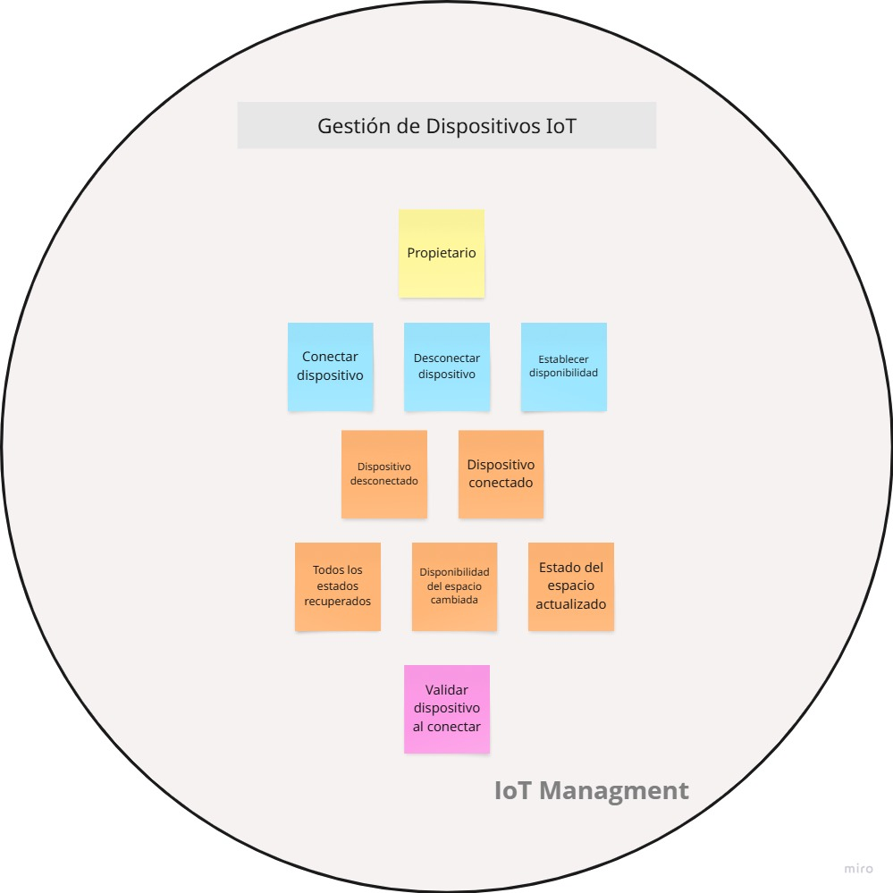
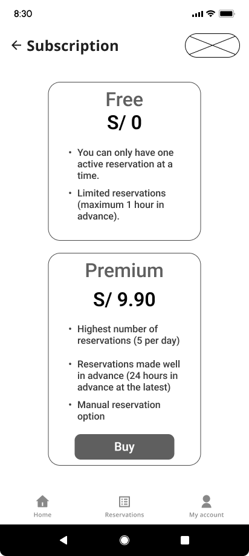
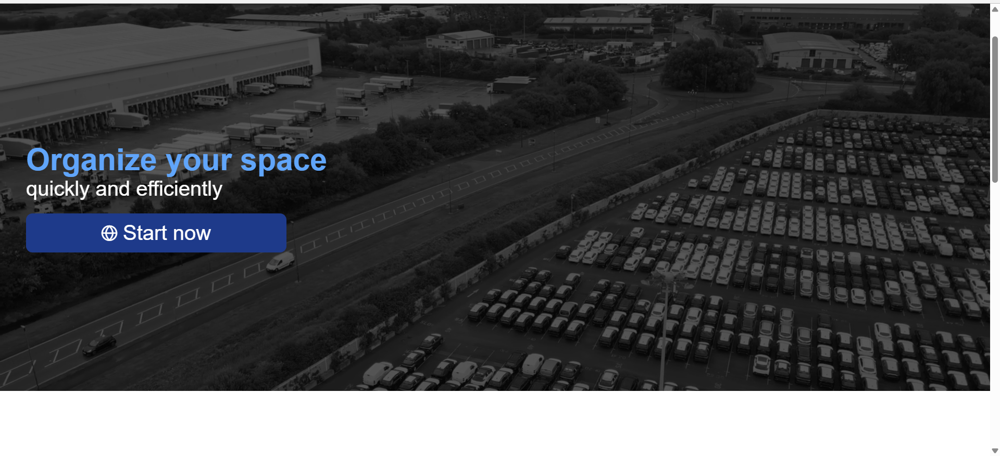
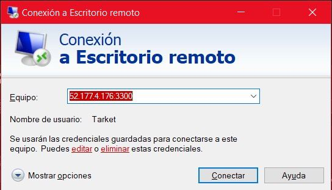
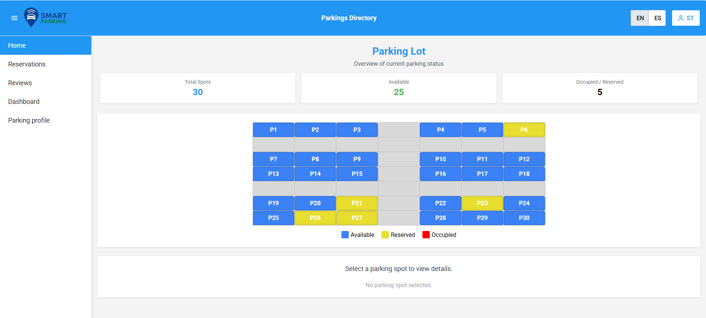

  <strong>Universidad Peruana de Ciencias Aplicadas</strong>  
    
  <strong>Ingeniería de Software - 202510</strong> 
  <strong>Ciclo: 07</strong>  
  <strong>1ASI0572 - Desarrollo de Soluciones IOT - 2971</strong>  
  <strong>Profesor: Velasquez Nuñez, Angel Augusto</strong>  
  <strong>INFORME DE TRABAJO FINAL - TF1</strong>  
  <strong>Startup: IoT Innovators</strong> 
  <strong>Producto: SmartParking</strong>  

  <strong>Relación de integrantes</strong>  

  <table border="1" cellpadding="8" cellspacing="0" style="margin:auto">
    <thead>
      <tr>
        <th>Apellidos y Nombres</th>
        <th>Código</th>
      </tr>
    </thead>
    <tbody>
      <tr><td>Arroyo Ormeño, André Alonso</td><td>u202114714</td></tr>
      <tr><td>Castilla Pachas, César Antonio</td><td>u202218735</td></tr>
      <tr><td>Cortés Casas, Joaquín Marcelo</td><td>u202114545</td></tr>
      <tr><td>Diaz Silva, Fernando Josué</td><td>u202112722</td></tr>
      <tr><td>Godoy, Johan Príncipe</td><td>u202014511</td></tr>
      <tr><td>Tafur Gonzales, Josty Gerardo</td><td>u20201c069</td></tr>
      <tr><td>Zarate Caceres, Victor Ernesto</td><td>u202112907</td></tr>
    </tbody>
  </table>

  <strong>Junio, 2025</strong>

---

# Registro de Versiones del Informe

En la siguiente tabla se presenta el registro de versiones del informe con el propósito de tener una lista cronológicamente de cada entrega del documento, indicando la versión, fecha, autor y resumen del cambio realizado. 

<table border="1" cellpadding="6" cellspacing="0" style="margin: auto;">
  <thead>
    <tr>
      <th><strong>Versión</strong></th>
      <th><strong>Fecha</strong></th>
      <th><strong>Autor</strong></th>
      <th><strong>Descripción de Modificación</strong></th>
    </tr>
  </thead>
  <tbody>
    <tr><td>1.0.0</td><td>31/03/2025</td><td>Cortés Casas, Joaquín Marcelo</td><td>Creación del informe, incluyendo la adición de una carátula, una tabla de contenidos y todas las secciones correspondientes al primer entregable.</td></tr>
    <tr><td>1.1.0</td><td>01/04/2025</td><td>Zarate Cáceres, Victor Ernesto</td><td>Adición del Startup</td></tr>
    <tr><td>1.2.0</td><td>02/04/2025</td><td>Zarate Cáceres, Victor Ernesto</td><td>Adición del Solution Profile y Competidores.</td></tr>
    <tr><td>1.3.0</td><td>04/04/2025</td><td>Arroyo Ormeño, André Alonso</td><td>Adición del Solution Profile, User Personas, Empathy Mappings, User Task Matrix, User Journey Mapping y As-Is Scenario Mapping.</td></tr>
    <tr><td>1.4.0</td><td>05/04/2025</td><td>Arroyo Ormeño, André Alonso</td><td>Adición del To-Be Scenario Mapping.</td></tr>
    <tr><td>1.5.0</td><td>08/04/2025</td><td>Zarate Cáceres, Victor Ernesto</td><td>Adición de User Stories.</td></tr>
    <tr><td>1.6.0</td><td>14/04/2025</td><td>Castilla Pachas, César Antonio</td><td>Adición de registro de versiones del informe, student outcome, project report collaboration insights, Product Backlog y Event Storming.</td></tr>
    <tr><td>1.7.0</td><td>16/04/2025</td><td>Zarate Cáceres, Victor Ernesto</td><td>Adición del segmento objetivo.</td></tr>
    <tr><td>1.8.0</td><td>20/04/2025</td><td>Castilla Pachas, César Antonio</td><td>Adición de diagramas de Software Architecture.</td></tr>
    <tr><td>1.9.0</td><td>22/04/2025</td><td>Godoy, Johan Príncipe</td><td>Adición del Tactical-Level Domain-Driven Design para todos los bounded contexts.</td></tr>
    <tr><td>1.10.0</td><td>23/04/2025</td><td>Cortés Casas, Joaquín Marcelo</td><td>Adición de Bounded Context Canvases para todos los bounded contexts.</td></tr>
    <tr><td>1.10.1</td><td>23/04/2025</td><td>Zarate Cáceres, Victor Ernesto</td><td>Corrección del menú y puntos faltantes en el documento.</td></tr>
    <tr><td>1.10.2</td><td>28/04/2025</td><td>Zarate Cáceres, Victor Ernesto</td><td>Correcciones de enlaces y Student Outcome.</td></tr>
    <tr><td>2.0.0</td><td>28/04/2025</td><td>Zarate Cáceres, Victor Ernesto</td><td>Añadir títulos para la entrega parcial (TP).</td></tr>
    <tr><td>2.1.0</td><td>30/04/2025</td><td>Principe Godoy, Johan</td><td>Añadir style guidelines for app web, mobile and IoT.</td></tr>
    <tr><td>2.2.0</td><td>30/04/2025</td><td>Principe Godoy, Johan</td><td>Añadir Information Architecture including Organization Systems, Labeling Systems, SEO Tags and Meta Tags, Searching Systems and Navigation Systems.</td></tr>
    <tr><td>2.2.1</td><td>30/04/2025</td><td>Principe Godoy, Johan</td><td>Corrección de formato de tablas y Lean UX Problem Statements, Assumptions y Hypothesis Statements.</td></tr>
    <tr><td>2.2.2</td><td>30/04/2025</td><td>Principe Godoy, Johan</td><td>Corrección de los segmentos objetivos para que estén alineados con el Project Statement.</td></tr>
    <tr><td>2.2.3</td><td>07/05/2025</td><td>Zarate Cáceres, Victor Ernesto</td><td>Corrección de User Stories and Product Backlog.</td></tr>
    <tr><td>2.2.4</td><td>10/05/2025</td><td>Zarate Cáceres, Victor Ernesto</td><td>Corrección de Technical Stories and Product Backlog.</td></tr>
    <tr><td>2.3.0</td><td>10/05/2025</td><td>Tafur Gonzales, Josty Gerardo</td><td>Añadir Entrevista de Segmento Propietarios.</td></tr>
    <tr><td>2.3.1</td><td>11/05/2025</td><td>Zarate Cáceres, Victor Ernesto</td><td>Corrección de User Stories and Product Backlog.</td></tr>
    <tr><td>2.3.2</td><td>12/05/2025</td><td>Castilla Pachas, César Antonio</td><td>Añadir Applications Wireframes.</td></tr>
    <tr><td>2.4.0</td><td>12/05/2025</td><td>Tafur Gonzales, Josty Gerardo</td><td>Añadir Applications User Flow Diagrams.</td></tr>
    <tr><td>2.5.0</td><td>12/05/2025</td><td>Cortés Casas, Joaquín Marcelo</td><td>Añadir Entrevistas faltantes.</td></tr>
    <tr><td>2.6.0</td><td>12/05/2025</td><td>Zarate Cáceres, Victor Ernesto</td><td>Sprint Backlog 1.</td></tr>
    <tr><td>2.6.1</td><td>12/05/2025</td><td>Cortés Casas, Joaquín Marcelo</td><td>Corrección de Style Guidelines Section.</td></tr>
    <tr><td>2.7.0</td><td>12/05/2025</td><td>Zarate Cáceres, Victor Ernesto</td><td>Añadir Evidencia de Ejecución de Landing Page.</td></tr>
    <tr><td>2.8.0</td><td>12/05/2025</td><td>Zarate Cáceres, Victor Ernesto</td><td>Añadir Collaboration Insights.</td></tr>
    <tr><td>2.9.0</td><td>12/05/2025</td><td>Castilla Pachas, César Antonio</td><td>Añadir Applications Wireflow Diagrams App Mobile y Application Wireflows Diagrams App.</td></tr>
    <tr><td>2.9.1</td><td>12/05/2025</td><td>Cortés Casas, Joaquín Marcelo</td><td>Corrección de Ubiquitous Language.</td></tr>
    <tr><td>2.9.2</td><td>12/05/2025</td><td>Zarate Cáceres, Victor Ernesto</td><td>Corrección de Sprint 1.</td></tr>
    <tr><td>2.9.3</td><td>13/05/2025</td><td>Zarate Cáceres, Victor Ernesto</td><td>Landing Page Deployment Configuration and Evidence.</td></tr>
    <tr><td>2.9.4</td><td>13/05/2025</td><td>Zarate Cáceres, Victor Ernesto</td><td>Añadir Execution Evidence of Web Application and update Development Evidence for Sprint Review.</td></tr>
    <tr><td>2.10.0</td><td>13/05/2025</td><td>Castilla Pachas, César Antonio</td><td>Añadir Applications Mock-ups App Mobile.</td></tr>
    <tr><td>2.11.0</td><td>13/05/2025</td><td>Castilla Pachas, César Antonio</td><td>Añadir Applications Wireframes and Mock-ups Web App.</td></tr>
    <tr><td>2.12.0</td><td>13/05/2025</td><td>Castilla Pachas, César Antonio</td><td>Añadir Application wireframes and mock-ups.</td></tr>
    <tr><td>3.0.0</td><td>02/06/2025</td><td>Cortés Casas, Joaquín Marcelo</td><td>Corrección de estructura de texto para conversión a PDF.</td></tr>
    <tr><td>3.0.1</td><td>07/06/2025</td><td>Arroyo Ormeño, André Alonso</td><td>Actualizar diagramas de componentes de cada Bounded Context.</td></tr>
    <tr><td>3.1.0</td><td>15/06/2025</td><td>Zarate Cáceres, Victor Ernesto</td><td>Añadir Development Evidence for Sprint Review.</td></tr>
    <tr><td>3.1.1</td><td>18/06/2025</td><td>Cortés Casas, Joaquín Marcelo</td><td>Agregar evaluaciones según heurísticas de las entrevistas de validación.</td></tr>
    <tr><td>3.1.2</td><td>19/06/2025</td><td>Cortés Casas, Joaquín Marcelo</td><td>Agregar video about the video.</td></tr>
    <tr><td>4.0.0</td><td>25/06/2025</td><td>Zarate Cáceres, Victor Ernesto</td><td>Preparación de documento para Final Sprint.</td></tr>
    <tr><td>4.1.0</td><td>30/06/2025</td><td>Zarate Cáceres, Victor Ernesto</td><td>Añadir Development Evidence for Final Sprint.</td></tr>
    <tr><td>4.2.0</td><td>02/07/2025</td><td>Zarate Cáceres, Victor Ernesto</td><td>Añadir Services Documentation for Final Sprint.</td></tr>
    <tr><td>4.3.0</td><td>04/07/2025</td><td>Arroyo Ormeño, André Alonso</td><td>Actualización de user stories y product backlog.</td></tr>
    <tr><td>4.3.1</td><td>04/07/2025</td><td>Zarate Cáceres, Victor Ernesto</td><td>Actualizar Sprint 3 y añadir Student Outcome.</td></tr>
    <tr><td>4.3.2</td><td>05/07/2025</td><td>Zarate Cáceres, Victor Ernesto</td><td>Añadir capturas para Execution Evidence y Team Collaboration Insights for Web Services.</td></tr>
  </tbody>
</table>

---

# Project Report Collaboration Insights

**Enlace al repositorio del informe en GitHub:**  
[https://github.com/SolucionesIoT-Grupo-IoTInnovators/report/blob/main/README.md](https://github.com/SolucionesIoT-Grupo-IoTInnovators/report/blob/main/README.md)

---

## TB1

### Descripción de las actividades realizadas

- **Arroyo Ormeño, André Alonso:** Participé en la elaboración de los user personas, empathy map, escenarios actuales (As-Is) y propuestos (To-Be), así como en la documentación técnica de las capas domain, interface, application e infrastructure de los bounded contexts.
- **Castilla Pachas, César Antonio:** Contribuí en el análisis de competidores, la creación del product backlog, el modelado de los bounded contexts *Profile* y *Reservations*, y en el desarrollo del candidate context discovery.
- **Cortés Casas, Joaquín Marcelo:** Me encargué de estructurar el informe y redactar los capítulos correspondientes a entrevistas, diagramas de arquitectura de software y documentación de bounded contexts.
- **Díaz Silva, Fernando Josué:** Desarrollé el Event Storming en Miro y su posterior documentación en el informe, además de colaborar en la construcción del Context Mapping.
- **Godoy, Johan Príncipe:** Elaboré los diagramas de clase, de base de datos y de arquitectura de software para los bounded contexts definidos.
- **Tafur Gonzales, Josty Gerardo:** Aporté en el desarrollo del proceso Lean UX, la identificación del lenguaje ubicuo, y la elaboración de mapas To-Be y de impacto.
- **Zárate Cáceres, Víctor Ernesto:** Realicé la investigación de antecedentes del problema y diseñé las User Stories iniciales del proyecto.

### Evidencia de colaboración

  

## TP1

### Descripción de las actividades realizadas

- **Arroyo Ormeño, André Alonso:** Contribuí en el diseño de los wireframes y mockups de la aplicación web, y elaboré las technical stories del backend.
- **Castilla Pachas, César Antonio:** Participé en la construcción de wireframes y mockups para la aplicación web, cuidando la coherencia visual y funcional.
- **Cortés Casas, Joaquín Marcelo:** Diseñé los wireframes y mockups del landing page, elaboré el prototipo funcional, y definí el Sprint Planning 1 y el Sprint Backlog correspondiente.
- **Díaz Silva, Fernando Josué:** Colaboré en el diseño, desarrollo e implementación de la Landing Page, incluyendo su despliegue funcional.
- **Godoy, Johan Príncipe:** Diseñé la interfaz gráfica para el registro de estacionamientos, integrándola al flujo general de la aplicación web.
- **Tafur Gonzales, Josty Gerardo:** Trabajé en el diseño en Figma de la app móvil, su prototipado interactivo, y realicé entrevistas con usuarios para recolección de requisitos.
- **Zárate Cáceres, Víctor Ernesto:** Reestructuré las User Stories para alinearlas con el curso, definí el Software Configuration Management (SCM) e inicié la validación funcional del producto.

### Evidencia de colaboración

  

## TB2

### Descripción de las actividades realizadas

- **Arroyo Ormeño, André Alonso:** Corregí diagramas de componentes del backend y añadí los correspondientes para las aplicaciones web y móvil.
- **Castilla Pachas, César Antonio:** Realicé ajustes en textos e imágenes de entregables anteriores e implementé el sistema de notificaciones Firebase para ambas aplicaciones.
- **Cortés Casas, Joaquín Marcelo:** Grabé y edité los videos de entrevistas de validación de usuarios, y definí el Sprint Backlog de la entrega.
- **Díaz Silva, Fernando Josué:** Desarrollé funcionalidades del producto durante el Sprint, asegurando avances constantes.
- **Godoy, Johan Príncipe:** Mejoré componentes en todas las aplicaciones, alineándolos con los objetivos definidos en el Sprint Backlog.
- **Tafur Gonzales, Josty Gerardo:** Identifiqué los puntos clave del Sprint para asegurar la funcionalidad de la aplicación embebida y del Edge Server.
- **Zárate Cáceres, Víctor Ernesto:** Corregí elementos clave en la aplicación web y elaboré preguntas orientadoras para la validación del producto con usuarios.

### Evidencia de colaboración

  

## TF1

### Descripción de las actividades realizadas

- **Arroyo Ormeño, André Alonso:** Realicé  la corrección, redistribución y creación de nuevas user stories, ademas de actualizar el product backlog.
- **Castilla Pachas, César Antonio:** (completar)
- **Cortés Casas, Joaquín Marcelo:** He mejorado el formato del reporte para la entrega final. Tambien (completar)
- **Díaz Silva, Fernando Josué:** (completar)
- **Godoy, Johan Príncipe:** (completar)
- **Tafur Gonzales, Josty Gerardo:** (completar)
- **Zárate Cáceres, Víctor Ernesto:** (completar)

### Evidencia de colaboración

  

# Contenido
**Tabla de contenidos**

- [Student Outcome](#student-outcome)

- [Capítulo I: Introducción](#capítulo-i-introducción)
  - [1.1. Startup Profile](#11-startup-profile)
    - [1.1.1. Descripción de la Startup](#111-descripción-de-la-startup)
    - [1.1.2. Perfiles de integrantes del equipo](#112-perfiles-de-integrantes-del-equipo)
  - [1.2. Solution Profile](#12-solution-profile)
    - [1.2.1. Antecedentes y problemática](#121-antecedentes-y-problemática)
    - [1.2.2. Lean UX Process](#122-lean-ux-process)
      - [1.2.2.1. Lean UX Problem Statements](#1221-lean-ux-problem-statements)
      - [1.2.2.2. Lean UX Assumptions](#1222-lean-ux-assumptions)
      - [1.2.2.3. Lean UX Hypothesis Statements](#1223-lean-ux-hypothesis-statements)
      - [1.2.2.4. Lean UX Canvas](#1224-lean-ux-canvas)
  - [1.3. Segmentos objetivo](#13-segmentos-objetivo)
- [Capítulo II: Requirements Elicitation & Analysis](#capítulo-ii-requirements-elicitation--analysis)
  - [2.1. Competidores](#21-competidores)
    - [2.1.1. Análisis competitivo](#211-análisis-competitivo)
    - [2.1.2. Estrategias y tácticas frente a competidores](#212-estrategias-y-tácticas-frente-a-competidores)
  - [2.2. Entrevistas](#22-entrevistas)
    - [2.2.1. Diseño de entrevistas](#221-diseño-de-entrevistas)
    - [2.2.2. Registro de entrevistas](#222-registro-de-entrevistas)
    - [2.2.3. Análisis de entrevistas](#223-análisis-de-entrevistas)
  - [2.3. Needfinding](#23-needfinding)
    - [2.3.1. User Personas](#231-user-personas)
    - [2.3.2. User Task Matrix](#232-user-task-matrix)
    - [2.3.3. User Journey Mapping](#233-user-journey-mapping)
    - [2.3.4. Empathy Mapping](#234-empathy-mapping)
    - [2.3.5. As-is Scenario Mapping](#235-as-is-scenario-mapping)
  - [2.4. Ubiquitous Language](#24-ubiquitous-language)
- [Capítulo III: Requirements Specification](#capítulo-iii-requirements-specification)
  - [3.1. To-Be Scenario Mapping](#31-to-be-scenario-mapping)
  - [3.2. User Stories](#32-user-stories)
  - [3.3. Impact Mapping](#33-impact-mapping)
  - [3.4. Product Backlog](#34-product-backlog)
- [Capítulo IV: Solution Software Design](#capítulo-iv-solution-software-design)
  - [4.1. Strategic-Level Domain-Driven Design](#41-strategic-level-domain-driven-design)
    - [4.1.1. EventStorming](#411-eventstorming)
      - [4.1.1.1. Candidate Context Discovery](#4111-candidate-context-discovery)
      - [4.1.1.2. Domain Message Flows Modeling](#4112-domain-message-flows-modeling)
      - [4.1.1.3. Bounded Context Canvases](#4113-bounded-context-canvases)
    - [4.1.2. Context Mapping](#412-context-mapping)
    - [4.1.3. Software Architecture](#413-software-architecture)
      - [4.1.3.1. Software Architecture System Landscape Diagram](#4131-software-architecture-system-landscape-diagram)
      - [4.1.3.2. Software Architecture Context Level Diagrams](#4132-software-architecture-context-level-diagrams)
      - [4.1.3.3. Software Architecture Container Level Diagrams](#4133-software-architecture-container-level-diagrams)
      - [4.1.3.4. Software Architecture Deployment Diagrams](#4134-software-architecture-deployment-diagrams)
  - [4.2. Tactical-Level Domain-Driven Design](#42-tactical-level-domain-driven-design)
    - [4.2.1. Bounded Context: Identity and Access Management](#421-bounded-context-identity-and-access-management)
      - [4.2.1.1. Domain Layer](#4211-domain-layer)
      - [4.2.1.2. Interface Layer](#4212-interface-layer)
      - [4.2.1.3. Application Layer](#4213-application-layer)
      - [4.2.1.4. Infrastructure Layer](#4214-infrastructure-layer)
      - [4.2.1.5. Bounded Context Software Architecture Component Level Diagrams](#4215-bounded-context-software-architecture-component-level-diagrams)
      - [4.2.1.6. Bounded Context Software Architecture Code Level Diagrams](#4216-bounded-context-software-architecture-code-level-diagrams)
        - [4.2.1.6.1. Bounded Context Domain Layer Class Diagrams](#42161-bounded-context-domain-layer-class-diagrams)
        - [4.2.1.6.2. Bounded Context Database Design Diagram](#42162-bounded-context-database-design-diagram)
    - [4.2.2. Bounded Context: Profile Management](#422-bounded-context-profile-management)
      - [4.2.2.1. Domain Layer](#4221-domain-layer)
      - [4.2.2.2. Interface Layer](#4222-interface-layer)
      - [4.2.2.3. Application Layer](#4223-application-layer)
      - [4.2.2.4. Infrastructure Layer](#4224-infrastructure-layer)
      - [4.2.2.5. Bounded Context Software Architecture Component Level Diagrams](#4225-bounded-context-software-architecture-component-level-diagrams)
      - [4.2.2.6. Bounded Context Software Architecture Code Level Diagrams](#4226-bounded-context-software-architecture-code-level-diagrams)
        - [4.2.2.6.1. Bounded Context Domain Layer Class Diagrams](#42261-bounded-context-domain-layer-class-diagrams)
        - [4.2.2.6.2. Bounded Context Database Design Diagram](#42262-bounded-context-database-design-diagram)
    - [4.2.3. Bounded Context: Parking Management](#423-bounded-context-parking-management)
      - [4.2.3.1. Domain Layer](#4231-domain-layer)
      - [4.2.3.2. Interface Layer](#4232-interface-layer)
      - [4.2.3.3. Application Layer](#4233-application-layer)
      - [4.2.3.4. Infrastructure Layer](#4234-infrastructure-layer)
      - [4.2.3.5. Bounded Context Software Architecture Component Level Diagrams](#4235-bounded-context-software-architecture-component-level-diagrams)
      - [4.2.3.6. Bounded Context Software Architecture Code Level Diagrams](#4236-bounded-context-software-architecture-code-level-diagrams)
        - [4.2.3.6.1. Bounded Context Domain Layer Class Diagrams](#42361-bounded-context-domain-layer-class-diagrams)
        - [4.2.3.6.2. Bounded Context Database Design Diagram](#42362-bounded-context-database-design-diagram)
    - [4.2.4. Bounded Context: Reservation](#424-bounded-context-reservation)
      - [4.2.4.1. Domain Layer](#4241-domain-layer)
      - [4.2.4.2. Interface Layer](#4242-interface-layer)
      - [4.2.4.3. Application Layer](#4243-application-layer)
      - [4.2.4.4. Infrastructure Layer](#4244-infrastructure-layer)
      - [4.2.4.5. Bounded Context Software Architecture Component Level Diagrams](#4245-bounded-context-software-architecture-component-level-diagrams)
      - [4.2.4.6. Bounded Context Software Architecture Code Level Diagrams](#4246-bounded-context-software-architecture-code-level-diagrams)
        - [4.2.4.6.1. Bounded Context Domain Layer Class Diagrams](#42461-bounded-context-domain-layer-class-diagrams)
        - [4.2.4.6.2. Bounded Context Database Design Diagram](#42462-bounded-context-database-design-diagram)
    - [4.2.5. Bounded Context: Subscription](#425-bounded-context-subscription)
      - [4.2.5.1. Domain Layer](#4251-domain-layer)
      - [4.2.5.2. Interface Layer](#4252-interface-layer)
      - [4.2.5.3. Application Layer](#4253-application-layer)
      - [4.2.5.4. Infrastructure Layer](#4254-infrastructure-layer)
      - [4.2.5.5. Bounded Context Software Architecture Component Level Diagrams](#4255-bounded-context-software-architecture-component-level-diagrams)
      - [4.2.5.6. Bounded Context Software Architecture Code Level Diagrams](#4256-bounded-context-software-architecture-code-level-diagrams)
        - [4.2.5.6.1. Bounded Context Domain Layer Class Diagrams](#42561-bounded-context-domain-layer-class-diagrams)
        - [4.2.5.6.2. Bounded Context Database Design Diagram](#42562-bounded-context-database-design-diagram)
    - [4.2.6. Bounded Context: Review](#426-bounded-context-review)
      - [4.2.6.1. Domain Layer](#4261-domain-layer)
      - [4.2.6.2. Interface Layer](#4262-interface-layer)
      - [4.2.6.3. Application Layer](#4263-application-layer)
      - [4.2.6.4. Infrastructure Layer](#4264-infrastructure-layer)
      - [4.2.6.5. Component Level Diagram (estructura)](#4265-component-level-diagram-estructura)
      - [4.2.6.6. Bounded Context Software Architecture Code Level Diagrams](#4266-bounded-context-software-architecture-code-level-diagrams)
        - [4.2.6.6.1. Bounded Context Domain Layer Class Diagrams](#42661-bounded-context-domain-layer-class-diagrams)
        - [4.2.6.6.2. Bounded Context Database Design Diagram](#42662-bounded-context-database-design-diagram)
    - [4.2.7. Bounded Context: Notification](#427-bounded-context-notification)
      - [4.2.7.1. Domain Layer](#4271-domain-layer)
      - [4.2.7.2. Interface Layer](#4272-interface-layer)
      - [4.2.7.3. Application Layer](#4273-application-layer)
      - [4.2.7.4. Infrastructure Layer](#4274-infrastructure-layer)
      - [4.2.7.5. Bounded Context Software Architecture Component Level Diagrams](#4275-bounded-context-software-architecture-component-level-diagrams)
      - [4.2.7.6. Bounded Context Software Architecture Code Level Diagrams](#4276-bounded-context-software-architecture-code-level-diagrams)
        - [4.2.7.6.1. Bounded Context Domain Layer Class Diagrams](#42761-bounded-context-domain-layer-class-diagrams)
        - [4.2.7.6.2. Bounded Context Database Design Diagram](#42762-bounded-context-database-design-diagram)
    - [4.2.8. Bounded Context: IoT Management](#428-bounded-context-iot-management)
      - [4.2.8.1. Domain Layer](#4281-domain-layer)
      - [4.2.8.2. Interface Layer](#4282-interface-layer)
      - [4.2.8.3. Application Layer](#4283-application-layer)
      - [4.2.8.4. Infrastructure Layer](#4284-infrastructure-layer)
      - [4.2.8.5. Bounded Context Software Architecture Component Level Diagrams](#4285-bounded-context-software-architecture-component-level-diagrams)
      - [4.2.8.6. Bounded Context Software Architecture Code Level Diagrams](#4286-bounded-context-software-architecture-code-level-diagrams)
        - [4.2.8.6.1. Bounded Context Domain Layer Class Diagrams](#42861-bounded-context-domain-layer-class-diagrams)
        - [4.2.8.6.2. Bounded Context Database Design Diagram](#42862-bounded-context-database-design-diagram)
    - [4.2.9. Bounded Context: Payment](#429-bounded-context-payment)
      - [4.2.9.1. Domain Layer](#4291-domain-layer)
      - [4.2.9.2. Interface Layer](#4292-interface-layer)
      - [4.2.9.3. Application Layer](#4293-application-layer)
      - [4.2.9.4. Infrastructure Layer](#4294-infrastructure-layer)
      - [4.2.9.5. Bounded Context Software Architecture Component Level Diagrams](#4295-bounded-context-software-architecture-component-level-diagrams)
      - [4.2.9.6. Bounded Context Software Architecture Code Level Diagrams](#4296-bounded-context-software-architecture-code-level-diagrams)
        - [4.2.9.6.1. Bounded Context Domain Layer Class Diagrams](#42961-bounded-context-domain-layer-class-diagrams)
        - [4.2.9.6.2. Bounded Context Database Design Diagram](#42962-bounded-context-database-design-diagram)
- [Capítulo V: Solution UI/UX Design](#capítulo-v-solution-uiux-design)
  - [5.1. Style Guidelines](#51-style-guidelines)
    - [5.1.1. General Style Guidelines](#511-general-style-guidelines)
    - [5.1.2. Web, Mobile and IoT Style Guidelines](#512-web-mobile-and-iot-style-guidelines)
  - [5.2. Information Architecture](#52-information-architecture)
    - [5.2.1. Organization Systems](#521-organization-systems)
    - [5.2.2. Labeling Systems](#522-labeling-systems)
    - [5.2.3. SEO Tags and Meta Tags](#523-seo-tags-and-meta-tags)
    - [5.2.4. Searching Systems](#524-searching-systems)
    - [5.2.5. Navigation Systems](#525-navigation-systems)
  - [5.3. Landing Page UI Design](#53-landing-page-ui-design)
    - [5.3.1. Landing Page Wireframe](#531-landing-page-wireframe)
    - [5.3.2. Landing Page Mock-up](#532-landing-page-mock-up)
  - [5.4. Applications UX/UI Design](#54-applications-uxui-design)
    - [5.4.1. Applications Wireframes](#541-applications-wireframes)
    - [5.4.2. Applications Wireflow Diagrams](#542-applications-wireflow-diagrams)
    - [5.4.3. Applications Mock-ups](#543-applications-mock-ups)
    - [5.4.4. Applications User Flow Diagrams](#544-applications-user-flow-diagrams)
  - [5.5. Applications Prototyping](#55-applications-prototyping)
- [Capítulo VI: Product Implementation, Validation & Deployment](#capítulo-vi-product-implementation-validation-&-deployment)
  - [6.1. Software Configuration Management](#61-software-configuration-management)
    - [6.1.1. Software Development Environment Configuration](#611-software-development-environment-configuration)
    - [6.1.2. Source Code Management](#612-source-code-management)
    - [6.1.3. Source Code Style Guide & Conventions](#613-source-code-style-guide--conventions)
    - [6.1.4. Software Deployment Configuration](#614-software-deployment-configuration)
  - [6.2. Landing Page, Services & Applications Implementation](#62-landing-page-services--applications-implementation)
    - [6.2.1. Sprint 1](#621-sprint-1)
      - [6.2.1.1. Sprint Planning 1](#6211-sprint-planning-1)
      - [6.2.1.2. Aspect Leaders and Collaborators](#6212-aspect-leaders-and-collaborators)
      - [6.2.1.3. Sprint Backlog 1](#6213-sprint-backlog-1)
      - [6.2.1.4. Development Evidence for Sprint Review](#6214-development-evidence-for-sprint-review)
      - [6.2.1.5. Testing Suite Evidence for Sprint Review](#6215-testing-suite-evidence-for-sprint-review)
      - [6.2.1.6. Execution Evidence for Sprint Review](#6216-execution-evidence-for-sprint-review)
      - [6.2.1.7. Services Documentation Evidence for Sprint Review](#6217-services-documentation-evidence-for-sprint-review)
      - [6.2.1.8. Software Deployment Evidence for Sprint Review](#6218-software-deployment-evidence-for-sprint-review)
      - [6.2.1.9. Team Collaboration Insights during Sprint](#6219-team-collaboration-insights-during-sprint)
    - [6.2.2. Sprint 2](#622-sprint-2)
      - [6.2.2.1. Sprint Planning 2](#6221-sprint-planning-2)
      - [6.2.2.2. Aspect Leaders and Collaborators](#6222-aspect-leaders-and-collaborators)
      - [6.2.2.3. Sprint Backlog 2](#6223-sprint-backlog-2)
      - [6.2.2.4. Development Evidence for Sprint Review](#6224-development-evidence-for-sprint-review)
      - [6.2.2.5. Testing Suite Evidence for Sprint Review](#6225-testing-suite-evidence-for-sprint-review)
      - [6.2.2.6. Execution Evidence for Sprint Review](#6226-execution-evidence-for-sprint-review)
      - [6.2.2.7. Services Documentation Evidence for Sprint Review](#6227-services-documentation-evidence-for-sprint-review)
      - [6.2.2.8. Software Deployment Evidence for Sprint Review](#6228-software-deployment-evidence-for-sprint-review)
      - [6.2.2.9. Team Collaboration Insights during Sprint](#6229-team-collaboration-insights-during-sprint)
    - [6.2.3. Sprint 3](#623-sprint-3)
      - [6.2.3.1. Sprint Planning 3](#6231-sprint-planning-3)
      - [6.2.3.2. Aspect Leaders and Collaborators](#6232-aspect-leaders-and-collaborators)
      - [6.2.3.3. Sprint Backlog 3](#6233-sprint-backlog-3)
      - [6.2.3.4. Development Evidence for Sprint Review](#6234-development-evidence-for-sprint-review)
      - [6.2.3.5. Testing Suite Evidence for Sprint Review](#6235-testing-suite-evidence-for-sprint-review)
      - [6.2.3.6. Execution Evidence for Sprint Review](#6236-execution-evidence-for-sprint-review)
      - [6.2.3.7. Services Documentation Evidence for Sprint Review](#6237-services-documentation-evidence-for-sprint-review)
      - [6.2.3.8. Software Deployment Evidence for Sprint Review](#6238-software-deployment-evidence-for-sprint-review)
      - [6.2.3.9. Team Collaboration Insights during Sprint](#6239-team-collaboration-insights-during-sprint)
  - [6.3. Validation Interviews](#63-validation-interviews)
    - [6.3.1. Diseño de Entrevistas](#631-diseño-de-entrevistas)
    - [6.3.2. Registro de Entrevistas](#632-registro-de-entrevistas)
    - [6.3.3. Evaluaciones según heurísticas](#633-evaluaciones-según-heurísticas)
  - [6.4. Video About-the-Product](#64-video-about-the-product)
  - [6.5. Video About-the-Team](#65-video-about-the-team)

- [Conclusiones y recomendaciones](#conclusiones-y-recomendaciones)
- [Bibliografia](#bibliografia)
- [Anexos](#anexos)

---

# Student Outcome
El curso contribuye al cumplimiento del Student Outcome ABET:

**ABET – EAC - Student Outcome 5**
Criterio: La capacidad de funcionar efectivamente en un equipo cuyos miembros juntos proporcionan liderazgo, crean un entorno de colaboración e inclusivo, establecen objetivos, planifican tareas y cumplen objetivos.
En el siguiente cuadro se describe las acciones realizadas y enunciados de conclusiones por parte del grupo, que permiten sustentar el haber alcanzado el logro del ABET – EAC - Student Outcome 5.

  <table align="justify">
    <tr>
      <td width="25%">
        Criterio específico
      </td>
      <td>
        Acciones realizadas
      </td>
      <td>
        Conclusiones
      </td>
    </tr>
    <!--Primer Criterio-->
    <tr>
      <td>
        Trabaja en equipo para proporcionar liderazgo en forma conjunta
      </td>
      <!--Ingresar Accion Realizada por Entregable-->
      <td>
        <!--Andre Alonso-->
        Arroyo Ormeño, André Alonso:  
        TB1: 
        En el grupo pude aportar formatos a seguir para completar ciertas secciones aliviando asi sus dudas. Asimismo participe activamente en las llamadas en las cuales nos reuniamos para organizar y avanzar el trabajo.
          
        TP1: 
        En el grupo contribuí activamente a la corrección de errores en la elaboración de los diagramas C4, colaborando además en la asignación de tareas para optimizar el avance del trabajo. Participé en la creación de los wireframes y mockups de la aplicación web, y en la validación de las technical stories para el backend, proponiendo ajustes y mejoras.
          
        TB2: 
        Me encargué de revisar y corregir los diagramas de componentes del backend, proponiendo mejoras para garantizar su coherencia y alineación con los requerimientos técnicos. Además, elaboré los diagramas de componentes para la aplicación web y móvil, validándolos en conjunto con el equipo. Promoví espacios de coordinación grupal para consensuar los cambios y asegurar la calidad final de los diagramas.
          
        TF1: 
        Durante esta entrega, participé activamente en la corrección, redistribución y creación de nuevas user stories, aportando ideas y sugerencias para mejorar su redacción y alinearlas con los objetivos del proyecto. Asimismo, lideré junto a mis compañeros la actualización del product backlog, asegurando que los cambios reflejaran adecuadamente las prioridades y necesidades del equipo. Promoví la toma de decisiones compartida, buscando siempre integrar las opiniones de todos para consolidar un trabajo ordenado y de calidad.
          
        <!--Cesar-->
        Castilla Pachas, César Antonio  
        TB1:  En grupo pudimos repartirnos correctamente las partes del trabajo, ademas de compartir nuestras ideas y apoyarnos en cada punto de esta entrega, donde pude mejorar mi trabajo en equipo para el desarrollo de este informe aportando ideass y sugerencias.  
        TP1: 
        En esta entrega me involucré en las coordinaciones grupales para asegurar el cumplimiento de los entregables. Participé activamente en la validación del diseño de los wireflows y propuse mejoras basadas en los user stories. También ayudé a consolidar los insumos desarrollados por el grupo para integrar el documento final, promoviendo el orden y la claridad del contenido.
          
        TB2: 
        En la planificación del despliegue, el equipo celebró sesiones para definir objetivos de lanzamiento. Cada integrante lideró una tarea, consolidando un liderazgo compartido en todas las áreas críticas.
          
        TF1: 
        En esta última fase del proyecto, se realizaron pruebas funcionales de las versiones finales y se ajustaron detalles antes del despliegue. El trabajo se organizó por tareas específicas, asegurando que todo esté listo para su presentación. Se colaboró activamente para revisar errores, validar el funcionamiento general y asegurar que la solución cumpla con lo propuesto desde el inicio.
          
        <!--Joaquin-->
        Cortés Casas, Joaquin Marcelo  
        TB1: 
        Asumi la responsabilidad de coordinar al equipo en la asignación de las primeras tareas y resolución de dudas. De esta manera, fomenté el liderazgo promoviendo la participación y aporte de todos los miembros del grupo.  
        TP1: 
        Impulsé el liderazgo colaborativo coordinando instancias de validación y asegurándome de que todas las voces fueran escuchadas. Mi enfoque estuvo centrado en fortalecer el trabajo colectivo y mantener la cohesión del grupo.
          
        TB2: 
        Se implementó un trabajo de guia conjunta sobre la incorporación y revisión de tareas. Esto promovió un liderazgo distribuido, aceleró la curva de aprendizaje y fortaleció el sentido de pertenencia.
          
        TF1: 
        Durante esta etapa final, se buscó mantener una coordinación clara en el equipo para asegurar que cada miembro cumpliera su rol. Se promovió un liderazgo compartido, donde todos participaron activamente en la toma de decisiones, aportando desde sus responsabilidades. Esto permitió mantener un ritmo constante de trabajo y resolver las tareas pendientes de forma organizada.
          
        <!--Fernando-->
        Diaz Silva, Fernando Josué  
        TB1: 
        Nuestro equipo logró ejercer un liderazgo compartido mediante la asignación equitativa de responsabilidades y la promoción activa del diálogo entre nosotros. Se evidenció una coordinación efectiva durante las reuniones, así como la iniciativa de varios integrantes para guiar y orientar al grupo, lo cual permitió un trabajo organizado, colaborativo y enfocado en resultados comunes.  
        TP1: 
        Mantuve una actitud proactiva en las coordinaciones grupales, promoviendo el diálogo y la toma de decisiones compartidas. Apoyé a mis compañeros cuando surgían dudas y propicié un ambiente donde todos pudieran aportar al desarrollo conjunto.
          
        TB2: 
        Para la elaboración de la landing page, el equipo tomo decisiones de manera conjunta. Cada propuesta de esquema UI fue votada y iterada, asegurando un producto final alineado con las necesidades de los usuarios.
          
        TF1: 
        Durante esta etapa, se evidenció un liderazgo compartido que permitió mantener la organización y el enfoque del equipo. Se promovió constantemente la participación activa de todos, especialmente en momentos clave como la elaboración de la landing page, donde cada decisión fue tomada de forma conjunta. Esta dinámica fortaleció la colaboración y aseguró que el resultado reflejara los aportes y expectativas del grupo.
          
        <!--Johan-->
        Godoy, Johan Príncipe  
        TB1: 
        En el grupo pude aportar formatos a seguir para completar ciertas secciones aliviando asi sus dudas. Asimismo participe activamente en las llamadas en las cuales nos reuniamos para organizar y avanzar el trabajo.  
        TP1: 
        Ayudé a mantener un liderazgo compartido a través del apoyo constante a mis compañeros y la disposición para colaborar. Estuve presente en las decisiones importantes y promoví el equilibrio en la carga de trabajo grupal.
          
        TB2: 
        Al diseñar la arquitectura de los servicios IoT y la integración con la app móvil, se organizaron proceso de revisión de código y buenas prácticas. Esto fomento la transferencia de conocimiento y fortaleció las habilidades de liderazgo de cada participante.
          
        TF1: 
        Durante esta etapa, se brindó apoyo al equipo mediante la propuesta de formatos que facilitaron el avance de distintas secciones del trabajo. Además, se participó activamente en las coordinaciones grupales, promoviendo la colaboración y un liderazgo compartido. La revisión conjunta del código y el diseño de la arquitectura también fortalecieron las habilidades técnicas y permitieron que todos aportaran al desarrollo del proyecto.
          
        <!--Josty-->
        Tafur Gonzales, Josty Gerardo  
        TB1: 
        De manera grupal, pudimos organizarnos correctamente para poder realizar el trabajo, asignando tareas a cada uno de los integrantes del grupo. Se realizaron reuniones para coordinar las tareas a realizar y se utilizó Github para poder ver el avance de cada uno de los integrantes.  
        TP1: 
        Aporté al liderazgo grupal incentivando la responsabilidad de cada miembro, facilitando la organización y promoviendo la coordinación entre nosotros. Siempre estuve dispuesto a escuchar y guiar en caso de dificultades.
          
        TB2: 
        El equipo estableció roles rotativos de liderazgo en las reuniones, permitiendo que cada integrante coordinara la planificación de sprints y facilitara la toma de decisiones colectivas. Esto reforzó la responsabilidad compartida y garantizó que las ideas de todos fueran valoradas.
          
        TF1: 
        A lo largo de esta fase, el grupo logró organizarse eficazmente mediante la asignación clara de tareas y el uso de herramientas como GitHub para monitorear avances. Se fomentó un liderazgo compartido con roles rotativos en las reuniones, lo que permitió una participación equitativa y decisiones consensuadas. También se promovió la responsabilidad individual y el apoyo mutuo, fortaleciendo así la cohesión y el compromiso del equipo.
          
        <!--Victor-->
        Zarate Caceres, Victor Ernesto   
        TB1: 
        Se organizaron reuniones para coordinar las tareas a realizar, buscando que estas sean divididas justamente. Además el uso de Github nos permite estar al tanto del avance conjunto, para asi estar al tanto de los avances que se hacen como grupo y poder tomas decisiones que sen transparentes con la integridad del equipo.  
        TP1: 
        Se realizo un trabajo conjunto para mantener un trabajo continuo y uniforme. El uso de Github nos permitio avanzar de forma conjunto y mantener nuestros avances al alcance de todo el grupo, permitiendo a todos aportar en todo momento.  
        TB2: 
        Se identificaron puntos importantes a ser mejorados en esta nueva entrega. Además, se organizo un trabajo de manera conjunta para ir evaluando las aplicaciones a medida que se iban desarrollando, para generar resultados sólidos y consistentes con nuestra propuesta inicial.
          
        TF1: 
        Se trabajo de forma grupal para identificar los puntos de mejora y trabajar sobre ellos. Además, se procuro poner a prueba cada producto desarrollado para verificar que funcionen correctamente e intercambienn la información necesaria.
      </td>
      <!--Ingresar Conclusion por Entregable-->
      <td>
        TB1: 
        Logramos una organización eficiente, distribuyendo tareas de manera equitativa y utilizando herramientas como GitHub para mantener un seguimiento transparente del avance. Aportamos ideas, resolvimos dudas en conjunto y mantuvimos una comunicación constante mediante reuniones de coordinación. Asumimos un liderazgo compartido, donde cada miembro contribuyó activamente. Esta experiencia reforzó nuestras habilidades colaborativas y demostró la importancia de la planificación y el trabajo en equipo para alcanzar objetivos comunes.  
        TP1: 
        Logramos mantener un liderazgo compartido en el grupo, en el que todos los integrantes participaron activamente en la toma de decisiones, la organización de actividades y el apoyo entre pares. Esta dinámica fortaleció nuestras capacidades para liderar en conjunto y nos permitió avanzar de forma cohesionada hacia los objetivos del entregable.
          
        TB2: 
        Se trabajó de forma conjunta con la revisión y mejora de los diagramas, coordinando sesiones grupales para consensuar cambios y garantizar su coherencia con los requerimientos técnicos. Asimismo, se organizaron reuniones de revisión de código y votaciones colaborativas en el diseño de los productos, garantizando que cada propuesta respondiera a las necesidades de los usuarios. Finalmente, se planificaron los objetivos de lanzamiento y se evaluaron continuamente las aplicaciones en desarrollo, permitiendo la obtención de resultados sólidos y alineados con la visión inicial.
          
        TF1: 
        Durante esta etapa del proyecto, se consolidó un liderazgo compartido basado en la comunicación constante, la toma de decisiones conjunta y la distribución equitativa de tareas. Se trabajó activamente en la revisión técnica de diagramas y código, organizando espacios colaborativos para consensuar mejoras. La coordinación grupal fue clave para asegurar el cumplimiento de los objetivos del entregable, reforzando la cohesión del equipo y asegurando que el desarrollo se mantuviera alineado con la visión del producto y las necesidades de los usuarios.
      </td>
    </tr>
    <!--Segundo Criterio-->
    <tr>
      <td>
        Crea un entorno colaborativo e inclusivo, establece metas, planifica tareas y cumple objetivos.
      </td>
      <!--Ingresar Accion Realizada por Entregable-->
      <td>
        <!--Andre Alonso-->
        Arroyo Ormeño, André Alonso:  
        TB1: 
        Se coordino de manera conjunta las tareas a realizar para esta entrega, asi como a traves de los canales de comunicacion nos hemos pudido ayudar unos a otros a solventar dudas o realizar correciones sobre el trabajo realizado.
          
        TP1: 
        Durante esta entrega fomenté un entorno colaborativo, participando activamente en la creación de wireframes y mockups para la aplicación web, asegurando que las ideas de todos los integrantes fueran consideradas. Asimismo, colaboré en la validación de las technical stories para el backend, proponiendo mejoras y consensuando criterios en equipo.
          
        TB2: 
        En esta fase, propicié un ambiente de trabajo inclusivo, promoviendo reuniones de revisión donde todos los integrantes pudieran aportar a las decisiones sobre los diagramas de componentes. Me encargué de corregir los diagramas de componentes del backend y de elaborar los diagramas correspondientes para la aplicación web y móvil.
          
        TF1: 
        Propicié un ambiente de trabajo colaborativo al participar en la revisión y mejora de las user stories, escuchando las opiniones del equipo y proponiendo ajustes consensuados. Contribuí en la planificación de tareas al actualizar el product backlog, organizando las prioridades y definiendo objetivos claros para las siguientes etapas del proyecto. Este trabajo permitió que el equipo contara con una visión ordenada y estructurada de las tareas pendientes, facilitando así el cumplimiento de los objetivos establecidos en los plazos acordados.
          
        <!--Cesar-->
        Castilla Pachas, César Antonio  
        TB1: Para la entrega de este informe se coordino de manera grupal todos los pendientes de este proyecto trabajando de manera colaborativa, cumplinedo metas y objetivos para entregar un buen informe.  
        TP1: 
        Aporté a la planificación del trabajo colaborativo definiendo fechas para revisar avances internos antes de cada entrega. Apoyé la integración de los diagramas en Figma y el orden de los flujos en base a los objetivos de cada user persona. Además, brindé ayuda a mis compañeros cuando tenían dificultades técnicas con Figma o estructuración del documento, promoviendo así un entorno de ayuda mutua.
          
        TB2: 
        Previa la última entrega, se planificaron tareas de documentación y despliegue. Cada integrante se comprometió con objetivos individuales y globales, planificando actividades conjuntas para cumplir con la entrega.
          
        TF1: 
        Durante la preparación de esta entrega, se coordinó en equipo la revisión y cierre de los pendientes del proyecto, manteniendo una dinámica colaborativa orientada al cumplimiento de metas comunes. Se establecieron fechas internas para revisar avances y asegurar una integración ordenada de todos los aportes. Se brindó apoyo entre los integrantes, tanto en aspectos técnicos como organizativos, promoviendo un entorno de trabajo solidario y eficiente. Esta organización permitió cumplir con los objetivos definidos y entregar un informe completo y coherente.
          
        <!--Joaquin-->
        Cortés Casas, Joaquin Marcelo  
        TB1: 
        Me he encargado de definir metas semanales para todos los integrantes del grupo, facilitando un ambiente colaborativo por medio de reuniones periódicas y revisión conjunta de avances realizados.  
        TP1: 
        Favorecí un entorno colaborativo al coordinar el cumplimiento de metas grupales y fomentar la planificación conjunta de tareas. Me aseguré de que todos los integrantes pudieran involucrarse activamente en el trabajo.
          
        TB2: 
        Se mantuvo un canal de comunicación continua, donde cualquier idea era bienvenida. Gracias a esto, se rediseñaron conjuntamente las historias de usuario y se ajustaron las prioridades de backlog de forma colaborativan.
          
        TF1: 
        Durante esta etapa del proyecto, se establecieron metas semanales que guiaron el avance del equipo, promoviendo un entorno colaborativo mediante reuniones periódicas y revisión conjunta de progresos. La planificación de tareas se realizó de forma colectiva, garantizando que todos los integrantes participaran activamente. Se mantuvo una comunicación constante, lo que permitió rediseñar historias de usuario y reorganizar el backlog de acuerdo a las necesidades del proyecto, fortaleciendo así la cohesión y el compromiso del grupo.
          
        <!--Fernando-->
        Diaz Silva, Fernando Josué  
        TB1: 
        Se logró establecer un entorno de trabajo inclusivo y respetuoso, con metas claras y planificación consensuada. A través del uso de herramientas colaborativas como GitHub y canales de comunicación constantes, el grupo demostró capacidad de organización, responsabilidad compartida y cumplimiento efectivo de los objetivos planteados en la entrega.  
        TP1: 
        Establecí un ambiente de trabajo ordenado y respetuoso, impulsando la colaboración continua y el cumplimiento de las tareas acordadas. Promoví el trabajo en equipo de forma equitativa y comprometida.
          
        TB2: 
        Con las primeras versiones de los productos, se organizaron las entrevistas de validación, donde usuarios reales validaron el trabajo realizado. Este enfoque identificó mejoras de usabilidad y permitió planificar acciones correctivas, cumpliendo con los cronogramas establecidos.
          
        TF1: 
        Se consolidó un ambiente inclusivo y organizado, en el que se promovió la colaboración equitativa y el respeto entre los integrantes. Las metas fueron definidas en conjunto y gestionadas a través de herramientas como GitHub, lo que permitió un seguimiento claro del progreso. Además, se llevaron a cabo entrevistas de validación con usuarios reales, lo que facilitó la identificación de oportunidades de mejora y la planificación de acciones correctivas, todo dentro de los plazos establecidos para la entrega.
          
        <!--Johan-->
        Godoy, Johan Príncipe  
        TB1: 
        Se coordino de manera conjunta las tareas a realizar para esta entrega, asi como a traves de los canales de comunicacion nos hemos pudido ayudar unos a otros a solventar dudas o realizar correciones sobre el trabajo realizado.  
        TP1: 
        Aporté a un entorno de colaboración constante, facilitando la comunicación y apoyando a mis compañeros en todo momento. Fomenté el respeto mutuo y la planificación grupal para cumplir nuestras metas.
          
        TB2: 
        Para la integración de los sensores IoT, el equipo evaluo el desarrollo para mantener objetivos realistas. De esta manera, se cumplió el objetivo de tener una versión candidata lista para pruebas antes del siguiente sprint.
          
        TF1: 
        Se coordinó de forma conjunta la asignación de tareas, promoviendo un entorno colaborativo donde se resolvieron dudas y se realizaron correcciones mediante canales de comunicación activos. Se fomentó el respeto y la planificación grupal como base para alcanzar los objetivos. Además, en el proceso de integración de los sensores IoT, se evaluó el desarrollo con realismo, logrando así contar con una versión candidata funcional lista para pruebas antes del siguiente sprint.
          
        <!--Josty-->
        Tafur Gonzales, Josty Gerardo  
        TB1: 
        Se coordinó en equipo las tareas que debia resolver cada uno de los miembros y la metodología que se seguiría para la correcta realización del reporte mediante Github.  
        TP1: 
        Apoyé en mantener un entorno de trabajo positivo, en el que la inclusión y el cumplimiento de objetivos fueron prioritarios. Promoví la participación activa y equitativa de todos.
          
        TB2: 
        El equipo definió metas semanales claras, asignando tareas según las fortalezas de cada miembro. Este proceso transparente permitió que todos conocieran el progreso global y contribuyeran activamente al cumplimiento de hitos.
          
        TF1: 
        Se acordó en equipo la distribución de tareas y la metodología de trabajo, utilizando GitHub como herramienta principal para organizar y supervisar el avance. Se priorizó la participación activa y equitativa, fomentando un entorno inclusivo donde cada integrante aportó desde sus fortalezas. Las metas semanales definidas en conjunto facilitaron el cumplimiento ordenado de los hitos establecidos y promovieron un trabajo colaborativo sostenido.
          
        <!--Victor-->
        Zarate Caceres, Victor Ernesto 
        TB1: 
        Se procuro que la toma de decisiones fuera de manera conjunta, considerando cada punto de vista, para asi tomar las decisiones más justas. Además, el uso de Github nos permitio mantener un entorno de trabajo conjunto y trasnparente.  
        TP1: 
        Nos organizamos para realizar un trabajo conjunto y recurrente. De esta manera, podiamos estar al tanto de los nuevos cambios, para poder revisarlos, validarlos y aprobarlos cuando cumpliesen con los requisitos esperados.  
        TB2: 
        El trabajo realizado se distribuyo de acuerdo a las capacidades de cada miembro del equipo, para garantizar mejores resultados con mayot rapide y precisión con respecto a los objetivos del curso y de nuestro proyecto.
          
        TF1: 
        Se cooordinaron acciones para poder dividir el trabajo restante y poder avanzarlo de manera progresiva y coordinada con el fin de cumplir el logro esperado del curso.
      </td>
      <!--Ingresar Conclusion por Entregable-->
      <td>
        TB1: 
        Trabajamos de manera coordinada, distribuyendo tareas equitativamente y estableciendo metas semanales mediante reuniones periódicas. Utilizamos GitHub y mantuvimos una comunicación constante para resolver dudas, hacer correcciones y revisar avances de forma colaborativa. Fomentamos un ambiente inclusivo donde cada miembro contribuyó con sus ideas, logrando consensos en las decisiones y manteniendo transparencia en todo el proceso. Gracias a esta organización conjunta y al compromiso de todos, logramos cumplir el trabajo en el plazo establecido.
          
        TP1: 
        Logramos mantener un entorno colaborativo e inclusivo, donde todos los integrantes participaron activamente en la planificación y cumplimiento de las metas establecidas. Se promovió el respeto, la escucha activa y la equidad en la participación, permitiendo un desarrollo armónico y efectivo del trabajo en equipo.
          
        TB2: 
        Se promovió un entorno inclusivo mediante reuniones de revisión abiertas en las que se aportaron ajustes a los diagramas de componentes. Se coordinó la planificación de la documentación y el despliegue, asignando objetivos individuales y globales traducidos en actividades conjuntas y metas semanales alineadas con las fortalezas de cada miembro. Se mantuvo un canal de comunicación constante que permitió la reestructuración colaborativa de las historias de usuario y la priorización dinámica del backlog. Además, se llevaron a cabo entrevistas de validación con usuarios reales para definir acciones correctivas.
          
        TF1: 
        Durante esta etapa del proyecto, se mantuvo una coordinación constante entre los integrantes del equipo, promoviendo un entorno de trabajo colaborativo y respetuoso. Se distribuyeron tareas de forma equitativa y se definieron metas comunes, permitiendo un avance ordenado. El uso de herramientas de gestión y comunicación facilitó la organización de actividades y la resolución de dificultades. Se realizaron sesiones de revisión para validar el desarrollo y ajustar aspectos técnicos y funcionales según las necesidades del proyecto. Gracias al compromiso grupal, se logró cumplir con los objetivos establecidos dentro del plazo previsto.
      </td>
    </tr>
  </table>

---

# Capítulo I: Introducción
## 1.1. Startup Profile
### 1.1.1. Descripción de la Startup
IotInnovators es una startup peruana orientada a desarrollar soluciones innovadoras, enfocada en el uso de tecnología Internet of Things (IoT) para lograrlo. Su principal producto es SmartParking, que nace como respuesta ante la ineficiente gestión de estacionamientos en espacios públicos de alto tráfico. En muchas ciudades, los conductores pierden un tiempo considerable buscando espacios de estacionamiento disponibles, lo que genera congestión vehicular, aumenta la contaminación ambiental y reduce la satisfacción del usuario.

Nuestra solución utiliza tecnología IoT para optimizar la administración de grandes estacionamientos, permitiendo la detección en tiempo real de espacios libres, la reserva de estacionamientos a través de una aplicación móvil y la integración con sistemas de pago automatizados.

Con SmartParking buscamos optimizar el uso de los estacionamientos, para que sean más eficientes y sostenibles, mejorando la movilidad urbana, y facilitando el día a día de conductores y propietarios de los estacionamientos.

 - Misión: Revolucionar la gestión de estacionamientos a través de la tecnología IoT, proporcionando una solución inteligente que optimice el uso del espacio, reduzca el tiempo de búsqueda y mejore la experiencia del usuario.

 - Visión: Ser la plataforma líder de estacionamientos inteligentes a nivel nacional, contribuyendo a la movilidad eficiente, promoviendo soluciones tecnológicas sostenibles.

---

### 1.1.2. Perfiles de integrantes del equipo
Los integrantes que conforman la startup son:

| Integrante                                 | Perfil                                                                                                                                                                                                                                                                                                                                                                                                                                                                                                                                                                  | Foto                                                                                                                                                                                     | 
|:-------------------------------------------|-------------------------------------------------------------------------------------------------------------------------------------------------------------------------------------------------------------------------------------------------------------------------------------------------------------------------------------------------------------------------------------------------------------------------------------------------------------------------------------------------------------------------------------------------------------------------|------------------------------------------------------------------------------------------------------------------------------------------------------------------------------------------|
| Arroyo Ormeño, André Alonso (202114714)    | Soy estudiante de la carrera de Ingeniería de Software en la UPC. Me considero una persona responsable, estudioso y disciplinado. Desde pequeño siempre he tenido ese interés por la tecnología y dicha curiosidad me ha llevado a elegir esta carrera. Espero en el futuro adquirir los conocimientos necesarios de esta carrera para poder vivir de lo que me gusta.                                                                                                                                                                                                  |  |
| Castilla Pachas, César Antonio (202218735) | Tengo 21 años y estudió la carrera de Ingeniería de Software en la Universidad Peruana de Ciencias Aplicadas. Me encanta crear páginas web y dar soluciones creativas, soy una persona responsable y puntual. Además, me encanta trabajar en equipo. Cada día me gusta aprender algo nuevo y poder ampliar mis conocimientos.                                                                                                                                                                                                                                           |                                                 |
| Cortés Casas, Joaquin Marcelo (202114545)  | Soy Joaquín Marcelo Cortés Casas, estudiante de la carrera Ingeniería de Software en la UPC. Tengo experiencia previa liderando múltiples equipos de trabajo, buscando el compromiso y enfoque en la calidad del producto final. Cada día actualizo mis conocimientos de software probando distintas tecnologías innovadoras.                                                                                                                                                                                                                                           |                                                                                                                     |
| Diaz Silva, Fernando Josué (202112722)     | Soy Fernando Diaz, tengo 21 años, me apasiona la tecnología, actualmente estudio la carrera de ingeniería de software en la Universidad Peruana de Ciencias Aplicadas(UPC). A lo largo de la carrera he desarrollado distintas habilidades, mi principal enfoque en esta carrera parte del software como tal y el ámbito empresarial, para lo cual planeo realizar un MBA. Soy una persona proactiva, responsable y disciplinada. Estoy preparado para desarrollar un buen trabajo junto a mi equipo y aplicar todo el conocimiento adquirido a lo largo de mi carrera. |                                                              |
| Godoy, Johan Príncipe (202014511)          | Soy Johan Príncipe, considero que seré un aporte importante al equipo debido a mis conocimientos en programación y mi capacidad para resolver problemas. Me apasiona el desarrollo de software y la creación de soluciones innovadoras. Estoy comprometido a contribuir al éxito del proyecto y a aprender de mis compañeros.                                                                                                                                                                                                                                           |                        |
| Tafur Gonzales, Josty Gerardo (20201c069)  | Soy Josty Tafur, estudiante de Ing. de software, cursando el décimo ciclo. Me apasiona aprender cosas nuevas y estoy siempre en busqueda de nuevos desafios que me ayuden a mejorar mis habilidades. Me considero una persona responsable, solidaria y con grabn capacidad de trabajar en equipo.                                                                                                                                                                                                                                                                       |                                                                                                                        |
| Zarate Caceres, Victor Ernesto (202112907) | Soy Ernesto Zarate, estudiante de Ingeniería de Software. Me considero una persona responsable, capaz de aportar distintas ideas y de organizar el trabajo para el desarrollo de nuevos proyectos. Tengo el compromiso de trabajar eficientemente y realizar las entregas en el plazo indicado                                                                                                                                                                                                                                                                          |                                                                                                                          |

---

## 1.2. Solution Profile
### 1.2.1. Antecedentes y problemática

- What (Qué):</b> Desarrollar una solución IoT para la gestión inteligente de estacionamientos públicos, que permita:
    - Monitorear en tiempo real la disponibilidad de espacios.
    - Reducir el tiempo de búsqueda de estacionamiento, disminuyendo la congestión vehicular.
    - Optimizar el cobro automatizado y la fiscalización mediante sensores y aplicaciones móviles.

 - When (Cuándo): La congestión por falta de estacionamiento es un problema persistente, pero se ha agravado en la última década debido al crecimiento vehicular. Un informe de la Asociación Automotriz del Perú (2023) señala que Lima un crecimiento de más de 100000 vehículos al año, lo que ocasiona cada vez más tráfico, que empeora durante las horas pico (7:00 - 9:00 AM y 5:00 - 8:00 PM).

 - Where (Dónde): La problemática es crítica en ciudades con alta densidad vehicular, como Lima, Arequipa y Trujillo. Según un estudio de Lima Cómo Vamos (2022), el 60% del tráfico en distritos como Miraflores y San Isidro se debe a vehículos buscando estacionamiento.

 - Who (Quién): La problemática afecta principalmente a conductores que buscan estacionamiento en zonas urbanas congestionadas. Según el Instituto Nacional de Estadística e Informática (INEI, 2022), el movimiento vehicular crecio en un 5,7%, lo que exacerba la demanda de espacios de estacionamiento. Además, las autoridades locales enfrentan desafíos en la fiscalización y gestión eficiente de estos espacios.

 - Why (Por qué): La falta de gestión eficiente de estacionamientos genera:
    - Pérdidas económicas por tiempo improductivo en búsqueda de estacionamiento.
    - Contaminación ambiental debido a emisiones innecesarias.
    - Estrés en conductores, reduciendo la calidad de vida urbana.

 - How (Cómo): La solución propuesta integra:
    - Sensores IoT para detectar ocupación en tiempo real.
    - Plataforma centralizada para gestionar datos y procesar pagos digitales.
    - App móvil que guíe a los conductores a espacios disponibles.
    - Sistema de cobro automatizado para reducir evasión y mejorar ingresos municipales.

 - How Much (Cuánto):
    - Impacto económico: Reducción del 30% en tiempo de búsqueda de estacionamiento.
    - Impacto ambiental: Disminución de emisiones de CO₂ en un 15% al reducir la congestión. 
    - Retorno de inversión: Las municipalidades podrían aumentar ingresos mediante tarifas dinámicas y multas automatizadas.

---

### 1.2.2. Lean UX Process
#### 1.2.2.1. Lean UX Problem Statements

**Domain**  
El dominio de este proyecto es la gestión inteligente de estacionamientos urbanos, facilitando la búsqueda, reserva y administración de espacios de parqueo mediante una aplicación móvil y web que conecta conductores con espacios disponibles en tiempo real.

**Customer Segments**
- **Conductores particulares:** Personas que necesitan encontrar estacionamiento de manera rápida, segura y sin complicaciones, especialmente en zonas urbanas congestionadas.
- **Propietarios de estacionamientos:** Dueños de espacios de parqueo públicos o privados que desean rentabilizar sus espacios al ofrecerlos dentro de la plataforma.

**Pain Points**
- **Pérdida de tiempo buscando parqueo:** Los conductores pierden minutos valiosos circulando hasta encontrar un espacio disponible, especialmente en horas pico o en zonas concurridas.
- **Falta de visibilidad de disponibilidad en tiempo real:** Muchos estacionamientos no cuentan con sistemas digitales que informen de su disponibilidad.
- **Inseguridad al estacionar en lugares desconocidos:** Los usuarios muchas veces deben dejar sus vehículos en lugares no confiables o inseguros por no tener alternativas claras.
- **Falta de control en la gestión de espacios para propietarios:** Los dueños de estacionamientos no tienen herramientas para gestionar reservas, horarios o tarifas de forma eficiente.

**Gap**  
Actualmente, existen pocas soluciones locales integradas que permitan a los conductores reservar parqueos de forma anticipada y a los propietarios gestionar eficientemente su disponibilidad. La mayoría de aplicaciones son genéricas, no se integran con el entorno urbano ni ofrecen información en tiempo real de manera clara y confiable.

**Visión/Estrategia**  
Brindar una solución digital que:
- Permita a los conductores encontrar y reservar estacionamientos disponibles en segundos.
- Ofrezca información actualizada sobre disponibilidad, seguridad y ubicación.
- Genere ingresos pasivos a propietarios al permitirles publicar y controlar sus espacios desde un panel de administración.
- Reduzca la congestión vehicular al disminuir el tiempo dedicado a buscar parqueo.

**Initial Segment**
- **Conductores urbanos jóvenes y adultos** (18–45 años) que usan smartphones y desean optimizar su tiempo.
- **Propietarios de parqueos en zonas de alta demanda** (comerciales o residenciales) interesados en monetizar su espacio disponible.

---

#### 1.2.2.2. Lean UX Assumptions
###### Business Assumptions

- **La solución IoT mejorará la eficiencia de los estacionamientos**: Se asume que al integrar sensores IoT para detectar la disponibilidad de espacios y realizar reservas automáticas, los tiempos de búsqueda de estacionamiento disminuirán significativamente, mejorando la eficiencia de los usuarios.
- **El mercado está dispuesto a adoptar nuevas tecnologías de estacionamiento**: Se asume que los conductores y propietarios de estacionamientos estarán dispuestos a adoptar soluciones tecnológicas avanzadas como el IoT para mejorar la experiencia de estacionamiento.
- **El costo de implementación será recuperable rápidamente**: Se asume que los costos de implementar sensores IoT y la infraestructura de la aplicación se recuperarán rápidamente gracias a la mejora en la eficiencia y la experiencia del usuario, lo que atraerá más clientes a los estacionamientos.
- **La solución aumentará la satisfacción del usuario**: Se asume que una experiencia de estacionamiento más rápida y eficiente resultará en una mayor satisfacción de los conductores y propietarios de estacionamientos, lo que fomentará la lealtad de los clientes.
- **El proyecto es escalable**: Se asume que la solución puede expandirse para cubrir tanto pequeños estacionamientos urbanos como grandes áreas comerciales y centros de estacionamiento a nivel nacional.

###### Business Outcome Assumptions

- **Aumento en las reservas de estacionamiento**: Se asume que al mejorar la disponibilidad y eficiencia de los espacios de estacionamiento, habrá un incremento en las reservas realizadas a través de la app.
- **Reducción de costos operativos para propietarios**: Se asume que la automatización de la gestión de estacionamientos reducirá la necesidad de personal adicional y otros costos operativos relacionados.
- **Mejora en la satisfacción del cliente**: Se asume que los conductores disfrutarán de una experiencia de estacionamiento más fluida y rápida, lo que aumentará la retención de usuarios y el uso recurrente de la aplicación.

###### User Assumptions

- **Los conductores preferirán un sistema de estacionamiento automatizado**: Se asume que los conductores estarán dispuestos a utilizar la tecnología IoT para encontrar espacios de estacionamiento más fácilmente y realizar reservas con rapidez.
- **Los propietarios de estacionamientos adoptarán el sistema de reservas IoT**: Se asume que los propietarios de estacionamientos verán los beneficios de integrar sensores IoT y la aplicación, facilitando la gestión de los espacios y la optimización de las tarifas.
- **Los usuarios no tendrán problemas con la interfaz de la app**: Se asume que la interfaz de usuario de la aplicación será intuitiva, lo que permitirá a los conductores y propietarios utilizar la app sin necesidad de una capacitación extensa.

###### User Outcome Assumptions

- **Aumento en la satisfacción del conductor**: Se asume que los conductores estarán más satisfechos con una experiencia de estacionamiento más rápida, con la posibilidad de reservar espacios con antelación y obtener actualizaciones en tiempo real.
- **Mejora en la gestión del estacionamiento para propietarios**: Se asume que los propietarios de estacionamientos estarán más satisfechos con la reducción en la complejidad de la gestión de espacios, y que se beneficiarán de un sistema más eficiente que maximice las ganancias por espacio ocupado.

###### Feature Assumptions

- **Detección de disponibilidad de espacios mediante IoT**: Sensores IoT en los espacios de estacionamiento detectarán si están ocupados o disponibles, proporcionando datos en tiempo real a la app para que los conductores puedan encontrar rápidamente espacios disponibles.
- **Sistema de reservas automáticas**: La aplicación permitirá a los conductores hacer reservas de estacionamiento en tiempo real o con antelación, basándose en la información proporcionada por los sensores IoT de los espacios disponibles.
- **Monitoreo en tiempo real de los espacios de estacionamiento**: El sistema notificará a los propietarios de estacionamientos sobre la ocupación de sus espacios y podrá ajustar dinámicamente las tarifas de acuerdo con la demanda.
- **Interfaz de administración centralizada para propietarios**: Un panel centralizado permitirá a los propietarios de estacionamientos monitorear en tiempo real la disponibilidad de sus espacios, gestionar tarifas y hacer ajustes rápidos.
- **Integración con sistemas de pago**: El sistema IoT se conectará con plataformas de pago para permitir que los conductores paguen por su espacio de estacionamiento directamente a través de la aplicación.

---

#### 1.2.2.3. Lean UX Hypothesis Statements

###### Hipótesis 1:
Creemos que los conductores adoptarán SmartParking si ofrecemos una plataforma fácil de usar para encontrar y reservar estacionamiento en tiempo real.

Sabremos que hemos tenido éxito cuando al menos el 70% de los conductores activos usen la plataforma para realizar al menos una reserva de estacionamiento semanal.

###### Hipótesis 2:
Creemos que los propietarios de estacionamiento verán valor en nuestra plataforma si les ayudamos a gestionar eficientemente sus espacios, reduciendo el tiempo vacío y mejorando la rentabilidad.

Sabremos que hemos tenido éxito cuando al menos el 60% de los propietarios de estacionamiento aumenten su tasa de ocupación en un 20% en los primeros tres meses.

###### Hipótesis 3:
Creemos que una interfaz intuitiva y un proceso de reserva rápido incrementarán la tasa de adopción de SmartParking entre conductores urbanos que enfrentan problemas para encontrar estacionamiento.

Sabremos que hemos tenido éxito cuando más del 80% de los conductores encuentren el proceso de reserva fácil de usar en las primeras dos semanas de uso.

###### Hipótesis 4:
Creemos que los propietarios estarán dispuestos a pagar por suscripciones premium si ofrecemos funcionalidades avanzadas como informes de ocupación y gestión de tarifas dinámicas.

Sabremos que hemos tenido éxito cuando al menos el 25% de los propietarios de estacionamiento pasen a una suscripción premium en los primeros seis meses.

###### Hipótesis 5:
Creemos que el soporte técnico y la educación sobre el uso de la plataforma mejorarán la experiencia de los usuarios y reducirán el tiempo de adopción.

Sabremos que hemos tenido éxito cuando la tasa de adopción inicial entre los nuevos usuarios alcance el 90% y la tasa de abandono sea menor al 15% en los primeros tres meses.

---

#### 1.2.2.4. Lean UX Canvas

Se condensa, en un solo lienzo, los problemas de negocio detectados, las soluciones propuestas, los resultados esperados para compañía y usuarios, los perfiles de usuario clave, las hipótesis que se deben validar y las acciones mínimas para obtener evidencia; todo ello orientado a alinear al equipo, priorizar el aprendizaje rápido y fundamentar las decisiones de diseño y producto con datos concretos.

  <table width="100%" border="1" cellpadding="10" cellspacing="0">
    <tr>
      <td width="33%" valign="top">
        <h4>Business Problem</h4>
        <ul>
          <li>Alta demanda de estacionamientos en zonas urbanas con congestión vehicular y falta de disponibilidad de espacios.</li>
          <li>Procesos manuales y poco eficientes en la gestión de estacionamientos por parte de propietarios, lo que genera baja ocupación y pérdida de ingresos.</li>
          <li>Los conductores pierden tiempo buscando estacionamiento, lo que incrementa el tráfico y el estrés urbano.</li>
        </ul>
      </td>
      <td rowspan="2" width="33%" valign="top">
        <h4>Solutions</h4>
        <ul>
          <li>Aplicación móvil para conductores con búsqueda, reserva y pago de estacionamiento.</li>
          <li>Plataforma web para propietarios con monitoreo de ocupación, estadísticas y gestión de ingresos.</li>
          <li>Integración de dispositivos IoT para monitoreo en tiempo real de espacios disponibles.</li>
          <li>Sistema de notificaciones sobre disponibilidad, precios y vencimiento de reservas.</li>
          <li>Visualización de espacios libres mediante geolocalización en tiempo real.</li>
        </ul>
      </td>
      <td width="33%" valign="top">
        <h4>Business Outcomes</h4>
        <ul>
          <li>Aumento en la ocupación de estacionamientos al optimizar el uso de los espacios disponibles.</li>
          <li>Reducción del tiempo de búsqueda de estacionamiento para conductores.</li>
          <li>
          Mayor eficiencia en la gestión de estacionamientos para los propietarios mediante herramientas de análisis y monitoreo en tiempo real.</li>
          <li>Monetización efectiva mediante suscripciones, comisiones por transacción y venta de dispositivos IoT.</li>
        </ul>
      </td>
    </tr>
    <tr>
      <td valign="top">
        <h4>Users</h4>
        <ul>
          <li>Conductores que buscan estacionamiento de forma rápida y eficiente.</li>
          <li>Propietarios de estacionamientos que desean maximizar la ocupación y optimizar la gestión de sus espacios.</li>
        </ul>
      </td>  
      <td valign="top">
        <h4>User Outcomes & Benefits</h4>
        <ul>
          <li>Menor tiempo de búsqueda de estacionamiento para los conductores.</li>
          <li>Incremento en la ocupación de espacios para los propietarios.</li>
          <li>Interacción fluida y en tiempo real a través de la app móvil y la plataforma web.</li>
          <li>Proceso de pago automatizado y seguro.</li>
        </ul>
      </td>
    </tr>
    <tr>
      <td valign="top">
        <h4>Hypotheses</h4>
        <ul>
          <li>Creemos que ofrecer información en tiempo real sobre la disponibilidad de estacionamientos permitirá a los conductores reducir el tiempo de búsqueda en un 30%. Sabremos que hemos tenido éxito cuando veamos una reducción del tiempo promedio de búsqueda registrada en la app.</li>
          <li>Creemos que la implementación de un sistema de gestión centralizado aumentará la ocupación de estacionamientos en un 20%. Sabremos que tuvimos éxito cuando los propietarios reporten un aumento significativo en el uso de sus espacios.</li>
          <li>Creemos que ofrecer un sistema automatizado de pagos mejorará la experiencia del usuario, reduciendo los errores y tiempos de procesamiento. Sabremos que tuvimos éxito cuando el 90% de los pagos se realicen a través de la app.</li>
          <li>Creemos que una experiencia positiva de uso fomentará recomendaciones orgánicas, aumentando el número de usuarios. Sabremos que tuvimos éxito cuando al menos el 30% de los nuevos registros provengan de referencias.</li>
        </ul>
      </td>
      <td valign="top">
        <h4>What's the most important thing we need to learn first?</h4>
        <ul>
          <li>Identificar los principales puntos de dolor de los conductores al buscar estacionamiento en zonas congestionadas.</li>
          <li>Analizar los métodos actuales de gestión utilizados por los propietarios de estacionamientos.</li>
          <li>Conocer el comportamiento de los usuarios respecto al uso de aplicaciones similares en el mercado.</li>
          <li>Validar el interés de los propietarios en adoptar tecnología IoT para el monitoreo de espacios.</li>
        </ul>
      </td>
      <td valign="top">
        <h4>What's the least amount of work we need to do to learn the next most important thing?</h4>
        <ul>
          <li>Realizar encuestas a conductores sobre problemas comunes al buscar estacionamiento.</li>
          <li>Entrevistar a propietarios sobre su interés en digitalizar la gestión de sus espacios.</li>
          <li>Implementar un prototipo funcional con las características esenciales para evaluar su aceptación.</li>
          <li>Realizar pruebas piloto en zonas urbanas con alta demanda de estacionamiento para validar el impacto del sistema.</li>
        </ul>
      </td>
    </tr>
  </table>

---

## 1.3. Segmentos objetivo

Se perfila a los dos públicos clave de la plataforma: (1) propietarios o administradores de estacionamientos urbanos, motivados por optimizar ocupación y automatizar cobros, y (2) conductores que enfrentan alta congestión y valoran la rapidez y conveniencia de reservar y pagar espacios vía app; esta caracterización guía la propuesta de valor y las decisiones de diseño, marketing y producto.

| **Tipo de usuario**                  | **Geográfico**                                                                                                                                                                                   | **Psicográfico**                                                                                                                                                                                                                                                       | **Demográfico**                                                                                                                                                            |
|--------------------------------------|--------------------------------------------------------------------------------------------------------------------------------------------------------------------------------------------------|------------------------------------------------------------------------------------------------------------------------------------------------------------------------------------------------------------------------------------------------------------------------|----------------------------------------------------------------------------------------------------------------------------------------------------------------------------|
| **Propietarios de Estacionamientos** | Propietarios o administradores de estacionamientos ubicados en zonas urbanas o áreas de alta demanda de estacionamiento, tanto públicas como privadas.                                           | Motivados por la optimización de su espacio, la automatización de cobros y la mejora de la eficiencia operativa. Buscan una solución que les ayude a aumentar la rentabilidad de sus operaciones mediante el monitoreo en tiempo real y la automatización de procesos. | - **Edad:** Entre 30 y 55 años.   - **Educación:** Formación en administración de negocios, ingeniería industrial o áreas relacionadas con la gestión de instalaciones. |
| **Conductores**                      | Conductores urbanos que frecuentemente buscan estacionamiento en zonas con alta densidad de tráfico y poca disponibilidad de espacios, tanto en centros comerciales como en áreas residenciales. | Buscan soluciones que les ahorren tiempo, reduzcan el estrés y les ayuden a evitar la frustración de encontrar estacionamiento. Valoran la conveniencia de encontrar, reservar y pagar estacionamientos a través de una plataforma digital fácil de usar.              | - **Edad:** Entre 18 y 50 años.   - **Educación:** Variada, desde estudiantes universitarios hasta profesionales con formación técnica o superior.                      |

---

# Capítulo II: Requirements Elicitation & Analysis

## 2.1. Competidores

### 2.1.1. Análisis competitivo

El Análisis competitivo muestra el panorama de competidores de SmartParking, siendo iPark, ACCIST y Smelpro. Se comparan sus propuestas, mercados objetivos, estrategias de marketing, modelos de precios, canales de distribución y factores SWOT; con el objetivo de identificar fortalezas, debilidades, oportunidades y amenazas que orienten las decisiones de posicionamiento, diferenciación y crecimiento de la plataforma.

##### Competitive Analysis Landscape

###### Competidores 

| Competidor   | Imágen | Descripción  | Enlace   |
|--------------|------|--------------|--------------|
| iPark        |                             | iPark es una plataforma digital orientada a la gestión de estacionamientos. Ofrece soluciones como pago con QR, cámaras ANPR, app móvil para conductores y un panel administrativo para los operadores. Su enfoque está en la automatización y maximización de ingresos. | https://ipark.pe/propuesta/ |
| ACCIST       |                                      | ACCIST es una empresa especializada en control de asistencia y acceso. Ofrece soluciones biométricas, molinetes y otros dispositivos de seguridad, que aunque no están centrados en estacionamientos, pueden competir indirectamente en espacios como edificios o universidades. | https://accistperu.com/ |
| Smelpro      |                                                                          | Smelpro desarrolla soluciones tecnológicas basadas en IoT e inteligencia artificial para monitoreo en tiempo real. Aunque no enfocado exclusivamente en estacionamientos, sus productos pueden adaptarse a este sector, compitiendo en innovación e integración tecnológica. | https://smelpro.com/ |

Smelpro desarrolla soluciones tecnológicas basadas en IoT e inteligencia artificial para monitoreo en tiempo real. Aunque no enfocado exclusivamente en estacionamientos, sus productos pueden adaptarse a este sector, compitiendo en innovación e integración tecnológica.

###### ¿Por qué llevar a cabo este análisis?

| Objetivo                                                                                                                                                |
|---------------------------------------------------------------------------------------------------------------------------------------------------------|
| Para entender el panorama competitivo actual, descubrir oportunidades de mercado y tomar decisiones informadas sobre producto, marketing y crecimiento. |

---

##### Competidores: SmartParking, iPark, ACCIST, Smelpro

###### Perfil - Overview

| Empresa      | Overview                                                                                                                                                                                                                                   |
|--------------|--------------------------------------------------------------------------------------------------------------------------------------------------------------------------------------------------------------------------------------------|
| SmartParking | SmartParking es una plataforma inteligente que conecta conductores con estacionamientos disponibles mediante una app móvil, y brinda a propietarios herramientas web para gestionar, analizar y monetizar sus espacios de forma eficiente. |
| iPark        | Sistema digital para gestión de estacionamientos en la nube con app móvil, QR y panel de administración.                                                                                                                                   |
| ACCIST       | Empresa peruana con más de 20 años en soluciones de asistencia, control de acceso y seguridad electrónica.                                                                                                                                 |
| Smelpro      | Empresa tecnológica enfocada en soluciones IoT, IA e Industria 4.0 para sectores como energía, agua, agricultura y logística.                                                                                                              |

---

##### Perfil de Marketing

###### Ventaja competitiva

| Empresa      | Ventaja competitiva                                                                                                            |
|--------------|--------------------------------------------------------------------------------------------------------------------------------|
| SmartParking | Acceso en tiempo real a disponibilidad, precios dinámicos y reserva desde app móvil; más analítica avanzada para propietarios. |
| iPark        | Optimiza ingresos y eficiencia en la operación de estacionamientos con sistemas inteligentes.                                  |
| ACCIST       | Soluciones personalizadas en control de acceso, asistencia y seguridad para empresas de distintos tamaños.                     |
| Smelpro      | Soluciones integrales de monitoreo y control en tiempo real con conectividad inalámbrica y plataformas propias.                |

###### Mercado objetivo

| Empresa      | Mercado objetivo                                                                                                        |
|--------------|-------------------------------------------------------------------------------------------------------------------------|
| SmartParking | Conductores urbanos que buscan estacionamiento optimizado y propietarios de estacionamientos en zonas de alta rotación. |
| iPark        | Empresas que administran estacionamientos públicos o privados.                                                          |
| ACCIST       | Instituciones, empresas privadas, entidades educativas y de salud que necesiten controlar accesos y personal.           |
| Smelpro      | Industria, agricultura, transporte, energía y empresas que requieren automatización y sensores inteligentes.            |

###### Estrategias de marketing

| Empresa      | Estrategias de marketing                                                                                                  |
|--------------|---------------------------------------------------------------------------------------------------------------------------|
| SmartParking | Alianzas con comercios, integración con apps de navegación, descuentos promocionales y campañas digitales geolocalizadas. |
| iPark        | Modelo SaaS escalable, con soporte técnico incluido y enfoque en retorno de inversión.                                    |
| ACCIST       | Relaciones comerciales directas, demostraciones personalizadas y atención postventa.                                      |
| Smelpro      | Casos de éxito, enfoque consultivo, propuesta a medida y acompañamiento técnico completo.                                 |

---

##### Perfil de Producto

###### Productos & Servicios

| Empresa      | Productos & Servicios                                                                                          |
|--------------|----------------------------------------------------------------------------------------------------------------|
| SmartParking | App móvil para búsqueda y reserva; panel web de gestión; sensores IoT; reportes analíticos; alertas dinámicas. |
| iPark        | App móvil, pagos QR, cámaras ANPR, kioscos de pago, dashboard online.                                          |
| ACCIST       | Controles biométricos, molinetes, cámaras, sistemas de asistencia, impresoras de fotochecks.                   |
| Smelpro      | Diseño electrónico, impresión 3D, software embebido, dashboards, sensores, redes LoRa/IoT.                     |

###### Precios & Costos

| Empresa      | Precios & Costos                                                                                                   |
|--------------|--------------------------------------------------------------------------------------------------------------------|
| SmartParking | Modelo SaaS mensual o anual para propietarios; venta de hardware IoT por unidad; planes freemium para conductores. |
| iPark        | Planes desde $150 a $650 mensuales según cantidad de transacciones.                                                |
| ACCIST       | Precios varían según personalización, productos a medida.                                                          |
| Smelpro      | Costos según proyecto; soluciones completamente adaptadas.                                                         |

###### Canales de distribución

| Empresa      | Canales de distribución (Web y/o Móvil)                                            |
|--------------|------------------------------------------------------------------------------------|
| SmartParking | App móvil, portal web, atención en línea, redes sociales y soporte técnico remoto. |
| iPark        | App Android, panel web de gestión, soporte remoto.                                 |
| ACCIST       | Sitio web, contacto comercial directo, atención personalizada.                     |
| Smelpro      | Sitio web, redes sociales, contacto directo, soporte técnico propio.               |

---

##### Análisis SWOT

###### Fortalezas

| Empresa      | Fortalezas                                                                          |
|--------------|-------------------------------------------------------------------------------------|
| SmartParking | Doble enfoque (usuario + propietario), funcionalidades completas, visión escalable. |
| iPark        | Modelo SaaS claro, app moderna, soporte técnico.                                    |
| ACCIST       | Experiencia de 20+ años, soluciones variadas, soporte.                              |
| Smelpro      | Alta innovación, integración tecnológica completa.                                  |

###### Debilidades

| Empresa      | Debilidades                                                                      |
|--------------|----------------------------------------------------------------------------------|
| SmartParking | Se requiere adopción tecnológica de propietarios, inversión inicial en hardware. |
| iPark        | Público objetivo limitado a estacionamientos.                                    |
| ACCIST       | Dependencia de hardware específico.                                              |
| Smelpro      | Soluciones técnicas requieren conocimiento especializado del cliente.            |

###### Oportunidades

| Empresa      | Oportunidades                                                                    |
|--------------|----------------------------------------------------------------------------------|
| SmartParking | Demanda creciente de soluciones sostenibles y reducción de congestión vehicular. |
| iPark        | Expansión a edificios corporativos y malls.                                      |
| ACCIST       | Integrarse a plataformas de RRHH o ERP.                                          |
| Smelpro      | Aplicaciones en smart cities y gestión pública.                                  |

###### Amenazas

| Empresa      | Amenazas                                                                                          |
|--------------|---------------------------------------------------------------------------------------------------|
| SmartParking | Competidores con infraestructura ya instalada, resistencia al cambio en operadores tradicionales. |
| iPark        | Competencia con soluciones genéricas más baratas.                                                 |
| ACCIST       | Importaciones informales de equipos sin soporte.                                                  |
| Smelpro      | Avance rápido de nuevas tecnologías internacionales.                                              |

### 2.1.2. Estrategias y tácticas frente a competidores

Para enfrentar a los competidores adoptaremos estrategias enfocadas en la diferenciación tecnológica y la experiencia del usuario para competir con empresas ya posicionadas en el sector. 

- Buscaremos aprovechar oportunidades relacionadas con la digitalización urbana, el auge de las soluciones sin contacto y el crecimiento de las smart cities. 
- Para afrontar las fortalezas de competidores consolidados, ofreceremos una propuesta más flexible, integrada y enfocada tanto en conductores como en propietarios. 
- Frente a las debilidades del mercado, se posicionará como una alternativa accesible, moderna y adaptable. 
- Anticiparemos amenazas mediante alianzas estratégicas, escalabilidad tecnológica y atención personalizada.

## 2.2. Entrevistas
### 2.2.1. Diseño de entrevistas

**Objetivo:**

Identificar con claridad las necesidades, frustraciones y comportamientos actuales de los usuarios en relación con la gestión y disponibilidad de espacios de parqueo en zonas urbanas. Esto permitirá validar las hipótesis planteadas en el enfoque Lean UX y orientar el desarrollo de la solución IoT SmartParking hacia una verdadera propuesta de valor.

**Perfil del entrevistado:**

Se establecen 2 perfiles distintos de usuarios a entrevistar, que corresponden a los segmentos objetivos clave definidos:

**A. Conductor urbano**

- Dentro de un rango de edad entre los 20 y 60 años.
- Uso frecuente del automóvil en zonas urbanas.
- Ha experimentado dificultad para encontrar estacionamiento.
- Tiene acceso y usa smartphones habitualmente.
- Dispuesto a utilizar aplicaciones móviles que le faciliten su día a día.

**B. Propietario de estacionamiento**
- Persona encargada de administrar uno o varios estacionamientos públicos o privados.
- Con interés en mejorar la eficiencia, visibilidad o rentabilidad de su espacio.
- Puede tener experiencia limitada en tecnología, pero apertura a soluciones digitales.
- Tiene contacto diario con la gestión operativa de espacios de parqueo.

**Preguntas guía de la entrevista**

Se presentan 2 bloques de preguntas diferenciadas, uno para cada perfil.

**A. Preguntas para Conductores**

Bloque 1: Contexto y hábitos
1. ¿Con qué frecuencia manejas en la ciudad durante la semana?
2. ¿En qué zonas sueles tener más dificultad para estacionar?
3. ¿Cuánto tiempo en promedio te toma encontrar un lugar libre para estacionar?
4. ¿Has dejado de ir a algún lugar por no encontrar parqueo?

Bloque 2: Problemas y frustraciones

5. ¿Qué es lo que más te molesta al buscar estacionamiento?
6. ¿Qué haces cuando no encuentras espacio fácilmente?
7. ¿Has recibido multas o sanciones por estacionar en lugares inadecuados?

Bloque 3: Soluciones actuales

8. ¿Usas alguna app o tecnología actualmente para ayudarte con el estacionamiento?
9. ¿Qué tan confiables te han parecido esas soluciones?

Bloque 4: Validación de propuesta

10. Si existiera una app que te muestre los espacios disponibles en tiempo real y te permita reservarlos, ¿la usarías? ¿Por qué?
11. ¿Estarías dispuesto a pagar por este tipo de servicio? ¿Cuánto considerarías razonable?
12. ¿Qué funciones te gustaría que tuviera una app como esta?

**B. Preguntas para Propietarios de Estacionamiento**

Bloque 1: Contexto del negocio
1. ¿Cuántos espacios de parqueo gestionas actualmente?
2. ¿Cómo llevas el control de los espacios disponibles y ocupados?
3. ¿Cuáles son tus horarios pico y cómo manejas esa demanda?

Bloque 2: Problemas y oportunidades

4. ¿Qué dificultades enfrentas con la gestión actual del estacionamiento?
5. ¿Qué tanto control tienes sobre los ingresos diarios?
6. ¿Has considerado implementar tecnología para optimizar tu operación?

Bloque 3: Validación de propuesta

7. ¿Te interesaría un sistema que automatice la detección de espacios libres?
8. ¿Qué información sería más útil para ti en una plataforma de gestión?
9. ¿Qué funcionalidades considerarías imprescindibles en una solución tecnológica?
10. ¿Qué beneficios esperas obtener con una herramienta como SmartParking?

**Justificación de las preguntas**

Las preguntas fueron diseñadas para:
- Obtener insights reales sobre comportamientos actuales (Bloque 1).
- Detectar puntos de dolor que validen la necesidad de una solución (Bloque 2).
- Entender el uso de alternativas existentes y su efectividad (Bloque 3).
- Validar la propuesta de valor de SmartParking y sus funcionalidades clave (Bloque 4).

Duración estimada de la entrevista

- Para conductores: 10 a 20 minutos
- Para propietarios: 15 a 30 minutos

Medio de aplicación
- Las entrevistas se aplicarán de manera presencial o virtual (videollamada), dependiendo de la disponibilidad del entrevistado, y serán registradas con consentimiento para posterior análisis.

### 2.2.2. Registro de entrevistas
##### **Segmento 1**
###### Entrevista 1

**Nombre:** Jhon Gutierrez Lopez
**Edad:** 42 años
**Distrito:** Los Olivos

> En esta entrevista, el dueño de dos locales de parking Jhon Gutierrez menciona que lleva el control de los espacios de sus parkings de manera manual, por medio de personas encargadas de esta labor. Asimismo, menciona que en las horas pico, suele tener ciertos problemas, ya que algunos autos se pueden ir sin antes pagar por el servicio brindado. Actualmente, Jhon maneja la gestión del almacenamiento de manera tradicional, realizando apuntes en cuadernos y manejando una "caja chica", pero menciona que le gustaría implementar tecnología que ha podido observar en otros estacionamientos de centros comerciales. Relata que debido a la manera en la que maneja sus ingresos, este sufrió una estafa por modalidad de "Yape falso". Por otra parte, menciona que le interesaría una aplicación que le ayude con la trazabilidad de su negocio y la toma de decisiones, tanto a nivel económico como de gestión. Menciona que algunas funcionalidades necesarias en la aplicación sería la implementación de reportes y que la solución ofrecida le parece interesante.

**Tiempo en el video:** 00:07

----------

###### Entrevista 2

**Nombre:** Lizet Antonia Pachas Torres
**Edad:** 42 años
**Distrito:** Surco

> Lizet Antonia, propietaria de una cochera privada en Surco, Lima, gestiona 36 espacios, atendiendo a clientes por hora y residentes. Administra su negocio manualmente, con registros escritos. Su mayor dificultad es el control del flujo de vehículos e ingresos por errores humanos. Ha considerado soluciones tecnológicas, pero no fueron adecuadas o fueron costosas. Le interesaría SmartParking si incluye detección automática de espacios libres, visualización en tiempo real, control financiero diario y reservas. Considera imprescindibles: ver espacios disponibles, registrar ingresos, recibir alertas de ocupación alta y permitir reservas a clientes frecuentes desde celular o laptop.

**Tiempo en el video:** 16:28

----------

###### Entrevista 3

**Nombre:** Armando Arturo Navarrete Caballero
**Edad:** 59 años
**Distrito:** San Isidro

> Armando administra tres cocheras privadas en entornos de oficina sin aplicar tecnología. Usa numeración de espacios sin conflictos ni alta rotación. No registra ingresos u ocupación diaria. Considera que la tecnología no es necesaria salvo para negocios de alta rotación, aunque ve útil contar con sensores para seguridad y monitoreo de ocupación. Cree que SmartParking sería útil si se enfoca en visualización de ocupación y control del propietario más que en reservas.

**Tiempo en el video:** 21:38

----------

##### **Segmento 2**
###### Entrevista 1

**Nombre:** Mauricio Oliveira Paucar
**Edad:** 24 años
**Distrito:** Surco

> Mauricio tiene más de 3 años conduciendo. Usa Windows y Android, prefiere Google Chrome. Conduce 3-4 veces por semana. Tiene dificultades para estacionar en zonas nuevas y el centro de Lima por precios altos. Busca centros comerciales con estacionamiento. Tarda en promedio 10 minutos en encontrar espacio. No usa apps de estacionamiento, solo Google Maps. Considera útil una app que muestre espacios en tiempo real y permita reservas. No pagaría suscripción mensual, pero sí por uso puntual.

**Desea funcionalidades como:**
- Buscar estacionamientos cercanos
- Disponibilidad en tiempo real
- Precios actualizados
- Respuesta rápida de la app

**Características:**
- Personalidad: Previsor y organizado
- Influencias: Falta de info actualizada y precios altos
- Canales: Google Maps, navegadores
- Dispositivos: Windows y Android

**Tiempo en el video:** 27:50

----------

###### Entrevista 2

**Nombre:** Rocío María Casas Lucich
**Edad:** 49 años
**Distrito:** San Isidro

> Conduce de lunes a viernes en zonas como San Isidro y Miraflores, donde es difícil estacionar entre las 9 a.m. y 6 p.m. Ha optado por usar taxi por falta de cocheras. Su molestia es dar vueltas sin éxito o usar cocheras lejanas. Le interesa una app tipo “Waze de cocheras” que indique disponibilidad en tiempo real. Pagará si el precio es razonable y la función de reserva está incluida, incluso con costo adicional.

**Tiempo en el video:** 34:51

----------

###### Entrevista 3

**Nombre:** Marcelo Scerpella
**Edad:** 30 años
**Distrito:** San Isidro

> Marcelo se dedica a ventas y maneja de lunes a sábado. Su dificultad es encontrar estacionamientos que no estén escondidos; tarda 15-30 minutos en hallar uno. Le interesa SmartParking si puede ver un mapa de estacionamientos cercanos y reservar. Considera que esto le permitiría ahorrar tiempo y entregar más pedidos por día.

**Tiempo en el video:** 41:21

---

### 2.2.3. Análisis de entrevistas
#### Segmento 1: Perfil general del segmento

Este segmento está compuesto por propietarios de uno o más estacionamientos en Lima Metropolitana, que actualmente gestionan sus negocios de forma manual o semi-digital. Sus edades oscilan entre los 42 y 59 años, y muestran distintos niveles de adopción tecnológica y necesidades operativas.

**Características objetivas**

| Característica                                                   | Frecuencia estimada | Fuente de entrevistas                     |
|------------------------------------------------------------------|----------------------|--------------------------------------------|
| Administra más de un estacionamiento                             | 66.7%                | Jhon (2 locales), Armando (3 cocheras)     |
| Utiliza gestión manual (cuaderno, registro físico)               | 100%                 | Jhon, Lizet, Armando                       |
| No realiza seguimiento automático de ingresos o reservas         | 100%                 | Todos                                      |
| Ha tenido pérdidas o problemas por gestión ineficiente           | 66.7%                | Jhon (Yape falso), Lizet (errores humanos) |
| No utiliza actualmente sensores ni tecnologías IoT               | 100%                 | Todos                                      |
| Muestra interés por adoptar tecnología si es accesible y útil    | 66.7%                | Jhon, Lizet                                |
| Opera en zonas con horarios pico o alta rotación                 | 66.7%                | Jhon, Lizet                                |

**Características subjetivas comunes**

| Característica percibida                         | Evidencia                                                   |
|--------------------------------------------------|-------------------------------------------------------------|
| Deseo de trazabilidad y control sobre los ingresos | Jhon y Lizet desean reportes e historial automatizado       |
| Preocupación por errores humanos                 | Lizet menciona delegación y errores; Jhon tuvo fraude       |
| Aceptación tecnológica si hay beneficios claros  | Jhon y Lizet muestran apertura si se adapta a su realidad   |
| Priorizan funciones de monitoreo sobre reservas  | Armando prefiere control y seguridad sobre funciones de reserva |

---

#### Segmento 2: Perfil general del segmento

Este segmento está conformado por personas que conducen regularmente por la ciudad, ya sea para asistir a clases, trabajar o realizar entregas. Son personas activas, entre los 24 y 49 años, que valoran el tiempo, la comodidad y la previsión. En su mayoría, no utilizan apps especializadas en estacionamiento, pero manifiestan interés alto en adoptarlas si estas les ofrecen información clara, disponibilidad en tiempo real y la opción de reservar espacios.

**Características objetivas**

| Característica                                                    | Frecuencia estimada | Evidencia en entrevistas                      |
|-------------------------------------------------------------------|----------------------|-----------------------------------------------|
| Conduce entre 3 a 6 días a la semana                              | 100%                 | Mauricio, Rocío, Marcelo                      |
| Tiene dificultades para encontrar estacionamiento                 | 100%                 | Todos                                         |
| Usa dispositivos con Android / Windows                            | 100%                 | Mauricio (confirmado), Marcelo (probable)     |
| No ha usado aplicaciones específicas para estacionamiento         | 100%                 | Todos                                         |
| Le toma más de 10 min conseguir cochera en zonas difíciles        | 100%                 | Mauricio (10 min), Marcelo (15–30 min)        |
| Está dispuesto a pagar por una app si resuelve el problema        | 100%                 | Mauricio, Rocío, Marcelo                      |
| Prefiere modalidad de pago por uso y no suscripción               | 66.7%                | Mauricio, Rocío                               |
| Ha dejado de usar el auto por problemas de estacionamiento        | 33.3%                | Rocío                                         |

**Características subjetivas comunes**

| Característica percibida                     | Evidencia                                                  |
|----------------------------------------------|------------------------------------------------------------|
| Planifican rutas o estacionamiento con anticipación | Mauricio evita ir sin haber buscado antes             |
| Se frustran ante la pérdida de tiempo        | Marcelo menciona que esto afecta directamente su trabajo   |
| Buscan control y seguridad al estacionar     | Rocío menciona que necesita reservar para evitar vueltas   |
| Abiertos a tecnología si es útil             | Todos muestran disposición clara a probar una app          |

#### Conclusiones:
El análisis de los dos segmentos clave, Propietarios de Estacionamientos y Conductores Urbanos, revela una oportunidad clara y validada para el desarrollo de una solución como SmartParking.

Por un lado, los propietarios enfrentan limitaciones operativas derivadas de una gestión manual, falta de trazabilidad y exposición a errores o fraudes. Si bien no todos son nativos digitales, muestran interés en adoptar tecnología siempre que esta sea accesible, simple y les permita mejorar el control y la rentabilidad de sus espacios.

Por otro lado, los conductores expresan frustración constante por la dificultad de encontrar estacionamiento disponible, especialmente en zonas concurridas. Son usuarios con una alta disposición tecnológica y valoran sobre todo la eficiencia, la anticipación y la posibilidad de reservar espacios desde el móvil. Prefieren soluciones ágiles con pago por uso, sin compromisos recurrentes.

Ambos segmentos coinciden en valorar funcionalidades como:
 - Visualización clara de disponibilidad en tiempo real.
 - Información actualizada sobre ubicación y precios.
 - Reservas anticipadas que brinden seguridad y ahorro de tiempo.
 - Reportes o trazabilidad, en el caso de los propietarios.

 Este análisis evidencia un alineamiento entre los dolores reales y las propuestas de valor de SmartParking, validando tanto la necesidad como la viabilidad de una plataforma que conecte eficazmente ambos perfiles de usuario.

---

## 2.3. Needfinding

En esta sección se presentarán los artefactos resultantes del proceso de análisis de la información recolectada de los segmentos objetivos. Aquí se incluyen secciones internas para User Personas, User Task Matrix, User Journey Maps, Empathy Mapping y As-Is Scenario Mapping.

### 2.3.1. User Personas

En esta sección se presentarán las fichas de User Persona, las cuales son representaciones ficticias de los usuarios basadas en los hallazgos obtenidos a partir de las entrevistas realizadas. Estas fichas se centran en los segmentos objetivos identificados, incluyendo productores agrícolas y distribuidores. La elaboración de estas User Personas se fundamenta en el análisis de las características comunes y necesidades detectadas en las entrevistas, así como en la observación de la competencia. Al comprender mejor a nuestros usuarios, podremos diseñar soluciones más efectivas y alineadas con sus expectativas y desafíos, lo que resulta fundamental para el desarrollo de nuestra aplicación. Cada ficha incluirá detalles sobre las características demográficas, motivaciones, frustraciones y necesidades específicas de cada arquetipo, asegurando que nuestras decisiones de diseño se basen en información relevante y real.

**Segmento Propietario de Estacionamiento:**

Alejandro Torres es un empresario peruano que administra varios estacionamientos en Perú. Con formación en administración de empresas y un perfil racional, Alejandro está constantemente buscando formas de mejorar la rentabilidad de su negocio. Su objetivo es aumentar la ocupación de sus espacios, reducir los tiempos en que sus estacionamientos están vacíos y ofrecer una experiencia más cómoda y eficiente para sus clientes. Aunque está abierto a la tecnología, solo invierte en herramientas que demuestren un impacto claro en la eficiencia operativa o el incremento de ingresos. Se siente frustrado por la falta de visibilidad en tiempo real sobre el comportamiento de sus usuarios y por la carga que implica la gestión manual de pagos y reservas.

---

**Segmento Conductor:**

Diego Ramírez utiliza su vehículo diariamente para cumplir con una agenda exigente de reuniones y visitas a clientes. Aunque es una persona organizada y con buena planificación, uno de sus mayores desafíos diarios es encontrar estacionamiento en zonas de alta demanda, lo que le genera estrés y pérdida de tiempo. Interesado en la tecnología, Diego busca soluciones digitales que le permitan reservar espacios con anticipación, recibir alertas sobre disponibilidad y comparar precios en tiempo real. Su motivación principal es optimizar su tiempo y evitar contratiempos que afecten su productividad laboral. Se frustra al no tener visibilidad de los espacios disponibles y cuando los costos son altos o inesperados.

  

---

### 2.3.2. User Task Matrix

En esta sección se presenta el User Task Matrix, que concentra las tareas que los User Personas realizan para cumplir sus objetivos. Se consideran dos segmentos: propietarios de estacionamiento y conductores. Las tareas identificadas representan actividades que los usuarios deben realizar independientemente de la existencia de una solución de software.

| **Task**                                 | **Propietario de Estacionamiento** |                 | **Conductor**  |                 |
|------------------------------------------|------------------------------------|-----------------|----------------|-----------------|
|                                          | **Frecuencia**                     | **Importancia** | **Frecuencia** | **Importancia** |
| Establecer horarios y tarifas            | High                               | High            | -              | -               |
| Gestionar la disponibilidad del espacio  | High                               | High            | -              | -               |
| Supervisar ocupación del estacionamiento | Medium                             | High            | -              | -               |
| Cobrar o verificar pagos                 | High                               | High            | -              | -               |
| Coordinar con clientes                   | Medium                             | Medium          | Medium         | Medium          |
| Buscar estacionamiento                   | -                                  | -               | High           | High            |
| Evaluar seguridad del lugar              | -                                  | -               | High           | High            |
| Comparar precios y distancias            | -                                  | -               | High           | Medium          |
| Reservar espacio de estacionamiento      | -                                  | -               | High           | High            |
| Verificar disponibilidad en tiempo real  | -                                  | -               | High           | High            |
| Gestionar historial de reservas/pagos    | Medium                             | Medium          | Medium         | Medium          |

---

###### Explicación

Al analizar las tareas de los segmentos de propietarios de estacionamiento y conductores, se observan diferencias claras en los objetivos y responsabilidades, así como algunas coincidencias importantes.

**Tareas con Mayor Frecuencia e Importancia**

1. **Establecer horarios y tarifas** (propietarios): Es esencial para gestionar correctamente su espacio y maximizar ingresos. Tiene alta frecuencia, especialmente si los precios varían según el día o la demanda.

2. **Gestionar disponibilidad del espacio** (propietarios): Es una tarea clave que impacta directamente en la operación eficiente del estacionamiento.

3. **Buscar estacionamiento**, **reservar espacio** y **verificar disponibilidad en tiempo real** (conductores): Estas tareas son el núcleo de la experiencia del conductor, siendo realizadas de manera constante para resolver su necesidad inmediata.

4. **Evaluar seguridad del lugar** (conductores): La percepción de seguridad influye fuertemente en la elección del estacionamiento.

**Principales Diferencias**

- Los propietarios están enfocados en la gestión operativa y financiera del estacionamiento (tarifas, disponibilidad, pagos).
- Los conductores están enfocados en localizar, evaluar y asegurar su experiencia al aparcar.

**Coincidencias**

Ambos perfiles realizan la tarea de coordinar con clientes (por ejemplo, para resolver inconvenientes o dar indicaciones) y gestionar historial (sea de pagos o reservas), lo cual resalta una necesidad compartida de trazabilidad y buena comunicación.

Estas diferencias y coincidencias subrayan la necesidad de una solución que contemple tanto la eficiencia operativa para los propietarios como la conveniencia y seguridad para los conductores.

---

### 2.3.3. User Journey Mapping

La sección de User Journey Maps muestra el recorrido completo de los usuarios de la app de parking, desde que conocen por primera vez la solución hasta el momento en que la dejan de utilizar. El mapeo evidencia las acciones, metas, emociones y problemas experimentados por los dos segmentos clave: propietarios de estacionamiento y conductores. Además, se identifican oportunidades de mejora que pueden guiar el desarrollo de nuevas funcionalidades o ajustes en la experiencia del usuario.

Para los Propietarios de Estacionamiento, el journey inicia cuando descubren la app como una forma de rentabilizar espacios disponibles. A lo largo del proceso, sus emociones evolucionan desde la curiosidad hasta la confianza, aunque pueden experimentar frustraciones relacionadas con la gestión de clientes o la flexibilidad del servicio. Las oportunidades incluyen mejoras en la personalización, asistencia en la fijación de precios y funciones de pausa del servicio.

**Segmento Propietario de Estacionamiento:**

El journey de los Conductores comienza al descubrir la app como una solución rápida y confiable para encontrar estacionamiento. A medida que la utilizan, pasan de la expectativa inicial al alivio de evitar pérdidas de tiempo, aunque también pueden encontrar frustraciones si la información está desactualizada o el proceso no es fluido. Las oportunidades detectadas incluyen mejoras en la verificación de parqueos, soporte activo, y opciones para personalizar la experiencia.

**Segmento Conductor:**

---

### 2.3.4. Empathy Mapping

En esta sección se presentan los Empathy Maps para cada User Persona, que ayudan a entender sus experiencias y emociones. Se colocó al User Persona en el centro y se recolectaron observaciones del equipo sobre lo que necesita hacer, dice y siente. También se identificaron sus preocupaciones y cómo nuestra solución puede ayudar. A continuación, se incluyen las capturas de los Empathy Maps realizados.

**Segmento Propietario de Estacionamiento:**
Alejandro Torres es propietario de varios estacionamientos en la ciudad y busca maximizar la rentabilidad de su negocio. Aunque tiene experiencia en gestión, enfrenta desafíos como baja ocupación en horarios específicos y la falta de datos sobre el comportamiento de los clientes. Le interesa implementar herramientas tecnológicas que le permitan automatizar reservas y pagos, así como obtener reportes detallados que le ayuden a tomar mejores decisiones. Su principal frustración es la dificultad de administrar los espacios de manera eficiente sin una plataforma digital que optimice la operación. Su objetivo es mejorar la ocupación de sus estacionamientos, aumentar sus ingresos y ofrecer una mejor experiencia a sus clientes.

**Segmento Conductor:**

Diego Ramírez utiliza su vehículo diariamente para moverse por la ciudad y asistir a reuniones. Su apretada agenda hace que encontrar estacionamiento sea un problema frecuente, especialmente en zonas de alta demanda. Se frustra al perder tiempo buscando un espacio disponible, enfrentarse a tarifas imprevistas o no tener información en tiempo real sobre la disponibilidad. Como usuario de tecnología, busca soluciones que optimicen su tiempo y le brinden mayor comodidad, como aplicaciones móviles que le permitan reservar espacios con antelación y recibir notificaciones sobre estacionamientos cercanos y sus costos. Su objetivo principal es reducir el estrés de encontrar estacionamiento y asegurarse de que su vehículo esté seguro mientras realiza su trabajo.

  

**Proceso de Elaboración**
1. **Preparación y Enfoque en el User Persona**
   Cada mapa comenzó con la identificación del User Persona en el centro:
    - **Alejandro Torres**: Propietario de varios estacionamientos en Santiago, busca optimizar la ocupación de sus espacios y mejorar la rentabilidad de su negocio mediante herramientas digitales.
    - **Diego Ramírez**: Persona que usa su vehículo diariamente y enfrenta dificultades para encontrar estacionamiento de manera rápida y eficiente.

2. **Captura de Observaciones**:  
   Para cada User Persona, se recopilaron observaciones del equipo en las secciones del Empathy Map:

    - **¿Con quién estamos empatizando?**:
        - **Alejandro Torres**: Un empresario que administra estacionamientos y busca mejorar la eficiencia y rentabilidad de su negocio.
        - **Diego Ramírez**: Un conductor que necesita estacionar rápidamente en zonas de alta demanda y evitar pérdidas de tiempo en su rutina diaria.

    - **¿Qué necesitan hacer?**:
        - **Alejandro Torres**
            - Aumentar la ocupación de su estacionamiento y optimizar la gestión de espacios.
            - Obtener reportes y métricas sobre la demanda de estacionamientos.
            - Automatizar reservas y pagos para mejorar la experiencia del cliente.
        - **Diego Ramírez**
            - Encontrar estacionamiento de manera rápida y sin estrés.
            - Reservar espacios con antelación en zonas concurridas.
            - Recibir información en tiempo real sobre disponibilidad y precios.

    - **¿Qué están viendo?**:
        - **Alejandro Torres**
            - Estacionamientos vacíos en horarios específicos.
            - Competencia implementando nuevas tecnologías para atraer clientes.
            - Dificultades en la gestión manual de pagos y espacios.
        - **Diego Ramírez**
            - Falta de espacios disponibles en zonas comerciales.
            - Precios elevados y cambios inesperados en las tarifas.
            - Conductores compitiendo por los mismos espacios.

    - **¿Qué están escuchando?**:
        - **Alejandro Torres**
            - Sugerencias de su equipo sobre cómo mejorar la ocupación.
            - Comentarios de clientes que buscan mayor comodidad y eficiencia.
            - Información sobre tendencias en gestión de estacionamientos.
        - **Diego Ramírez**
            - Opiniones de otros conductores sobre la falta de estacionamientos.
            - Recomendaciones de apps y herramientas para facilitar el proceso.
            - Quejas sobre la seguridad en algunos estacionamientos.

    - **¿Qué están diciendo?**:
        - **Alejandro Torres**
            - "Necesito una mejor manera de gestionar mis estacionamientos."
            - "Es difícil predecir la demanda sin datos claros."
            - "Automatizar pagos y reservas me ahorraría muchos problemas."
        - **Diego Ramírez**
            - "Perder tiempo buscando estacionamiento es frustrante."
            - "Sería ideal poder reservar con anticipación."
            - "No quiero pagar más de la cuenta sin previo aviso."

    - **¿Qué están haciendo?**:
        - **Alejandro Torres**
            - Analizando la ocupación de su estacionamiento y ajustando tarifas.
            - Supervisando la operación y gestionando pagos manualmente.
            - Evaluando herramientas digitales para mejorar la eficiencia.
        - **Diego Ramírez**
            - "Perder tiempo buscando estacionamiento es frustrante."
            - "Sería ideal poder reservar con anticipación."
            - "No quiero pagar más de la cuenta sin previo aviso."

    - **¿Cómo se sienten y qué piensan?**:
        - **Alejandro Torres**
            - Siente presión por aumentar la rentabilidad de su negocio.
            - Está interesado en nuevas herramientas, pero solo si generan beneficios reales.
            - Quiere reducir la carga operativa y mejorar la experiencia de sus clientes.
        - **Diego Ramírez**
            - Se siente estresado cuando no encuentra estacionamiento a tiempo.
            - Siente frustración por la falta de información clara y actualizada.
            - Quiere soluciones tecnológicas que faciliten su día a día.

    - **Gains**:
        - **Alejandro Torres**
            - Incremento en la ocupación y rentabilidad de su estacionamiento.
            - Optimización del negocio con reportes y análisis de datos.
            - Automatización de procesos para mejorar la eficiencia operativa.
        - **Diego Ramírez**
            - Ahorro de tiempo y reducción del estrés diario.
            - Mayor seguridad y comodidad al estacionar.
            - Capacidad de planificar mejor su día sin preocuparse por el estacionamiento.

    - **Pains**:
        - **Alejandro Torres**
            - Baja ocupación en ciertos horarios y días.
            - Falta de datos para mejorar la toma de decisiones.
            - Complejidad en la gestión manual de pagos y reservas.
        - **Diego Ramírez**
            - Pérdida de tiempo buscando estacionamiento.
            - Falta de información en tiempo real sobre precios y disponibilidad.
            - Riesgo de multas o retrasos por no encontrar espacio a tiempo.

---

### 2.3.5. As-is Scenario Mapping

Los As-is Scenario Mapping describen la experiencia actual tanto del propietario de estacionamiento como del conductor, identificando puntos positivos, negativos y áreas en blanco (incertidumbres y necesidades no cubiertas).

**Segmento Propietario de Estacionamiento:**

Su jornada se inicia revisando a pie la ocupación; sin automatización, asigna puestos manualmente y confía en que la demanda sea alta. Al cobrar, ofrece efectivo o app —único momento relativamente fluido—, para luego registrar todo en Excel al cierre. Piensa en maximizar reservas y evitar impagos, pero carece de datos en tiempo real; se siente expectante al comienzo, agobiado durante la operación y frustrado al analizar resultados, aunque termina el día reflexivo y dispuesto a optimizar.

- **Positive points**:
    - **Cobra en efectivo o por app según el cliente:** Ofrece flexibilidad de pago, lo que facilita la experiencia del cliente.
    - **Verifica ingresos y ocupación del día:** Tiene una visión general del negocio, lo que le permite tomar decisiones con cierta base.
- **Negative points**:
    - **Revisa manualmente el estado del estacionamiento:** No cuenta con automatización para visualizar ocupación en tiempo real.
    - **Asigna espacios manualmente:** Esto genera errores, ineficiencia y pérdida de tiempo, especialmente en horas pico.
    - **Registra datos en Excel al final del día:** La falta de digitalización completa limita su capacidad para analizar tendencias en tiempo real.
- **Blank points**:
    - **Espero que hoy tengamos buena ocupación:** Es necesario entender cómo planifica la ocupación diaria y qué variables usa para proyectar la demanda.
    - **Espero que todos paguen sin problemas:** Habría que analizar qué porcentaje de clientes usa efectivo vs. apps, y si esto genera problemas operativos.
    - **Podría ganar más si tuviera más reservas anticipadas:** Es importante investigar si Alejandro está dispuesto a adoptar un sistema de reservas online y qué barreras percibe.

**Segmento Conductor:**

Antes de salir consulta Waze/Google Maps, esperando que haya sitio libre; conduce con tiempo justo y, ya en la zona, da vueltas sin información fiable hasta hallar un espacio caro e inesperado. La incertidumbre de multas y remolques lo acompaña mientras camina al destino. A lo largo del trayecto pasa de ligero optimismo a estrés, frustración, indignación y finalmente inseguridad resignada por la falta de transparencia y control sobre el estacionamiento.

- **Positive points**:
    - **Usa apps como Google Maps o Waze para planear su ruta:** Diego confía en la tecnología para planificar sus trayectos, lo que le permite evitar zonas con tráfico y llegar más rápido a sus destinos.
- **Negative points**:
    - **Sale con tiempo ajustado para reuniones:** Suele estar apurado, lo que le genera estrés adicional si no encuentra estacionamiento a tiempo.
    - **Recorre varias calles buscando espacio libre:** La falta de información sobre disponibilidad en tiempo real le obliga a dar vueltas innecesarias.
    - **Encuentra espacio con costo inesperado:** Se siente frustrado cuando estaciona y se entera del precio al final, sin poder comparar previamente.
    - **Camina desde el lugar donde estacionó:** Aunque esto es normal, a veces debe caminar más de lo deseado o se siente inseguro por el lugar.
- **Blank points**:
    - **¿Habrá estacionamiento disponible cuando llegue?:** Se requiere entender mejor cómo los conductores manejan la incertidumbre de disponibilidad al momento de planear su viaje.
    - **Ojalá no me multen o remolquen:** Hay que investigar si los usuarios verifican la legalidad del lugar donde estacionan o si simplemente arriesgan por falta de tiempo o información.

---

## 2.4. Ubiquitous Language
Se presenta una tabla que contiene los términos específicos del dominio del negocio:

| Término            | Definición                                                                                                                                 |
|--------------------|---------------------------------------------------------------------------------------------------------------------------------------------|
| ParkingOwner       | Persona natural o empresa que administra uno o más estacionamientos y los publica en la plataforma para obtener ingresos.                  |
| ParkingSpot        | Unidad física individual dentro de un estacionamiento donde un vehículo puede ser ubicado.                                                 |
| Reservation        | Acción mediante la cual un conductor asegura la disponibilidad de un espacio por un periodo específico.                                   |
| Driver             | Persona que utiliza la plataforma para buscar, reservar y utilizar espacios de estacionamiento.                                            |
| Availability       | Estado en tiempo real de un espacio de estacionamiento que indica si está libre u ocupado.                                                 |
| CheckIn            | Momento en el que el conductor accede físicamente al espacio reservado.                                                                    |
| CheckOut           | Momento en el que el conductor abandona el espacio de estacionamiento reservado.                                                           |
| OccupancyRate      | Porcentaje de tiempo en el que los espacios están siendo utilizados en un periodo determinado.                                             |
| BookingWindow      | Periodo de tiempo permitido para hacer una reserva con anticipación o inmediatez según las reglas del estacionamiento.                    |
| EntryBarrier       | Dispositivo físico (como una barrera automática) que controla el ingreso al estacionamiento.                                               |
| ExitBarrier        | Dispositivo que permite la salida del vehículo, generalmente activado por pago o validación de reserva.                                   |
| ViolationAlert     | Notificación emitida al detectar un uso no autorizado del espacio reservado o acciones sospechosas.                                       |
| DynamicPricing     | Estrategia de precios variables para las reservas en función de la demanda, horario o condiciones específicas.                            |
| PlatformFee        | Comisión cobrada por el uso de la plataforma SmartParking, deducida del ingreso del ParkingOwner.                                          |

---

# Capítulo III: Requirements Specification
## 3.1. To-Be Scenario Mapping

En esta sección se presentan los To-Be Scenario Mapping para cada segmento objetivo donde se reflejarán, a partir de los As-is Scenario Mapping, la experiencia de usuario ideal si se resuelven los puntos de dolor y necesidades. La herramienta empleada para su desarrollo ha sido Miro.

**Segmento Propietario de Estacionamiento:**

En el escenario ideal, el propietario inicia su jornada abriendo un panel que ya muestra reservas y ocupación estimada, gestiona espacios en tiempo real desde la app, y los pagos se procesan automáticamente; durante el día consulta reportes de demanda para ajustar precios y, al cierre, revisa ingresos y rendimiento con un clic. El resultado es una operación ordenada, datos para decisiones estratégicas y un sentimiento constante de control, eficiencia y motivación para seguir optimizando.

**Cambios Claves**
- Eliminación del registro manual gracias a paneles automáticos y visualización en tiempo real.
- Disminuye la carga operativa y aumenta la eficiencia, lo que permite dedicar más tiempo a la estrategia.
- Acceso a datos analíticos facilita la toma de decisiones y mejora la rentabilidad.

**Segmento Conductor:**

El conductor planifica su viaje reservando plaza desde la app, conduce guiado por GPS con la ubicación exacta del estacionamiento, ingresa sin demoras mediante QR y llega a su destino sabiendo el tiempo restante; en cada fase pasa de tranquilidad a confianza y satisfacción, eliminando la búsqueda, la incertidumbre de precio y el riesgo de multas, y disfrutando de una experiencia de estacionamiento fluida y sin estrés.

**Cambios Claves**
- La incertidumbre por la disponibilidad y precios desaparece gracias a la reserva previa y visibilidad en tiempo real.
- Se eliminan las vueltas innecesarias y el estrés por llegar tarde.
- Mejora la confianza y seguridad, tanto en el trayecto como en el uso del espacio reservado.

---

## 3.2. User Stories

La sección de User Stories concentra, en forma tabular, todas las épicas, historias de usuario y técnicas que describen qué necesita cubrir la plataforma. Para cada historia se especifican título, descripción y criterios de aceptación (escenarios Given/When/Then), indicando cómo se valida la funcionalidad y a qué épica pertenece, de modo que el equipo tenga un backlog claro, trazable y orientado a entregar valor al usuario y al negocio.

| Epic / Story ID | Título | Descripción | Criterios de Aceptación | Relacionado con (Epic ID) |
|:---------------:|:------:|-------------|-------------------------|---------------------------|
| EP01 | Landing Page	 | Como visitante quiero visualizar una página informativa sobre la aplicación para conocer sus funcionalidades y decidir si registrarme.	 | - | - |
| US01 | Sección hero de landing page | Como visitante, quiero visualizar información introductoria de la aplicación para comprender los servicios ofrecidos. | Scenario: Visualización de la presentación de la aplicación Given que un visitante accede al landing page When consulta la sección inicial Then se muestra información introductoria clara sobre la aplicación.  Scenario: Acceso a la sección inicio del producto Given que el visitante está en el landing page And utiliza la barra de navegación When selecciona el logo Then observa una presentación clara de la aplicación. | EP01 |
| US02 | Barra de navegación en landing page | Como visitante quiero una barra de navegación de landing page para tener accesos directos a la información de la aplicación | Scenario: Acceso a la presentación inicial de la aplicación Given que un visitante navega en la landing page When accede a la sección de inicio Then se muestra una presentación clara de la aplicación.  Scenario: Acceso a beneficios para propietarios Given que un visitante navega en la landing page When accede a la sección de beneficios Then se muestran los beneficios disponibles para propietarios.  Scenario: Acceso a los planes disponibles Given que un visitante navega en la landing page When accede a la sección de planes Then se muestran las opciones de planes disponibles.  Scenario: Acceso a información de contacto Given que un visitante navega en la landing page When accede a la sección de contacto Then se muestra información relevante de contacto.   | EP01 |
| US03 | Sección de planes en landing page | Como visitante, quiero visualizar los planes que ofrece la aplicación para considerar adquirir una membresía. | Scenario: Visualización de los planes disponibles Given que un visitante navega en la landing page When consulta la sección de planes Then se muestran las opciones y detalles de los planes ofrecidos por la aplicación. | EP01 |
| US04 | Seguridad y Confiabilidad del Sistema | Como visitante de la Landing Page, quiero saber cómo la plataforma utiliza tecnología IoT para asegurar datos precisos, para confiar en la precisión y confiabilidad del sistema. | Scenario: Mostrar sección sobre sensores IoT Given que el visitante navega en la landing page When llega a la sección "¿Cómo funciona?" Then debe visualizar una explicación animada de cómo los sensores detectan ocupación y envían datos a la plataforma  Scenario: Garantía de precisión Given que el visitante revisa la confiabilidad del sistema When selecciona "Leer más sobre confiabilidad" Then debe mostrarse una ventana emergente o nueva página con datos técnicos y métricas de precisión (< 5% error) | EP01 |
| US05 | Registro Rápido desde Landing Page | Como visitante interesado, quiero poder acceder a la plataforma directamente desde la landing page, para empezar a usar los servicios | Scenario: Mostrar formulario de registro visible Given que el visitante accede a la landing page When selecciona "Empieza ahora" Then debe redireccionar a la aplicación web And desplegar formulario de registro  Scenario: Confirmación para usuario Propietario Given que el visitante llena el formulario correctamente When es usuario "Propietario" Then debe ser redirigido a la app web And empezar a usar SmartParking  Scenario: Confirmación para usuario Chofer Given que el visitante llena el formulario correctamente When es usuario "Chofer" Then debe ser redirigido a App Store o Google Play And descargar la aplicación movil | EP01 |
| EP02 | Autenticación y perfil del usuario	 | Como usuario, quiero autenticarme y gestionar mis credenciales para acceder de forma segura a la plataforma y proteger mi identidad. | - | - |
| US06 | Registro en app web para dueño de estacionamiento   | Como dueño de estacionamiento, quiero acceder a una opción de registro desde el inicio de sesión para crear una cuenta y utilizar la aplicación web.                 | Scenario: Visualización del formulario de registro Given que el dueño de estacionamiento se encuentra en la sección de inicio de sesión de la aplicación web When selecciona la opción de registrarse Then el sistema muestra el formulario de registro para que complete sus datos  Scenario: Registro exitoso Given que el dueño de estacionamiento está en el formulario de registro When completa todos los campos obligatorios Then el sistema guarda los datos y crea una nueva cuenta | EP02   |
| US07 | Inicio de sesión en app web para dueño de estacionamiento | Como dueño de estacionamiento registrado, quiero iniciar sesión con mi cuenta en la aplicación web para acceder a las herramientas disponibles. | Scenario: Ingreso exitoso Given que el dueño de estacionamiento está en el formulario de inicio de sesión de la aplicación web When ingresa su correo electrónico y contraseña correctamente Then accede exitosamente a la aplicación  Scenario: Error en las credenciales Given que el dueño de estacionamiento está en el formulario de inicio de sesión de la aplicación web When ingresa credenciales incorrectas Then el sistema le notifica que las credenciales no son válidas | EP02 |
| US08 | Registro en app móvil para conductor | Como conductor, quiero acceder a una opción de registro desde el inicio de sesión para crear una cuenta y utilizar la aplicación móvil. | Scenario: Visualización del formulario de registro Given que el conductor se encuentra en la sección de inicio de sesión de la aplicación móvil When selecciona la opción de registrarse Then el sistema muestra el formulario de registro para que complete sus datos  Scenario: Registro exitoso Given que el conductor está en el formulario de registro When completa todos los campos obligatorios Then el sistema guarda los datos y crea una nueva cuenta | EP02   |
| US09 | Inicio de sesión en app móvil para conductor | Como conductor registrado, quiero iniciar sesión con mi cuenta en la aplicación móvil para acceder a las funcionalidades disponibles. | Scenario: Ingreso exitoso Given que el conductor está en el formulario de inicio de sesión de la aplicación móvil When ingresa su correo electrónico y contraseña correctamente Then accede exitosamente a la aplicación  Scenario: Error en las credenciales Given que el conductor está en el formulario de inicio de sesión de la aplicación móvil When ingresa credenciales incorrectas Then el sistema le notifica que las credenciales no son válidas | EP02 |
| US10 | Registro mediante enlace de invitación | Como nuevo usuario, quiero poder registrarme a través de un enlace de invitación, para facilitar mi ingreso y vincularme al usuario que me refirió. | Scenario: Registro desde enlace de invitación Given que recibe un enlace de invitación válido When completa el registro usando ese enlace Then el sistema lo asocia con el usuario que envió la invitación  Scenario: Enlace expirado Given que el enlace de invitación ha expirado When el usuario intenta registrarse con ese enlace Then el sistema rechaza el registro indicando "enlace inválido o expirado" | EP02 |
| EP03 | Administración de perfil	 | Como usuario, quiero administrar mi información personal y preferencias para mantener mis datos actualizados. | - | - |
| US11            | Gestionar información de perfil conductor        | Como conductor, quiero visualizar y editar mis datos personales como conductor para mantenerlos actualizados. | **Scenario: Visualizar datos del conductor** Given que el conductor ha iniciado sesión como conductor When accede a la sección de perfil Then se muestra su información registrada en el sistema  **Scenario: Editar datos del conductor** Given que el conductor está en la sección de perfil When modifica y guarda su información Then el sistema actualiza los datos y confirma la operación | EP03                      |
| US12            | Gestionar información de perfil propietario      | Como dueño de estacionamiento, quiero acceder y modificar mi información como propietario de estacionamientos para mantenerla actualizada. | **Scenario: Visualizar datos del propietario** Given que el dueño de estacionamiento ha iniciado sesión como propietario When accede a su perfil Then se muestra su información actual  **Scenario: Editar información del propietario** Given que el dueño de estacionamiento está en la sección de perfil When modifica sus datos y guarda Then se actualizan correctamente en el sistema y se reflejan en sus parkings | EP03                      |
| EP04 | Gestión de estacionamientos| Como usuario, quiero poder gestionar o acceder a espacios de estacionamiento en base a mis necesidades. | - | - |
| US13 | Visualización de espacios disponibles en el mapa | Como conductor, quiero visualizar en un mapa los espacios de estacionamiento disponibles en tiempo real para poder elegir rápidamente dónde estacionar. | Scenario: Mostrar espacios disponibles en el mapa Given que el usuario ha iniciado sesión en la aplicación móvil When accede a la pantalla de mapa Then los espacios disponibles se deben mostrar en color azul And los espacios ocupados deben mostrarse en color rojo  Scenario: Mostrar espacios durante reserva Given que el usuario ha seleccionado un espacio When el usuario desea realizar una reserva Then el espacio adquiere un color amarillo | EP04 |
| US14 | Actualización automática de disponibilidad | Como propietario, quiero que los espacios disponibles se actualicen automáticamente para asegurar que la información esté siempre al día sin tener que actualizar manualmente. | Scenario: Actualización automática del mapa Given que el propietario está visualizando el mapa de estacionamientos When pasan 30 segundos Then el sistema debe actualizar automáticamente la disponibilidad de los espacios sin recargar la vista  Scenario: Reserva de otro usuario Given que un usuario esta realizando una reserva When otro usuario esta realizando la reserva Then el sistema pone el espacio como ocupado And evita que las reservas se superpongan. | EP04 |
| US15 | Visualizar detalles de un espacio disponible | Como conductor, quiero ver los detalles de un espacio disponible (precio, tiempo máximo, tipo de espacio) al tocarlo en el mapa para tomar una decisión informada. | Scenario: Ver detalles de un espacio Given que el usuario visualiza un espacio disponible en el mapa When toca un marcador de espacio Then se debe mostrar un panel con información sobre el precio, duración máxima permitida y tipo de espacio  Scenario: Panel con detalles desaparece al cerrar Given que el panel de detalles del espacio está visible When el usuario toca el botón de cerrar Then el panel de información debe desaparecer de la vista | EP04 |
| US16 | Visualizar ocupación en tiempo real | Como propietario, quiero ver en tiempo real el estado de ocupación de mi estacionamiento, para poder tomar decisiones sobre la capacidad y el flujo de vehículos. | Scenario: Ver ocupación en tiempo real Given que el propietario ha iniciado sesión en la plataforma web When accede al panel principal Then debe visualizar un gráfico con el porcentaje de ocupación actual And una lista con los espacios ocupados y disponibles en tiempo real  Scenario: Datos consistentes con sensores Given que un sensor reporta un cambio de estado When el panel consulta el servicio de estado Then el porcentaje de ocupación refleja inmediatamente el cambio | EP04 |
| US17 | Modificar tarifas de estacionamiento | Como propietario, quiero poder modificar las tarifas de mis espacios de estacionamiento desde el panel web para ajustarlas según la demanda. | Scenario: Modificar tarifa base por hora Given que el propietario está en el panel de tarifas When edita el valor en el campo "Tarifa por hora" Then la tarifa actualizada debe reflejarse en la plataforma And debe mostrarse un mensaje de confirmación  Scenario: Evitar tarifas inválidas Given que el propietario ingresa una tarifa negativa o no numérica When intenta guardar los cambios Then el sistema rechaza el valor ingresado y muestra una notificación de validación | EP04 |
| US18 | Descargar reportes de uso | Como propietario, quiero poder descargar reportes de uso de mi estacionamiento para analizar la ocupación y los ingresos generados en un período determinado. | Scenario: Descargar reporte mensual Given que el propietario accede a la sección de reportes When selecciona un rango de fechas Then el sistema debe generar un archivo PDF o Excel con los datos de ocupación e ingresos  Scenario: Descargar reporte sin datos Given que no hay datos disponibles para el rango de fechas seleccionado When el propietario intenta generar el reporte Then el sistema muestra una notificación indicando que no hay datos en ese período | EP04 |
| US19 | Diseñar y distribuir espacios de estacionamiento | Como propietario, quiero poder diseñar y organizar los espacios de estacionamiento desde la aplicación web, para optimizar su distribución y gestión. | Scenario: Acceder al módulo de diseño Given que el propietario inicia sesión en la plataforma When accede a la sección "Crear estacionamiento" Then se muestra una interfaz gráfica para añadir, mover y eliminar espacios de estacionamiento  Scenario: Guardar distribución personalizada Given que el propietario realiza cambios en el diseño When selecciona "Guardar distribución" Then el sistema guarda la nueva distribución y muestra un mensaje de confirmación | EP04 |
| US20 | Gestionar múltiples estacionamientos desde un solo panel | Como propietario con múltiples estacionamientos, quiero gestionarlos desde un solo panel para tener control centralizado y comparar su desempeño. | Scenario: Ver listado de estacionamientos registrados Given que el propietario tiene más de un estacionamiento When accede al panel de gestión Then debe visualizar una lista con todos sus estacionamientos registrados  Scenario: Ver detalles por cada estacionamiento Given que el propietario está en el panel When selecciona un estacionamiento de la lista Then debe ver un desglose con sus métricas de ocupación, ingresos y alertas | EP04 |
| US21 | Visualizar parkings en el mapa | Como conductor, quiero visualizar en un mapa los estacionamientos disponibles cerca de mi ubicación, para elegir el más conveniente. | Scenario: Visualización de mapa con parkings Given que el conductor ha iniciado sesión When accede a la vista de mapa Then debe mostrarse un mapa con los parkings cercanos disponibles.  Scenario: Reubicación de mapa Given que el conductor se desplaza When actualiza su ubicación Then el mapa debe actualizarse. | EP04 |
| US22 | Ver detalles del parking | Como conductor, quiero ver los detalles de un estacionamiento seleccionado, para tomar una decisión informada antes de dirigirme. | Scenario: Consulta de detalles Given que el conductor selecciona un parking del mapa When accede a su vista detallada Then debe mostrarse la dirección, tarifa, horarios y servicios disponibles.  Scenario: Datos incompletos Given que el parking no completó su perfil When se intenta acceder Then debe mostrarse un mensaje informativo. | EP04 |
| US23 | Ver disponibilidad en tiempo real | Como conductor, quiero ver en tiempo real la disponibilidad de espacios en un parking, para saber si puedo estacionar sin perder tiempo. | Scenario: Consulta en tiempo real Given que el conductor accede al detalle del parking When hay conexión con el backend Then se deben mostrar los spots disponibles en tiempo real.  Scenario: Sin conectividad Given que no hay conexión When el conductor accede Then se debe mostrar un mensaje indicando que no hay datos actualizados. | EP04 |
| EP05 | Gestión de reservas | Como usuario, quiero administrar reservas de estacionamiento para garantizar disponibilidad.	 | - | - |
| US24 | Reservar un espacio disponible desde la app | Como conductor, quiero poder reservar un espacio disponible desde la app para asegurarme de que estará libre cuando llegue. | Scenario: Reservar espacio desde la app Given que el usuario visualiza un espacio disponible When selecciona el espacio y presiona "Reservar" Then el sistema debe bloquear el espacio durante un tiempo determinado And debe mostrar un mensaje de confirmación con el tiempo límite para llegar  Scenario: No reservar espacio ya bloqueado Given que el espacio ya está reservado por otro usuario When un usuario intenta reservarlo Then el sistema rechaza la solicitud con un error de "espacio no disponible" | EP05 |
| US25 | Cancelar una reserva activa | Como conductor, quiero poder cancelar mi reserva desde la app si cambio de opinión, para liberar el espacio para otros usuarios. | Scenario: Cancelación de reserva Given que el usuario tiene una reserva activa When presiona el botón "Cancelar reserva" Then el espacio debe quedar liberado inmediatamente And debe mostrarse una notificación de cancelación exitosa  Scenario: No cancelar reserva expirada Given que la reserva ha expirado automáticamente When el usuario intenta cancelarla Then el sistema indica que no existe reserva activa | EP05 |
| EP06 | Gestión de suscripciones| Como usuario, quiero gestionar planes o suscripciones recurrentes para acceder a beneficios o servicios exclusivos.	 | - | - |
| EP07 | Opiniones y calificaciones	 | Como usuario, quiero publicar y consultar opiniones sobre los estacionamientos para apoyar decisiones informadas.	 | - | - |
| US26 | Calificar estacionamientos utilizados | Como conductor, quiero poder calificar los estacionamientos que he utilizado, para ayudar a otros usuarios a tomar decisiones informadas. | Scenario: Mostrar opción de calificación después del uso Given que el conductor ha completado el tiempo de estacionamiento When accede al resumen de la reserva Then se muestra la opción para calificar el estacionamiento con una puntuación y un comentario  Scenario: Registrar calificación con éxito Given que el conductor ingresa una puntuación y comentario When presiona "Enviar calificación" Then el sistema guarda la calificación y muestra un mensaje de confirmación  Scenario: Ver calificaciones anteriores Given que el conductor encuentra un estacionamiento When accede a ver sus detalles Then puede ver una calificación en general And calificaciones de otros usuarios. | EP07 |
| EP08 | Gestión de notificaciones	 | Como usuario, quiero recibir alertas y notificaciones relevantes para mantenerme informado en tiempo real sobre mi actividad. | - | - |
| US27 | Conectar servicio de notificaciones Firebase | Como desarrollador, quiero conectar Firebase al backend para enviar notificaciones automáticas desde el servidor. | Scenario 1: Conexión inicial Given que el desarrollador tiene acceso al proyecto Firebase When configuro la clave del servidor en el backend Then debo recibir confirmación de conexión exitosa.  Scenario 2: Envío de prueba Given que el servicio está conectado When hago un envío manual Then debo recibir la notificación en el dispositivo. | EP08 |
| US28 | Recibir notificaciones en app móvil | Como conductor, quiero recibir notificaciones en mi app móvil, para estar informado sobre reservas, pagos u otros eventos importantes. | Scenario 1: App conectada a Firebase Given que el conductor ha instalado la app When abro la aplicación Then debo estar suscrito a recibir notificaciones.  Scenario 2: Notificación de prueba Given que se activa una notificación When el evento ocurre Then la app móvil debe mostrar la alerta en tiempo real. | EP08 |
| US29 | Recibir notificaciones en app web | Como conductor, quiero recibir notificaciones también en la versión web de la aplicación, para no perder alertas si no uso el móvil. | Scenario 1: Permitir notificaciones Given que el conductor accede desde navegador When acepto permisos Then la aplicación web debe suscribirme a notificaciones.  Scenario 2: Prueba desde backend Given que envío una notificación desde backend When el usuario está en la web Then debe mostrarse la alerta emergente. | EP08 |
| EP09 | Administración de dispositivos IoT	 | Como usuario, quiero gestionar y monitorear los dispositivos IoT conectados a los estacionamientos para garantizar su correcto funcionamiento. | - | - |
| US30 | Registro de sensores en la plataforma | Como administrador, quiero registrar sensores IoT en la plataforma para poder monitorear los espacios de estacionamiento. | Scenario: Registro exitoso de un nuevo sensor Given que el administrador está autenticado en la plataforma When agrega un sensor proporcionando su ID y ubicación Then el sistema confirma el registro y lo muestra en el panel de control  Scenario: Rechazo de sensor duplicado Given que un sensor con ese mismo ID ya está registrado When intenta volver a registrarlo Then el sistema rechaza la solicitud con un error de "ID duplicado" | EP09 |
| US31 | Alertas ante fallas en los sensores | Como propietario, quiero ser notificado si un sensor deja de funcionar, para tomar acciones correctivas rápidamente. | Scenario: Notificación por inactividad del sensor Given que un sensor no envía datos por más de 60 segundos When el sistema detecta esta inactividad Then se envía una notificación al propietario indicando el sensor afectado  Scenario: Registro de inactividad del sensor Given que un sensor no responde durante un período determinado When se detecta una posible falla Then el sistema registra un evento de error en el historial del sensor para seguimiento posterior | EP09 |
| US32 | Actualización remota del firmware de sensores | Como administrador, quiero poder actualizar el firmware de los sensores desde la plataforma, para mantener su correcto funcionamiento. | Scenario: Actualización remota de firmware Given que el administrador selecciona uno o más sensores When selecciona "Actualizar firmware" Then el sistema despliega la actualización de manera remota y muestra un mensaje de éxito o error  Scenario: Validación de versión de firmware Given que la actualización de firmware se ha completado When el sistema consulta la versión del firmware del sensor Then debe coincidir con la versión esperada en la última actualización | EP09 |
| US33 | Validación de consistencia entre sensores y estado del sistema | Como propietario, quiero asegurar que los datos enviados por los sensores coincidan con los datos mostrados en la plataforma. | Scenario: Verificación automática de consistencia Given que el sistema recibe datos de los sensores When detecta una discrepancia con los datos mostrados en la interfaz Then genera una alerta y actualiza automáticamente el estado correcto  Scenario: Registro de inconsistencias detectadas Given que se produce una inconsistencia entre el sensor y la plataforma When se ejecuta la validación Then el sistema guarda un registro detallado del incidente para su revisión | EP09 |
| EP10 | Procesamiento de pagos	 | Como usuario, quiero realizar y gestionar pagos de forma segura dentro de la plataforma para completar mis transacciones sin inconvenientes.	 | - | - |
| US34 | Realizar pago desde la app | Como conductor, quiero poder pagar el estacionamiento directamente desde la app para ahorrar tiempo y evitar el uso de efectivo. | Scenario: Pago exitoso desde la app Given que el usuario ha utilizado un espacio reservado When accede a la opción de pago y confirma el monto Then el sistema debe procesar el pago de forma segura And debe mostrar un comprobante digital de la transacción  Scenario: Fallo en el proceso de pago Given que el usuario confirma un pago When el proveedor de pagos rechaza la transacción Then el sistema debe mostrar un mensaje de error e indicar que el pago no se ha realizado | EP10 |
| EP11 | Backend API | Como desarrollador quiero utilizar un backend API para que los usuarios puedan interactuar con la aplicación.	 | - | - |
| TS01 | Crear Parking Owner a través de RESTful API | Como desarrollador quiero registrar un Parking Owner a través de la API para que pueda autenticar usuarios propietarios de estacionamientos en la plataforma. | Scenario: Crear Parking Owner con datos válidos Given que el endpoint /api/v1/authentication/sign-up/parking-owner está disponible When se envía una solicitud POST con los valores de email, password, fullName, city, country, phone, companyName y ruc correctamente formateados y únicos Then se recibe una respuesta con estado 201 And se incluye un recurso con los valores de id, email y roles en el cuerpo de la respuesta.  Scenario: Crear Parking Owner con email duplicado Given que el endpoint /api/v1/authentication/sign-up/parking-owner está disponible When se envía una solicitud POST con un email ya registrado Then se recibe una respuesta con estado 400 And un mensaje de error indicando que el email ya está en uso.  Scenario: Crear Parking Owner con teléfono inválido Given que el endpoint /api/v1/authentication/sign-up/parking-owner está disponible When se envía una solicitud POST con un phone que no tiene 9 dígitos Then se recibe una respuesta con estado 400 And un mensaje de error indicando que el teléfono debe tener exactamente 9 dígitos.  Scenario: Crear Parking Owner con RUC inválido Given que el endpoint /api/v1/authentication/sign-up/parking-owner está disponible When se envía una solicitud POST con un ruc que no tiene 11 dígitos Then se recibe una respuesta con estado 400 And un mensaje de error indicando que el RUC debe tener exactamente 11 dígitos. | EP11 |
| TS02 | Crear Driver a través de RESTful API | Como desarrollador quiero registrar un Driver a través de la API para que pueda autenticar conductores en la plataforma. | Scenario: Crear Driver con datos válidos Given que el endpoint /api/v1/authentication/sign-up/driver está disponible When se envía una solicitud POST con los valores de email, password, fullName, city, country, phone y dni correctamente formateados y únicos Then se recibe una respuesta con estado 201 And se incluye un recurso con los valores de id, email y roles en el cuerpo de la respuesta.  Scenario: Crear Driver con email duplicado Given que el endpoint /api/v1/authentication/sign-up/driver está disponible When se envía una solicitud POST con un email ya registrado Then se recibe una respuesta con estado 400 And un mensaje de error indicando que el email ya está en uso.  Scenario: Crear Driver con teléfono inválido Given que el endpoint /api/v1/authentication/sign-up/driver está disponible When se envía una solicitud POST con un phone que no tiene 9 dígitos Then se recibe una respuesta con estado 400 And un mensaje de error indicando que el teléfono debe tener exactamente 9 dígitos.  Scenario: Crear Driver con DNI inválido Given que el endpoint /api/v1/authentication/sign-up/driver está disponible When se envía una solicitud POST con un dni que no tiene 8 dígitos Then se recibe una respuesta con estado 400 And un mensaje de error indicando que el DNI debe tener exactamente 8 dígitos. | EP11 |
| TS03 | Sign In de usuario a través de RESTful API	 | Como desarrollador quiero permitir a los usuarios autenticarse en la aplicación para que puedan acceder a funcionalidades protegidas mediante un token. | Scenario: Autenticación exitosa Given que el endpoint /api/v1/authentication/sign-in está disponible When se envía una solicitud POST con email y password válidos Then se recibe una respuesta con estado 201 And se incluye un recurso con los valores de id, email, token y roles en el cuerpo de la respuesta.  Scenario: Email no registrado Given que el endpoint /api/v1/authentication/sign-in está disponible When se envía una solicitud POST con un email que no existe en el sistema Then se recibe una respuesta con estado 400 And un mensaje de error indicando que el email no existe.  Scenario: Contraseña incorrecta Given que el endpoint /api/v1/authentication/sign-in está disponible When se envía una solicitud POST con un email válido y una password incorrecta Then se recibe una respuesta con estado 400 And un mensaje de error indicando que la contraseña es incorrecta.  | EP11 |
| TS04 | Obtener perfil de Parking Owner por userId a través de RESTful API	 | Como desarrollador quiero obtener la información de perfil de un Parking Owner mediante su userId para mostrar los datos completos en la aplicación.	 | Scenario: Obtener perfil de Parking Owner con userId válido Given que el endpoint /api/v1/profiles/parking-owner/{userId} está disponible And que existe un usuario con el userId especificado When se realiza una solicitud GET al endpoint con dicho userId Then se recibe una respuesta con estado 200 And se incluye un recurso con los valores de userId, parkingOwnerId, fullName, city, country, phone, companyName y ruc en el cuerpo de la respuesta.  Scenario: Obtener perfil de Parking Owner con userId inexistente Given que el endpoint /api/v1/profiles/parking-owner/{userId} está disponible And que no existe un usuario con el userId especificado When se realiza una solicitud GET al endpoint con ese userId Then se recibe una respuesta con estado 400 And un mensaje de error indicando que el userId no existe.  | EP11 |
| TS05 | Obtener perfil de Driver por userId a través de RESTful API | Como desarrollador quiero obtener la información de perfil de un Driver mediante su userId para mostrar los datos completos en la aplicación. | Scenario: Obtener perfil de Driver con userId válido Given que el endpoint /api/v1/profiles/driver/{userId} está disponible And que existe un usuario con el userId especificado When se realiza una solicitud GET al endpoint con dicho userId Then se recibe una respuesta con estado 200 And se incluye un recurso con los valores de userId, driverId, fullName, city, country, phone y dni en el cuerpo de la respuesta.  Scenario: Obtener perfil de Driver con userId inexistente Given que el endpoint /api/v1/profiles/driver/{userId} está disponible And que no existe un usuario con el userId especificado When se realiza una solicitud GET al endpoint con ese userId Then se recibe una respuesta con estado 400 And un mensaje de error indicando que el userId no existe. | EP11 |
| TS06 | Obtener todos los parkings registrados | Como desarrollador quiero obtener la lista de todos los parkings registrados para poder mostrarlos en la aplicación a los usuarios. | Scenario: Existen parkings registrados Given que el endpoint /api/v1/parkings está disponible y hay parkings registrados en el sistema When se realiza una solicitud GET a /api/v1/parkings Then se recibe una respuesta con estado 200 And un arreglo de parkings, donde cada parking contiene los valores de parkingId, ownerId, name, address, latitude, longitude, openingTime, closingTime, totalSpots, availableSpots y pricePerHour.  Scenario: No existen parkings registrados Given que el endpoint /api/v1/parkings está disponible y no hay parkings registrados en el sistema When se realiza una solicitud GET a /api/v1/parkings Then se recibe una respuesta con estado 400 And un mensaje de error indicando que no existen parkings registrados. | EP11 |
| TS07 | Crear un nuevo parking	 | Como desarrollador quiero registrar un nuevo parking en el sistema para que un propietario pueda ofrecer espacios de estacionamiento. | Scenario: Crear parking con ownerId válido Given que el endpoint /api/v1/parkings está disponible y existe un ownerId válido When se envía una solicitud POST a /api/v1/parkings con los datos válidos en el cuerpo como ownerId, name, address, latitude, longitude, openingTime, closingTime, totalSpots y pricePerHour Then se recibe una respuesta con estado 201 And el recurso creado con los valores de parkingId, ownerId, name, address, latitude, longitude, openingTime, closingTime, totalSpots, availableSpots y pricePerHour.  Scenario: Crear parking con ownerId inexistente Given que el endpoint /api/v1/parkings está disponible y el ownerId no existe When se envía una solicitud POST a /api/v1/parkings con ese ownerId Then se recibe una respuesta con estado 400 And un mensaje de error indicando que no se encontró el propietario. | EP11 |
| TS08 | Obtener todos los spots de un parking por su parkingId	| Como desarrollador quiero obtener todos los espacios (spots) de un parking usando su parkingId para que pueda mostrarlos en el layout del estacionamiento.| Scenario: parkingId válido Given que el endpoint /api/v1/parkings/{parkingId}/spots está disponible y el parkingId existe When se realiza una solicitud GET a /api/v1/parkings/{parkingId}/spots usando el parámetro parkingId Then se recibe una respuesta con estado 200 And una lista de spots donde cada spot contiene los valores de spotId, parkingId, spotNumber, isAvailable, isReserved y spotType.  Scenario: parkingId inexistente Given que el endpoint /api/v1/parkings/{parkingId}/spots está disponible y el parkingId no existe When se realiza una solicitud GET a /api/v1/parkings/{parkingId}/spots usando el parámetro parkingId Then se recibe una respuesta con estado 400 And un mensaje de error indicando que no se encontró el parking. | EP11 |
| TS09 | Agregar un spot a un parking | Como desarrollador quiero registrar un nuevo espacio (spot) en un parking para que se puedan administrar los espacios disponibles. | Scenario: parkingId válido Given que el endpoint /api/v1/parkings/{parkingId}/spots está disponible y el parkingId existe When se envía una solicitud POST a /api/v1/parkings/{parkingId}/spots usando el parámetro parkingId y con los datos del spot en el cuerpo como spotNumber, isAvailable, isReserved y spotType Then se recibe una respuesta con estado 201 And el recurso creado con los valores de spotId, parkingId, spotNumber, isAvailable, isReserved y spotType.  Scenario: parkingId inexistente Given que el endpoint /api/v1/parkings/{parkingId}/spots está disponible y el parkingId no existe When se envía una solicitud POST a /api/v1/parkings/{parkingId}/spots usando el parámetro parkingId Then se recibe una respuesta con estado 400 And un mensaje de error indicando que no se encontró el parking. | EP11 |
| TS10 | Obtener parking por parkingId | Como desarrollador quiero obtener los detalles de un parking usando su parkingId para que pueda mostrar su información detallada en la app. | Scenario: parkingId válido Given que el endpoint /api/v1/parkings/{parkingId} está disponible y el parkingId existe When se realiza una solicitud GET a /api/v1/parkings/{parkingId} usando el parámetro parkingId Then se recibe una respuesta con estado 200 And los datos del parking que contienen los valores de parkingId, ownerId, name, address, latitude, longitude, openingTime, closingTime, totalSpots, availableSpots y pricePerHour.  Scenario: parkingId inexistente Given que el endpoint /api/v1/parkings/{parkingId} está disponible y el parkingId no existe When realise realizazo una solicitud GET a /api/v1/parkings/{parkingId} usando el parámetro parkingId Then se recibe una respuesta con estado 400 And un mensaje de error indicando que no se encontró el parking. | EP11 |
| TS11 | Obtener todos los parkings por ownerId	| Como desarrollador quiero obtener todos los parkings asociados a un ownerId para que los propietarios puedan gestionar sus parkings.	 | Scenario: ownerId válido Given que el endpoint /api/v1/parkings/owner/{ownerId} está disponible y el ownerId existe When se realiza una solicitud GET a /api/v1/parkings/owner/{ownerId} usando el parámetro ownerId Then se recibe una respuesta con estado 200 And una lista de parkings donde cada parking contiene los valores de parkingId, ownerId, name, address, latitude, longitude, openingTime, closingTime, totalSpots, availableSpots y pricePerHour.  Scenario: ownerId inexistente Given que el endpoint /api/v1/parkings/owner/{ownerId} está disponible y el ownerId no existe When se realiza una solicitud GET a /api/v1/parkings/owner/{ownerId} usando el parámetro ownerId Then se recibe una respuesta con estado 400 And un mensaje de error indicando que no se encontró el propietario. | EP11 |
| TS12 | Crear Reserva a través de RESTful API | Como desarrollador quiero registrar una reserva a través de la API para que un conductor pueda apartar un espacio de estacionamiento en una fecha y horario específico.| Scenario: Crear reserva con datos válidos Given que el endpoint /api/v1/reservations está disponible When se envía una solicitud POST con los valores de driverId, vehiclePlate, parkingId, parkingSpotId, date, startTime y endTime correctamente formateados y los identificadores existen en el sistema Then se recibe una respuesta con estado 201 And se incluye un recurso con los valores de id, driverId, vehiclePlate, parkingId, parkingSpotId, date, startTime, endTime, totalPrice y status en el cuerpo de la respuesta.  Scenario: Crear reserva con driverId inexistente Given que el endpoint /api/v1/reservations está disponible When se envía una solicitud POST con un driverId que no existe en el sistema Then se recibe una respuesta con estado 400 And se incluye un mensaje de error indicando que el driverId no se encontró.  Scenario: Crear reserva con parkingId inexistente Given que el endpoint /api/v1/reservations está disponible When se envía una solicitud POST con un parkingId que no existe en el sistema Then se recibe una respuesta con estado 400 And se incluye un mensaje de error indicando que el parkingId no se encontró.  Scenario: Crear reserva con parkingSpotId inexistente Given que el endpoint /api/v1/reservations está disponible When se envía una solicitud POST con un parkingSpotId que no existe en el sistema Then se recibe una respuesta con estado 400 And se incluye un mensaje de error indicando que el parkingSpotId no se encontró.  | EP11 |
| TS13 | Obtener Reservas por ParkingId	 | Como desarrollador quiero obtener todas las reservas asociadas a un parkingId a través de la API para que los propietarios puedan consultar y gestionar las reservas de su estacionamiento. | Scenario: Obtener reservas con parkingId válido Given que el endpoint /api/v1/reservations/parking/{parkingId} está disponible And el parkingId existe en el sistema When se envía una solicitud GET con el parámetro parkingId válido Then se recibe una respuesta con estado 200 And se incluye una lista de recursos, donde cada recurso contiene los valores de id, driverId, vehiclePlate, parkingId, parkingSpotId, date, startTime, endTime, totalPrice y status en el cuerpo de la respuesta.  Scenario: Obtener reservas con parkingId inexistente Given que el endpoint /api/v1/reservations/parking/{parkingId} está disponible When se envía una solicitud GET con un parkingId que no existe en el sistema Then se recibe una respuesta con estado 400 And se incluye un mensaje de error indicando que el parkingId no se encontró.  | EP11 |
| TS14 | Consultar reservas por driverId y status a través de RESTful API | Como desarrollador quiero consultar las reservas de un conductor según su identificador y estado a través de la API, para que pueda obtener su historial de reservas filtrado. | Scenario: Consultar reservas con datos válidos Given que el endpoint /api/v1/reservations/driver/{driverId}/status/{status} está disponible When se envía una solicitud GET con un driverId y status válidos y existentes en el sistema Then se recibe una respuesta con estado 200 And se devuelve una lista de recursos que contienen los campos id, driverFullName, driverId, vehiclePlate, parkingId, parkingSpotId, spotLabel, date, startTime, endTime, totalPrice y status en el cuerpo de la respuesta  Scenario: Consultar reservas con driverId inexistente Given que el endpoint /api/v1/reservations/driver/{driverId}/status/{status} está disponible When se envía una solicitud GET con un driverId que no existe en el sistema Then se recibe una respuesta con estado 404 And se incluye un mensaje de error indicando que no se encontraron reservas para el conductor especificado  Scenario: Consultar reservas con status no asociado al driverId Given que el endpoint /api/v1/reservations/driver/{driverId}/status/{status} está disponible When se envía una solicitud GET con un driverId válido pero sin reservas para el status solicitado Then se recibe una respuesta con estado 404 And se incluye un mensaje de error indicando que no se encontraron reservas con ese estado para el conductor | EP11 |
| TS15 | Crear pago de suscripción a través de RESTful API | Como desarrollador quiero registrar un pago de suscripción a través de la API, para procesar correctamente el pago asociado a una suscripción activa. | Scenario: Crear pago de suscripción con datos válidos Given que el endpoint /api/v1/payments/subscription/{subscriptionId} está disponible When se envía una solicitud POST con un subscriptionId existente y un body con los valores de userId, amount, nameOnCard, cardNumber y cardExpiryDate correctamente formateados Then se recibe una respuesta con estado 201 And se incluye un recurso con los campos paymentType, id, amount, paidAt, reservationId y subscriptionId en el cuerpo de la respuesta  Scenario: Crear pago con subscriptionId inexistente Given que el endpoint /api/v1/payments/subscription/{subscriptionId} está disponible When se envía una solicitud POST con un subscriptionId que no existe en el sistema Then se recibe una respuesta con estado 404 And se incluye un mensaje de error indicando que la suscripción no fue encontrada | EP11 |
| TS16 | Crear pago de reserva a través de RESTful API | Como desarrollador quiero registrar un pago de reserva a través de la API, para procesar correctamente el pago asociado a una reserva activa. | Scenario: Crear pago de reserva con datos válidos Given que el endpoint /api/v1/payments/reservation/{reservationId} está disponible When se envía una solicitud POST con un reservationId existente y un body con los valores de userId, amount, nameOnCard, cardNumber y cardExpiryDate correctamente formateados Then se recibe una respuesta con estado 201 And se incluye un recurso con los campos paymentType, id, amount, paidAt, reservationId y subscriptionId en el cuerpo de la respuesta  Scenario: Crear pago con reservationId inexistente Given que el endpoint /api/v1/payments/reservation/{reservationId} está disponible When se envía una solicitud POST con un reservationId que no existe en el sistema Then se recibe una respuesta con estado 404 And se incluye un mensaje de error indicando que la reserva no fue encontrada | EP11 |
| TS17 | Crear review a través de RESTful API | Como desarrollador quiero registrar una calificación y comentario de un conductor a través de la API, para almacenar su opinión sobre un estacionamiento. | Scenario: Crear review con datos válidos Given que el endpoint /api/v1/reviews está disponible When se envía una solicitud POST con un body que contiene driverId, parkingId, comment y rating correctamente formateados y válidos Then se recibe una respuesta con estado 201 And se incluye un recurso con los campos id, driverId, driverName, parkingId, parkingName, comment, rating y createdAt en el cuerpo de la respuesta  Scenario: Crear review con driverId o parkingId inexistente Given que el endpoint /api/v1/reviews está disponible When se envía una solicitud POST con un driverId o parkingId que no existe en el sistema Then se recibe una respuesta con estado 404 And se incluye un mensaje de error indicando que el conductor o estacionamiento no fue encontrado | EP11 |
| TS18 | Consultar reviews por parkingId a través de RESTful API | Como desarrollador quiero obtener todas las calificaciones y comentarios de un estacionamiento a través de la API, para mostrar la experiencia de los usuarios. | Scenario: Consultar reviews de un parking existente Given que el endpoint /api/v1/reviews/parking/{parkingId} está disponible When se envía una solicitud GET con un parkingId existente en el sistema Then se recibe una respuesta con estado 200 And se devuelve una lista de recursos que contienen los campos id, driverId, driverName, parkingId, parkingName, comment, rating y createdAt  Scenario: Consultar reviews con parkingId inexistente Given que el endpoint /api/v1/reviews/parking/{parkingId} está disponible When se envía una solicitud GET con un parkingId que no existe en el sistema Then se recibe una respuesta con estado 404 And se incluye un mensaje de error indicando que no se encontraron reviews para el estacionamiento especificado | EP11 |
| TS19 | Consultar reviews por driverId a través de RESTful API | Como desarrollador quiero obtener todas las calificaciones y comentarios realizados por un conductor a través de la API, para revisar sus opiniones sobre los estacionamientos. | Scenario: Consultar reviews de un driver existente Given que el endpoint /api/v1/reviews/driver/{driverId} está disponible When se envía una solicitud GET con un driverId existente en el sistema Then se recibe una respuesta con estado 200 And se devuelve una lista de recursos que contienen los campos id, driverId, driverName, parkingId, parkingName, comment, rating y createdAt  Scenario: Consultar reviews con driverId inexistente Given que el endpoint /api/v1/reviews/driver/{driverId} está disponible When se envía una solicitud GET con un driverId que no existe en el sistema Then se recibe una respuesta con estado 404 And se incluye un mensaje de error indicando que no se encontraron reviews para el conductor especificado | EP11 |
| TS20 | Registrar token de notificación a través de RESTful API | Como desarrollador quiero registrar o actualizar un token de notificación para un usuario a través de la API, para poder enviarle notificaciones. | Scenario: Registrar token con datos válidos Given que el endpoint /api/v1/notifications/register-token está disponible When se envía una solicitud POST con los parámetros userId y token válidos Then se recibe una respuesta con estado 201 And se incluye el mensaje "Token registered or updated successfully."  Scenario: Registrar token con datos inválidos Given que el endpoint /api/v1/notifications/register-token está disponible When se envía una solicitud POST con parámetros incompletos o inválidos Then se recibe una respuesta con estado 400 And se incluye un mensaje de error indicando el motivo de la falla | EP11 |
| TS21 | Eliminar token de notificación a través de RESTful API | Como desarrollador quiero eliminar un token de notificación a través de la API, para evitar que se envíen notificaciones a dispositivos no autorizados. | Scenario: Eliminar token con datos válidos Given que el endpoint /api/v1/notifications/unregister-token está disponible When se envía una solicitud DELETE con un token válido registrado en el sistema Then se recibe una respuesta con estado 200 And se incluye el mensaje "Token unregistered successfully."  Scenario: Eliminar token con datos inválidos Given que el endpoint /api/v1/notifications/unregister-token está disponible When se envía una solicitud DELETE con un token inválido o no registrado Then se recibe una respuesta con estado 400 And se incluye un mensaje de error indicando el motivo de la falla | EP11 |
| TS22 | Enviar notificación a través de RESTful API | Como desarrollador quiero enviar una notificación a un dispositivo a través de la API, para notificar a los usuarios sobre eventos importantes. | Scenario: Enviar notificación push con datos válidos Given que el endpoint /api/v1/notifications/send está disponible When se envía una solicitud POST con los parámetros token, title y body correctamente formateados Then se recibe una respuesta con estado 201 And se incluye el mensaje "Notification sent successfully."  Scenario: Enviar notificación con datos inválidos Given que el endpoint /api/v1/notifications/send está disponible When se envía una solicitud POST con parámetros incompletos o inválidos Then se recibe una respuesta con estado 400 And se incluye un mensaje de error indicando el motivo de la falla | EP11 |
| TS23 | Crear edge server a través de RESTful API | Como desarrollador quiero registrar un nuevo edge server a través de la API, para poder asociarlo a un estacionamiento y gestionar sus dispositivos conectados. | Scenario: Crear edge server con datos válidos Given que el endpoint /api/v1/edge-servers está disponible When se envía una solicitud POST con un body que contiene serverId, apiKey, name, ipAddress, status y parkingId correctamente formateados y válidos Then se recibe una respuesta con estado 201 And se incluye un recurso con los campos id, serverId, apiKey, name, ipAddress, status, lastHeartbeat, connectedDevicesCount y parkingId en el cuerpo de la respuesta  Scenario: Crear edge server con parkingId inexistente Given que el endpoint /api/v1/edge-servers está disponible When se envía una solicitud POST con un parkingId que no existe en el sistema Then se recibe una respuesta con estado 404 And se incluye un mensaje de error indicando que el estacionamiento no fue encontrado | EP11 |
| TS24 | Consultar edge servers por parkingId a través de RESTful API | Como desarrollador quiero obtener todos los edge servers asociados a un estacionamiento a través de la API, para visualizar su estado y detalles de conexión. | Scenario: Consultar edge servers de un parking existente Given que el endpoint /api/v1/edge-servers/parking/{parkingId} está disponible When se envía una solicitud GET con un parkingId existente en el sistema Then se recibe una respuesta con estado 200 And se devuelve una lista de recursos que contienen los campos id, serverId, apiKey, name, ipAddress, status, lastHeartbeat, connectedDevicesCount y parkingId  Scenario: Consultar edge servers con parkingId inexistente Given que el endpoint /api/v1/edge-servers/parking/{parkingId} está disponible When se envía una solicitud GET con un parkingId que no existe en el sistema Then se recibe una respuesta con estado 404 And se incluye un mensaje de error indicando que no se encontraron edge servers para el estacionamiento especificado | EP11 |
| TS25 | Actualizar dispositivo a través de RESTful API | Como desarrollador quiero actualizar los datos de un dispositivo a través de la API, para poder modificar su configuración asociada. | Scenario: Actualizar dispositivo con datos válidos Given que el endpoint /api/v1/devices/{deviceId} está disponible When se envía una solicitud PUT con un deviceId existente y un body que contiene edgeId, macAddress y type correctamente formateados Then se recibe una respuesta con estado 200 And se incluye un recurso con los campos id, macAddress, type, operationalStatus, spotStatus, spotLabel, parkingSpotId, parkingId, edgeServerId y lastCommunication en el cuerpo de la respuesta  Scenario: Actualizar dispositivo con deviceId inexistente Given que el endpoint /api/v1/devices/{deviceId} está disponible When se envía una solicitud PUT con un deviceId que no existe en el sistema Then se recibe una respuesta con estado 404 And se incluye un mensaje de error indicando que el dispositivo no fue encontrado | EP11 |
| TS26 | Actualizar MAC address de un dispositivo a través de RESTful API | Como desarrollador quiero actualizar solo la dirección MAC de un dispositivo a través de la API, para mantener actualizado su identificador físico. | Scenario: Actualizar MAC address con datos válidos Given que el endpoint /api/v1/devices/{deviceId} está disponible When se envía una solicitud PATCH con un deviceId existente y un valor de macAddress válido Then se recibe una respuesta con estado 200 And se incluye un recurso con los campos id, macAddress, type, operationalStatus, spotStatus, spotLabel, parkingSpotId, parkingId, edgeServerId y lastCommunication en el cuerpo de la respuesta  Scenario: Actualizar MAC address con deviceId inexistente Given que el endpoint /api/v1/devices/{deviceId} está disponible When se envía una solicitud PATCH con un deviceId que no existe en el sistema Then se recibe una respuesta con estado 404 And se incluye un mensaje de error indicando que el dispositivo no fue encontrado | EP11 |
| TS27 | Consultar dispositivos no asignados por parkingId a través de RESTful API | Como desarrollador quiero obtener los dispositivos que no están asignados a un espacio de estacionamiento dentro de un parking, para gestionarlos desde la plataforma. | Scenario: Consultar dispositivos sin asignar de un parking existente Given que el endpoint /api/v1/devices/unassigned/{parkingId} está disponible When se envía una solicitud GET con un parkingId existente en el sistema Then se recibe una respuesta con estado 200 And se devuelve una lista de recursos que contienen los campos id, macAddress, type, operationalStatus, spotStatus, spotLabel, parkingSpotId, parkingId, edgeServerId y lastCommunication  Scenario: Consultar dispositivos sin asignar con parkingId inexistente Given que el endpoint /api/v1/devices/unassigned/{parkingId} está disponible When se envía una solicitud GET con un parkingId que no existe en el sistema Then se recibe una respuesta con estado 404 And se incluye un mensaje de error indicando que no se encontraron dispositivos sin asignar para el estacionamiento especificado | EP11 |
| TS28 | Consultar dispositivos por edgeServerId a través de RESTful API | Como desarrollador quiero obtener todos los dispositivos asociados a un edge server específico, para conocer el estado de sus dispositivos conectados. | Scenario: Consultar dispositivos de un edge server existente Given que el endpoint /api/v1/devices/edge-server/{edgeServerId} está disponible When se envía una solicitud GET con un edgeServerId existente en el sistema Then se recibe una respuesta con estado 200 And se devuelve una lista de recursos que contienen los campos id, macAddress, type, operationalStatus, spotStatus, spotLabel, parkingSpotId, parkingId, edgeServerId y lastCommunication  Scenario: Consultar dispositivos con edgeServerId inexistente Given que el endpoint /api/v1/devices/edge-server/{edgeServerId} está disponible When se envía una solicitud GET con un edgeServerId que no existe en el sistema Then se recibe una respuesta con estado 404 And se incluye un mensaje de error indicando que no se encontraron dispositivos para el edge server especificado | EP11 |
| EP12 | Operación de Dispositivos IoT en Parqueo | Como sistema IoT embebido, quiero detectar ocupación, mostrar estado en LED/display y transmitir datos, para asegurar una operación autónoma, confiable y visible del estacionamiento incluso ante fallas temporales de red | - | - |
| MS01 | Detectar estado de ocupación del spot | Como device maker, quiero detectar si un spot está ocupado o libre para reportarlo al sistema. | Scenario 1: Detección de ocupación Given que el vehículo se ubica sobre el sensor When se activa el sensor de distancia Then debe registrarse que el spot está ocupado.  Scenario 2: Detección de liberación Given que un vehículo sale del spot When el sensor detecta espacio vacío Then se debe actualizar el estado como libre. | EP12 |
| MS02 | Bloquear spot reservado | Como device maker, quiero bloquear un spot cuando está reservado para evitar que otro usuario lo ocupe. | Scenario 1: Bloqueo automático Given que un spot está reservado When se aproxima un vehículo no autorizado Then se activa el sistema de bloqueo.  Scenario 2: Validación de reserva Given que un usuario con reserva se aproxima When se valida su identidad Then el bloqueo debe desactivarse automáticamente. | EP12 |
| MS03 | Encender LED según estado del spot | Como device user, quiero ver una luz LED que indique si el spot está libre, reservado u ocupado. | Scenario 1: Luz verde para libre Given que el spot está desocupado When el sistema actualiza el estado Then debe encenderse el LED verde.  Scenario 2: Luz roja para ocupado Given que el spot está ocupado When se cambia el estado Then debe encenderse el LED rojo. | EP12 |
| MS04 | Mostrar nombre del spot en el display | Como device user, quiero ver el nombre del spot en el display del dispositivo para facilitar su identificación. | Scenario 1: Mostrar al iniciar Given que el sistema inicia When se carga los datos del spot Then debe mostrarse el nombre en pantalla.  Scenario 2: Mostrar tras reinicio Given que se reinicia el sistema When el dispositivo vuelve a estar activo Then debe recuperarse y mostrar el nombre del spot. | EP12 |
| MS05 | Mostrar MAC del dispositivo en el display | Como device user, quiero ver la MAC del dispositivo para enlazarlo con el spot correspondiente. | Scenario 1: Visualización inicial Given que se enciende el dispositivo When se inicia la pantalla Then debe mostrar la MAC en pantalla.  Scenario 2: Verificación en mantenimiento Given que un técnico accede al display When se pulsa el botón de ver MAC Then la dirección debe aparecer en el display. | EP12 |
| EP13 | Edge Server Communication | Como desarrollador quiero implementar la comunicación entre los dispositivos embebidos, el edge server y el backend, para garantizar la disponibilidad y sincronización de los datos de los spots de estacionamiento. | - | - |
| TS29 | Suscripción a tópicos MQTT desde dispositivos | Como desarrollador quiero que el Edge Server se suscriba a los tópicos MQTT de los dispositivos embebidos, para recibir actualizaciones en tiempo real del estado de los spots. | Scenario: Suscripción exitosa a tópico Given que el Edge Server está en línea y el broker MQTT disponible When se inicia la aplicación del Edge Server Then se suscribe a los tópicos configurados para los dispositivos registrados.  Scenario: Manejo de mensaje recibido Given que se recibe un mensaje en un tópico suscrito When el mensaje contiene datos válidos de estado Then el Edge Server actualiza su base de datos local y genera un log de confirmación | EP13 |
| TS30 | Almacenar datos recibidos en base de datos local | Como desarrollador quiero que el Edge Server almacene los estados recibidos de los dispositivos en su base de datos local, para mantener trazabilidad incluso si no hay conexión con el backend. | Scenario: Guardado exitoso Given que se recibe una actualización de estado válida desde un dispositivo When se procesa el mensaje MQTT Then el estado del spot se almacena correctamente en la base de datos local del Edge Server.  Scenario: Guardado fallido Given que la base de datos local no está disponible When se intenta almacenar un estado Then se genera un log de error y se mantiene el dato en cola para reintento | EP13 |
| TS31 | Sincronizar datos desde Edge Server al Backend vía MQTT | Como desarrollador quiero que el Edge Server publique los estados almacenados al backend mediante mensajes MQTT, para garantizar que la información de ocupación esté actualizada en la nube. | Scenario: Publicación MQTT exitosa Given que hay conexión disponible con el broker MQTT del backend When se inicia el proceso de sincronización Then los estados pendientes se publican correctamente a los tópicos MQTT correspondientes en el backend.  Scenario: Reintento de publicación Given que la publicación previa falló When se restablece la conexión al broker MQTT Then los mensajes pendientes se reenvían hasta recibir confirmación del broker | EP13 |
| TS32 | Persistir datos en cola local por fallo de conexión | Como desarrollador quiero que el Edge Server almacene en una cola local los datos no enviados al backend, para garantizar su posterior sincronización. | Scenario: Fallo de envío Given que no hay conexión disponible con el backend When se recibe un dato desde un dispositivo Then el dato se guarda en la base de datos local y se marca como pendiente para sincronización futura.  Scenario: Consulta de datos pendientes Given que se inicia un proceso de sincronización When se consulta la base local Then se obtienen todos los registros marcados como pendientes | EP13 |
| TS33 | Enviar comandos MQTT a dispositivos desde Edge Server | Como desarrollador quiero que el Edge Server pueda publicar mensajes MQTT hacia los dispositivos embebidos, para enviar comandos como activar bloqueo o reiniciar dispositivo. | Scenario: Publicación de comando exitosa Given que el Edge Server está conectado al broker MQTT When se publica un mensaje de comando hacia un tópico de dispositivo Then el dispositivo recibe el comando y lo ejecuta.  Scenario: Fallo de publicación Given que el broker MQTT está inactivo When se intenta publicar un comando Then se genera un log de error y se mantiene el comando en cola de reintento | EP13 |

---

## 3.3. Impact Mapping
En esta sección, se plantearon metas de negocio utilizando los criterios SMART para elaborar el Impact Mapping en base a nuestras User Personas y User Stories.

 - Segmento 1: Propietarios de estacionamientos:

  

---

 - Segmento 2: Conductores

  

---

## 3.4. Product Backlog
| # Orden | User Story Id | Título | Descripción | Story Points (1/3/5/8) |
|:-------:|:-------------:|---------------------------------------------------------------|----------------------------------------------------------------------------------------------------------------------------------------------------------------------------------|----------------------|
| 01 | US01 | Sección hero de landing page | Como visitante, desea visualizar información introductoria de la aplicación para comprender los servicios ofrecidos. | 3 |
| 02 | US02 | Barra de navegación en landing page | Como visitante quiero una barra de navegación de landing page para tener accesos directos a la información de la aplicación. | 1 |
| 03 | US03 | Sección de planes en landing page | Como visitante, desea visualizar los planes que ofrece la aplicación para considerar adquirir una membresía. | 3 |
| 04 | US04 | Seguridad y Confiabilidad del Sistema | Como visitante quiero saber cómo la plataforma utiliza tecnología IoT para asegurar datos precisos, para confiar en la precisión y confiabilidad del sistema. | 3 |
| 05 | US05 | Registro Rápido desde Landing Page | Como visitante interesado, quiero poder acceder a la plataforma directamente desde la landing page, para empezar a usar los servicios. | 3 |
| 06 | US06 | Registro en app web para propietario | Como propietario de estacionamiento, quiero acceder a una opción de registro desde el inicio de sesión para crear una cuenta y utilizar la aplicación web. | 3 |
| 07 | US07 | Inicio de sesión en app web para propietario | Como propietario de estacionamiento registrado, quiero iniciar sesión con mi cuenta en la aplicación web para acceder a las herramientas disponibles. | 1 |
| 08 | US12 | Creación de parking virtual | Como propietario de estacionamiento, quiero crear un parking virtual ingresando sus datos básicos, para poder ofrecerlo a los usuarios en la aplicación. | 5 |
| 09 | US13 | Diseñar y distribuir espacios de estacionamiento | Como propietario de estacionamiento, quiero poder diseñar y organizar los espacios de estacionamiento desde la aplicación web, para optimizar su distribución y gestión. | 5 |
| 10 | US14 | Visualizar ocupación en tiempo real | Como propietario de estacionamiento, quiero ver en tiempo real el estado de ocupación de mi estacionamiento, para poder tomar decisiones sobre la capacidad y flujo de vehículos. | 3 |
| 11 | US15 | Gestionar múltiples estacionamientos | Como propietario con múltiples estacionamientos, quiero gestionarlos desde un solo panel para tener control centralizado y comparar su desempeño. | 3 |
| 12 | US26 | Visualizar reservas de su parking | Como propietario, quiero visualizar todas las reservas realizadas en mis estacionamientos para gestionar mejor la ocupación y disponibilidad. | 3 |
| 13 | US32 | Visualizar calificaciones recibidas | Como propietario de estacionamiento, quiero visualizar las calificaciones que los conductores dejan sobre mis estacionamientos, para mejorar el servicio. | 1 |
| 14 | TS01 | Crear Parking Owner vía API | Como desarrollador, quiero registrar un Parking Owner vía RESTful API para autenticar propietarios en la plataforma. | 3 |
| 15 | TS02 | Crear Driver vía API | Como desarrollador, quiero registrar un Driver vía RESTful API para autenticar conductores en la plataforma. | 3 |
| 16 | TS03 | Sign In de usuario vía API | Como desarrollador quiero permitir a los usuarios autenticarse en la aplicación para acceder a funcionalidades protegidas mediante un token. | 3 |
| 17 | TS04 | Obtener perfil de Parking Owner | Como desarrollador quiero obtener la información de perfil de un Parking Owner mediante su userId para mostrar los datos completos en la aplicación. | 1 |
| 18 | TS05 | Obtener perfil de Driver | Como desarrollador quiero obtener la información de perfil de un Driver mediante su userId para mostrar los datos completos en la aplicación. | 1 |
| 19 | TS06 | Obtener todos los parkings registrados | Como desarrollador quiero obtener la lista de todos los parkings registrados para poder mostrarlos en la aplicación a los usuarios. | 3 |
| 20 | TS07 | Crear un nuevo parking | Como desarrollador quiero registrar un nuevo parking en el sistema para que un propietario pueda ofrecer espacios de estacionamiento. | 5 |
| 21 | TS08 | Obtener todos los spots de un parking | Como desarrollador quiero obtener todos los espacios (spots) de un parking usando su parkingId para mostrarlos en el layout del estacionamiento. | 3 |
| 22 | TS09 | Agregar un spot a un parking | Como desarrollador quiero registrar un nuevo espacio (spot) en un parking para que se puedan administrar los espacios disponibles. | 3 |
| 23 | TS10 | Obtener parking por parkingId | Como desarrollador quiero obtener los detalles de un parking usando su parkingId para mostrar su información detallada en la app. | 1 |
| 24 | TS11 | Obtener todos los parkings por ownerId | Como desarrollador quiero obtener todos los parkings asociados a un ownerId para que los propietarios puedan gestionar sus parkings. | 1 |
| 25 | TS12 | Crear Reserva a través de API | Como desarrollador quiero registrar una reserva a través de la API para que un conductor pueda apartar un espacio de estacionamiento. | 5 |
| 26 | TS13 | Obtener Reservas por ParkingId | Como desarrollador quiero obtener todas las reservas asociadas a un parkingId para que los propietarios puedan consultar y gestionar reservas. | 3 |
| 27 | TS14 | Consultar reservas por driverId y status | Como desarrollador quiero consultar las reservas de un conductor según su identificador y estado, para que pueda obtener su historial de reservas filtrado. | 1 |
| 28 | TS17 | Crear review a través de API | Como desarrollador quiero registrar una calificación y comentario de un conductor, para almacenar su opinión sobre un estacionamiento. | 3 |
| 29 | TS18 | Consultar reviews por parkingId | Como desarrollador quiero obtener todas las calificaciones de un estacionamiento, para mostrar la experiencia de los usuarios. | 1 |
| 30 | TS19 | Consultar reviews por driverId | Como desarrollador quiero obtener todas las calificaciones realizadas por un conductor, para revisar sus opiniones sobre los estacionamientos. | 1 |
| 31 | US09 | Inicio de sesión en app móvil para conductor | Como conductor registrado, quiero iniciar sesión con mi cuenta en la aplicación móvil para acceder a las funcionalidades disponibles. | 1 |
| 32 | US16 | Descargar reportes de uso | Como propietario de estacionamiento, quiero poder descargar reportes de uso de mi estacionamiento para analizar la ocupación y los ingresos generados. | 3 |
| 33 | US18 | Visualizar parkings en el mapa | Como conductor, quiero visualizar en un mapa los estacionamientos disponibles cerca de mi ubicación, para elegir el más conveniente. | 5 |
| 34 | US19 | Ver detalles del parking | Como conductor, quiero ver los detalles de un estacionamiento seleccionado, para tomar una decisión informada antes de dirigirme. | 3 |
| 35 | US20 | Visualizar detalles de un espacio disponible | Como conductor, quiero ver los detalles de un espacio disponible (precio, tiempo máximo, tipo de espacio) al tocarlo en el mapa para tomar una decisión informada. | 1 |
| 36 | US21 | Ver disponibilidad en tiempo real | Como conductor, quiero ver en tiempo real la disponibilidad de espacios en un parking, para saber si puedo estacionar sin perder tiempo. | 3 |
| 37 | US22 | Reservar un espacio disponible desde la app | Como conductor, quiero poder reservar un espacio disponible desde la app para asegurarme de que estará libre cuando llegue. | 5 |
| 38 | US25 | Consultar historial de reservas | Como conductor, quiero consultar el historial de reservas que he realizado, para poder revisar los detalles de cada reserva y filtrar por su estado. | 3 |
| 39 | US39 | Realizar pago desde la app | Como conductor, quiero poder pagar el estacionamiento directamente desde la app para ahorrar tiempo y evitar el uso de efectivo. | 5 |
| 40 | TS15 | Crear pago de suscripción vía API | Como desarrollador quiero registrar un pago de suscripción a través de la API, para procesar correctamente el pago asociado a una suscripción activa. | 3 |
| 41 | TS16 | Crear pago de reserva vía API | Como desarrollador quiero registrar un pago de reserva a través de la API, para procesar correctamente el pago asociado a una reserva activa. | 3 |
| 42 | TS20 | Registrar token de notificación | Como desarrollador quiero registrar o actualizar un token de notificación para un usuario, para poder enviarle notificaciones. | 1 |
| 43 | TS21 | Eliminar token de notificación | Como desarrollador quiero eliminar un token de notificación, para evitar que se envíen notificaciones a dispositivos no autorizados. | 1 |
| 44 | TS22 | Enviar notificación | Como desarrollador quiero enviar una notificación a un dispositivo, para notificar a los usuarios sobre eventos importantes. | 3 |
| 45 | MS01 | Detectar estado de ocupación del spot | Como device maker, quiero detectar si un spot está ocupado o libre para reportarlo al sistema. | 5 |
| 46 | MS02 | Bloquear spot reservado | Como device maker, quiero bloquear un spot cuando está reservado para evitar que otro usuario lo ocupe. | 3 |
| 47 | MS03 | Encender LED según estado del spot | Como device user, quiero ver una luz LED que indique si el spot está libre, reservado u ocupado. | 1 |
| 48 | MS04 | Mostrar nombre del spot en el display | Como device user, quiero ver el nombre del spot en el display del dispositivo para facilitar su identificación. | 1 |
| 49 | MS05 | Mostrar MAC del dispositivo | Como device user, quiero ver la MAC del dispositivo para enlazarlo con el spot correspondiente. | 1 |
| 50 | TS29 | Suscripción a tópicos MQTT | Como desarrollador quiero que el Edge Server se suscriba a los tópicos MQTT de los dispositivos embebidos, para recibir actualizaciones en tiempo real del estado de los spots. | 5 |
| 51 | TS30 | Almacenar datos en base local | Como desarrollador quiero que el Edge Server almacene los estados recibidos de los dispositivos en su base de datos local, para mantener trazabilidad sin conexión. | 3 |
| 52 | US08 | Registro en app móvil para conductor | Como conductor, quiero acceder a una opción de registro desde el inicio de sesión para crear una cuenta y utilizar la aplicación móvil. | 3 |
| 53 | US10 | Gestionar información de perfil conductor | Como conductor, quiero visualizar y editar mis datos personales como conductor para mantenerlos actualizados. | 1 |
| 54 | US11 | Gestionar información de perfil propietario | Como propietario de estacionamiento, quiero acceder y modificar mi información como propietario de estacionamientos para mantenerla actualizada. | 1 |
| 55 | US17 | Modificar tarifas de estacionamiento | Como propietario de estacionamiento, quiero poder modificar las tarifas de mis espacios de estacionamiento desde el panel web para ajustarlas según la demanda. | 3 |
| 56 | US23 | Cancelar una reserva activa | Como conductor, quiero poder cancelar mi reserva desde la app si cambio de opinión, para liberar el espacio para otros usuarios. | 1 |
| 57 | US24 | Confirmar una reserva | Como conductor, quiero confirmar una reserva pendiente cuando haya llegado al estacionamiento, para que el propietario y el sistema actualicen su estado. | 1 |
| 58 | US31 | Calificar estacionamientos utilizados | Como conductor, quiero poder calificar los estacionamientos que he utilizado, para ayudar a otros usuarios a tomar decisiones informadas. | 3 |
| 59 | US33 | Conectar servicio de notificaciones Firebase | Como desarrollador, quiero conectar Firebase al backend para enviar notificaciones automáticas desde el servidor. | 5 |
| 60 | US34 | Recibir notificaciones en app móvil | Como conductor, quiero recibir notificaciones en mi app móvil, para estar informado sobre reservas, pagos u otros eventos importantes. | 3 |
| 61 | US35 | Recibir notificaciones en app web | Como conductor, quiero recibir notificaciones también en la versión web de la aplicación, para no perder alertas si no uso el móvil. | 3 |
| 62 | US36 | Visualización de Edge Servers | Como propietario de estacionamiento, quiero consultar los Edge Servers registrados en el sistema para verificar su estado y conectividad. | 3 |
| 63 | US37 | Consulta de sensores conectados a Edge Server | Como propietario de estacionamiento, quiero ver los sensores conectados a un Edge Server específico para supervisar su estado en tiempo real. | 3 |
| 64 | US38 | Seguimiento de conectividad de sensores | Como propietario de estacionamiento, quiero monitorear cuándo fue la última comunicación de cada sensor para identificar posibles desconexiones. | 1 |
| 65 | TS23 | Crear edge server a través de API | Como desarrollador quiero registrar un nuevo edge server a través de la API, para poder asociarlo a un estacionamiento y gestionar sus dispositivos conectados. | 5 |
| 66 | TS24 | Consultar edge servers por parkingId | Como desarrollador quiero obtener todos los edge servers asociados a un estacionamiento, para visualizar su estado y detalles de conexión. | 1 |
| 67 | TS25 | Actualizar dispositivo vía API | Como desarrollador quiero actualizar los datos de un dispositivo a través de la API, para poder modificar su configuración asociada. | 3 |
| 68 | TS26 | Actualizar MAC address de dispositivo | Como desarrollador quiero actualizar solo la dirección MAC de un dispositivo a través de la API, para mantener actualizado su identificador físico. | 1 |
| 69 | TS27 | Consultar dispositivos no asignados | Como desarrollador quiero obtener los dispositivos que no están asignados a un espacio de estacionamiento dentro de un parking, para gestionarlos desde la plataforma. | 1 |
| 70 | TS28 | Consultar dispositivos por edgeServerId | Como desarrollador quiero obtener todos los dispositivos asociados a un edge server específico, para conocer el estado de sus dispositivos conectados. | 1 |
| 71 | TS31 | Sincronizar datos desde Edge Server al Backend | Como desarrollador quiero que el Edge Server publique los estados almacenados al backend mediante mensajes MQTT, para garantizar que la información de ocupación esté actualizada. | 5 |
| 72 | TS32 | Persistir datos en cola local | Como desarrollador quiero que el Edge Server almacene en una cola local los datos no enviados al backend, para garantizar su posterior sincronización. | 3 |
| 73 | TS33 | Enviar comandos MQTT a dispositivos | Como desarrollador quiero que el Edge Server pueda publicar mensajes MQTT hacia los dispositivos embebidos, para enviar comandos como activar bloqueo o reiniciar dispositivo. | 5 |

---

# Capítulo IV: Solution Software Design

## 4.1. Strategic-Level Domain-Driven Design

### 4.1.1. EventStorming

- **Unstructured Exploration**
En esta etapa inicial, se identificaron libremente eventos clave del sistema sin estructura definida. Se exploraron acciones como la creación de cuentas, registro de estacionamientos, realización de reservas, actualización de sensores IoT y validaciones de pagos. Esta fase sirvió para reconocer los eventos más relevantes dentro del dominio.

- **Timelines**
Se organizaron los eventos en secuencias lógicas por subdominios: Registro y autenticación, Gestión de Estacionamientos, Reserva de Espacios, Pago de Reserva, Reseña y Suscripción. Cada línea temporal muestra caminos positivos y negativos, reflejando los flujos exitosos y sus posibles fallos.

- **Pain Points**
Se mapearon los caminos felices (Happy Path) y no felices (Unhappy Path) para detectar áreas problemáticas. Por ejemplo, el registro de estacionamientos fallido por información incompleta, espacios ocupados duplicados, o sensores con datos inconsistentes. Esta etapa permitió identificar riesgos funcionales y de validación.

- **Pivotal Points**
Se identificaron los puntos clave que cambian el flujo de la aplicación, como la validación de duplicados de nombre/dirección, el chequeo de disponibilidad de espacios, o la validación de coordenadas. Estos momentos decisivos afectan decisiones de negocio importantes.

- **Commands**
Se definieron los comandos como intenciones del usuario o del sistema: CreateParkingCommand, AddParkingSpotCommand, UpdateParkingDetailsCommand, ValidateParkingAvailabilityCommand. Cada uno con sus posibles resultados positivos o errores relacionados (validaciones fallidas, datos duplicados, rangos inválidos).

- **Policies**
Se establecieron políticas de negocio automáticas que responden a ciertos eventos. Ejemplos: política de validación de spots duplicados, asignación de rol por tipo de usuario, validación de espacio disponible antes de confirmar reserva o validación de monto pagado.

- **Read Models**
Se identificaron las proyecciones de datos utilizadas por la interfaz de usuario: página de detalles de estacionamiento, lista de espacios, perfil del conductor o propietario, historial de reservas. Cada read model responde a una política que define qué información mostrar y cómo.

- **External Systems**
Se reconocieron sistemas externos como:
- *Google Maps API* para geolocalización de estacionamientos.
- *Firebase Cloud Messaging* para envío de notificaciones push.
Estos sistemas interactúan con el sistema principal para expandir capacidades fuera del dominio core.

- **Aggregates**
Se modelaron los aggregates clave:
- ParkingOwner: crea y gestiona estacionamientos y sus espacios.
- Driver: consulta estacionamientos disponibles.
- Sistema: valida la disponibilidad general de espacios.
Cada aggregate encapsula consistencia y reglas de negocio en su propio contexto.

#### 4.1.1.1. Candidate Context Discovery
- **Bounded Context: IAM**

Este contexto gestiona el ciclo de vida de los usuarios, desde el registro, autenticación y autorización de acceso a la plataforma. Define los roles que tendrá cada usuario (como conductor o propietario).

**Posibles responsabilidades:**
- Validar credenciales de usuarios.
- Emitir tokens seguros de acceso (JWT).
- Registrar roles asociados al usuario.
- Controlar el acceso según las capacidades del perfil.

---

- **Bounded Context: Profile**

Este contexto permite a los usuarios completar o modificar su perfil según el rol (conductor o propietario), registrando datos personales, de contacto y validando requisitos mínimos.

**Posibles responsabilidades:**
- Crear perfiles de conductores y propietarios.
- Consultar información del perfil desde otros contextos (reservas, parkings).
- Validar información personal según el rol.
- Gestionar actualizaciones del perfil.

---

- **Bounded Context: Reservations**

Encargado de gestionar las reservas de espacios de estacionamiento. Permite crear, consultar y actualizar el estado de una reserva, asociándola a un conductor y un estacionamiento.

**Posibles responsabilidades:**
- Generar una nueva reserva.
- Asociar pagos a reservas.
- Consultar disponibilidad de espacios.
- Cambiar el estado de la reserva (creada, pagada, cancelada).

---

- **Bounded Context: Parking Management**

Responsable del registro, actualización y consulta de estacionamientos y sus espacios. Cada estacionamiento tiene un propietario y una estructura definida por filas y columnas.

**Posibles responsabilidades:**
- Crear nuevos estacionamientos.
- Administrar espacios (ParkingSpots).
- Establecer tarifas por hora.
- Asociar estacionamientos a propietarios.

---

- **Bounded Context: Subscription**

Este contexto define el modelo de suscripciones de los usuarios. Administra si un usuario tiene acceso a beneficios mediante un plan gratuito o de pago, y registra los pagos de suscripción.

**Posibles responsabilidades:**
- Crear y renovar suscripciones.
- Validar el estado (activo, cancelado).
- Asociar suscripciones a usuarios.
- Registrar pagos realizados.

---

- **Bounded Context: Review**

Permite a los usuarios calificar y comentar sobre los estacionamientos luego de usarlos. Las reseñas pueden ser consultadas por otros usuarios como referencia de calidad.

**Posibles responsabilidades:**
- Crear nuevas reseñas vinculadas a reservas.
- Validar rating (1–5) y longitud del comentario.
- Consultar reseñas por parking.
- Actualizar o eliminar reseñas.

---

- **Bounded Context: IoT Management**

Gestiona los dispositivos IoT instalados en cada espacio de estacionamiento, permitiendo reportar en tiempo real la disponibilidad de espacios.

**Posibles responsabilidades:**
- Registrar y asociar dispositivos IoT a espacios.
- Establecer estados de ocupación (libre/ocupado).
- Consultar disponibilidad desde reservas o frontends.
- Validar funcionamiento y batería del dispositivo.

---

- **Bounded Context: Payment**

Centraliza la gestión de pagos realizados por usuarios, tanto por reservas como por suscripciones. Registra montos, fechas y estado del pago.

**Posibles responsabilidades:**
- Crear pagos de reserva y suscripción.
- Validar el estado del pago (PAID, FAILED).
- Asociar pagos a sus contextos correspondientes.
- Consultar historial de pagos.

---

- **Bounded Context: Notification

Permite enviar notificaciones a los usuarios del sistema, relacionadas con el estado de pagos, reservas, suscripciones u otros eventos clave.

**Posibles responsabilidades:**
- Crear notificaciones personalizadas.
- Asociar mensajes a usuarios específicos.
- Notificar eventos como éxito/fallo en pago o reserva.
- Consultar historial de notificaciones por usuario.

---

#### 4.1.1.2. Modelado de flujos de mensajes del dominio

Aquí mapeamos cómo se comunican los distintos actores y partes del sistema entre sí. Por ejemplo:

- Cuando un sensor detecta que un vehículo ingresó, se genera el evento: `EspacioMarcadoComoOcupado`.
- Si un conductor reserva un espacio desde la app, se dispara el comando: `ReservarEspacio`, y luego el evento: `ReservaConfirmada`.
- Al realizar el pago, se genera el evento: `PagoRealizado`, y se activa la validación de reserva.
- Si el sensor detecta la salida del vehículo, se libera el espacio: `EspacioMarcadoComoDisponible`.

Este mapeo nos permitió visualizar claramente qué eventos afectan a cada contexto, y cómo se relacionan entre sí. También nos ayudó a detectar dónde hay riesgo de errores, como reservas duplicadas o sensores inactivos.

---

#### 4.1.1.3. Canvases de Bounded Contexts
1. IAM

2. Profile

3. Parking Management

4. Reservation

5. Payment

6. Review

7. Notification

8. IoT Management

9. Subscription

### 4.1.2. Context Mapping
**Descripción de Relaciones**

- *IAM → Profile / Reservations / Subscription / Notification / Payment*  
  El contexto de Identidad y Acceso permite que el usuario acceda a las funcionalidades del sistema.

- *Profile → Parking / Reservations*  
  El contexto de perfil provee información del usuario (rol, datos personales) que se reutiliza en la gestión de reservas o estacionamientos.

- *Reservations ↔ Parking*  
  Se comunica para consultar disponibilidad y reservar espacios.

- *Reservations ↔ Payment ↔ Subscription*  
  La reserva requiere validación de pagos; las suscripciones también dependen del sistema de pagos.

- *Payment → Notification*  
  Notifica al usuario el resultado de su pago.

- *IoT → Parking*  
  Proporciona la información en tiempo real de los espacios disponibles.

- *Reservations → Review*  
  Los conductores dejan una reseña tras utilizar un espacio reservado.

---

### 4.1.3. Software Architecture
#### 4.1.3.1. Software Architecture System Landscape Diagram
Se presenta el diagrama de paisaje del sistema SmartParking, que ilustra la arquitectura general y los componentes principales del sistema.

#### 4.1.3.2. Software Architecture Context Level Diagrams
Se describe el diagrama de contexto del sistema SmartParking, que define los límites del sistema y cómo interactúa con los segmentos objetivo y servicios externos.

#### 4.1.3.3. Software Architecture Container Level Diagrams
Se presenta el diagrama de contenedores del sistema SmartParking, que detalla los principales componentes internos y sus interacciones entre sí y con sistemas externos.

#### 4.1.3.4. Software Architecture Deployment Diagrams
Se presenta el diagrama de despliegue del sistema SmartParking, que ilustra cómo se implementan los contenedores en la infraestructura física y virtual.

## 4.2. Tactical-Level Domain-Driven Design
### 4.2.1. Bounded Context: Identity and Access Management
El **Bounded Context de IAM (Identity and Access Management)** está diseñado para manejar la autenticación, autorización y gestión de usuarios dentro de la aplicación. Este contexto gestiona tanto el registro como la autenticación de usuarios, así como la asignación y gestión de roles. En esta sección, se definen los componentes claves como las entidades User y Role, los controladores para la interacción con estos recursos y los servicios de aplicación y consulta que gestionan las operaciones relacionadas.
#### 4.2.1.1. Domain Layer
El **Domain Layer** es responsable de representar el núcleo del sistema de gestión de usuarios y roles. Contiene las entidades principales (como User) y su lógica de negocio, con las relaciones que gestionan la interacción con los roles y otras entidades dentro del sistema.

**Aggregate:** User

**Descripción:** Representa el agregado raíz "Usuario", que contiene los datos de la cuenta y su rol. Se mapea a la tabla users en la base de datos.

|**Atributo**|**Descripción**|**Tipo**|
| :- | :- | :- |
|email|Correo electrónico del usuario.|String|
|password|Contraseña del usuario.|String|
|roles|Conjunto de roles asociados al usuario.|Set<Role>|

**Métodos**

|**Método**|**Descripción**|
| :- | :- |
|addRole(Role role)|Añade un rol al usuario.|
|addRoles(List<Role> roles)|Añade un conjunto de roles al usuario.|
|getSerializedRoles()|Devuelve los roles del usuario como una lista de nombres serializados.|

**Entity: Role**

**Descripción:** Representa un rol dentro del sistema, asociado a un value object Roles y utilizado para definir permisos de usuario.

|**Atributo**|**Tipo**|**Descripción**|
| :- | :- | :- |
|id|Long|Identificador único del rol|
|name|Roles|Nombre del rol (value object)|

|**Método**|**Descripción**|
| :- | :- |
|getStringName()|Obtiene el nombre del rol como string|
|getDefaultRole()|Retorna el rol por defecto (ROLE\_ADMIN)|
|toRoleFromName(String name)|Crea un rol a partir de su nombre string|
|validateRoleSet(List<Role> roles)|Valida una lista de roles y asigna un rol por defecto si está vacía|

**Value Objects**

**Roles**

**Descripción:** Enumeración que representa los roles disponibles en el sistema.

|**Valor**|**Descripción**|
| :-: | :-: |
|ROLE_ADMIN|Administrador del sistema|
|ROLE_PARKING\_OWNER|Propietario de estacionamiento|
|ROLE_DRIVER|Conductor|

**Domain Services**

Los Domain Services en el bounded context IAM son interfaces que definen operaciones y reglas de negocio que no pertenecen naturalmente a una única entidad o aggregate, pero que son esenciales para mantener la lógica del dominio. Estas interfaces abstraen comportamientos relacionados con la gestión de usuarios y roles, como la autenticación, el registro, consultas y operaciones de inicialización de datos.

**RoleCommandService**

**Descripción:** Interfaz que define el contrato para los comandos relacionados con la gestión de roles dentro del dominio. Permite establecer las operaciones necesarias para crear o modificar roles sin acoplarse a una implementación específica.

|**Método**|**Descripción**|
| :-: | :-: |
|handle(SeedRolesCommand command)|Maneja la creación inicial de roles en el sistema|

**RoleQueryService**

**Descripción:** Interfaz que define las operaciones de consulta para obtener información sobre los roles registrados en el sistema. Aísla la lógica de consulta respecto de su implementación.

|**Método**|**Descripción**|
| :-: | :-: |
|handle(GetAllRolesQuery query)|Obtiene todos los roles registrados|
|handle(GetRoleByNameQuery query)|Busca un rol por su nombre|

**UserCommandService**

**Descripción:** Interfaz que establece el contrato para los comandos de gestión de usuarios dentro del dominio. Define las operaciones necesarias para registrar usuarios, autenticarlos y realizar cambios relacionados.

|**Método**|**Descripción**|
| :-: | :-: |
|handle(SignInCommand command)|Autentica a un usuario y devuelve su información junto con el token|
|handle(SignUpDriverCommand command)|Registra a un nuevo conductor|
|handle(SignUpParkingOwnerCommand command)|Registra a un nuevo propietario de estacionamiento|

**UserQueryService**

**Descripción:** Interfaz que define las operaciones de consulta relacionadas con los usuarios del sistema. Permite obtener información y verificar la existencia de usuarios de forma desacoplada.

|**Método**|**Descripción**|
| :-: | :-: |
|handle(GetAllUsersQuery query)|Obtiene todos los usuarios registrados|
|handle(GetUserByIdQuery query)|Busca un usuario por su ID|
|handle(GetUserByUsernameQuery query)|Busca un usuario por su nombre de usuario|
|handle(CheckUserByIdQuery query)|Verifica si existe un usuario con un ID específico|
#### 4.2.1.2. Interface Layer
El **Interface Layer** sirve como la capa de comunicación entre el mundo exterior (como los controladores HTTP) y la lógica del dominio. Este nivel contiene los controladores responsables de gestionar las solicitudes de los usuarios, como el inicio de sesión, registro y obtención de información de usuarios.

**Controlador AuthenticationController**

**Descripción**:
El controlador AuthenticationController se encarga de manejar las solicitudes relacionadas con la autenticación de los usuarios. A través de sus métodos, permite realizar el inicio de sesión y registro de usuarios, ya sea conductores o propietarios de estacionamientos.

|**Método**|**Descripción**|**HTTP**|**Respuesta**|
| :- | :- | :- | :- |
|signIn(SignInResource signInResource)|Maneja la solicitud de inicio de sesión.|POST /sign-in|Devuelve el recurso de usuario autenticado.|
|signUpDriver(SignUpDriverResource signUpDriverResource)|Maneja la solicitud de registro para conductores.|POST /sign-up/driver|Devuelve el recurso del usuario creado.|
|signUpParkingOwner(SignUpParkingOwnerResource signUpParkingOwnerResource)|Maneja la solicitud de registro para propietarios de estacionamientos.|POST /sign-up/parking-owner|Devuelve el recurso del usuario creado.|

**Controlador RolesController**

**Descripción**:
El controlador RolesController permite obtener la lista de todos los roles disponibles en el sistema.

|**Método**|**Descripción**|**HTTP**|**Respuesta**|
| :- | :- | :- | :- |
|getAllRoles()|Devuelve todos los roles.|GET /roles|Lista de recursos de roles.|

**Controlador UsersController**

**Descripción**:
El controlador UsersController gestiona las solicitudes para obtener información sobre los usuarios registrados en el sistema.

|**Método**|**Descripción**|**HTTP**|**Respuesta**|
| :- | :- | :- | :- |
|getAllUsers()|Devuelve todos los usuarios.|GET /users|Lista de recursos de usuarios.|
|getUserById(Long userId)|Devuelve un usuario por su ID.|GET /users/{userId}|Recurso de usuario por ID.|
#### 4.2.1.3. Application Layer
El **Application Layer** contiene la lógica necesaria para procesar las operaciones relacionadas con las entidades, como la creación de roles y usuarios, y la gestión de sus acciones. Esta capa maneja la lógica del negocio que no forma parte del dominio central, sino que orquesta las acciones entre diferentes componentes del sistema.

**Clase RoleCommandServiceImpl**

**Descripción**:
La clase RoleCommandServiceImpl se encarga de manejar los comandos relacionados con los roles. Proporciona lógica para crear roles si no existen previamente en el sistema.

|**Método**|**Descripción**|
| :- | :- |
|handle(SeedRolesCommand command)|Maneja el comando para crear roles si no existen.|

**Clase UserCommandServiceImpl**

**Descripción**:
La clase UserCommandServiceImpl maneja los comandos relacionados con las operaciones de los usuarios, como iniciar sesión y registrar nuevos usuarios.

|**Método**|**Descripción**|
| :- | :- |
|handle(SignInCommand command)|Maneja el comando para iniciar sesión de un usuario.|
|handle(SignUpDriverCommand command)|Maneja el comando para registrar un conductor.|
|handle(SignUpParkingOwnerCommand command)|Maneja el comando para registrar un propietario de estacionamiento.|

**Clase RoleQueryServiceImpl**

**Descripción**:
La clase RoleQueryServiceImpl maneja las consultas relacionadas con los roles.

|**Método**|**Descripción**|
| :- | :- |
|handle(GetAllRolesQuery query)|Devuelve todos los roles.|
|handle(GetRoleByNameQuery query)|Devuelve un rol por su nombre.|

**Clase UserQueryServiceImpl**

**Descripción**:
La clase UserQueryServiceImpl maneja las consultas relacionadas con los usuarios.

|**Método**|**Descripción**|
| :- | :- |
|handle(GetAllUsersQuery query)|Devuelve todos los usuarios.|
|handle(GetUserByIdQuery query)|Devuelve un usuario por su ID.|
|handle(GetUserByUsernameQuery query)|Devuelve un usuario por su correo electrónico.|
|handle(CheckUserByIdQuery query)|Verifica si un usuario existe por su ID.|
#### 4.2.1.4. Infrastructure Layer
La capa de infraestructura se encarga de la interacción con fuentes externas de datos, como bases de datos, APIs de terceros, o cualquier recurso que esté fuera del ámbito de la lógica de negocio del sistema. En este caso, los repositorios UserRepository y RoleRepository son responsables de la persistencia de los datos relacionados con los usuarios y roles, proporcionando métodos para validar la existencia de entidades y realizar búsquedas en la base de datos.

**Repositorio: UserRepository**

**Descripción**: Repositorio que maneja las operaciones de persistencia relacionadas con los usuarios en la base de datos.

|**Método**|**Descripción**|
| :- | :- |
|findByEmail(String email)|Busca un usuario en la base de datos utilizando su correo electrónico. Devuelve un Optional<User>.|
|existsByEmail(String email)|Verifica si un usuario con el correo electrónico especificado ya existe. Devuelve un boolean.|
|existsById(Long userId)|Verifica si un usuario con el ID especificado ya existe. Devuelve un boolean.|

**Repositorio: RoleRepository**

**Descripción**: Repositorio encargado de gestionar la persistencia de los roles del sistema.

|**Método**|**Descripción**|
| :- | :- |
|findByName(Roles name)|Busca un rol en la base de datos por su nombre. Devuelve un Optional<Role>.|
|existsByName(Roles name)|Verifica si un rol con el nombre especificado ya existe. Devuelve un boolean.|

#### 4.2.1.5. Bounded Context Software Architecture Component Level Diagrams
-**Backend**

El IAM Bounded Context gestiona la autenticación y autorización de usuarios, estructurado en capas que incluyen lógica de negocio, coordinación de casos de uso, persistencia e interfaces HTTP. La interfaz recibe solicitudes desde las aplicaciones web y móvil, delegándolas a la capa de aplicación, que a su vez interactúa con la lógica de dominio y con la infraestructura para acceder a datos. Además, expone un servicio externo para coordinar acciones relacionadas con perfiles desde otros bounded contexts, asegurando una integración segura y coherente del sistema de identidad.

-**WebApp**

El diagrama de componentes del IAM Bounded Context representa los elementos encargados de gestionar la autenticación y registro de usuarios dentro de la aplicación SmartParking, incluyendo componentes de interfaz como Sign In Component y Sign Up Component, que capturan credenciales y datos de registro, y un AuthService que centraliza la lógica de autenticación comunicándose con la API REST y gestionando la transformación de datos mediante el IAMAssembler, garantizando una separación limpia entre la vista, la lógica y la comunicación con los servicios backend.

-**mobileApp**

El diagrama de componentes del bounded context Profile muestra los componentes encargados de la gestión de perfiles de conductores en la aplicación móvil, incluyendo un widget para la edición de datos de usuario, un servicio de perfil que centraliza la lógica de negocio relacionada y un ensamblador que adapta los datos entre las estructuras de backend y los modelos del frontend. El flujo parte del Driver Card Edit Widget hacia el DriverService, que transforma los datos usando el ProfileAssembler y gestiona las solicitudes a la API RESTful, permitiendo la edición y recuperación de información de perfil de forma eficiente y estructurada.

#### 4.2.1.6. Bounded Context Software Architecture Code Level Diagrams

##### 4.2.1.6.1. Bounded Context Domain Layer Class Diagrams
El diagrama de clases muestra cómo se relacionan las entidades User y Role, así como los objetos de valor asociados a ellas.

##### 4.2.1.6.2. Bounded Context Database Design Diagram
En el diagrama de base, se observa la tabla users y roles, así como la relación entre estas.

### 4.2.2. Bounded Context: Profile Management

El Bounded Context de **Profile** es responsable de la gestión de perfiles de usuarios que interactúan con el sistema. En particular, maneja los perfiles de **Conductores (Drivers)** y **Propietarios de Estacionamientos (Parking Owners)**. Este contexto permite registrar nuevos perfiles y obtener información de los mismos mediante su userId. Las entidades principales son Driver y ParkingOwner, y su estructura está diseñada para asegurar la unicidad de identificadores clave como DNI, RUC y número de teléfono.
#### 4.2.2.1. Domain Layer
La capa de dominio encapsula las entidades centrales del sistema de perfiles y contiene la lógica de validación de atributos mediante objetos de valor. Las entidades principales son Driver y ParkingOwner, las cuales heredan de un agregado raíz auditable. Se usan objetos de valor como Phone, Dni y Ruc para encapsular lógica específica y validación.

**Aggregate:** Driver

**Descripción:** Representa el perfil de un conductor registrado.

|**Atributo**|**Descripción**|**Tipo**|
| :-: | :-: | :-: |
|fullName|Nombre completo del conductor|String|
|city|Ciudad de residencia|String|
|country|País de residencia|String|
|userId|ID del usuario (referencia a IAM)|Long|
|dni|Documento nacional de identidad|Dni|
|phone|Número de teléfono del usuario|Phone|

**Método**

|**Método**|**Descripción**|
| :-: | :-: |
|Driver(CreateDriverCommand command, Long userId)|Constructor que crea un perfil de conductor.|
|String getDni()|Devuelve el número de DNI del conductor.|
|String getPhone()|Devuelve el número telefónico del conductor.|

**Aggregate**: ParkingOwner

**Descripción:** Representa el perfil de un propietario de estacionamiento.

|**Atributo**|**Descripción**|**Tipo**|
| :-: | :-: | :-: |
|fullName|Nombre completo del propietario|String|
|city|Ciudad de operación|String|
|country|País de operación|String|
|companyName|Nombre de la empresa|String|
|userId|ID del usuario (referencia a IAM)|Long|
|ruc|Registro Único de Contribuyentes (empresa)|Ruc|
|phone|Número de teléfono|Phone|

**Método**

|**Clase**|**Método**|**Descripción**|
| :-: | :-: | :-: |
|ParkingOwner|ParkingOwner(CreateParkingOwnerCommand command, Long userId)|Constructor que crea un perfil de propietario.|
|ParkingOwner|String getPhone()|Devuelve el número telefónico del propietario.|
|ParkingOwner|String getRuc()|Devuelve el RUC de la empresa del propietario.|

**Value Objects**

**Dni**

**Descripción:**
Representa el Documento Nacional de Identidad (DNI) de un usuario. Asegura que el valor sea un número positivo de exactamente 8 dígitos.

**Atributos:**

|**Nombre**|**Tipo**|**Descripción**|
| :- | :- | :- |
|dni|String|Número de DNI con exactamente 8 dígitos|

**Métodos:**

|**Nombre**|**Descripción**|
| :- | :- |
|Dni(String dni)|Constructor que valida que el valor tenga exactamente 8 dígitos.|
|Dni()|Constructor por defecto que asigna "00000000".|

**Phone**

**Descripción:**
Representa un número de teléfono válido, de exactamente 9 dígitos.

**Atributos:**

|**Nombre**|**Tipo**|**Descripción**|
| :- | :- | :- |
|phone|String|Número telefónico con exactamente 9 dígitos|

**Métodos:**

|**Nombre**|**Descripción**|
| :- | :- |
|Phone(String phone)|Constructor que valida que el valor tenga exactamente 9 dígitos.|
|Phone()|Constructor por defecto que asigna "000000000".|

**Ruc**

**Descripción:**
Representa un Registro Único de Contribuyente (RUC), válido con exactamente 11 dígitos.

**Atributos:**

|**Nombre**|**Tipo**|**Descripción**|
| :- | :- | :- |
|ruc|String|Número de RUC con exactamente 11 dígitos|

**Métodos:**

|**Nombre**|**Descripción**|
| :- | :- |
|Ruc(String ruc)|Constructor que valida que el valor tenga exactamente 11 dígitos.|
|Ruc()|Constructor por defecto que asigna "00000000000".|

**Domain Services**

Los Domain Services en este contexto son interfaces que definen operaciones de negocio relacionadas con los aggregates Driver y ParkingOwner. Permiten separar las reglas de negocio que no pertenecen directamente a una entidad o value object.

**DriverCommandService**

**Descripción:**
Interfaz que define operaciones de negocio relacionadas con la creación de un Driver.

**Métodos:**

|**Nombre**|**Descripción**|
| :- | :- |
|Optional<Driver> handle(CreateDriverCommand command, Long userId)|Procesa el comando de creación de un conductor, asociándolo a un User existente mediante su userId.|

**DriverQueryService**

**Descripción:**
Interfaz que permite consultar información relacionada con un Driver.

**Métodos:**

|**Nombre**|**Descripción**|
| :- | :- |
|Optional<Driver> handle(GetDriverByUserIdAsyncQuery query)|Obtiene un Driver asociado a un User mediante su userId.|

**ParkingOwnerCommandService**

**Descripción:**
Interfaz que define operaciones de negocio relacionadas con la creación de un ParkingOwner.

**Métodos:**

|**Nombre**|**Descripción**|
| :- | :- |
|Optional<ParkingOwner> handle(CreateParkingOwnerCommand command, Long userId)|Procesa el comando de creación de un propietario de estacionamiento, asociándolo a un User existente mediante su userId.|

**ParkingOwnerQueryService**

**Descripción:**
Interfaz que permite consultar información relacionada con un ParkingOwner.

**Métodos:**

|**Nombre**|**Descripción**|
| :- | :- |
|Optional<ParkingOwner> handle(GetParkingOwnerByUserIdAsyncQuery query)|Obtiene un ParkingOwner asociado a un User mediante su userId.|
#### 4.2.2.2. Interface Layer
Esta capa actúa como punto de entrada para consultas externas relacionadas con los perfiles. A través de los controladores REST, los clientes pueden consultar el perfil de un conductor o un propietario de estacionamiento por su userId.

**Controlador: ProfilesController**

**Descripción:** Gestiona las consultas de perfiles de usuarios.

|**Método**|**Descripción**|**HTTP**|**Respuesta**|
| :-: | :-: | :-: | :-: |
|getDriverProfile(Long userId)|Devuelve el perfil de un conductor por su userId|GET /profiles/driver/{userId}|Recurso del conductor|
|getParkingOwnerProfile(Long userId)|Devuelve el perfil de un propietario por su userId|GET /profiles/parking-owner/{userId}|Recurso del propietario|

#### 4.2.2.3. Application Layer
Esta capa contiene la lógica de aplicación, incluyendo la validación de unicidad para campos clave y el manejo de comandos y consultas. Coordina la creación y recuperación de perfiles utilizando servicios específicos para cada tipo de usuario.

**Clase: DriverCommandServiceImpl**

**Descripción:** Gestiona los comandos para la creación de conductores.

|**Método**|**Descripción**|
| :-: | :-: |
|handle(CreateDriverCommand)|Crea un nuevo perfil de conductor, validando unicidad de dni, phone y userId.|

**Clase: ParkingOwnerCommandServiceImpl**

**Descripción:** Gestiona los comandos para la creación de propietarios de estacionamiento.

|**Método**|**Descripción**|
| :-: | :-: |
|handle(CreateParkingOwnerCommand)|Crea un nuevo perfil de propietario, validando ruc, phone, userId.|

**Clase: DriverQueryServiceImpl**

**Descripción:** Gestiona consultas sobre conductores.

|**Método**|**Descripción**|
| :-: | :-: |
|handle(GetDriverByUserIdQuery)|Recupera un conductor a partir de su userId.|

**Clase: ParkingOwnerQueryServiceImpl**

**Descripción:** Gestiona consultas sobre propietarios de estacionamiento.

|**Método**|**Descripción**|
| :-: | :-: |
|handle(GetParkingOwnerByUserIdQuery)|Recupera un propietario por su userId.|

#### 4.2.2.4. Infrastructure Layer
La capa de infraestructura proporciona la implementación de persistencia para los perfiles, permitiendo operaciones CRUD y búsquedas específicas. Los repositorios se basan en Spring Data JPA.

**Repositorio: DriverRepository**

**Descripción:** Administra la persistencia de la entidad Driver.

|**Método**|**Descripción**|
| :-: | :-: |
|findDriverByUserId(Long)|Recupera un conductor por su userId.|
|existsByDni_Dni(String)|Verifica si existe un conductor con un DNI dado.|
|existsByPhone_Phone(String)|Verifica si existe un conductor con un teléfono dado.|
|existsByUserId(Long)|Verifica si existe un conductor con un userId dado.|

**Repositorio: ParkingOwnerRepository**

**Descripción:** Administra la persistencia de la entidad ParkingOwner.

|**Método**|**Descripción**|
| :-: | :-: |
|findParkingOwnerByUserId(Long)|Recupera un propietario de estacionamiento por su userId.|
|existsByRuc_Ruc(String)|Verifica si existe un propietario con un RUC dado.|
|existsByPhone_Phone(String)|Verifica si existe un propietario con un teléfono dado.|
|existsByUserId(Long)|Verifica si existe un propietario con un userId dado.|

#### 4.2.2.5. Bounded Context Software Architecture Component Level Diagrams
-**Backend**

El Profile Bounded Context centraliza la gestión de la información de perfil de los usuarios, incluyendo su estructura de dominio, lógica de aplicación, almacenamiento persistente e interfaces expuestas vía HTTP. Su arquitectura facilita tanto el acceso directo desde aplicaciones cliente como la colaboración con otros contextos a través de su fachada de contexto, permitiendo así la reutilización controlada de funciones relacionadas con los perfiles sin romper la encapsulación.

-**WebApp**

El diagrama de componentes del Profile Bounded Context describe la estructura de componentes dedicados a la gestión de perfiles de propietarios de estacionamientos, donde el Owner Car Edit Component permite visualizar y editar información personal, mientras que el OwnerService orquesta las operaciones y coordina con ProfileAssembler para transformar datos entre el frontend y la API RESTful, estableciendo una arquitectura desacoplada que facilita el mantenimiento y la evolución de las funcionalidades de perfil.

-**MobileApp**

El diagrama de componentes del bounded context Profile muestra los componentes encargados de la gestión de perfiles de conductores en la aplicación móvil, incluyendo un widget para la edición de datos de usuario, un servicio de perfil que centraliza la lógica de negocio relacionada y un ensamblador que adapta los datos entre las estructuras de backend y los modelos del frontend. El flujo parte del Driver Card Edit Widget hacia el DriverService, que transforma los datos usando el ProfileAssembler y gestiona las solicitudes a la API RESTful, permitiendo la edición y recuperación de información de perfil de forma eficiente y estructurada.

#### 4.2.2.6. Bounded Context Software Architecture Code Level Diagrams

##### 4.2.2.6.1. Bounded Context Domain Layer Class Diagrams

El diagrama de clases muestra la relación entre las entidades Driver y ParkingOwner, así como los objetos de valor asociados a ellas.

##### 4.2.2.6.2. Bounded Context Database Design Diagram

El diagrama de base muestra las tablas drivers y parking\_owners, así como la relación entre estas.

### 4.2.3. Bounded Context: Parking Management
El Bounded Context de **Parking Management** es responsable de la gestión de los estacionamientos registrados por los propietarios. Este contexto permite la creación de estacionamientos, el registro de spots (espacios disponibles), y la consulta de los mismos. Las entidades principales son **Parking** y **ParkingSpot**, donde un estacionamiento puede contener múltiples espacios. La lógica de agregación, validación y control de espacios está encapsulada en el agregado raíz Parking.

#### 4.2.3.1. Domain Layer
La capa de dominio encapsula las entidades y lógica central del sistema de gestión de estacionamientos. El agregado raíz es Parking, que contiene información sobre la ubicación, tarifa, imagen, y distribución de los espacios de estacionamiento. La entidad ParkingSpot representa un espacio individual. Se utilizan objetos de valor como SpotManager para encapsular lógica y referencias específicas.

**Aggregate:** Parking

**Descripción:** Representa un estacionamiento gestionado por un propietario.

|**Atributo**|**Descripción**|**Tipo**|
| :-: | :-: | :-: |
|name|Nombre del estacionamiento|String|
|description|Descripción del estacionamiento|String|
|address|Dirección física del estacionamiento|String|
|lat|Latitud de ubicación|Double|
|lng|Longitud de ubicación|Double|
|ratePerHour|Tarifa por hora|Float|
|rating|Calificación promedio|Float|
|totalSpots|Total de espacios de estacionamiento|Integer|
|availableSpots|Espacios actualmente disponibles|Integer|
|totalRows|Número total de filas de espacios|Integer|
|totalColumns|Número total de columnas de espacios|Integer|
|imageUrl|URL de imagen representativa|String|
|ownerId|Identificador del propietario|OwnerId|
|parkingSpotManager|Gestor interno de los espacios|SpotManager|

**Método:**

|**Método**|**Descripción**|
| :-: | :-: |
|Parking(CreateParkingCommand command)|Constructor que crea un estacionamiento a partir de un comando.|
|void addParkingSpot(AddParkingSpotCommand command)|Agrega un nuevo espacio de estacionamiento.|
|List<ParkingSpot> getParkingSpots()|Obtiene todos los espacios de estacionamiento.|
|ParkingSpot getParkingSpot(UUID parkingSpotId)|Devuelve un espacio específico por ID.|
|Long getOwnerId()|Devuelve el ID del propietario del estacionamiento.|

**Entity: ParkingSpot**

**Descripción:** Representa un espacio individual dentro de un estacionamiento.

|**Atributo**|**Descripción**|**Tipo**|
| :-: | :-: | :-: |
|id|Identificador único del espacio|UUID|
|available|Disponibilidad del espacio|Boolean|
|rowIndex|Fila en la matriz del estacionamiento|Integer|
|columnIndex|Columna en la matriz del estacionamiento|Integer|
|label|Etiqueta visible del espacio|String|

**Método**

|**Método**|**Retorno**|**Descripción**|
| :-: | :-: | :-: |
|ParkingSpot()|Constructor protegido|Constructor vacío requerido por JPA.|
|ParkingSpot(Parking parking, Integer row, Integer column, String label)|Constructor|Inicializa un nuevo ParkingSpot con datos de ubicación y disponibilidad.|
|Long getParkingId()|Long|Retorna el ID del estacionamiento asociado.|

**Value Objects**

**OwnerId**

**Descripción:**
Representa el identificador único de un propietario de estacionamiento. Asegura que el valor sea un número positivo.

**Atributos:**

|**Nombre**|**Tipo**|**Descripción**|
| :- | :- | :- |
|ownerId|Long|Identificador único del propietario, debe ser positivo|

**Métodos:**

|**Nombre**|**Descripción**|
| :- | :- |
|OwnerId(Long ownerId)|Constructor que valida que el valor sea un número positivo.|
|OwnerId()|Constructor por defecto que asigna 0L, utilizado para serialización.|

**SpotManager**

**Descripción:**
Representa el componente encargado de administrar la colección de espacios de estacionamiento (ParkingSpot) de un Parking. Permite agregar, eliminar y consultar espacios de estacionamiento.

**Atributos:**

|**Nombre**|**Tipo**|**Descripción**|
| :- | :- | :- |
|parkingSpots|List<ParkingSpot>|Lista de espacios de estacionamiento asociados al Parking|

**Métodos:**

|**Nombre**|**Descripción**|
| :- | :- |
|SpotManager()|Constructor por defecto que inicializa la lista de parkingSpots vacía.|
|addParkingSpot(Parking, Integer, Integer, String)|Agrega un nuevo espacio de estacionamiento a la lista.|
|removeParkingSpot(UUID)|Elimina un espacio de estacionamiento de la lista según su ID.|
|getParkingSpotById(UUID)|Obtiene un espacio de estacionamiento de la lista según su ID. Retorna null si no existe.|

**Domain Services**

**Descripción:**
Los Domain Services en este contexto son **interfaces** que definen operaciones de negocio relacionadas con los aggregates **Parking** y **ParkingSpot**. Permiten separar las reglas de negocio que no pertenecen directamente a una entidad o value object.

**ParkingCommandService**

**Descripción:**
Interfaz que define operaciones de negocio relacionadas con la creación de estacionamientos y la asignación de espacios de estacionamiento.

**Métodos:**

|**Nombre**|**Descripción**|
| :- | :- |
|Optional<Parking> handle(CreateParkingCommand command)|Procesa el comando para crear un nuevo estacionamiento.|
|Optional<ParkingSpot> handle(AddParkingSpotCommand command)|Procesa el comando para agregar un nuevo espacio de estacionamiento a un Parking existente.|

**ParkingQueryService**

**Descripción:**
Interfaz que permite consultar información relacionada con los estacionamientos y sus espacios de estacionamiento.

**Métodos:**

|**Nombre**|**Descripción**|
| :- | :- |
|Optional<Parking> handle(GetParkingByIdQuery query)|Obtiene un estacionamiento por su ID.|
|List<ParkingSpot> handle(GetParkingSpotsByParkingIdQuery query)|Obtiene todos los espacios de estacionamiento asociados a un estacionamiento.|
|Optional<ParkingSpot> handle(GetParkingSpotByIdQuery query)|Obtiene un espacio de estacionamiento específico por su ID.|

#### 4.2.3.2. Interface Layer
Esta capa define los puntos de entrada externos para interactuar con los estacionamientos. A través de controladores REST, se exponen operaciones para registrar estacionamientos y recuperar información.

**Controlador: ParkingController**

**Descripción:** Gestiona las operaciones externas relacionadas con los estacionamientos.

|**Método**|**Descripción**|**HTTP**|**Respuesta**|
| :-: | :-: | :-: | :-: |
|createParking(CreateParkingCommand)|Crea un nuevo estacionamiento|POST /parkings|Recurso del estacionamiento creado|
|getParking(Long parkingId)|Recupera la información de un estacionamiento por su ID|GET /parkings/{parkingId}|Recurso de estacionamiento|
|getAllParkings()|Lista todos los estacionamientos disponibles|GET /parkings|Lista de estacionamientos|
|getParkingSpots(Long parkingId)|Lista los espacios de un estacionamiento específico|GET /parkings/{parkingId}/spots|Lista de espacios|

#### 4.2.3.3. Application Layer
La capa de aplicación contiene la lógica de negocio que orquesta la creación y consulta de estacionamientos y espacios. Coordina comandos y consultas entre la capa de interfaz y la de dominio.

**Clase: ParkingCommandServiceImpl**

**Descripción:** Maneja los comandos de creación de estacionamientos y agregación de espacios.

|**Método**|**Descripción**|
| :-: | :-: |
|handle(CreateParkingCommand)|Crea un nuevo estacionamiento usando los datos del comando|
|handle(AddParkingSpotCommand)|Agrega un nuevo espacio a un estacionamiento existente, validando su matriz|

**Clase: ParkingQueryServiceImpl**

**Descripción:** Maneja las consultas relacionadas con estacionamientos y espacios.

|**Método**|**Descripción**|
| :-: | :-: |
|handle(GetParkingByIdQuery)|Recupera un estacionamiento por su ID|
|handle(GetAllParkingsQuery)|Recupera todos los estacionamientos disponibles|
|handle(GetParkingSpotsQuery)|Recupera los espacios de un estacionamiento dado|

#### 4.2.3.4. Infrastructure Layer
La capa de infraestructura implementa los mecanismos de persistencia para los estacionamientos. Utiliza Spring Data JPA para operaciones CRUD.

**Repositorio: ParkingRepository**

**Descripción:** Administra la persistencia de la entidad Parking.

|**Método**|**Descripción**|
| :-: | :-: |
|findById(Long parkingId)|Recupera un estacionamiento por su ID.|
|findAllByOwnerId(Long ownerId)|Recupera todos los estacionamientos asociados a un propietario.|
|existsByNameAndOwnerId(String, Long)|Verifica si existe un estacionamiento con el mismo nombre para un propietario.|
|existsByAddressAndOwnerId(String, Long)|Verifica si existe un estacionamiento con la misma dirección para un propietario.|

#### 4.2.3.5. Bounded Context Software Architecture Component Level Diagrams

-**Backend**

El Parking Management Bounded Context se encarga de toda la lógica relacionada con la administración de estacionamientos, desde la definición de espacios disponibles hasta la gestión de su estado. Mediante una separación clara por capas, permite recibir solicitudes externas, procesarlas con lógica de aplicación coordinada, aplicar las reglas de dominio y persistir los datos. Ofrece también una fachada que permite a otros bounded contexts consumir funcionalidades específicas del sistema de gestión de parkings de forma segura y acotada.

-**WebApp**

El diagrama de componentes del Parking Management Bounded Context detalla los elementos encargados de administrar los espacios de estacionamiento, incluyendo componentes visuales como Parking Address Picker, Parking Card, Parking List y Parking Spot Viewer, que permiten interactuar con mapas, listas y tarjetas informativas, coordinados por un ParkingService que gestiona la lógica de negocio y delega la transformación de datos a ParkingAssembler, estableciendo un flujo ordenado de interacción entre UI, lógica de negocio y servicios backend.

-**MobileApp**

El diagrama de componentes del bounded context Parking Management detalla los componentes que permiten a los conductores visualizar y consultar información de los estacionamientos disponibles. Incluye widgets como Parking Card, Parking Info, Parking Map y Parking Spot Viewer, que presentan desde vistas resumidas hasta mapas interactivos y disponibilidad de espacios en tiempo real. Todos los widgets consumen lógica del ParkingService, encargado de coordinar operaciones y transformar datos mediante el ParkingAssembler. Este ensamblador adapta los DTOs del backend a modelos de dominio del frontend, con las solicitudes a la API RESTful realizándose a través de HTTPS y JSON.

#### 4.2.3.6. Bounded Context Software Architecture Code Level Diagrams

##### 4.2.3.6.1. Bounded Context Domain Layer Class Diagrams

En el diagrama de clases se observa la relación entre las entidades Parking y ParkingSpot, así como los objetos de valor asociados a ellas.

##### 4.2.3.6.2. Bounded Context Database Design Diagram

El diagrama de base muestra la tabla parkings y parking_spots, así como la relación entre estas.

### 4.2.4. Bounded Context: Reservation

El Bounded Context de **Reservation** se encarga de gestionar las reservas de espacios de estacionamiento realizadas por los conductores dentro del sistema Smart Parking. Permite crear reservas indicando la duración, placa de vehículo y espacio de estacionamiento, y consultar reservas por estacionamiento, por conductor o por estado. Este contexto interactúa mediante ACL con los contextos de perfiles y gestión de estacionamientos para validar disponibilidad, calcular precios y actualizar el estado de los espacios, notificando además a los propietarios de nuevas reservas.

#### 4.2.4.1. Domain Layer
La capa de dominio encapsula las entidades, objetos de valor y servicios de negocio relacionados con las reservas. Define un aggregate root que contiene los atributos, comportamiento y reglas asociadas a una reserva.

**Aggregates**

**Aggregate: Reservation**

**Descripción:**  
Representa una reserva realizada por un conductor para un espacio de estacionamiento en una fecha y horario específicos.

| **Atributo** | **Descripción** | **Tipo** |
|-------------|----------------|---------|
| `driverId` | Identificador del conductor que realiza la reserva | `DriverId` (Value Object) |
| `driverName` | Nombre completo del conductor | `String` |
| `vehiclePlate` | Placa del vehículo | `String` |
| `parkingId` | Identificador del estacionamiento reservado | `ParkingId` (Value Object) |
| `parkingSpotId` | Identificador del espacio reservado | `ParkingSpotId` (Value Object) |
| `spotLabel` | Etiqueta del espacio reservado | `String` |
| `date` | Fecha de la reserva | `LocalDate` |
| `startTime` | Hora de inicio de la reserva | `LocalTime` |
| `endTime` | Hora de fin de la reserva | `LocalTime` |
| `totalPrice` | Precio total calculado para la reserva | `Float` |
| `status` | Estado de la reserva (PENDING, CONFIRMED...) | `ReservationStatus` (Enum) |

**Métodos:**

| **Método** | **Descripción** |
|-----------|----------------|
| `Reservation(CreateReservationCommand, String, Float, String)` | Constructor que inicializa una reserva con datos del comando y valores externos |
| `Float calculateTotalPrice(Float pricePerHour)` | Calcula el precio total en función de la duración |
| `confirm()` | Cambia el estado de la reserva a CONFIRMED |
| `cancel()` | Cambia el estado de la reserva a CANCELED |
| `complete()` | Cambia el estado de la reserva a COMPLETED |

**Value Objects**

**DriverId**

**Descripción:**  
Representa de forma segura el identificador de un conductor, validando que sea un número positivo.

| **Atributo** | **Descripción** | **Tipo** |
|-------------|----------------|---------|
| `driverId` | Identificador único del conductor | `Long` |

**ParkingId**

**Descripción:**  
Representa de forma segura el identificador de un estacionamiento, validando que sea un número positivo.

| **Atributo** | **Descripción** | **Tipo** |
|-------------|----------------|---------|
| `parkingId` | Identificador único del estacionamiento | `Long` |

**ParkingSpotId**

**Descripción:**  
Representa de forma segura el identificador de un espacio de estacionamiento, garantizando que sea un UUID válido.

| **Atributo** | **Descripción** | **Tipo** |
|-------------|----------------|---------|
| `parkingSpotId` | Identificador único del espacio | `UUID` |

**ReservationStatus**

**Descripción:**  
Enum que define los posibles estados de una reserva.

| **Valor** | **Descripción** |
|----------|----------------|
| `PENDING` | Reserva pendiente por confirmar |
| `CONFIRMED` | Reserva confirmada |
| `CANCELED` | Reserva cancelada |
| `COMPLETED` | Reserva completada |

**Domain Services**

Los Domain Services definen las operaciones de negocio relacionadas con la creación y consulta de reservas.

**ReservationCommandService**

**Descripción:**  
Define operaciones de negocio para crear nuevas reservas.

| **Nombre** | **Descripción** |
|-----------|----------------|
| `Optional<Reservation> handle(CreateReservationCommand command)` | Procesa un comando de creación de reserva, actualiza disponibilidad y notifica al propietario |

**ReservationQueryService**

**Descripción:**  
Define consultas de reservas por estacionamiento, conductor o estado.

| **Nombre** | **Descripción** |
|-----------|----------------|
| `List<Reservation> handle(GetAllReservationsByParkingIdQuery query)` | Obtiene todas las reservas de un estacionamiento |
| `List<Reservation> handle(GetAllReservationsByDriverIdQuery query)` | Obtiene todas las reservas de un conductor |
| `List<Reservation> handle(GetAllReservationsByDriverIdAndStatusQuery query)` | Obtiene reservas de un conductor según estado |

#### 4.2.4.2. Interface Layer
Expone operaciones REST para crear y consultar reservas desde sistemas externos.

**Controlador: ReservationsController**

**Descripción:**  
Gestiona las operaciones externas relacionadas con reservas de espacios en Smart Parking.

| **Método** | **Descripción** | **HTTP** | **Respuesta** |
|-----------|----------------|---------|--------------|
| `createReservation(CreateReservationResource resource)` | Crea una nueva reserva | `POST /api/v1/reservations` | Recurso de reserva creada |
| `getReservationsByParkingId(Long parkingId)` | Obtiene todas las reservas de un estacionamiento | `GET /api/v1/reservations/parking/{parkingId}` | Lista de reservas |
| `getReservationsByDriverIdAndStatus(Long driverId, String status)` | Obtiene reservas de un conductor filtradas por estado | `GET /api/v1/reservations/driver/{driverId}/status/{status}` | Lista de reservas |

#### 4.2.4.3. Application Layer
Orquesta los comandos y consultas de reservas, comunicándose con los servicios de dominio y ACL externos para gestionar disponibilidad y notificaciones.

**Clase: ReservationCommandServiceImpl**

**Descripción:**  
Gestiona la creación de reservas, validando información externa, actualizando disponibilidad y notificando al propietario.

| **Método** | **Descripción** |
|-----------|----------------|
| `handle(CreateReservationCommand command)` | Crea una reserva, actualiza estado del espacio, reduce cupos disponibles y envía notificación |

**Clase: ReservationQueryServiceImpl**

**Descripción:**  
Gestiona consultas de reservas por estacionamiento, conductor o estado.

| **Método** | **Descripción** |
|-----------|----------------|
| `handle(GetAllReservationsByParkingIdQuery query)` | Obtiene reservas de un estacionamiento |
| `handle(GetAllReservationsByDriverIdQuery query)` | Obtiene reservas de un conductor |
| `handle(GetAllReservationsByDriverIdAndStatusQuery query)` | Obtiene reservas de un conductor filtradas por estado |

**ACL: ExternalParkingService**

**Descripción:**  
Permite obtener información y actualizar disponibilidad de espacios desde otro contexto a través de un facade.

| **Método** | **Descripción** |
|-----------|----------------|
| `getParkingRatePerHour(Long parkingId)` | Obtiene tarifa por hora de un estacionamiento |
| `getSpotLabel(UUID parkingSpotId, Long parkingId)` | Obtiene etiqueta de un espacio |
| `updateParkingSpotAvailability(Long parkingId, UUID parkingSpotId, String availability)` | Actualiza disponibilidad de un espacio |
| `updateAvailableSpotsCount(Long parkingId, Integer availableSpots, String operation)` | Modifica el conteo de espacios disponibles |
| `getOwnerUserIdByParkingId(Long parkingId)` | Obtiene el userId del propietario |

**ACL: ExternalProfileService**

**Descripción:**  
Permite obtener el nombre completo de un conductor desde otro contexto mediante un facade.

| **Método** | **Descripción** |
|-----------|----------------|
| `getDriverFullNameByUserId(Long userId)` | Obtiene el nombre completo de un conductor |

#### 4.2.4.4. Infrastructure Layer
Gestiona la persistencia de reservas, usando Spring Data JPA para operaciones CRUD y consultas personalizadas.

**Repositorio: ReservationRepository**

**Descripción:**  
Administra la persistencia de reservas en la base de datos.

| **Método** | **Descripción** |
|-----------|----------------|
| `findReservationsByParkingIdParkingId(Long parkingId)` | Obtiene todas las reservas de un estacionamiento |
| `findReservationsByDriverIdDriverId(Long driverId)` | Obtiene todas las reservas de un conductor |
| `findReservationsByDriverIdDriverIdAndStatus(Long driverId, ReservationStatus status)` | Obtiene reservas de un conductor filtradas por estado |

#### 4.2.4.5. Bounded Context Software Architecture Component Level Diagrams

-**Backend**

El Reservation Bounded Context permite a los conductores realizar, modificar o cancelar reservas de estacionamiento, conectándose a los sistemas de parqueo y perfil mediante servicios externos. Implementa una arquitectura en capas para organizar la lógica de negocio, persistencia y exposición de servicios vía HTTP, lo que permite una orquestación robusta y modular de las funcionalidades de reserva, manteniendo una clara separación de responsabilidades y promoviendo el desacoplamiento.

-**WebApp**

El diagrama de componentes del Reservation Bounded Context modela los componentes encargados de gestionar las reservas de estacionamientos, destacando el Reservation Form Dialog para crear y editar reservas y el Reservations Data Table para visualizar listados con filtros y acciones, ambos controlados por el ReservationService, que centraliza la lógica de negocio y coordina la conversión de datos mediante el ReservationAssembler, asegurando una experiencia coherente y eficiente en las operaciones de reservas a través de la API REST.

-**MobileApp**

El diagrama de componentes del bounded context Reservation describe los componentes que gestionan las reservas de estacionamiento realizadas por conductores en la aplicación móvil. Incluye widgets para mostrar tarjetas individuales de reserva y listas filtradas de reservas por estado, ambos conectados a un ReservationService que maneja la lógica de negocio para crear, recuperar y administrar reservas. Un ReservationAssembler se encarga de transformar datos entre DTOs y modelos de dominio, facilitando la presentación adecuada en la aplicación. La API RESTful gestiona las operaciones a través de peticiones seguras JSON sobre HTTPS.

#### 4.2.4.6. Bounded Context Software Architecture Code Level Diagrams

##### 4.2.4.6.1. Bounded Context Domain Layer Class Diagrams

El diagrama de clases muestra la relación entre las entidades Reservation y ReservationPayment, así como los objetos de valor asociados a ellas.

##### 4.2.4.6.2. Bounded Context Database Design Diagram

El diagrama de base muestra la tabla reservations y reservation_payments, así como la relación entre estas.

### 4.2.5. Bounded Context: Subscription

El Bounded Context **Subscription** se encarga de gestionar el estado de suscripción de los usuarios. Define si un usuario posee un plan gratuito (FREE) o ha adquirido una suscripción de pago. También se registran los pagos asociados a la suscripción, permitiendo verificar el historial, estado de pagos y fechas clave como el inicio y la renovación.

#### 4.2.5.1. Domain Layer
Incluye el agregado Subscription que modela los datos y comportamientos clave del estado de suscripción del usuario, y la entidad SubscriptionPayment, que representa los pagos realizados por el usuario.

**Aggregate:** Subscription

**Descripción**: Representa una suscripción activa o inactiva de un usuario, incluyendo el tipo de plan, estado actual, fechas clave y costo asociado.

|**Atributo**|**Descripción**|**Tipo**|
| :-: | :-: | :-: |
|planType|Tipo de plan (por ejemplo: FREE, PREMIUM).|String|
|userId|Identificador del usuario.|Integer|
|startDate|Fecha de inicio de la suscripción.|LocalDate|
|renewalDate|Fecha de renovación de la suscripción.|LocalDate|
|status|Estado de la suscripción (ACTIVE, CANCELLED, etc).|String|
|cost|Costo del plan de suscripción.|Double|

**Métodos**

|**Método**|**Descripción**|
| :-: | :-: |
|renew(LocalDate)|Establece una nueva fecha de renovación.|
|cancel()|Cancela la suscripción.|
|isActive()|Retorna true si la suscripción está activa.|

**Entity:** SubscriptionPayment

**Descripción**: Representa un pago realizado o pendiente asociado a una suscripción.

|**Atributo**|**Descripción**|**Tipo**|
| :-: | :-: | :-: |
|id|Identificador único del pago.|Long|
|subscriptionId|ID de la suscripción asociada.|Integer|
|amount|Monto pagado.|Double|
|paidAt|Fecha y hora del pago.|LocalDateTime|
|status|Estado del pago (PAID, PENDING, FAILED).|String|

**Métodos**

|**Método**|**Descripción**|
| :-: | :-: |
|isPaid()|Retorna true si el pago está marcado como PAID.|
|isPending()|Retorna true si el pago está marcado como PENDING.|
|markAsPaid()|Marca el pago como PAID y actualiza la fecha de pago.|
|markAsFailed()|Marca el pago como FAILED.|
|markAsPending()|Marca el pago como PENDING.|

#### 4.2.5.2. Interface Layer
Esta capa expone los endpoints REST necesarios para gestionar las suscripciones del sistema. Se encarga de recibir solicitudes HTTP, validar datos y delegar la lógica al Application Layer.

**Controlador: SubscriptionController**

**Descripción**: Expone los endpoints necesarios para gestionar suscripciones y pagos relacionados.

|**Método**|**Descripción**|**HTTP**|**Respuesta**|
| :-: | :-: | :-: | :-: |
|createSubscription(CreateSubscriptionResource)|Crea una nueva suscripción para un usuario.|POST /subscriptions|Recurso de suscripción creada.|
|getSubscriptionByUserId(Integer userId)|Obtiene la suscripción de un usuario.|GET /subscriptions/user/{userId}|Recurso de suscripción.|
|renewSubscription(Integer userId)|Renueva la suscripción del usuario.|PATCH /subscriptions/{userId}/renew|Estado actualizado.|
|cancelSubscription(Integer userId)|Cancela la suscripción del usuario.|PATCH /subscriptions/{userId}/cancel|Estado actualizado.|

#### 4.2.5.3. Application Layer
Esta capa orquesta las operaciones de negocio entre la capa de interfaz y el dominio. Aquí se manejan los comandos y consultas para crear, cancelar, renovar y obtener suscripciones. Esta lógica aplica validaciones de flujo, no de reglas de dominio.

**Clase: SubscriptionCommandServiceImpl**

**Descripción**: Gestiona los comandos que afectan el estado de las suscripciones.

|**Método**|**Descripción**|
| :-: | :-: |
|handle(CreateSubscriptionCommand)|Crea una nueva suscripción.|
|handle(RenewSubscriptionCommand)|Renueva una suscripción existente.|
|handle(CancelSubscriptionCommand)|Cancela una suscripción activa.|

**Clase: SubscriptionQueryServiceImpl**

**Descripción**: Provee los métodos de consulta sobre suscripciones.

|**Método**|**Descripción**|
| :-: | :-: |
|handle(GetSubscriptionByUserIdQuery)|Retorna la suscripción de un usuario específico.|

#### 4.2.5.4. Infrastructure Layer
Esta capa proporciona la implementación de persistencia del agregado Subscription. Define el repositorio que interactúa con la base de datos usando JPA

**Repositorio: SubscriptionRepository**

**Descripción**: Define las operaciones CRUD sobre las suscripciones.

|**Método**|**Descripción**|
| :-: | :-: |
|findByUserId(Integer userId)|Retorna la suscripción del usuario.|

#### 4.2.5.5. Bounded Context Software Architecture Component Level Diagrams

-**Backend**

El Subscription Bounded Context se ocupa de gestionar las suscripciones que otorgan acceso a funcionalidades especiales o descuentos dentro del ecosistema SmartParking. Su diseño por capas permite procesar comandos y consultas de manera ordenada, aplicar reglas de dominio específicas y mantener la información de suscripciones en la base de datos, con interfaces bien definidas que permiten la interacción con las aplicaciones cliente.

#### 4.2.5.6. Bounded Context Software Architecture Code Level Diagrams

##### 4.2.5.6.1. Bounded Context Domain Layer Class Diagrams

En el diagrama de clases se observa la relación entre las entidades Subscription y SubscriptionPayment, así como los objetos de valor asociados a ellas.

##### 4.2.5.6.2. Bounded Context Database Design Diagram

El diagrama de base muestra la tabla subscriptions y subscription_payments, así como la relación entre estas.

### 4.2.6. Bounded Context: Review

El Bounded Context de **Review** es responsable de gestionar las reseñas que los conductores realizan sobre los estacionamientos dentro del sistema Smart Parking. Permite crear reseñas con calificación y comentario, asociadas a un conductor y a un estacionamiento, y consultar todas las reseñas por conductor o por estacionamiento. Este contexto integra servicios externos mediante ACL para obtener información de perfiles y estacionamientos, y actualiza la calificación promedio de cada estacionamiento según nuevas reseñas.

#### 4.2.6.1. Domain Layer
La capa de dominio encapsula las entidades y objetos de valor relacionados a reseñas. Define un aggregate root que centraliza los atributos y reglas de una reseña, junto con value objects para garantizar la validez de identificadores.

**Aggregates**

**Aggregate: Review**

**Descripción:**  
Representa una reseña creada por un conductor hacia un estacionamiento, incluyendo calificación, comentario e información contextual.

| **Atributo** | **Descripción** | **Tipo** |
|-------------|----------------|---------|
| `driverId` | Identificador del conductor autor de la reseña | `DriverId` (Value Object) |
| `driverName` | Nombre completo del conductor autor | `String` |
| `parkingId` | Identificador del estacionamiento reseñado | `ParkingId` (Value Object) |
| `parkingName` | Nombre del estacionamiento reseñado | `String` |
| `comment` | Comentario de la reseña | `String` |
| `rating` | Calificación numérica del estacionamiento | `Float` |

**Métodos:**

| **Método** | **Descripción** |
|-----------|----------------|
| `Review(CreateReviewCommand, String, String)` | Constructor que inicializa una reseña con datos del comando y nombres recuperados por ACL. |

**Value Objects**

**DriverId**

**Descripción:**  
Representa de forma segura el identificador de un conductor, validando que sea un número positivo.

| **Atributo** | **Descripción** | **Tipo** |
|-------------|----------------|---------|
| `driverId` | Identificador único del conductor | `Long` |

**ParkingId**

**Descripción:**  
Representa de forma segura el identificador de un estacionamiento, validando que sea un número positivo.

| **Atributo** | **Descripción** | **Tipo** |
|-------------|----------------|---------|
| `parkingId` | Identificador único del estacionamiento | `Long` |

**Domain Services**

Los Domain Services definen operaciones de negocio relacionadas con la creación y consulta de reseñas, delegando la persistencia al repositorio.

**ReviewCommandService**

**Descripción:**  
Define operaciones de negocio para crear nuevas reseñas.

| **Nombre** | **Descripción** |
|-----------|----------------|
| `Optional<Review> handle(CreateReviewCommand command)` | Procesa el comando de creación de una reseña y actualiza el rating del estacionamiento. |

**ReviewQueryService**

**Descripción:**  
Define consultas de reseñas asociadas a un conductor o estacionamiento.

| **Nombre** | **Descripción** |
|-----------|----------------|
| `List<Review> handle(GetReviewsByDriverIdQuery query)` | Obtiene todas las reseñas hechas por un conductor. |
| `List<Review> handle(GetReviewsByParkingIdQuery query)` | Obtiene todas las reseñas de un estacionamiento. |

#### 4.2.6.2. Interface Layer
Esta capa expone operaciones REST para crear y consultar reseñas en el sistema.

**Controlador: ReviewsController**

**Descripción:**  
Gestiona las operaciones externas relacionadas con la gestión de reseñas en Smart Parking.

| **Método** | **Descripción** | **HTTP** | **Respuesta** |
|-----------|----------------|---------|--------------|
| `createReview(CreateReviewResource resource)` | Crea una nueva reseña con calificación y comentario | `POST /api/v1/reviews` | Recurso de reseña creada |
| `getReviewsByParkingId(Long parkingId)` | Obtiene todas las reseñas de un estacionamiento | `GET /api/v1/reviews/parking/{parkingId}` | Lista de reseñas |
| `getReviewsByDriverId(Long driverId)` | Obtiene todas las reseñas hechas por un conductor | `GET /api/v1/reviews/driver/{driverId}` | Lista de reseñas |

#### 4.2.6.3. Application Layer
Contiene la lógica de aplicación que orquesta los comandos y consultas, comunicándose con los servicios de dominio y los ACL externos.

**Clase: ReviewCommandServiceImpl**

**Descripción:**  
Gestiona la creación de reseñas, validando la existencia de conductor y estacionamiento a través de servicios externos, y actualizando el rating promedio del estacionamiento.

| **Método** | **Descripción** |
|-----------|----------------|
| `handle(CreateReviewCommand command)` | Crea una nueva reseña y actualiza el rating del estacionamiento. |

**Clase: ReviewQueryServiceImpl**

**Descripción:**  
Gestiona las consultas de reseñas por conductor o estacionamiento.

| **Método** | **Descripción** |
|-----------|----------------|
| `handle(GetReviewsByDriverIdQuery query)` | Obtiene todas las reseñas hechas por un conductor específico. |
| `handle(GetReviewsByParkingIdQuery query)` | Obtiene todas las reseñas de un estacionamiento específico. |

**ACL: ExternalParkingService**

**Descripción:**  
Permite recuperar el nombre del estacionamiento y actualizar su rating promedio desde otro contexto a través de un facade.

| **Método** | **Descripción** |
|-----------|----------------|
| `getParkingName(Long parkingId)` | Recupera el nombre del estacionamiento. |
| `updateParkingRating(Long parkingId, Float rating)` | Actualiza la calificación promedio del estacionamiento. |

**ACL: ExternalProfileService**

**Descripción:**  
Permite recuperar el nombre completo de un conductor desde otro contexto mediante un facade.

| **Método** | **Descripción** |
|-----------|----------------|
| `getDriverFullNameByUserId(Long userId)` | Obtiene el nombre completo de un conductor por su userId. |

#### 4.2.6.4. Infrastructure Layer
Implementa los mecanismos de persistencia para las reseñas, usando Spring Data JPA para operaciones CRUD y consultas especializadas.

**Repositorio: ReviewRepository**

**Descripción:**  
Administra la persistencia de las reseñas en el sistema.

| **Método** | **Descripción** |
|-----------|----------------|
| `findAllByDriverIdDriverId(Long driverId)` | Obtiene todas las reseñas hechas por un conductor. |
| `findAllByParkingIdParkingId(Long parkingId)` | Obtiene todas las reseñas de un estacionamiento. |

#### 4.2.6.5. Component Level Diagram (estructura)

-**Backend**

El Review Bounded Context centraliza la creación, almacenamiento y consulta de reseñas de parkings, integrándose con los bounded contexts de perfil y estacionamiento para enriquecer el contenido y garantizar la autenticidad de las evaluaciones. Gracias a sus capas claramente definidas, puede recibir peticiones HTTP, coordinar la lógica necesaria y persistir los datos, además de interactuar con servicios externos para validar información relacionada con usuarios y parkings.

-**WebApp**

El diagrama de componentes del Review Bounded Context abarca los elementos responsables de la gestión de reseñas de usuarios sobre estacionamientos y reservas, incluyendo el Review Card Component que muestra reseñas individuales y el Review List Component que permite listar, ordenar y filtrar reseñas, todo gestionado por el ReviewService, el cual administra la lógica y las operaciones de reseñas en conjunto con el ReviewAssembler, encargado de transformar los datos entre backend y frontend para una correcta visualización y manipulación.

-**MobileApp**

El diagrama de componentes del bounded context Review presenta los componentes de la aplicación móvil responsables de la gestión de opiniones y calificaciones de los conductores sobre estacionamientos. Contiene widgets para mostrar reseñas individuales y listados ordenables y filtrables, todos gestionados por el ReviewService, que centraliza la lógica de negocio y la comunicación con el backend. El ReviewAssembler convierte los datos entre estructuras de backend y modelos de presentación, garantizando coherencia y formato adecuado en la aplicación. La interacción con la API RESTful se realiza mediante peticiones HTTPS con contenido en JSON.

#### 4.2.6.6. Bounded Context Software Architecture Code Level Diagrams

##### 4.2.6.6.1. Domain Layer Class Diagram

En el diagrama de clases del contexto Review, el agregado raíz es Review, que se compone de atributos como id (Long), rating (Rating), comment (Comment), createdAt y updatedAt (Date). Proporciona métodos como getRating(), getComment(), updateRating(int) y updateComment(String) para leer y modificar su estado validando invariantes de dominio (por ejemplo, rango de rating y longitud de comentario). El agregado Review está relacionado con las entidades User y Parking, cada una con sus propios campos esenciales (id, email, name, address, etc.) y métodos de acceso (getId(), getEmail(), getName(), getAddress()).

##### 4.2.6.6.2. Database Design Diagram

El diagrama de base de datos del bounded context **Review** muestra tres tablas principales:
- **reviews**: con campos `id` (clave primaria, BIGINT), `user_id` (BIGINT, clave foránea a `users.id`), `parking_id` (BIGINT, clave foránea a `parkings.id`), `rating` (INT), `comment` (VARCHAR(500)), `created_at` y `updated_at` (TIMESTAMP).
- **users**: con campos `id` (clave primaria, BIGINT), `email` (VARCHAR(255)), `created_at` y `updated_at` (TIMESTAMP).
- **parkings**: con campos `id` (clave primaria, BIGINT), `name` (VARCHAR(255)), `address` (VARCHAR(500)), `rate_per_hour` (DECIMAL), `total_spots` (INT).

Las relaciones refuerzan la integridad referencial: cada reseña (`reviews`) apunta a un usuario y a un parking, garantizando que solo puedan existir reseñas para usuarios y parkings válidos.

### 4.2.7. Notification Bounded Context

Este bounded context gestiona la administración de tokens de notificación FCM y el envío de mensajes push a dispositivos móviles. Incluye el registro y eliminación de tokens asociados a usuarios, así como la composición y despacho de notificaciones hacia dispositivos específicos mediante un servicio de mensajería.

#### 4.2.7.1. Domain Layer
La capa de dominio encapsula las entidades y objetos de valor relacionados con la gestión de tokens de notificación y los mensajes a enviar.

**Entity: FcmToken**

**Descripción:**  
Representa un token FCM (Firebase Cloud Messaging) vinculado a un usuario, utilizado para enviar notificaciones push.

| **Atributo** | **Descripción** | **Tipo** |
|-------------|----------------|---------|
| `id` | Identificador único del token. | `Long` |
| `userId` | Identificador del usuario propietario del token. | `Long` |
| `token` | Token único de dispositivo para recibir notificaciones. | `String` |

**Enity: NotificationMessage**

**Descripción:**  
Representa el contenido de una notificación que será enviada a través de un servicio de mensajería.

| **Atributo** | **Descripción** | **Tipo** |
|-------------|----------------|---------|
| `title` | Título de la notificación. | `String` |
| `body` | Contenido de la notificación. | `String` |
| `token` | Token de destino (identifica el dispositivo). | `String` |

**Métodos:**

| **Nombre** | **Descripción** |
|-----------|----------------|
| `NotificationMessage(String token, String title, String body)` | Crea un mensaje de notificación con título, cuerpo y token. |
| `getToken()` | Devuelve el token de destino. |
| `getTitle()` | Devuelve el título del mensaje. |
| `getBody()` | Devuelve el cuerpo del mensaje. |

#### 4.2.7.2. Interface Layer
Esta capa expone los endpoints REST para registrar tokens, eliminar tokens y enviar notificaciones.

**Controlador: TokenController**

**Descripción:**  
Gestiona la operación de registro y eliminación de tokens de notificación FCM.

| **Método** | **Descripción** | **HTTP** | **Respuesta** |
|-----------|----------------|---------|--------------|
| `registerToken(Long userId, String token)` | Registra un nuevo token FCM o actualiza el usuario asociado. | `POST /api/v1/notifications/register-token` | `201 Created` |
| `unregisterToken(String token)` | Elimina un token de FCM del sistema. | `DELETE /api/v1/notifications/unregister-token` | `200 OK` |

**Controlador: NotificationController**

**Descripción:**  
Gestiona el envío de notificaciones push a través de tokens FCM.

| **Método** | **Descripción** | **HTTP** | **Respuesta** |
|-----------|----------------|---------|--------------|
| `sendNotification(String token, String title, String body)` | Envía una notificación push a un dispositivo específico. | `POST /api/v1/notifications/send` | `201 Created` |

#### 4.2.7.3. Application Layer
Esta capa contiene la lógica de aplicación para coordinar el envío de notificaciones.

**Clase: NotificationService**

**Descripción:**  
Gestiona el envío de mensajes push a dispositivos a través de un repositorio de mensajería.

| **Método** | **Descripción** |
|-----------|----------------|
| `sendNotification(String token, String title, String body)` | Crea y envía un mensaje de notificación utilizando el repositorio de mensajería. |

#### 4.2.7.4. Infrastructure Layer
La capa de infraestructura proporciona persistencia para los tokens FCM y la integración con servicios externos para el envío de notificaciones.

**Repositorio: FcmTokenRepository**

**Descripción:**  
Administra la persistencia de los tokens de notificación FCM.

| **Método** | **Descripción** |
|-----------|----------------|
| `existsByToken(String token)` | Verifica si existe un token específico. |
| `deleteByToken(String token)` | Elimina un token específico. |
| `findByUserId(Long userId)` | Obtiene un token por usuario. |
| `findAllByUserId(Long userId)` | Obtiene todos los tokens asociados a un usuario. |
| `findByToken(String token)` | Obtiene un token por su valor. |

**Repositorio: NotificationRepository**

**Descripción:**  
Interfaz de mensajería encargada de enviar notificaciones a dispositivos mediante FCM u otro servicio.

| **Método** | **Descripción** |
|-----------|----------------|
| `send(NotificationMessage message)` | Envía una notificación push al dispositivo destino. |

---

#### 4.2.7.5. Bounded Context Software Architecture Component Level Diagrams

**- Backend**

El Notification Bounded Context es el encargado del manejo de notificaciones dentro del sistema, este contexto permite a los usuarios recibir alertas y mensajes relevantes relacionados con reservas, pagos o eventos. Sus componentes están organizados para aceptar solicitudes, procesar lógica de envío y gestionar la persistencia de notificaciones.

**- WebApp**

El diagrama de componentes de la Web Application en el bounded context de Notificaciones representa los elementos que gestionan la visualización y recuperación de notificaciones en el frontend web de SmartParking. Incluye componentes como NotificationComponent (interfaz de usuario), NotificationService (lógica para acceder al backend) y NotificationAssembler (utilitario que transforma los modelos del backend a modelos de vista). 

**- MobileApp**

La arquitectura de la aplicación móvil para el contexto de Notificaciones refleja la estructura en capas del frontend Flutter. Comienza con NotificationScreen, el componente de interfaz que presenta las notificaciones al usuario. Esta pantalla delega el control de estado a NotificationBloc, que gestiona los eventos y estados asociados. A su vez, este interactúa con NotificationApiService, el cual comunica con el backend REST y utiliza NotificationAssembler para adaptar los datos.

#### 4.2.7.6. Bounded Context Software Architecture Code Level Diagrams

##### 4.2.7.6.1. Bounded Context Domain Layer Class Diagrams

En el diagrama de clases del contexto Notifications, el agregado raíz es Notification, con atributos como id (Long), type (NotificationType), message (NotificationMessage) y createdAt (Date). Ofrece métodos como getType(), getMessage() y el constructor que valida la no-nullidad del mensaje y tipo. El agregado Notification se asocia con la entidad User, definida con campos como id, email y timestamps, y métodos getId()/getEmail().

##### 4.2.7.6.2. Bounded Context Database Design Diagram

El diagrama de base de datos del bounded context **Notifications** muestra dos tablas principales:
- **notifications**: con campos `id` (clave primaria, BIGINT), `user_id` (BIGINT, clave foránea a `users.id`), `type` (VARCHAR(50)), `message` (VARCHAR(500)), `created_at` (TIMESTAMP).
- **users**: con campos `id` (clave primaria, BIGINT), `email` (VARCHAR(255)), `created_at` y `updated_at` (TIMESTAMP).

La clave foránea `notifications.user_id` asegura que cada notificación esté asociada a un usuario existente, facilitando el seguimiento y filtrado de notificaciones por destinatario.  

### 4.2.8. Bounded Context: Device Management

El Bounded Context de **Device Management** es responsable de gestionar los dispositivos y edge servers asociados a los estacionamientos del sistema Smart Parking. Permite la creación, actualización y consulta de dispositivos (sensores y cámaras) así como de edge servers que actúan como gateway de comunicación en el entorno IoT.

#### 4.2.8.1. Domain Layer
La capa de dominio encapsula las entidades principales de gestión de dispositivos y edge servers, junto a sus value objects y servicios de dominio.

**Aggregate:** Device

**Descripción:** Representa un dispositivo físico (sensor o cámara) ubicado en un espacio de estacionamiento.

|**Atributo**|**Descripción**|**Tipo**|
| :-: | :-: | :-: |
|parkingId|Identificador del estacionamiento|ParkingId|
|parkingSpotId|Identificador del espacio de estacionamiento|ParkingSpotId|
|spotStatus|Estado actual del espacio|SpotStatus|
|spotLabel|Etiqueta visible del espacio|String|
|edgeServerId|Identificador del edge server asignado|EdgeServerId|
|macAddress|Dirección MAC del dispositivo|String|
|type|Tipo de dispositivo|DeviceType|
|operationalStatus|Estado operativo del dispositivo|DeviceStatus|
|lastCommunication|Fecha y hora de última comunicación|LocalDateTime|

**Método**

|**Método**|**Descripción**|
| :-: | :-: |
|Device(Long, UUID, String, String)|Constructor que inicializa un dispositivo asignado a un espacio de estacionamiento.|
|void updateMissingFields(UpdateDeviceCommand)|Actualiza campos pendientes en un dispositivo.|

**Aggregate:** EdgeServer

**Descripción:** Representa un servidor perimetral responsable de intermediar la comunicación entre dispositivos y el backend.

|**Atributo**|**Descripción**|**Tipo**|
| :-: | :-: | :-: |
|serverId|Identificador único del edge server|String|
|apiKey|Clave API de autenticación|String|
|name|Nombre del edge server|String|
|ipAddress|Dirección IP|String|
|status|Estado operativo|EdgeServerStatus|
|lastHeartbeat|Última señal de vida recibida|LocalDateTime|
|connectedDevicesCount|Cantidad de dispositivos conectados|Integer|
|parkingId|Identificador del estacionamiento|ParkingId|

**Método**

|**Método**|**Descripción**|
| :-: | :-: |
|EdgeServer(CreateEdgeServerCommand)|Constructor que inicializa un edge server a partir de un comando.|

**Value Objects**

**DeviceStatus**

**Descripción:**  
Enumeración que representa los estados operativos posibles de un dispositivo físico en el sistema.

| **Valor**      | **Descripción** |
|---------------|----------------|
| `ONLINE`      | El dispositivo está activo y comunicándose correctamente. |
| `OFFLINE`     | El dispositivo está inactivo o no disponible. |
| `MAINTENANCE` | El dispositivo se encuentra en mantenimiento preventivo o correctivo. |
| `ERROR`       | El dispositivo ha reportado un estado de error operativo. |

**DeviceType**

**Descripción:**  
Enumeración que define los tipos de dispositivos físicos que pueden integrarse al sistema de monitoreo.

| **Valor**           | **Descripción** |
|--------------------|----------------|
| `OCCUPANCY_SENSOR` | Sensor de ocupación para detectar vehículos en un espacio de estacionamiento. |
| `DISTANCE_SENSOR`  | Sensor de distancia para medir la proximidad de objetos o vehículos. |
| `CAMERA`           | Cámara de videovigilancia para monitoreo visual del estacionamiento. |
| `NONE`             | Tipo no definido o sin asignación. |

**SpotStatus**

**Descripción:**  
Enumeración que representa el estado de ocupación actual de un espacio de estacionamiento.

| **Valor**     | **Descripción** |
|--------------|----------------|
| `AVAILABLE`  | El espacio está libre y disponible. |
| `OCCUPIED`   | El espacio está actualmente ocupado. |
| `RESERVED`   | El espacio está reservado para un vehículo próximo o específico. |

**EdgeServerStatus**

**Descripción:**  
Enumeración que indica el estado operativo actual de un servidor perimetral (edge server).

| **Valor**      | **Descripción** |
|---------------|----------------|
| `ONLINE`      | El edge server está en línea y operativo. |
| `OFFLINE`     | El edge server está fuera de línea o inactivo. |
| `MAINTENANCE` | El edge server está en proceso de mantenimiento. |
| `OVERLOADED`  | El edge server está sobrecargado y podría no atender nuevas conexiones. |

**EdgeServerId**

**Descripción:** Record wrapper de String que encapsula un identificador de edge server.

**Atributos:**

|**Nombre**|**Tipo**|**Descripción**|
| :- | :- | :- |
|edgeServerId|String|Identificador único de edge server|

**Métodos:**

|**Nombre**|**Descripción**|
| :- | :- |
|EdgeServerId()|Constructor que asigna "unassigned" por defecto.|

**ParkingId**

**Descripción:** Record wrapper de Long que encapsula un identificador de estacionamiento.

**Atributos:**

|**Nombre**|**Tipo**|**Descripción**|
| :- | :- | :- |
|parkingId|Long|Identificador del estacionamiento|

**Métodos:**

|**Nombre**|**Descripción**|
| :- | :- |
|ParkingId()|Constructor por defecto que asigna 0.|
|ParkingId(Long)|Valida que el valor no sea nulo.|

**ParkingSpotId**

**Descripción:** Record wrapper de UUID que encapsula un identificador de espacio de estacionamiento.

**Atributos:**

|**Nombre**|**Tipo**|**Descripción**|
| :- | :- | :- |
|spotId|UUID|Identificador de espacio de estacionamiento|

**Métodos:**

|**Nombre**|**Descripción**|
| :- | :- |
|ParkingSpotId(UUID)|Valida que el valor no sea nulo.|

**Domain Services**

**DeviceCommandService**

**Descripción:** Define operaciones de negocio relacionadas con la gestión de dispositivos.

**Métodos:**

|**Nombre**|**Descripción**|
| :- | :- |
|Optional<Device> handle(CreateDeviceCommand)|Crea un dispositivo.|
|Optional<Device> handle(UpdateDeviceCommand)|Actualiza datos de un dispositivo.|
|Optional<Device> handle(UpdateDeviceMacAddressCommand)|Actualiza la MAC de un dispositivo.|

**DeviceQueryService**

**Descripción:** Permite consultar información relacionada con los dispositivos.

**Métodos:**

|**Nombre**|**Descripción**|
| :- | :- |
|List<Device> handle(GetDevicesByParkingIdQuery)|Obtiene dispositivos por estacionamiento.|
|Optional<Device> handle(GetDeviceByParkingSpotIdQuery)|Obtiene dispositivo por espacio.|
|List<Device> handle(GetUnassignedDevicesByParkingIdQuery)|Dispositivos sin asignar por estacionamiento.|
|List<Device> handle(GetDevicesByEdgeServerIdQuery)|Dispositivos asignados a un edge server.|

**EdgeServerCommandService**

**Descripción:** Define operaciones de negocio para la gestión de edge servers.

**Métodos:**

|**Nombre**|**Descripción**|
| :- | :- |
|Optional<EdgeServer> handle(CreateEdgeServerCommand)|Crea un edge server.|

**EdgeServerQueryService**

**Descripción:** Permite consultar información de edge servers.

**Métodos:**

|**Nombre**|**Descripción**|
| :- | :- |
|List<EdgeServer> handle(GetEdgeServerByParkingIdQuery)|Obtiene edge servers por estacionamiento.|

#### 4.2.8.2. Interface Layer
Esta capa actúa como punto de entrada para solicitudes externas relacionadas con dispositivos y edge servers. Expone controladores REST que permiten a los clientes realizar operaciones de consulta y modificación.

**Controlador: DevicesController**

**Descripción:**  
Gestiona las operaciones REST relacionadas con los dispositivos físicos (sensores y cámaras) en los espacios de estacionamiento.

|**Método**|**Descripción**|**HTTP**|**Respuesta**|
| :-: | :-: | :-: | :-: |
|updateDevice(UUID, UpdateDeviceResource)|Actualiza los atributos de un dispositivo existente.|PUT /api/v1/devices/{deviceId}|Dispositivo actualizado|
|updateDeviceMacAddress(Long, String)|Actualiza la dirección MAC de un dispositivo.|PATCH /api/v1/devices/{deviceId}|Dispositivo actualizado|
|getDevicesByEdgeServerId(String)|Obtiene la lista de dispositivos asignados a un edge server.|GET /api/v1/devices/edge-server/{edgeServerId}|Lista de dispositivos|
|getUnassignedDevicesByParkingId(Long)|Obtiene los dispositivos de un estacionamiento que no tienen edge server asignado.|GET /api/v1/devices/unassigned/{parkingId}|Lista de dispositivos|

**Controlador: EdgeServersController**

**Descripción:**  
Gestiona las operaciones REST relacionadas con los edge servers, permitiendo su creación y consulta por estacionamiento.

|**Método**|**Descripción**|**HTTP**|**Respuesta**|
| :-: | :-: | :-: | :-: |
|createEdgeServer(CreateEdgeServerResource)|Crea un nuevo edge server con sus atributos iniciales.|POST /api/v1/edge-servers|Edge server creado|
|getEdgeServersByParkingId(Long)|Obtiene la lista de edge servers asociados a un estacionamiento.|GET /api/v1/edge-servers/parking/{parkingId}|Lista de edge servers|

**ACL: DevicesContextFacade**

**Descripción:**  
Actúa como punto de integración entre contextos para crear dispositivos desde otros bounded contexts. Expone una operación de creación de dispositivo encapsulando la lógica de dominio correspondiente.

|**Método**|**Descripción**|
| :-: | :-: |
|void createDevice(Long, UUID, String, String)|Permite crear un dispositivo desde otro contexto utilizando un facade como intermediario.|

#### 4.2.8.3. Application Layer
Esta capa contiene la lógica de aplicación, coordinando la ejecución de comandos y consultas relacionados con dispositivos y edge servers. Encapsula la orquestación de reglas de negocio usando los servicios de dominio y repositorios de infraestructura.

**Clase: DeviceCommandServiceImpl**

**Descripción:**  
Gestiona los comandos relacionados con dispositivos, incluyendo creación, actualización de datos y modificación de la dirección MAC.

|**Método**|**Descripción**|
| :-: | :-: |
|handle(CreateDeviceCommand)|Crea un nuevo dispositivo físico en un espacio de estacionamiento, asociando su metadata y estado inicial.|
|handle(UpdateDeviceCommand)|Actualiza la información operativa y asociativa de un dispositivo existente.|
|handle(UpdateDeviceMacAddressCommand)|Actualiza la dirección MAC registrada de un dispositivo.|

**Clase: EdgeServerCommandServiceImpl**

**Descripción:**  
Gestiona los comandos relacionados con la creación de edge servers, asegurando la unicidad del serverId y configurando sus atributos iniciales.

|**Método**|**Descripción**|
| :-: | :-: |
|handle(CreateEdgeServerCommand)|Crea un nuevo edge server validando la unicidad de su identificador.|

**Clase: DeviceQueryServiceImpl**

**Descripción:**  
Gestiona las consultas relacionadas con dispositivos en función de criterios como estacionamiento, espacio de parqueo o edge server asignado.

|**Método**|**Descripción**|
| :-: | :-: |
|handle(GetDevicesByParkingIdQuery)|Obtiene la lista de dispositivos físicos asignados a un estacionamiento específico.|
|handle(GetDeviceByParkingSpotIdQuery)|Obtiene un dispositivo por su espacio de estacionamiento (spotId).|
|handle(GetUnassignedDevicesByParkingIdQuery)|Recupera dispositivos de un estacionamiento que no tienen edge server asignado.|
|handle(GetDevicesByEdgeServerIdQuery)|Obtiene todos los dispositivos asignados a un edge server específico.|

**Clase: EdgeServerQueryServiceImpl**

**Descripción:**  
Gestiona las consultas relacionadas con edge servers, particularmente listando los servers asociados a un estacionamiento.

|**Método**|**Descripción**|
| :-: | :-: |
|handle(GetEdgeServerByParkingIdQuery)|Obtiene la lista de edge servers asignados a un estacionamiento específico.|

**ACL: DevicesContextFacadeImpl**

**Descripción:**  
Implementación de un facade de contexto que permite la creación de dispositivos desde otros bounded contexts mediante la invocación de un comando de dominio.

|**Método**|**Descripción**|
| :-: | :-: |
|createDevice(Long, UUID, String, String)|Crea un dispositivo a partir de datos recibidos desde otro contexto, usando un comando de dominio. Lanza una excepción si la creación falla.|

#### 4.2.8.4. Infrastructure Layer
La capa de infraestructura proporciona las implementaciones de persistencia para dispositivos y edge servers. Los repositorios están basados en Spring Data JPA, permitiendo operaciones CRUD y consultas personalizadas.

**Repositorio: DeviceRepository**

**Descripción:**  
Administra la persistencia y recuperación de dispositivos físicos asociados a espacios de estacionamiento.

|**Método**|**Descripción**|
| :-: | :-: |
|findByParkingSpotId_SpotId(UUID)|Obtiene un dispositivo a partir de su espacio de estacionamiento (spotId).|
|findByParkingId_ParkingId(Long)|Recupera la lista de dispositivos asociados a un estacionamiento específico.|
|findByParkingIdParkingIdAndEdgeServerIdEdgeServerId(Long, String)|Obtiene los dispositivos de un estacionamiento que no tienen un edge server asignado.|
|findByEdgeServerIdEdgeServerId(String)|Obtiene la lista de dispositivos conectados a un edge server específico.|

**Repositorio: EdgeServerRepository**

**Descripción:**  
Gestiona la persistencia de edge servers, permitiendo verificar existencia y consultar servidores asociados a un estacionamiento.

|**Método**|**Descripción**|
| :-: | :-: |
|existsByServerId(String)|Verifica si un edge server con un identificador dado ya existe en la base de datos.|
|findByParkingIdParkingId(Long)|Recupera la lista de edge servers asignados a un estacionamiento específico.|

#### 4.2.8.5. Bounded Context Software Architecture Component Level Diagrams

**- Backend**

El diagrama de componentes del Device Management API organiza su lógica en cuatro capas: Domain, Application, Infrastructure e Interfaces, que gestionan las reglas de negocio, casos de uso, persistencia de datos y la exposición de operaciones mediante HTTP. Incluye además un Device Context Facade que permite a otros bounded contexts acceder a funcionalidades específicas. La comunicación con la base de datos se realiza vía JDBC y las aplicaciones cliente interactúan a través de JSON/HTTPS.

**- WebApp**

El diagrama de componentes del Device Management Frontend presenta una interfaz web con el Device Table Component, que muestra y gestiona dispositivos registrados, y el Device Monitoring Component, que supervisa su estado en tiempo real. Ambos se apoyan en los servicios Device Service y Edge Server Service para la lógica de gestión y control, delegando a Device Assembler la transformación de datos entre backend y frontend.

#### 4.2.8.6. Bounded Context Software Architecture Code Level Diagrams

##### 4.2.8.6.1. Bounded Context Domain Layer Class Diagrams

 El diagrama muestra las entidades ParkingSpot e IoTDevice con sus atributos y métodos clave, destacando su relación 1:1 dentro del contexto de gestión IoT para monitorear disponibilidad de espacios mediante dispositivos físicos.

##### 4.2.8.6.2. Bounded Context Database Design Diagram

 El esquema de base de datos detalla las tablas parking_spots e iot_devices, sus campos y claves foráneas, reflejando la estructura persistente del dominio para registrar dispositivos asociados a espacios de estacionamiento.
 

### 4.2.9. Bounded Context: Payment

El Bounded Context de **Payment** es responsable de gestionar los pagos realizados por los usuarios, ya sea por reservas de estacionamientos o suscripciones en el sistema Smart Parking. Permite crear pagos con datos de tarjeta, diferenciando si son para una reserva o una suscripción. Este contexto implementa una jerarquía de agregados y una estructura de persistencia unificada.

#### 4.2.9.1. Domain Layer
La capa de dominio encapsula las entidades centrales relacionadas a pagos. Utiliza una jerarquía de agregados compuesta por **ReservationPayment** y **SubscriptionPayment**, ambas heredan de un value object abstracto **Payment** que centraliza atributos comunes. Define además interfaces de Domain Services que contienen la lógica de negocio transaccional.

**Aggregates**

**Aggregate: ReservationPayment**

**Descripción:** Representa un pago realizado por la reserva de un estacionamiento.

|**Atributo**|**Descripción**|**Tipo**|
| :-: | :-: | :-: |
|reservationId|Identificador de la reserva asociada|Long|

**Métodos:**

|**Método**|**Descripción**|
| :-: | :-: |
|ReservationPayment(CreatePaymentCommand, Long)|Constructor que inicializa un pago de reserva con los datos de pago y el reservationId.|
|boolean isForSubscription()|Indica si el pago es para suscripción (false).|
|boolean isForReservation()|Indica si el pago es para reserva (true).|

**Aggregate: SubscriptionPayment**

**Descripción:** Representa un pago realizado por una suscripción al sistema.

|**Atributo**|**Descripción**|**Tipo**|
| :-: | :-: | :-: |
|subscriptionId|Identificador de la suscripción asociada|Long|

**Métodos:**

|**Método**|**Descripción**|
| :-: | :-: |
|SubscriptionPayment(CreatePaymentCommand, Long)|Constructor que inicializa un pago de suscripción con los datos de pago y el subscriptionId.|
|boolean isForSubscription()|Indica si el pago es para suscripción (true).|
|boolean isForReservation()|Indica si el pago es para reserva (false).|

**Value Objects**

**Payment**

**Descripción:**  
Representa un pago genérico que centraliza los atributos comunes para todos los pagos del sistema. Es una entidad abstracta.

**Atributos:**

|**Nombre**|**Tipo**|**Descripción**|
| :- | :- | :- |
|userId|Long|Identificador del usuario que realiza el pago|
|amount|double|Monto del pago|
|paidAt|LocalDateTime|Fecha y hora de pago|
|nameOnCard|String|Nombre del titular de la tarjeta|
|cardNumber|String|Número de la tarjeta de crédito|
|cardExpiryDate|String|Fecha de expiración de la tarjeta|

**Métodos:**

|**Nombre**|**Descripción**|
| :- | :- |
|Payment(CreatePaymentCommand)|Constructor que inicializa los atributos comunes del pago.|
|boolean isForSubscription()|Método abstracto para identificar si es pago de suscripción.|
|boolean isForReservation()|Método abstracto para identificar si es pago de reserva.|

**Domain Services**

**Descripción:**  
Los Domain Services en este contexto son **interfaces** que definen operaciones de negocio relacionadas con los aggregates **ReservationPayment** y **SubscriptionPayment**. Permiten separar reglas de negocio que no pertenecen directamente a una entidad o value object.

**PaymentCommandService**

**Descripción:**  
Interfaz que define operaciones de negocio relacionadas con la creación de pagos.

|**Nombre**|**Descripción**|
| :- | :- |
|Optional<ReservationPayment> handleReservationPayment(CreatePaymentCommand command, Long reservationId)|Procesa el comando para crear un nuevo pago de reserva.|
|Optional<SubscriptionPayment> handleSubscriptionPayment(CreatePaymentCommand command, Long subscriptionId)|Procesa el comando para crear un nuevo pago de suscripción.|

#### 4.2.9.2. Interface Layer
Esta capa define los puntos de entrada externos para gestionar los pagos. A través de controladores REST se exponen operaciones para crear pagos de reservas y suscripciones.

**Controlador: PaymentsController**

**Descripción:**  
Gestiona las operaciones externas relacionadas con los pagos en Smart Parking.

|**Método**|**Descripción**|**HTTP**|**Respuesta**|
| :-: | :-: | :-: | :-: |
|createReservationPayment(CreatePaymentResource resource, Long reservationId)|Crea un nuevo pago de reserva|POST /api/v1/payments/reservation/{reservationId}|Recurso de pago creado|
|createSubscriptionPayment(CreatePaymentResource resource, Long subscriptionId)|Crea un nuevo pago de suscripción|POST /api/v1/payments/subscription/{subscriptionId}|Recurso de pago creado|

#### 4.2.9.3. Application Layer
La capa de aplicación contiene la lógica de negocio que orquesta la creación de pagos. Coordina los comandos entre la capa de interfaz y la de dominio.

**Clase: PaymentCommandServiceImpl**

**Descripción:**  
Gestiona los comandos relacionados con la creación de pagos de reservas y suscripciones.

|**Método**|**Descripción**|
| :-: | :-: |
|handleReservationPayment(CreatePaymentCommand, Long)|Crea un nuevo pago de reserva y lo persiste en la base de datos.|
|handleSubscriptionPayment(CreatePaymentCommand, Long)|Crea un nuevo pago de suscripción y lo persiste en la base de datos.|

#### 4.2.9.4. Infrastructure Layer
Esta capa proporciona las implementaciones de persistencia para los agregados SubscriptionPayment y ReservationPayment. A través de los repositorios SubscriptionPaymentRepository y ReservationPaymentRepository, se gestionan operaciones como guardar nuevos pagos, actualizar estados, buscar por ID o recuperar todos los registros.

**SubscriptionPaymentRepository**

**Descripción:**
Repositorio encargado de gestionar las operaciones de persistencia para el aggregate SubscriptionPayment.

|**Método**|**Descripción**|
| :- | :- |
|findById(Integer id)|Encuentra un pago de suscripción por su ID.|
|findAll()|Devuelve todos los pagos de suscripción registrados.|

**ReservationPaymentRepository**

**Descripción:**
Repositorio encargado de gestionar las operaciones de persistencia para el aggregate ReservationPayment.

|**Método**|**Descripción**|
| :- | :- |
|findById(Integer id)|Encuentra un pago de reserva por su ID.|
|findAll()|Devuelve todos los pagos de reserva registrados.|

#### 4.2.9.5. Bounded Context Software Architecture Component Level Diagrams

 Payment Bouded Context es el responsable de gestionar los pagos dentro de SmartParking, este contexto permite realizar transacciones seguras, coordinar la lógica asociada y almacenar los datos financieros necesarios. Las capas de interfaz, aplicación, dominio e infraestructura trabajan juntas para ofrecer un procesamiento confiable.

#### 4.2.9.6. Bounded Context Software Architecture Code Level Diagrams

##### 4.2.9.6.1. Bounded Context Domain Layer Class Diagrams

El diagrama de clases muestra cómo se relacionan las entidades Payment y PaymentMethod, así como los objetos de valor asociados a ellas.

##### 4.2.9.6.2. Bounded Context Database Design Diagram

El diagrama de base muestra la tabla payments y payment_methods, así como la relación entre estas.

---

# Capítulo V: Solution UI/UX Design
## 5.1. Style Guidelines
En SmartParking, buscamos una experiencia visual moderna, clara y coherente en todos los dispositivos. Estas pautas garantizan una identidad unificada en la plataforma web, móvil e incluso en su interacción con el sistema IoT. Nos apoyamos en principios de diseño centrados en la simplicidad, accesibilidad y consistencia visual.
### 5.1.1. General Style Guidelines

**Branding**
El branding de SmartParking se enfoca en transmitir confianza, accesibilidad y sostenibilidad. Se utiliza una paleta de colores basada en tonos azules y verdes, reflejando tecnología, profesionalismo, movilidad y respeto ambiental. Esto crea una atmósfera moderna, confiable y en sintonía con el propósito del producto.

**Tipography**
La tipografía empleada en SmartParking está basada en fuentes de tipo Sans Serif, por su legibilidad, disponibilidad multiplataforma y estilo limpio.

Tamaños y Estilos:
- H1: 28px, Sans Serif, color primario (usando el azul más oscuro de la paleta)
- H2: 24px, Sans Serif, color primario
- H3: 20px, Sans Serif, color primario
- Párrafo (p): 16px, Sans Serif, color gris oscuro para asegurar buena legibilidad

**Colors**
La paleta de colores de SmartParking integra tonos de azul y verde. Esta combinación representa confiabilidad y sostenibilidad / eficiencia:

| Color Name         | Hex Code | Uso Principal                                            |
| ------------------ | -------- | -------------------------------------------------------- |
| Azul Claro         | #60A5FA  | Fondo de la interfaz, áreas secundarias                  |
| Azul Primario      | #2563EB  | Elementos destacados, botones principales                |
| Azul Medio         | #1D4ED8  | Botones, enlaces, elementos destacados                   |
| Azul Oscuro        | #1E40AF  | Encabezados, textos primarios                            |
| Azul Muy Oscuro    | #1E3A8A  | Fondos principales, barra de navegación                  |
| Verde Pastel Claro | #7FFEC7  | Fondos de tarjetas o elementos secundarios suaves        |
| Verde Claro        | #33FFA6  | Elementos de énfasis con buena visibilidad               |
| Verde Fluorescente | #00FF90  | Botones destacados o íconos de confirmación              |
| Verde Medio        | #00CC77  | Elementos complementarios, etiquetas o chips             |
| Verde Oscuro       | #007F48  | Indicadores de seguridad, acciones críticas o estados ON |

**Spacing**
El espaciado sigue una escala de 8px para mantener un ritmo visual ordenado:
- Margen y Padding: 8px, 16px, 32px
- Separación entre bloques mayores: 64px
- Este sistema ayuda a mantener interfaces limpias, balanceadas y fáciles de navegar.

**Iconos**
Los iconos en SmartParking son simples y fácilmente reconocibles, adecuados para acciones frecuentes como guardar, reservar, etc. Los iconos están basados en los estándares de Material Design, garantizando consistencia visual.
- Guardar: Icono estándar de guardar en color Azul Medio.
- Reservar: Icono de calendario o reserva en Azul Oscuro.
- Email: Icono de sobre en color Azul Medio.

**Tone of Voice**
El tono de comunicación de SmartParking es casual-formal, respetuoso y sereno. Se busca mantener una relación de confianza con el usuario, transmitiendo orden, claridad y profesionalismo sin dejar de ser cercano.

### 5.1.2. Web, Mobile and IoT Style Guidelines
**Web Style Guidelines**
SmartParking debe proporcionar una experiencia fluida en todos los dispositivos de escritorio, adaptándose a diferentes tamaños de pantalla:

**Diseño Responsivo:** Se prioriza un diseño flexible que se ajuste a pantallas de diferentes tamaños, siguiendo el esquema de escaneo visual en F para facilitar la lectura.

**Navegación:** Se emplea un navbar en la parte superior con enlaces claros a las secciones principales (Inicio, Reservas, Ayuda, etc.). En pantallas más pequeñas, la navegación será accesible mediante un botón hamburguesa para una mejor organización.

**Accesibilidad:** Las interacciones deben ser intuitivas, con iconos claros y bien espaciados. Los botones tienen un contraste alto para mejorar la visibilidad.

**Mobile Style Guidelines**

En la versión móvil de SmartParking, el enfoque está en la facilidad de uso, manteniendo la coherencia visual con la web pero adaptando la interfaz a pantallas más pequeñas:

**Botones y Elementos Interactivos:** Se emplean botones grandes y espacios generosos para facilitar la interacción con pantallas táctiles.

**Disposición de Elementos:** Los elementos en la pantalla deben estar dispuestos de manera que el usuario pueda navegar sin esfuerzo, priorizando las funciones más usadas como la reserva de espacios.

**Adaptación del Contenido:** El contenido se adapta de manera eficiente, asegurando que la información más relevante esté siempre a la vista.

**IoT Style Guidelines**

El emulador de Wokwi se utiliza para simular la interacción con dispositivos IoT como sensores de movimiento. Esto permite a la app mostrar información sobre la disponibilidad de espacios de estacionamiento en tiempo real.

**Simulación de Sensores:** La app debe mostrar una representación visual clara del estado de los sensores, indicando si un espacio de estacionamiento está ocupado o disponible.

**Interacción con el Usuario:** Las interacciones con los sensores deben ser sencillas, permitiendo a los usuarios ver rápidamente el estado actual de los espacios

## 5.2. Information Architecture

### 5.2.1. Organization Systems
SmartParking emplea distintos sistemas de organización para asegurar que tanto conductores como propietarios de estacionamientos encuentren y utilicen las funciones principales de manera rápida e intuitiva.

**Jerárquico:**
En la aplicación web y móvil, los elementos están organizados con una clara jerarquía visual basada en tamaños de fuente (h1 a h3) y contrastes de color de la paleta azul personalizada. Este enfoque facilita a los usuarios identificar lo más importante en cada pantalla, como botones de reservar, guardar o ver disponibilidad.

**Secuencial:**
Los flujos como el registro de un nuevo estacionamiento (para propietarios) o el proceso de reserva (para conductores) siguen una lógica paso a paso que guía al usuario desde el inicio hasta la confirmación, optimizando la experiencia.

**Matricial:**
En módulos de búsqueda avanzada o filtros de estacionamientos, se usa una organización matricial para que los usuarios puedan navegar por tipo (cubierto/descubierto), precios, distancia o puntuación, adaptándose a sus preferencias.

### 5.2.2. Labeling Systems
Usamos un sistema de etiquetas simples, claras y reconocibles para evitar ambigüedad. Se usan términos directos como:

- Inicio, Reservar, Mis Reservas, Estacionamientos, Perfil, Soporte, Cerrar Sesión
- Iconos universales acompañan a las etiquetas (guardar, email, check, alerta) para mejorar el reconocimiento visual.
- Las acciones clave están representadas por verbos de una sola palabra y botones destacados.

### 5.2.3. SEO Tags and Meta Tags

<!-- Landing Page -->
**Title:** SmartParking - Encuentra tu estacionamiento al instante  
**Meta Description:** SmartParking te permite reservar estacionamientos disponibles cerca de ti en segundos. Rápido, seguro y eficiente.  
**Meta Keywords:** estacionamiento, parking, app de parqueo, reserva de parqueo, SmartParking  
**Meta Author:** SmartParking Team

<!-- Web App -->
**Title:** SmartParking App  
**Meta Description:** Accede a tu cuenta SmartParking, administra reservas o registra tu estacionamiento fácilmente.

### 5.2.4. Searching Systems
- **¿Qué se puede buscar?**
Conductores pueden buscar estacionamientos por dirección, cercanía o precio. Propietarios pueden buscar sus espacios registrados, reservas activas o historial.

- **¿Qué filtros hay?**
Tipo de estacionamiento, cobertura, horario, precios, distancia, valoración.

- **¿Cómo se muestran los resultados?**
En tarjetas con iconos, colores y botones rápidos (reservar, ver detalles), ordenadas por relevancia o cercanía.

### 5.2.5. Navigation Systems
- **Navegación Jerárquica:**
Desde la página principal, se accede a las secciones más importantes mediante una barra de navegación (web) o un menú inferior (móvil).

- **Navegación Global:**
El menú principal está siempre disponible para cambiar entre funcionalidades como "Reservar", "Mis reservas", "Mi perfil" o "Estacionamientos registrados".

- **Navegación Local:**
Dentro de cada módulo, como “Detalles del estacionamiento” o “Mi cuenta”, se incluyen submenús para acciones específicas: editar, eliminar, ver historial, etc.

## 5.3. Landing Page UI Design

### 5.3.1. Landing Page Wireframe

### 5.3.2. Landing Page Mock-up

## 5.4. Applications UX/UI Design
### 5.4.1. Applications Wireframes
Prototipos de las pantallas principales de la aplicación, incluyendo la página de inicio, la lista de estacionamientos y la página de reservas.

Aplicacion Movil - Conductores:

**SignIn**
Para iniciar sesión, el usuario ingresa su correo y contraseña. Si no tiene cuenta, puede registrarse.

**SignUp**
El usuario ingresa su nombre, correo, contraseña, elige su rol y acepta los términos de uso.

**Home**
Pantalla principal con un mapa que muestra estacionamientos cercanos donde el usuario puede buscar por su dirección actual.

**Crear reserva**

Pantalla donde el usuario puede crear su reservas de estacionamiento.

**Pagar reserva**

Pantalla donde el usuario puede pagar su reserva de estacionamiento.

**Mis reservas**

Pantalla donde el usuario puede ver sus reservas activas

**Detalle de reserva**

Pantalla donde el usuario puede ver los detalles de su reserva.

**Perfil**
Pantalla donde el usuario puede ver y editar su perfil.

**Suscripciones**
Pantalla donde el usuario puede ver sus suscripciones activas.

**Reseñas**
Pantalla donde el usuario puede ver y dejar reseñas de los estacionamientos.

**Aplicacion Web - Propietarios:**

**SignIn**

Pantalla de inicio de sesión donde el propietario ingresa su correo y contraseña.

**SignUp**

Pantalla de registro donde el propietario ingresa su nombre, correo, contraseña, ciudad, pais y telefono.

**Agregar estacionamiento**

Pantalla donde el propietario puede agregar un nuevo espacio de estacionamiento. Debe ingresar información como ubicación, capacidad y precio.

**Lista de estacionamientos**

Pantalla donde el propietario puede ver todos sus estacionamientos registrados.

**Reservas activas**

Pantalla donde el propietario puede ver todas las reservas activas en sus estacionamientos.

**Reseñas**

Pantalla donde el propietario puede ver las reseñas de los usuarios sobre su estacionamiento.

### 5.4.2. Applications Wireflow Diagrams

Mobile App Wireflow Diagrams

**Reservar un espacio disponible**

User Goal: Como conductor, quiero poder reservar un espacio disponible desde la app para asegurarme de que estará libre cuando llegue.

User Personas: Conductor

Descripción: Desde el detalle del estacionamiento, el usuario presiona “Reserve now” y accede a la pantalla de reserva. Aquí puede seleccionar la fecha, hora de inicio, hora de fin y espacio específico en un mapa interno del local. Al seleccionar un espacio disponible y confirmar, pasa a la pantalla de pago. Una vez realizado el pago, se muestra una pantalla de confirmación exitosa y se registra la reserva en la sección “Reservations”.

**Cancelar una reserva activa**

User Goal: Como conductor, quiero poder cancelar mi reserva desde la app si cambio de opinión, para liberar el espacio para otros usuarios.

User Personas: Conductor

Descripción: Desde la pestaña de “Reservations”, el usuario puede ver sus reservas activas. Al presionar el botón “Cancel”, el sistema solicita confirmación del usuario. Si acepta, la aplicación muestra un mensaje de cancelación exitosa y la reserva se mueve al listado de reservas pasadas.

**Agregar reseña a un estacionamiento**

User Goal: Como conductor, quiero poder calificar los estacionamientos que he utilizado, para ayudar a otros usuarios a tomar decisiones informadas.

User Personas: Conductor

Descripción: Desde el mapa, el usuario accede al detalle de un estacionamiento y puede seleccionar la opción “View reviews”. Desde esa pantalla, al presionar “Make a review”, se despliega un formulario emergente con un sistema de puntuación con estrellas y un campo para comentarios. Tras enviar la reseña, esta aparece listada entre las opiniones de otros usuarios.

**App Web Wireflow Diagrams**

**Agregar un nuevo estacionamiento**

User Goal: Como desarrollador quiero registrar un nuevo parking en el sistema para que un propietario pueda ofrecer espacios de estacionamiento.

Descripción: Desde la pantalla principal, el propietario selecciona “Add parking” y accede a un formulario donde ingresa la información del estacionamiento. Al completar todos los campos obligatorios y presionar “Yes, save”, el sistema valida la información y muestra un mensaje de éxito. El nuevo estacionamiento aparece en la lista de estacionamientos registrados.

**Ver reservas activas**

User Goal: Como desarrollador quiero obtener todas las reservas asociadas a un parkingId a través de la API para que los propietarios puedan consultar y gestionar las reservas de su estacionamiento.

Descripción: El usuario, desde el panel web, accede a la lista de sus estacionamientos registrados. Al hacer clic en el ícono de menú, se despliega el panel lateral. Desde allí, selecciona la opción "Reservations". Esta acción lo redirige a la pantalla de gestión de reservas, donde puede visualizar una tabla con información detallada como fecha, nombre del conductor, placa del vehículo, hora de inicio, hora de fin, precio total y estado de la reserva. También dispone de un buscador por palabra clave y un botón para refrescar los datos.

---

### 5.4.3. Applications Mock-ups

Para la aplicación de SmartParking, se han diseñado pantallas que reflejan la experiencia del usuario al interactuar con la plataforma. A continuación, se presentan los mock-ups de las principales pantallas de la aplicación.

**App Mobile - Conductor**

**Sign In**

Pantalla de inicio de sesión donde el usuario ingresa su correo y contraseña. Si no tiene cuenta, puede registrarse.

**Sign Up**

Pantalla de registro donde el usuario ingresa su nombre, correo, contraseña y acepta los términos de uso.

**Home**

Pantalla principal donde el usuario puede ver un mapa con estacionamientos cercanos. Puede buscar por dirección o ver los estacionamientos disponibles.

**Crear reserva**

Pantalla donde el usuario puede crear una reserva de estacionamiento. Selecciona la fecha, hora de inicio, hora de fin.

**Pagar reserva**

Pantalla donde el usuario puede pagar su reserva de estacionamiento. Llena los detalles de pago y confirma la transacción.

**Mis reservas**

Pantalla donde el usuario puede ver sus reservas activas. Puede cancelar o ver los detalles de cada reserva.

**Detalle de reserva**

Pantalla donde el usuario puede ver los detalles de su reserva. Incluye información sobre el estacionamiento, fecha, hora y ubicación.

**Perfil**

Pantalla donde el usuario puede ver y editar su perfil. Puede cambiar su contraseña y ver su información personal.

**Suscripciones**

Pantalla donde el usuario puede ver sus suscripciones activas. Puede cancelar o renovar su suscripción.

**Reseñas**

Pantalla donde el usuario puede ver y dejar reseñas de los estacionamientos. Puede calificar y dejar comentarios.

**App Web - Propietario**

**Sign In**

Pantalla de inicio de sesión donde el propietario ingresa su correo y contraseña.

**Sign Up**

Pantalla de registro donde el propietario ingresa su nombre, correo, contraseña, ciudad, pais y telefono.

**Agregar estacionamiento**

Pantalla principal donde el propietario de puede agregar su estacionamiento, como el nombre, el lugar y los espacios disponibles.

**Lista de estacionamientos**

Pantalla principal donde el propietario puede ver sus estacionamientos.

**Reservaciones**

Pantalla donde el propietario puede ver las reservas activas para un espacio de su estacionamiento, donde puede ver informacion como nombre del conductor, placa del vehiculo, duracion y precio.

**Reseñas**

Pantalla donde el propietario puede ver las reseñas de su estacionamiento.

### 5.4.4. Applications User Flow Diagrams

##### Mobile App User Flow Diagrams

**Visualización de espacios disponibles en el mapa**
User goal: Como conductor, quiero visualizar en un mapa los espacios de estacionamiento disponibles en tiempo real para poder elegir rápidamente dónde estacionar.
Descripción: El usuario visualiza el mapa al ingresar la aplicación, al seleccionar alguno de los puntos, se abre una pestaña mue muestra los detalles del local de parking, en esta, selecciona Reserve Now para visualizar los espacios disponibles.

**Visualizar detalles de un espacio disponible**
User goal: Como conductor, quiero ver los detalles de un espacio disponible (precio, rating, sitios disponibles) al tocarlo en el mapa para tomar una decisión informada.
Descripción: El usuario visualiza el mapa al ingresar la aplicación, al seleccionar alguno de los puntos, se abre una pestaña mue muestra los detalles del local de parking con los detalles necesarios.

**Reservar un espacio disponible desde la app**

User Goal: Como conductor, quiero poder reservar un espacio disponible desde la app para asegurarme de que estará libre cuando llegue.
Descripción: El usuario accede a la app, selecciona un parking y presiona en el botón Reserve Now, para luego seleccionar todas las opciones requeridas para reservar el espacio. Por ultimo, se dirige hacia la vista Pay, de esta manera, pagando el espacio y el sistema le mostrará un modal de confirmación.

**Cancelar una reserva activa**
User goal: Como conductor, quiero poder cancelar mi reserva desde la app si cambio de opinión, para liberar el espacio para otros usuarios.	
Descripción: El usuario, desde la vista principal de la app, ingresa por medio del menú inferior a la pestaña de Reservations, en la cua podrá visualizar sus reservaciones actuales. En esta selecciona Cancel sobre la reserva que desea cancelar. Le aparecerá un modal de advertencia y luego un modal de confirmación de la acción realizada.

**Realizar pago desde la app**
User goal: Como conductor, quiero poder pagar el estacionamiento directamente desde la app para ahorrar tiempo y evitar el uso de efectivo.	
Descripción: El usuario, selecciona un parking desde la vista principal de la aplicación. Luego en la pestaña de detalles, selecciona Reserve Now. Configura los datos para reservar el parking. Luego, se le redirige a la pestaña Payment, en la cual el usuario ingresará los datos de su tarjeta para realizar el pago. Una vez realizado el pago, se le notificará por medio de un modal de confirmación.

**Ver historial de pagos realizados**
User goal: Como conductor, quiero consultar mi historial de pagos anteriores para tener un registro de mis transacciones y controlar mis gastos.
Descripción: El usuario ingresa a la pestaña de Reservations desde el menú inferior, desde ahi, puede visualizar sus reservaciones pasadas y ver el detalle de pago de las mismas.

**Calificar estacionamientos utilizados**
User goal: Como conductor, quiero poder calificar los estacionamientos que he utilizado, para ayudar a otros usuarios a tomar decisiones informadas.	
Descripción: El usuario selecciona un parking que haya visitado desde el mapa, luego selecciona en la opción View Reviews. Esta opción le abrirá una ventana en la que podrá visualizar los comentarios de otras personas y realizar uno propio en base a su experiencia, seleccionando la opción Make a Review, el cual le abrirá un modal en el que podrá colocar una calificiación en estrellas y un comentario.

**Application Web User Flow Diagrams**

**Creacion de estacionamiento**

User goal: Como desarrollador quiero registrar un nuevo parking en el sistema para que un propietario pueda ofrecer espacios de estacionamiento.

Descripción: El usuario, desde el panel web de administración, accede a la opción para crear un nuevo estacionamiento. En el primer paso del formulario, completa los datos generales como nombre, descripción, tarifa por hora e imagen del local. Luego, al seleccionar Continue, se le redirige a una vista donde define la ubicación exacta en el mapa. Posteriormente, pasa al tercer paso donde diseña visualmente el layout del estacionamiento arrastrando espacios de parqueo y pasillos. Al hacer clic en Continue, se muestra un modal de confirmación para validar el diseño. Finalmente, al seleccionar Yes, save, se guarda el diseño y se muestra la vista de gestión del estacionamiento, donde puede visualizar y monitorear los espacios disponibles, ocupados o reservados.

**Visualizar reservas activas**

User goal: Como desarrollador quiero obtener todas las reservas asociadas a un parkingId a través de la API para que los propietarios puedan consultar y gestionar las reservas de su estacionamiento.

Descripción: El usuario, desde el panel web de administración, accede a la opción para visualizar las reservas activas. En esta vista, se muestra una tabla con todas las reservas activas asociadas al parkingId seleccionado. Cada fila de la tabla incluye información relevante como el nombre del conductor, la placa del vehículo, la duración de la reserva y el precio total.

---

## 5.5. Applications Prototyping

Se ha elaborado un único video que consolida el prototipado de ambas interfaces (web y móvil) de SmartParking. 
El video presenta una simulación navegable de los flujos de usuario más importantes, priorizando las funcionalidades del core business identificadas durante el análisis.

---

# Capítulo VI: Product Implementation, Validation & Deployment

## 6.1. Software Configuration Management

### 6.1.1. Software Development Environment Configuration

**Project Management:**
* Discord: Utilizamos Discord como plataforma de aopoyo durante el trabajo conjunto entre los miembros del equipo de desarrollo. Discord proporcionó canales de comunicación en tiempo real para discusiones, reuniones y actualizaciones del proyecto. 
* WhatsApp: Se utilizó WhatsApp como una herramienta de comunicación para mantener el contacto constante entre los miembros del equipo.
* GitFlow: Utilizamos GitFlow para mejorar la eficiencia y organización del equipo. GitFlow proporciona una estructura clara para manejar ramas, facilita la colaboración en equipo, mejora el control de versiones, y asegura la calidad del código. 
* Trello: Trello nos sirvio para identificar los aspectos que deben ser antendidos, considerando cuales ya se hicieron, cuales se pueden mejorar y cuales de haran en un próximo entregable.

**Requirements Management:**
* Miro: En Miro, creamos mapas mentales y diagramas que ayudaron a visualizar y organizar los requisitos del proyecto, incluyendo características, funcionalidades y objetivos clave.
* Lucidchart: Además, utilizamos Lucidchart como herramienta para realizar diagramas y documentación. 

**Product UX/UI Design:**  
* Figma: Empleamos Figma para el diseño de la interfaz de usuario (UI) y la experiencia de usuario (UX) de SmartParking. Figma permitió la creación de prototipos, wireframes y diseños visuales que guiarán el desarrollo del producto final.  
* UXPressia: Utilizamos UXPressia como herramienta especializada en la creación de mapas de experiencia de usuario, perfiles de clientes y otros elementos relacionados. UXPressia nos permitió visualizar y comprender la experiencia del usuario en profundidad, ayudando a mejorar la usabilidad y el diseño de la aplicación. 

**Software Development:** 
* IDE (Entorno de Desarrollo Integrado): Utilizamos distintas IDE que se adecuaban al apartado del proyecto que se trabajaba. Estos fueron:
  * Visual Studio Code: Documentación del proyecto y realización del informe.
  * WebStorm: IDE principal debido a su capacidad para facilitar el desarrollo web moderno y eficiente. Se utilizo al desarrollar la Landing Page y la aplicación web.
  * IntelliJ: Creación de los web services (Backend)
  * Android Studio: Creación de la aplicación móvil.
* HTML5: HyperText Markup Language, o por sus siglas HTML, es un lenguaje de etiquetado para páginas web. Será empleado en el desarrollo del proyecto para la presentación del contenido en la aplicación.
* CSS: Cascading Style Sheets es un lenguaje que maneja el diseño y presentación de las páginas web, el cual va de la mano con HTML.
* JavaScript: Es un lenguaje de programación interpretado, dialecto del estándar ECMAScript. Se define como orientado a objetos, basado en prototipos, imperativo, débilmente tipado y dinámico. Se utilizará para elaborar la interfaz de usuario dentro de la aplicación
* Vue.js: Framework basado en JavaScript para la creación de aplicaciones web.
* Java: Lenguaje de programación de propósito general, orientado a objetos. Se caracteriza por ser multiplataforma, seguro y robusto, lo que lo convierte en una opción popular para desarrollar aplicaciones web, móviles, empresariales y mucho más. 
* Flutter Dart: Desarrollo de la aplicación móvil multiplataforma. Flutter permite crear una aplicación nativa con un solo código base, lo que mejora la eficiencia en el desarrollo y el mantenimiento.

**Software Documentation:** 
* GitHub: Empleamos GitHub como plataforma principal para la documentación del código y la colaboración en el desarrollo. Utilizamos el README.md para documentar el proceso de desarrollo. 
* Structurizr: La plataforma Structurizr se empleó para la creación de los diagramas C4 de nuestro proyecto, para la elaboración de los diagramas se necesita emplear una sintaxis similar a un lenguaje de programación.

### 6.1.2. Source Code Management
El manejo y la organización de las diferentes modificaciones se llevaron a cabo mediante una organización del startup en Github.

**Organization:** https://github.com/SolucionesIoT-Grupo-IoTInnovators

**Landing Page Repository:** https://github.com/SolucionesIoT-Grupo-IoTInnovators/smartparking-landingpage

**Frontend Web Application :** https://github.com/SolucionesIoT-Grupo-IoTInnovators/smartparking-frontend

En cada repositorio, se tenían 2 ramas principales:
- **main:** En esta rama almacenaremos las versiones oficiales de nuestro repositorio que ya deben pasar a producción.
- **develop:** Esta rama se utilizará como rama de integración para las “feature” branches. 

**Ramas auxiliares:**
- **feature:** Estas son las características funcionales que piden los usuarios tanto en landing page y web application.
- **fix:** Estas ramas tendran la finalidad de dar la oprtunidad de ocrregir errores en el código, sin afectar el desarrollo de otros apartados.
- **hotfix:** La utilizaremos cuando nuestra última versión en la rama “master” necesite corregir un error o bug crítico que no puede esperar a un siguiente lanzamiento para solucionarse.

Convención de nombres: `[rama]/[nombre-descriptivo]`

**Commit Conventions:**
El formato de nuestros commits sigue la estructura de los “Conventional Commits” en su versión 1.0.0. Por ello seguimos el siguiente formato:
`< type >[optional scope]: < description >`

Donde:**
- **type:** Especifica el tipo de cambio realizado, únicamente puede ser feat, fix, docs, etc.
- **scope:** Es el alcance que tiene nuestro commit.
- **description:** Es un breve resumen de los cambios de código.

**Semantic Versioning:**
El equipo aplicará Versionado Semántico para las versiones de lanzamiento del software. Este sistema de versionado sigue el formato `vX.X.X`:

- **X.**: Para cambios mayores que incluyen modificaciones significativas que no son compatibles con versiones anteriores.
- **.X**: Para nuevas funcionalidades que no rompen la compatibilidad con versiones anteriores.
- **.X**: Para correcciones de errores y pequeñas mejoras.

**Conventional Commits:**
Esta convención asegura que cada mensaje de commit refleje de forma precisa el tipo de cambio realizado en el código. Los tipos de commit son los siguientes:

- **feat**: Para la adición de una nueva funcionalidad.
- **fix**: Para corrección de errores.
- **docs**: Para cambios en la documentación.
- **style**: Para cambios que no afectan la lógica del código, como ajustes de formato.
- **refactor**: Para reestructuración del código que no añade nuevas funcionalidades ni corrige errores.
- **chore**: Para tareas rutinarias que no sean específicas de una feature o un error como por ejemplo añadir contenido al fichero .gitignore o instalar una dependencia.
- **test:** Si añadimos o arreglamos tests.
- **build:** cuando el cambio afecta al compilado del proyecto.
- **ci:** el cambio afecta a ficheros de configuración y scripts relacionados con la integración continua.
- **perf:** usado para mejoras de rendimiento.
- **revert:** si el commit revierte un commit anterior. Debería indicarse el hash del commit que se revierte.

### 6.1.3. Source Code Style Guide & Conventions
**General:**
Para todos los lenguajes, se seguirán las siguientes convenciones de nomenclatura:
- **Convención en inglés**: Todos los nombres de variables, funciones, métodos, clases y archivos se nombrarán en inglés.
- **Convención de nombres**:
  - **CamelCase**: Para nombres de variables, funciones y métodos.  
  - **PascalCase**: Para nombres de clases y componentes.  
  - **snake_case**: Para nombres de archivos.  

**HTML:** [https://www.w3schools.com/html/html5_syntax.asp](https://www.w3schools.com/html/html5_syntax.asp)
**Convenciones de HTML:**
- Declarar el tipo de documento en la primera línea.
- Usar nombres de etiquetas en minúsculas.
- Usar nombres de atributos en minúsculas.
- Cerrar todas las etiquetas correctamente.
- Usar comillas en los valores de los atributos.
- No dejar espacios alrededor del signo igual en los atributos.
- Especificar los atributos `alt`, `width` y `height` en las imágenes.
- No omitir las etiquetas `<html>`, `<head>`, `<body>` y `<title>`.
- Usar el atributo `lang` para declarar el idioma del documento.
- Incluir la metaetiqueta para definir la codificación del documento.
- Usar títulos precisos y significativos en la etiqueta `<title>`.
- Evitar líneas de código excesivamente largas.
- Usar sintaxis clara y sencilla para enlaces y scripts externos.

**CSS:** [https://google.github.io/styleguide/htmlcssguide.html](https://google.github.io/styleguide/htmlcssguide.html)
**Convenciones de CSS**
- Usar el protocolo HTTPS para archivos externos.
- Utilizar minúsculas en todo el código (propiedades, atributos, valores, etc.).
- Los nombres de clases deben ser breves, descriptivos y reflejar su propósito.
- Separar palabras en nombres de clases e IDs con guiones.
- Usar propiedades abreviadas cuando sea posible.
- Preferir notación hexadecimal de 3 caracteres cuando aplique.
- Ordenar las propiedades CSS alfabéticamente dentro de cada regla.
- Incluir punto y coma al final de cada declaración.
- Agregar un espacio después de los dos puntos en cada propiedad.
- Agregar un espacio antes de la llave de apertura del bloque de declaraciones.
- Usar comillas simples para atributos y valores de propiedades que las requieran.
- Agrupar reglas relacionadas y separarlas con una línea en blanco para mayor legibilidad.

**Java:** [https://google.github.io/styleguide/javaguide.html](https://google.github.io/styleguide/javaguide.html)
**Convenciones de Java:**
- Los nombres de clases y tipos deben ser sustantivos en mayúscula inicial.
- Los nombres de los métodos deben ser minúsculas.
- El nombre de las variables debe ser en minúsculas y usar camel case.
- Para las sentencias if,else,for,do y while se deben usar “ { } “.
- Los nombres de variables que son Constantes deben ir en mayúsculas

**JavaScript:** [https://google.github.io/styleguide/jsguide.html](https://google.github.io/styleguide/jsguide.html)
**Convenciones de JavaScript:**
- Usar camelCase para variables y funciones.
- Usar PascalCase para clases y constructores.
- Usar MAYÚSCULAS_CON_GUIONES_BAJOS para constantes.
- Usar let y const para declarar variables (evitar var).
- Declarar las variables al inicio de su ámbito.
- Incluir punto y coma al final de cada instrucción.
- Usar // para comentarios de una línea y /* */ para bloques de comentarios.
- Escribir comentarios descriptivos en componentes, servicios y secciones complejas.
- Aplicar principios de programación reactiva y patrones de diseño adecuados.

**Vue.js:**[https://vuejs.org/style-guide/](https://vuejs.org/style-guide/)
**Convenciones de Vue.js:**
- Nombres de componentes: Se debe usar PascalCase para los nombres de componentes, por ejemplo, UserProfile.
- Nombres de archivos: Los archivos de componentes deben nombrarse usando PascalCase y tener la extensión .vue, por ejemplo, UserProfile.vue.
- Nombres de props: Se debe usar camelCase para declarar las props en JavaScript y kebab-case al usarlas en las plantillas.
- Prefijos en componentes: Los componentes que se utilizan una sola vez deben tener el prefijo The, por ejemplo, TheHeader. Los componentes base reutilizables deben tener el prefijo Base, como BaseButton.
- Uso de v-for: Siempre se debe proporcionar una clave única (key) al usar v-for para mantener el estado interno del componente.
- Evitar v-if con v-for: No se debe usar v-if en el mismo elemento que v-for. En su lugar, se debe usar una estructura template para separar las condiciones.
- Funciones de data: La propiedad data en los componentes debe ser una función que retorne un objeto, para evitar compartir el estado entre instancias.

**Flutter (Dart):**[https://dart.dev/effective-dart/style](https://dart.dev/effective-dart/style)
**Convenciones de Flutter:**
- Nombres de clases y tipos: Se debe usar UpperCamelCase para los nombres de clases, tipos, enums y typedefs, por ejemplo, UserProfile.
- Nombres de variables y funciones: Se debe usar lowerCamelCase para los nombres de variables, funciones y parámetros, por ejemplo, userProfile.
- Nombres de constantes: Se debe usar lowerCamelCase para las constantes, por ejemplo, defaultTimeout.
- Nombres de archivos: Los nombres de archivos deben estar en minúsculas y usar guiones bajos para separar las palabras, por ejemplo, user_profile.dart.
- Comentarios de documentación: Se debe usar /// para comentarios de documentación y // para comentarios de una sola línea.
- Uso de const y final: Se debe usar const para valores inmutables en tiempo de compilación y final para valores inmutables en tiempo de ejecución.
- Funciones cortas: Se recomienda usar la sintaxis de flecha (=>) para funciones de una sola expresión.
- Evitar funciones y widgets grandes: Se debe dividir funciones y widgets grandes en partes más pequeñas y reutilizables para mejorar la legibilidad y el mantenimiento del código.

### 6.1.4. Software Deployment Configuration
- **Landing Page**
  - Abrir "Remote Desktop", ingresar la dirección IP y el puerto de la máquina virtual de Microsoft Azure
  - Subir los archivos compilados al servidor web
  - Actualizar el archivo de configuración

- **Web Application**
  - **Clonar Repositorio:** Creamos un nuevo proyecto en [Vercel](https://vercel.com/)
  - **Configuración:** Importamos el repositorio y vinculamos a la rama `master`
  - **Configurar variables:** Configuramos las variables de entorno pertinentes
  - **Despliegue Automático:** Validar el despliegue automático desde GitHub, de modo que cada cambio se refleje automáticamente. Adicionalmente, se configurara una rama `develop` para pruebas y validaciones previas al despliegue en producción.

## 6.2. Landing Page, Services & Applications Implementation

### 6.2.1. Sprint 1

#### 6.2.1.1. Sprint Planning 1

En el siguiente sprint planning se definen las tareas y objetivos del primer sprint, con un énfasis en implementar las funcionalidades básicas de la Landing Page institucional y las vistas iniciales de la aplicación web.

| Sprint # | Sprint 1 |
|----------|----------|
| **Sprint Planning Background** |
| **Date** | 01/05/2025 |
| **Time** | 21:00 horas (GMT-5) |
| **Location** |  |
| **Prepared By** | IoT Innovators |
| **Attendees (to planning meeting)** | Arroyo Ormeño, André Alonso   Castilla Pachas, César Antonio   Cortés Casas, Joaquín Marcelo   Diaz Silva, Fernando Josué   Godoy, Johan Príncipe   Tafur Gonzales, Josty Gerardo   Zarate Caceres, Victor Ernesto |
| **Sprint 0 Review Summary** | Durante la etapa de preparación (Sprint 0), se completó la documentación del backlog, bounded contexts, arquitectura base y prototipos de interfaces. Además, se definió la infraestructura de despliegue y el entorno de trabajo colaborativo (GitHub, Trello, Figma, Azure, Vercel). |
| **Sprint 0 Retrospective Summary** | El equipo evidenció una colaboración activa, con cumplimiento de tareas en la estructuración técnica y de diseño. Se identificó como oportunidad de mejora el control del tiempo en reuniones y la validación anticipada de dependencias técnicas entre módulos web e IoT. |

**Sprint 1 Goal**

> **Our focus is** on delivering a publicly accessible Landing Page and the initial web app interface for SmartParking.  
> **We believe it delivers** early user engagement and foundational infrastructure for stakeholder validation.  
> **This will be confirmed when** users can access the landing page, view the product and team info, and navigate the web app’s home page from deployed environments.

Este objetivo está alineado con las metas del proyecto, priorizando la visibilidad del producto (impacto en usuarios externos) y la validación técnica de la arquitectura inicial, facilitando el crecimiento futuro de la plataforma web, móvil y IoT.

**Sprint 1 Velocity**

**80 horas efectivas estimadas** de trabajo colaborativo, según capacidad del equipo durante la semana de desarrollo.

**Sum of Story Points**

**55 Story Points en total**, agrupando las siguientes historias de usuario:

| ID | Historia de Usuario |
|----|---------------------|
| US03 | Sección hero de landing page |
| US04 | Barra de navegación en landing page	 |
| US14 | Diseñar y distribuir espacios de estacionamiento	 |
| US15 | Gestionar múltiples estacionamientos desde un solo panel	 |
| US22 | Calificar estacionamientos utilizados	 |
| US23 | Registro Rápido desde Landing Page	 |
| TS02 | Autenticación con JWT en Web y App	 |
| TS06	 | Crear Parking Owner a través de RESTful API		 |
| TS07 | Crear Driver a través de RESTful API	 |
| TS08 | Sign In de usuario a través de RESTful API	 |
| TS09 | Obtener perfil de Parking Owner por userId a través de RESTful API	 |
| TS10 | Obtener perfil de Driver por userId a través de RESTful API	 |
| TS11	 | Obtener todos los parkings registrados		 |
| TS12 | Crear un nuevo parking	 |
| TS13 | Obtener todos los spots de un parking por su parkingId	 |
| TS14 | Agregar un spot a un parking	 |
| TS15 | Obtener parking por parkingId	 |
| TS16	 | Obtener todos los parkings por ownerId		 |
| TS17 | Crear Reserva a través de RESTful API	 |
| TS18 | Obtener Reservas por ParkingId |

#### 6.2.1.2. Aspect Leaders and Collaborators

Para asegurar una adecuada comunicación y eficiencia en la ejecución de tareas, se elaboró la matriz LACX (Leadership-and-Collaboration Matrix), que permite identificar qué integrante del equipo lidera cada aspecto y quiénes colaboran en su implementación.

En esta primera iteración, se abordaron los siguientes aspectos clave:

- **Aspect Name 1:** Landing Page UI  
- **Aspect Name 2:** Web App Frontend (Conductores y Propietarios)  
- **Aspect Name 3:** RESTful API - Backend Básico  
- **Aspect Name 4:** Infraestructura y Despliegue (Azure, Vercel)  
- **Aspect Name 5:** Documentación, QA y Coordinación Scrum  

|           Team Member         | GitHub Username  | Aspect Name 1 | Aspect Name 2 | Aspect Name 3 | Aspect Name 4 | Aspect Name 5 |
|-------------------------------|:----------------:|:-------------:|:-------------:|:-------------:|:-------------:|:-------------:|
| Arroyo Ormeño, André Alonso   | anonimat0        |       C       |       C       |       L       |       C       |       C       |
| Castilla Pachas, César Antonio| CesarrAnn        |       C       |       C       |       C       |       C       |       C       |
| Cortés Casas, Joaquin Marcelo | U202114545       |       L       |       C       |       C       |       C       |       C       |
| Diaz Silva, Fernando Josué    | FernandoDiazNeo  |       C       |       C       |       C       |       L       |       C       |
| Godoy, Johan Príncipe         | JP19-03          |       C       |       L       |       C       |       C       |       C       |
| Tafur Gonzales, Josty Gerardo | JostyTafur       |       C       |       C       |       C       |       C       |       L       |
| Zarate Caceres, Victor        | ern23zc          |       C       |       C       |       C       |       C       |       C       |

#### 6.2.1.3. Sprint Backlog 1

Durante este sprint, se trabajó en las funcionalidades iniciales de la plataforma SmartParking, enfocadas principalmente en dos entregables clave:

- El diseño y desarrollo de la Landing Page.

- La creación de las primeras vistas funcionales de la aplicación web, dirigidas propietarios, incluyendo la infraestructura necesaria para autenticación, gestión de perfiles, parkings y reservas.

La gestión del sprint se llevó a cabo utilizando la herramienta Trello, donde se registraron todas las tareas, su estado y responsables. A continuación, se presenta el enlace al board público: 

https://trello.com/b/4jpMjzDd

**Tabla de control de estado del Sprint**

|  Sprint # ||                                                                                                               Sprint 1                                                                                                                                                                ||||||
|-----------| -------------------------------------------------------------------|------------|-------------------------------------|------------------------------------------------------|------------------------|--------------------------------|----------------------------------------------------|
|                                   **User Story**                               ||                                                                                   **Work-Item / Task**                                                                                                           ||||||
| **Id**    | **Title**                                                          | **Id**     | **Title**                           | **Description**                                      | **Estimation (Hours)** | **Assigned To**                | **Status (To-do / In-Process / To-Review / Done)** |
| US03      | Sección hero de landing page                                       |     01     | Seccion Hero                        | Diseñar e implementar hero visual en landing page    | 6h                     | Diaz Silva, Fernando Josué     | Done                                               |
| US04      | Barra de navegación en landing page                                |     02     | Barra de navegación en landing page | Barra navegable con enlaces                          | 2h                     | Diaz Silva, Fernando Josué     | Done                                               |
| US14      | Diseñar y distribuir espacios de estacionamiento                   |     03     | Diseño de espacios                  | UI para organizar zonas de parqueo                   | 6h                     | Príncipe Godoy, Johan          | Done                                               |
| US15      | Gestionar múltiples estacionamientos desde un solo panel           |     04     | Panel múltiple parkings             | Vista centralizada para gestión de cocheras          | 8h                    | Zarate Caceres, Victor Ernesto | Done                                               |
| US22      | Calificar estacionamientos utilizados                              |     05     | Calificación                        | Interfaz para dejar y ver reseñas de estacionamientos| 6h                     | Castilla Pachas, César Antonio | Done                                               |
| US23      | Registro Rápido desde Landing Page                                 |     06     | Registro rápido                     | Formulario desde landing page                        | 2h                     | Diaz Silva, Fernando Josué     | Done                                               |
| TS02      | Autenticación con JWT en Web y App                                 |     07     | Autenticación                       | Login basado en tokens para Web y App                | 10h                    | Arroyo Ormeño, André Alonso    | Done                                               |
| TS06      | Crear Parking Owner a través de RESTful API                        |     08     | Crear Owner API                     | POST para registrar propietario                      | 6h                     | Arroyo Ormeño, André Alonso    | Done                                               |
| TS07      | Crear Driver a través de RESTful API                               |     09     | Crear Driver API                    | POST para registrar conductor                        | 6h                     | Arroyo Ormeño, André Alonso    | Done                                               |
| TS08      | Sign In de usuario a través de RESTful API                         |     10     | Login API                           | POST para autenticación y retorno de token JWT       | 6h                     | Arroyo Ormeño, André Alonso    | Done                                               |
| TS09      | Obtener perfil de Parking Owner por userId a través de RESTful API |     11     | Perfil Owner API                    | GET para obtener datos por userId (propietario)      | 4h                     | Tafur Gonzales, Josty Gerardo  | Done                                               |
| TS10      | Obtener perfil de Driver por userId a través de RESTful API        |     12     | Perfil Driver API                   | GET para obtener datos por userId (conductor)        | 4h                     | Castilla Pachas, César Antonio | Done                                               |
| TS11      | Obtener todos los parkings registrados                             |     13     | Obtener parkings                    | GET general de parkings registrados                  | 4h                     | Príncipe Godoy, Johan          | Done                                               |
| TS12      | Crear un nuevo parking                                             |     14     | Crear parking                       | POST para agregar nuevo parking                      | 6h                     | Príncipe Godoy, Johan          | Done                                               |
| TS13      | Obtener todos los spots de un parking por su parkingId             |     15     | Ver spots por parkingId             | GET para listar espacios de un parking               | 4h                     | Príncipe Godoy, Johan          | Done                                               |
| TS14      | Agregar un spot a un parking                                       |     16     | Agregar spot                        | POST para crear nuevo espacio                        | 4h                     | Príncipe Godoy, Johan          | Done                                               |
| TS15      | Obtener parking por parkingId                                      |     17     | Obtener parking por ID              | GET específico de un parking                         | 4h                     | Castilla Pachas, César Antonio | Done                                               |
| TS16      | Obtener todos los parkings por ownerId                             |     18     | Parkings por ownerId                | GET para listar los parkings de un propietario       | 4h                     | Tafur Gonzales, Josty Gerardo  | Done                                               |
| TS17      | Crear Reserva a través de RESTful API                              |     19     | Crear reserva                       | POST para registrar una reserva con validaciones     | 6h                     | Cortés Casas, Joaquin Marcelo  | Done                                               |
| TS18      | Obtener Reservas por ParkingId                                     |     20     | Ver reservas por parking            | GET para consultar reservas de un estacionamiento    | 4h                     | Tafur Gonzales, Josty Gerardo  | Done                                               |

#### 6.2.1.4. Development Evidence for Sprint Review
En este primer Sprint se crearon las versiones iniciales de la Landing Page y Web Appilcation de SmartParking. Los avances específicos son:

- **Landing Page:**

  - Creación de Sección hero

  - Navbar landing

  - Registro rápido         

- **Web Application:**

  - Diseño de espacios      

  - Panel múltiple parkings 

  - Calificación 

|        Repository        |           Branch           |                 Commit Id                |                                     Commit Message                                   | Commit Message Body | Commited on (Date) |
| :----------------------- | :------------------------- | :--------------------------------------- | :----------------------------------------------------------------------------------- | :------------------ | :----------------: |
| smartparking-landingpage |             main           | fc984ff3c9d41c18d650ff3b0a1fa75efd783a15 | feat: setup main.js with router and mount App.vue                                    |                     |     12/05/2025     |
| smartparking-landingpage |             main           | 3442434c37aa0d6b6a3cdbe87a79b7083da2978f | feat: Configure vue-router with main routes                                          |                     |     12/05/2025     |
| smartparking-landingpage |             main           | 8756f59559d7074cc63e21dc8e765d0082b85fb8 | feat: Add about us view                                                              |                     |     12/05/2025     |
| smartparking-landingpage |             main           | de15a58d78a1668e27a151c453981fc5e461bdfa | feat: Add about product view                                                         |                     |     12/05/2025     |
| smartparking-landingpage |             main           | b2b0e5b5426428e62fc1b1bb6ce11f323db41bfb | feat: Add drivers view                                                               |                     |     12/05/2025     |
| smartparking-landingpage |             main           | ee6319c9df14ec6353548c3bf5186883c9fdfaa1 | feat: Add parking view                                                               |                     |     12/05/2025     |
| smartparking-landingpage |             main           | fbf059a2d23d6c572b024a3d41b1e8b8252116d8 | feat: add main view                                                                  |                     |     12/05/2025     |
| smartparking-landingpage |             main           | edd5286726d5ee58f8e09a310d674fba7e948beb | feat: add i18n support                                                               |                     |     12/05/2025     |
| smartparking-landingpage |             main           | 4ad106b1501b9bac7f93a48a0950f12f10ead590 | style: Add global shared styles                                                      |                     |     12/05/2025     |
| smartparking-landingpage |             main           | b11453d01e396cc5b7e3910268ab324e6930aa6c | chore: Add vite and javascript project config files                                  |                     |     12/05/2025     |
| smartparking-landingpage |             main           | 130ac72e9b21c60efd0ceccf190f81ec9d8832cb | chore: Add project dependencies and lock file                                        |                     |     12/05/2025     |
| smartparking-landingpage |             main           | f062692d6df8efaf7d3f61b31b7466596e1fc735 | feat: Add main HTML template                                                         |                     |     12/05/2025     |
|   smartparking-frontend  |            master          | e92f50dae3ab9259a127876882c78d450cae71a8 | feat: add switching languages.                                                       |                     |     12/05/2025     |
|   smartparking-frontend  |            master          | e303e810256474ee22ae24e0de49490ba75a6d2d | feat: add language switcher to toolbar.                                              |                     |     12/05/2025     |
|   smartparking-frontend  |            master          | 3cdf971ebf8b6736a25802a5ad92126548b87f61 | feat: add select button component.                                                   |                     |     12/05/2025     |
|   smartparking-frontend  |            master          | 1d8fab8165efda1a89a01b37deeb109ef45a2042 | feat: add link to sign-up page in sign-up form.                                      |                     |     12/05/2025     |
|   smartparking-frontend  |            master          | dd18e737562eb605215e382db29f7d6d6b4ad5f8 | feat(auth): add sign-up page.                                                        |                     |     12/05/2025     |
|   smartparking-frontend  |            master          | a179bde294e5eb32ddaef6bafc7dfc9426b61b3c | feat(auth): add sign up page.                                                        |                     |     12/05/2025     |
|   smartparking-frontend  |            master          | df0dc3675eb5e1872b51a7835829965fd3e9ecf7 | feat: add radio button and password component from primevue.                         |                     |     12/05/2025     |
|   smartparking-frontend  |            master          | a0c8c189e5b69ecbfce9bb1fe92d3cf039b17dfb | feat: add general background color.                                                  |                     |     12/05/2025     |
|   smartparking-frontend  |            master          | 120fb93f4ab7164794d0864d7679a9d58bd8c04c | chore: small change.                                                                 |                     |     12/05/2025     |
|   smartparking-frontend  |            master          | d7d2c258896f6e5e34cf91ee3d1f0b187bc35e42 | feat(public): add reviews link in sidenav                                            |                     |     12/05/2025     |
|   smartparking-frontend  | feature/parking-management | 4e57fa8646f0d58a9755c398a8af5ced35e764eb | feat(parking-management): add parking summary card.                                  |                     |     12/05/2025     |
|   smartparking-frontend  | feature/parking-management | a3cda61ae355e251ee87547190677374a3987d2c | chore: update attributes in sidenav and parking spot viewer component.               |                     |     08/05/2025     |
|   smartparking-frontend  |       feature/review       | fbfc609d613c6ca5f0a838c76ba211a97c9cdad7 | fix: change value to v-model propertie in pv-rating.                                 |                     |     08/05/2025     |
|   smartparking-frontend  |       feature/review       | c14ff65bb51066084b4df3ff302b634f3816ee2c | feat(reviews): add review feed component.                                            |                     |     07/05/2025     |
|   smartparking-frontend  |       feature/review       | d4992a654abc221d303d82c75164995ec2afc1ad | feat(reviews): add review card list component.                                       |                     |     07/05/2025     |
|   smartparking-frontend  |       feature/review       | efa551f60fe2c85b4c67e4070cfb6a44ad7803fd | feat(reviews): add review card component.                                            |                     |     07/05/2025     |
|   smartparking-frontend  |       feature/review       | 94a6f10e3e0dc7fc091503250a9876a22852c47d | feat(reviews): add review service.                                                   |                     |     07/05/2025     |
|   smartparking-frontend  |       feature/review       | f669b985fe15d4b2f9606fd12d41a122a955ccb3 | feat(reviews): add review entity.                                                    |                     |     07/05/2025     |
|   smartparking-frontend  |    feature/reservations    | 7fde5d5f4895b6a0cd002629b3796d79e896e345 | feat(reservations): add styles to status.                                            |                     |     07/05/2025     |
|   smartparking-frontend  |    feature/reservations    | ce1af174e2acd11db8ab6af2f23f297ba2dd4a29 | feat(reservations): add global filter to reservation data table.                     |                     |     07/05/2025     |
|   smartparking-frontend  |    feature/reservations    | d7cfe11af08fcdd85c94b45c75e6243bcc1b5e15 | fix: update conflicts in sidenav styles.                                             |                     |     07/05/2025     |
|   smartparking-frontend  |    feature/reservations    | 27199eadf2fd4434845da1136b6b783ad128c2e5 | feat: add input icon and icon field components from primevue.                        |                     |     07/05/2025     |
|   smartparking-frontend  |    feature/reservations    | 90f730ab805f3d63bb2f0e574d0e559f2b0fba60 | fix: update styles in side-nav component.                                            |                     |     07/05/2025     |
|   smartparking-frontend  |    feature/reservations    | 1402cf03d2fb7f71d2535a960197e9a77d6ccc04 | feat(reservations): add reservation data table.                                      |                     |     07/05/2025     |
|   smartparking-frontend  |    feature/reservations    | cd9e56815b956335cae8d8d1ea5ce688287403c7 | feat: add current parking id to store.                                               |                     |     07/05/2025     |
|   smartparking-frontend  |    feature/reservations    | aa4cd74c0cbd203cc2759f453d1ca81c29aecd0d | chore: update spots colors.                                                          |                     |     07/05/2025     |
|   smartparking-frontend  |    feature/reservations    | 93c393768aef7ae3b25a7050a4f1ce10c3e4a69c | feat: add reservations route to index router.                                        |                     |     06/05/2025     |
|   smartparking-frontend  |    feature/reservations    | 68ddcbff82e104151b3dfb38301fed37e9b8cf70 | feat: add side-nav component.                                                        |                     |     06/05/2025     |
|   smartparking-frontend  |    feature/reservations    | a28eb5e3121bdbc160ddbaa3beb44438b172c108 | feat: add drawer component from primevue.                                            |                     |     06/05/2025     |   
|   smartparking-frontend  |    feature/reservations    | 93aa1388c6b995491413712cbf20008443fb491f | feat: add auth layout.                                                               |                     |     06/05/2025     | 
|   smartparking-frontend  |    feature/reservations    | 06a4bd6eaa21549b5fb148f5186976096c40f987 | feat(reservations): add data-table and column components from primevue.              |                     |     06/05/2025     |   
|   smartparking-frontend  |    feature/reservations    | 61f91c68d65996d2795b4cdaf39c2e5297274871 | feat(reservations): add reservation service.                                         |                     |     06/05/2025     |
|   smartparking-frontend  |    feature/reservations    | d2e5b1faae8f2b496e112a1e2193fbc01a4c0173 | feat(reservations): add reservation entity.                                          |                     |     06/05/2025     |
|   smartparking-frontend  |           master           | 59d0c2630cfd63dec8f3e86a7e67624608a86044 | chore: update smart parking logo.                                                    |                     |     06/05/2025     |
|   smartparking-frontend  |           master           | ea47bea3472898a94aef562b8c20ec5f7cea4b01 | feat: update index.js                                                                |                     |     04/05/2025     |
|   smartparking-frontend  |           master           | af27d34d2da0acc458ce282dadabe94d1a3d068d | feat: add parking-management and iam related components.                             |                     |     03/05/2025     |
|   smartparking-frontend  |           master           | 6bfe0e01b48364ff3592bf09236cd6f095c8620f | feat(parking-management): add parking-management layout.                             |                     |     03/05/2025     |
|   smartparking-frontend  |           master           | ff107a94954548a4b5ec1823c6d18053c1b2796e | chore: configure axios-based networking base url and default header parameters.      |                     |     03/05/2025     |
|   smartparking-frontend  |           master           | 99e0f712c01718921c6aceb31c6e827322b08413 | chore: configure router instance.                                                    |                     |     03/05/2025     |
|   smartparking-frontend  |           master           | 7766d7fd2841dd0c0b73cf4744e1ec83dbf3abe8 | chore: configure app instance.                                                       |                     |     03/05/2025     |
|   smartparking-frontend  |           master           | 5c31ab15ad3bb817de0134682767a23dd3b57981 | feat: add project dependencies.                                                      |                     |     03/05/2025     |
|   smartparking-frontend  |           master           | 163de43c6432aa79162a1bd8477984386e0d08dc | feat: define general styles.                                                         |                     |     03/05/2025     |
|   smartparking-frontend  |           master           | 50ffefa32a52971a6e00d1c1eb10b667cf1c5be1 | feat: add app logo.                                                                  |                     |     03/05/2025     |
|   smartparking-frontend  |           master           | 50ffefa32a52971a6e00d1c1eb10b667cf1c5be1 | feat: add new features.                                                              |                     |     17/04/2025     |
|   smartparking-frontend  |           master           | 342af00380f15f8d18b535011c587d1ca0b8e8b9 | remove .env.development from repo and add to .gitignore                              |                     |     17/04/2025     |
|   smartparking-frontend  |           master           | 5b9b0cefef70cbfc03bbf2a49ecf0a46a0a1612a | add parking-management bounded context, project dependencies and primevue components |                     |     16/04/2025     |

#### 6.2.1.5. Testing Suite Evidence for Sprint Review
Se llevaron a cabo pruebas preliminares para verificar la correcta visualización y funcionamiento de la landing page en diferentes dispositivos y navegadores.

#### 6.2.1.6. Execution Evidence for Sprint Review
Se trabajó en las funcionalidades iniciales de la plataforma SmartParking, enfocadas principalmente en dos entregables clave:

- El diseño y desarrollo de la Landing Page.
- La creación de las primeras vistas funcionales de la aplicación web, dirigidas propietarios, incluyendo la infraestructura necesaria para autenticación, gestión de perfiles, parkings y reservas.

**Landing Page**

**Web Application**
- Inicio de Sesión: Pantalla de acceso al sistema mediante correo electrónico y contraseña, con opción para registrarse si aún no se tiene una cuenta.

- Creación de Cuenta (Driver): Formulario de registro para conductores, con campos como nombre completo, correo electrónico, contraseña, ciudad, país, teléfono, tipo de usuario y número de identificación.

- Creación de Cuenta (Parking Owner): Formulario de registro para propietarios de estacionamiento, con campos como nombre, correo electrónico, contraseña, ciudad, país, teléfono, tipo de usuario, nombre de empresa y número de RUC.

- Creación de Estacionamiento: Pantalla para registrar un nuevo estacionamiento con campos como nombre, descripción, tarifa por hora e imagen, a través de pasos guiados.

- Ubicación del Estacionamiento: Pantalla para definir la dirección del estacionamiento mediante selección en un mapa interactivo integrado con Google Maps.

- Diseño de Estacionamiento: Herramienta visual para definir la distribución de espacios de parqueo, con funciones para agregar espacios, pasillos, reiniciar u optimizar el diseño.

- Confirmación de Diseño: Resumen de los espacios creados en el diseño (ej. P1, P2), con opciones para regresar, guardar o continuar al siguiente paso.

- Monitoreo de Estacionamiento: Panel que muestra en tiempo real el estado de los espacios (disponibles, ocupados o reservados) con herramientas de gestión asociadas.

- Reseñas de Usuarios: Sección que presenta comentarios breves de los usuarios sobre el servicio de estacionamiento, incluyendo calificaciones y fechas de publicación.

- Datos de Reservación: Tabla que presenta las reservaciones realizadas con detalles como fecha, conductor, placa, horario, precio total y estado.

- Lista de Estacionamientos: Vista en formato de tarjetas que muestra los estacionamientos creados con detalles como dirección, tarifa, disponibilidad y calificación, además de incluir la opción para registrar un nuevo estacionamiento.

#### 6.2.1.7. Services Documentation Evidence for Sprint Review
- **Link de repositorio:** https://github.com/SolucionesIoT-Grupo-IoTInnovators/smartparking-backend
- **Link de Web services deplegados:**

|    Endpoint    |                                         Details                                        |
| :------------: | :------------------------------------------------------------------------------------- |
| Parking        | Gestión completa de estacionamientos.                                                  |
| Authentication | Registro e inicio de sesión de usuarios.                                               |
| Review         | Publicación y obtención de reseñas por estacionamiento con calificación y comentarios. |
| Reservation    | Creación de reservas de espacios y consulta por estacionamiento.                       |
| Roles          | Obtención de los roles disponibles en el sistema para control de acceso y permisos.    |
| Users          | Consulta de usuarios registrados en el sistema.                                        |
| Profiles       | Consulta de perfiles detallados de usuarios.                                           |

| Endpoint | Operaciones | Parámetros | URL |
|:----------------------------------------------------|:------------:|:----------------------------------------------------------------------------------------------------------------------------------|:---------------------------------------------------------------|
| Parking: Get all parkings | GET | – | `/api/v1/parkings` |
| Parking: Create new parking | POST | body: `ownerId`, `name`, `description`, `address`, `lat`, `lng`, `ratePerHour`, `totalSpots`, `availableSpots`, `totalRows`, `totalColumns`, `imageUrl` | `/api/v1/parkings` |
| Parking: Get parking spots by ID | GET | `parkingId` | `/api/v1/parkings/{parkingId}/spots` |
| Parking: Add parking spot | POST | `parkingId`, body: `row`, `column`, `label` | `/api/v1/parkings/{parkingId}/spots` |
| Parking: Get parking by ID | GET | `parkingId` | `/api/v1/parkings/{parkingId}` |
| Parking: Get parkings by owner ID | GET | `ownerId` | `/api/v1/parkings/owner/{ownerId}` |
| Authentication: Sign up parking owner | POST | body: `email`, `password`, `fullName`, `city`, `country`, `phone`, `companyName`, `ruc` | `/api/v1/authentication/sign-up/parking-owner` |
| Authentication: Sign up driver | POST | body: `email`, `password`, `fullName`, `city`, `country`, `phone`, `dni` | `/api/v1/authentication/sign-up/driver` |
| Authentication: Sign in | POST | `email`, `password` | `/api/v1/authentication/sign-in` |
| Review: Create review | POST | body: `driverId`, `parkingId`, `comment`, `rating` | `/api/v1/reviews` |
| Review: Get reviews by parking ID | GET | `parkingId` | `/api/v1/reviews/parking/{parkingId}` |
| Review: Get reviews by driver ID | GET | `driverId` | `/api/v1/reviews/driver/{driverId}` |
| Reservation: Create reservation | POST | body: `driverId`, `vehiclePlate`, `parkingId`, `parkingSpotId`, `date`, `startTime`, `endTime` | `/api/v1/reservations` |
| Reservation: Get reservations by parking | GET | `parkingId` | `/api/v1/reservations/parking/{parkingId}` |
| Reservation: Get reservations by driver and status | GET | `driverId`, `status` | `/api/v1/reservations/driver/{driverId}/status/{status}` |
| Roles: Get all roles | GET | – | `/api/v1/roles` |
| Users: Get all users | GET | – | `/api/v1/users` |
| Users: Get user by ID | GET | `userId` | `/api/v1/users/{userId}` |
| Profiles: Get parking owner profile | GET | `userId` | `/api/v1/profiles/parking-owner/{userId}` |
| Profiles: Get driver profile | GET | `userId` | `/api/v1/profiles/driver/{userId}` |

#### 6.2.1.8. Software Deployment Evidence for Sprint Review
**Landing Page**

- Abrir "Remote Desktop", ingresar la dirección IP y el puerto de la máquina virtual de Microsoft Azure

- Subir los archivos compilados al servidor web

- Actualizar el archivo de configuración

**Web App**

- Ingresamos a [Vercel](https://vercel.com/) y seleccionamos "Add New Project"

- Vinculamos e importamos el repositorio donde se encuentra la Aplicación Web.

- Llenamos las resepctivas variables de entorno y le damos a "Deploy"

- Finalmente, la Aplicación Web ha sido desplegada y se encuentra accesible por todo público.

#### 6.2.1.9. Team Collaboration Insights during Sprint
**Landing Page**

**Web Application**

---

### 6.2.2. Sprint 2
#### 6.2.2.1. Sprint Planning 2

| Sprint # | Sprint 2 |
|----------|----------|
| **Sprint Planning Background** |
| **Date** | 02/06/2025 |
| **Time** | 07:00 horas (GMT-5) |
| **Location** |  |
| **Prepared By** | IoT Innovators |
| **Attendees (to planning meeting)** | Arroyo Ormeño, André Alonso   Castilla Pachas, César Antonio   Cortés Casas, Joaquín Marcelo   Diaz Silva, Fernando Josué   Godoy, Johan Príncipe   Tafur Gonzales, Josty Gerardo   Zarate Caceres, Victor Ernesto |
| **Sprint 1 Review Summary** |  |
| **Sprint 1 Retrospective Summary** | |

**Sprint 2 Goal**

**Our focus is** delivering a prototype of SmartParking that allows drivers and parking owners to experience the complete parking workflow, including discovery, interaction, real-time status updates, and system responsiveness.  
**We believe it delivers** early validation of the system's usability, real-time data accuracy, and operational effectiveness across both digital and physical components.  
**This will be confirmed when** the presence of a vehicle on a parking spot is detected through sensor-striggered and edge-processed data forwared to the backend infrastructure to ensure platform-wide consistenty and reflect updated availability across all user interfaces.

Este objetivo está alineado con las metas del proyecto, priorizando la visibilidad del producto (impacto en usuarios externos) y la validación técnica de la arquitectura inicial, facilitando el crecimiento futuro de la plataforma web, móvil y IoT.

**Sprint 2 Velocity**

** horas efectivas estimadas** de trabajo colaborativo, según capacidad del equipo durante la semana de desarrollo.

**Sum of Story Points**

** Story Points en total**

#### 6.2.2.2. Aspect Leaders and Collaborators
Para asegurar una adecuada comunicación y eficiencia en la ejecución de tareas, se elaboró la matriz LACX (Leadership-and-Collaboration Matrix), que permite identificar qué integrante del equipo lidera cada aspecto y quiénes colaboran en su implementación.
En esta iteración, se abordaron los siguientes aspectos clave:

- **Aspect Name 1:** IAM (Identity and Access Management)
- **Aspect Name 2:** Profile Management
- **Aspect Name 3:** Parking Management
- **Aspect Name 4:** Reservation
- **Aspect Name 5:** Subscription
- **Aspect Name 6:** Review
- **Aspect Name 7:** Notification
- **Aspect Name 8:** IoT Management
- **Aspect Name 9:** Payment

|           Team Member         | GitHub Username  | Aspect Name 1 | Aspect Name 2 | Aspect Name 3 | Aspect Name 4 | Aspect Name 5 | Aspect Name 6 | Aspect Name 7 | Aspect Name 8 | Aspect Name 9 |
|-------------------------------|:----------------:|:-------------:|:-------------:|:-------------:|:-------------:|:-------------:|:-------------:|:-------------:|:-------------:|:-------------:|
| Arroyo Ormeño, André Alonso   | anonimat0        |        L      |         L     |        C      |        C      |       C       |       C       |       C       |       C       |       C       |
| Castilla Pachas, César Antonio| CesarrAnn        |        C      |         C     |        C      |        C      |       C       |       C       |       L       |       C       |       C       |
| Cortés Casas, Joaquin Marcelo | U202114545       |        C      |         C     |        C      |        C      |       L       |       C       |       C       |       C       |       L       |
| Diaz Silva, Fernando Josué    | FernandoDiazNeo  |        C      |         C     |        C      |        C      |       C       |       L       |       C       |       C       |       C       |
| Godoy, Johan Príncipe         | JP19-03          |        C      |         C     |        L      |        C      |       C       |       C       |       C       |       C       |       C       |
| Tafur Gonzales, Josty Gerardo | JostyTafur       |        C      |         C     |        C      |        C      |       C       |       C       |       C       |       L       |       C       |
| Zarate Caceres, Victor        | ern23zc          |        C      |         C     |        C      |        L      |       C       |       C       |       C       |       C       |       C       |

#### 6.2.2.3. Sprint Backlog 2
Durante este sprint, se trabajó en desarrollar una nueva versión de los entregables pasados, añadiendo nuevas funcionalidades que acerquen nuestros productos al objetivo planteado al inicio del curso.

La gestión del sprint se llevó a cabo utilizando la herramienta Trello, donde se registraron todas las tareas, su estado y responsables. A continuación, se presenta el enlace al board público: https://trello.com/b/4jpMjzDd

https://trello.com/b/jqtsgLac 

**Tabla de control de estado del Sprint**

|  Sprint # ||   Sprint 2 ||||||
|-----------| -----------|------------|------------|--------|--------|-----------|----------------|
|   *User Story*     ||   *Work-Item / Task*     ||||||
| *Id*    | *Title*    | *Id*     | *Title*       | *Description*    | *Estimation (Hours)* | *Assigned To*   | *Status (To-do / In-Process / To-Review / Done)* |
| MS01 | Detección de ocupación del espacio | 01 | Sensor de distancia | Programar lectura del sensor de distancia y envío | 8h |  Tafur Gonzales, Josty Gerardo  | Done |
| MS03 | Indicador LED según estado del spot | 02 | Lógica de LED | Controlar LED RGB según estado del spot | 4h |  Zarate Caceres, Victor Ernesto  | Done |
| TS01 | Integrar sensores IoT al backend | 05 | Integración MQTT | Conectar sensores al edge mediante protocolo MQTT | 6h | Zarate Caceres, Victor Ernesto   | Done |
| TS03 | Visualización en tiempo real en la aplicación | 06 | Panel de disponibilidad | Mostrar en tiempo real los estados de los spots | 6h |  Cortés Casas, Joaquin Marcelo  | Done |
| US11 | Visualizar ocupación en tiempo real | 07 | Actualizar visualización | Sincronizar app con el backend usando WebSockets | 5h |  Cortés Casas, Joaquin Marcelo  | Done |
| MS04 | Mostrar nombre del spot en display | 03 | Mostrar ID del spot | Mostrar nombre del spot por comando | 4h |  Tafur Gonzales, Josty Gerardo  | Done |
| MS05 | Mostrar MAC para emparejamiento | 04 | Mostrar MAC | Mostrar dirección MAC por comando | 4h | Tafur Gonzales, Josty Gerardo   | Done |
| US01 | Visualización de espacios disponibles en el mapa | 08 | Mapa interactivo | Mostrar mapa de parqueo con disponibilidad por colores | 8h | Diaz Silva, Fernando Josué  | Done |
| US02 | Actualización automática de disponibilidad | 09 | Refrescar estado automáticamente | Implementar auto-actualización del estado de los spots | 5h | Zarate Caceres, Victor Ernesto  | Done |
| US12 | Modificar tarifas de estacionamiento | 10 | CRUD de tarifas | Crear interfaz para gestionar tarifas desde backend | 6h |  Cortés Casas, Joaquin Marcelo  | Done |
| US13 | Descargar reportes de uso | 11 | Reportes de uso | Generar y descargar reportes de uso desde dashboard | 5h |  Diaz Silva, Fernando Josué  | Done |
| TS05 | Implementar sistema de pagos en línea | 12 | Integración pasarela de pago | Conectar con pasarela de pagos en app | 8h |  Zarate Caceres, Victor Ernesto  | Done |
| US08 | Realizar pago desde la app | 13 | UI de pagos | Interfaz en app para realizar pagos | 6h |   Diaz Silva, Fernando Josué  | Done |
| TS04 | Implementar sistema de reservas en la App móvil | 14 | Backend y lógica de reservas | API + lógica para manejar reservas | 8h |  Cortés Casas, Joaquin Marcelo  | Done |
| US06 | Reservar un espacio disponible desde la app | 15 | UI de reservas | Interfaz para seleccionar y reservar espacios | 6h |  Castilla Pachas, César Antonio  | Done |
| US10 | Ver historial de reservas | 16 | Historial de reservas | Mostrar historial de reservas realizadas | 5h |  Diaz Silva, Fernando Josué  | Done |
| US26 | Registro desde el inicio de sesión | 17 | Registro de usuario | UI de Registro de usuario en app web y conexion con el backend | 5h |  André Arroyo  | Done |
| US27 | Inicio de sesión | 18  19 | UI de Login en app movil   UI de Login en app web | Interfaz de Login en la app movil y conexion con el backend    Interfaz de Login en la app web y conexion con el backend  | 4h  4h |  André Arroyo  André Arroyo  | Done  Done |
| MS02       | Bloquear spot reservado             | 19 | Sistema de bloqueo         | Desarrollar lógica para activar/desactivar bloqueo físico                                       | 6h                 |        Tafur Gonzales, Josty Gerardo      | Done                                           |
| MS06       | Enviar datos al backend             | 20 | Conexión backend           | Implementar lógica para enviar métricas al backend desde IoT                                   | 6h                 |      Zarate Caceres, Victor Ernesto        | Done                                           |
| MS07       | Guardar datos sin WiFi              | 21 | Persistencia local         | Guardar datos temporalmente en el edge ante falla de red                                       | 5h                 |      Tafur Gonzales, Josty Gerardo        | Done                                            |
| MS08       | Sincronizar al volver WiFi          | 22 | Reenvío de datos           | Detectar retorno de red y sincronizar datos pendientes                                         | 5h                 |      Zarate Caceres, Victor Ernesto        | Done                                           |
| MS09       | Recibir métricas en backend         | 23 | Endpoint de recepción      | Crear endpoint para recibir métricas desde sensores IoT                                        | 6h                 |       Tafur Gonzales, Josty Gerardo       | Done                                            |
| MS10       | Procesar ocupación en backend       | 24 | Procesamiento de ocupación | Procesar estado de ocupación a partir de métricas recibidas                                   | 5h                 |       Tafur Gonzales, Josty Gerardo       | Done                                            |
| MS11       | Generar alertas por sensores        | 25 | Lógica de alertas          | Configurar reglas para generar alertas ante valores críticos                                  | 6h                 |        Tafur Gonzales, Josty Gerardo      | Done                                            |
| MS12       | Almacenar métricas históricas       | 26 | Histórico de métricas      | Guardar datos históricos y permitir consultas                                                  | 4h                 |        Tafur Gonzales, Josty Gerardo      | Done                                           |
| US28       | Visualizar parkings en el mapa      | 27 | Mapa interactivo           | Mostrar en mapa los parkings disponibles geolocalizados                                        | 6h                 |      Godoy, Johan Príncipe        | Done                                            |
| US29       | Ver detalles del parking            | 28 | Detalle del parking        | Mostrar información detallada del parking seleccionado                                         | 4h                 |     Godoy, Johan Príncipe         | Done                                            |
| US30       | Ver disponibilidad en tiempo real   | 29 | Disponibilidad en tiempo real | Visualizar spots libres al instante desde detalle del parking                              | 5h                 |     Godoy, Johan Príncipe         | Done                                            |
| US31 | Conectar servicio de notificaciones         | 30 | Integrar Firebase backend   | Configurar Firebase en el backend y realizar pruebas de envío manual                                | 5h  |      Castilla Pachas, César Antonio        | Done |
| US32 | Recibir notificaciones en app móvil         | 31 | Configurar FCM en app móvil | Integrar Firebase Messaging en la app móvil y mostrar notificaciones de prueba                       | 3h  |      Castilla Pachas, César Antonio        | Done |
| US33 | Recibir notificaciones en app web           | 32 | Configurar FCM en app web   | Configurar Firebase Messaging en el cliente web y mostrar notificaciones en el navegador             | 3h  |      Castilla Pachas, César Antonio        | Done |

#### 6.2.2.4. Development Evidence for Sprint Review
Los avances específicos son:

- **Web Application:**
  - Corrección de las funcionalidades responsive.
  - Implementar el sistema de internacionalización mediante i18n.

- **Mobile Application:**
  - Creación de la aplicación móvil.
  - Despliegue de mapa para encontrar estacionamiento.
  - Implementación del sistema de reservas y notificaciones.

- **Web Services:**
  - Creación de la base de datos para las aplicaciones web y móvil.
  - Creación del sistema de reservas.
  - Creación del sistema de creación de parkings.
  - Correción del sistema de creación de cuentas.

- **Embedded Application:**
  - Creación del modelo digital de los sensores ioT.
  - Conexion a la base de datos desplegada.

- **Edge Server:**
  - Creación y despliegue del Edge Server.

|        Repository         |           Branch           |                 Commit Id                |                                                    Commit Message                                               | Commit Message Body | Commited on (Date) |
| :------------------------:| :------------------------: | :--------------------------------------: | :-------------------------------------------------------------------------------------------------------------- | :------------------ | :----------------: |
|   smartparking-backend    |           develop          | 1ef38cd70771e8663d6b67a7bcea3a1ef82238a8 | feat(device-management): update device initialization and repository queries for edge server handling           |                     |     16/06/2025     |
|   smartparking-frontend   |           develop          | 808adaa721a00f31f6d53d8ddd027ea4a65d6dc5 | refactor: enhance i18n for parking spot viewer component                                                        |                     |     14/06/2025     |
|   smartparking-frontend   |           develop          | f1bf9109eecd00d6fd520a00d2ff86844b8331cb | feature: add Excel export functionality to reservations data table                                              |                     |     14/06/2025     |
|   smartparking-frontend   |           develop          | 8568c3ec2f6095867d82dc7513a742ff265ca121 | feature: add CSV export functionality to reservations data table                                                |                     |     14/06/2025     |
| smart_parking_edge_server |           develop          | f20464492db2e84fb40c3bd6ce0f7e83f0427d6b | feat: implement backend API client and edge server management                                                   |                     |     14/06/2025     |
|   smartparking-backend    | feature/device-management  | 7626e0fc2ee253f28e5387e6dd303f76ab89d91e | feat(device-management): enhance device and edge server commands with new attributes and update methods         |                     |     14/06/2025     |
|   smartparking-frontend   |feature/internationalization| 180ba12cf86403b808fc4798c3c767fe8cfa4d26 | refactor: enhance i18n for parking card component                                                               |                     |     13/06/2025     |
|   smartparking-frontend   |feature/internationalization| 213ddfeb7a20d720850ed8702c7f8ec74c4ec991 | refactor: enhance i18n for parking creation and edit components                                                 |                     |     12/06/2025     |
|   smartparking-frontend   |feature/internationalization| d54c1709d9358cabaf6af097d63600d936703954 | refactor: enhance i18n for average duration chart component                                                     |                     |     12/06/2025     |
|   smartparking-frontend   |feature/internationalization| e65d0e8d42098c6ee98fa8a8b01c8f7a0dcec468 | refactor: enhance i18n for monthly income chart component                                                       |                     |     12/06/2025     |
|   smartparking-frontend   |feature/internationalization| d070652c6b9754a12c588936817db06b6e36f62c | refactor: enhance i18n for daily usage chart component                                                          |                     |     12/06/2025     |
|   smartparking-frontend   |feature/internationalization| 252a1580a79f1699056ce86ab5fbe14c032bbe02 | refactor: enhance i18n for hourly usage chart                                                                   |                     |     11/06/2025     |
|   smartparking-frontend   |feature/internationalization| 5ccc877396f23f5400886a3508aff6c3e16a760c | refactor: enhance i18n for reservation form and data table                                                      |                     |     11/06/2025     |
|   smartparking-frontend   |feature/internationalization| 0725b849f87db939bd1cd58879e308d3476d41d4 | refactor: enhance i18n for owner card edit component                                                            |                     |     11/06/2025     |
|   smartparking-frontend   |feature/internationalization| 4ff94188cbbfadbbeb55f41b0e084f20e97d3594 | refactor: update i18n for toolbar items in auth and parking management layouts                                  |                     |     11/06/2025     |
|   smartparking-frontend   |feature/internationalization| 7c2f3ccd08e7cde37c53eb7bbbfbc3fc2e168757 | refactor: update i18n for Parking Spot Poup                                                                     |                     |     11/06/2025     |
|   smartparking-backend    | feature/device-management  | c080a228e05d2a0235a8335521de04eed15bb4e2 | feat(device-management): create device management bounded context.                                              |                     |     11/06/2025     |
|    smartparking-mobile    |    feature/notifications   | 59352a0d9393aab719b3e9d7cf51ba64b5f531b3 | feat(notification): update config notifications                                                                 |                     |     10/06/2025     |
| smart_parking_edge_server |           develop          | 517665b13bb7b8e595ec07d83e939bb33389df4c | feat(repositories): update test device ID in get_or_create_test_device function                                 |                     |     10/06/2025     |
| smart_parking_edge_server |           develop          | 85b40052174665ff2d6ea23ba3a7543b9a521c6c | feat: initialize database and register APIs on first request                                                    |                     |     10/06/2025     |
|    smartparking-mobile    |    feature/notifications   | 7041347732302b000d8f1d0f4c008166cd00661a | feat(notification): add config notifications                                                                    |                     |     09/06/2025     |
| smart_parking_edge_server |           develop          | 4a93ac89e909022869c195ee242ef956fd4ce6b7 | feat(parking-spot): add API endpoint for creating parking spots                                                 |                     |     09/06/2025     |
| smart_parking_edge_server |           develop          | 7a53b40a5d0a71837147a49ad830ac0b828b4d9e | feat(parking-spot): implement ParkingSpotApplicationService for managing parking spots                          |                     |     09/06/2025     |
| smart_parking_edge_server |           develop          | 131d4bde5a1f3083cb88970068ed4f854cfd9ad2 | feat(parking-spot): implement ParkingSpot model and repository for data management                              |                     |     09/06/2025     |
| smart_parking_edge_server |           develop          | 86ff9cfc02eac7d67813bc2b49a361e9d8fd7915 | feat(parking-spot): validate device ID and MAC address in ParkingSpot creation                                  |                     |     09/06/2025     |
| smart_parking_edge_server |           develop          | 320edeca477c1af15d916c5f5cb45b28d0aa69d0 | feat(parking-spot): add ParkingSpot and ParkingSpotService for managing parking spots                           |                     |     09/06/2025     |
| smart_parking_edge_server |         feature/iam        | 4e27ee9d593e805fd47784c5f106dd12d741120b | feat(iam): add IAM API blueprint and authentication request handler                                             |                     |     09/06/2025     |
| smart_parking_edge_server |         feature/iam        | 732f89c1043f76ee43d12dec461f951e31ce7f64 | feat(iam): add AuthApplicationService for device authentication and management                                  |                     |     09/06/2025     |
| smart_parking_edge_server |         feature/iam        | ae9ff48e685de9334da55ec1b026f257b4a5d2dc | feat(iam): implement Device model and repository for device management                                          |                     |     09/06/2025     |
| smart_parking_edge_server |         feature/iam        | 5f8623ff11f5a5f07584c2f6fcdfb257c82f5c18 | feat(iam): add Device class and AuthService for device authentication                                           |                     |     09/06/2025     |
|   smartparking-backend    |    feature/notifications   | a01c654110750e164d514953baacde55f0974afc | feat(notifications): add update files                                                                           |                     |     09/06/2025     |
|   smartparking-backend    |    feature/notifications   | 861a3b5d9ab56294176ba69eddf1328c0152fc6e | feat(notifications): add controller Notifications                                                               |                     |     09/06/2025     |
|   smartparking-backend    |    feature/notifications   | d2abc4102d91d56570fa346c3592935e5dacb06f | feat(notifications): add repository and service Notifications                                                   |                     |     09/06/2025     |
|   smartparking-backend    |    feature/notifications   | 50f740d197b7163b9416eb154fdd421f7f75ba8b | feat(notifications): add model Notification                                                                     |                     |     09/06/2025     |
|   smartparking-backend    |    feature/notifications   | bba84b4d3621354153ea76031a85d9ba77cef04b | feat(notifications): add FirebaseConfig                                                                         |                     |     09/06/2025     |
|   smartparking-backend    |    feature/notifications   | 9f88dfee3ff8178fa51912152c7ba3b154f4f211 | feat(notifications): add dependencies                                                                           |                     |     09/06/2025     |
|   smartparking-frontend   |feature/internationalization| e905c778b008cd4e82f210fef162a896d2777f8d | refactor: enhance i18n for Reservation Data                                                                     |                     |     09/06/2025     |
|   smartparking-frontend   |feature/internationalization| a5daa7def08b530f38fbc1ddbff2e191a22519e6 | refactor: update i18n for sidebar navigation                                                                    |                     |     09/06/2025     |
|   smartparking-frontend   |feature/internationalization| f9b58d40f63d9bb5f265734870b7b8888020043b | refactor: update i18n for Parking Home page                                                                     |                     |     09/06/2025     |
|   smartparking-frontend   |feature/internationalization| 905e366218943a193e5c897b4d3f881ef6123ecf | refactor: update i18n for Parking Summary Card                                                                  |                     |     09/06/2025     |
|   smartparking-frontend   |feature/internationalization| 25e408fed36b2b749bc54218bad6c002b3f68079 | refactor: update i18n for Parking List page                                                                     |                     |     09/06/2025     |
|   smartparking-frontend   |feature/internationalization| 4b137c6561b75dc89ba5a5986578403a8f27ae8c | feat: save Preferred Language in memory                                                                         |                     |     09/06/2025     |
|   smartparking-frontend   |feature/internationalization| f94e44ab6c736e9bffe24562ccfd657164a2dec5 | refactor: update i18n for Sign Up page                                                                          |                     |     09/06/2025     |
|   smartparking-frontend   |feature/internationalization| 5bf0e689817a584bd36000ee29349065c915fb7a | refactor: update i18n for Sign In Page                                                                          |                     |     09/06/2025     |
|   smartparking-frontend   |feature/internationalization| b8229f11e3223de2098d5633d3469823d9630f7a | style: change Title postion                                                                                     |                     |     09/06/2025     |
|   smartparking-frontend   |        fix/css-styles      | ec201b7d6aed63564a97cd9399a1e426eb271daa | fix: add full width to Password Inputs                                                                          |                     |     04/06/2025     |
|    smartparking-mobile    |           master           | 1db64db293fef80d7b251462bbc6bf703c08a615 | feat(reservations): add reservations screen with tab navigation and loading states                              |                     |     03/06/2025     |
|    smartparking-mobile    |           master           | e3ea3be2a454cc44acd2ed0f833aae29c020c254 | feat(parking): integrate bottom navigation bar and add reservation fetching method                              |                     |     03/06/2025     |
|    smartparking-mobile    |           master           | 6c12e5620c9b2a6339b23058c63e6281bcfb93bd | feat: add navigator bar                                                                                         |                     |     03/06/2025     |
|    smartparking-mobile    |           master           | fd364c262b196051b2c00a6371f6c3e91b47cb6e | feat(reservation): add spotLabel to reservation entity and update related components                            |                     |     03/06/2025     |
|    smartparking-mobile    |           master           | 55c1e57755e08a4b93c122d11e64d9a7b4cc1da4 | feat(http): add getById method for fetching resource by ID                                                      |                     |     03/06/2025     |
|    smartparking-mobile    |           master           | 5664169b8776114323057ab1c9cd45c48421471f | feat(navigation): add routes for login, reservation payment, and reservations screen                            |                     |     03/06/2025     |
|   smartparking-backend    |       feature/payment      | 390ec375f52988741eb3e5d3270992eebbc4bbc2 | feat(payments): implement payment creation for reservations and subscriptions                                   |                     |     03/06/2025     |
|   smartparking-backend    |       feature/payment      | cbafc8ab5673dadb58e945906bdafd2b5e796fb7 | feat(reservations): add spot label retrieval and update reservation creation                                    |                     |     03/06/2025     |
|   smartparking-frontend   |        fix/css-styles      | f9c132e537140e08a3a88c3650ac71411dff164a | style: fix Parking Spot dsiplay                                                                                 |                     |     02/06/2025     |
|   smartparking-frontend   |        fix/css-styles      | dab5471763da03186f708f407d3937d78cfa2f4e | style: add Responsivity to Header                                                                               |                     |     02/06/2025     |
|   smartparking-frontend   |        fix/css-styles      | fdf67a96d9a8aaa5eb608683e9e893ebcb8aa7b1 | style: configure Button Size on toolbar                                                                         |                     |     02/06/2025     |
|   smartparking-frontend   |        fix/css-styles      | 14ac39f16018519d9be7f5707743bfe0236ba906 | style: fix display of title                                                                                     |                     |     02/06/2025     |
|    smartparking-mobile    |           master           | 803ce61dd8a95a4fa43b5180c6570946c49a8e7e | feat(parking): add snackbar notifications for occupied and reserved parking spots                               |                     |     29/05/2025     |
|    smartparking-mobile    |           master           | 028d92bcbcda5f824199d8a8221c09598e0ff73c | feat(reservation): enhance reservation process with success dialog and navigation to payment                    |                     |     29/05/2025     |
|    smartparking-mobile    |           master           | 0f624536548c937bd9ab52cc3e63023fdef05320 | feat(reservation): add createReservationPayment method for processing payment requests                          |                     |     29/05/2025     |
|    smartparking-mobile    |           master           | 2b933de475f84ecde80a9b7169a1023e09a60de0 | feat(dialog): add success dialog component with customizable message and actions                                |                     |     29/05/2025     |
|   smartparking-frontend   |        fix/css-styles      | 7a385ef83857874342e5b35b8d02a07a353c375c | fix: fix display of Parking Card Image                                                                          |                     |     28/05/2025     |
|   smartparking-frontend   |        fix/css-styles      | 7025eff033f4b720378597edc8ca639110dc9b34 | feat: add Icon                                                                                                  |                     |     28/05/2025     |
|   smartparking-frontend   |        fix/css-styles      | 0ea9f05a2ba74f27b5c3b97ddc22fb72ca078079 | fix: change Application Logo                                                                                    |                     |     28/05/2025     |
|    smartparking-mobile    |           master           | 36baa2389bd3a612658b6fd7f1267f0f1c4a3c54 | feat(reservation): add parking reservation page with time selection and spot reservation functionality          |                     |     27/05/2025     |
|    smartparking-mobile    |           master           | 51e3447e9de74f62850984057d42641577549a56 | feat(reservation): implement parking reservation page with time selection and spot reservation functionality    |                     |     27/05/2025     |
|    smartparking-mobile    |           master           | 3b7a7330c0778be3ed7ac2090ab2b003f480350c | feat(parking-card): add navigation to reservation page on button press                                          |                     |     27/05/2025     |
|    smartparking-mobile    |           master           | f11f025148fcf272c6b3a55eda12e10541cd29de | feat(parking-card): enhance UI with scrollable layout and add favorite functionality                            |                     |     26/05/2025     |
|    smartparking-mobile    |           master           | defa60f5d3ee93151934c96072b0f2ff8d5efefe | fix(log-in): remove unused import for parking card component                                                    |                     |     26/05/2025     |
|    smartparking-mobile    |           master           | 81d6c6509b59b40a62691bcece9558abb54d2eda | feat(parking): add method to fetch parking spots by parking ID                                                  |                     |     26/05/2025     |
|    smartparking-mobile    |           master           | 124fcee5d4896d16be32271bd5660536a5313840 | fix(log-in): update logo asset path and adjust image fit                                                        |                     |     26/05/2025     |
|    smartparking-mobile    |           master           | a06567d0ecb2e1cc601200d9f00810565b1792ab | feat(assets): add SmartParking logo JPEG asset.                                                                 |                     |     26/05/2025     |
|   smartparking-frontend   |           master           | f078027a28e83e899aab39432a2bc81e457a7f40 | fix: problem in package.json.                                                                                   |                     |     13/05/2025     |
|   smartparking-frontend   |           master           | 1feb2875cfb8947a8de0ee4da1b286df33658553 | chore: update responsiveness in review card.                                                                    |                     |     13/05/2025     |
|   smartparking-frontend   |           master           | af9fe0c75969108f674942fc122c29bccbd2f10d | fix: behavior of address input.                                                                                 |                     |     13/05/2025     |
|   smartparking-frontend   |           master           | 2c1534e1d991b23465ef426700d43a9672b0b8f6 | fix: change layout in parking registration.                                                                     |                     |     13/05/2025     |
|   smartparking-frontend   |           master           | bb79b1e1c2ab1da51c37b9f1fa20942e941e44b7 | feat: add user profile.                                                                                         |                     |     13/05/2025     |
|   smartparking-frontend   |           master           | 32685ac3579b3b72ac1801dae14b37997e4ec2e1 | feat: add parking profile link to sidenav component.                                                            |                     |     13/05/2025     |
|   smartparking-frontend   |           master           | f260e83157b0c51a6467de923ec759e09193e070 | feat: add parking profile component.                                                                            |                     |     13/05/2025     |
|   smartparking-frontend   |           master           | 706d2e2731f48dd8dcad0127ff9cb57570aa4144 | feat: add dashboard component to router index.                                                                  |                     |     13/05/2025     |
|   smartparking-frontend   |           master           | 5d93f0c6da7f55203d6c22b256c3d6ae14883ff9 | feaat(dashboard): add dashboard page and chart components.                                                      |                     |     13/05/2025     |
|   smartparking-frontend   |           master           | 63f8dffe427a35f22f760514ca259cfcb71159b6 | chore: change document background color.                                                                        |                     |     13/05/2025     |
|   smartparking-frontend   |           master           | eebdc6859e77476b671b488ff4373514ce209bae | feat: add chart.js from primevue.                                                                               |                     |     13/05/2025     |
|   smartparking-frontend   |           master           | 70680c12545eeaa032bfb5a2a6a3c1341a5e3345 | chore: improve responsiveness in components.                                                                    |                     |     13/05/2025     |
|   smartparking-frontend   |           master           | c25fbdefba84f4fa07c2b85054c40fbbf8606fc1 | feat: improve behavior when creatin a reservation successfully.                                                 |                     |     13/05/2025     |
|   smartparking-frontend   |           master           | 0ab4d035a88b8cfd7ab51ebf55c20679ff9e2231 | fix: resolving bugs.                                                                                            |                     |     12/05/2025     |
|   smartparking-frontend   |           master           | a843208d2f404e796d29ab2e51beefa82b45f378 | chore: change parking image in card.                                                                            |                     |     12/05/2025     |
|   smartparking-frontend   |           master           | 206cb3e81b0c5d987548f7bf4a21b8f898ac6e45 | fix: resolving bugs.                                                                                            |                     |     12/05/2025     |
|   smartparking-frontend   |           master           | bf2d3b823580e5f7def3ef5dea41a42182fd0731 | feat: fix small bugs.                                                                                           |                     |     12/05/2025     |
|   smartparking-frontend   |           master           | d67ba0ea6a95919ee99dae7790bec410f63df912 | feat: small change in behavior when creating a reservation successfully.                                        |                     |     12/05/2025     |
|   smartparking-frontend   |           master           | 66f8b4aeb87f13f9208a6ea9a3d774ca788f80b8 | fix: add missing char.                                                                                          |                     |     12/05/2025     |
|   smartparking-frontend   |           master           | 85b73a6502ae8466a1eca8284343d5102bf7375d | feat: add sign-up route to auth guard.                                                                          |                     |     12/05/2025     |
|   smartparking-frontend   |           master           | 2490e932bc5bbe9f42e7659da4b82081a022e307 | feat: add reservation form dialog.                                                                              |                     |     12/05/2025     |
|   smartparking-frontend   |           master           | b98a5c2d8987bfa3587881a871bae3bcb0ccca16 | feat: add inputmask component from primevue.                                                                    |                     |     12/05/2025     |
|   smartparking-frontend   |           develop          | 564901bd4556cf7e6d8d5b50ede01d1936fddf2d | feat: add i18n locales json.                                                                                    |                     |     12/05/2025     |
|   smartparking-frontend   |           develop          | 18c3d5251352882009f3966f19545586cb0103ba | feat: add i18n to parking design.                                                                               |                     |     12/05/2025     |
|   smartparking-frontend   |           develop          | c92f4a86434cdae3088e21110daa9fa4d5ec2739 | feat: add i18n to address picker component.                                                                     |                     |     12/05/2025     |
|   smartparking-frontend   |           develop          | d62577de3dee00029cb016defecefbec82edd942 | feat: add i18n to parking register component.                                                                   |                     |     12/05/2025     |
|   smartparking-frontend   |           develop          | ec4b3dc0f33733d7b5ff7e14d52501ec98d82964 | feat: add i18n to reviews feed component.                                                                       |                     |     12/05/2025     |
|   smartparking-frontend   |           develop          | 75557e1943d4100fad72116ffcfa57ff73a49b2a | chore: improve responsiveness for grid system in review list component.                                         |                     |     12/05/2025     |
|   smartparking-frontend   |           develop          | 5f196cc7cfadad8c08b20c1dd05c4ea9c39d4fd8 | feat: add i18n to reservation table component.                                                                  |                     |     12/05/2025     |
|   smartparking-frontend   |           develop          | 06259464c1364dc9104965307d6bad69a9e857e2 | feat: add i18n to sidenav component.                                                                            |                     |     12/05/2025     |
|   smartparking-frontend   |           develop          | 9551447c7a12489e983262b4200151c3c5f49ecc | feat: add i18n to home page.                                                                                    |                     |     12/05/2025     |
|   smartparking-frontend   |           develop          | c80c1a55c0179a29c764fc46bc731986687af93f | feat: add i18n to parking spot viewer component.                                                                |                     |     12/05/2025     |
|   smartparking-frontend   |           develop          | 6c24a2534cc934a340fe93822ff55fc93a5f129c | feat: add i18n to parking summary card.                                                                         |                     |     12/05/2025     |
|   smartparking-frontend   |           develop          | c364a800f585c817f50b7055e19f33fc94c1b812 | feat: add i18n to toolbar.                                                                                      |                     |     12/05/2025     |
|   smartparking-frontend   |           master           | 1de49492aaf8306a4daacb9ad18a2f18e55ab3b7 | chore: fix value of rating in parking card.                                                                     |                     |     12/05/2025     |
|   smartparking-frontend   |           master           | bfcdc7e56b11a09a76a0eb6c2267f738f840f699 | feat: add style to language switcher.                                                                           |                     |     12/05/2025     |
|   smartparking-backend    |       feature/reviews      | f88bb82aa8f760d4013c94b57a79cbd59281ce2e | fix: remove inncesary method and implement the update of attribute behavior.                                    |                     |     07/05/2025     |
|   smartparking-backend    |       feature/reviews      | eeb34e8ade18e235b3b9be27731a73f1c9e9e3fe | feat(reviews): add review transform and resources types.                                                        |                     |     07/05/2025     |
|   smartparking-backend    |       feature/reviews      | 05311974cac92f2b061ac41c0b84bb540f7b709c | feat(reviews): add review command and query service implementations.                                            |                     |     07/05/2025     |
|   smartparking-backend    |       feature/reviews      | dd39bde6b2ebb2c82eff8b16e1eedce45259dc42 | feat(reviews): add communication to external services.                                                          |                     |     07/05/2025     |
|   smartparking-backend    |       feature/reviews      | bd5b3485f291771eca015d703774c8b1d82bbd7c | feat(parking-management): add method to get parking name by its id.                                             |                     |     07/05/2025     |
|   smartparking-backend    |       feature/reviews      | b1dad199602d093fe47cd092bbe3bc49e1a05ac9 | feat(reviews): add review repository.                                                                           |                     |     07/05/2025     |
|   smartparking-backend    |       feature/reviews      | 86c5b61b3cfc819821e9747cfec77725ab4ef246 | feat(reviews): add review command and query service contracts.                                                  |                     |     07/05/2025     |
|   smartparking-backend    |       feature/reviews      | a6e0f2bfb9d0731b37bddbd42f37360ab26512fc | feat(reviews): add command to create review.                                                                    |                     |     07/05/2025     |
|   smartparking-backend    |       feature/reviews      | 936df6213883dc48411a2bfa5d2f20b291889afc | feat(reviews): add review aggreate class.                                                                       |                     |     07/05/2025     |
|   smartparking-backend    |       feature/reviews      | 74065e0038ea758c36d5444d21ad51360d6341e5 | feat(reviews): add driverId and parkingId value objects.                                                        |                     |     07/05/2025     |
|   smartparking-backend    |       feature/reviews      | eca925e6561b98d30fcb5d7bd28e8342215d846f | feat(parkings): add averageRating and ratingCount attributes to aggregate, and methods to update them in facade.|                     |     07/05/2025     |
|   smartparking-backend    |           master           | e7609d51813d3476db7c25f8df38c7e7cd3e8200 | feat(reservations): add driver full name to reservation resource.                                               |                     |     07/05/2025     |
|   smartparking-backend    |           master           | 66e6e6655ced3f0c636b63237df85fcb69771c02 | feat(reservations): add acl communication to get driver full name.                                              |                     |     07/05/2025     |
|   smartparking-backend    |           master           | d7d54aaf394ea61b4371db5c9a7a764a8d8a74b5 | feat(reservations): add date attribute to reservation class aggregate.                                          |                     |     06/05/2025     |
|    smartparking-mobile    |           master           | 07faf28dc0f98a2e11b7d9d6ab7571a2b8808fae | feat(iam): add SmartParking logo.                                                                               |                     |     05/05/2025     | 
|   smartparking-backend    |           master           | 04c2ab1ab209f8195addc2f0cf30cde293de4249 | feat(reservations): implement parking acl.                                                                      |                     |     03/05/2025     |
|   smartparking-backend    |           master           | 6b4daceeab463ff2db1d226b65da06df26232483 | feat(parking-management): add anti-corruption layer.                                                            |                     |     03/05/2025     |
|   smartparking-backend    |           master           | d7e534beaf36f3be5ccc2078b600fbb5a09603da | feat(parking-management): add queries and commands.                                                             |                     |     03/05/2025     |
|   smartparking-backend    |           master           | 65d44e7d5806f967e2d584e5ca5f33218fa12eca | feat(reservations): add reservation inbound service.                                                            |                     |     03/05/2025     |
|   smartparking-backend    |           master           | da3e5d156ce7fc3109b13b4ef752e4e97cf0ae7f | feat(reservations): add reservation interface layer resource and transform types.                               |                     |     03/05/2025     |
|   smartparking-backend    |           master           | 66fcdc441dfc8847e64e7c395199440aa8f26087 | feat(reservations): add reservation command and query service implementations.                                  |                     |     03/05/2025     |
|   smartparking-backend    |           master           | 33de4c0aa0f3e76539645e3603d16a340e5e2422 | feat(reservations): add reservation outbound service.                                                           |                     |     03/05/2025     |
|   smartparking-backend    |           master           | f772e6aa8e157eb94922fb3d9fae7eecadcc2d4e | feat(reservations): add reservation command and query contracts.                                                |                     |     03/05/2025     |
|   smartparking-backend    |           master           | 38f4e966c3392bcc6aab65f246a861610c12343f | feat(reservations): add reservation command and query contracts.                                                |                     |     03/05/2025     |
|   smartparking-backend    |           master           | 17dde74cc9d515a1c622de939fa58a626fe3f091 | feat(reservations): add reservation value objects.                                                              |                     |     03/05/2025     |
|   smartparking-backend    |           master           | 2b8ffccf7858511458def0d7fe5ba48c122cb27a | feat(reservations): add reservation aggregate.                                                                  |                     |     03/05/2025     |
|   smartparking-backend    |           master           | 520912d70f099bd017db3c53ae18559ba6d99d1f | chore: few changes.                                                                                             |                     |     03/05/2025     |
|   smartparking-backend    |   feature/iam-and-profile  | 520912d70f099bd017db3c53ae18559ba6d99d1f | chore: change operation summary for parking owner and driver registration.                                      |                     |     17/04/2025     |
|   smartparking-backend    |           master           | 2a8a74c7a3984fd86754678ba1eab125e82ba257 | chore: add get parking by id query, and add latitude and longitude attributes of parking.                       |                     |     17/04/2025     |
|   smartparking-backend    |   feature/iam-and-profile  | 5fbf592e95b044923baf23cdee29b7106b503637 | feat:creation of bounded context iam and profile with DDD approach                                              |                     |     17/04/2025     |
|   smartparking-backend    |           master           | b6f3010776250a68cee02cee79096aa6ad2c429c | add lat and lng attributes to Parking aggregate root                                                            |                     |     16/04/2025     |
|   smartparking-backend    |           master           | bc75ffe0af58fe996c18fa8eebf6183736dc929c | chore: small changes in Parkings Controller.                                                                    |                     |     14/04/2025     |

#### 6.2.2.5. Testing Suite Evidence for Sprint Review
|        Repository        |           Branch           |                 Commit Id                |                                     Commit Message                                   | Commit Message Body | Commited on (Date) |
| :----------------------- | :------------------------- | :--------------------------------------- | :----------------------------------------------------------------------------------- | :------------------ | :----------------: |
|                          |                            |                                          |                                                                                      |                     |                    |
|                          |                            |                                          |                                                                                      |                     |                    |
|                          |                            |                                          |                                                                                      |                     |                    |
|                          |                            |                                          |                                                                                      |                     |                    |

#### 6.2.2.6. Execution Evidence for Sprint Review
En el caso de la Web Application, se trabajo en mejorar los aspectos del entregable pasado, complementando los errores cometido y completando la conexión con los Web Services.

Tanto para los Web Services, la Mobile Application y la Embedded Application se trabajo en implementar las primeras versiones funcionales, para ser puestas a prueba frente a los usuarios y recibir feedback de primera mano que no spermita perfeccionar los productos previa la entrega final.

**Web Application:**
- Mejora de pantalla Sign In

- Mejora de pantalla Sign Up

- Mejora de Toolbar Superior

- Creación de tabla de reservas y boton de exportación

- Pantalla de creación de Parking

- Pantalla de gestión de Parking

**Mobile Application:**

- Pantalla de Login

- Pantalla de inicio - Busqueda de estacionamiento

- Pantalla de detalles del Parking

- Pantalla de reserva de estacionamiento

- Pantalla de confirmacion de reserva

- Pantalla de pago de reserva

- Pantalla de confirmacion de pago de reserva

- Pantalla de lista de reservas

**Web Services:**

**Embedded Application:**

- Spot Estado Disponible

- Spot Estado Ocupado

- Spot Estado Reservado

**Edge Server:**

- Añadir Estado Reservado al Spot

- Añadir Estado Disponible al Spot

#### 6.2.2.7. Services Documentation Evidence for Sprint Review
- **Link de repositorio:** https://github.com/SolucionesIoT-Grupo-IoTInnovators/smartparking-backend
- **Link de Web services deplegados:**

|    Endpoint    |                                         Details                                        |
| :------------: | :------------------------------------------------------------------------------------- |
| Parking        | Gestión completa de estacionamientos.                                                  |
| Authentication | Registro e inicio de sesión de usuarios.                                               |
| Edge Server    | Creación y consulta de edge servers asignados a estacionamientos.                      |
| Review         | Publicación y obtención de reseñas por estacionamiento con calificación y comentarios. |
| Reservation    | Creación de reservas de espacios y consulta por estacionamiento.                       |
| Roles          | Obtención de los roles disponibles en el sistema para control de acceso y permisos.    |
| Payment        | Registro de pagos.                                                                     |
| Device         | Gestión de dispositivos.                                                               |
| Users          | Consulta de usuarios registrados en el sistema.                                        |
| Profiles       | Consulta de perfiles detallados de usuarios.                                           |

|                         Endpoint                   | Operaciones |                                                                Parámetros                                                         | URL                                                             |
|:---------------------------------------------------|:-----------:|:----------------------------------------------------------------------------------------------------------------------------------|-----------------------------------------------------------------|
| Parking: Get all parkings                          | GET         | –                                                                                                                                 | `/api/v1/parkings`                                              |
| Parking: Create new parking                        | POST        | body: `ownerId`, `name`, `description`, `address`, `lat`, `lng`, `ratePerHour`, `totalSpots`, `availableSpots`, `totalRows`, `totalColumns`, `imageUrl` | `/api/v1/parkings`                        |
| Parking: Get parking spots by ID                   | GET         | `parkingId`                                                                                                                       | `/api/v1/parkings/{parkingId}/spots`                            |
| Parking: Add parking spot                          | POST        | `parkingId`, body: `row`, `column`, `label`                                                                                       | `/api/v1/parkings/{parkingId}/spots`                            |
| Parking: Get parking by ID                         | GET         | `parkingId`                                                                                                                       | `/api/v1/parkings/{parkingId}`                                  |
| Parking: Get parkings by owner ID                  | GET         | `ownerId`                                                                                                                         | `/api/v1/parkings/owner/{ownerId}`                              |
| Authentication: Sign up parking owner              | POST        | body: `email`, `password`, `fullName`, `city`, `country`, `phone`, `companyName`, `ruc`                                           | `/api/v1/authentication/sign-up/parking-owner`                  |
| Authentication: Sign up driver                     | POST        | body: `email`, `password`, `fullName`, `city`, `country`, `phone`, `dni`                                                          | `/api/v1/authentication/sign-up/driver`                         |
| Authentication: Sign in                            | POST        | `email`, `password`                                                                                                               | `/api/v1/authentication/sign-in`                                |
| Edge Server: Create edge server                    | POST        | body: `serverId`, `apiKey`, `name`, `ipAddress`, `status`, `parkingId`                                                            | `/api/v1/edge-servers`                                          |
| Edge Server: Get edge servers by parking           | GET         | `parkingId`                                                                                                                       | `/api/v1/edge-servers/parking/{parkingId}`                      |
| Review: Create review                              | POST        | body: `driverId`, `parkingId`, `comment`, `rating`                                                                                | `/api/v1/reviews`                                               |
| Review: Get reviews by parking ID                  | GET         | `parkingId`                                                                                                                       | `/api/v1/reviews/parking/{parkingId}`                           |
| Review: Get reviews by driver ID                   | GET         | `driverId`                                                                                                                        | `/api/v1/reviews/driver/{driverId}`                             |
| Reservation: Create reservation                    | POST        | body: `driverId`, `vehiclePlate`, `parkingId`, `parkingSpotId`, `date`, `startTime`, `endTime`                                    | `/api/v1/reservations`                                          |
| Reservation: Get reservations by parking           | GET         | `parkingId`                                                                                                                       | `/api/v1/reservations/parking/{parkingId}`                      |
| Reservation: Get reservations by driver and status | GET         | `driverId`, `status`                                                                                                              | `/api/v1/reservations/driver/{driverId}/status/{status}`        |
| Roles: Get all roles                               | GET         | –                                                                                                                                 | `/api/v1/roles`                                                 |
| Payment: Create subscription payment               | POST        | `subscriptionId`, body: `userId`, `amount`, `nameOnCard`, `cardNumber`, `cardExpiryDate`                                          | `/api/v1/payments/subscription/{subscriptionId}`                |
| Payment: Create reservation payment                | POST        | `reservationId`, body: `userId`, `amount`, `nameOnCard`, `cardNumber`, `cardExpiryDate`                                           | `/api/v1/payments/reservation/{reservationId}`                  |
| Device: Update device                              | PUT         | `deviceId`, body: `edgeId`, `macAddress`, `type`                                                                                  | `/api/v1/devices/{deviceId}`                                    |
| Device: Get unassigned devices                     | GET         | `parkingId`                                                                                                                       | `/api/v1/devices/unassigned/{parkingId}`                        |
| Device: Get devices by parking ID                  | GET         | `parkingId`                                                                                                                       | `/api/v1/devices/parking/{parkingId}`                           |
| Device: Get device by spot ID                      | GET         | `parkingSpotId`                                                                                                                   | `/api/v1/devices/parking-spot/{parkingSpotId}`                  |
| Device: Get devices by edge server                 | GET         | `edgeServerId`                                                                                                                    | `/api/v1/devices/edge-server/{edgeServerId}`                    |
| Users: Get all users                               | GET         | –                                                                                                                                 | `/api/v1/users`                                                 |
| Users: Get user by ID                              | GET         | `userId`                                                                                                                          | `/api/v1/users/{userId}`                                        |
| Profiles: Get parking owner profile                | GET         | `userId`                                                                                                                          | `/api/v1/profiles/parking-owner/{userId}`                       |
| Profiles: Get driver profile                       | GET         | `userId`                                                                                                                          | `/api/v1/profiles/driver/{userId}`                              |

- **Commit details:**

|        Repository         |           Branch           |                 Commit Id                |                                                    Commit Message                                               | Commit Message Body | Commited on (Date) |
| :------------------------:| :------------------------: | :--------------------------------------: | :-------------------------------------------------------------------------------------------------------------- | :------------------ | :----------------: |
|   smartparking-backend    |           develop          | 1ef38cd70771e8663d6b67a7bcea3a1ef82238a8 | feat(device-management): update device initialization and repository queries for edge server handling           |                     |     16/06/2025     |
|   smartparking-backend    | feature/device-management  | 7626e0fc2ee253f28e5387e6dd303f76ab89d91e | feat(device-management): enhance device and edge server commands with new attributes and update methods         |                     |     14/06/2025     |
|   smartparking-backend    | feature/device-management  | c080a228e05d2a0235a8335521de04eed15bb4e2 | feat(device-management): create device management bounded context.                                              |                     |     11/06/2025     |
|   smartparking-backend    |    feature/notifications   | a01c654110750e164d514953baacde55f0974afc | feat(notifications): add update files                                                                           |                     |     09/06/2025     |
|   smartparking-backend    |    feature/notifications   | 861a3b5d9ab56294176ba69eddf1328c0152fc6e | feat(notifications): add controller Notifications                                                               |                     |     09/06/2025     |
|   smartparking-backend    |    feature/notifications   | d2abc4102d91d56570fa346c3592935e5dacb06f | feat(notifications): add repository and service Notifications                                                   |                     |     09/06/2025     |
|   smartparking-backend    |    feature/notifications   | 50f740d197b7163b9416eb154fdd421f7f75ba8b | feat(notifications): add model Notification                                                                     |                     |     09/06/2025     |
|   smartparking-backend    |    feature/notifications   | bba84b4d3621354153ea76031a85d9ba77cef04b | feat(notifications): add FirebaseConfig                                                                         |                     |     09/06/2025     |
|   smartparking-backend    |    feature/notifications   | 9f88dfee3ff8178fa51912152c7ba3b154f4f211 | feat(notifications): add dependencies                                                                           |                     |     09/06/2025     |
|   smartparking-backend    |       feature/payment      | 390ec375f52988741eb3e5d3270992eebbc4bbc2 | feat(payments): implement payment creation for reservations and subscriptions                                   |                     |     03/06/2025     |
|   smartparking-backend    |       feature/payment      | cbafc8ab5673dadb58e945906bdafd2b5e796fb7 | feat(reservations): add spot label retrieval and update reservation creation                                    |                     |     03/06/2025     |
|   smartparking-backend    |       feature/reviews      | f88bb82aa8f760d4013c94b57a79cbd59281ce2e | fix: remove inncesary method and implement the update of attribute behavior.                                    |                     |     07/05/2025     |
|   smartparking-backend    |       feature/reviews      | eeb34e8ade18e235b3b9be27731a73f1c9e9e3fe | feat(reviews): add review transform and resources types.                                                        |                     |     07/05/2025     |
|   smartparking-backend    |       feature/reviews      | 05311974cac92f2b061ac41c0b84bb540f7b709c | feat(reviews): add review command and query service implementations.                                            |                     |     07/05/2025     |
|   smartparking-backend    |       feature/reviews      | dd39bde6b2ebb2c82eff8b16e1eedce45259dc42 | feat(reviews): add communication to external services.                                                          |                     |     07/05/2025     |
|   smartparking-backend    |       feature/reviews      | bd5b3485f291771eca015d703774c8b1d82bbd7c | feat(parking-management): add method to get parking name by its id.                                             |                     |     07/05/2025     |
|   smartparking-backend    |       feature/reviews      | b1dad199602d093fe47cd092bbe3bc49e1a05ac9 | feat(reviews): add review repository.                                                                           |                     |     07/05/2025     |
|   smartparking-backend    |       feature/reviews      | 86c5b61b3cfc819821e9747cfec77725ab4ef246 | feat(reviews): add review command and query service contracts.                                                  |                     |     07/05/2025     |
|   smartparking-backend    |       feature/reviews      | a6e0f2bfb9d0731b37bddbd42f37360ab26512fc | feat(reviews): add command to create review.                                                                    |                     |     07/05/2025     |
|   smartparking-backend    |       feature/reviews      | 936df6213883dc48411a2bfa5d2f20b291889afc | feat(reviews): add review aggreate class.                                                                       |                     |     07/05/2025     |
|   smartparking-backend    |       feature/reviews      | 74065e0038ea758c36d5444d21ad51360d6341e5 | feat(reviews): add driverId and parkingId value objects.                                                        |                     |     07/05/2025     |
|   smartparking-backend    |       feature/reviews      | eca925e6561b98d30fcb5d7bd28e8342215d846f | feat(parkings): add averageRating and ratingCount attributes to aggregate, and methods to update them in facade.|                     |     07/05/2025     |
|   smartparking-backend    |           master           | e7609d51813d3476db7c25f8df38c7e7cd3e8200 | feat(reservations): add driver full name to reservation resource.                                               |                     |     07/05/2025     |
|   smartparking-backend    |           master           | 66e6e6655ced3f0c636b63237df85fcb69771c02 | feat(reservations): add acl communication to get driver full name.                                              |                     |     07/05/2025     |
|   smartparking-backend    |           master           | d7d54aaf394ea61b4371db5c9a7a764a8d8a74b5 | feat(reservations): add date attribute to reservation class aggregate.                                          |                     |     06/05/2025     |
|   smartparking-backend    |           master           | 04c2ab1ab209f8195addc2f0cf30cde293de4249 | feat(reservations): implement parking acl.                                                                      |                     |     03/05/2025     |
|   smartparking-backend    |           master           | 6b4daceeab463ff2db1d226b65da06df26232483 | feat(parking-management): add anti-corruption layer.                                                            |                     |     03/05/2025     |
|   smartparking-backend    |           master           | d7e534beaf36f3be5ccc2078b600fbb5a09603da | feat(parking-management): add queries and commands.                                                             |                     |     03/05/2025     |
|   smartparking-backend    |           master           | 65d44e7d5806f967e2d584e5ca5f33218fa12eca | feat(reservations): add reservation inbound service.                                                            |                     |     03/05/2025     |
|   smartparking-backend    |           master           | da3e5d156ce7fc3109b13b4ef752e4e97cf0ae7f | feat(reservations): add reservation interface layer resource and transform types.                               |                     |     03/05/2025     |
|   smartparking-backend    |           master           | 66fcdc441dfc8847e64e7c395199440aa8f26087 | feat(reservations): add reservation command and query service implementations.                                  |                     |     03/05/2025     |
|   smartparking-backend    |           master           | 33de4c0aa0f3e76539645e3603d16a340e5e2422 | feat(reservations): add reservation outbound service.                                                           |                     |     03/05/2025     |
|   smartparking-backend    |           master           | f772e6aa8e157eb94922fb3d9fae7eecadcc2d4e | feat(reservations): add reservation command and query contracts.                                                |                     |     03/05/2025     |
|   smartparking-backend    |           master           | 38f4e966c3392bcc6aab65f246a861610c12343f | feat(reservations): add reservation command and query contracts.                                                |                     |     03/05/2025     |
|   smartparking-backend    |           master           | 17dde74cc9d515a1c622de939fa58a626fe3f091 | feat(reservations): add reservation value objects.                                                              |                     |     03/05/2025     |
|   smartparking-backend    |           master           | 2b8ffccf7858511458def0d7fe5ba48c122cb27a | feat(reservations): add reservation aggregate.                                                                  |                     |     03/05/2025     |
|   smartparking-backend    |           master           | 520912d70f099bd017db3c53ae18559ba6d99d1f | chore: few changes.                                                                                             |                     |     03/05/2025     |
|   smartparking-backend    |   feature/iam-and-profile  | 520912d70f099bd017db3c53ae18559ba6d99d1f | chore: change operation summary for parking owner and driver registration.                                      |                     |     17/04/2025     |
|   smartparking-backend    |           master           | 2a8a74c7a3984fd86754678ba1eab125e82ba257 | chore: add get parking by id query, and add latitude and longitude attributes of parking.                       |                     |     17/04/2025     |
|   smartparking-backend    |   feature/iam-and-profile  | 5fbf592e95b044923baf23cdee29b7106b503637 | feat:creation of bounded context iam and profile with DDD approach                                              |                     |     17/04/2025     |
|   smartparking-backend    |           master           | b6f3010776250a68cee02cee79096aa6ad2c429c | add lat and lng attributes to Parking aggregate root                                                            |                     |     16/04/2025     |
|   smartparking-backend    |           master           | bc75ffe0af58fe996c18fa8eebf6183736dc929c | chore: small changes in Parkings Controller.                                                                    |                     |     14/04/2025     |

#### 6.2.2.8. Software Deployment Evidence for Sprint Review
**Landing Page**

- Abrir "Remote Desktop", ingresar la dirección IP y el puerto de la máquina virtual de Microsoft Azure

- Subir los archivos compilados al servidor web

- Actualizar el archivo de configuración

**Web App**

- Ingresamos a [Vercel](https://vercel.com/) y seleccionamos "Add New Project"

- Vinculamos e importamos el repositorio donde se encuentra la Aplicación Web.

- Llenamos las resepctivas variables de entorno y le damos a "Deploy"

- Finalmente, la Aplicación Web ha sido desplegada y se encuentra accesible por todo público.

**Web Services:**
- El backend se desplegó en Azure utilizando las configuraciones establecidas, asegurando la compatibilidad con el entorno de ejecución de Java.

**Embedded Application:**
- Se ha realizado el deploy del Embedded App en Wokwi con todos sus archivos necesarios para su correcto funcionamiento

**Edge Server:**
- Para esta entrega no se ha realizado deploy del edge serve ya que se requiere un dispositivo fisico para su procedimiento.

#### 6.2.2.9. Team Collaboration Insights during Sprint
**Web Application**

**Mobile Application:**

**Web Services:**

**Embedded Application:**

**Edge Server:**

### 6.2.3. Sprint 3
#### 6.2.3.1. Sprint Planning 3

| Sprint # | Sprint 3 |
|----------|----------|
| **Sprint Planning Background** |
| **Date** | 00/00/2025 |
| **Time** | 00:00 horas (GMT-5) |
| **Location** |  |
| **Prepared By** | IoT Innovators |
| **Attendees (to planning meeting)** | Arroyo Ormeño, André Alonso   Castilla Pachas, César Antonio   Cortés Casas, Joaquín Marcelo   Diaz Silva, Fernando Josué   Godoy, Johan Príncipe   Tafur Gonzales, Josty Gerardo   Zarate Caceres, Victor Ernesto |
| **Sprint 2 Review Summary** |  |
| **Sprint 2 Retrospective Summary** | |

**Sprint 3 Goal**

**Our focus is**  
**We believe it delivers**
**This will be confirmed when**

Este objetivo está alineado con las metas del proyecto, priorizando la visibilidad del producto (impacto en usuarios externos) y la validación técnica de los productos finales, facilitando su crecimiento futuro.

**Sprint 2 Velocity**
** horas efectivas estimadas** de trabajo colaborativo, según capacidad del equipo durante la semana de desarrollo.

**Sum of Story Points**
** Story Points en total**

#### 6.2.3.2. Aspect Leaders and Collaborators
Para asegurar una adecuada comunicación y eficiencia en la ejecución de tareas, se elaboró la matriz LACX (Leadership-and-Collaboration Matrix), que permite identificar qué integrante del equipo lidera cada aspecto y quiénes colaboran en su implementación.
En esta iteración, se abordaron los siguientes aspectos clave:

- **Aspect Name 1:** 
- **Aspect Name 2:** 
- **Aspect Name 3:** 
- **Aspect Name 4:** 

|           Team Member         | GitHub Username  | Aspect Name 1 | Aspect Name 2 | Aspect Name 3 | Aspect Name 4 |
|-------------------------------|:----------------:|:-------------:|:-------------:|:-------------:|:-------------:|
| Arroyo Ormeño, André Alonso   | anonimat0        |               |               |               |               |
| Castilla Pachas, César Antonio| CesarrAnn        |               |               |               |               |
| Cortés Casas, Joaquin Marcelo | U202114545       |               |               |               |               |
| Diaz Silva, Fernando Josué    | FernandoDiazNeo  |               |               |               |               |
| Godoy, Johan Príncipe         | JP19-03          |               |               |               |               |
| Tafur Gonzales, Josty Gerardo | JostyTafur       |               |               |               |               |
| Zarate Caceres, Victor        | ern23zc          |               |               |               |               |

#### 6.2.3.3. Sprint Backlog 3
Durante este sprint, se trabajó en
La gestión del sprint se llevó a cabo utilizando la herramienta Trello, donde se registraron todas las tareas, su estado y responsables. A continuación, se presenta el enlace al board público:

**Tabla de control de estado del Sprint**

|  Sprint # ||                                                                                                               Sprint 1                                                                                                                                                                ||||||
|-----------| -------------------------------------------------------------------|------------|-------------------------------------|------------------------------------------------------|------------------------|--------------------------------|----------------------------------------------------|
|                                   **User Story**                               ||                                                                                   **Work-Item / Task**                                                                                                           ||||||
|   **Id**  | **Title**                                                          |   **Id**   | **Title**                           | **Description**                                      | **Estimation (Hours)** | **Assigned To**                | **Status (To-do / In-Process / To-Review / Done)** |
|           |                                                                    |            |                                     |                                                      |                        |                                |                                                    |
|           |                                                                    |            |                                     |                                                      |                        |                                |                                                    |
|           |                                                                    |            |                                     |                                                      |                        |                                |                                                    |
|           |                                                                    |            |                                     |                                                      |                        |                                |                                                    |
|           |                                                                    |            |                                     |                                                      |                        |                                |                                                    |
|           |                                                                    |            |                                     |                                                      |                        |                                |                                                    |

#### 6.2.3.4. Development Evidence for Sprint Review
Los avances específicos son:

- **Web Application:**
  - Incorporación del sistema de monitoreo de dispositivos (DeviceMonitoringPage) y componentes asociados.
  - Integración de Firebase para notificaciones.
  - Actualización de dependencias, documentación y estructura del router.
  - Correcciones en propiedades de entidades y mejoras visuales. 

- **Mobile Application:**
  - Integración con Firebase Messaging para notificaciones push.
  - Nuevas pantallas como el perfil del conductor y detalles del usuario.
  - Mejoras visuales y de navegación (registro, login y rutas).
  - Ajustes en la autenticación y estructura de navegación general. 

- **Web Services:**
  - La integración y documentación de un sistema de notificaciones por FCM.
  - Mejoras en el manejo de dispositivos IoT, incluyendo actualización de direcciones MAC.
  - Configuración de CORS para habilitar nuevos métodos HTTP y despliegue en Azure.
  - Actualización del datasource para usar bases de datos en la nube (Azure MySQL).

- **Embedded Application:**
  - Se realizó la subida de los archivos desarrollados previamente en Wokwi, estableciendo la base del software que corre en los dispositivos físicos.

- **Edge Server:**
  - Se implementó la funcionalidad de comunicación con dispositivos IoT vía MQTT, permitiendo recibir y enviar información entre sensores y servidores en tiempo real.

|       Repository          |           Branch           |                 Commit Id                |                                                            Commit Message                                                       | Commit Message Body | Commited on (Date) |
| :-----------------------: | :------------------------: | :--------------------------------------: | :------------------------------------------------------------------------------------------------------------------------------ | :------------------ | :----------------: |
| smartparking-edge-server  |       feature/device       | c873f10cb21b973e34d582769d7f2d6c07bec37b | feat: add getmac package for MAC address retrieval in device functionality                                                      |                     |     05/06/2025     |
| smartparking-edge-server  |       feature/device       | 00cbf385f0c0ab4f831fb0f42cdd9582e30fde3b | feat: enhance DeviceService to integrate EdgeServer functionality and update MQTT topic handling                                |                     |     05/06/2025     |
| smartparking-edge-server  |       feature/device       | 0849b6cb9fa17b8f86b36ed56af05d9e3656c638 | feat: update EdgeServer and ParkingSpot repositories to use MAC address and improve server retrieval logic                      |                     |     05/06/2025     |
| smartparking-edge-server  |       feature/device       | 491194c872f81296b813c18114419e5dd2c4c66e | feat: implement MQTT client for device and cloud communication with provisioning updates                                        |                     |     05/06/2025     |
| smartparking-edge-server  |       feature/device       | 432161b49dff3a90cec4b0f1995f71adeb0eccd9 | feat: enhance MQTT integration with cloud and device clients                                                                    |                     |     05/06/2025     |
| smartparking-edge-server  |       feature/device       | e56a0969acc4dccc8bb5de39beb9a0a6fb0a9653 | feat: replace ip_address with mac_address in EdgeServer and model definitions                                                   |                     |     05/06/2025     |
|   smartparking-frontend   |           develop          | e18ec8297f210f85b55800b2242ab7148649bfad | feat: update vehicle plate input mask                                                                                           |                     |     05/07/2025     | 
|   smartparking-backend    |           develop          | 103071074a64f8fb59d7a9327d0275598072b7b3 | feat(Notifications): add documentation for endpoints of bounded context Notifications                                           |                     |     03/07/2025     |
|   smartparking-backend    |           develop          | 2de1ee66cba8b9d61e5ccd80eab8d9a379b250a3 | chore: add JSON configuration file to .gitignore                                                                                |                     |     01/07/2025     |
|    smartparking-mobile    |   features/notifications   | 3828bb943adc8c45ed6ca9ff19cdf308923b05d3 | chore(gitignore): add google-services.json to .gitignore                                                                        |                     |     01/07/2025     |
|    smartparking-mobile    |   features/notifications   | cef6660e14b474050d831096ac66413e08348326 | feat(notification): update config notifications                                                                                 |                     |     01/07/2025     |
|   smartparking-frontend   |           develop          | c7a7ca0a3ef0e5b192d7aeacb96cacc257efa0b9 | chore: update Firebase dependencies to latest versions                                                                          |                     |     01/07/2025     |
|   smartparking-backend    |           develop          | 2edc772241eaaeb92c03ff1f5ca943a14d2b3711 | feat(notifications): update firebaseConfig                                                                                      |                     |     01/07/2025     |
|   smartparking-backend    |    feature/notifications   | 6b1adb97cb143525c523a38ad909f4ab99148f09 | feat(notifications): update reservation service and FcmToken                                                                    |                     |     01/07/2025     |
|    smartparking-mobile    |           master           | edc935caac4542a11b80044cdcc459b522f8facd | feat(navigation): add signup driver route to navigation                                                                         |                     |     29/06/2025     |
|    smartparking-mobile    |           master           | df6f1a988f7385a4e4cca5c37be65174c7953258 | style(login): enhance UI elements and improve layout for better user experience                                                 |                     |     29/06/2025     |
|    smartparking-mobile    |           master           | 6b386016892f0b836388f8d8df233cafc040cbf8 | fix(auth): update signup response status code check to 201                                                                      |                     |     29/06/2025     |
|    smartparking-mobile    |           master           | d914f1cc17062a295d8c23d9fa5a49ceff8045fb | feat(navigation): update navigation to include driver details page                                                              |                     |     29/06/2025     |
|    smartparking-mobile    |           master           | 156335864feba1598092b156122eca4972b32419 | feat(driver): add driver details page and update navigation                                                                     |                     |     29/06/2025     |
|    smartparking-mobile    |           master           | e7b1019445a84ffbed58a22e40025681a95f5e11 | feat(driver): add driver details page and model, update navigation                                                              |                     |     29/06/2025     |
|    smartparking-mobile    |           master           | c6aebe26a70b4f0a2876c1f378394251b1a31f08 | feat(firebase): register Firebase Core and Messaging plugins                                                                    |                     |     29/06/2025     |
|   smartparking-frontend   |    feature/notifications   | 407cc35cc05549160886ffd59c965ef9c3c2ca20 | feat: updated appvue for firebase and package jsons                                                                             |                     |     29/06/2025     |
|   smartparking-backend    |           master           | 142600e28a028c069e4ad48933f07e75120c74ab | Add or update the Azure App Service build and deployment workflow config                                                        |                     |     18/06/2025     |
|   smartparking-backend    |           develop          | 144fd9fc5b7f2bfcb2545ba54bb58bba9c5f6548 | feat(database): update datasource configuration for Azure MySQL                                                                 |                     |     18/06/2025     |
|   smartparking-backend    |           develop          | 8b3236fdc54ef4f5b2c4ad1d37cc2139c17dc1db | feat(security): allow PATCH method in CORS configuration                                                                        |                     |     18/06/2025     |
|   smartparking-backend    |           develop          | e61bd3c615a5c3f4a01547402591fc61c37f6ca6 | feat(device-management): add command and controller for updating device MAC address                                             |                     |     18/06/2025     |
| smartparking-edge-server  |       feature/device       | 77bff78f7477e450ffbfe210927343c933738cb6 | feat: Added Mqtt functionality and communication with device                                                                    |                     |     18/06/2025     |
| smartparking-embebbed-app |            main            | 6509d6b9765ff6976a0230e5839ea4e983a66ba9 | Initial commit                                                                                                                  |                     |     18/06/2025     |
|   smartparking-frontend   |           master           | 7d82ea0564f4fb07da2540941b2d9ab6536ea511 | docs: update README.md to reflect project name and add features, installation, and development instructions                     |                     |     18/06/2025     |
|   smartparking-frontend   | feature/devices-monitoring | 786aac0e126f945d39215eef2185183770b33cbc | feat(devices-monitoring): implement DeviceMonitoringPage with edge server and device management functionality                   |                     |     18/06/2025     |
|   smartparking-frontend   | feature/devices-monitoring | 3abe35acae285388712805a63ec12ee313712f35 | feat(devices-monitoring): add DevicesTable, EdgeServerCard, and EdgeServerList components for device and edge server management |                     |     18/06/2025     |
|   smartparking-frontend   | feature/devices-monitoring | ea95a91e073af688ac2f9c38190f3daffeb9526f | fix(devices-monitoring): correct property name from operationStatus to operationalStatus in device entity                       |                     |     18/06/2025     |
|   smartparking-frontend   | feature/devices-monitoring | 5b7cf3de62ddc787a965dc5d76306c19281a2f47 | feat(devices-monitoring): integrate DeviceMonitoringPage into router and add Badge and Tooltip components                       |                     |     18/06/2025     |
|   smartparking-frontend   | feature/devices-monitoring | b7f373e4738dd724210540cb4c58ef13505aabb4 | feat(devices-monitoring): add DeviceService and EdgeServerService classes                                                       |                     |     17/06/2025     |
|   smartparking-frontend   | feature/devices-monitoring | a85ddbc4d21fc31930536a2e37f80f17a43a6b68 | feat(devices-monitoring): add Device and EdgeServer entity classes                                                              |                     |     16/06/2025     |
|   smartparking-frontend   |           develop          | 511a4b7d3621015f1256556c3ea437a9459e8391 | feat: add devices monitoring section and update vehicle plate mask                                                              |                     |     16/06/2025     |
|   smartparking-backend    |    feature/notifications   | 6f8ed58086c8cd36ed5690031ad4caf14bdb9b4d | feat(notifications): update reservation service                                                                                 |                     |     16/06/2025     |
|   smartparking-backend    |    feature/notifications   | 0d544c6ed944edf7f911ff000974de407f332587 | feat(notifications): add fcm configuration                                                                                      |                     |     16/06/2025     |    

#### 6.2.3.5. Testing Suite Evidence for Sprint Review
|        Repository        |           Branch           |                 Commit Id                |                                     Commit Message                                   | Commit Message Body | Commited on (Date) |
| :----------------------- | :------------------------- | :--------------------------------------- | :----------------------------------------------------------------------------------- | :------------------ | :----------------: |
|                          |                            |                                          |                                                                                      |                     |                    |
|                          |                            |                                          |                                                                                      |                     |                    |
|                          |                            |                                          |                                                                                      |                     |                    |
|                          |                            |                                          |                                                                                      |                     |                    |

#### 6.2.3.6. Execution Evidence for Sprint Review
Se trabajo en los detalles finales de la plataforma de SmartParking. En la aplicación web se completo la implementación de las funcionalidades de creación y monitoreo de estacionamientos en tiempo real, reservas y reseñas. La aplicación móvil avanzó en la experiencia de usuario para conductores, mientras que los servicios web y la aplicación embebida integraron la gestión de sensores y estados de los espacios. Además, se fortaleció la infraestructura con el Edge Server, permitiendo una operación integral y conectada de todo el sistema. 

**Web Application:**
- Creación de Cuenta (Driver): Formulario de registro para conductores, con campos como nombre completo, correo electrónico, contraseña, ciudad, país, teléfono, tipo de usuario y número de identificación.

- Creación de Cuenta (Parking Owner): Formulario de registro para propietarios de estacionamiento, con campos como nombre, correo electrónico, contraseña, ciudad, país, teléfono, tipo de usuario, nombre de empresa y número de RUC.

- Inicio de Sesión: Pantalla de acceso al sistema mediante correo electrónico y contraseña, con opción para registrarse si aún no se tiene una cuenta.

- Creación de Estacionamiento: Pantalla para registrar un nuevo estacionamiento con campos como nombre, descripción, tarifa por hora e imagen, a través de pasos guiados.

- Ubicación del Estacionamiento: Pantalla para definir la dirección del estacionamiento mediante selección en un mapa interactivo integrado con Google Maps.

- Diseño de Estacionamiento: Herramienta visual para definir la distribución de espacios de parqueo, con funciones para agregar espacios, pasillos, reiniciar u optimizar el diseño.

- Confirmación de Diseño: Resumen de los espacios creados en el diseño (ej. P1, P2), con opciones para regresar, guardar o continuar al siguiente paso.

- Lista de Estacionamientos: Vista en formato de tarjetas que muestra los estacionamientos creados con detalles como dirección, tarifa, disponibilidad y calificación, además de incluir la opción para registrar un nuevo estacionamiento.

- Perfil de Usuario: Sección donde el usuario visualiza y edita su información personal como nombre, ciudad, teléfono, país, nombre de empresa y número de RUC.

- Monitoreo de Estacionamiento: Panel que muestra en tiempo real el estado de los espacios (disponibles, ocupados o reservados) con herramientas de gestión asociadas.

- Datos de Reservación: Tabla que presenta las reservaciones realizadas con detalles como fecha, conductor, placa, horario, precio total y estado.

- Reseñas de Usuarios: Sección que presenta comentarios breves de los usuarios sobre el servicio de estacionamiento, incluyendo calificaciones y fechas de publicación.

- Dashboard de Análisis: Pantalla con gráficos de uso por hora, uso semanal, ingresos mensuales y duración promedio de las reservaciones, orientada a la toma de decisiones.

- Device Monitoring: Pantalla que muestra información en tiempo real de un Edge Server, incluyendo su estado, ID, IP, API Key, y dispositivos conectados, con una lista de sensores detallada por tipo, estado, etiqueta de espacio y última comunicación, además de opciones para paginar y consultar sensores específicos.

- Perfil de Estacionamiento: Vista detallada de un estacionamiento específico que incluye nombre, dirección, tarifa por hora e imagen.

**Mobile Application:**

**Web Services:**

**Embedded Application:**

- Spot Estado Disponible

- Spot Estado Ocupado

- Spot Estado Reservado

**Edge Server:**

#### 6.2.3.7. Services Documentation Evidence for Sprint Review
- **Link de repositorio:** https://github.com/SolucionesIoT-Grupo-IoTInnovators/smartparking-backend
- **Link de Web services deplegados:** https://smartparking-backend-d8dnejdze3ggh0bb.canadacentral-01.azurewebsites.net/swagger-ui/index.html#/

|        Endpoint         |                                         Details                                          |
| :---------------------: | :--------------------------------------------------------------------------------------- |
| Parking                 | Gestión completa de estacionamientos.                                                    |
| Authentication          | Registro e inicio de sesión de usuarios.                                                 |
| Edge Server             | Creación y consulta de edge servers asignados a estacionamientos.                        |
| Review                  | Publicación y obtención de reseñas por estacionamiento con calificación y comentarios.   |
| Reservation             | Creación de reservas de espacios y consulta por estacionamiento.                         |
| Roles                   | Obtención de los roles disponibles en el sistema para control de acceso y permisos.      |
| Payment                 | Registro de pagos.                                                                       |
| Device                  | Gestión de dispositivos.                                                                 |
| Users                   | Consulta de usuarios registrados en el sistema.                                          |
| Profiles                | Consulta de perfiles detallados de usuarios.                                             |
| Token Controller        | Administra el registro y eliminación de tokens para notificaciones push de los usuarios. |
| Notification Controller | Permite el envío de notificaciones push a los dispositivos registrados.                  |

|                         Endpoint                   | Operaciones |                                                                Parámetros                                                         | URL                                                             |
|:---------------------------------------------------|:-----------:|:----------------------------------------------------------------------------------------------------------------------------------|-----------------------------------------------------------------|
| Parking: Get all parkings                          | GET         | –                                                                                                                                 | `/api/v1/parkings`                                              |
| Parking: Create new parking                        | POST        | body: `ownerId`, `name`, `description`, `address`, `lat`, `lng`, `ratePerHour`, `totalSpots`, `availableSpots`, `totalRows`, `totalColumns`, `imageUrl` | `/api/v1/parkings`                        |
| Parking: Get parking spots by ID                   | GET         | `parkingId`                                                                                                                       | `/api/v1/parkings/{parkingId}/spots`                            |
| Parking: Add parking spot                          | POST        | `parkingId`, body: `row`, `column`, `label`                                                                                       | `/api/v1/parkings/{parkingId}/spots`                            |
| Parking: Get parking by ID                         | GET         | `parkingId`                                                                                                                       | `/api/v1/parkings/{parkingId}`                                  |
| Parking: Get parkings by owner ID                  | GET         | `ownerId`                                                                                                                         | `/api/v1/parkings/owner/{ownerId}`                              |
| Authentication: Sign up parking owner              | POST        | body: `email`, `password`, `fullName`, `city`, `country`, `phone`, `companyName`, `ruc`                                           | `/api/v1/authentication/sign-up/parking-owner`                  |
| Authentication: Sign up driver                     | POST        | body: `email`, `password`, `fullName`, `city`, `country`, `phone`, `dni`                                                          | `/api/v1/authentication/sign-up/driver`                         |
| Authentication: Sign in                            | POST        | `email`, `password`                                                                                                               | `/api/v1/authentication/sign-in`                                |
| Edge Server: Create edge server                    | POST        | body: `serverId`, `apiKey`, `name`, `ipAddress`, `status`, `parkingId`                                                            | `/api/v1/edge-servers`                                          |
| Edge Server: Get edge servers by parking           | GET         | `parkingId`                                                                                                                       | `/api/v1/edge-servers/parking/{parkingId}`                      |
| Review: Create review                              | POST        | body: `driverId`, `parkingId`, `comment`, `rating`                                                                                | `/api/v1/reviews`                                               |
| Review: Get reviews by parking ID                  | GET         | `parkingId`                                                                                                                       | `/api/v1/reviews/parking/{parkingId}`                           |
| Review: Get reviews by driver ID                   | GET         | `driverId`                                                                                                                        | `/api/v1/reviews/driver/{driverId}`                             |
| Reservation: Create reservation                    | POST        | body: `driverId`, `vehiclePlate`, `parkingId`, `parkingSpotId`, `date`, `startTime`, `endTime`                                    | `/api/v1/reservations`                                          |
| Reservation: Get reservations by parking           | GET         | `parkingId`                                                                                                                       | `/api/v1/reservations/parking/{parkingId}`                      |
| Reservation: Get reservations by driver and status | GET         | `driverId`, `status`                                                                                                              | `/api/v1/reservations/driver/{driverId}/status/{status}`        |
| Roles: Get all roles                               | GET         | –                                                                                                                                 | `/api/v1/roles`                                                 |
| Payment: Create subscription payment               | POST        | `subscriptionId`, body: `userId`, `amount`, `nameOnCard`, `cardNumber`, `cardExpiryDate`                                          | `/api/v1/payments/subscription/{subscriptionId}`                |
| Payment: Create reservation payment                | POST        | `reservationId`, body: `userId`, `amount`, `nameOnCard`, `cardNumber`, `cardExpiryDate`                                           | `/api/v1/payments/reservation/{reservationId}`                  |
| Device: Update device                              | PUT         | `deviceId`, body: `edgeId`, `macAddress`, `type`                                                                                  | `/api/v1/devices/{deviceId}`                                    |
| Device: Get unassigned devices                     | GET         | `parkingId`                                                                                                                       | `/api/v1/devices/unassigned/{parkingId}`                        |
| Device: Get devices by parking ID                  | GET         | `parkingId`                                                                                                                       | `/api/v1/devices/parking/{parkingId}`                           |
| Device: Get device by spot ID                      | GET         | `parkingSpotId`                                                                                                                   | `/api/v1/devices/parking-spot/{parkingSpotId}`                  |
| Device: Get devices by edge server                 | GET         | `edgeServerId`                                                                                                                    | `/api/v1/devices/edge-server/{edgeServerId}`                    |
| Users: Get all users                               | GET         | –                                                                                                                                 | `/api/v1/users`                                                 |
| Users: Get user by ID                              | GET         | `userId`                                                                                                                          | `/api/v1/users/{userId}`                                        |
| Profiles: Get parking owner profile                | GET         | `userId`                                                                                                                          | `/api/v1/profiles/parking-owner/{userId}`                       |
| Profiles: Get driver profile                       | GET         | `userId`                                                                                                                          | `/api/v1/profiles/driver/{userId}`                              |
| Token Controller: Register notification token      | POST        | `userId`, `token`                                                                                                                 | `/api/v1/notifications/register-token`                          |
| Token Controller: Unregister notification token    | DELETE      | `token`                                                                                                                           | `/api/v1/notifications/unregister-token`                        |
| Notification Controller: Send notification         | POST        | `token`, `title`, `body`                                                                                                          | `/api/notifications/send`                                       |

- **Commit details:**

|        Repository         |           Branch           |                 Commit Id                |                                                    Commit Message                                               | Commit Message Body | Commited on (Date) |
| :------------------------:| :------------------------: | :--------------------------------------: | :-------------------------------------------------------------------------------------------------------------- | :------------------ | :----------------: |
|   smartparking-backend    |           develop          | 103071074a64f8fb59d7a9327d0275598072b7b3 | feat(Notifications): add documentation for endpoints of bounded context Notifications                           |                     |     03/07/2025     |
|   smartparking-backend    |           develop          | 2de1ee66cba8b9d61e5ccd80eab8d9a379b250a3 | chore: add JSON configuration file to .gitignore                                                                |                     |     01/07/2025     |
|   smartparking-backend    |           develop          | 2edc772241eaaeb92c03ff1f5ca943a14d2b3711 | feat(notifications): update firebaseConfig                                                                      |                     |     01/07/2025     |
|   smartparking-backend    |    feature/notifications   | 6b1adb97cb143525c523a38ad909f4ab99148f09 | feat(notifications): update reservation service and FcmToken                                                    |                     |     01/07/2025     |
|   smartparking-backend    |           master           | 142600e28a028c069e4ad48933f07e75120c74ab | Add or update the Azure App Service build and deployment workflow config                                        |                     |     18/06/2025     |
|   smartparking-backend    |           develop          | 144fd9fc5b7f2bfcb2545ba54bb58bba9c5f6548 | feat(database): update datasource configuration for Azure MySQL                                                 |                     |     18/06/2025     |
|   smartparking-backend    |           develop          | 8b3236fdc54ef4f5b2c4ad1d37cc2139c17dc1db | feat(security): allow PATCH method in CORS configuration                                                        |                     |     18/06/2025     |
|   smartparking-backend    |           develop          | e61bd3c615a5c3f4a01547402591fc61c37f6ca6 | feat(device-management): add command and controller for updating device MAC address                             |                     |     18/06/2025     |
|   smartparking-backend    |    feature/notifications   | 6f8ed58086c8cd36ed5690031ad4caf14bdb9b4d | feat(notifications): update reservation service                                                                 |                     |     16/06/2025     |
|   smartparking-backend    |    feature/notifications   | 0d544c6ed944edf7f911ff000974de407f332587 | feat(notifications): add fcm configuration                                                                      |                     |     16/06/2025     |
|   smartparking-backend    |           develop          | 1ef38cd70771e8663d6b67a7bcea3a1ef82238a8 | feat(device-management): update device initialization and repository queries for edge server handling           |                     |     16/06/2025     |
|   smartparking-backend    | feature/device-management  | 7626e0fc2ee253f28e5387e6dd303f76ab89d91e | feat(device-management): enhance device and edge server commands with new attributes and update methods         |                     |     14/06/2025     |
|   smartparking-backend    | feature/device-management  | c080a228e05d2a0235a8335521de04eed15bb4e2 | feat(device-management): create device management bounded context.                                              |                     |     11/06/2025     |
|   smartparking-backend    |    feature/notifications   | a01c654110750e164d514953baacde55f0974afc | feat(notifications): add update files                                                                           |                     |     09/06/2025     |
|   smartparking-backend    |    feature/notifications   | 861a3b5d9ab56294176ba69eddf1328c0152fc6e | feat(notifications): add controller Notifications                                                               |                     |     09/06/2025     |
|   smartparking-backend    |    feature/notifications   | d2abc4102d91d56570fa346c3592935e5dacb06f | feat(notifications): add repository and service Notifications                                                   |                     |     09/06/2025     |
|   smartparking-backend    |    feature/notifications   | 50f740d197b7163b9416eb154fdd421f7f75ba8b | feat(notifications): add model Notification                                                                     |                     |     09/06/2025     |
|   smartparking-backend    |    feature/notifications   | bba84b4d3621354153ea76031a85d9ba77cef04b | feat(notifications): add FirebaseConfig                                                                         |                     |     09/06/2025     |
|   smartparking-backend    |    feature/notifications   | 9f88dfee3ff8178fa51912152c7ba3b154f4f211 | feat(notifications): add dependencies                                                                           |                     |     09/06/2025     |
|   smartparking-backend    |       feature/payment      | 390ec375f52988741eb3e5d3270992eebbc4bbc2 | feat(payments): implement payment creation for reservations and subscriptions                                   |                     |     03/06/2025     |
|   smartparking-backend    |       feature/payment      | cbafc8ab5673dadb58e945906bdafd2b5e796fb7 | feat(reservations): add spot label retrieval and update reservation creation                                    |                     |     03/06/2025     |
|   smartparking-backend    |       feature/reviews      | f88bb82aa8f760d4013c94b57a79cbd59281ce2e | fix: remove inncesary method and implement the update of attribute behavior.                                    |                     |     07/05/2025     |
|   smartparking-backend    |       feature/reviews      | eeb34e8ade18e235b3b9be27731a73f1c9e9e3fe | feat(reviews): add review transform and resources types.                                                        |                     |     07/05/2025     |
|   smartparking-backend    |       feature/reviews      | 05311974cac92f2b061ac41c0b84bb540f7b709c | feat(reviews): add review command and query service implementations.                                            |                     |     07/05/2025     |
|   smartparking-backend    |       feature/reviews      | dd39bde6b2ebb2c82eff8b16e1eedce45259dc42 | feat(reviews): add communication to external services.                                                          |                     |     07/05/2025     |
|   smartparking-backend    |       feature/reviews      | bd5b3485f291771eca015d703774c8b1d82bbd7c | feat(parking-management): add method to get parking name by its id.                                             |                     |     07/05/2025     |
|   smartparking-backend    |       feature/reviews      | b1dad199602d093fe47cd092bbe3bc49e1a05ac9 | feat(reviews): add review repository.                                                                           |                     |     07/05/2025     |
|   smartparking-backend    |       feature/reviews      | 86c5b61b3cfc819821e9747cfec77725ab4ef246 | feat(reviews): add review command and query service contracts.                                                  |                     |     07/05/2025     |
|   smartparking-backend    |       feature/reviews      | a6e0f2bfb9d0731b37bddbd42f37360ab26512fc | feat(reviews): add command to create review.                                                                    |                     |     07/05/2025     |
|   smartparking-backend    |       feature/reviews      | 936df6213883dc48411a2bfa5d2f20b291889afc | feat(reviews): add review aggreate class.                                                                       |                     |     07/05/2025     |
|   smartparking-backend    |       feature/reviews      | 74065e0038ea758c36d5444d21ad51360d6341e5 | feat(reviews): add driverId and parkingId value objects.                                                        |                     |     07/05/2025     |
|   smartparking-backend    |       feature/reviews      | eca925e6561b98d30fcb5d7bd28e8342215d846f | feat(parkings): add averageRating and ratingCount attributes to aggregate, and methods to update them in facade.|                     |     07/05/2025     |
|   smartparking-backend    |           master           | e7609d51813d3476db7c25f8df38c7e7cd3e8200 | feat(reservations): add driver full name to reservation resource.                                               |                     |     07/05/2025     |
|   smartparking-backend    |           master           | 66e6e6655ced3f0c636b63237df85fcb69771c02 | feat(reservations): add acl communication to get driver full name.                                              |                     |     07/05/2025     |
|   smartparking-backend    |           master           | d7d54aaf394ea61b4371db5c9a7a764a8d8a74b5 | feat(reservations): add date attribute to reservation class aggregate.                                          |                     |     06/05/2025     |
|   smartparking-backend    |           master           | 04c2ab1ab209f8195addc2f0cf30cde293de4249 | feat(reservations): implement parking acl.                                                                      |                     |     03/05/2025     |
|   smartparking-backend    |           master           | 6b4daceeab463ff2db1d226b65da06df26232483 | feat(parking-management): add anti-corruption layer.                                                            |                     |     03/05/2025     |
|   smartparking-backend    |           master           | d7e534beaf36f3be5ccc2078b600fbb5a09603da | feat(parking-management): add queries and commands.                                                             |                     |     03/05/2025     |
|   smartparking-backend    |           master           | 65d44e7d5806f967e2d584e5ca5f33218fa12eca | feat(reservations): add reservation inbound service.                                                            |                     |     03/05/2025     |
|   smartparking-backend    |           master           | da3e5d156ce7fc3109b13b4ef752e4e97cf0ae7f | feat(reservations): add reservation interface layer resource and transform types.                               |                     |     03/05/2025     |
|   smartparking-backend    |           master           | 66fcdc441dfc8847e64e7c395199440aa8f26087 | feat(reservations): add reservation command and query service implementations.                                  |                     |     03/05/2025     |
|   smartparking-backend    |           master           | 33de4c0aa0f3e76539645e3603d16a340e5e2422 | feat(reservations): add reservation outbound service.                                                           |                     |     03/05/2025     |
|   smartparking-backend    |           master           | f772e6aa8e157eb94922fb3d9fae7eecadcc2d4e | feat(reservations): add reservation command and query contracts.                                                |                     |     03/05/2025     |
|   smartparking-backend    |           master           | 38f4e966c3392bcc6aab65f246a861610c12343f | feat(reservations): add reservation command and query contracts.                                                |                     |     03/05/2025     |
|   smartparking-backend    |           master           | 17dde74cc9d515a1c622de939fa58a626fe3f091 | feat(reservations): add reservation value objects.                                                              |                     |     03/05/2025     |
|   smartparking-backend    |           master           | 2b8ffccf7858511458def0d7fe5ba48c122cb27a | feat(reservations): add reservation aggregate.                                                                  |                     |     03/05/2025     |
|   smartparking-backend    |           master           | 520912d70f099bd017db3c53ae18559ba6d99d1f | chore: few changes.                                                                                             |                     |     03/05/2025     |
|   smartparking-backend    |   feature/iam-and-profile  | 520912d70f099bd017db3c53ae18559ba6d99d1f | chore: change operation summary for parking owner and driver registration.                                      |                     |     17/04/2025     |
|   smartparking-backend    |           master           | 2a8a74c7a3984fd86754678ba1eab125e82ba257 | chore: add get parking by id query, and add latitude and longitude attributes of parking.                       |                     |     17/04/2025     |
|   smartparking-backend    |   feature/iam-and-profile  | 5fbf592e95b044923baf23cdee29b7106b503637 | feat:creation of bounded context iam and profile with DDD approach                                              |                     |     17/04/2025     |
|   smartparking-backend    |           master           | b6f3010776250a68cee02cee79096aa6ad2c429c | add lat and lng attributes to Parking aggregate root                                                            |                     |     16/04/2025     |
|   smartparking-backend    |           master           | bc75ffe0af58fe996c18fa8eebf6183736dc929c | chore: small changes in Parkings Controller.                                                                    |                     |     14/04/2025     |

#### 6.2.3.8. Software Deployment Evidence for Sprint Review
**Web App**
- Ingresamos a [Vercel](https://vercel.com/) y seleccionamos "Add New Project"

- Vinculamos e importamos el repositorio donde se encuentra la Aplicación Web.

- Llenamos las resepctivas variables de entorno y le damos a "Deploy"

- Finalmente, la Aplicación Web ha sido desplegada y se encuentra accesible por todo público.

**Web Services:**

- El backend se desplegó en Azure utilizando las configuraciones establecidas, asegurando la compatibilidad con el entorno de ejecución de Java.

**Embedded Application:**

- Se ha realizado el deploy del Embedded App en Wokwi con todos sus archivos necesarios para su correcto funcionamiento

**Edge Server:**

- Para esta entrega no se ha realizado deploy del edge serve ya que se requiere un dispositivo fisico para su procedimiento.

#### 6.2.3.9. Team Collaboration Insights during Sprint

**Web Application**

**Mobile Application:**

**Web Services:**

**Embedded Application:**

**Edge Server:**

## 6.3. Validation Interviews
### 6.3.1. Diseño de Entrevistas
**Objetivo:**
Validar si la propuesta de valor y funcionalidades de la aplicación cubren las necesidades reales de los propietarios de estacionamientos y conductores urbanos, y recoger insights para mejorar la usabilidad, percepción y utilidad de la solución antes y durante su implementación.

**Perfil del entrevistado:**
Se establecen 2 perfiles distintos de usuarios a entrevistar, que corresponden a los segmentos objetivos clave definidos:

**A. Conductor urbano**

- Dentro de un rango de edad entre los 20 y 60 años.
- Uso frecuente del automóvil en zonas urbanas.
- Ha experimentado dificultad para encontrar estacionamiento.
- Tiene acceso y usa smartphones habitualmente.
- Dispuesto a utilizar aplicaciones móviles que le faciliten su día a día.

**B. Propietario de estacionamiento**
- Persona encargada de administrar uno o varios estacionamientos públicos o privados.
- Con interés en mejorar la eficiencia, visibilidad o rentabilidad de su espacio.
- Puede tener experiencia limitada en tecnología, pero apertura a soluciones digitales.
- Tiene contacto diario con la gestión operativa de espacios de parqueo.

**Preguntas guía de la entrevista**

**A. Preguntas para Conductores**
Bloque A. Primer uso y navegación
1. ¿Cómo fue tu experiencia al descargar y usar por primera vez la aplicación?
2. ¿Fue fácil para ti usar la app por primera vez?
3. ¿Te pareció fácil encontrar estacionamientos disponibles en tu zona?

Bloque B. Usabilidad de la app móvil

4. ¿Qué funcionalidades te parecieron más útiles (mapa, reservas, historial, etc.)?
5. ¿Has utilizado la función de reservas? ¿Cómo fue tu experiencia?
6. ¿Has realizado pagos desde la app? ¿Qué tan fluido fue el proceso?

Bloque C. Confianza en la información

7. ¿Qué tan confiable te parece la información sobre disponibilidad en tiempo real?
8. ¿Te ha sucedido que la app marcaba un espacio como libre, pero no lo estaba?

Bloque D. Valor percibido

9. ¿Qué función adicional te gustaría ver en la app?
10. ¿Recomendarías esta aplicación a otros conductores? ¿Por qué?

**B. Preguntas para Propietarios de Estacionamiento**
Bloque A. Primer contacto y configuración
1. ¿Cómo describirías tu experiencia al registrarte y configurar tu estacionamiento por primera vez?
2. ¿Qué te pareció el proceso de diseño del plano del estacionamiento en la plataforma?

BLoque B. Uso de la plataforma

3. ¿Sientes que puedes controlar fácilmente tus espacios y reservas desde el panel de gestión?
4. ¿Qué funcionalidades se te hacen más atractivas?

Bloque C. Reservas y pagos

5. ¿Te parece útil que los conductores reserven espacios con anticipación?
6. ¿El proceso para visualizar reservas te parece claro y ordenado?

Bloque D. Satisfacción general

7. ¿Qué te parece esta aplicación con respecto a tu método de gestion actual?
8. ¿Qué parte de la experiencia te ha resultado más útil?
9. ¿Hay algo que te haya generado confusión o frustración?
10. ¿Qué te gustaría ver en esta aplicación en futuras versiones?

**Justificación de las preguntas**
Las preguntas fueron diseñadas para:
- Validar que las funcionalidades diseñadas resuelven problemas reales, no solo imaginados.
- Evaluar la experiencia de los usuarios en la aplicación.
- Comprobar la 
- Medir el grado de satisfacción y disposición a recomendar o pagar, base para el crecimiento orgánico. 

Duración estimada de la entrevista

- Para conductores: 10 a 25 minutos
- Para propietarios: 15 a 30 minutos

Medio de aplicación
- Las entrevistas se aplicarán de manera presencial o virtual (videollamada), dependiendo de la disponibilidad del entrevistado, y serán registradas con consentimiento para posterior análisis.

### 6.3.2. Registro de Entrevistas

##### **Segmento 1**

###### Entrevista 1

**Nombre:** Jhon Gutierrez Lopez
**Edad:** 34 años
**Distrito:** Los Olivos

Jhon mostro una actitud positiva hacia el aplicativo web, resaltando especialmente la posibilidad de personalizar el diseño del estacionamiento según la forma real del espacio físico, como en su caso, que tiene una disposición en forma de “L”. Esta funcionalidad le pareció clave para adaptar el sistema a las necesidades particulares de su negocio, dándole una sensación de control y precisión.

Durante su experiencia explorando la plataforma, destacó lo intuitivo que le resultó el proceso de registro y gestión de reservas. Al principio pensó que tendría que seguir pasos complicados como ingresar códigos o revisar correos electrónicos, pero se sorprendió al ver que todo era simple y accesible. Esta facilidad de uso, sumada a la posibilidad de dejar atrás registros manuales en cuadernos o libros, le generó confianza en que podrá llevar un control más organizado y eficiente desde el aplicativo web.

Finalmente, valoro positivamente que los conductores puedan reservar espacios con anticipación, siempre que exista un pago de por medio, lo cual considera justo y útil para asegurar el uso del espacio. En general, expresó que el sistema no solo le facilita la gestión diaria, sino que también representa una evolución en su forma de administrar el negocio, ahora con apoyo de sensores IoT y notificaciones automáticas que agilizan el flujo de información entre propietarios y conductores.

**Tiempo en el video: 0:00:03**

----------

###### Entrevista 2

**Nombre:** Lizet Antonia Pachas Torres
**Edad:** 42 años
**Distrito:** Surco

>
Lizet expreso una experiencia positiva al registrarse y configurar su estacionamiento en la plataforma. Destacó la facilidad del proceso inicial y valoró especialmente la herramienta para diseñar el plano, aunque mencionó que al comienzo le generó dudas, lo cual sugiere la necesidad de mejorar el onboarding en esa sección.

En el uso diario indico sentirse en control gracias al panel de gestión, resaltando la utilidad de asignar reservas a clientes frecuentes y la simplicidad de contar con un precio fijo. Aunque aun no se cuenta con funciones como el bloqueo de espacios o reportes, no fueron señaladas como limitantes críticas, sino como posibles mejoras futuras.

La posibilidad de que los conductores reserven con anticipación fue vista como una gran ventaja operativa. El calendario visual también fue bien valorado por su claridad al mostrar disponibilidad de espacios.

En términos generales, el usuario considera que la aplicación ha mejorado significativamente su método de gestión frente al sistema manual que usaba anteriormente. La automatización de reservas y la gestión desde el celular fueron los aspectos más destacados. Como sugerencias, propuso integrar promociones para clientes frecuentes y un canal de comunicación directa con los conductores.

**Tiempo en el video: 0:21:04**

----------

###### Entrevista 3

**Nombre:** Jose Contreras

>
Jose indico que actualmente cobra S/15 por hora en su cochera ubicada en San Isidro, la cual tiene capacidad para 15 vehículos. Desde su experiencia destaco con entusiasmo la posibilidad de personalizar los espacios de su estacionamiento dentro del aplicativo web, lo cual le parece una función increíble ya que le permite organizar su espacio de acuerdo a sus propias preferencias y la distribución física del local.

Tambien resalto como muy interesante la opción de que el propietario pueda generar reservas manuales para usuarios frecuentes, lo que considera útil para mantener relaciones con clientes habituales y asegurar ingresos constantes. Esta funcionalidad le ofrece mayor control sobre su negocio y le abre nuevas oportunidades para fidelizar a su clientela sin depender exclusivamente de las reservas automáticas.

Además, valoro positivamente que el sistema permita realizar pagos con cualquier tipo de tarjeta, lo cual considera clave para facilitar la experiencia del conductor. Por último, mencionó que le parece muy beneficioso recibir notificaciones cada vez que un conductor realiza una reserva, ya que eso le permite estar siempre informado y preparado para gestionar su espacio de forma eficiente y profesional.

**Tiempo en el video: 0:33:05**

----------

###### Entrevista 4

**Nombre:** Armando Arturo Navarrete Caballero 
**Edad:** 59 años
**Distrito:**  San Isidro

Armando valora que el registro del estacionamiento y el diseño del plano sean rápidos e intuitivos; considera útil poder fijar un precio por hora y ver en el mapa, en tiempo real, las plazas libres, reservadas u ocupadas. Mencionó que la solución resulta atractiva para llenar horas valle, ya que acerca nuevos clientes cuando la cochera suele estar vacía. También percibe ventaja en digitalizar sus procesos, eliminando “libros y apuntes” y obteniendo datos históricos de ocupación e ingresos.

Le gustaría incorporar un sistema de tarifas dinámicas: bajar el precio en momentos de baja demanda y mantenerlo alto en horas pico para maximizar ingresos. Propone además que el plano muestre el costo de cada espacio para que los conductores comparen rápidamente. Sugiere asignar solo una zona piloto de su cochera a la app mientras evalúa el desempeño, dejando el resto en operación tradicional.

Respecto a la experiencia de uso, detectó como único freno inicial el hecho de que la interfaz aparezca en inglés, aunque agradece el botón para pasar a español. Ve valor en la futura app móvil para conductores, siempre que se garantice el cobro anticipado y la plaza “realmente quede bloqueada”. Concluye que la plataforma le permitirá ordenar reservas, controlar pagos y aumentar la rentabilidad, y está dispuesto a probarla con sus parkings.

**Tiempo en el video:** 0:44:52

----------

##### **Segmento 2**

###### Entrevista 5

**Nombre:** Mauricio Oliveira Paucar 
**Edad:** 25 años
**Distrito:** Surco

>
Mauricio, conductor con aproximadamente cuatro años de experiencia, participó en una entrevista para probar la aplicación móvil SmartParking, orientada a facilitar la reserva de estacionamientos. Comentó que su experiencia inicial fue positiva, destacando la facilidad de uso y lo intuitivo del mapa para ubicar parkings cercanos.

Consideró que el mapa y la información de disponibilidad en tiempo real fueron las funciones más útiles, ya que permiten ahorrar tiempo y evitar estacionamientos sin espacios libres. El proceso de reserva le pareció sencillo y rápido, desde la selección del espacio y horario hasta el pago.

Mauricio señaló que la información mostrada fue precisa durante la prueba, aunque sugirió mejorar la flexibilidad de horarios permitiendo reservas de un día para otro, además de incorporar más fotografías de los estacionamientos. Finalmente, afirmó que recomendaría SmartParking a otros conductores por su practicidad, ahorro de tiempo y mayor seguridad al usar parkings asociados.

**Tiempo en el video:** 0:58:39

----------

###### Entrevista 6

**Nombre:** Rocio Maria Casas Lucich
**Edad:** 49 años 
**Distrito:** San Isidro 

Rocío percibe la app como sencilla y “amigable”: el proceso de inicio de sesión, búsqueda en el mapa y reserva le resultó claro; valoró especialmente ver el plano detallado de las cocheras, porque le ayuda a elegir espacios con buen patio de maniobras. Afirmó que la función de reserva previa resolvería problemas de puntualidad que vive a diario en Lima, donde suele llegar con tiempo pero pierde minutos dando vueltas.

Planteó dos inquietudes operativas: (1) saber con cuánta antelación puede reservar —quisiera hacerlo desde la mañana para una cita nocturna— y (2) garantizar que la plaza quede libre al llegar; sugirió usar actuadores que bloqueen físicamente el espacio. Además, pidió etiquetar los estacionamientos especiales (discapacidad, embarazadas) para no reservarlos por error.

En materia de confianza, propuso añadir autenticación adicional en el pago (OTP/SMS o 3-D Secure) y más fotos del entorno para evaluar seguridad. Finalmente, indicó que la recomendaría sólo si el modelo no obliga a una suscripción anual: prefiere pagar comisión por uso o, en todo caso, una membresía mensual opcional.

**Tiempo en el video:** 1:06:30

----------

### 6.3.3. Evaluaciones según heurísticas

**UX Heuristics & Principles Evaluation – SmartParking Web App (Panel Propietarios)**

Usability – Inclusive Design – Information Architecture

| *CARRERA*    | Ingeniería de Software                                                    |
| -------------- | ------------------------------------------------------------------------- |
| *CURSO*      | Desarrollo de Soluciones IoT                                              |
| *SECCIÓN*    | SI572-2025-1                                                            |
| *PROFESORES* | Todos                                                                   |
| *AUDITOR*    | Equipo SmartParking                                                       |
| *CLIENTE(S)* | Propietarios de cocheras entrevistados (Alejandro G., Lizeth A., José C., Armando R.) |

---

**SITE / APP A EVALUAR**

*SmartParking – Web App (Panel para propietarios)*

---

**TAREAS A EVALUAR**

1. Registro / inicio de sesión
2. Creación de estacionamiento y diseño del plano
3. Consulta de ocupación en tiempo real
4. Alta y anulación de reservas
5. Modificación de tarifas y descarga de reportes
6. Revisión de reseñas y comunicación con conductores

---

**ESCALA DE SEVERIDAD**

| Nivel | Descripción                                                                 |
| ----- | --------------------------------------------------------------------------- |
| *1* | Problema superficial; arreglar si hay tiempo                                |
| *2* | Problema menor; prioridad baja para la próxima entrega                      |
| *3* | Problema mayor; frecuente o bloquea a algunos usuarios                      |
| *4* | Problema crítico; impide completar la tarea; corregir antes del lanzamiento |

---

**TABLA RESUMEN**

| # | Problema                                           | Sev. | Heurística / Principio violado           |
| - | -------------------------------------------------- | ---- | ---------------------------------------- |
| 1 | Interfaz carga por defecto en inglés               | 3    | Match sistema-mundo real                 |
| 2 | Editor de plano exige trazar plaza × plaza         | 3    | Flexibilidad & eficiencia · Ayuda & doc. |
| 3 | Confiabilidad de ocupación en tiempo real incierta | 4    | Visibilidad del estado · Fiabilidad      |
| 4 | Comisiones de pasarela poco transparentes          | 3    | Ayuda & doc. · Confianza                 |
| 5 | Sin precio dinámico por franja horaria             | 3    | Compatibilidad con tareas reales         |
| 6 | Falta chat / promociones a conductores             | 2    | Visibilidad · Experiencias comparables   |
| 7 | Gestión de sobre-estancia poco clara               | 2    | Prevención de errores                    |

---

**DESCRIPCIÓN DE PROBLEMAS (≥ 2)**

*Problema #1 – Interfaz por defecto en inglés*

Severidad 3 · Match sistema-mundo real

Los cuatro propietarios cambiaron manualmente el idioma.

*Recomendación:* detectar Accept-Language, cargar ES-pe y ofrecer selector persistente.

---

*Problema #2 – Editor de plano tedioso*

Severidad 3 · Flexibilidad & eficiencia

Requiere dibujar cada plaza; curva de aprendizaje alta.

*Recomendaciones:* plantillas (L, U, grid), duplicar filas/columnas, tutorial animado inicial.

---

*Problema #3 – Datos de ocupación poco confiables*

Severidad 4 · Visibilidad del estado

Miedo a llegar y hallar el parking lleno.

*Recomendaciones:* timestamp “Actualizado hace X s”, badge “Aforo completo ≥ 95 %”, alerta sensor > 60 s inactivo.

---

*Problema #4 – Comisiones poco claras*

Severidad 3 · Ayuda & doc.

Añadir desglose tarifa / % / neto en la pantalla de tarifas y en reportes.

---

*Problema #5 – Falta de precios dinámicos*

Severidad 3 · Compatibilidad con tareas reales

Permitir reglas de precio por hora/día y modo “automático según ocupación”.

---

*Problema #6 – Sin canal de chat / promociones*

Severidad 2

Incorporar mensajería in-app y envío de cupones.

---

*Problema #7 – Sobre-estancia sin recargo claro*

Severidad 2

Alertar 10 min antes del vencimiento y aplicar cargo automático por extra-tiempo.

---

**UX Heuristics & Principles Evaluation – SmartParking Mobile App (Conductores)**

Usability – Inclusive Design – Information Architecture

| *CARRERA*    | Ingeniería de Software                            |
| -------------- | ------------------------------------------------- |
| *CURSO*      | Desarrollo de Soluciones IoT                      |
| *SECCIÓN*    | SI572-2025-1                                    |
| *PROFESORES* | Todos                                           |
| *AUDITOR*    | Equipo SmartParking                               |
| *CLIENTE(S)* | Conductores entrevistados (Mauricio L., Rocío M.) |

---

**SITE / APP A EVALUAR**

*SmartParking – Mobile App (Conductores)*

---

**TAREAS A EVALUAR**

1. Login y geolocalización
2. Búsqueda de estacionamientos cercanos
3. Selección de plaza y reserva (hora / fecha)
4. Pago de la reserva
5. Activar “Estoy aquí” / cancelar
6. Consulta de historial

---

**ESCALA DE SEVERIDAD**

| Nivel | Descripción                                                                 |
| ----- | --------------------------------------------------------------------------- |
| *1* | Problema superficial; arreglar si hay tiempo                                |
| *2* | Problema menor; prioridad baja para la próxima entrega                      |
| *3* | Problema mayor; frecuente o bloquea a algunos usuarios                      |
| *4* | Problema crítico; impide completar la tarea; corregir antes del lanzamiento |

---

**TABLA RESUMEN**

| # | Problema                                          | Sev. | Heurística violada                |
| - | ------------------------------------------------- | ---- | --------------------------------- |
| 1 | Sólo permite reservas dentro del mismo día        | 3    | Flexibilidad & eficiencia         |
| 2 | Plazas accesibles no etiquetadas / filtro         | 3    | Prevención de errores · Inclusión |
| 3 | Botones de pago sin feedback / función incompleta | 2    | Visibilidad del estado            |
| 4 | Pago sin verificación 2-FA / OTP                  | 2    | Seguridad · Prevención de errores |
| 5 | Fotos del parking insuficientes                   | 1    | Ayuda al reconocimiento           |
| 6 | Suscripción anual forzosa desincentiva uso        | 1    | Compatibilidad con expectativas   |

---

**DESCRIPCIÓN DE PROBLEMAS (≥ 2)**

*Problema #1 – Reserva solo mismo-día*
Severidad 3 · Flexibilidad & eficiencia
Conductores necesitan reservar con uno o más días de anticipación.
*Recomendaciones:* selector de rango de fechas, mensaje “Reserva hasta Y días antes”, coste estimado inmediato.

---

*Problema #2 – Plazas accesibles no etiquetadas*
Severidad 3 · Inclusión
Agregar icono “Accesible” y filtro; alertar si el usuario no tiene permiso.

---

*Problema #3 – Pago sin feedback claro*
Severidad 2 · Visibilidad del estado
Deshabilitar botones no implementados y mostrar barra de progreso + mensaje de éxito/error.

---

*Problema #4 – Falta de 2-FA / 3-D Secure*
Severidad 2 · Seguridad
Integrar OTP o 3-D Secure y exhibir sello “Pago seguro”.

---

## 6.4. Video About-the-Product

**Nombre del archivo:**
`upc-pre-202510-1asi0572-2971-IoT_Innovators-about-the-product-sprint-2.mp4`

**Duración:** 35 s  **Formato:** MP4

Se presenta la esencia de **SmartParking**: una solución IoT que conecta a conductores con cocheras disponibles y permite a los propietarios gestionar reservas y cobros sin personal. El clip enseña la reserva en la app, el reconocimiento automático de la placa y el actuador que libera la plaza; termina con la voz de un conductor y un propietario resaltando ahorro de tiempo y aumento de ingresos.

**Enlace:** https://shorturl.at/R7qBj

## 6.5. Video About-the-Team

**Nombre del archivo:**
`upc-pre-202510-1asi0572-2971-IoT_Innovators-about-the-team-sprint-2.mp4`

**Duración:** 6 min 25 s  **Formato:** MP4

Se muestra cómo el equipo **IoT Innovators** llevó a cabo el proyecto SmartParking. Empieza con los **testimonios de los integrantes del equipo**, quienes describen sus responsabilidades, los principales *outcomes* obtenidos y las competencias desarrolladas. Cierra con un “behind-the-scenes” de las entrevistas de validación y un llamado a seguir el avance del producto.

**Enlaces:** https://shorturl.at/85BxU

---

# Conclusiones y recomendaciones
## Conclusiones

- El sistema propuesto permite una clara separación de responsabilidades a través de 9 bounded contexts, lo cual mejora la escalabilidad, mantenibilidad y comprensión del modelo.
- El contexto de IAM cumple un rol crítico como núcleo de autenticación y autorización, habilitando flujos seguros y consistentes para el resto de módulos.
- La lógica de negocio de Subscription, Reservation y Parking Management está correctamente aislada y responde a escenarios reales y frecuentes de usuarios y operadores.
- Las historias de usuario, acompañadas de criterios de aceptación claros y trazables, permitieron un desarrollo centrado en las necesidades del usuario. Estas historias guiaron el diseño UI/UX, visible en la landing page funcional y navegable en entorno web.
- La implementación de un prototipo de landing page permitió validar visualmente la propuesta de valor, arquitectura de información y experiencia de usuario. Su diseño responsive, documentado a través de Figma, demuestra la aplicabilidad del sistema en contextos reales.
- El uso de técnicas como Domain-Driven Design, Context Mapping y C4 Model permitió una visión profunda de la arquitectura, facilitando la trazabilidad entre necesidades del negocio y decisiones técnicas.

## Recomendaciones
- Implementar un sistema de métricas para evaluar el uso real de funcionalidades por tipo de usuario y refinar los módulos más usados.

# Bibliografia

  <ul>
    <li>Asociación Automotriz del Perú. (2023). <em>INFORME DEL SECTOR AUTOMOTOR: Diciembre 2024.</em> Recuperado de: https://aap.org.pe/informes-estadisticos/diciembre-2024/Informe-Diciembre-2024.pdf [Consulta: 02 de abril de 2025]</li>
    <li>Chamorro, A. (2022). <em>Conventional Commits - Qué es y por qué deberías empezar a utilizarlo.</em> Recuperado de: https://dev.to/achamorro_dev/conventional-commits-que-es-y-por-que-deberias-empezar-a-utilizarlo-23an [Consulta: 06 de mayo de 2025]</li>
    <li>INEI. (2022). <em>Estadísticas de transporte urbano en el Perú. </em>Recuperado de: https://m.inei.gob.pe/prensa/noticias/movimiento-de-vehiculos-a-nivel-nacional-aumento-39-en-febrero-de-2024-15125/ [Consulta: 02 de abril de 2025]</li>
    <li>Lima Cómo Vamos. (2023). <em>Reporte de movilidad urbana 2023.</em> Recuperado de: https://www.limacomovamos.org/wp-content/uploads/2022/06/Reporte-%C2%BFCo%CC%81mo-nos-movemos__LCV-LE-2022_compressed.pdf [Consulta: 02 de abril de 2025]</li>
    <li>Dart. (s.f.)<em> Effective Dart: Style.</em>Recuperado de: https://dart.dev/effective-dart/style [Consulta: 06 de mayo de 2025]</li>
    <li>Google. (s.f.) <em>Google HTML/CSS Style Guide.</em> Recuperado de:https://google.github.io/styleguide/htmlcssguide.html [Consulta: 06 de mayo de 2025]</li>
    <li>Google. (s.f.) <em>Google Java Style Guide.</em>Recuperado de: https://google.github.io/styleguide/javaguide.html [Consulta: 06 de mayo de 2025]</li>
    <li>Google. (s.f.) <em>Google JavaScript Style Guide.</em>Recuperado de: https://google.github.io/styleguide/jsguide.html [Consulta: 06 de mayo de 2025]</li>
    <li>Vue.js. (s.f.) <em>Style Guide.</em>Recuperado de: https://vuejs.org/style-guide/ [Consulta: 06 de mayo de 2025]</li>
    <li>W3Schools. (s.f.) <em>HTML Style Guide.</em>Recuperado de: https://www.w3schools.com/html/html5_syntax.asp [Consulta: 06 de mayo de 2025]</li>
 </ul>

# Anexos

A continuación se presentan los videos generados como parte del desarrollo del proyecto.

**Exposición TB1**
Nomenclatura: `upc-pre-202510-1asi0572-2971-IoT_Innovators-expo-tb1`  
Formato: `.mp4`  
Duración: 25:54  
**Enlace:** https://shorturl.at/8hzHW

**Exposición TP1**
Nomenclatura: `upc-pre-202510-1asi0572-2971-IoT_Innovators-expo-tp1`  
Formato: `.mp4`  
Duración: 24:22  
**Enlace:** https://shorturl.at/ZecCM  

**Exposición TB2**
Nomenclatura: `upc-pre-202510-1asi0572-2971-IoT_Innovators-expo-tb2`  
Formato: `.mp4`  
Duración: 25:02  
**Enlace:** https://shorturl.at/5PQoI

**Needfinding Interviews**
Nomenclatura: `upc-pre-202510-1asi0572-2971-IoT_Innovators-needfinding-tb1`  
Formato: `.mp4`  
Duración: 46:26  
**Enlace:** https://shorturl.at/boTPG  

**Validation Interviews**
Nomenclatura: `upc-pre-202510-1asi0572-2971-IoT_Innovators-validation-tb2`  
Formato: `.mp4`  
Duración: 1:23:08  
**Enlace:**  https://shorturl.at/UWRSS

**Prototypes Navigation / Product Navigation**
Nomenclatura: `upc-pre-202510-1asi0572-2971-IoT_Innovators-product-navigation-sprint-1`  
Formato: `.mp4`  
Duración: 7:48  
**Enlace:** https://shorturl.at/ajXvS  

**Execution Evidence / Product Navigation 2**
Nomenclatura: `upc-pre-202510-1asi0572-2971-IoT_Innovators-product-navigation-sprint-2`  
Formato: `.mp4`  
Duración: 6:19  
**Enlace:** https://shorturl.at/HblDQ

**About the Product**
Nomenclatura: `upc-pre-202510-1asi0572-2971-IoT_Innovators-about-the-product-sprint-2`  
Formato: `.mp4`  
Duración: 0:35  
**Enlace:** https://shorturl.at/R7qBj

**About the Team**
Nomenclatura: `upc-pre-202510-1asi0572-2971-IoT_Innovators-about-the-team-sprint-2`  
Formato: `.mp4`  
Duración: 6:25  
**Enlace:** https://shorturl.at/85BxU
